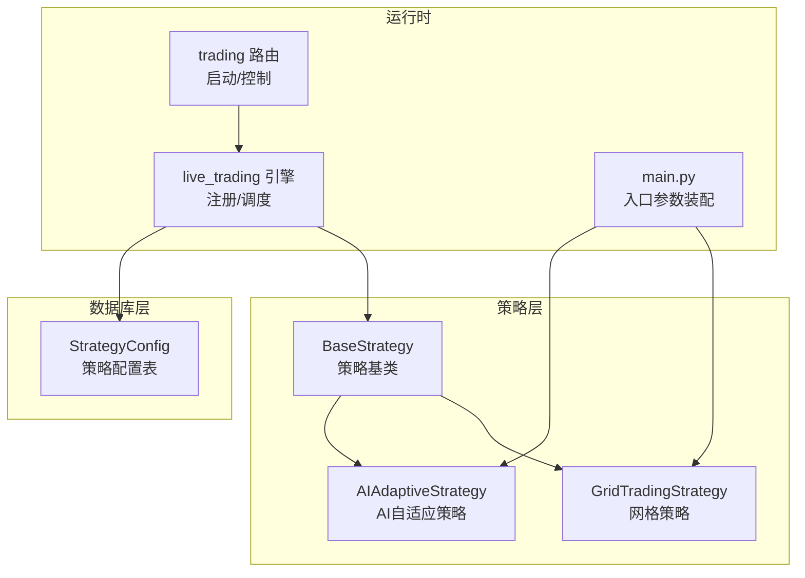
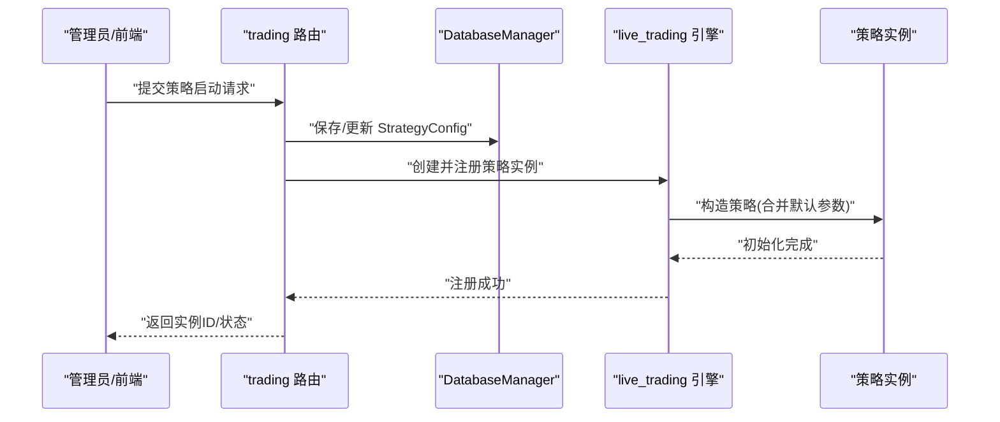
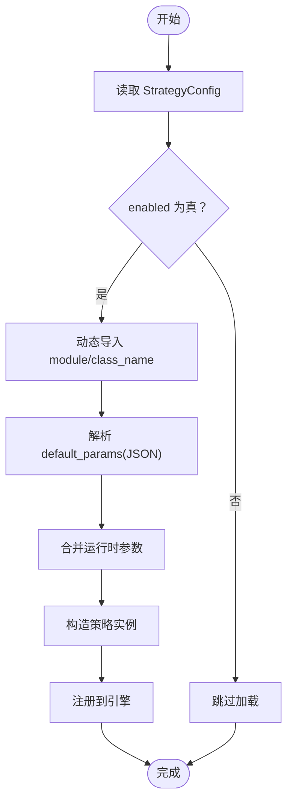
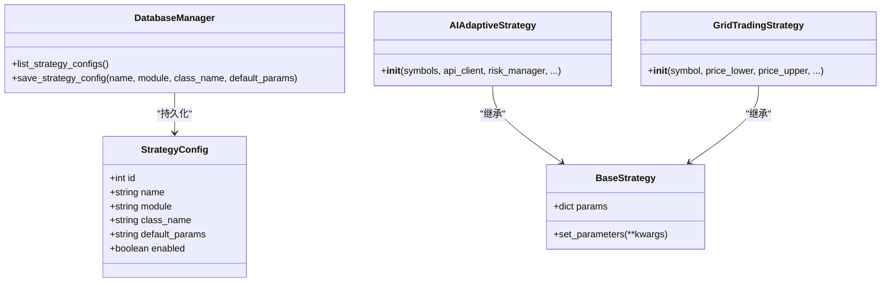

# 策略配置表 (StrategyConfig)

<cite>
**本文引用的文件**
- [database/models.py](file://backpack_quant_trading/database/models.py)
- [strategy/base.py](file://backpack_quant_trading/strategy/base.py)
- [strategy/ai_adaptive.py](file://backpack_quant_trading/strategy/ai_adaptive.py)
- [strategy/grid_strategy.py](file://backpack_quant_trading/strategy/grid_strategy.py)
- [api/routers/trading.py](file://backpack_quant_trading/api/routers/trading.py)
- [engine/live_trading.py](file://backpack_quant_trading/engine/live_trading.py)
- [main.py](file://backpack_quant_trading/main.py)
</cite>

## 目录
1. [简介](#简介)
2. [项目结构](#项目结构)
3. [核心组件](#核心组件)
4. [架构总览](#架构总览)
5. [详细组件分析](#详细组件分析)
6. [依赖分析](#依赖分析)
7. [性能考虑](#性能考虑)
8. [故障排查指南](#故障排查指南)
9. [结论](#结论)
10. [附录](#附录)

## 简介
本文件围绕策略配置表 StrategyConfig 的数据模型进行系统化说明，重点覆盖以下方面：
- 策略元数据存储结构：name、module、class_name 的关联关系与用途
- default_params 默认参数的 JSON 存储格式与参数合并/继承机制
- enabled 启用状态控制与策略动态加载流程
- 策略注册表的工作原理、参数继承机制与版本管理策略
- 策略配置的最佳实践与参数优化建议

## 项目结构
StrategyConfig 位于数据库层，作为策略元数据与默认参数的持久化载体，贯穿策略注册、加载、运行与治理的全生命周期。

图表来源
- [database/models.py:254-264](file://backpack_quant_trading/database/models.py#L254-L264)
- [strategy/base.py:41-91](file://backpack_quant_trading/strategy/base.py#L41-L91)
- [strategy/ai_adaptive.py:12-56](file://backpack_quant_trading/strategy/ai_adaptive.py#L12-L56)
- [strategy/grid_strategy.py:38-156](file://backpack_quant_trading/strategy/grid_strategy.py#L38-L156)
- [engine/live_trading.py:588-614](file://backpack_quant_trading/engine/live_trading.py#L588-L614)
- [api/routers/trading.py:334-404](file://backpack_quant_trading/api/routers/trading.py#L334-L404)
- [main.py:231-255](file://backpack_quant_trading/main.py#L231-L255)

章节来源
- [database/models.py:254-264](file://backpack_quant_trading/database/models.py#L254-L264)
- [engine/live_trading.py:588-614](file://backpack_quant_trading/engine/live_trading.py#L588-L614)

## 核心组件
- StrategyConfig 数据模型
  - 字段：id、name（唯一）、module、class_name、default_params（JSON 文本）、enabled（布尔）
  - 作用：统一存储策略元数据与默认参数，支持策略注册、动态加载与运行时参数装配
- BaseStrategy 策略基类
  - 提供 params 参数容器与 set_parameters 方法，支撑默认参数与运行时参数的合并
- 运行时装配
  - main.py 中根据策略名与参数装配策略实例
  - trading 路由负责启动策略实例并写入用户实例归属
  - live_trading 引擎负责注册策略并建立 symbol 映射

章节来源
- [database/models.py:254-264](file://backpack_quant_trading/database/models.py#L254-L264)
- [strategy/base.py:41-91](file://backpack_quant_trading/strategy/base.py#L41-L91)
- [main.py:231-255](file://backpack_quant_trading/main.py#L231-L255)
- [api/routers/trading.py:334-404](file://backpack_quant_trading/api/routers/trading.py#L334-L404)
- [engine/live_trading.py:588-614](file://backpack_quant_trading/engine/live_trading.py#L588-L614)

## 架构总览
StrategyConfig 在系统中的位置与交互如下：

图表来源
- [database/models.py:685-718](file://backpack_quant_trading/database/models.py#L685-L718)
- [api/routers/trading.py:334-404](file://backpack_quant_trading/api/routers/trading.py#L334-L404)
- [engine/live_trading.py:588-614](file://backpack_quant_trading/engine/live_trading.py#L588-L614)

## 详细组件分析

### 数据模型：StrategyConfig
- 结构要点
  - name：策略标识，唯一约束，用于策略检索与匹配
  - module/class_name：策略类定位信息，配合动态导入实现策略加载
  - default_params：JSON 文本，存储策略默认参数集合
  - enabled：启用开关，影响策略是否可被加载与运行
- 关系与约束
  - name 唯一，保证策略注册表的确定性
  - module/class_name 与 Python 动态导入结合，形成“模块路径 + 类名”的类定位
  - default_params 以 JSON 文本形式存储，便于跨语言/跨平台传输与持久化

章节来源
- [database/models.py:254-264](file://backpack_quant_trading/database/models.py#L254-L264)

### 参数存储与验证机制
- default_params JSON 存储
  - 以 Text 字段保存 JSON 字符串，字段名为 default_params
  - 建议遵循统一的键命名规范，避免与运行时参数冲突
- 参数合并与继承
  - BaseStrategy.params 作为参数容器，支持 set_parameters 动态更新
  - 典型策略（如 AIAdaptiveStrategy、GridTradingStrategy）在构造函数中接收运行时参数，并与默认参数进行合并
  - 合并策略示例：策略内部通过“默认参数优先，运行时参数覆盖”的方式组装最终参数集
- 参数验证建议
  - 在保存 default_params 时进行字段白名单校验与类型校验
  - 在策略构造阶段对关键参数进行范围与类型检查
  - 对于数值型参数，明确单位与精度要求（如百分比、小数位）

章节来源
- [database/models.py:262-262](file://backpack_quant_trading/database/models.py#L262-L262)
- [strategy/base.py:170-173](file://backpack_quant_trading/strategy/base.py#L170-L173)
- [strategy/ai_adaptive.py:17-42](file://backpack_quant_trading/strategy/ai_adaptive.py#L17-L42)
- [strategy/grid_strategy.py:41-68](file://backpack_quant_trading/strategy/grid_strategy.py#L41-L68)

### 启用状态控制与动态加载流程
- 启用状态
  - enabled 字段控制策略是否可用
  - 在策略注册与加载前，应检查 enabled 状态
- 动态加载
  - 通过 module/class_name 定位策略类，使用动态导入加载
  - 加载后，将 default_params 解析为字典并与运行时参数合并
  - 构造策略实例并注册到运行时引擎

图表来源
- [database/models.py:262-262](file://backpack_quant_trading/database/models.py#L262-L262)
- [database/models.py:685-718](file://backpack_quant_trading/database/models.py#L685-L718)

章节来源
- [database/models.py:254-264](file://backpack_quant_trading/database/models.py#L254-L264)
- [database/models.py:685-718](file://backpack_quant_trading/database/models.py#L685-L718)

### 策略注册表与实例管理
- 策略注册表
  - 以 StrategyConfig.name 为键，维护策略元数据与默认参数
  - 支持查询与更新，更新时可变更 module/class_name 与 default_params
- 实例管理
  - trading 路由在启动策略时，将实例信息写入用户实例归属表（config_json 仅存平台/策略/交易对等元数据）
  - live_trading 引擎负责策略注册与 symbol 映射，确保下单与数据通道一致

章节来源
- [database/models.py:685-718](file://backpack_quant_trading/database/models.py#L685-L718)
- [api/routers/trading.py:334-404](file://backpack_quant_trading/api/routers/trading.py#L334-L404)
- [engine/live_trading.py:588-614](file://backpack_quant_trading/engine/live_trading.py#L588-L614)

### 参数继承机制与版本管理策略
- 参数继承
  - default_params 作为“基线参数”，运行时参数作为“覆盖参数”
  - 合并时遵循“默认优先、运行时覆盖”的原则，避免误删关键参数
- 版本管理
  - 建议在 default_params 中加入版本号字段，便于灰度升级与回滚
  - 通过 enabled 字段实现策略停用与切换，避免破坏性更新
  - 对于重大参数变更，建议分阶段发布与参数迁移脚本

章节来源
- [strategy/ai_adaptive.py:17-42](file://backpack_quant_trading/strategy/ai_adaptive.py#L17-L42)
- [strategy/grid_strategy.py:41-68](file://backpack_quant_trading/strategy/grid_strategy.py#L41-L68)
- [database/models.py:262-262](file://backpack_quant_trading/database/models.py#L262-L262)

### 策略动态加载与运行时装配
- main.py 中根据策略名与参数装配策略实例，体现“策略名驱动”的装配逻辑
- trading 路由负责启动策略实例并写入用户实例归属，便于后续启停与状态管理
- live_trading 引擎负责注册策略并建立 symbol 映射，确保下单与数据通道一致

章节来源
- [main.py:231-255](file://backpack_quant_trading/main.py#L231-L255)
- [api/routers/trading.py:334-404](file://backpack_quant_trading/api/routers/trading.py#L334-L404)
- [engine/live_trading.py:588-614](file://backpack_quant_trading/engine/live_trading.py#L588-L614)

## 依赖分析
StrategyConfig 的依赖关系主要体现在数据库层与策略层之间的耦合与解耦设计。

图表来源
- [database/models.py:254-264](file://backpack_quant_trading/database/models.py#L254-L264)
- [database/models.py:685-718](file://backpack_quant_trading/database/models.py#L685-L718)
- [strategy/base.py:41-91](file://backpack_quant_trading/strategy/base.py#L41-L91)
- [strategy/ai_adaptive.py:12-56](file://backpack_quant_trading/strategy/ai_adaptive.py#L12-L56)
- [strategy/grid_strategy.py:38-156](file://backpack_quant_trading/strategy/grid_strategy.py#L38-L156)

章节来源
- [database/models.py:254-264](file://backpack_quant_trading/database/models.py#L254-L264)
- [strategy/base.py:41-91](file://backpack_quant_trading/strategy/base.py#L41-L91)

## 性能考虑
- default_params 体积控制
  - 仅存储必要参数，避免冗余字段导致序列化/反序列化开销
- 参数合并复杂度
  - 合并策略应尽量保持 O(n) 级别，避免深层嵌套与递归合并
- 动态导入与缓存
  - 对已加载的策略类进行缓存，减少重复导入带来的性能损耗
- 数据库访问
  - 对 StrategyConfig 的读取应加缓存或批量查询，降低数据库压力

## 故障排查指南
- 策略无法加载
  - 检查 enabled 是否为真
  - 校验 module/class_name 是否正确，确认动态导入路径有效
  - 验证 default_params JSON 格式是否合法
- 参数异常
  - 检查 default_params 与运行时参数的键名是否冲突
  - 确认参数类型与范围是否符合策略预期
- 实例状态异常
  - 检查 trading 路由是否正确写入用户实例归属
  - 确认 live_trading 引擎注册流程是否成功

章节来源
- [database/models.py:262-262](file://backpack_quant_trading/database/models.py#L262-L262)
- [database/models.py:685-718](file://backpack_quant_trading/database/models.py#L685-L718)
- [api/routers/trading.py:334-404](file://backpack_quant_trading/api/routers/trading.py#L334-L404)
- [engine/live_trading.py:588-614](file://backpack_quant_trading/engine/live_trading.py#L588-L614)

## 结论
StrategyConfig 作为策略元数据与默认参数的核心载体，通过清晰的字段设计与严格的参数合并机制，实现了策略的标准化注册、动态加载与运行时装配。结合 enabled 控制与实例管理，系统能够在保证稳定性的同时，灵活支持策略演进与版本管理。建议在实际落地中强化参数校验与版本治理，持续优化参数合并与动态导入的性能与可靠性。

## 附录
- 最佳实践清单
  - default_params 采用最小可用集，避免冗余
  - 参数键名统一命名规范，避免与运行时参数冲突
  - 在保存 default_params 前进行白名单与类型校验
  - 使用 enabled 字段进行策略停用与切换
  - 对策略类动态导入进行缓存与异常处理
  - 在策略构造阶段对关键参数进行范围与类型检查
  - 为 default_params 引入版本号字段，支持灰度与回滚
  - 对数据库访问进行缓存与批量查询优化