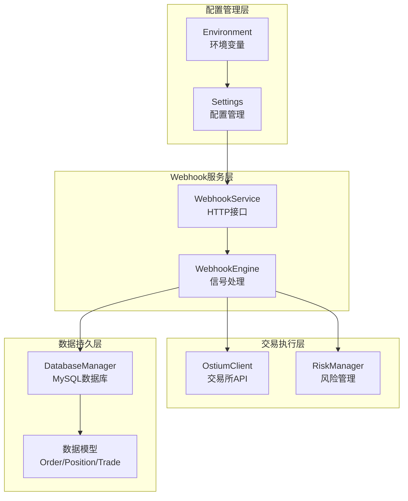
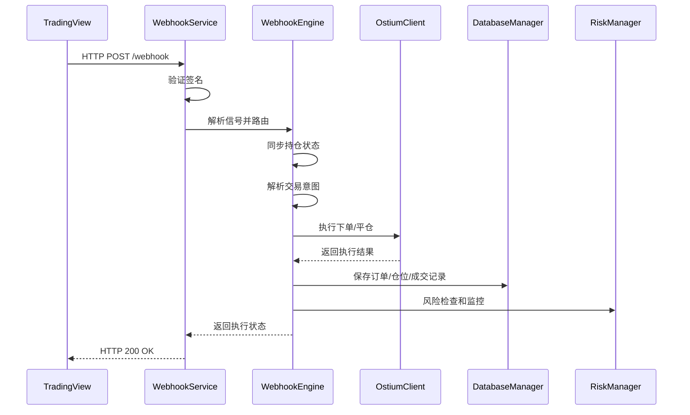
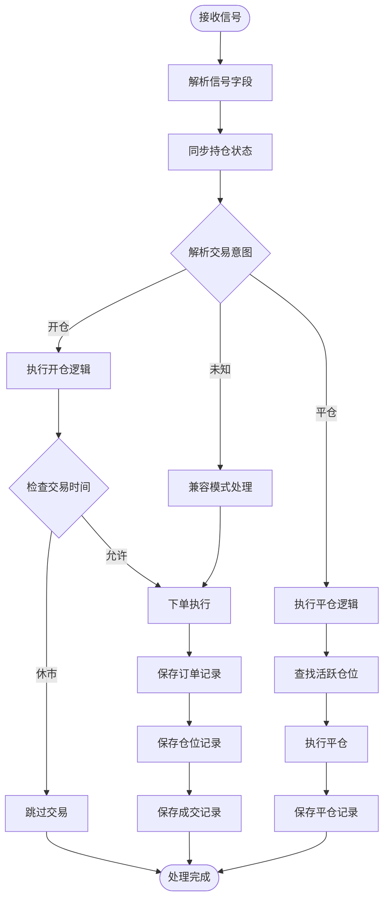
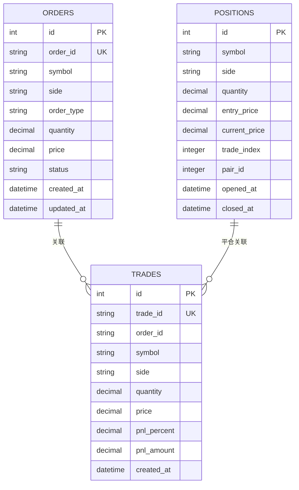
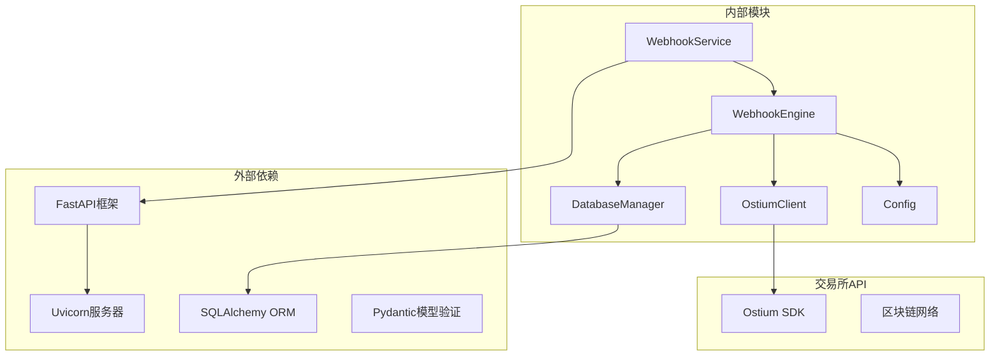

# Webhook交易引擎

<cite>
**本文档引用的文件**
- [webhook_trading.py](file://backpack_quant_trading/engine/webhook_trading.py)
- [webhook_service.py](file://backpack_quant_trading/webhook_service.py)
- [settings.py](file://backpack_quant_trading/config/settings.py)
- [ostium_client.py](file://backpack_quant_trading/core/ostium_client.py)
- [models.py](file://backpack_quant_trading/database/models.py)
- [main.py](file://backpack_quant_trading/main.py)
- [dual_freq_trend.pine](file://tradingview_dual_freq/dual_freq_trend.pine)
- [comprehensive.pine](file://tradingview_comprehensive/comprehensive.pine)
</cite>

## 目录
1. [简介](#简介)
2. [项目结构](#项目结构)
3. [核心组件](#核心组件)
4. [架构概览](#架构概览)
5. [详细组件分析](#详细组件分析)
6. [依赖关系分析](#依赖关系分析)
7. [性能考虑](#性能考虑)
8. [故障排除指南](#故障排除指南)
9. [结论](#结论)

## 简介

Webhook交易引擎是一个基于TradingView信号的自动化交易系统，专为Ostium交易所设计。该系统能够接收TradingView的Webhook通知，解析交易信号，执行自动交易，并提供完整的风险管理功能。

该引擎的核心特点包括：
- 支持多实例管理，可同时控制多个交易账户
- 基于TradingView信号的自动交易执行
- 完整的风险管理系统，包括止损和熔断机制
- 实时监控和通知功能
- 支持广播模式和单实例模式
- 完整的数据库记录和审计功能

## 项目结构

项目采用模块化架构，主要包含以下核心模块：

**图表来源**
- [webhook_service.py:1-598](file://backpack_quant_trading/webhook_service.py#L1-598)
- [webhook_trading.py:1-684](file://backpack_quant_trading/engine/webhook_trading.py#L1-684)
- [ostium_client.py:1-800](file://backpack_quant_trading/core/ostium_client.py#L1-800)

**章节来源**
- [webhook_service.py:1-598](file://backpack_quant_trading/webhook_service.py#L1-598)
- [webhook_trading.py:1-684](file://backpack_quant_trading/engine/webhook_trading.py#L1-684)
- [settings.py:1-137](file://backpack_quant_trading/config/settings.py#L1-137)

## 核心组件

### WebhookTradingEngine 核心引擎

WebhookTradingEngine是整个系统的核心，负责处理所有交易逻辑：

**主要功能特性：**
- 信号解析和意图识别
- 多实例状态管理
- 风险控制和熔断机制
- 实时监控和通知
- 数据库持久化

**关键配置参数：**
- 止损比例：默认5%，可动态调整
- 止盈比例：默认20%，可动态调整
- 杠杆倍数：支持1-200x范围
- 保证金范围：支持随机范围配置

**章节来源**
- [webhook_trading.py:40-90](file://backpack_quant_trading/engine/webhook_trading.py#L40-90)

### TradingViewSignal 信号模型

定义了TradingView信号的标准格式：

**信号字段：**
- `signal`: 交易信号（buy/sell/close）
- `symbol`: 交易对符号（如ETH-USD）
- `instance_id`: 实例ID（多实例路由）
- `strategy_name`: 策略名称（广播筛选）
- `price`: 价格信息
- `timestamp`: 时间戳
- `indicator`: 指标信息
- `action`: 操作类型

**章节来源**
- [webhook_trading.py:22-38](file://backpack_quant_trading/engine/webhook_trading.py#L22-38)

### WebhookService HTTP服务

提供RESTful API接口：

**核心接口：**
- `/webhook` - 统一Webhook接收接口
- `/register_instance` - 实例注册
- `/unregister_instance` - 实例注销
- `/instances` - 实例列表查询
- `/balance/{instance_id}` - 余额查询
- `/reset/{instance_id}` - 熔断重置

**章节来源**
- [webhook_service.py:319-478](file://backpack_quant_trading/webhook_service.py#L319-478)

## 架构概览

系统采用分层架构设计，确保高内聚低耦合：

**图表来源**
- [webhook_service.py:319-437](file://backpack_quant_trading/webhook_service.py#L319-437)
- [webhook_trading.py:208-294](file://backpack_quant_trading/engine/webhook_trading.py#L208-294)

## 详细组件分析

### 信号处理流程

系统采用智能信号解析机制，能够处理复杂的TradingView信号：

**图表来源**
- [webhook_trading.py:208-540](file://backpack_quant_trading/engine/webhook_trading.py#L208-540)

### 风险管理机制

系统内置多层次风险控制：

**实时止损监控：**
- 每15秒检查一次持仓
- 自动触发止损条件
- 熔断机制防止连续亏损

**休市监控：**
- 检测北京时间休市时段
- 自动平仓保护资金安全

**熔断机制：**
- 系统级熔断保护
- 手动重置功能
- 钉钉通知提醒

**章节来源**
- [webhook_trading.py:627-684](file://backpack_quant_trading/engine/webhook_trading.py#L627-684)

### 数据库架构

采用完整的交易数据记录体系：

**图表来源**
- [models.py:65-151](file://backpack_quant_trading/database/models.py#L65-151)

**章节来源**
- [models.py:267-454](file://backpack_quant_trading/database/models.py#L267-454)

### TradingView信号集成

系统支持多种TradingView策略信号：

**双频趋势策略（DualFreq）：**
- 15分钟趋势 + 1分钟入场
- 多指标综合评分
- 加权分挡位下单
- 支持分批止盈

**综合策略（Comprehensive）：**
- 多指标评分开仓
- 布林带、RSI、MACD
- K线形态识别
- 趋势过滤机制

**章节来源**
- [dual_freq_trend.pine:1-352](file://tradingview_dual_freq/dual_freq_trend.pine#L1-352)
- [comprehensive.pine:1-283](file://tradingview_comprehensive/comprehensive.pine#L1-283)

## 依赖关系分析

系统采用清晰的依赖层次结构：

**图表来源**
- [webhook_service.py:1-50](file://backpack_quant_trading/webhook_service.py#L1-50)
- [ostium_client.py:19-80](file://backpack_quant_trading/core/ostium_client.py#L19-80)

**章节来源**
- [webhook_service.py:1-50](file://backpack_quant_trading/webhook_service.py#L1-50)
- [ostium_client.py:19-80](file://backpack_quant_trading/core/ostium_client.py#L19-80)

## 性能考虑

### 并发处理
- 使用asyncio实现异步并发
- 引擎实例间互不影响
- 信号处理非阻塞执行

### 资源管理
- 连接池管理数据库连接
- 事件循环正确关闭
- 内存泄漏防护

### 缓存策略
- 本地持仓状态缓存
- 价格查询缓存
- 配置参数缓存

## 故障排除指南

### 常见问题诊断

**Webhook接收失败：**
1. 检查签名验证配置
2. 确认实例ID正确注册
3. 验证请求格式符合标准

**交易执行错误：**
1. 检查交易所API连接
2. 验证私钥配置正确
3. 确认余额充足

**数据库连接问题：**
1. 检查MySQL服务状态
2. 验证连接参数配置
3. 确认表结构完整

### 调试方法

**日志分析：**
- 查看webhook_server.log
- 检查数据库操作日志
- 监控实时交易日志

**状态检查：**
- `/health` 接口健康检查
- `/instances` 实例状态查询
- `/balance/{instance_id}` 余额查询

**章节来源**
- [webhook_service.py:79-81](file://backpack_quant_trading/webhook_service.py#L79-81)
- [webhook_service.py:292-317](file://backpack_quant_trading/webhook_service.py#L292-317)

## 结论

Webhook交易引擎提供了一个完整、可靠的自动化交易解决方案。其设计特点包括：

**技术优势：**
- 模块化架构，易于扩展和维护
- 完善的风险管理体系
- 实时监控和通知机制
- 数据持久化和审计功能

**应用场景：**
- TradingView信号自动化执行
- 多账户同时交易管理
- 实时风险监控
- 策略回测和实盘结合

**未来发展：**
- 支持更多交易所集成
- 增强机器学习策略
- 优化性能和扩展性
- 完善监控和告警系统

该系统为量化交易提供了坚实的技术基础，能够满足专业交易者的需求。