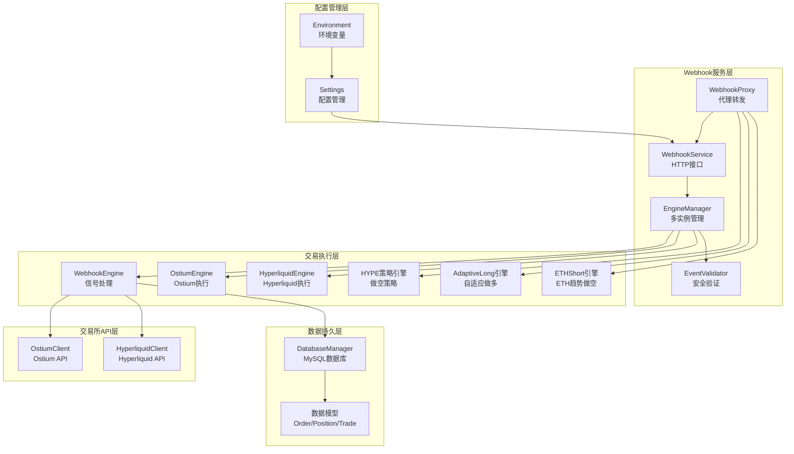
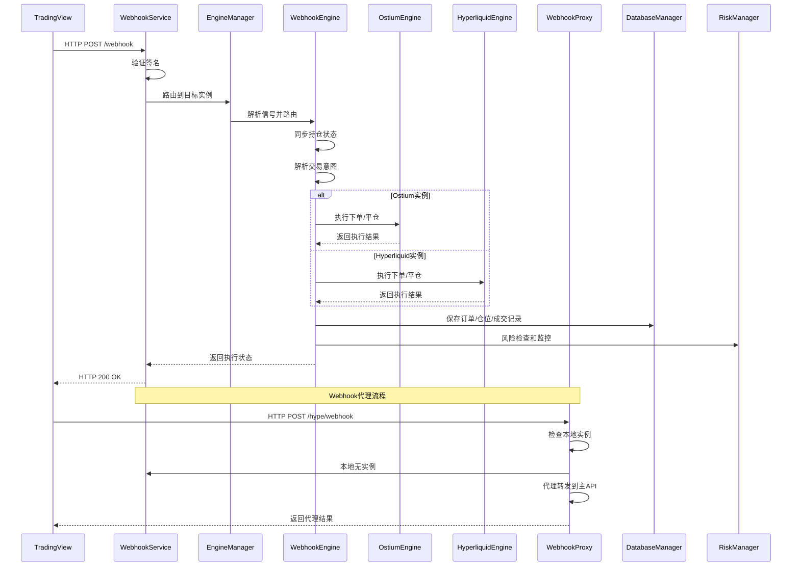
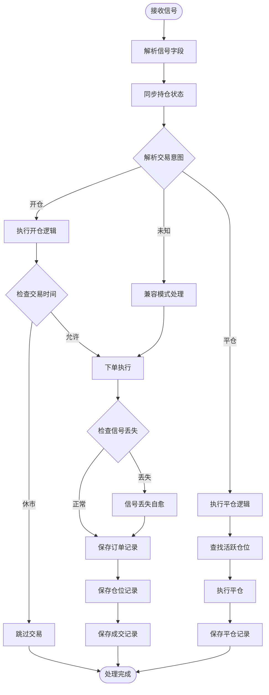
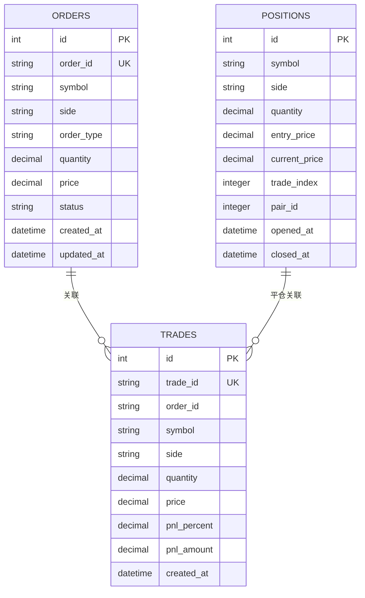
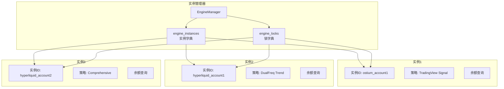
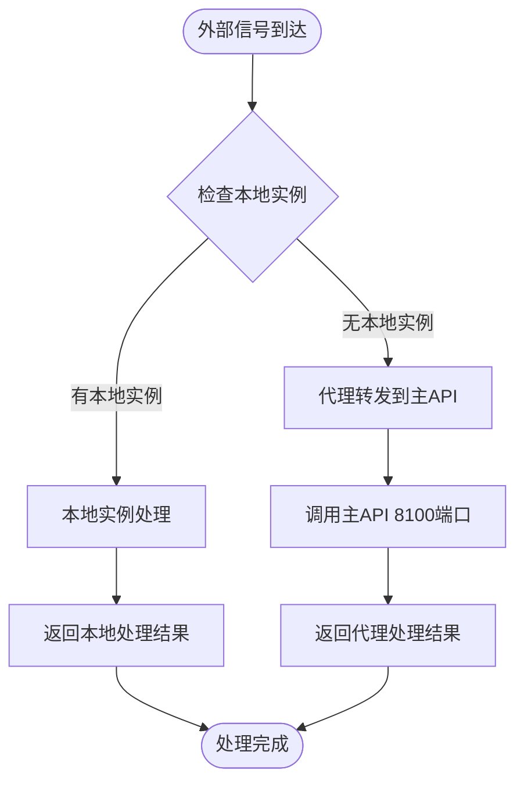
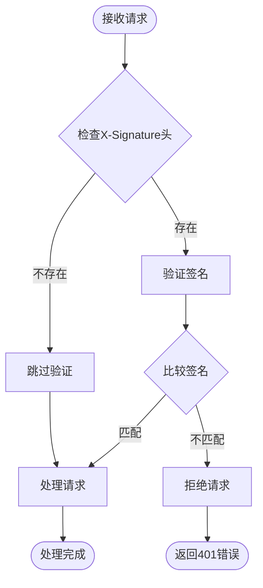

# Webhook交易引擎

<cite>
**本文档引用的文件**
- [webhook_trading.py](file://backpack_quant_trading/engine/webhook_trading.py)
- [webhook_service.py](file://backpack_quant_trading/webhook_service.py)
- [settings.py](file://backpack_quant_trading/config/settings.py)
- [ostium_client.py](file://backpack_quant_trading/core/ostium_client.py)
- [models.py](file://backpack_quant_trading/database/models.py)
- [main.py](file://backpack_quant_trading/main.py)
- [dual_freq_trend.pine](file://tradingview_dual_freq/dual_freq_trend.pine)
- [comprehensive.pine](file://tradingview_comprehensive/comprehensive.pine)
- [README.md](file://backpack_quant_trading/tools/proxy/README.md)
- [start_api_with_proxy.sh](file://backpack_quant_trading/tools/proxy/start_api_with_proxy.sh)
</cite>

## 更新摘要
**变更内容**
- 新增多实例引擎管理架构，支持同时控制多个交易账户
- 增强安全验证机制，支持签名验证和实例路由
- 改进错误处理和异常恢复机制
- 新增Hyperliquid交易所支持和多交易所集成
- 增强广播模式功能，支持策略名和交易对筛选
- 优化信号处理流程，增加信号丢失自愈机制
- **新增Webhook代理功能**：支持外部交易信号转发到主API
- **新增adaptive-long策略代理**：支持自适应做多策略信号透传
- **新增eth-trend-short策略代理**：支持ETH趋势做空策略信号透传
- **增强HYPE策略代理**：改进本地实例优先处理机制

## 目录
1. [简介](#简介)
2. [项目结构](#项目结构)
3. [核心组件](#核心组件)
4. [架构概览](#架构概览)
5. [详细组件分析](#详细组件分析)
6. [多实例管理](#多实例管理)
7. [Webhook代理功能](#webhook代理功能)
8. [安全验证机制](#安全验证机制)
9. [依赖关系分析](#依赖关系分析)
10. [性能考虑](#性能考虑)
11. [故障排除指南](#故障排除指南)
12. [结论](#结论)

## 简介

Webhook交易引擎是一个基于TradingView信号的自动化交易系统，专为Ostium交易所设计，现已扩展支持多实例管理和多交易所集成。该系统能够接收TradingView的Webhook通知，解析交易信号，执行自动交易，并提供完整的风险管理功能。

**新增功能**：
- **Webhook代理转发**：支持将外部交易信号转发到主API进行处理
- **多策略代理**：支持adaptive-long和eth-trend-short策略的信号透传
- **智能路由机制**：本地实例优先，远程代理降级处理
- **增强的HYPE策略支持**：改进的本地实例管理和代理转发

该引擎的核心特点包括：
- **多实例管理**：支持同时控制多个交易账户，每个实例独立配置
- **多交易所支持**：原生支持Ostium和Hyperliquid交易所
- **增强安全验证**：支持签名验证和实例路由，确保交易安全
- **智能信号处理**：基于TradingView信号的自动交易执行
- **完善的风险管理**：包括止损、熔断机制和休市监控
- **广播模式支持**：支持按策略名和交易对筛选的广播功能
- **实时监控和通知**：完整的数据库记录和审计功能
- **Webhook代理功能**：支持外部交易信号转发和多策略代理

## 项目结构

项目采用模块化架构，主要包含以下核心模块：



**图表来源**
- [webhook_service.py:28-33](file://backpack_quant_trading/webhook_service.py#L28-L33)
- [webhook_trading.py:40-90](file://backpack_quant_trading/engine/webhook_trading.py#L40-L90)
- [ostium_client.py:19-80](file://backpack_quant_trading/core/ostium_client.py#L19-L80)

**章节来源**
- [webhook_service.py:28-33](file://backpack_quant_trading/webhook_service.py#L28-L33)
- [webhook_trading.py:40-90](file://backpack_quant_trading/engine/webhook_trading.py#L40-L90)
- [settings.py:1-149](file://backpack_quant_trading/config/settings.py#L1-149)

## 核心组件

### WebhookTradingEngine 核心引擎

WebhookTradingEngine是整个系统的核心，负责处理所有交易逻辑：

**主要功能特性：**
- 信号解析和意图识别
- 多实例状态管理
- 风险控制和熔断机制
- 实时监控和通知
- 数据库持久化

**关键配置参数：**
- 止损比例：默认5%，可动态调整
- 止盈比例：默认20%，可动态调整
- 杠杆倍数：支持1-200x范围
- 保证金范围：支持随机范围配置

**新增功能：**
- 信号丢失自愈机制
- 交易对切换支持
- 实例ID和策略名管理

**章节来源**
- [webhook_trading.py:40-90](file://backpack_quant_trading/engine/webhook_trading.py#L40-L90)

### TradingViewSignal 信号模型

定义了TradingView信号的标准格式：

**信号字段：**
- `signal`: 交易信号（buy/sell/close）
- `symbol`: 交易对符号（如ETH-USD）
- `instance_id`: 实例ID（多实例路由）
- `strategy_name`: 策略名称（广播筛选）
- `price`: 价格信息
- `timestamp`: 时间戳
- `indicator`: 指标信息
- `action`: 操作类型
- `exchange`: 交易所类型（新增）
- `ticker`: 交易代码（新增）
- `先前仓位`: 先前仓位状态（新增）
- `先前仓位大小`: 先前仓位大小（新增）

**章节来源**
- [webhook_trading.py:22-38](file://backpack_quant_trading/engine/webhook_trading.py#L22-L38)

### WebhookService HTTP服务

提供RESTful API接口：

**核心接口：**
- `/webhook` - 统一Webhook接收接口（支持单实例和广播模式）
- `/register_instance` - 实例注册（支持Ostium和Hyperliquid）
- `/unregister_instance/{instance_id}` - 实例注销
- `/instances` - 实例列表查询
- `/balance/{instance_id}` - 余额查询
- `/reset/{instance_id}` - 熔断重置
- `/update_config/{instance_id}` - 动态配置更新

**新增功能：**
- 多交易所实例管理
- 策略名和交易对筛选
- 实例锁管理
- **Webhook代理接口**：支持外部信号转发
- **HYPE策略代理**：本地实例优先，远程代理降级
- **adaptive-long代理**：自适应做多策略透传
- **eth-trend-short代理**：ETH趋势做空策略透传

**章节来源**
- [webhook_service.py:319-842](file://backpack_quant_trading/webhook_service.py#L319-L842)

## 架构概览

系统采用分层架构设计，确保高内聚低耦合：



**图表来源**
- [webhook_service.py:319-437](file://backpack_quant_trading/webhook_service.py#L319-L437)
- [webhook_trading.py:208-294](file://backpack_quant_trading/engine/webhook_trading.py#L208-L294)

## 详细组件分析

### 信号处理流程

系统采用智能信号解析机制，能够处理复杂的TradingView信号：



**图表来源**
- [webhook_trading.py:208-540](file://backpack_quant_trading/engine/webhook_trading.py#L208-L540)

### 风险管理机制

系统内置多层次风险控制：

**实时止损监控：**
- 每15秒检查一次持仓
- 自动触发止损条件
- 熔断机制防止连续亏损

**休市监控：**
- 检测北京时间休市时段
- 自动平仓保护资金安全

**信号丢失自愈：**
- 检测重复相同信号
- 自动强平并进入同步模式
- 防止信号丢失导致的错误交易

**章节来源**
- [webhook_trading.py:627-684](file://backpack_quant_trading/engine/webhook_trading.py#L627-L684)

### 数据库架构

采用完整的交易数据记录体系：



**图表来源**
- [models.py:65-151](file://backpack_quant_trading/database/models.py#L65-L151)

**章节来源**
- [models.py:267-454](file://backpack_quant_trading/database/models.py#L267-L454)

### TradingView信号集成

系统支持多种TradingView策略信号：

**双频趋势策略（DualFreq）：**
- 15分钟趋势 + 1分钟入场
- 多指标综合评分
- 加权分挡位下单
- 支持分批止盈

**综合策略（Comprehensive）：**
- 多指标评分开仓
- 布林带、RSI、MACD
- K线形态识别
- 趋势过滤机制

**章节来源**
- [dual_freq_trend.pine:1-352](file://tradingview_dual_freq/dual_freq_trend.pine#L1-L352)
- [comprehensive.pine:1-283](file://tradingview_comprehensive/comprehensive.pine#L1-L283)

## 多实例管理

### 实例管理架构

系统支持多实例管理，每个实例独立配置和运行：



**图表来源**
- [webhook_service.py:28-33](file://backpack_quant_trading/webhook_service.py#L28-L33)

### 实例注册流程

**支持的实例类型：**
- **Ostium实例**：传统Ostium交易所账户
- **Hyperliquid实例**：支持Hyperliquid交易所账户
- **混合部署**：同一服务中同时支持多种实例类型

**注册参数：**
- `instance_id`: 实例唯一标识符
- `private_key`: 交易所私钥
- `exchange`: 交易所类型（ostium/hyperliquid）
- `strategy_name`: 策略名称（用于广播筛选）
- `symbol`: 交易对
- `leverage`: 杠杆倍数
- `margin_amount`: 保证金金额或范围

**章节来源**
- [webhook_service.py:83-244](file://backpack_quant_trading/webhook_service.py#L83-L244)

## Webhook代理功能

### 代理架构设计

系统新增了完整的Webhook代理功能，支持外部交易信号转发：



**图表来源**
- [webhook_service.py:667-723](file://backpack_quant_trading/webhook_service.py#L667-L723)

### HYPE策略代理

**本地优先处理机制：**
- 首先检查本地`hype_instances`是否有运行中的实例
- 如果有本地实例，直接处理信号
- 如果无本地实例，代理转发到主API

**代理配置：**
- 本地代理地址：`http://localhost:8100/api/trading/hype/webhook`
- 超时时间：10秒
- 错误处理：返回503状态码和详细错误信息

**章节来源**
- [webhook_service.py:667-723](file://backpack_quant_trading/webhook_service.py#L667-L723)

### adaptive-long策略代理

**透传机制：**
- 接收来自外部的adaptive-long策略信号
- 直接转发到主API的相应接口
- 保持原始信号格式不变

**接口映射：**
- 本地接口：`/adaptive-long/webhook`
- 主API接口：`http://127.0.0.1:8100/api/trading/adaptive-long/webhook`

**错误处理：**
- HTTP状态码>=400时，抛出HTTPException
- 透传失败时，返回503状态码和详细错误信息

**章节来源**
- [webhook_service.py:782-809](file://backpack_quant_trading/webhook_service.py#L782-L809)

### eth-trend-short策略代理

**透传机制：**
- 接收来自外部的eth-trend-short策略信号
- 直接转发到主API的相应接口
- 保持原始信号格式不变

**接口映射：**
- 本地接口：`/eth-trend-short/webhook`
- 主API接口：`http://127.0.0.1:8100/api/trading/eth-trend-short/webhook`

**错误处理：**
- HTTP状态码>=400时，抛出HTTPException
- 透传失败时，返回503状态码和详细错误信息

**章节来源**
- [webhook_service.py:815-842](file://backpack_quant_trading/webhook_service.py#L815-L842)

### 代理转发最佳实践

**配置要求：**
- 主API必须在8100端口运行
- 网络连接必须畅通
- 超时时间设置合理（默认10秒）

**监控和日志：**
- 代理转发状态记录在日志中
- 错误信息包含详细的故障原因
- 支持本地实例优先的降级处理

**章节来源**
- [webhook_service.py:700-717](file://backpack_quant_trading/webhook_service.py#L700-L717)

## 安全验证机制

### 签名验证架构

系统采用双重安全验证机制：



**图表来源**
- [webhook_service.py:34-46](file://backpack_quant_trading/webhook_service.py#L34-L46)

### 验证流程

**单实例模式验证：**
- 检查实例是否存在
- 验证请求头中的签名
- 解析信号并执行

**广播模式验证：**
- 验证签名（对所有实例使用相同签名）
- 按策略名和交易对筛选目标实例
- 广播到匹配的实例

**代理模式验证：**
- 代理接口不进行签名验证
- 直接转发到主API
- 主API负责签名验证

**配置要求：**
- `WEBHOOK_SECRET`: Webhook密钥
- `OSTIUM_PRIVATE_KEY`: Ostium私钥
- `HYPERLIQUID_PRIVATE_KEY`: Hyperliquid私钥

**章节来源**
- [webhook_service.py:34-46](file://backpack_quant_trading/webhook_service.py#L34-L46)
- [settings.py:80-88](file://backpack_quant_trading/config/settings.py#L80-L88)

## 依赖关系分析

系统采用清晰的依赖层次结构：

```mermaid
graph TB
subgraph "外部依赖"
FASTAPI[FastAPI框架]
UVICORN[Uvicorn服务器]
SQLALCHEMY[SQLAlchemy ORM]
PYDANTIC[Pydantic模型验证]
OSTIUM_SDK[Ostium SDK]
HYPERLIQUID_SDK[Hyperliquid SDK]
HTTPX[HTTPX异步HTTP客户端]
AIOHTTP[AIOHTTP异步HTTP客户端]
END
subgraph "内部模块"
WEBHOOK_SERVICE[WebhookService]
ENGINE_MANAGER[EngineManager]
WEBHOOK_ENGINE[WebhookEngine]
OSTIUM_CLIENT[OstiumClient]
HYPERLIQUID_CLIENT[HyperliquidClient]
DATABASE_MANAGER[DatabaseManager]
CONFIG[Config]
EVENT_VALIDATOR[EventValidator]
HYPE_STRATEGY[HYPEAdaptiveShortStrategy]
ADAPTIVE_LONG[AdaptiveLongStrategy]
ETH_TREND_SHORT[ETHTrendShortStrategy]
end
WEBHOOK_SERVICE --> ENGINE_MANAGER
ENGINE_MANAGER --> WEBHOOK_ENGINE
ENGINE_MANAGER --> EVENT_VALIDATOR
WEBHOOK_ENGINE --> OSTIUM_CLIENT
WEBHOOK_ENGINE --> HYPERLIQUID_CLIENT
WEBHOOK_ENGINE --> DATABASE_MANAGER
WEBHOOK_ENGINE --> CONFIG
OSTIUM_CLIENT --> OSTIUM_SDK
HYPERLIQUID_CLIENT --> HYPERLIQUID_SDK
DATABASE_MANAGER --> SQLALCHEMY
WEBHOOK_SERVICE --> FASTAPI
FASTAPI --> UVICORN
WEBHOOK_SERVICE --> HTTPX
WEBHOOK_SERVICE --> AIOHTTP
WEBHOOK_SERVICE --> HYPE_STRATEGY
WEBHOOK_SERVICE --> ADAPTIVE_LONG
WEBHOOK_SERVICE --> ETH_TREND_SHORT
```

**图表来源**
- [webhook_service.py:1-50](file://backpack_quant_trading/webhook_service.py#L1-L50)
- [ostium_client.py:19-80](file://backpack_quant_trading/core/ostium_client.py#L19-L80)

**章节来源**
- [webhook_service.py:1-50](file://backpack_quant_trading/webhook_service.py#L1-L50)
- [ostium_client.py:19-80](file://backpack_quant_trading/core/ostium_client.py#L19-L80)

## 性能考虑

### 并发处理
- 使用asyncio实现异步并发
- 引擎实例间互不影响
- 信号处理非阻塞执行
- 实例锁管理确保线程安全
- **代理请求使用异步HTTP客户端**

### 资源管理
- 连接池管理数据库连接
- 事件循环正确关闭
- 内存泄漏防护
- 实例资源清理
- **代理客户端连接池管理**

### 缓存策略
- 本地持仓状态缓存
- 价格查询缓存
- 配置参数缓存
- 实例状态缓存
- **代理请求结果缓存（可选）**

## 故障排除指南

### 常见问题诊断

**Webhook接收失败：**
1. 检查签名验证配置
2. 确认实例ID正确注册
3. 验证请求格式符合标准
4. 检查X-Signature头是否正确设置

**交易执行错误：**
1. 检查交易所API连接
2. 验证私钥配置正确
3. 确认余额充足
4. 检查实例类型配置

**多实例管理问题：**
1. 检查实例ID唯一性
2. 验证实例配置完整性
3. 确认实例锁状态
4. 检查广播筛选条件

**数据库连接问题：**
1. 检查MySQL服务状态
2. 验证连接参数配置
3. 确认表结构完整
4. 检查数据库权限

**代理转发问题：**
1. 检查主API服务状态
2. 验证网络连接
3. 确认端口监听状态
4. 检查代理超时配置

**章节来源**
- [webhook_service.py:79-81](file://backpack_quant_trading/webhook_service.py#L79-L81)
- [webhook_service.py:292-317](file://backpack_quant_trading/webhook_service.py#L292-L317)

### 调试方法

**日志分析：**
- 查看webhook_server.log
- 检查数据库操作日志
- 监控实时交易日志
- 分析实例管理日志
- **监控代理转发日志**

**状态检查：**
- `/health` 接口健康检查
- `/instances` 实例状态查询
- `/balance/{instance_id}` 余额查询
- `/hype/position` Hyperliquid仓位查询
- **代理接口状态检查**

**代理调试：**
- 检查主API 8100端口状态
- 验证代理转发路径
- 监控代理请求响应时间
- 分析代理错误日志

**章节来源**
- [webhook_service.py:79-81](file://backpack_quant_trading/webhook_service.py#L79-L81)
- [webhook_service.py:292-317](file://backpack_quant_trading/webhook_service.py#L292-L317)

## 结论

Webhook交易引擎提供了一个完整、可靠的自动化交易解决方案。其设计特点包括：

**技术优势：**
- 模块化架构，易于扩展和维护
- 多实例管理，支持同时控制多个交易账户
- 多交易所集成，支持Ostium和Hyperliquid
- 完善的安全验证机制
- 智能信号处理和自愈机制
- 实时监控和通知机制
- 数据持久化和审计功能
- **Webhook代理功能，支持外部信号转发**
- **多策略代理支持，增强系统灵活性**

**应用场景：**
- TradingView信号自动化执行
- 多账户同时交易管理
- 实时风险监控
- 策略回测和实盘结合
- 跨交易所交易管理
- **外部交易信号集成**
- **分布式策略部署**

**未来发展：**
- 支持更多交易所集成
- 增强机器学习策略
- 优化性能和扩展性
- 完善监控和告警系统
- 增强多语言支持
- **扩展代理功能，支持更多策略透传**
- **增强代理可靠性，支持负载均衡**

该系统为量化交易提供了坚实的技术基础，能够满足专业交易者的需求，特别是需要多实例管理和多交易所支持的高级用户。新增的Webhook代理功能进一步增强了系统的灵活性和可扩展性，使其能够更好地适应复杂的交易环境和多样化的策略需求。