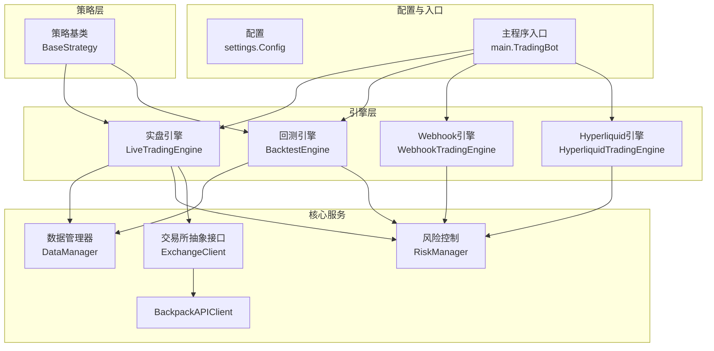
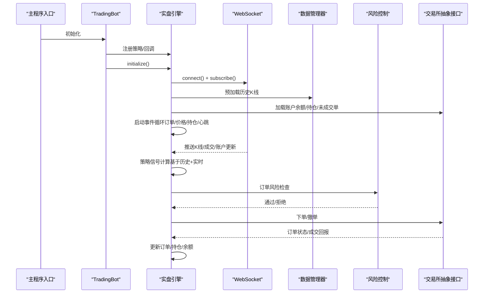
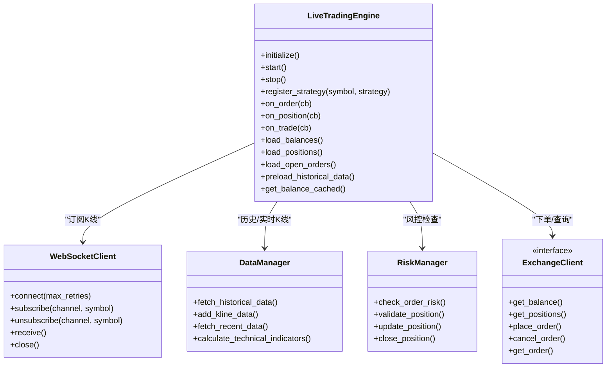
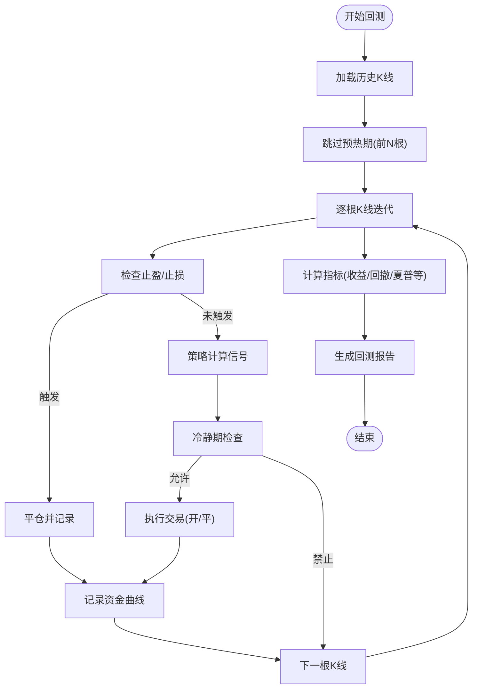
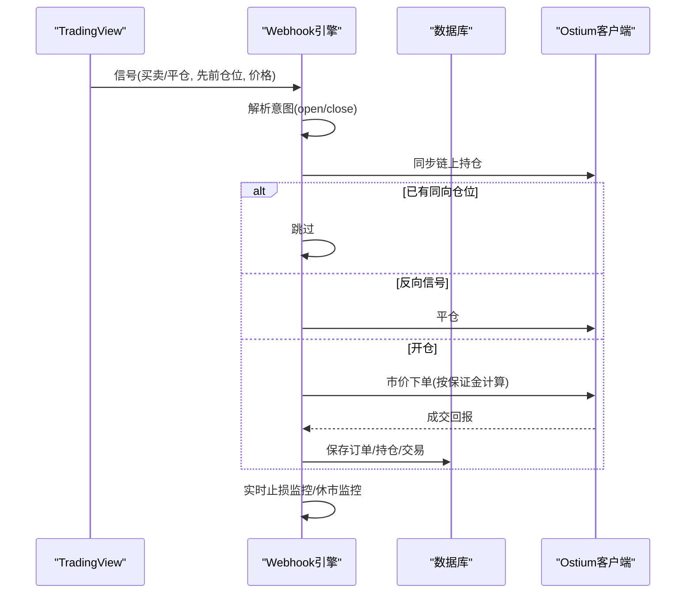
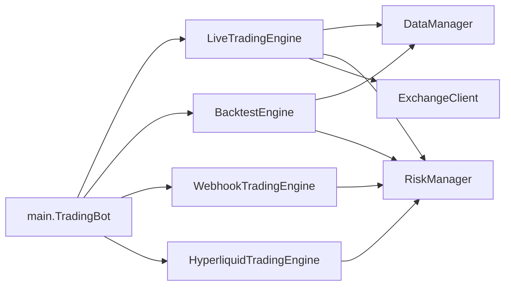

# 交易引擎

<cite>
**本文档引用的文件**
- [engine/live_trading.py](file://engine/live_trading.py)
- [engine/backtest.py](file://engine/backtest.py)
- [engine/webhook_trading.py](file://engine/webhook_trading.py)
- [engine/hyperliquid_trading.py](file://engine/hyperliquid_trading.py)
- [core/data_manager.py](file://core/data_manager.py)
- [core/risk_manager.py](file://core/risk_manager.py)
- [core/api_client.py](file://core/api_client.py)
- [strategy/base.py](file://strategy/base.py)
- [config/settings.py](file://config/settings.py)
- [main.py](file://main.py)
</cite>

## 目录
1. [简介](#简介)
2. [项目结构](#项目结构)
3. [核心组件](#核心组件)
4. [架构总览](#架构总览)
5. [详细组件分析](#详细组件分析)
6. [依赖关系分析](#依赖关系分析)
7. [性能考虑](#性能考虑)
8. [故障排查指南](#故障排查指南)
9. [结论](#结论)
10. [附录](#附录)

## 简介
本文件面向交易引擎的实盘、回测与Webhook三种模式，系统性梳理其架构设计、初始化流程、事件循环、订单管理与风险控制集成，以及不同模式下的数据流、信号转换与执行差异。文档同时提供与API客户端、数据管理器的协作关系说明与性能优化策略，帮助开发者快速理解并扩展引擎。

## 项目结构
交易引擎位于 backpack_quant_trading/engine 目录，围绕三类引擎展开：
- 实盘引擎：负责实时行情订阅、策略信号生成、订单执行与状态管理
- 回测引擎：基于历史K线数据驱动策略回测，内置滑点与手续费模拟
- Webhook引擎：对接 TradingView 信号，在 Ostium/Hyperliquid 等链上/中心化交易所执行交易

图表来源
- [engine/live_trading.py:347-567](file://engine/live_trading.py#L347-L567)
- [engine/backtest.py:48-187](file://engine/backtest.py#L48-L187)
- [engine/webhook_trading.py:40-91](file://engine/webhook_trading.py#L40-L91)
- [engine/hyperliquid_trading.py:27-63](file://engine/hyperliquid_trading.py#L27-L63)
- [core/data_manager.py:18-518](file://core/data_manager.py#L18-L518)
- [core/risk_manager.py:48-566](file://core/risk_manager.py#L48-L566)
- [core/api_client.py:22-86](file://core/api_client.py#L22-L86)
- [strategy/base.py:41-212](file://strategy/base.py#L41-L212)
- [config/settings.py:104-137](file://config/settings.py#L104-L137)
- [main.py:58-158](file://main.py#L58-L158)

章节来源
- [main.py:58-158](file://main.py#L58-L158)
- [config/settings.py:104-137](file://config/settings.py#L104-L137)

## 核心组件
- 实盘引擎（LiveTradingEngine）
  - 负责WebSocket行情订阅、策略注册与回调、订单/持仓/余额管理、风控检查与执行
  - 通过抽象接口 ExchangeClient 与具体交易所实现解耦
- 回测引擎（BacktestEngine）
  - 基于历史K线驱动策略回测，内置滑点与手续费模拟，支持止盈止损与冷静期
- Webhook引擎（WebhookTradingEngine）
  - 解析 TradingView 信号，对接 Ostium 链上交易，支持休市监控与实时止损
- Hyperliquid引擎（HyperliquidTradingEngine）
  - 与 Webhook 引擎类似的信号处理与自愈逻辑，对接 Hyperliquid API
- 数据管理器（DataManager）
  - 提供历史K线获取、实时K线缓存与清洗、技术指标计算、多资产相关性分析
- 风险管理器（RiskManager）
  - 仓位规模校验、日度/回撤限制、止损止盈建议、VaR与压力测试
- 策略基类（BaseStrategy）
  - 定义信号计算与平仓判断接口，提供仓位更新与盈亏计算
- 配置（settings.Config）
  - 集中管理各交易所、交易参数、Webhook与数据库连接等配置

章节来源
- [engine/live_trading.py:347-567](file://engine/live_trading.py#L347-L567)
- [engine/backtest.py:48-187](file://engine/backtest.py#L48-L187)
- [engine/webhook_trading.py:40-91](file://engine/webhook_trading.py#L40-L91)
- [engine/hyperliquid_trading.py:27-63](file://engine/hyperliquid_trading.py#L27-L63)
- [core/data_manager.py:18-518](file://core/data_manager.py#L18-L518)
- [core/risk_manager.py:48-566](file://core/risk_manager.py#L48-L566)
- [strategy/base.py:41-212](file://strategy/base.py#L41-L212)
- [config/settings.py:104-137](file://config/settings.py#L104-L137)

## 架构总览
实盘模式下，引擎通过 Backpack WebSocket 订阅K线，策略基于历史与实时数据计算信号，风控器校验订单风险，最终通过抽象的交易所客户端下单。回测模式下，引擎直接使用 DataManager 提供的历史数据与技术指标，模拟交易执行。Webhook/Hyperliquid 模式下，引擎解析外部信号，结合风控参数与数据库状态执行链上/中心化交易。

图表来源
- [engine/live_trading.py:536-567](file://engine/live_trading.py#L536-L567)
- [engine/live_trading.py:443-535](file://engine/live_trading.py#L443-L535)
- [core/data_manager.py:169-325](file://core/data_manager.py#L169-L325)
- [core/risk_manager.py:132-229](file://core/risk_manager.py#L132-L229)
- [core/api_client.py:413-477](file://core/api_client.py#L413-L477)

## 详细组件分析

### 实盘交易引擎（LiveTradingEngine）
- 初始化流程
  - 获取API会话、验证交易对、连接WebSocket、加载余额/持仓/未完成订单、预加载历史K线
  - 建立 symbol 映射关系，支持不同交易所格式转换
- 事件循环
  - 订单状态轮询、价格监控、持仓监控（止盈止损）、资产快照、心跳
- 订单管理
  - 订单/持仓/余额内存缓存与锁保护，回调通知机制
  - 余额缓存（TTL）减少API调用频率
- 风险控制集成
  - 通过 RiskManager 校验订单风险，支持止损止盈建议
- 与API客户端协作
  - 通过 ExchangeClient 抽象，统一 get_balance/get_positions/place_order 等接口
- 与数据管理器协作
  - DataManager 提供历史K线与实时K线缓存，Backpack WebSocket 推送实时K线

图表来源
- [engine/live_trading.py:347-567](file://engine/live_trading.py#L347-L567)
- [engine/live_trading.py:126-345](file://engine/live_trading.py#L126-L345)
- [core/data_manager.py:18-518](file://core/data_manager.py#L18-L518)
- [core/risk_manager.py:48-229](file://core/risk_manager.py#L48-L229)
- [core/api_client.py:22-86](file://core/api_client.py#L22-L86)

章节来源
- [engine/live_trading.py:347-567](file://engine/live_trading.py#L347-L567)
- [engine/live_trading.py:443-535](file://engine/live_trading.py#L443-L535)
- [core/data_manager.py:169-325](file://core/data_manager.py#L169-L325)
- [core/risk_manager.py:132-229](file://core/risk_manager.py#L132-L229)
- [core/api_client.py:413-477](file://core/api_client.py#L413-L477)

### 回测引擎（BacktestEngine）
- 数据驱动
  - 基于 DataManager 提供的历史K线，逐根K线推进回测
  - 预热期跳过前N根K线，保证技术指标稳定
- 交易执行
  - 支持多空双向持仓，滑点与手续费模拟，冷静期控制
  - 止盈止损优先于技术指标平仓条件
- 指标计算
  - 支持 RSI、MACD、布林带、ATR、波动率等指标
- 结果输出
  - 总收益、年化收益、夏普比率、最大回撤、胜率、盈利因子等

图表来源
- [engine/backtest.py:65-187](file://engine/backtest.py#L65-L187)
- [engine/backtest.py:189-383](file://engine/backtest.py#L189-L383)
- [core/data_manager.py:405-462](file://core/data_manager.py#L405-L462)

章节来源
- [engine/backtest.py:48-187](file://engine/backtest.py#L48-L187)
- [engine/backtest.py:189-383](file://engine/backtest.py#L189-L383)
- [core/data_manager.py:405-462](file://core/data_manager.py#L405-L462)

### Webhook交易引擎（WebhookTradingEngine）
- 信号解析
  - 解析 TradingView 信号，兼容「先前仓位/先前仓位大小」意图解析
- 仓位管理
  - 与数据库与链上状态同步，支持信号丢失自愈（强平+跳过下一反向信号）
- 风险控制
  - 实时止损监控，休市自动平仓
- 与数据库协作
  - 订单、持仓、交易、风险事件持久化

图表来源
- [engine/webhook_trading.py:208-294](file://engine/webhook_trading.py#L208-L294)
- [engine/webhook_trading.py:295-404](file://engine/webhook_trading.py#L295-L404)
- [engine/webhook_trading.py:405-540](file://engine/webhook_trading.py#L405-L540)
- [engine/webhook_trading.py:627-684](file://engine/webhook_trading.py#L627-L684)

章节来源
- [engine/webhook_trading.py:40-91](file://engine/webhook_trading.py#L40-L91)
- [engine/webhook_trading.py:208-294](file://engine/webhook_trading.py#L208-L294)
- [engine/webhook_trading.py:295-404](file://engine/webhook_trading.py#L295-L404)
- [engine/webhook_trading.py:405-540](file://engine/webhook_trading.py#L405-L540)
- [engine/webhook_trading.py:627-684](file://engine/webhook_trading.py#L627-L684)

### Hyperliquid交易引擎（HyperliquidTradingEngine）
- 与 Webhook 引擎类似，解析信号并执行链上交易
- 支持模糊交易对匹配、自愈逻辑与实时止损监控（占位）

章节来源
- [engine/hyperliquid_trading.py:27-63](file://engine/hyperliquid_trading.py#L27-L63)
- [engine/hyperliquid_trading.py:79-161](file://engine/hyperliquid_trading.py#L79-L161)
- [engine/hyperliquid_trading.py:162-240](file://engine/hyperliquid_trading.py#L162-L240)

### 数据管理器（DataManager）
- 历史K线获取与缓存、实时K线追加与清洗、技术指标计算、多资产相关性
- 支持回测/实盘模式切换，Backpack WebSocket 实时K线入库

章节来源
- [core/data_manager.py:18-518](file://core/data_manager.py#L18-L518)

### 风险管理器（RiskManager）
- 仓位规模校验、日度/回撤限制、止损止盈建议、VaR与压力测试
- 记录风险事件并持久化

章节来源
- [core/risk_manager.py:48-566](file://core/risk_manager.py#L48-L566)

### 策略基类（BaseStrategy）
- 定义信号计算与平仓判断接口，提供仓位更新与盈亏计算

章节来源
- [strategy/base.py:41-212](file://strategy/base.py#L41-L212)

### 配置（settings.Config）
- 集中管理各交易所、交易参数、Webhook与数据库连接等配置

章节来源
- [config/settings.py:104-137](file://config/settings.py#L104-L137)

## 依赖关系分析
- 引擎与核心模块
  - 实盘引擎依赖 DataManager、RiskManager、ExchangeClient
  - 回测引擎依赖 DataManager、RiskManager
  - Webhook/Hyperliquid 引擎依赖 RiskManager 与数据库
- 策略与引擎
  - 策略通过抽象接口与引擎交互，实盘模式下注入 ExchangeClient
- 配置与入口
  - main.TradingBot 负责策略注册、引擎初始化与事件循环

图表来源
- [main.py:58-158](file://main.py#L58-L158)
- [engine/live_trading.py:347-567](file://engine/live_trading.py#L347-L567)
- [engine/backtest.py:48-187](file://engine/backtest.py#L48-L187)
- [engine/webhook_trading.py:40-91](file://engine/webhook_trading.py#L40-L91)
- [engine/hyperliquid_trading.py:27-63](file://engine/hyperliquid_trading.py#L27-L63)
- [core/data_manager.py:18-518](file://core/data_manager.py#L18-L518)
- [core/risk_manager.py:48-566](file://core/risk_manager.py#L48-L566)

章节来源
- [main.py:58-158](file://main.py#L58-L158)

## 性能考虑
- 实盘引擎
  - 余额缓存（TTL）减少API调用频率
  - 订单/持仓/余额多锁分离，避免阻塞
  - WebSocket 连接指数退避与代理自适应
- 回测引擎
  - 预热期跳过，技术指标计算批量处理
  - 滑点与手续费参数化，避免重复计算
- Webhook/Hyperliquid 引擎
  - 休市监控与实时止损降低风险暴露
  - 信号丢失自愈减少人工干预

章节来源
- [engine/live_trading.py:408-442](file://engine/live_trading.py#L408-L442)
- [engine/live_trading.py:153-236](file://engine/live_trading.py#L153-L236)
- [engine/backtest.py:82-87](file://engine/backtest.py#L82-L87)
- [engine/webhook_trading.py:627-684](file://engine/webhook_trading.py#L627-L684)

## 故障排查指南
- WebSocket连接失败
  - 检查代理设置与库版本，确认支持 proxy 参数
  - 指数退避重连与连接状态检查
- API签名/认证问题
  - Backpack API 需要ED25519签名或Cookie认证，检查时间戳与参数
- 订单状态查询
  - 活跃库404时自动查询历史库，确保订单ID正确
- 风控拒绝
  - 检查账户资金、总保证金、日度亏损与回撤限制
- Webhook/Hyperliquid
  - 休市时段自动平仓，实时止损触发熔断

章节来源
- [engine/live_trading.py:153-236](file://engine/live_trading.py#L153-L236)
- [core/api_client.py:213-269](file://core/api_client.py#L213-L269)
- [core/api_client.py:506-545](file://core/api_client.py#L506-L545)
- [core/risk_manager.py:132-229](file://core/risk_manager.py#L132-L229)
- [engine/webhook_trading.py:627-684](file://engine/webhook_trading.py#L627-L684)

## 结论
该交易引擎以模块化设计实现三种运行模式：实盘、回测与Webhook/Hyperliquid。通过抽象接口与配置中心，实现策略、数据、风控与执行的解耦与可扩展。实盘模式强调低延迟与高可靠性，回测模式强调可重复性与指标完备，Webhook/Hyperliquid模式强调信号驱动与链上执行。配合缓存、风控与监控机制，整体具备良好的生产可用性与可维护性。

## 附录
- 引擎配置与策略注册示例（路径）
  - [main.py:197-286](file://main.py#L197-L286)
  - [main.py:320-336](file://main.py#L320-L336)
- 实盘初始化与事件循环（路径）
  - [engine/live_trading.py:443-535](file://engine/live_trading.py#L443-L535)
  - [engine/live_trading.py:536-567](file://engine/live_trading.py#L536-L567)
- 回测流程（路径）
  - [engine/backtest.py:65-187](file://engine/backtest.py#L65-L187)
  - [engine/backtest.py:189-383](file://engine/backtest.py#L189-L383)
- Webhook信号处理（路径）
  - [engine/webhook_trading.py:208-294](file://engine/webhook_trading.py#L208-L294)
  - [engine/webhook_trading.py:295-404](file://engine/webhook_trading.py#L295-L404)
- Hyperliquid信号处理（路径）
  - [engine/hyperliquid_trading.py:79-161](file://engine/hyperliquid_trading.py#L79-L161)
- 数据与风控（路径）
  - [core/data_manager.py:169-325](file://core/data_manager.py#L169-L325)
  - [core/risk_manager.py:132-229](file://core/risk_manager.py#L132-L229)