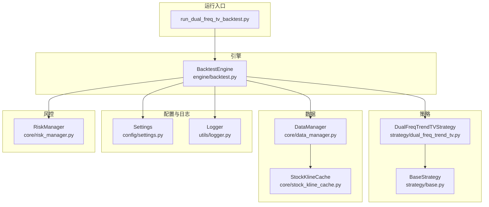
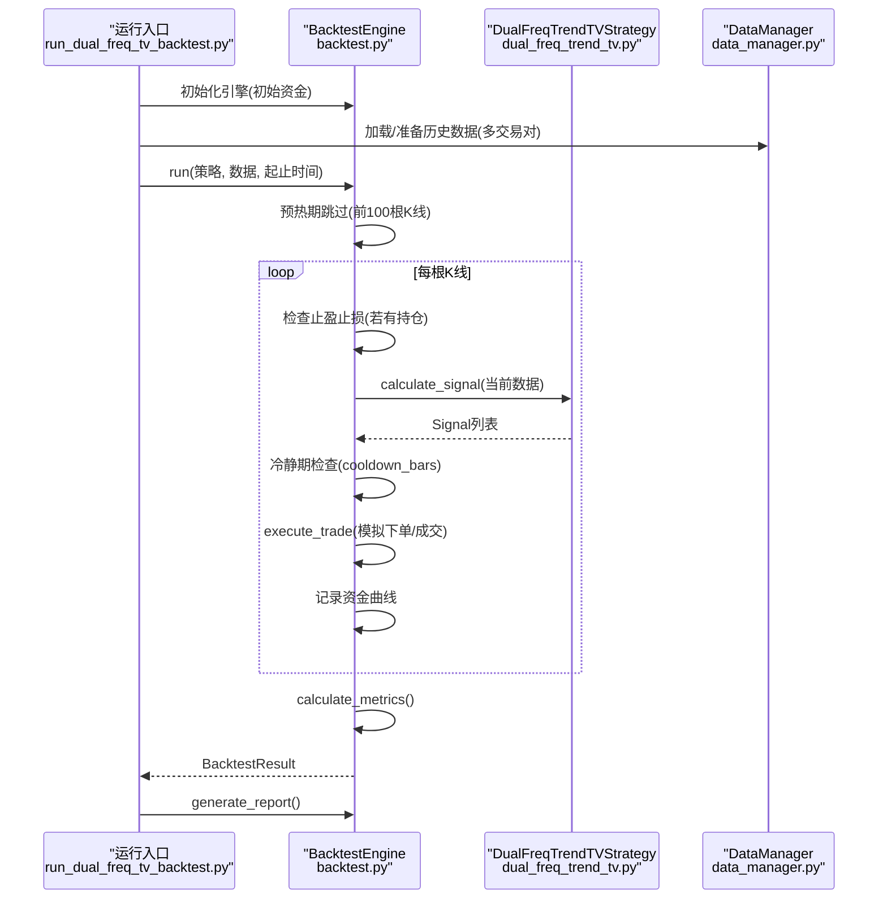
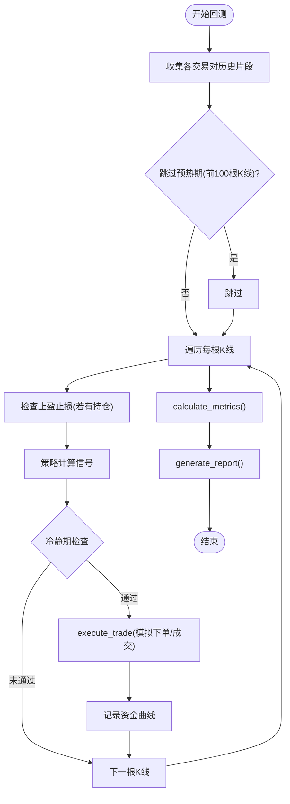
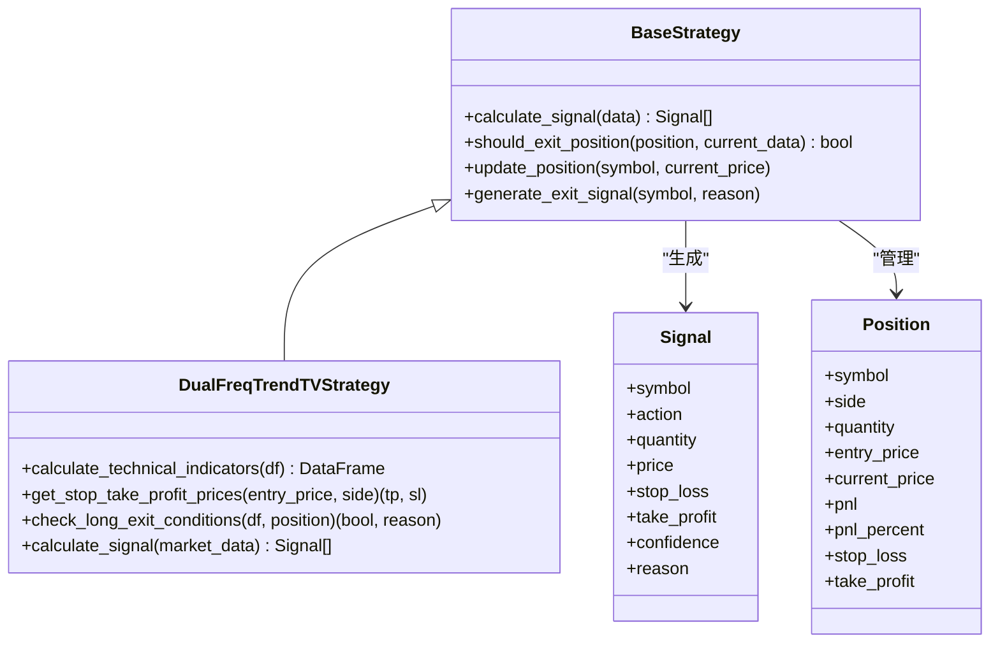
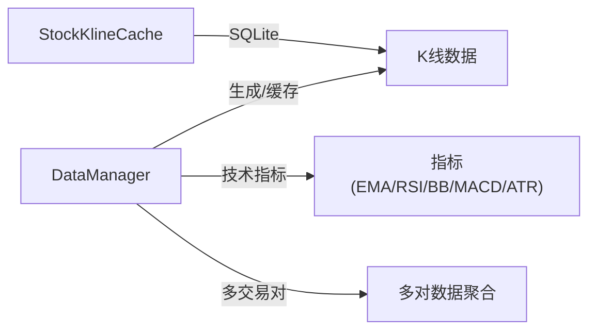
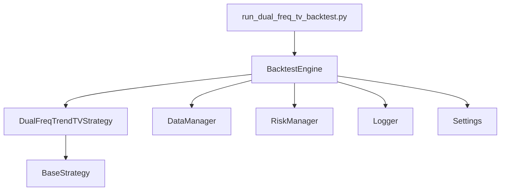

# 回测引擎

<cite>
**本文引用的文件**
- [backtest.py](file://backpack_quant_trading/engine/backtest.py)
- [base.py](file://backpack_quant_trading/strategy/base.py)
- [data_manager.py](file://backpack_quant_trading/core/data_manager.py)
- [run_dual_freq_tv_backtest.py](file://backpack_quant_trading/run_dual_freq_tv_backtest.py)
- [dual_freq_trend_tv.py](file://backpack_quant_trading/strategy/dual_freq_trend_tv.py)
- [risk_manager.py](file://backpack_quant_trading/core/risk_manager.py)
- [settings.py](file://backpack_quant_trading/config/settings.py)
- [logger.py](file://backpack_quant_trading/utils/logger.py)
- [stock_kline_cache.py](file://backpack_quant_trading/core/stock_kline_cache.py)
</cite>

## 目录
1. [简介](#简介)
2. [项目结构](#项目结构)
3. [核心组件](#核心组件)
4. [架构总览](#架构总览)
5. [详细组件分析](#详细组件分析)
6. [依赖关系分析](#依赖关系分析)
7. [性能考量](#性能考量)
8. [故障排查指南](#故障排查指南)
9. [结论](#结论)
10. [附录](#附录)

## 简介
本文件面向回测引擎的使用者与开发者，系统性阐述 BacktestEngine 的设计与实现，涵盖历史数据加载、策略回测执行、信号生成、订单模拟、收益计算与风险评估。文档同时给出数据流处理、滑点与手续费模拟、最大回撤分析、与策略模块的集成方式、数据缓存机制与性能优化策略，并提供回测结果可视化与统计分析的实践建议。

## 项目结构
回测引擎位于 engine/backtest.py，围绕策略基类 strategy/base.py 构建，数据来源由 core/data_manager.py 提供，运行入口见 run_dual_freq_tv_backtest.py，策略示例为 strategy/dual_freq_trend_tv.py。配置与日志分别来自 config/settings.py 与 utils/logger.py；风险控制由 core/risk_manager.py 提供。

图表来源
- [backtest.py:48-187](file://backpack_quant_trading/engine/backtest.py#L48-L187)
- [base.py:41-212](file://backpack_quant_trading/strategy/base.py#L41-L212)
- [data_manager.py:18-518](file://backpack_quant_trading/core/data_manager.py#L18-L518)
- [run_dual_freq_tv_backtest.py:56-125](file://backpack_quant_trading/run_dual_freq_tv_backtest.py#L56-L125)
- [dual_freq_trend_tv.py:17-360](file://backpack_quant_trading/strategy/dual_freq_trend_tv.py#L17-L360)
- [risk_manager.py:48-566](file://backpack_quant_trading/core/risk_manager.py#L48-L566)
- [settings.py:104-137](file://backpack_quant_trading/config/settings.py#L104-L137)
- [logger.py:128-180](file://backpack_quant_trading/utils/logger.py#L128-L180)

章节来源
- [backtest.py:48-187](file://backpack_quant_trading/engine/backtest.py#L48-L187)
- [run_dual_freq_tv_backtest.py:56-125](file://backpack_quant_trading/run_dual_freq_tv_backtest.py#L56-L125)

## 核心组件
- BacktestEngine：回测主引擎，负责时间推进、信号执行、订单模拟、资金曲线与指标计算。
- BaseStrategy/DualFreqTrendTVStrategy：策略抽象与具体实现，负责信号生成、止盈止损与平仓条件判断。
- DataManager：历史数据与实时数据缓存、清洗、技术指标计算。
- RiskManager：风控与风险度量（VaR、压力测试等），辅助策略风控检查。
- Settings/Logger：配置与日志基础设施。
- 运行入口脚本：加载CSV数据、构建策略与引擎，驱动回测并输出报告。

章节来源
- [backtest.py:16-404](file://backpack_quant_trading/engine/backtest.py#L16-L404)
- [base.py:41-212](file://backpack_quant_trading/strategy/base.py#L41-L212)
- [data_manager.py:18-518](file://backpack_quant_trading/core/data_manager.py#L18-L518)
- [risk_manager.py:48-566](file://backpack_quant_trading/core/risk_manager.py#L48-L566)
- [settings.py:104-137](file://backpack_quant_trading/config/settings.py#L104-L137)
- [logger.py:128-180](file://backpack_quant_trading/utils/logger.py#L128-L180)

## 架构总览
回测引擎采用“策略驱动 + 数据驱动”的流水线式架构：
- 数据层：DataManager 提供历史/实时数据，支持缓存、清洗与技术指标计算。
- 策略层：策略实现 calculate_signal 生成 Signal，可选实现止盈止损与平仓条件。
- 引擎层：BacktestEngine 驱动时间序列，按 K 线推进，先检查止盈止损，再计算信号，执行交易，记录资金曲线与交易明细。
- 结果层：计算指标（总收益、年化收益、夏普率、最大回撤、胜率、盈亏比等），生成报告。

图表来源
- [run_dual_freq_tv_backtest.py:56-125](file://backpack_quant_trading/run_dual_freq_tv_backtest.py#L56-L125)
- [backtest.py:65-187](file://backpack_quant_trading/engine/backtest.py#L65-L187)
- [dual_freq_trend_tv.py:206-348](file://backpack_quant_trading/strategy/dual_freq_trend_tv.py#L206-L348)

## 详细组件分析

### BacktestEngine 设计与实现
- 数据推进与时间对齐
  - 收集所有交易对在当前时刻的历史片段，按时间戳对齐，跳过预热期（前100根K线）。
- 止盈止损优先
  - 若存在持仓，先用 K 线内的 high/low 判断是否触及止损/止盈；否则用技术指标判断平仓条件。
- 信号执行与冷静期
  - 策略返回 Signal 后，检查冷静期（cooldown_bars），避免频繁开仓。
- 订单模拟与资金管理
  - 支持多空双向持仓，开仓/平仓均考虑滑点与手续费，使用杠杆计算保证金，资金不足时拒绝交易。
- 指标计算与报告
  - 计算总收益、年化收益、夏普率、最大回撤、胜率、盈亏比等；生成文本报告。

图表来源
- [backtest.py:65-187](file://backpack_quant_trading/engine/backtest.py#L65-L187)
- [backtest.py:189-331](file://backpack_quant_trading/engine/backtest.py#L189-L331)
- [backtest.py:333-383](file://backpack_quant_trading/engine/backtest.py#L333-L383)

章节来源
- [backtest.py:48-187](file://backpack_quant_trading/engine/backtest.py#L48-L187)
- [backtest.py:189-331](file://backpack_quant_trading/engine/backtest.py#L189-L331)
- [backtest.py:333-383](file://backpack_quant_trading/engine/backtest.py#L333-L383)

### 策略模块与信号生成
- BaseStrategy
  - 定义 Signal/Position 数据结构，抽象 calculate_signal 与 should_exit_position。
- DualFreqTrendTVStrategy
  - 计算 1m 指标（EMA5/13、RSI6、布林、MACD、ATR%、BB_WIDTH、VOLUME_MA5），15m 趋势过滤与 60m 过滤，结合回调、突破、大单被吃等条件生成多头入场信号，支持止盈止损与时间止损。
  - 提供 get_stop_take_profit_prices 与 check_long_exit_conditions，用于引擎侧止盈止损与平仓判断。

图表来源
- [base.py:41-212](file://backpack_quant_trading/strategy/base.py#L41-L212)
- [dual_freq_trend_tv.py:17-360](file://backpack_quant_trading/strategy/dual_freq_trend_tv.py#L17-L360)

章节来源
- [base.py:41-212](file://backpack_quant_trading/strategy/base.py#L41-L212)
- [dual_freq_trend_tv.py:103-205](file://backpack_quant_trading/strategy/dual_freq_trend_tv.py#L103-L205)
- [dual_freq_trend_tv.py:206-348](file://backpack_quant_trading/strategy/dual_freq_trend_tv.py#L206-L348)

### 数据管理与缓存
- DataManager
  - 回测模式下生成模拟 K 线；支持缓存、清洗、技术指标计算（MA、BB、RSI、MACD、ATR、Volatility、ZScore）。
  - 提供多交易对数据聚合与相关性矩阵计算。
- StockKlineCache（A股日线缓存）
  - SQLite 缓存全市场日线，支持增量拉取与批量读取，便于选股与预测场景。

图表来源
- [data_manager.py:18-518](file://backpack_quant_trading/core/data_manager.py#L18-L518)
- [stock_kline_cache.py:22-464](file://backpack_quant_trading/core/stock_kline_cache.py#L22-L464)

章节来源
- [data_manager.py:18-518](file://backpack_quant_trading/core/data_manager.py#L18-L518)
- [stock_kline_cache.py:22-464](file://backpack_quant_trading/core/stock_kline_cache.py#L22-L464)

### 风控与风险度量
- RiskManager
  - 仓位验证、止损止盈建议、日度/回撤限制、VaR 参数化/历史/蒙特卡洛计算、压力测试与风险报告生成。
- 与回测集成
  - 回测引擎内部未直接依赖 RiskManager，但策略可调用 RiskManager 进行风控检查；回测报告中可补充风险指标。

章节来源
- [risk_manager.py:48-566](file://backpack_quant_trading/core/risk_manager.py#L48-L566)

### 配置与日志
- Settings
  - 提供交易配置（最大仓位、止损止盈、杠杆等），统一项目根目录、数据与日志目录。
- Logger
  - 提供安全文件轮转处理器，支持交易、错误与常规日志分离输出。

章节来源
- [settings.py:104-137](file://backpack_quant_trading/config/settings.py#L104-L137)
- [logger.py:128-180](file://backpack_quant_trading/utils/logger.py#L128-L180)

## 依赖关系分析
- 回测引擎依赖策略接口（BaseStrategy）与数据管理（DataManager），通过异步接口 calculate_signal 与历史数据驱动回测。
- 策略依赖 DataManager 的技术指标能力（可选），并可调用 RiskManager 进行风控检查。
- 运行入口脚本负责数据加载（CSV）、策略与引擎初始化、回测执行与报告输出。

图表来源
- [run_dual_freq_tv_backtest.py:56-125](file://backpack_quant_trading/run_dual_freq_tv_backtest.py#L56-L125)
- [backtest.py:48-187](file://backpack_quant_trading/engine/backtest.py#L48-L187)
- [dual_freq_trend_tv.py:17-360](file://backpack_quant_trading/strategy/dual_freq_trend_tv.py#L17-L360)
- [data_manager.py:18-518](file://backpack_quant_trading/core/data_manager.py#L18-L518)
- [risk_manager.py:48-566](file://backpack_quant_trading/core/risk_manager.py#L48-L566)
- [logger.py:128-180](file://backpack_quant_trading/utils/logger.py#L128-L180)
- [settings.py:104-137](file://backpack_quant_trading/config/settings.py#L104-L137)

章节来源
- [run_dual_freq_tv_backtest.py:56-125](file://backpack_quant_trading/run_dual_freq_tv_backtest.py#L56-L125)
- [backtest.py:48-187](file://backpack_quant_trading/engine/backtest.py#L48-L187)

## 性能考量
- 预热期与冷静期
  - 预热期跳过前100根K线，避免技术指标未稳定导致的误信号；冷静期 cooldown_bars 防止频繁交易。
- 指标计算与数据对齐
  - 使用滚动窗口与向量化计算（pandas/numpy），避免逐元素循环；对齐多交易对时间戳，减少无效计算。
- 滑点与手续费
  - 滑点与手续费在下单时即计入成本，避免事后修正带来的额外复杂度。
- 缓存与I/O
  - DataManager 支持缓存与文件持久化，减少重复拉取；日志使用安全文件轮转，避免Windows权限问题。
- 异步与并发
  - 策略 calculate_signal 为异步接口，便于与外部API交互；回测主循环为同步推进，保证时序一致性。

[本节为通用性能讨论，不直接分析特定文件]

## 故障排查指南
- 数据为空或缺失
  - 确认 CSV 列名标准化、时间列转换与排序；检查数据清洗逻辑（去除无效K线）。
- 交易被拒绝
  - 检查资金是否充足、是否处于冷静期、是否重复开仓（多空双向）。
- 指标异常
  - 确认技术指标计算顺序与窗口长度；确保至少有足够K线（预热期）。
- 日志定位
  - 查看 trades.log、errors.log 与按日期命名的常规日志文件，定位异常与风控事件。

章节来源
- [logger.py:128-180](file://backpack_quant_trading/utils/logger.py#L128-L180)
- [backtest.py:189-331](file://backpack_quant_trading/engine/backtest.py#L189-L331)

## 结论
BacktestEngine 以清晰的职责划分与稳健的数据/策略/引擎解耦，提供了可扩展、可复现的回测框架。通过滑点与手续费模拟、止盈止损与冷静期控制、多空双向持仓与预热期处理，回测结果更贴近真实交易环境。配合 DataManager 的缓存与指标计算、RiskManager 的风险度量与策略风控，可支撑从策略开发到回测评估的完整闭环。

[本节为总结性内容，不直接分析特定文件]

## 附录

### 回测配置与运行示例（路径指引）
- 回测运行入口脚本
  - [run_dual_freq_tv_backtest.py:56-125](file://backpack_quant_trading/run_dual_freq_tv_backtest.py#L56-L125)
- 回测引擎核心
  - [backtest.py:65-187](file://backpack_quant_trading/engine/backtest.py#L65-L187)
- 策略实现（示例）
  - [dual_freq_trend_tv.py:206-348](file://backpack_quant_trading/strategy/dual_freq_trend_tv.py#L206-L348)
- 数据管理与技术指标
  - [data_manager.py:405-446](file://backpack_quant_trading/core/data_manager.py#L405-L446)
- 风控与风险度量
  - [risk_manager.py:331-416](file://backpack_quant_trading/core/risk_manager.py#L331-L416)
- 配置与日志
  - [settings.py:104-137](file://backpack_quant_trading/config/settings.py#L104-L137)
  - [logger.py:128-180](file://backpack_quant_trading/utils/logger.py#L128-L180)

### 回测结果指标说明
- 总收益率、年化收益率、夏普率、最大回撤、胜率、盈利因子、总交易次数、盈利/亏损交易数等，均由引擎在 calculate_metrics 中计算并填充至 BacktestResult。

章节来源
- [backtest.py:333-383](file://backpack_quant_trading/engine/backtest.py#L333-L383)