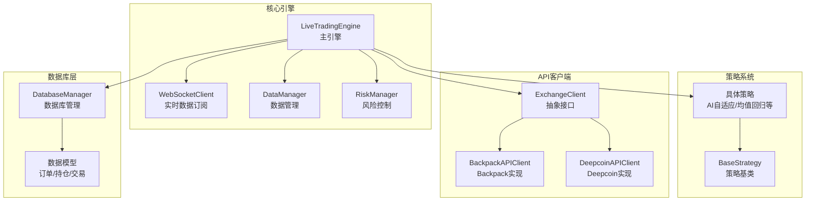
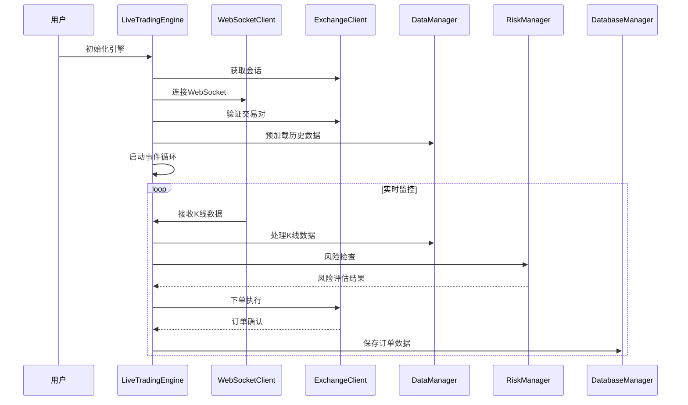
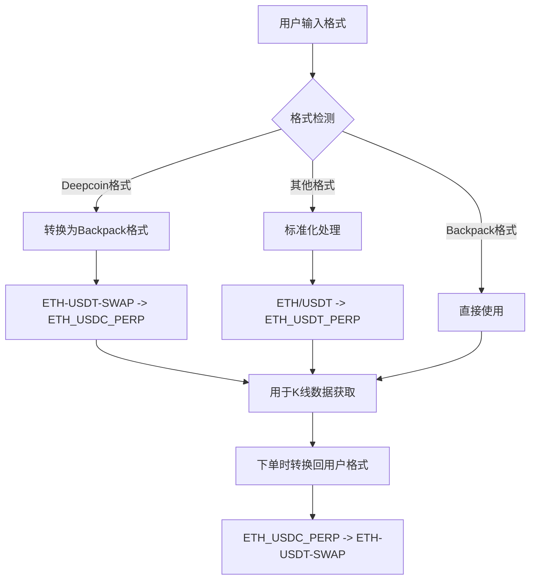
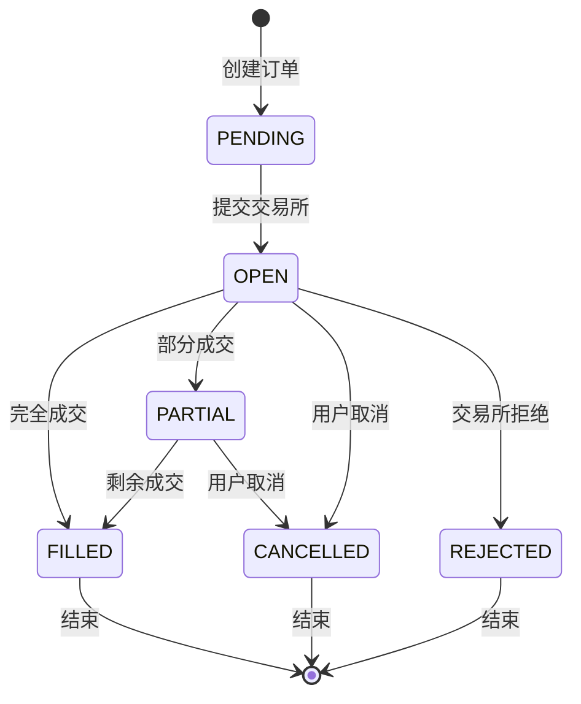
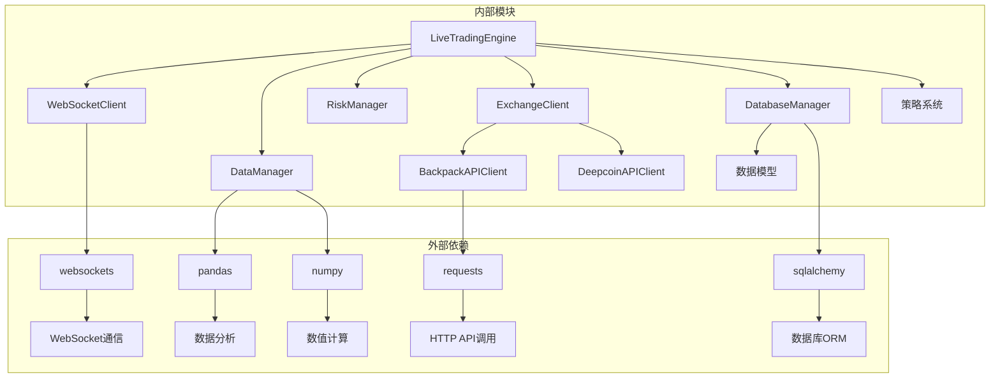
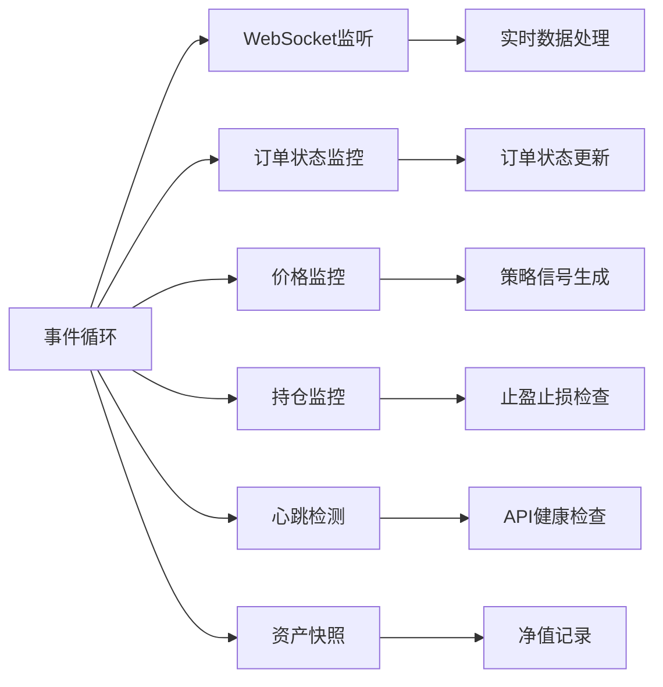

# 实盘交易引擎

<cite>
**本文档引用的文件**
- [live_trading.py](file://engine/live_trading.py)
- [api_client.py](file://core/api_client.py)
- [data_manager.py](file://core/data_manager.py)
- [risk_manager.py](file://core/risk_manager.py)
- [base.py](file://strategy/base.py)
- [settings.py](file://config/settings.py)
- [models.py](file://database/models.py)
- [main.py](file://main.py)
</cite>

## 目录
1. [简介](#简介)
2. [项目结构](#项目结构)
3. [核心组件](#核心组件)
4. [架构概览](#架构概览)
5. [详细组件分析](#详细组件分析)
6. [依赖关系分析](#依赖关系分析)
7. [性能考虑](#性能考虑)
8. [故障排除指南](#故障排除指南)
9. [结论](#结论)

## 简介

实盘交易引擎是一个基于Python构建的高性能量化交易系统，专为加密货币衍生品交易设计。该引擎集成了实时数据订阅、订单管理、仓位管理和风险控制功能，支持多交易所接入和策略扩展。

## 项目结构

**图表来源**
- [live_trading.py:347-395](file://engine/live_trading.py#L347-L395)
- [api_client.py:22-85](file://core/api_client.py#L22-L85)
- [data_manager.py:18-42](file://core/data_manager.py#L18-L42)
- [risk_manager.py:48-54](file://core/risk_manager.py#L48-L54)

**章节来源**
- [live_trading.py:1-2223](file://engine/live_trading.py#L1-L2223)
- [main.py:1-344](file://main.py#L1-L344)

## 核心组件

### LiveTradingEngine 主引擎

LiveTradingEngine是整个交易系统的核心，负责协调各个组件的工作。它实现了完整的交易生命周期管理，包括初始化、事件循环、订单执行和实时监控。

**主要特性：**
- **多交易所支持**：通过ExchangeClient抽象接口，支持Backpack、Deepcoin等多个交易所
- **实时数据订阅**：基于WebSocket的实时K线和行情数据订阅
- **订单生命周期管理**：从下单到成交的完整流程跟踪
- **风险控制集成**：内置风险管理器，提供仓位限制和止损止盈功能
- **数据库持久化**：完整的订单、持仓和交易数据持久化

### WebSocket 实时数据订阅

WebSocketClient提供了可靠的实时数据订阅功能，支持自动重连和错误处理。

**关键功能：**
- **自适应代理支持**：自动检测和使用系统代理
- **指数退避重连**：网络异常时的智能重连机制
- **频道订阅管理**：支持K线、深度、成交等多种数据类型的订阅
- **消息格式适配**：自动处理不同交易所的数据格式差异

### DataManager 数据管理

DataManager负责市场数据的获取、处理、存储和缓存，支持历史数据和实时数据的统一管理。

**核心能力：**
- **多格式数据支持**：兼容Backpack、Deepcoin等不同交易所的数据格式
- **技术指标计算**：内置多种技术指标计算功能
- **缓存机制**：高效的内存缓存和文件缓存结合
- **数据清洗**：自动处理异常数据和缺失值

### RiskManager 风险管理

RiskManager提供全面的风险控制功能，包括仓位管理、止损止盈和风险评估。

**风险管理特性：**
- **保证金控制**：基于账户资金的动态保证金限制
- **止损止盈**：支持固定比例和策略自定义价位的止盈止损
- **风险评估**：VaR计算、压力测试和风险报告生成
- **实时监控**：持续监控交易风险和市场变化

**章节来源**
- [live_trading.py:347-535](file://engine/live_trading.py#L347-L535)
- [api_client.py:87-547](file://core/api_client.py#L87-L547)
- [data_manager.py:18-518](file://core/data_manager.py#L18-L518)
- [risk_manager.py:48-566](file://core/risk_manager.py#L48-L566)

## 架构概览

**图表来源**
- [live_trading.py:536-568](file://engine/live_trading.py#L536-L568)
- [live_trading.py:1580-1656](file://engine/live_trading.py#L1580-L1656)

## 详细组件分析

### 交易对格式转换机制

引擎实现了复杂的交易对格式转换机制，支持Backpack和Deepcoin等不同交易所的格式差异。

**图表来源**
- [live_trading.py:640-698](file://engine/live_trading.py#L640-L698)

**转换规则：**
- **Backpack格式**：`ETH_USDC_PERP`（用于K线数据）
- **Deepcoin格式**：`ETH-USDT-SWAP`（用于下单）
- **标准化处理**：自动识别和转换不同格式

### 订单生命周期管理

订单生命周期管理是引擎的核心功能之一，涵盖了从下单到成交的完整流程。

**图表来源**
- [live_trading.py:929-1083](file://engine/live_trading.py#L929-L1083)

**订单状态处理：**
- **PENDING**：订单创建但未提交
- **OPEN**：已提交交易所等待成交
- **FILLED**：订单完全成交
- **PARTIAL**：订单部分成交
- **CANCELLED**：用户主动取消
- **REJECTED**：交易所拒绝

### 余额缓存策略

引擎实现了智能的余额缓存策略，减少API调用频率，提高系统性能。

**缓存机制：**
- **缓存时间**：默认10分钟（600秒）
- **缓存失效**：基于TTL（Time To Live）机制
- **缓存更新**：自动刷新过期数据
- **降级处理**：API失败时使用过期缓存

**章节来源**
- [live_trading.py:408-442](file://engine/live_trading.py#L408-L442)
- [live_trading.py:1111-1282](file://engine/live_trading.py#L1111-L1282)

## 依赖关系分析

**图表来源**
- [live_trading.py:1-20](file://engine/live_trading.py#L1-L20)
- [api_client.py:1-19](file://core/api_client.py#L1-L19)
- [models.py:1-11](file://database/models.py#L1-L11)

**依赖特点：**
- **低耦合高内聚**：各模块职责明确，依赖关系清晰
- **可扩展性**：通过抽象接口支持新交易所接入
- **异步支持**：全面使用asyncio提升并发性能

**章节来源**
- [live_trading.py:14-19](file://engine/live_trading.py#L14-L19)
- [api_client.py:22-85](file://core/api_client.py#L22-L85)

## 性能考虑

### 缓存优化

引擎采用了多层次的缓存策略来提升性能：

1. **余额缓存**：减少API调用频率
2. **K线数据缓存**：内存和文件双重缓存
3. **市场数据缓存**：类级别共享缓存
4. **订单簿缓存**：实时深度数据缓存

### 异步处理

**图表来源**
- [live_trading.py:1283-1342](file://engine/live_trading.py#L1283-L1342)
- [live_trading.py:1814-1835](file://engine/live_trading.py#L1814-L1835)

### 错误处理和恢复

引擎实现了完善的错误处理机制：

- **自动重连**：网络断开时自动重连
- **降级运行**：API失败时使用缓存数据
- **异常隔离**：单个组件异常不影响整体运行
- **状态恢复**：重启后自动恢复交易状态

## 故障排除指南

### 常见问题及解决方案

**WebSocket连接问题：**
- 检查网络连接和代理设置
- 验证API密钥和权限
- 查看连接超时和重试日志

**订单执行失败：**
- 检查账户余额和保证金
- 验证交易对有效性
- 确认风控检查结果

**数据同步问题：**
- 检查缓存一致性
- 验证时间戳格式
- 确认数据格式转换

**章节来源**
- [live_trading.py:1642-1655](file://engine/live_trading.py#L1642-L1655)
- [api_client.py:254-268](file://core/api_client.py#L254-L268)

## 结论

实盘交易引擎是一个功能完整、性能优异的量化交易系统。通过模块化设计和异步架构，实现了高并发、低延迟的交易执行。其灵活的交易所抽象接口和策略扩展机制，为未来的功能扩展和技术演进奠定了坚实基础。

该引擎特别适用于高频交易和多策略并行运行的场景，其完善的风控体系和数据管理能力，为实盘交易提供了可靠的技术保障。