# 交易控制系统

<cite>
**本文档引用的文件**
- [main.py](file://backpack_quant_trading/main.py)
- [base.py](file://backpack_quant_trading/strategy/base.py)
- [mean_reversion.py](file://backpack_quant_trading/strategy/mean_reversion.py)
- [ai_adaptive.py](file://backpack_quant_trading/strategy/ai_adaptive.py)
- [dual_freq_trend.py](file://backpack_quant_trading/strategy/dual_freq_trend.py)
- [data_manager.py](file://backpack_quant_trading/core/data_manager.py)
- [risk_manager.py](file://backpack_quant_trading/core/risk_manager.py)
- [backtest.py](file://backpack_quant_trading/engine/backtest.py)
- [live_trading.py](file://backpack_quant_trading/engine/live_trading.py)
- [settings.py](file://backpack_quant_trading/config/settings.py)
</cite>

## 目录
1. [简介](#简介)
2. [项目结构](#项目结构)
3. [核心组件](#核心组件)
4. [架构总览](#架构总览)
5. [详细组件分析](#详细组件分析)
6. [依赖关系分析](#依赖关系分析)
7. [性能考虑](#性能考虑)
8. [故障排除指南](#故障排除指南)
9. [结论](#结论)
10. [附录](#附录)

## 简介
本项目是一个基于 Python 的量化交易控制系统，围绕 TradingBot 主控制器构建，支持回测与实盘两种运行模式。系统采用策略注册表与交易所注册表机制，便于扩展新策略与新交易所实现。核心模块包括数据管理器、风险管理系统、策略基类与多种具体策略、回测引擎与实盘交易引擎，以及配置中心。

## 项目结构
项目采用模块化分层组织：
- config：全局配置中心，集中管理各交易所与交易参数
- core：核心基础设施，包括数据管理、风险控制、API 客户端等
- strategy：策略层，包含策略基类与多种具体策略
- engine：引擎层，负责回测与实盘交易调度
- api：后端服务入口，提供 REST API 与静态资源托管
- utils：通用工具，如日志系统
- data/database/docs：数据与文档资源

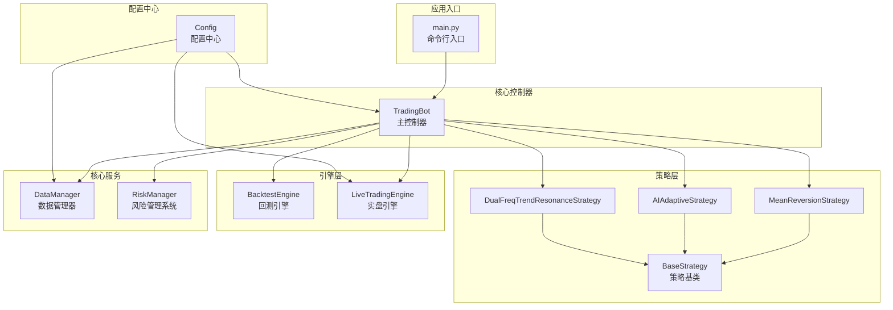

**图表来源**
- [main.py:58-158](file://backpack_quant_trading/main.py#L58-L158)
- [base.py:41-212](file://backpack_quant_trading/strategy/base.py#L41-L212)
- [mean_reversion.py:23-263](file://backpack_quant_trading/strategy/mean_reversion.py#L23-L263)
- [ai_adaptive.py:12-800](file://backpack_quant_trading/strategy/ai_adaptive.py#L12-L800)
- [dual_freq_trend.py:18-931](file://backpack_quant_trading/strategy/dual_freq_trend.py#L18-L931)
- [data_manager.py:18-518](file://backpack_quant_trading/core/data_manager.py#L18-L518)
- [risk_manager.py:48-566](file://backpack_quant_trading/core/risk_manager.py#L48-L566)
- [backtest.py:48-404](file://backpack_quant_trading/engine/backtest.py#L48-L404)
- [live_trading.py:347-800](file://backpack_quant_trading/engine/live_trading.py#L347-L800)
- [settings.py:104-137](file://backpack_quant_trading/config/settings.py#L104-L137)

**章节来源**
- [main.py:1-344](file://backpack_quant_trading/main.py#L1-L344)
- [settings.py:104-137](file://backpack_quant_trading/config/settings.py#L104-L137)

## 核心组件
- TradingBot 主控制器：负责策略注册、回测与实盘运行模式切换、与数据/风险/引擎模块的协调
- 策略注册表：集中管理策略类，便于通过名称选择策略
- 交易所注册表：集中管理交易所客户端类，便于切换不同交易所实现
- DataManager：统一管理市场数据获取、缓存与技术指标计算
- RiskManager：统一风控策略，包括仓位、止损止盈、日度限额与回撤控制
- BacktestEngine：回测引擎，支持多标的、多空双向、止盈止损模拟与手续费滑点
- LiveTradingEngine：实盘引擎，负责 WebSocket 订阅、订单与持仓管理、回调通知
- BaseStrategy：策略抽象基类，定义信号生成、平仓判断与参数管理接口

**章节来源**
- [main.py:31-56](file://backpack_quant_trading/main.py#L31-L56)
- [main.py:58-158](file://backpack_quant_trading/main.py#L58-L158)
- [base.py:41-212](file://backpack_quant_trading/strategy/base.py#L41-L212)
- [data_manager.py:18-518](file://backpack_quant_trading/core/data_manager.py#L18-L518)
- [risk_manager.py:48-566](file://backpack_quant_trading/core/risk_manager.py#L48-L566)
- [backtest.py:48-404](file://backpack_quant_trading/engine/backtest.py#L48-L404)
- [live_trading.py:347-800](file://backpack_quant_trading/engine/live_trading.py#L347-L800)

## 架构总览
系统采用“控制器-策略-引擎-服务”的分层架构：
- 控制器层：TradingBot 作为主控制器，负责生命周期管理与模式切换
- 策略层：策略基类定义统一接口，具体策略实现各自的信号生成与风控逻辑
- 引擎层：回测引擎与实盘引擎分别处理历史数据与实时数据流
- 服务层：数据管理器与风险管理系统提供数据与风控能力

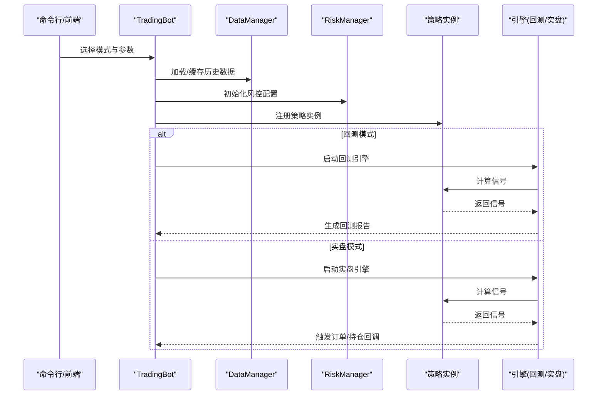

**图表来源**
- [main.py:197-286](file://backpack_quant_trading/main.py#L197-L286)
- [main.py:116-149](file://backpack_quant_trading/main.py#L116-L149)
- [backtest.py:65-187](file://backpack_quant_trading/engine/backtest.py#L65-L187)
- [live_trading.py:536-567](file://backpack_quant_trading/engine/live_trading.py#L536-L567)

## 详细组件分析

### TradingBot 主控制器
- 初始化：创建 DataManager、RiskManager、回测引擎，预留实盘引擎占位
- 策略管理：add_strategy 方法将策略按交易对注册，支持多标的多策略
- 回测流程：run_backtest 逐标的加载历史数据、计算指标、运行策略并生成报告
- 实盘流程：run_live_trading 注册策略、绑定回调、注入交易所客户端、启动引擎

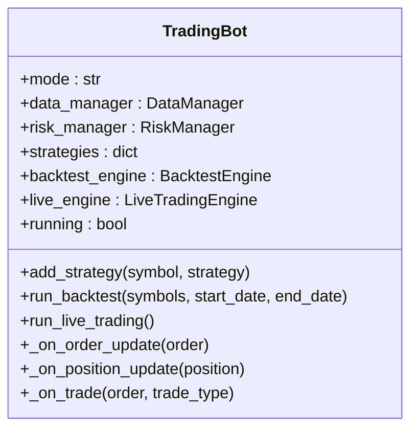

**图表来源**
- [main.py:58-158](file://backpack_quant_trading/main.py#L58-L158)

**章节来源**
- [main.py:58-158](file://backpack_quant_trading/main.py#L58-L158)

### 策略注册表与交易所注册表
- 策略注册表：通过 STRATEGY_REGISTRY 字典集中管理策略类，支持通过名称选择策略
- 显示名称映射：STRATEGY_DISPLAY_NAMES 提供策略显示名称
- 交易所注册表：EXCHANGE_REGISTRY 集中管理交易所客户端类，支持切换不同实现

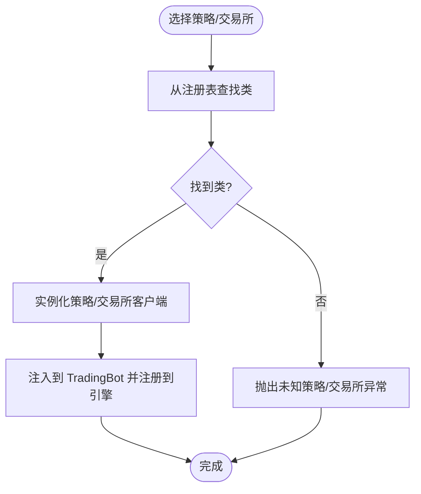

**图表来源**
- [main.py:31-56](file://backpack_quant_trading/main.py#L31-L56)
- [main.py:197-286](file://backpack_quant_trading/main.py#L197-L286)

**章节来源**
- [main.py:31-56](file://backpack_quant_trading/main.py#L31-L56)
- [main.py:197-286](file://backpack_quant_trading/main.py#L197-L286)

### DataManager 数据管理器
- 历史数据获取：支持回测模式生成模拟数据与实盘模式调用 API 获取 K 线
- 实时数据缓存：类级缓存共享，支持 TTL 与容量控制，异步追加与更新
- 技术指标：内置 MA、BB、RSI、MACD、ATR、Volatility、ZScore 等指标计算
- 订单簿与相关性：提供订单簿缓存与资产相关性矩阵计算

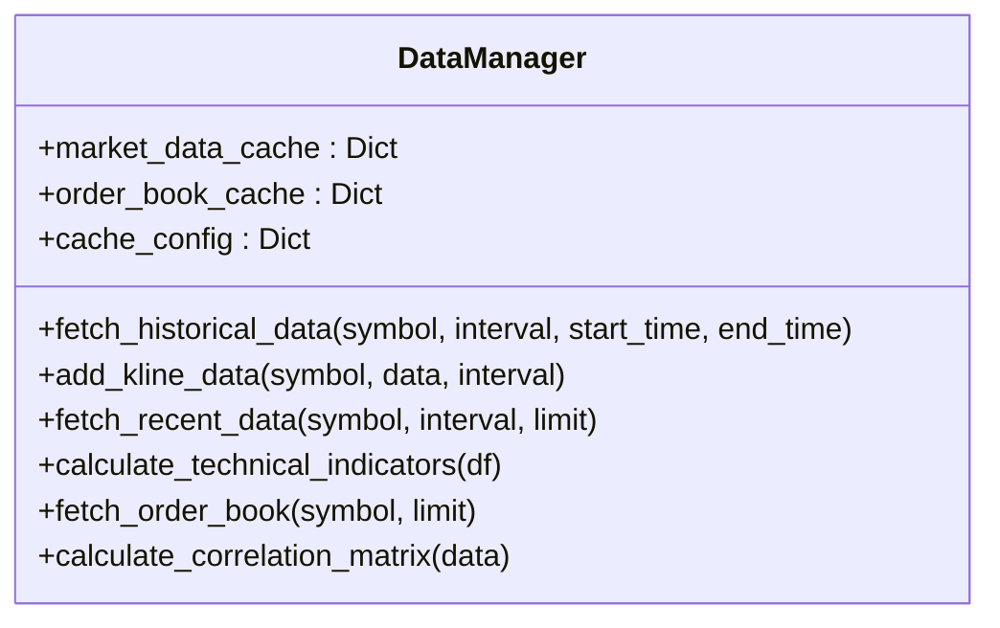

**图表来源**
- [data_manager.py:18-518](file://backpack_quant_trading/core/data_manager.py#L18-L518)

**章节来源**
- [data_manager.py:18-518](file://backpack_quant_trading/core/data_manager.py#L18-L518)

### RiskManager 风险管理系统
- 仓位与保证金：基于账户资金与最大仓位比例计算最大允许保证金，支持多标的累计
- 止损止盈：根据配置计算止盈止损价格，支持风控拦截
- 日度限额与回撤：每日累计 PnL、最大回撤控制，支持压力测试与 VaR 计算
- 风控事件记录：记录风险事件并持久化到数据库

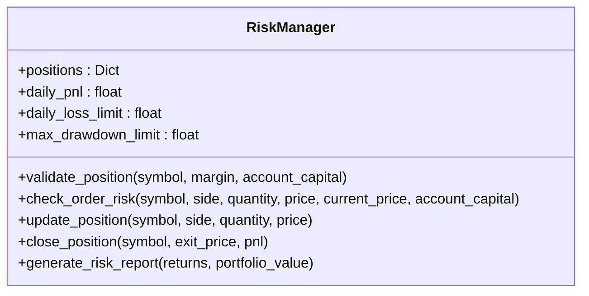

**图表来源**
- [risk_manager.py:48-566](file://backpack_quant_trading/core/risk_manager.py#L48-L566)

**章节来源**
- [risk_manager.py:48-566](file://backpack_quant_trading/core/risk_manager.py#L48-L566)

### BaseStrategy 策略基类
- 信号与仓位：定义 Signal 与 Position 数据结构，提供生成平仓信号与更新仓位的方法
- 抽象接口：子类必须实现 calculate_signal 与 should_exit_position
- 参数管理：支持动态设置策略参数，提供性能指标接口

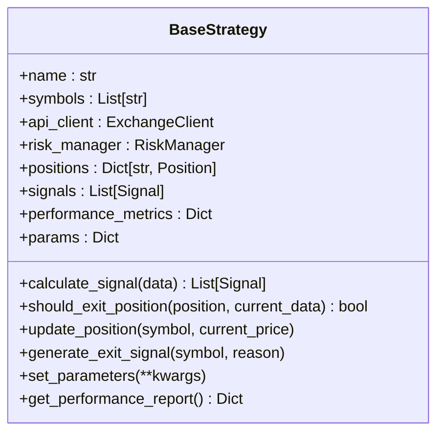

**图表来源**
- [base.py:41-212](file://backpack_quant_trading/strategy/base.py#L41-L212)

**章节来源**
- [base.py:41-212](file://backpack_quant_trading/strategy/base.py#L41-L212)

### 具体策略实现

#### 均值回归策略 MeanReversionStrategy
- 核心逻辑：基于 Z-Score 计算与阈值判断生成买卖信号
- 仓位计算：结合账户余额与配置杠杆计算保证金与数量，风控拦截无效数量
- 止损止盈：按价格比例设置止盈止损，支持平仓条件检查

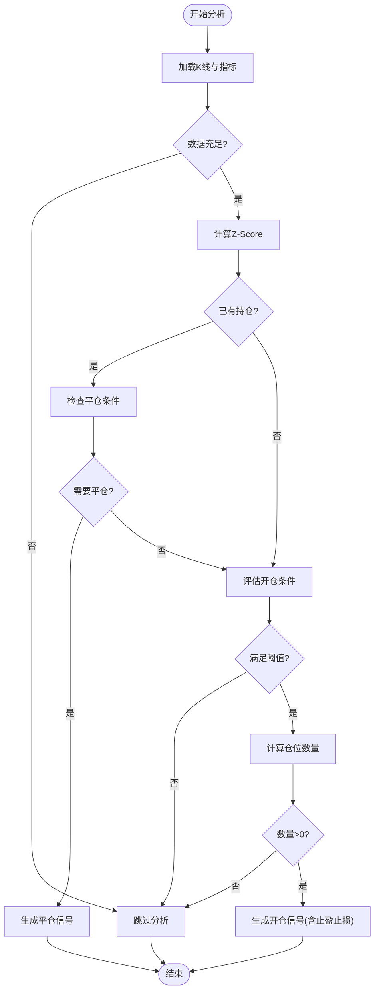

**图表来源**
- [mean_reversion.py:31-117](file://backpack_quant_trading/strategy/mean_reversion.py#L31-L117)
- [mean_reversion.py:119-149](file://backpack_quant_trading/strategy/mean_reversion.py#L119-L149)
- [mean_reversion.py:151-246](file://backpack_quant_trading/strategy/mean_reversion.py#L151-L246)

**章节来源**
- [mean_reversion.py:23-263](file://backpack_quant_trading/strategy/mean_reversion.py#L23-L263)

#### AI 自适应策略 AIAdaptiveStrategy
- 本地指标预筛选：RSI、MACD、布林带、ATR 等指标用于降低 AI 调用频率
- 日内交易模式：每 1 分钟 K 线触发分析，支持快速判断与深度分析模式
- 信号解析：从 AI 文本中解析做多/做空/平多/平空信号，计算止盈止损与仓位

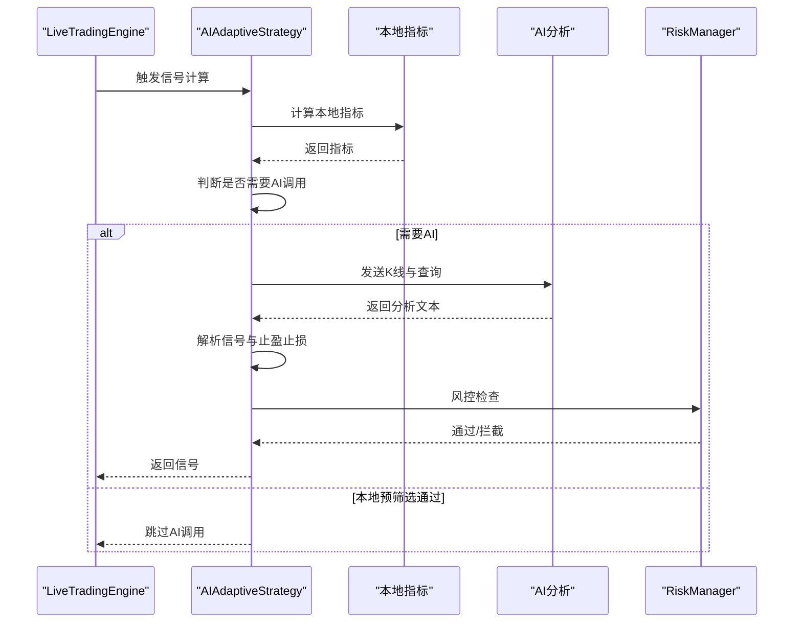

**图表来源**
- [ai_adaptive.py:266-670](file://backpack_quant_trading/strategy/ai_adaptive.py#L266-L670)
- [ai_adaptive.py:672-800](file://backpack_quant_trading/strategy/ai_adaptive.py#L672-L800)

**章节来源**
- [ai_adaptive.py:12-800](file://backpack_quant_trading/strategy/ai_adaptive.py#L12-L800)

#### 双频趋势共振策略 DualFreqTrendResonanceStrategy
- 多时间框架：15 分钟趋势 + 1 分钟入场，强调趋势一致性与入场精度
- 加权评分：基于趋势、价格位置、RSI、均线状态、MACD、成交量、波动率等维度加权打分
- 止盈止损：以“保证金收益%”定义，按杠杆换算为价格移动，支持时间止损与追踪止盈

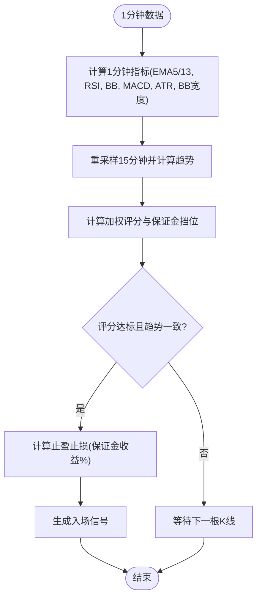

**图表来源**
- [dual_freq_trend.py:170-271](file://backpack_quant_trading/strategy/dual_freq_trend.py#L170-L271)
- [dual_freq_trend.py:289-427](file://backpack_quant_trading/strategy/dual_freq_trend.py#L289-L427)
- [dual_freq_trend.py:544-559](file://backpack_quant_trading/strategy/dual_freq_trend.py#L544-L559)

**章节来源**
- [dual_freq_trend.py:18-931](file://backpack_quant_trading/strategy/dual_freq_trend.py#L18-L931)

### 回测引擎 BacktestEngine
- 多标的回测：合并时间轴，逐根 K 线驱动策略计算信号
- 止盈止损模拟：在 K 线内优先检查止损止盈，其次技术指标判断
- 指标计算：内置滑点与手续费，支持多空双向持仓与冷却期控制

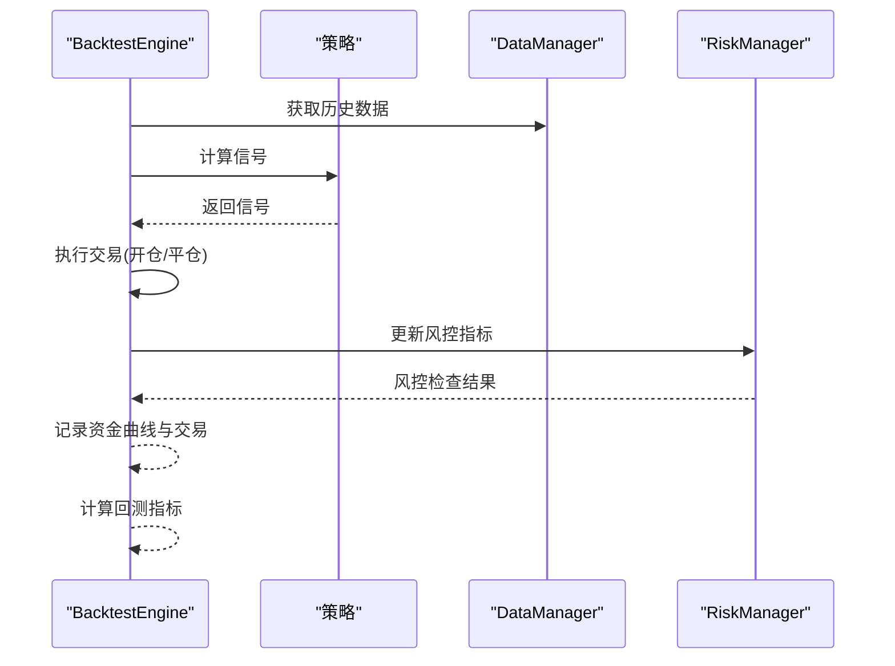

**图表来源**
- [backtest.py:65-187](file://backpack_quant_trading/engine/backtest.py#L65-L187)
- [backtest.py:189-383](file://backpack_quant_trading/engine/backtest.py#L189-L383)

**章节来源**
- [backtest.py:48-404](file://backpack_quant_trading/engine/backtest.py#L48-L404)

### 实盘交易引擎 LiveTradingEngine
- WebSocket 订阅：订阅 Backpack 实时 K 线与行情，支持断线重连与代理
- 交易对映射：支持不同交易所格式转换（如 Deepcoin 与 Backpack）
- 订单与持仓：统一订单/持仓数据结构，支持回调通知与余额缓存

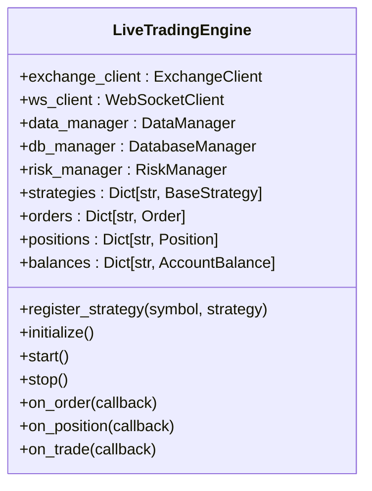

**图表来源**
- [live_trading.py:347-800](file://backpack_quant_trading/engine/live_trading.py#L347-L800)

**章节来源**
- [live_trading.py:347-800](file://backpack_quant_trading/engine/live_trading.py#L347-L800)

## 依赖关系分析
- 控制器依赖：TradingBot 依赖 DataManager、RiskManager、策略类与引擎类
- 策略依赖：具体策略依赖 BaseStrategy 与 RiskManager，部分策略依赖 DataManager 获取历史数据
- 引擎依赖：回测引擎依赖策略与 DataManager；实盘引擎依赖 ExchangeClient 与 WebSocketClient
- 配置依赖：各模块通过 Config 读取配置，保证一致性

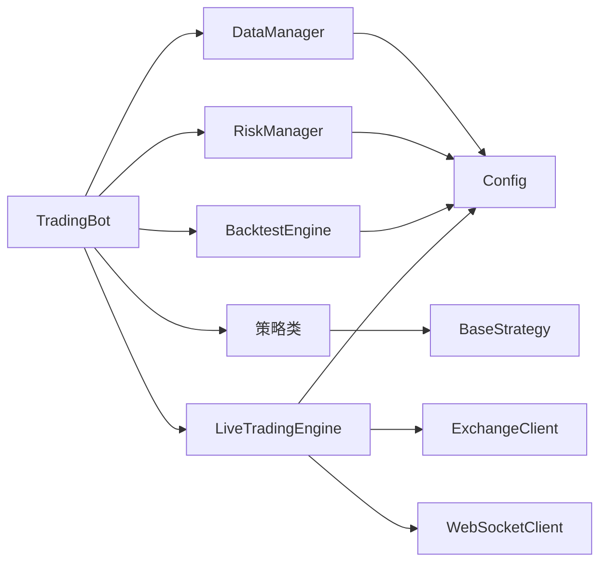

**图表来源**
- [main.py:58-158](file://backpack_quant_trading/main.py#L58-L158)
- [backtest.py:48-64](file://backpack_quant_trading/engine/backtest.py#L48-L64)
- [live_trading.py:353-370](file://backpack_quant_trading/engine/live_trading.py#L353-L370)
- [settings.py:104-137](file://backpack_quant_trading/config/settings.py#L104-L137)

**章节来源**
- [main.py:58-158](file://backpack_quant_trading/main.py#L58-L158)
- [settings.py:104-137](file://backpack_quant_trading/config/settings.py#L104-L137)

## 性能考虑
- 数据缓存：DataManager 使用类级缓存与 TTL 控制，减少重复请求与计算
- 异步处理：实盘引擎与数据管理器采用异步接口，提升并发性能
- 指标计算：策略与引擎内置常用指标，避免重复计算；AI 策略采用本地指标预筛选降低调用频率
- 风控拦截：RiskManager 在下单前进行风控检查，避免无效订单导致的系统开销

## 故障排除指南
- WebSocket 连接失败：检查代理设置与网络环境，实盘引擎支持指数退避重连
- 交易所 API 调用异常：实盘引擎提供余额缓存，API 失败时使用过期缓存避免崩溃
- 策略参数错误：通过命令行参数覆盖策略默认参数，注意止损止盈比例与仓位大小
- 回测数据不足：确保历史数据加载成功，检查时间范围与缓存配置

**章节来源**
- [live_trading.py:153-235](file://backpack_quant_trading/engine/live_trading.py#L153-L235)
- [live_trading.py:408-441](file://backpack_quant_trading/engine/live_trading.py#L408-L441)
- [main.py:213-220](file://backpack_quant_trading/main.py#L213-L220)

## 结论
本交易控制系统通过 TradingBot 主控制器实现了策略、数据、风控与引擎的解耦设计，支持灵活扩展与多策略并行。策略注册表与交易所注册表机制使得新增策略与交易所实现变得简单直观。回测与实盘引擎分别满足历史验证与实时交易需求，配合完善的风控体系，为量化交易提供了可靠的技术支撑。

## 附录

### 常见配置场景与最佳实践
- 回测模式：使用默认策略与回测数据，快速验证策略逻辑与参数
- 实盘模式：通过命令行参数选择交易所与策略，设置杠杆、止盈止损与仓位大小
- 多标的策略：为每个交易对注册独立策略实例，注意风控参数与资金分配
- 风控参数：根据账户规模设置最大仓位比例与日度限额，合理配置止损止盈比例

**章节来源**
- [main.py:300-336](file://backpack_quant_trading/main.py#L300-L336)
- [settings.py:55-64](file://backpack_quant_trading/config/settings.py#L55-L64)