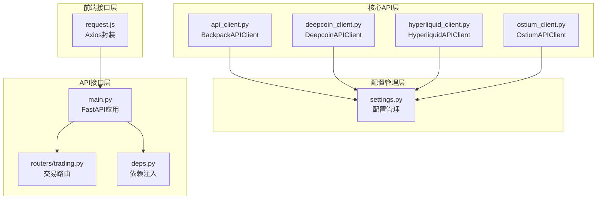
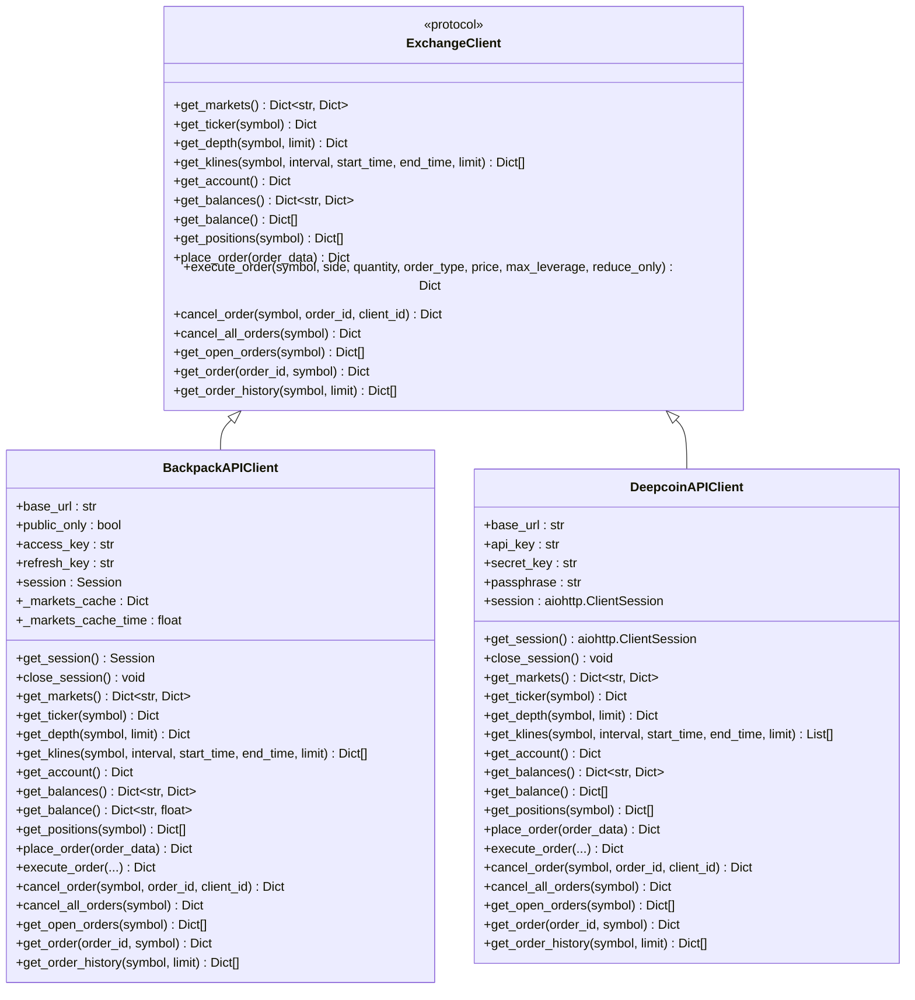
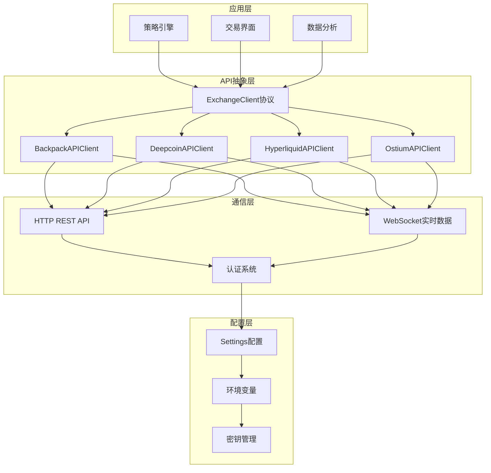
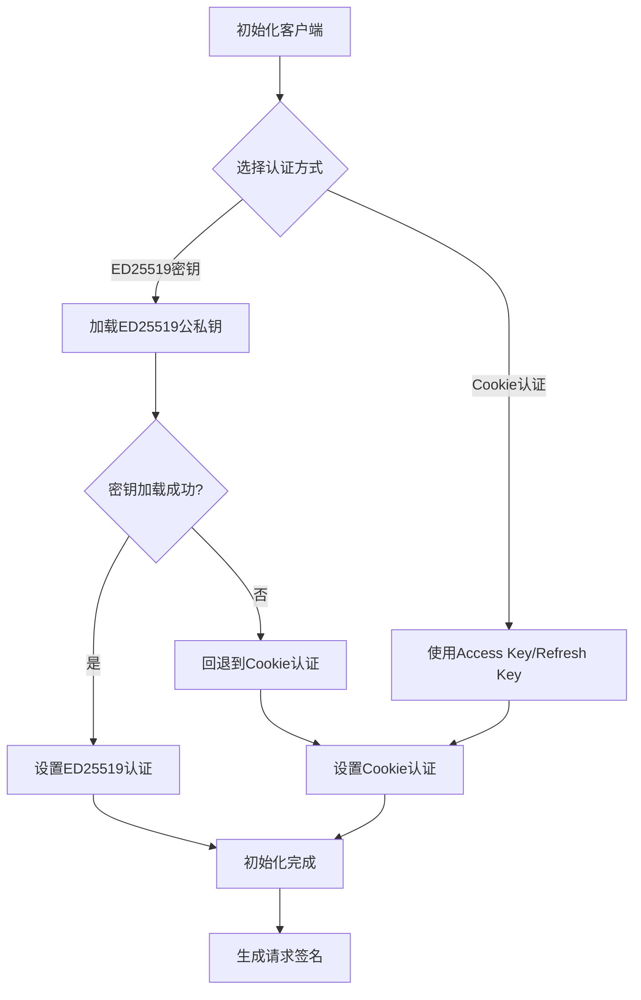
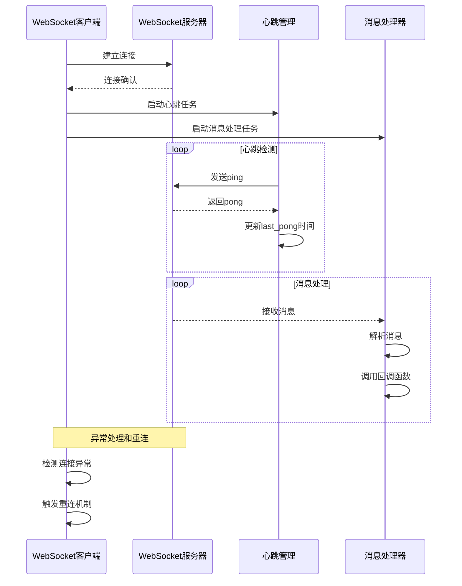
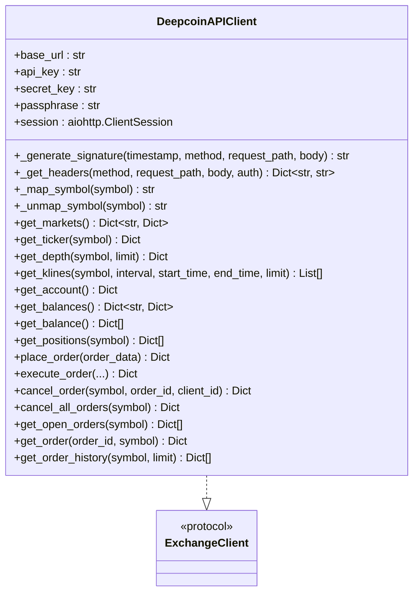
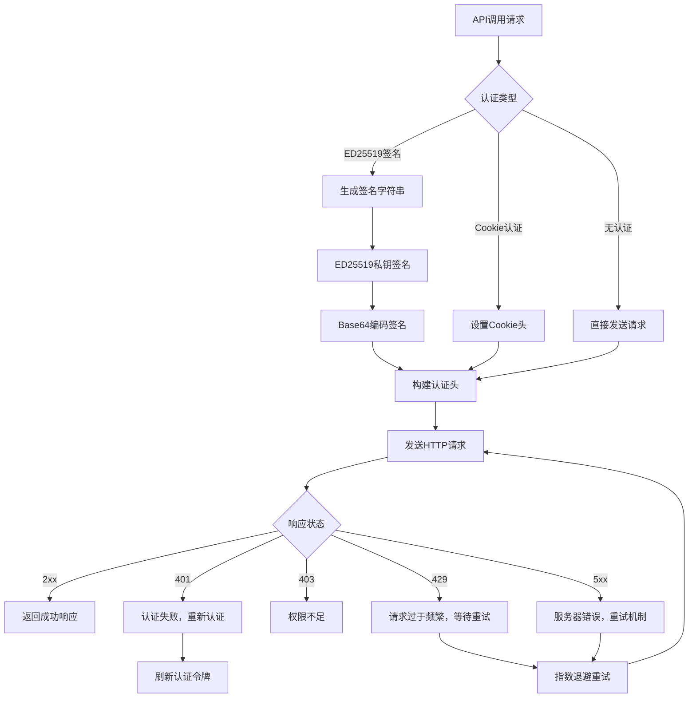
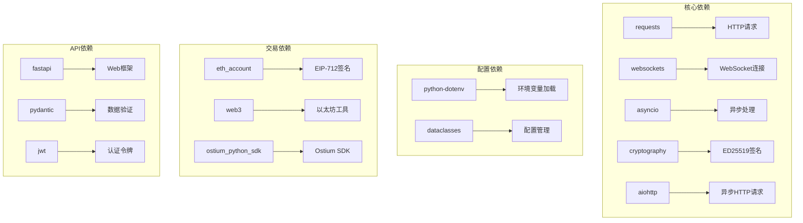

# API客户端系统

<cite>
**本文档引用的文件**
- [api_client.py](file://backpack_quant_trading/core/api_client.py)
- [settings.py](file://backpack_quant_trading/config/settings.py)
- [main.py](file://backpack_quant_trading/api/main.py)
- [deps.py](file://backpack_quant_trading/api/deps.py)
- [trading.py](file://backpack_quant_trading/api/routers/trading.py)
- [request.js](file://backpack_quant_trading/frontend/src/api/request.js)
- [deepcoin_client.py](file://backpack_quant_trading/core/deepcoin_client.py)
- [hyperliquid_client.py](file://backpack_quant_trading/core/hyperliquid_client.py)
- [ostium_client.py](file://backpack_quant_trading/core/ostium_client.py)
</cite>

## 目录
1. [简介](#简介)
2. [项目结构](#项目结构)
3. [核心组件](#核心组件)
4. [架构概览](#架构概览)
5. [详细组件分析](#详细组件分析)
6. [依赖分析](#依赖分析)
7. [性能考虑](#性能考虑)
8. [故障排除指南](#故障排除指南)
9. [结论](#结论)
10. [附录](#附录)

## 简介

本项目是一个基于Python的API客户端系统，专为量化交易而设计。系统采用统一抽象设计，支持多个加密货币交易所的适配，包括Backpack、Deepcoin、Hyperliquid和Ostium等。该系统提供了完整的API客户端实现，包括HTTP请求处理、WebSocket连接管理、认证流程、错误重试机制等功能。

系统的核心设计理念是通过接口抽象实现多交易所无缝切换，同时保持统一的API接口，使得上层策略和交易逻辑无需关心具体的交易所差异。BackpackAPIClient作为主要的API客户端，实现了完整的REST API和WebSocket功能，支持市场数据查询、账户管理、订单执行等核心交易功能。

## 项目结构

项目采用模块化的组织方式，主要分为以下几个核心部分：



**图表来源**
- [api_client.py:87-150](file://backpack_quant_trading/core/api_client.py#L87-L150)
- [settings.py:104-132](file://backpack_quant_trading/config/settings.py#L104-L132)
- [main.py:14-53](file://backpack_quant_trading/api/main.py#L14-L53)

**章节来源**
- [api_client.py:1-100](file://backpack_quant_trading/core/api_client.py#L1-L100)
- [settings.py:1-137](file://backpack_quant_trading/config/settings.py#L1-L137)

## 核心组件

### ExchangeClient协议

系统定义了一个统一的ExchangeClient协议，用于抽象不同交易所的API接口。该协议定义了完整的交易功能接口，包括市场数据查询、账户管理、订单执行等核心功能。



**图表来源**
- [api_client.py:22-85](file://backpack_quant_trading/core/api_client.py#L22-L85)
- [api_client.py:87-546](file://backpack_quant_trading/core/api_client.py#L87-L546)
- [deepcoin_client.py:18-488](file://backpack_quant_trading/core/deepcoin_client.py#L18-L488)

### BackpackAPIClient实现

BackpackAPIClient是系统的核心API客户端，实现了完整的Backpack交易所API功能。该实现包含了HTTP请求处理、WebSocket连接管理、认证流程、错误处理等完整功能。

**章节来源**
- [api_client.py:87-546](file://backpack_quant_trading/core/api_client.py#L87-L546)

## 架构概览

系统采用分层架构设计，通过统一的接口抽象实现多交易所适配：



**图表来源**
- [api_client.py:22-85](file://backpack_quant_trading/core/api_client.py#L22-L85)
- [settings.py:104-132](file://backpack_quant_trading/config/settings.py#L104-L132)

## 详细组件分析

### BackpackAPIClient详细分析

#### 认证机制

BackpackAPIClient支持两种认证方式：ED25519密钥认证和Cookie认证。



**图表来源**
- [api_client.py:90-142](file://backpack_quant_trading/core/api_client.py#L90-L142)
- [api_client.py:158-211](file://backpack_quant_trading/core/api_client.py#L158-L211)

#### HTTP请求处理

BackpackAPIClient使用requests.Session进行HTTP请求处理，支持同步包装以兼容异步接口。

**章节来源**
- [api_client.py:143-157](file://backpack_quant_trading/core/api_client.py#L143-L157)
- [api_client.py:213-269](file://backpack_quant_trading/core/api_client.py#L213-L269)

#### WebSocket连接管理

系统提供了完整的WebSocket客户端实现，支持连接管理、消息处理、订阅管理等功能。



**图表来源**
- [api_client.py:648-746](file://backpack_quant_trading/core/api_client.py#L648-L746)
- [api_client.py:705-724](file://backpack_quant_trading/core/api_client.py#L705-L724)

**章节来源**
- [api_client.py:599-944](file://backpack_quant_trading/core/api_client.py#L599-L944)

#### 数据格式转换

系统实现了完整的数据格式转换机制，支持不同交易所之间的数据格式统一。

**章节来源**
- [api_client.py:350-390](file://backpack_quant_trading/core/api_client.py#L350-L390)

### 多交易所适配机制

#### Deepcoin适配器

DeepcoinAPIClient实现了ExchangeClient协议，提供与Deepcoin交易所的完整适配。



**图表来源**
- [deepcoin_client.py:18-488](file://backpack_quant_trading/core/deepcoin_client.py#L18-L488)

**章节来源**
- [deepcoin_client.py:18-488](file://backpack_quant_trading/core/deepcoin_client.py#L18-L488)

#### Hyperliquid适配器

HyperliquidAPIClient实现了完整的EIP-712签名机制和订单执行功能。

**章节来源**
- [hyperliquid_client.py:18-546](file://backpack_quant_trading/core/hyperliquid_client.py#L18-L546)

#### Ostium适配器

OstiumAPIClient提供了基于Ostium SDK的完整适配，支持链上交易和价格查询。

**章节来源**
- [ostium_client.py:19-800](file://backpack_quant_trading/core/ostium_client.py#L19-L800)

### API认证流程

系统实现了多层次的认证机制，确保API调用的安全性和可靠性。



**图表来源**
- [api_client.py:158-211](file://backpack_quant_trading/core/api_client.py#L158-L211)
- [api_client.py:244-268](file://backpack_quant_trading/core/api_client.py#L244-L268)

**章节来源**
- [api_client.py:158-269](file://backpack_quant_trading/core/api_client.py#L158-L269)

### 请求限流处理

系统实现了智能的请求限流机制，通过指数退避算法处理API限流。

**章节来源**
- [api_client.py:688-704](file://backpack_quant_trading/core/api_client.py#L688-L704)

### 错误重试机制

系统提供了完善的错误处理和重试机制，确保API调用的可靠性。

**章节来源**
- [api_client.py:688-704](file://backpack_quant_trading/core/api_client.py#L688-L704)

## 依赖分析

系统采用模块化设计，各组件之间依赖关系清晰：



**图表来源**
- [api_client.py:1-18](file://backpack_quant_trading/core/api_client.py#L1-L18)
- [deepcoin_client.py:1-15](file://backpack_quant_trading/core/deepcoin_client.py#L1-L15)
- [hyperliquid_client.py:1-15](file://backpack_quant_trading/core/hyperliquid_client.py#L1-L15)

**章节来源**
- [api_client.py:1-18](file://backpack_quant_trading/core/api_client.py#L1-L18)
- [deepcoin_client.py:1-15](file://backpack_quant_trading/core/deepcoin_client.py#L1-L15)
- [hyperliquid_client.py:1-15](file://backpack_quant_trading/core/hyperliquid_client.py#L1-L15)

## 性能考虑

### 连接池管理

系统通过requests.Session实现HTTP连接池管理，提高请求效率。

**章节来源**
- [api_client.py:143-150](file://backpack_quant_trading/core/api_client.py#L143-L150)

### 超时处理

系统为所有网络请求设置了合理的超时时间，避免长时间阻塞。

**章节来源**
- [api_client.py:244-251](file://backpack_quant_trading/core/api_client.py#L244-L251)

### 缓存机制

BackpackAPIClient实现了市场数据缓存机制，减少重复请求。

**章节来源**
- [api_client.py:295-310](file://backpack_quant_trading/core/api_client.py#L295-L310)

## 故障排除指南

### 常见问题及解决方案

#### 认证失败

**问题症状**：API调用返回401错误
**可能原因**：
- ED25519密钥格式错误
- Cookie认证信息过期
- 时间戳不同步

**解决步骤**：
1. 验证ED25519公私钥格式
2. 检查系统时间同步
3. 重新生成认证令牌

#### 请求超时

**问题症状**：API调用长时间无响应
**可能原因**：
- 网络连接不稳定
- 服务器负载过高
- 防火墙阻拦

**解决步骤**：
1. 检查网络连接
2. 增加超时时间
3. 使用代理服务器

#### 限流错误

**问题症状**：API调用返回429错误
**解决步骤**：
1. 实现指数退避重试
2. 降低请求频率
3. 使用多个API密钥

**章节来源**
- [api_client.py:254-268](file://backpack_quant_trading/core/api_client.py#L254-L268)

## 结论

本API客户端系统通过统一的接口抽象设计，成功实现了多交易所的无缝适配。BackpackAPIClient作为核心组件，提供了完整的API功能，包括HTTP请求处理、WebSocket连接管理、认证流程、错误处理等。系统的设计充分考虑了性能、安全性和可靠性，为量化交易应用提供了坚实的基础。

通过模块化的架构设计和清晰的依赖关系，系统具有良好的可扩展性和维护性。未来可以进一步扩展支持更多的交易所，同时优化性能和增加更多高级功能。

## 附录

### API调用示例

#### 基础API调用

```javascript
// 获取市场数据
fetch('/api/trading/strategies')
  .then(response => response.json())
  .then(data => console.log(data));

// 启动交易实例
fetch('/api/trading/launch', {
  method: 'POST',
  headers: {
    'Content-Type': 'application/json',
  },
  body: JSON.stringify({
    platform: 'backpack',
    strategy: 'mean_reversion',
    symbol: 'ETH/USDC',
    size: 20,
    leverage: 50
  })
});
```

**章节来源**
- [request.js:1-33](file://backpack_quant_trading/frontend/src/api/request.js#L1-L33)
- [trading.py:334-462](file://backpack_quant_trading/api/routers/trading.py#L334-L462)

### 最佳实践

1. **认证管理**：妥善保管API密钥，定期轮换
2. **错误处理**：实现完善的异常处理和重试机制
3. **性能优化**：使用连接池和缓存机制
4. **安全考虑**：传输加密，访问控制，审计日志
5. **监控告警**：建立完整的监控和告警体系

### 安全考虑

1. **密钥管理**：使用环境变量存储敏感信息
2. **传输安全**：使用HTTPS和WebSocket加密连接
3. **访问控制**：实现多层身份验证和授权
4. **数据保护**：对敏感数据进行加密存储
5. **审计日志**：记录所有重要的操作和异常