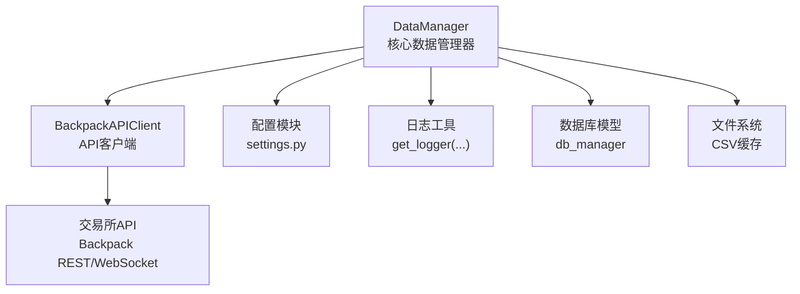
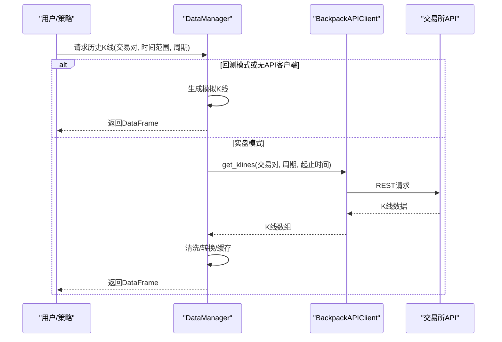
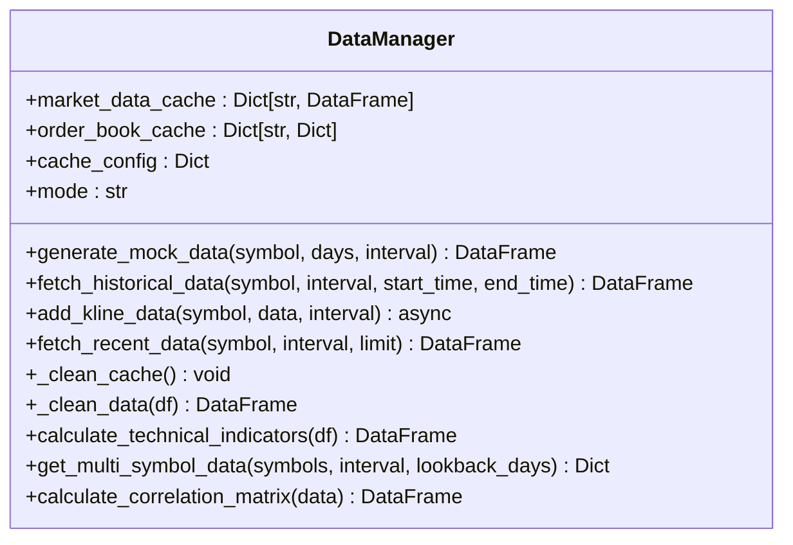
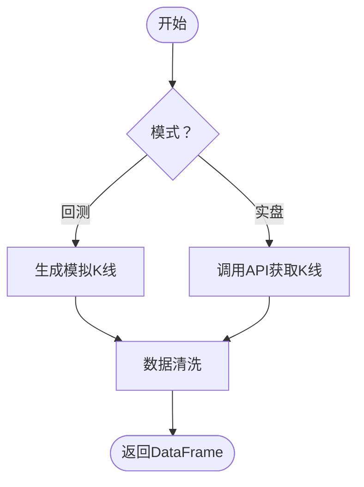
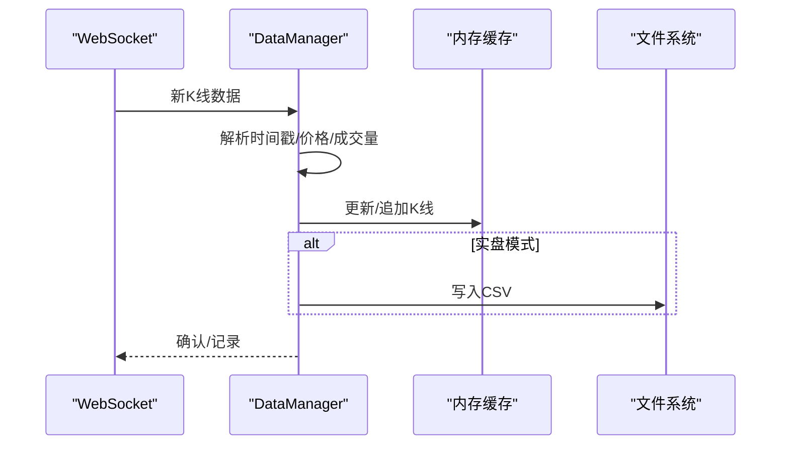
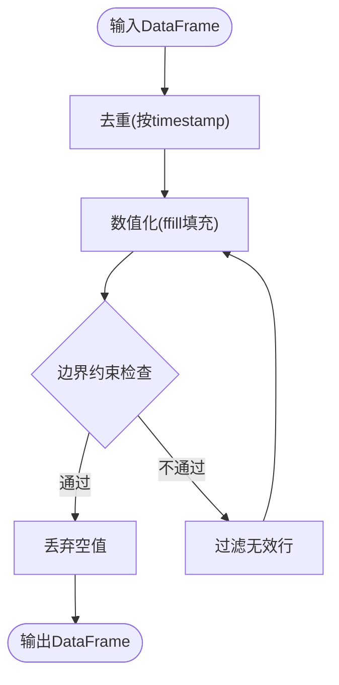
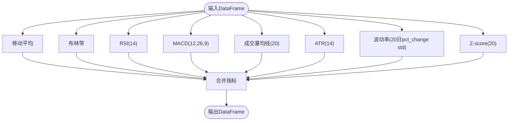
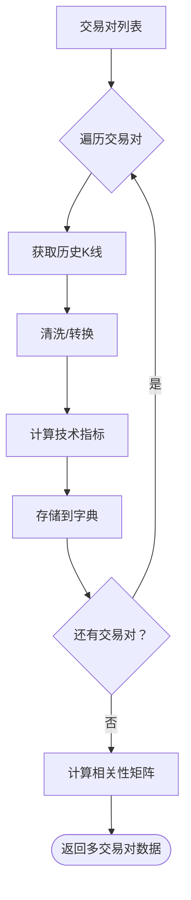
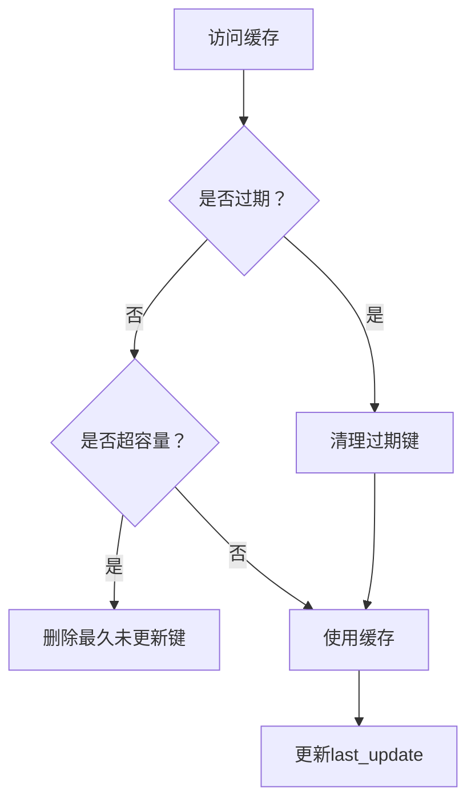
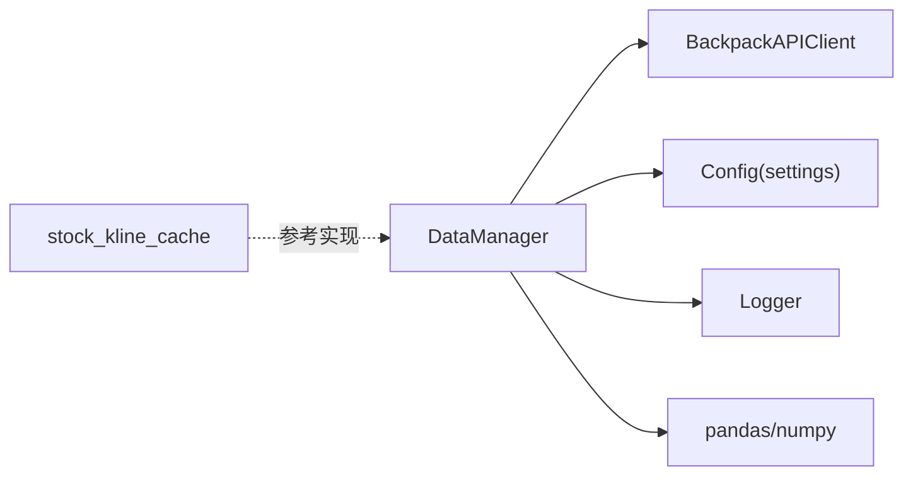

# 市场数据管理器

<cite>
**本文档引用的文件**
- [data_manager.py](file://backpack_quant_trading/core/data_manager.py)
- [api_client.py](file://backpack_quant_trading/core/api_client.py)
- [settings.py](file://backpack_quant_trading/config/settings.py)
- [stock_kline_cache.py](file://backpack_quant_trading/core/stock_kline_cache.py)
- [DATA_SOURCE_AND_CACHE.md](file://backpack_quant_trading/docs/DATA_SOURCE_AND_CACHE.md)
- [backtest.py](file://backpack_quant_trading/engine/backtest.py)
- [run_dual_freq_tv_backtest.py](file://backpack_quant_trading/run_dual_freq_tv_backtest.py)
</cite>

## 目录
1. [简介](#简介)
2. [项目结构](#项目结构)
3. [核心组件](#核心组件)
4. [架构总览](#架构总览)
5. [详细组件分析](#详细组件分析)
6. [依赖分析](#依赖分析)
7. [性能考虑](#性能考虑)
8. [故障排除指南](#故障排除指南)
9. [结论](#结论)
10. [附录](#附录)

## 简介
本文件为“市场数据管理器”（DataManager）的详细技术文档，面向开发者与量化研究人员，系统阐述以下主题：
- 历史数据获取与模拟数据生成
- 实时K线数据接入与缓存
- 数据清洗与质量控制
- 技术指标计算与多交易对数据管理
- 缓存策略、内存管理、性能优化与错误处理
- 数据配置示例、使用模式与常见问题解决

## 项目结构
DataManager位于核心模块，负责统一管理历史与实时数据，提供标准化的K线数据、技术指标与多资产数据聚合能力。其上层依赖API客户端与配置模块，下层可对接外部数据源或本地文件。

**图表来源**
- [data_manager.py:18-518](file://backpack_quant_trading/core/data_manager.py#L18-L518)
- [api_client.py:87-546](file://backpack_quant_trading/core/api_client.py#L87-L546)
- [settings.py:104-137](file://backpack_quant_trading/config/settings.py#L104-L137)

**章节来源**
- [data_manager.py:18-518](file://backpack_quant_trading/core/data_manager.py#L18-L518)
- [settings.py:104-137](file://backpack_quant_trading/config/settings.py#L104-L137)

## 核心组件
- DataManager：统一的历史数据获取、实时K线缓存、数据清洗、技术指标计算与多交易对聚合。
- BackpackAPIClient：封装Backpack交易所REST与WebSocket接口，提供K线、深度、账户等能力。
- 配置模块：集中管理API地址、密钥、数据库与交易参数等。
- 股票日K缓存（扩展能力）：A股日K本地缓存与增量拉取，供其他策略参考。

**章节来源**
- [data_manager.py:18-518](file://backpack_quant_trading/core/data_manager.py#L18-L518)
- [api_client.py:87-546](file://backpack_quant_trading/core/api_client.py#L87-L546)
- [settings.py:104-137](file://backpack_quant_trading/config/settings.py#L104-L137)

## 架构总览
DataManager在“回测/实盘/演示”三种模式下工作：
- 回测模式：优先生成模拟K线，保障离线可复现。
- 实盘模式：通过API客户端拉取真实K线，同时维护内存缓存与文件持久化。
- 多交易对：批量获取并统一计算技术指标，支持相关性分析。

**图表来源**
- [data_manager.py:114-168](file://backpack_quant_trading/core/data_manager.py#L114-L168)
- [api_client.py:322-339](file://backpack_quant_trading/core/api_client.py#L322-L339)

## 详细组件分析

### DataManager 类
- 类级别缓存：共享的市场数据与订单簿缓存，配合TTL与容量限制。
- 实例配置：数据目录、模拟价格初始化。
- 历史数据获取：支持回测模式下的模拟生成与实盘模式下的真实拉取。
- 实时K线接入：异步接收并更新内存缓存，支持文件落盘。
- 数据清洗：去重、数值转换、边界约束与缺失值填充。
- 技术指标：移动平均、布林带、RSI、MACD、成交量均线、ATR、波动率、Z-score。
- 多交易对：批量获取并统一计算指标，支持相关性矩阵。

**图表来源**
- [data_manager.py:18-518](file://backpack_quant_trading/core/data_manager.py#L18-L518)

**章节来源**
- [data_manager.py:18-518](file://backpack_quant_trading/core/data_manager.py#L18-L518)

### 历史数据获取与模拟数据生成
- 回测模式：当处于回测或无API客户端时，使用模拟算法生成K线，支持1小时、4小时、日线周期。
- 实盘模式：通过API客户端拉取真实K线，支持秒级时间戳与时间范围校验。
- 模拟算法：基于几何布朗运动，引入随机收益序列与波动率，生成开盘、最高、最低、收盘与成交量。

**图表来源**
- [data_manager.py:56-112](file://backpack_quant_trading/core/data_manager.py#L56-L112)
- [data_manager.py:114-168](file://backpack_quant_trading/core/data_manager.py#L114-L168)

**章节来源**
- [data_manager.py:56-112](file://backpack_quant_trading/core/data_manager.py#L56-L112)
- [data_manager.py:114-168](file://backpack_quant_trading/core/data_manager.py#L114-L168)

### 实时K线数据处理与缓存
- 异步接入：接收Backpack格式的K线数据，解析时间戳（支持毫秒/秒与ISO字符串），转换为北京时间。
- 安全转换：对价格与成交量进行安全浮点转换，跳过无效数据。
- 缓存更新：按交易对+周期维护内存缓存，支持更新与截断，防止无限增长。
- 文件持久化：实盘模式下将缓存写入CSV，便于跨进程共享。

**图表来源**
- [data_manager.py:169-290](file://backpack_quant_trading/core/data_manager.py#L169-L290)

**章节来源**
- [data_manager.py:169-290](file://backpack_quant_trading/core/data_manager.py#L169-L290)

### 数据清洗流程
- 去重：按时间戳去重。
- 数值化：将各列转换为数值并前向填充。
- 边界约束：确保最高不低于最低与开盘/收盘，成交量非负。
- 缺失值：最终丢弃仍为空的行。

**图表来源**
- [data_manager.py:352-374](file://backpack_quant_trading/core/data_manager.py#L352-L374)

**章节来源**
- [data_manager.py:352-374](file://backpack_quant_trading/core/data_manager.py#L352-L374)

### 技术指标计算方法
- 移动平均：MA5/MA20/MA50
- 布林带：20日均值与标准差，上下轨=均值±2×标准差
- RSI：14日相对强弱指标
- MACD：12/26指数移动平均与9日信号线及柱状图
- 成交量均线：20日成交量均线
- ATR：14日平均真实波幅
- 波动率：20日百分比变化标准差
- Z-score：20日收盘偏离与滚动标准差

**图表来源**
- [data_manager.py:405-461](file://backpack_quant_trading/core/data_manager.py#L405-L461)

**章节来源**
- [data_manager.py:405-461](file://backpack_quant_trading/core/data_manager.py#L405-L461)

### 多交易对数据管理与相关性分析
- 批量获取：指定交易对列表与周期，统一拉取并清洗。
- 指标统一：对每个交易对分别计算技术指标。
- 相关性：基于收盘价百分比变化计算相关性矩阵，便于资产选择与组合构建。

**图表来源**
- [data_manager.py:463-490](file://backpack_quant_trading/core/data_manager.py#L463-L490)

**章节来源**
- [data_manager.py:463-490](file://backpack_quant_trading/core/data_manager.py#L463-L490)

### 缓存策略与内存管理
- 类级别缓存：所有实例共享的市场数据与订单簿缓存。
- TTL与容量：按缓存键记录最后更新时间，超过TTL自动清理；当缓存数量超过上限时，删除最久未更新的项。
- 截断策略：实时缓存按最大容量进行尾部截断，避免无限增长。
- 文件持久化：实盘模式下将缓存写入CSV，实现跨进程共享与重启恢复。

**图表来源**
- [data_manager.py:26-31](file://backpack_quant_trading/core/data_manager.py#L26-L31)
- [data_manager.py:327-351](file://backpack_quant_trading/core/data_manager.py#L327-L351)
- [data_manager.py:291-301](file://backpack_quant_trading/core/data_manager.py#L291-L301)

**章节来源**
- [data_manager.py:26-31](file://backpack_quant_trading/core/data_manager.py#L26-L31)
- [data_manager.py:327-351](file://backpack_quant_trading/core/data_manager.py#L327-L351)
- [data_manager.py:291-301](file://backpack_quant_trading/core/data_manager.py#L291-L301)

### 性能优化与错误处理
- 性能优化
  - 内存缓存：类级别共享，降低重复拉取成本。
  - 批量处理：多交易对统一计算指标，减少重复运算。
  - 截断与TTL：控制内存占用与过期数据清理。
  - 文件持久化：实盘模式下落盘，避免丢失。
- 错误处理
  - 输入校验：时间范围、时间戳格式、数值转换异常。
  - API异常：捕获请求异常与400错误提示，记录详细上下文。
  - 数据清洗：丢弃无效行，保证指标稳定性。

**章节来源**
- [data_manager.py:169-290](file://backpack_quant_trading/core/data_manager.py#L169-L290)
- [data_manager.py:352-374](file://backpack_quant_trading/core/data_manager.py#L352-L374)
- [api_client.py:254-268](file://backpack_quant_trading/core/api_client.py#L254-L268)

### 数据配置示例与使用模式
- 配置示例
  - API基础地址、WebSocket地址、密钥与窗口参数由配置模块集中管理。
  - 数据库连接URL、交易参数（最大仓位、止损止盈比例等）集中配置。
- 使用模式
  - 回测：构造DataManager实例，设置mode为回测，直接生成模拟数据。
  - 实盘：注入API客户端，实时接入K线并缓存。
  - 多交易对：传入交易对列表与周期，统一获取并计算指标。

**章节来源**
- [settings.py:104-137](file://backpack_quant_trading/config/settings.py#L104-L137)
- [data_manager.py:32-42](file://backpack_quant_trading/core/data_manager.py#L32-L42)

### 常见问题与解决方案
- 问：为什么回测模式下数据量有限？
  - 答：回测模式默认限制为90天，避免过大数据集影响性能。
- 问：实时K线为何有时缺失？
  - 答：检查时间戳格式与API连接状态；无效数据会被跳过。
- 问：如何避免内存溢出？
  - 答：合理设置max_cache_size与cache_ttl；定期清理过期缓存。
- 问：相关性分析结果不稳定？
  - 答：确保数据清洗与指标计算完整；检查时间范围与缺失值处理。

**章节来源**
- [data_manager.py:128-130](file://backpack_quant_trading/core/data_manager.py#L128-L130)
- [data_manager.py:169-290](file://backpack_quant_trading/core/data_manager.py#L169-L290)
- [data_manager.py:327-351](file://backpack_quant_trading/core/data_manager.py#L327-L351)

## 依赖分析
- DataManager依赖API客户端进行真实数据拉取，依赖配置模块提供API地址与密钥，依赖日志工具输出运行信息。
- 多交易对数据管理依赖技术指标计算，相关性分析依赖pandas的协方差/相关性函数。
- 股票日K缓存模块展示了另一种本地缓存与增量拉取的实现思路，可作为扩展参考。

**图表来源**
- [data_manager.py:10-15](file://backpack_quant_trading/core/data_manager.py#L10-L15)
- [api_client.py:17](file://backpack_quant_trading/core/api_client.py#L17)
- [settings.py:104-137](file://backpack_quant_trading/config/settings.py#L104-L137)
- [stock_kline_cache.py:1-464](file://backpack_quant_trading/core/stock_kline_cache.py#L1-L464)

**章节来源**
- [data_manager.py:10-15](file://backpack_quant_trading/core/data_manager.py#L10-L15)
- [api_client.py:17](file://backpack_quant_trading/core/api_client.py#L17)
- [settings.py:104-137](file://backpack_quant_trading/config/settings.py#L104-L137)
- [stock_kline_cache.py:1-464](file://backpack_quant_trading/core/stock_kline_cache.py#L1-L464)

## 性能考虑
- 缓存命中率：合理设置TTL与容量，结合多交易对批量处理提升命中率。
- 数据清洗效率：使用向量化操作（pandas/numpy）与就地修改，减少副本开销。
- I/O优化：实盘模式下批量写入CSV，避免频繁磁盘IO。
- 指标计算：尽量在统一DataFrame上一次性计算，减少重复遍历。

## 故障排除指南
- API请求失败
  - 检查密钥与签名参数，确认时间戳未过期。
  - 查看响应状态码与错误信息，定位400错误原因。
- 数据为空或异常
  - 检查时间范围与时间戳格式，确保清洗逻辑正确执行。
  - 关注无效K线（如价格为0）被跳过的情况。
- 缓存异常
  - 检查TTL与容量阈值，确认清理逻辑正常触发。
  - 确认文件写入权限与路径存在。

**章节来源**
- [api_client.py:254-268](file://backpack_quant_trading/core/api_client.py#L254-L268)
- [data_manager.py:169-290](file://backpack_quant_trading/core/data_manager.py#L169-L290)
- [data_manager.py:327-351](file://backpack_quant_trading/core/data_manager.py#L327-L351)

## 结论
DataManager提供了从历史到实时、从单资产到多资产的全链路数据管理能力。通过模拟数据生成、严格的清洗流程、完善的缓存与文件持久化策略，以及丰富的技术指标计算，能够支撑回测与实盘策略开发。建议在实际部署中结合业务场景调整缓存参数与指标窗口，并持续监控API稳定性与数据质量。

## 附录
- 使用示例（回测）
  - 参考回测脚本，加载本地CSV或使用DataManager生成模拟数据，传入策略与引擎进行回测。
- 数据源与缓存（A股日K）
  - 参考文档与缓存模块，了解本地缓存与增量拉取的实现思路，可作为扩展参考。

**章节来源**
- [run_dual_freq_tv_backtest.py:56-125](file://backpack_quant_trading/run_dual_freq_tv_backtest.py#L56-L125)
- [DATA_SOURCE_AND_CACHE.md:1-71](file://backpack_quant_trading/docs/DATA_SOURCE_AND_CACHE.md#L1-L71)
- [stock_kline_cache.py:82-106](file://backpack_quant_trading/core/stock_kline_cache.py#L82-L106)