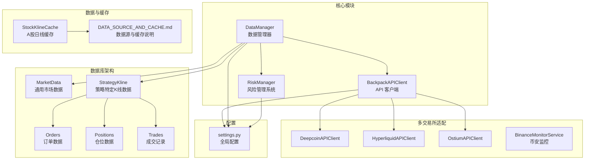
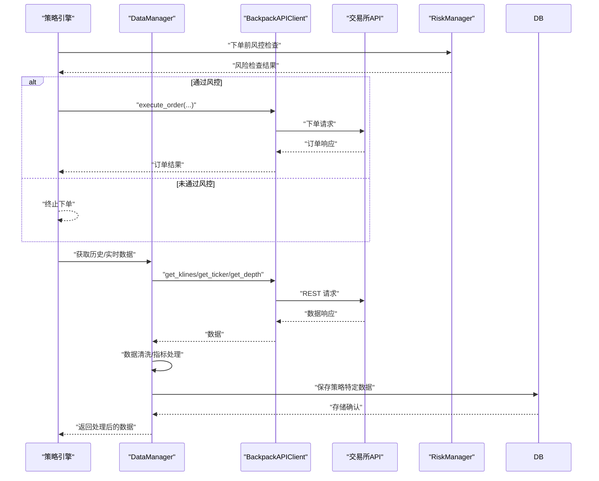
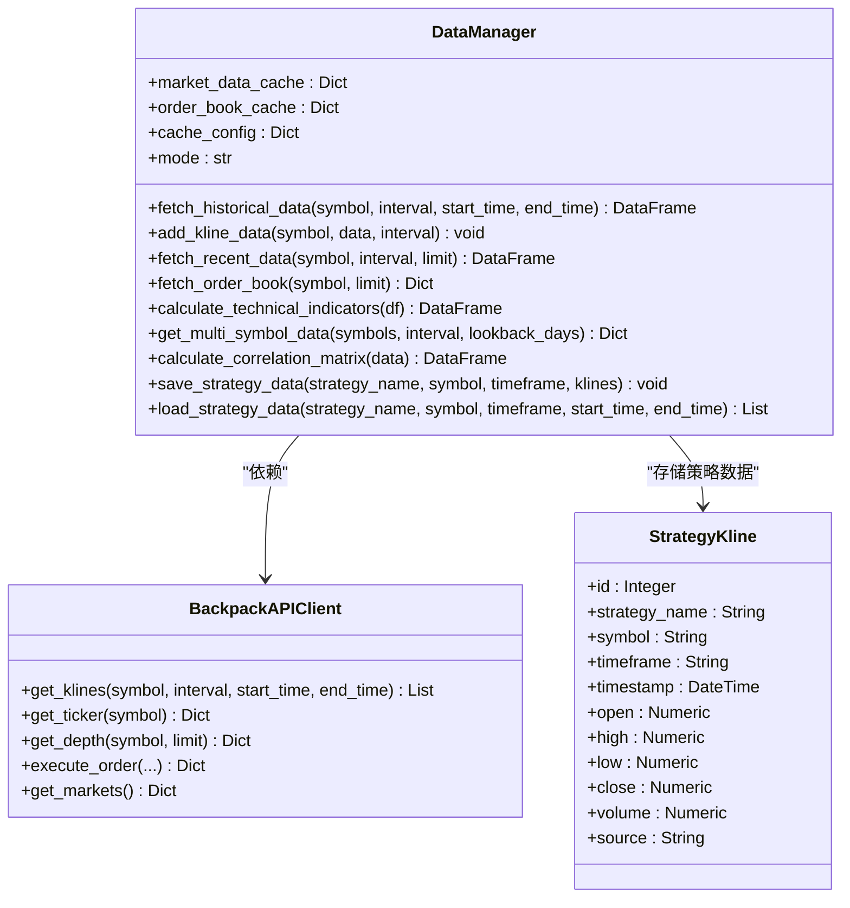
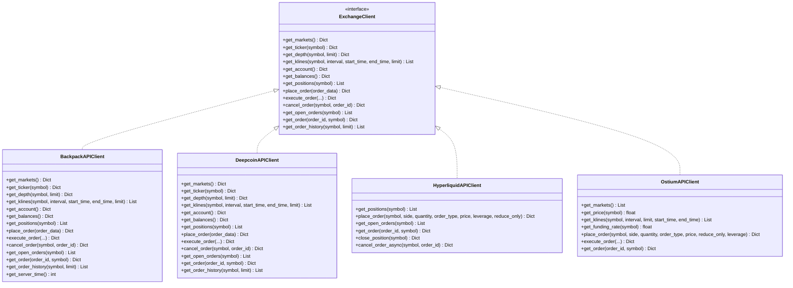
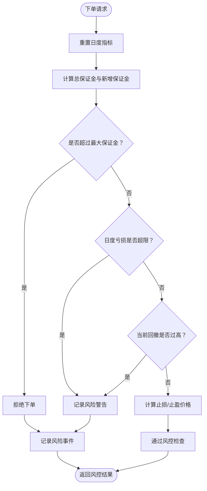
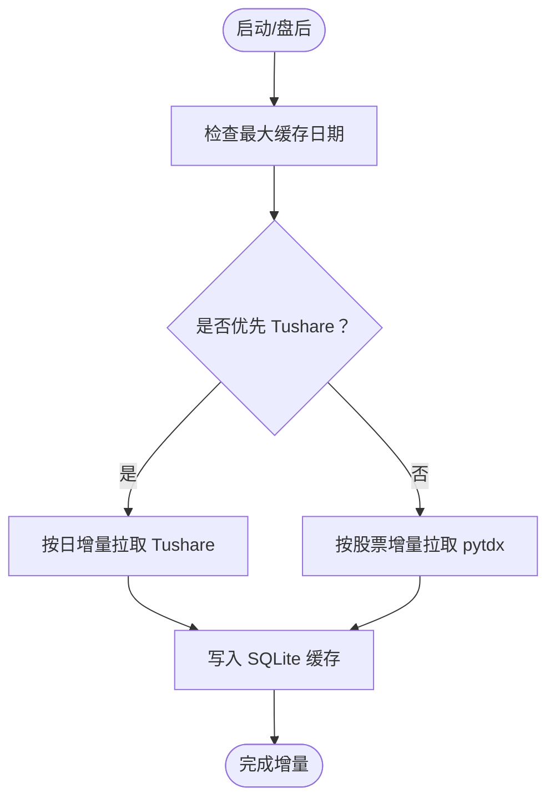
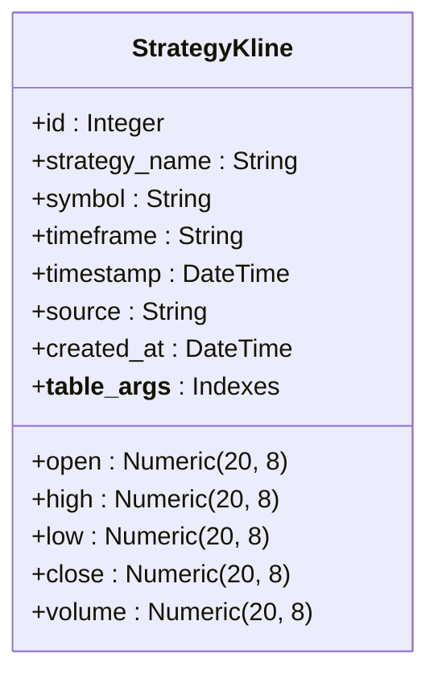
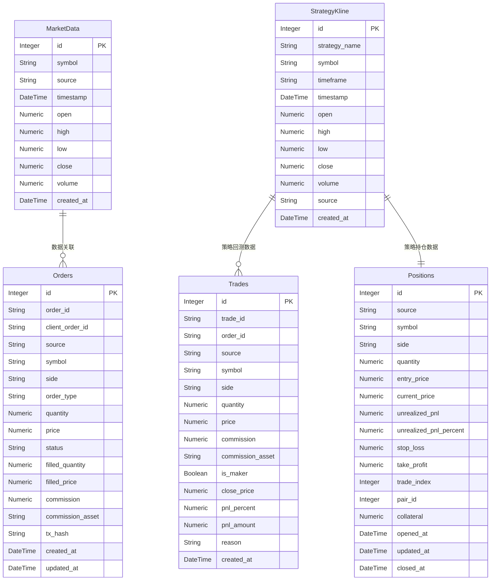
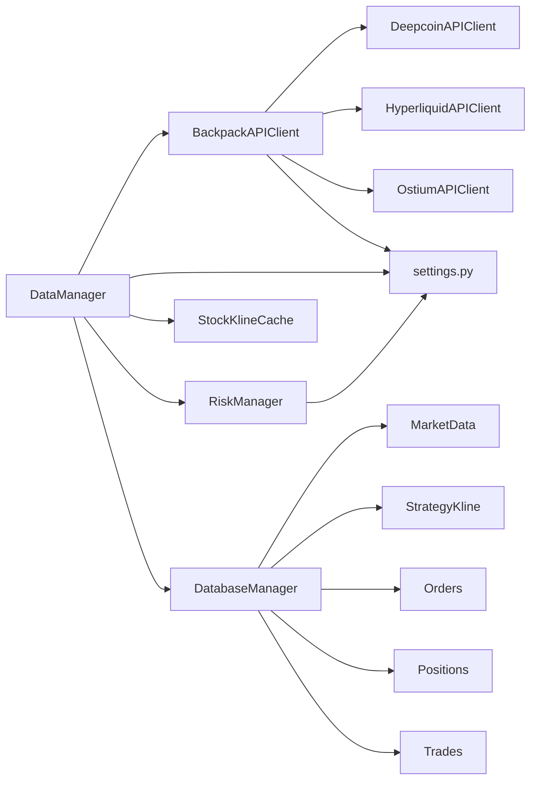

# 数据管理模块

<cite>
**本文档引用的文件**
- [data_manager.py](file://backpack_quant_trading/core/data_manager.py)
- [api_client.py](file://backpack_quant_trading/core/api_client.py)
- [risk_manager.py](file://backpack_quant_trading/core/risk_manager.py)
- [stock_kline_cache.py](file://backpack_quant_trading/core/stock_kline_cache.py)
- [models.py](file://backpack_quant_trading/database/models.py)
- [strategy.py](file://backpack_quant_trading/api/routers/strategy.py)
- [settings.py](file://backpack_quant_trading/config/settings.py)
- [binance_monitor.py](file://backpack_quant_trading/core/binance_monitor.py)
- [deepcoin_client.py](file://backpack_quant_trading/core/deepcoin_client.py)
- [hyperliquid_client.py](file://backpack_quant_trading/core/hyperliquid_client.py)
- [ostium_client.py](file://backpack_quant_trading/core/ostium_client.py)
- [DATA_SOURCE_AND_CACHE.md](file://backpack_quant_trading/docs/DATA_SOURCE_AND_CACHE.md)
</cite>

## 更新摘要
**变更内容**
- 新增策略特定的市场数据存储表（StrategyKline）支持多策略独立数据管理
- 增强数据库schema设计，完善策略回测数据存储架构
- 新增策略K线数据ORM映射和数据库操作方法
- 扩展数据管理器的数据库存储能力

## 目录
1. [简介](#简介)
2. [项目结构](#项目结构)
3. [核心组件](#核心组件)
4. [架构总览](#架构总览)
5. [详细组件分析](#详细组件分析)
6. [数据库Schema增强](#数据库schema增强)
7. [依赖关系分析](#依赖关系分析)
8. [性能考虑](#性能考虑)
9. [故障排除指南](#故障排除指南)
10. [结论](#结论)
11. [附录](#附录)

## 简介
本文件为数据管理模块的全面技术文档，聚焦以下目标：
- 数据管理器的数据获取、缓存与处理机制
- API 客户端的抽象设计、多交易所适配与实时数据订阅
- 风险管理系统的设计理念、风控规则与参数配置
- 数据流处理、缓存策略、错误处理与性能优化
- 数据配置示例与常见问题解决方案
- **新增**：策略特定市场数据存储架构与数据库Schema增强

## 项目结构
数据管理模块位于 backpack_quant_trading/core 目录，围绕 DataManager、API 客户端与风险控制三大核心展开，并辅以 A 股日线缓存、多交易所适配实现。**新增**策略特定数据存储架构支持多策略独立数据管理。

**图表来源**
- [data_manager.py](file://backpack_quant_trading/core/data_manager.py)
- [models.py](file://backpack_quant_trading/database/models.py)
- [strategy.py](file://backpack_quant_trading/api/routers/strategy.py)
- [api_client.py](file://backpack_quant_trading/core/api_client.py)
- [risk_manager.py](file://backpack_quant_trading/core/risk_manager.py)
- [stock_kline_cache.py](file://backpack_quant_trading/core/stock_kline_cache.py)
- [settings.py](file://backpack_quant_trading/config/settings.py)
- [binance_monitor.py](file://backpack_quant_trading/core/binance_monitor.py)
- [deepcoin_client.py](file://backpack_quant_trading/core/deepcoin_client.py)
- [hyperliquid_client.py](file://backpack_quant_trading/core/hyperliquid_client.py)
- [ostium_client.py](file://backpack_quant_trading/core/ostium_client.py)
- [DATA_SOURCE_AND_CACHE.md](file://backpack_quant_trading/docs/DATA_SOURCE_AND_CACHE.md)

**章节来源**
- [data_manager.py](file://backpack_quant_trading/core/data_manager.py)
- [models.py](file://backpack_quant_trading/database/models.py)
- [strategy.py](file://backpack_quant_trading/api/routers/strategy.py)
- [api_client.py](file://backpack_quant_trading/core/api_client.py)
- [risk_manager.py](file://backpack_quant_trading/core/risk_manager.py)
- [stock_kline_cache.py](file://backpack_quant_trading/core/stock_kline_cache.py)
- [settings.py](file://backpack_quant_trading/config/settings.py)
- [DATA_SOURCE_AND_CACHE.md](file://backpack_quant_trading/docs/DATA_SOURCE_AND_CACHE.md)

## 核心组件
- 数据管理器（DataManager）
  - 负责历史与实时数据获取、缓存、清洗、技术指标计算与多资产数据聚合
  - 支持回测模式下的模拟数据生成
  - **新增**：支持策略特定数据存储与查询
- API 客户端（BackpackAPIClient）
  - 交易所抽象接口（ExchangeClient 协议），统一 REST API 访问
  - 支持 WebSocket 订阅、心跳与重连、回调处理
- 风险管理系统（RiskManager）
  - 基于保证金、回撤、日度损益等指标的风险控制
  - 支持 VaR、压力测试与风险报告生成
- A 股日线缓存（StockKlineCache）
  - SQLite 本地缓存 + 增量拉取，优先 pytdx，可选 Tushare
- 多交易所适配
  - Deepcoin、Hyperliquid、Ostium 等客户端实现
  - 币安监控服务（K-倍数策略、订单簿预警）
- **新增**：策略特定数据存储
  - StrategyKline 表支持多策略独立K线数据存储
  - 支持策略回测数据导入与查询

**章节来源**
- [data_manager.py](file://backpack_quant_trading/core/data_manager.py)
- [api_client.py](file://backpack_quant_trading/core/api_client.py)
- [risk_manager.py](file://backpack_quant_trading/core/risk_manager.py)
- [stock_kline_cache.py](file://backpack_quant_trading/core/stock_kline_cache.py)
- [binance_monitor.py](file://backpack_quant_trading/core/binance_monitor.py)
- [deepcoin_client.py](file://backpack_quant_trading/core/deepcoin_client.py)
- [hyperliquid_client.py](file://backpack_quant_trading/core/hyperliquid_client.py)
- [ostium_client.py](file://backpack_quant_trading/core/ostium_client.py)

## 架构总览
数据管理模块采用"统一抽象 + 多实现 + 缓存 + 风控 + 策略数据分离"的分层架构：
- 抽象层：ExchangeClient 协议定义统一接口
- 适配层：BackpackAPIClient 作为统一入口，其他交易所客户端实现协议
- 数据层：DataManager 负责数据获取、缓存与处理，**新增**策略数据分离存储
- 风控层：RiskManager 在下单前进行风控校验
- 监控层：BinanceMonitorService 提供外部监控与预警
- **新增**：策略数据层：StrategyKline 支持多策略独立数据管理

**图表来源**
- [data_manager.py](file://backpack_quant_trading/core/data_manager.py)
- [api_client.py](file://backpack_quant_trading/core/api_client.py)
- [risk_manager.py](file://backpack_quant_trading/core/risk_manager.py)

## 详细组件分析

### 数据管理器（DataManager）
职责与特性：
- 历史数据获取：支持回测模式下的模拟数据生成与真实交易所数据获取
- 实时数据接入：支持 WebSocket 实时 K 线增量更新与本地持久化
- 缓存策略：类级共享缓存、TTL 过期、容量限制与自动清理
- 数据清洗与指标：缺失值填充、价格合法性校验、技术指标计算（MA、布林带、RSI、MACD、ATR、波动率、ZScore）
- 多资产聚合：批量获取与相关性矩阵计算
- **新增**：策略特定数据存储与查询接口

**图表来源**
- [data_manager.py](file://backpack_quant_trading/core/data_manager.py)
- [api_client.py](file://backpack_quant_trading/core/api_client.py)
- [models.py](file://backpack_quant_trading/database/models.py)

**章节来源**
- [data_manager.py](file://backpack_quant_trading/core/data_manager.py)

### API 客户端抽象与多交易所适配
- 抽象接口（ExchangeClient 协议）：统一市场、行情、深度、K 线、账户、订单等接口
- BackpackAPIClient：统一 REST 与 WebSocket 访问，支持 Cookie/ED25519 签名、会话封装、缓存与错误处理
- 多交易所适配：
  - Deepcoin：REST 接口映射、符号转换、下单与订单查询
  - Hyperliquid：EIP-712 签名、杠杆设置、订单与持仓查询
  - Ostium：SDK 集成、价格与资金费率查询、下单与订单状态查询
- 币安监控：K-倍数策略、订单簿预警、钉钉告警

**图表来源**
- [api_client.py](file://backpack_quant_trading/core/api_client.py)
- [deepcoin_client.py](file://backpack_quant_trading/core/deepcoin_client.py)
- [hyperliquid_client.py](file://backpack_quant_trading/core/hyperliquid_client.py)
- [ostium_client.py](file://backpack_quant_trading/core/ostium_client.py)

**章节来源**
- [api_client.py](file://backpack_quant_trading/core/api_client.py)
- [deepcoin_client.py](file://backpack_quant_trading/core/deepcoin_client.py)
- [hyperliquid_client.py](file://backpack_quant_trading/core/hyperliquid_client.py)
- [ostium_client.py](file://backpack_quant_trading/core/ostium_client.py)

### 风险管理系统（RiskManager）
设计理念与规则：
- 以保证金为核心约束，累计多交易对总保证金不超过账户资金的一定比例
- 结合日度损益、回撤、止盈止损阈值进行综合评分与拦截
- 支持 VaR（历史法、参数法、蒙特卡洛）、压力测试与风险报告生成

**图表来源**
- [risk_manager.py](file://backpack_quant_trading/core/risk_manager.py)

**章节来源**
- [risk_manager.py](file://backpack_quant_trading/core/risk_manager.py)

### A 股日线缓存与增量方案
- 本地 SQLite 缓存，表结构与 Tushare 日线对齐
- 增量策略：pytdx 优先（免费、全市场日线），可选 Tushare（按日全市场）
- 选股/预测阶段从缓存读取，避免实时逐只请求，提升性能

**图表来源**
- [stock_kline_cache.py](file://backpack_quant_trading/core/stock_kline_cache.py)
- [DATA_SOURCE_AND_CACHE.md](file://backpack_quant_trading/docs/DATA_SOURCE_AND_CACHE.md)

**章节来源**
- [stock_kline_cache.py](file://backpack_quant_trading/core/stock_kline_cache.py)
- [DATA_SOURCE_AND_CACHE.md](file://backpack_quant_trading/docs/DATA_SOURCE_AND_CACHE.md)

## 数据库Schema增强

### 新增策略特定数据存储架构
**更新**：数据库Schema已增强，新增策略特定的市场数据存储表，支持多策略独立数据管理。

#### StrategyKline 表结构
策略特定的K线数据表，支持多策略独立存储：

**图表来源**
- [models.py](file://backpack_quant_trading/database/models.py)

#### 数据库表关系图

**图表来源**
- [models.py](file://backpack_quant_trading/database/models.py)

#### 策略数据管理功能
- **数据导入**：支持从CSV文件导入策略回测数据
- **数据查询**：按策略名称、交易对、时间框架查询K线数据
- **数据存储**：支持实时策略数据的增量存储
- **数据清理**：支持策略特定数据的批量清理

**章节来源**
- [models.py](file://backpack_quant_trading/database/models.py)
- [strategy.py](file://backpack_quant_trading/api/routers/strategy.py)

## 依赖关系分析
- DataManager 依赖 BackpackAPIClient 获取历史与实时数据，并通过缓存与清洗提升性能
- API 客户端通过 ExchangeClient 协议实现多交易所适配，BackpackAPIClient 作为统一入口
- RiskManager 与 DataManager 协作，风控前置拦截，保障交易安全
- A 股日线缓存独立于交易模块，服务于选股与预测阶段
- **新增**：策略数据存储依赖 DatabaseManager 进行数据持久化

**图表来源**
- [data_manager.py](file://backpack_quant_trading/core/data_manager.py)
- [api_client.py](file://backpack_quant_trading/core/api_client.py)
- [risk_manager.py](file://backpack_quant_trading/core/risk_manager.py)
- [stock_kline_cache.py](file://backpack_quant_trading/core/stock_kline_cache.py)
- [models.py](file://backpack_quant_trading/database/models.py)
- [settings.py](file://backpack_quant_trading/config/settings.py)

**章节来源**
- [data_manager.py](file://backpack_quant_trading/core/data_manager.py)
- [api_client.py](file://backpack_quant_trading/core/api_client.py)
- [risk_manager.py](file://backpack_quant_trading/core/risk_manager.py)
- [stock_kline_cache.py](file://backpack_quant_trading/core/stock_kline_cache.py)
- [models.py](file://backpack_quant_trading/database/models.py)
- [settings.py](file://backpack_quant_trading/config/settings.py)

## 性能考虑
- 缓存策略
  - 类级共享缓存、TTL 过期、容量限制与自动清理，避免内存膨胀
  - 实时 K 线增量更新，仅追加或更新最新 K 线，控制缓存大小
- 数据清洗与指标计算
  - 使用向量化与滚动窗口计算，避免逐行遍历
  - 缺失值前向填充与价格合法性校验，减少异常数据影响
- 多交易所适配
  - REST 请求封装为异步线程池调用，降低阻塞
  - WebSocket 心跳与重连，提升稳定性
- A 股日线缓存
  - 本地 SQLite 存储，按日期与代码建立索引，加速查询
  - 增量更新，避免全量拉取
- **新增**：策略数据存储优化
  - 策略特定数据表建立复合索引，支持快速查询
  - 数据批量写入，减少数据库连接开销
  - 策略数据分区存储，避免数据冗余

## 故障排除指南
- API 请求失败
  - 检查签名参数与时间戳，确认系统时间与时区设置
  - 查看响应状态码与错误信息，定位参数缺失或限流问题
- WebSocket 连接异常
  - 检查代理设置、心跳超时与重连次数
  - 确认订阅流格式与回调函数注册
- 风控拦截
  - 检查总保证金与账户资金比例、日度损益与回撤阈值
  - 调整止盈止损比例与最大仓位比例
- A 股缓存问题
  - 确认 pytdx/Tushare 可用性与 Token 配置
  - 检查 SQLite 文件权限与索引完整性
- **新增**：策略数据存储问题
  - 检查策略名称、交易对、时间框架参数是否正确
  - 确认数据库连接配置与表结构完整性
  - 验证CSV数据格式与字段映射关系

**章节来源**
- [api_client.py](file://backpack_quant_trading/core/api_client.py)
- [risk_manager.py](file://backpack_quant_trading/core/risk_manager.py)
- [stock_kline_cache.py](file://backpack_quant_trading/core/stock_kline_cache.py)
- [models.py](file://backpack_quant_trading/database/models.py)

## 结论
数据管理模块通过统一的 API 抽象、完善的缓存与清洗机制、严谨的风险控制以及多交易所适配，构建了高效、稳定、可扩展的数据基础设施。**新增**的策略特定数据存储架构进一步增强了模块的灵活性，支持多策略独立数据管理。结合 A 股日线缓存与实时监控能力，能够支撑策略研究、回测与实盘交易的全流程需求。

## 附录

### 数据配置示例
- 全局配置（settings.py）
  - Backpack API 基础地址、WS 地址、API Key/Secret、Cookie 认证参数
  - 交易配置：最大仓位比例、日度最大亏损、最大回撤、止损止盈比例、杠杆等
  - 数据库配置：主机、端口、用户名、密码、连接池参数
- 环境变量
  - BACKPACK_API_KEY、BACKPACK_PRIVATE_KEY、BACKPACK_ACCESS_KEY、BACKPACK_REFRESH_KEY
  - DB_HOST、DB_PORT、DB_USER、DB_PASSWORD、DB_NAME
  - WEBHOOK_SECRET、WEBHOOK_HOST、WEBHOOK_PORT、DINGTALK_TOKEN、DINGTALK_SECRET
  - PREFER_TUSHARE、TUSHARE_TOKEN（A 股缓存）
  - HYPERLIQUID_PRIVATE_KEY、HYPERLIQUID_AGENT_ADDRESS（Hyperliquid）
  - OSTIUM_RPC_URL、OSTIUM_PRIVATE_KEY、OSTIUM_NETWORK、OSTIUM_SYMBOL、OSTIUM_LEVERAGE（Ostium）

**章节来源**
- [settings.py](file://backpack_quant_trading/config/settings.py)

### 常见问题与解决方案
- 无法获取历史数据
  - 检查时间范围与交易所限制，回测模式下可使用模拟数据
- WebSocket 订阅无数据
  - 确认订阅流名称与格式，检查回调注册与心跳状态
- 风控频繁拦截
  - 适当提高最大仓位比例或降低止损比例，关注日度损益与回撤
- A 股缓存未更新
  - 确认 pytdx/Tushare 可用性，检查增量脚本执行与 SQLite 权限
- **新增**：策略数据存储问题
  - 检查策略名称格式与唯一性约束
  - 验证时间戳格式与时区转换
  - 确认CSV文件编码与字段完整性

**章节来源**
- [data_manager.py](file://backpack_quant_trading/core/data_manager.py)
- [api_client.py](file://backpack_quant_trading/core/api_client.py)
- [risk_manager.py](file://backpack_quant_trading/core/risk_manager.py)
- [stock_kline_cache.py](file://backpack_quant_trading/core/stock_kline_cache.py)
- [models.py](file://backpack_quant_trading/database/models.py)