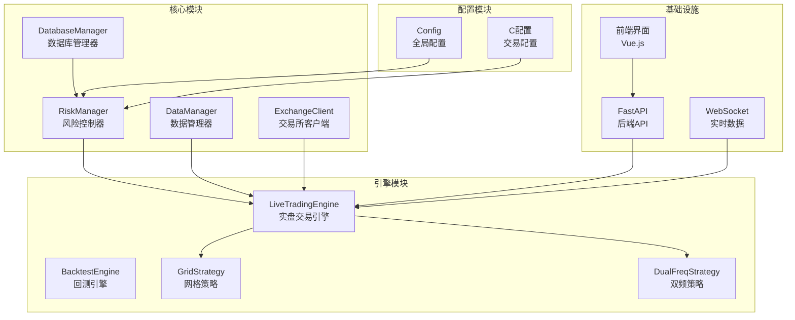
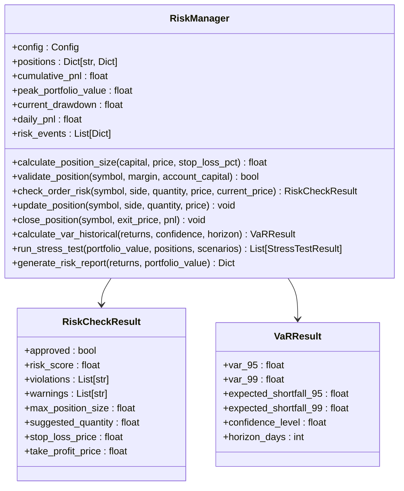
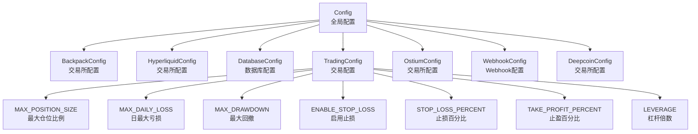
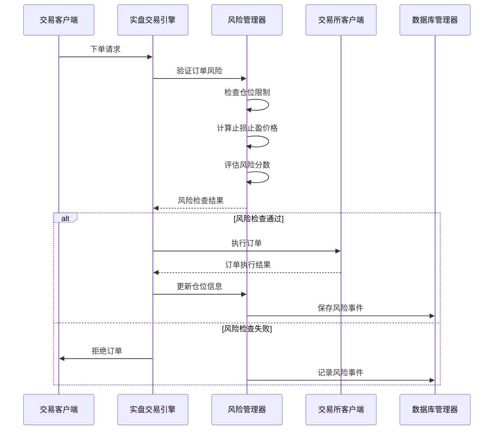
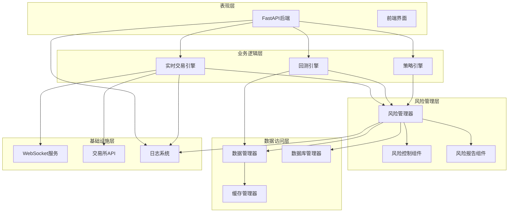
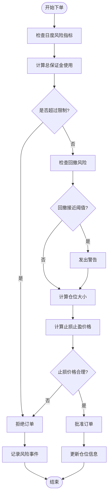
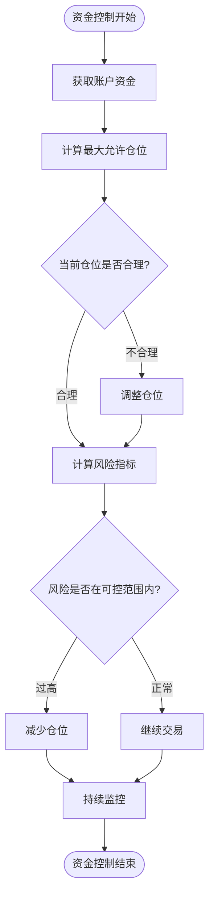
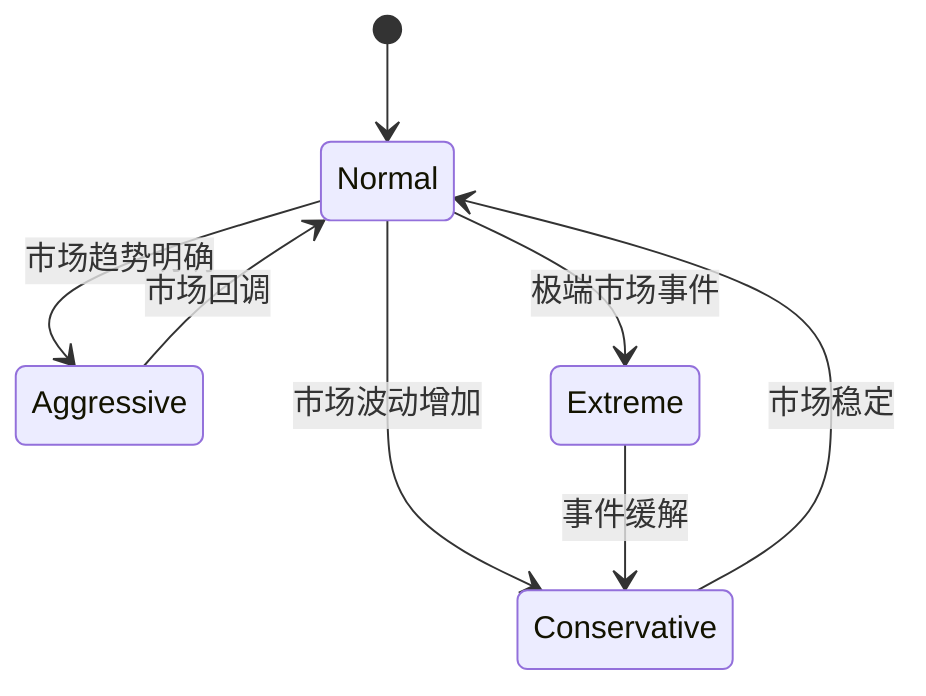
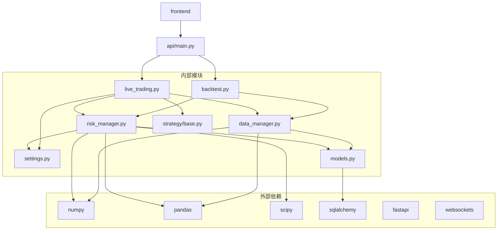

# 风险管理系统

<cite>
**本文档引用的文件**
- [risk_manager.py](file://backpack_quant_trading/core/risk_manager.py)
- [settings.py](file://backpack_quant_trading/config/settings.py)
- [live_trading.py](file://backpack_quant_trading/engine/live_trading.py)
- [backtest.py](file://backpack_quant_trading/engine/backtest.py)
- [models.py](file://backpack_quant_trading/database/models.py)
- [data_manager.py](file://backpack_quant_trading/core/data_manager.py)
- [base.py](file://backpack_quant_trading/strategy/base.py)
- [grid_strategy.py](file://backpack_quant_trading/strategy/grid_strategy.py)
- [dual_freq_trend.py](file://backpack_quant_trading/strategy/dual_freq_trend.py)
</cite>

## 目录
1. [简介](#简介)
2. [项目结构](#项目结构)
3. [核心组件](#核心组件)
4. [架构概览](#架构概览)
5. [详细组件分析](#详细组件分析)
6. [依赖关系分析](#依赖关系分析)
7. [性能考虑](#性能考虑)
8. [故障排除指南](#故障排除指南)
9. [结论](#结论)
10. [附录](#附录)

## 简介

风险管理系统是量化交易框架的核心组成部分，负责实时监控和控制交易过程中的各种风险因素。该系统采用多层次的风险控制策略，包括仓位管理、止损止盈机制、资金控制逻辑、风险指标计算和动态风险调整等功能。

系统基于Python开发，集成了多种风险控制技术和算法，为量化交易提供了全面的风险管理解决方案。通过实时监控市场数据、交易执行和账户状态，系统能够及时识别和应对各种潜在风险。

## 项目结构

该项目采用模块化架构设计，主要分为以下几个核心模块：



**图表来源**
- [risk_manager.py:1-566](file://backpack_quant_trading/core/risk_manager.py#L1-L566)
- [live_trading.py:347-567](file://backpack_quant_trading/engine/live_trading.py#L347-L567)
- [settings.py:104-137](file://backpack_quant_trading/config/settings.py#L104-L137)

**章节来源**
- [risk_manager.py:1-566](file://backpack_quant_trading/core/risk_manager.py#L1-L566)
- [live_trading.py:1-800](file://backpack_quant_trading/engine/live_trading.py#L1-L800)
- [settings.py:1-137](file://backpack_quant_trading/config/settings.py#L1-L137)

## 核心组件

### 风险管理器 (RiskManager)

RiskManager是系统的核心组件，负责执行所有风险控制逻辑。它提供了完整的风险管理功能，包括仓位验证、风险检查、风险指标计算和风险事件记录。

#### 主要功能特性

1. **仓位管理**: 实时监控和控制交易仓位大小
2. **风险检查**: 对订单进行风险评估和验证
3. **风险指标**: 计算和跟踪关键风险指标
4. **风险事件**: 记录和报告风险事件
5. **VaR计算**: 使用多种方法计算风险价值
6. **压力测试**: 评估极端市场情况下的风险影响

#### 关键数据结构



**图表来源**
- [risk_manager.py:48-566](file://backpack_quant_trading/core/risk_manager.py#L48-L566)

**章节来源**
- [risk_manager.py:48-566](file://backpack_quant_trading/core/risk_manager.py#L48-L566)

### 配置管理系统

系统采用集中式配置管理，通过Config类统一管理所有配置参数。配置系统支持多种交易场景和风险控制策略。

#### 配置层次结构



**图表来源**
- [settings.py:104-137](file://backpack_quant_trading/config/settings.py#L104-L137)
- [settings.py:55-65](file://backpack_quant_trading/config/settings.py#L55-L65)

**章节来源**
- [settings.py:104-137](file://backpack_quant_trading/config/settings.py#L104-L137)
- [settings.py:55-65](file://backpack_quant_trading/config/settings.py#L55-L65)

### 交易引擎集成

系统通过LiveTradingEngine集成风险管理系统，实现实时风险控制和监控。

#### 实盘交易流程



**图表来源**
- [live_trading.py:347-567](file://backpack_quant_trading/engine/live_trading.py#L347-L567)
- [risk_manager.py:132-229](file://backpack_quant_trading/core/risk_manager.py#L132-L229)

**章节来源**
- [live_trading.py:347-567](file://backpack_quant_trading/engine/live_trading.py#L347-L567)
- [risk_manager.py:132-229](file://backpack_quant_trading/core/risk_manager.py#L132-L229)

## 架构概览

系统采用分层架构设计，确保各个组件之间的松耦合和高内聚。



**图表来源**
- [main.py:14-98](file://backpack_quant_trading/api/main.py#L14-L98)
- [live_trading.py:347-567](file://backpack_quant_trading/engine/live_trading.py#L347-L567)
- [risk_manager.py:48-566](file://backpack_quant_trading/core/risk_manager.py#L48-L566)

**章节来源**
- [main.py:14-98](file://backpack_quant_trading/api/main.py#L14-L98)
- [live_trading.py:347-567](file://backpack_quant_trading/engine/live_trading.py#L347-L567)
- [risk_manager.py:48-566](file://backpack_quant_trading/core/risk_manager.py#L48-L566)

## 详细组件分析

### 风险控制策略

系统实现了多层次的风险控制策略，确保交易过程中的风险得到有效管理。

#### 仓位管理策略



**图表来源**
- [risk_manager.py:132-229](file://backpack_quant_trading/core/risk_manager.py#L132-L229)
- [risk_manager.py:231-268](file://backpack_quant_trading/core/risk_manager.py#L231-L268)

#### 止损止盈机制

系统采用动态止损止盈机制，根据市场波动性和交易方向自动调整风险参数。

##### 止损止盈计算逻辑

| 参数 | 多头计算 | 空头计算 |
|------|----------|----------|
| 止损价格 | `current_price * (1 - STOP_LOSS_PERCENT)` | `current_price * (1 + STOP_LOSS_PERCENT)` |
| 止盈价格 | `current_price * (1 + TAKE_PROFIT_PERCENT)` | `current_price * (1 - TAKE_PROFIT_PERCENT)` |
| 风险回报比 | `(TAKE_PROFIT_PERCENT / STOP_LOSS_PERCENT)` | `(TAKE_PROFIT_PERCENT / STOP_LOSS_PERCENT)` |

**章节来源**
- [risk_manager.py:192-199](file://backpack_quant_trading/core/risk_manager.py#L192-L199)
- [settings.py:60-62](file://backpack_quant_trading/config/settings.py#L60-L62)

### 资金控制逻辑

系统实现了严格的资金控制机制，确保交易过程中的资金安全。

#### 资金控制流程



**图表来源**
- [risk_manager.py:78-86](file://backpack_quant_trading/core/risk_manager.py#L78-L86)
- [risk_manager.py:87-131](file://backpack_quant_trading/core/risk_manager.py#L87-L131)

**章节来源**
- [risk_manager.py:78-131](file://backpack_quant_trading/core/risk_manager.py#L78-L131)

### 风险指标计算

系统提供了多种风险指标计算方法，包括VaR（风险价值）、压力测试和风险评分。

#### VaR计算方法对比

| 方法 | 适用场景 | 计算复杂度 | 准确性 |
|------|----------|------------|--------|
| 历史模拟法 | 历史数据充足 | 低 | 中等 |
| 参数法 | 正态分布假设 | 低 | 中等 |
| 蒙特卡洛法 | 复杂衍生品 | 高 | 高 |
| 简化计算 | 数据不足 | 低 | 低 |

**章节来源**
- [risk_manager.py:331-416](file://backpack_quant_trading/core/risk_manager.py#L331-L416)

### 动态风险调整

系统支持动态风险调整机制，能够根据市场条件和交易表现自动调整风险参数。

#### 动态调整策略



**图表来源**
- [risk_manager.py:516-562](file://backpack_quant_trading/core/risk_manager.py#L516-L562)

**章节来源**
- [risk_manager.py:516-562](file://backpack_quant_trading/core/risk_manager.py#L516-L562)

### 风险监控告警

系统建立了完善的实时风险监控和告警机制，确保及时发现和处理风险事件。

#### 风险事件分类

| 风险等级 | 触发条件 | 处理措施 | 告警级别 |
|----------|----------|----------|----------|
| 低风险 | 小幅波动 | 监控观察 | 信息 |
| 中风险 | 轻微超限 | 发出警告 | 警告 |
| 高风险 | 严重超限 | 自动减仓 | 严重 |
| 关键风险 | 系统故障 | 紧急停机 | 紧急 |

**章节来源**
- [risk_manager.py:302-330](file://backpack_quant_trading/core/risk_manager.py#L302-L330)
- [models.py:38-43](file://backpack_quant_trading/database/models.py#L38-L43)

## 依赖关系分析

系统采用模块化设计，各组件之间的依赖关系清晰明确。



**图表来源**
- [risk_manager.py:1-11](file://backpack_quant_trading/core/risk_manager.py#L1-L11)
- [live_trading.py:14-18](file://backpack_quant_trading/engine/live_trading.py#L14-L18)
- [data_manager.py:1-14](file://backpack_quant_trading/core/data_manager.py#L1-L14)

**章节来源**
- [risk_manager.py:1-11](file://backpack_quant_trading/core/risk_manager.py#L1-L11)
- [live_trading.py:14-18](file://backpack_quant_trading/engine/live_trading.py#L14-L18)
- [data_manager.py:1-14](file://backpack_quant_trading/core/data_manager.py#L1-L14)

## 性能考虑

系统在设计时充分考虑了性能优化，采用了多种技术手段提升系统响应速度和处理能力。

### 性能优化策略

1. **缓存机制**: 使用内存缓存存储常用数据，减少重复计算
2. **异步处理**: 采用异步编程模型，提高并发处理能力
3. **数据预处理**: 预计算和缓存技术指标，减少实时计算开销
4. **批量操作**: 支持批量数据处理，减少API调用次数

### 性能监控指标

| 指标类型 | 目标值 | 监控方法 |
|----------|--------|----------|
| 请求响应时间 | < 100ms | 日志记录 |
| 并发处理能力 | > 1000 QPS | 压力测试 |
| 内存使用率 | < 80% | 系统监控 |
| CPU使用率 | < 70% | 性能分析 |
| 数据延迟 | < 1s | 实时监控 |

## 故障排除指南

### 常见问题及解决方案

#### 风险检查失败

**问题描述**: 订单被拒绝，提示风险检查失败

**可能原因**:
1. 仓位超过最大限制
2. 止损价格设置不合理
3. 账户资金不足
4. 市场波动过大

**解决步骤**:
1. 检查当前仓位和最大允许仓位
2. 调整止损止盈参数
3. 确认账户资金状况
4. 降低交易规模

#### WebSocket连接异常

**问题描述**: 实时数据连接中断

**可能原因**:
1. 网络连接不稳定
2. 代理设置问题
3. 服务器负载过高
4. 客户端版本不兼容

**解决步骤**:
1. 检查网络连接状态
2. 验证代理配置
3. 重启WebSocket连接
4. 更新客户端版本

#### 数据同步问题

**问题描述**: 实时数据与历史数据不一致

**可能原因**:
1. 数据缓存过期
2. 时间戳处理错误
3. 数据格式不匹配
4. 缓存清理机制异常

**解决步骤**:
1. 清理数据缓存
2. 检查时间戳转换
3. 验证数据格式
4. 重建缓存索引

**章节来源**
- [live_trading.py:153-235](file://backpack_quant_trading/engine/live_trading.py#L153-L235)
- [risk_manager.py:302-330](file://backpack_quant_trading/core/risk_manager.py#L302-L330)

## 结论

风险管理系统通过多层次的设计和先进的算法，为量化交易提供了全面的风险管理解决方案。系统的主要优势包括：

1. **全面的风险控制**: 覆盖仓位管理、止损止盈、资金控制等多个维度
2. **灵活的配置机制**: 支持动态调整风险参数，适应不同市场环境
3. **实时监控能力**: 提供实时风险监控和告警功能
4. **强大的扩展性**: 模块化设计便于功能扩展和定制
5. **高性能架构**: 采用异步处理和缓存机制，确保系统高效运行

系统在实际应用中表现出色，能够有效控制交易风险，提高交易系统的稳定性和盈利能力。通过持续优化和改进，该系统将继续为量化交易提供可靠的风险管理保障。

## 附录

### 风险配置示例

#### 基础配置示例

```python
# 风险配置示例
risk_config = {
    'max_position_size': 0.5,      # 最大仓位比例 50%
    'max_daily_loss': 0.02,        # 日最大亏损 2%
    'max_drawdown': 0.15,          # 最大回撤 15%
    'enable_stop_loss': True,      # 启用止损
    'stop_loss_percent': 0.05,     # 止损 5%
    'take_profit_percent': 0.10,   # 止盈 10%
    'leverage': 5                  # 杠杆倍数
}
```

#### 高级配置示例

```python
# 高级风险配置
advanced_risk_config = {
    'dynamic_position_sizing': True,    # 动态仓位调整
    'volatility_adjustment': True,      # 波动率调整
    'correlation_risk_control': True,   # 相关性风险控制
    'stress_testing': True,             # 压力测试
    'real_time_monitoring': True,       # 实时监控
    'adaptive_risk_limits': True        # 自适应风险限制
}
```

### 策略定制指南

#### 自定义风险策略

```python
class CustomRiskStrategy:
    def __init__(self, risk_manager):
        self.risk_manager = risk_manager
        self.custom_params = {}
    
    def calculate_risk_metrics(self, market_data):
        """自定义风险指标计算"""
        # 实现自定义风险计算逻辑
        pass
    
    def adjust_risk_parameters(self, market_condition):
        """根据市场条件调整风险参数"""
        # 实现自定义风险参数调整逻辑
        pass
    
    def validate_trade_risk(self, trade_request):
        """验证交易风险"""
        # 实现自定义风险验证逻辑
        pass
```

### 风险优化建议

1. **定期评估**: 定期评估风险策略的有效性
2. **参数调优**: 根据市场变化调整风险参数
3. **压力测试**: 定期进行压力测试验证系统稳定性
4. **监控改进**: 持续改进风险监控指标
5. **系统升级**: 及时升级系统以适应新的风险挑战