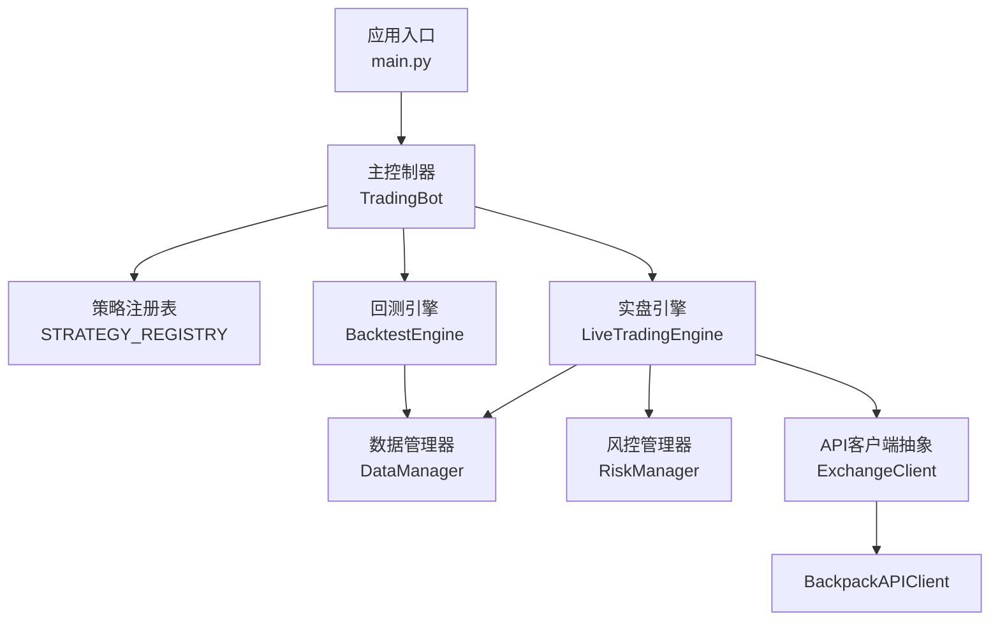
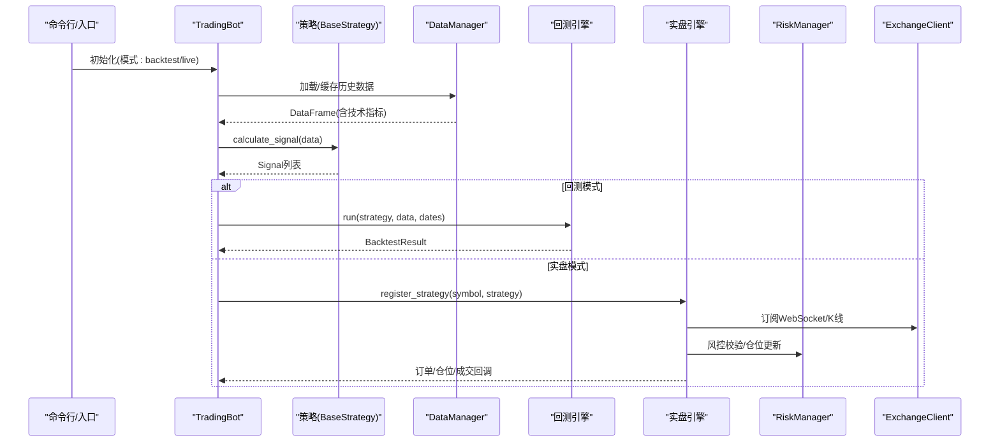
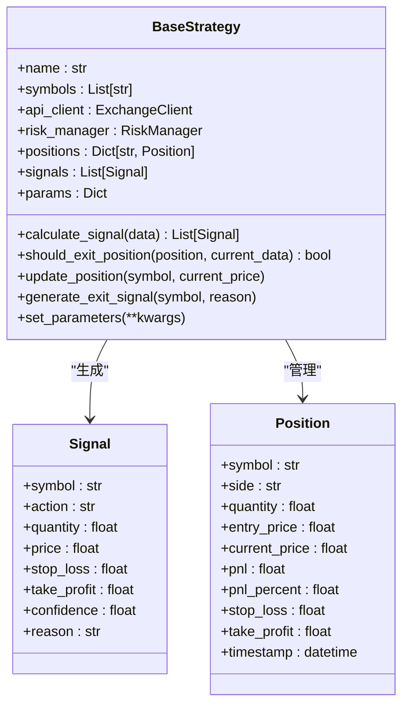
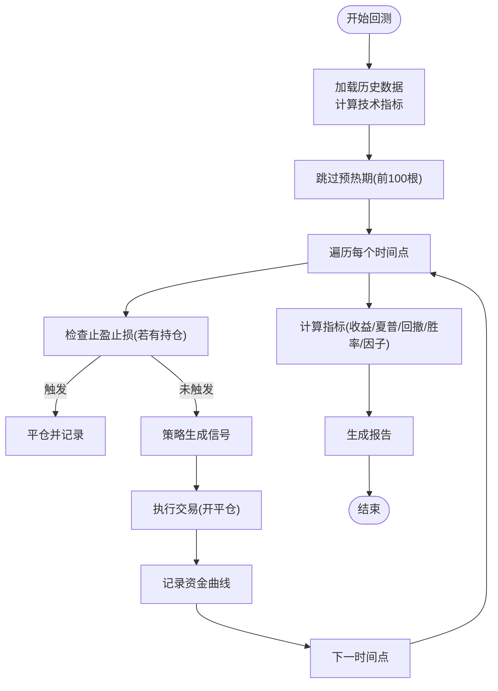
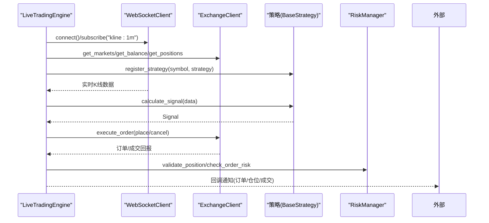
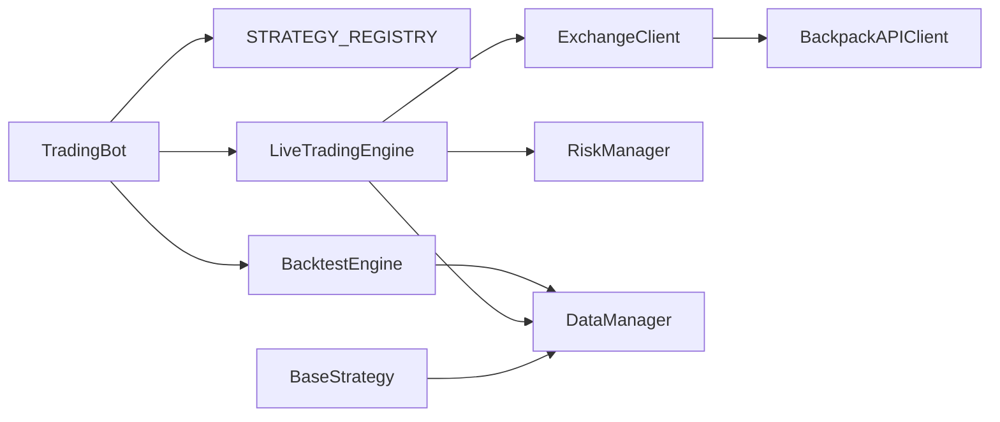

# 核心模块详解

<cite>
**本文档引用的文件**
- [main.py](file://backpack_quant_trading/main.py)
- [base.py](file://backpack_quant_trading/strategy/base.py)
- [mean_reversion.py](file://backpack_quant_trading/strategy/mean_reversion.py)
- [ai_adaptive.py](file://backpack_quant_trading/strategy/ai_adaptive.py)
- [backtest.py](file://backpack_quant_trading/engine/backtest.py)
- [live_trading.py](file://backpack_quant_trading/engine/live_trading.py)
- [data_manager.py](file://backpack_quant_trading/core/data_manager.py)
- [risk_manager.py](file://backpack_quant_trading/core/risk_manager.py)
- [settings.py](file://backpack_quant_trading/config/settings.py)
- [api_client.py](file://backpack_quant_trading/core/api_client.py)
</cite>

## 目录
1. [简介](#简介)
2. [项目结构](#项目结构)
3. [核心组件](#核心组件)
4. [架构总览](#架构总览)
5. [详细组件分析](#详细组件分析)
6. [依赖关系分析](#依赖关系分析)
7. [性能考虑](#性能考虑)
8. [故障排除指南](#故障排除指南)
9. [结论](#结论)

## 简介
本文件面向量化交易系统的核心模块，围绕 TradingBot 主控制器、策略注册表、交易引擎协调机制展开，深入解释 BaseStrategy 抽象基类的设计理念与扩展方式，阐述实盘交易引擎与回测引擎的工作原理与调用关系，并提供配置选项、返回值说明、常见问题解决方案与最佳实践建议。

## 项目结构
系统采用清晰的分层架构：
- 应用入口与主控制器：backpack_quant_trading/main.py
- 策略层：backpack_quant_trading/strategy/*（抽象基类与具体策略）
- 引擎层：backpack_quant_trading/engine/*（回测与实盘）
- 核心服务：backpack_quant_trading/core/*（数据管理、风控、API客户端等）
- 配置：backpack_quant_trading/config/settings.py
- 工具与日志：backpack_quant_trading/utils/logger.py

图表来源
- [main.py:58-158](file://backpack_quant_trading/main.py#L58-L158)
- [backtest.py:48-187](file://backpack_quant_trading/engine/backtest.py#L48-L187)
- [live_trading.py:347-586](file://backpack_quant_trading/engine/live_trading.py#L347-L586)
- [data_manager.py:18-518](file://backpack_quant_trading/core/data_manager.py#L18-L518)
- [risk_manager.py:48-566](file://backpack_quant_trading/core/risk_manager.py#L48-L566)
- [api_client.py:22-85](file://backpack_quant_trading/core/api_client.py#L22-L85)

章节来源
- [main.py:1-344](file://backpack_quant_trading/main.py#L1-L344)

## 核心组件
- TradingBot 主控制器：负责策略注册、回测调度、实盘引擎初始化与事件回调绑定。
- 策略注册表：集中管理策略类，便于动态选择与实例化。
- BaseStrategy 抽象基类：定义策略接口与通用行为，支持信号生成、止盈止损、仓位更新与性能指标。
- 回测引擎：基于历史数据驱动策略回测，支持止盈止损模拟、滑点与手续费。
- 实盘引擎：统一行情数据来源（Backpack WebSocket），通过 ExchangeClient 抽象对接不同交易所，负责订单、仓位、余额管理与风控。
- DataManager：统一管理市场数据获取、缓存与技术指标计算。
- RiskManager：风控校验与风险度量，包括保证金限额、日度损失、最大回撤、VaR与压力测试。
- ExchangeClient 抽象与 BackpackAPIClient：抽象下单接口，实现 Backpack 交易所的具体对接。

章节来源
- [main.py:31-57](file://backpack_quant_trading/main.py#L31-L57)
- [base.py:41-212](file://backpack_quant_trading/strategy/base.py#L41-L212)
- [backtest.py:48-187](file://backpack_quant_trading/engine/backtest.py#L48-L187)
- [live_trading.py:347-586](file://backpack_quant_trading/engine/live_trading.py#L347-L586)
- [data_manager.py:18-518](file://backpack_quant_trading/core/data_manager.py#L18-L518)
- [risk_manager.py:48-566](file://backpack_quant_trading/core/risk_manager.py#L48-L566)
- [api_client.py:22-85](file://backpack_quant_trading/core/api_client.py#L22-L85)

## 架构总览
TradingBot 作为中枢，协调策略注册、数据准备、回测与实盘执行。策略通过 BaseStrategy 统一接口与 DataManager 提供的历史/实时数据交互；回测引擎独立于实盘，使用策略的信号接口；实盘引擎通过 ExchangeClient 抽象对接交易所，统一行情与下单。

图表来源
- [main.py:72-114](file://backpack_quant_trading/main.py#L72-L114)
- [main.py:116-149](file://backpack_quant_trading/main.py#L116-L149)
- [backtest.py:65-187](file://backpack_quant_trading/engine/backtest.py#L65-L187)
- [live_trading.py:536-567](file://backpack_quant_trading/engine/live_trading.py#L536-L567)

## 详细组件分析

### TradingBot 主控制器
- 职责
  - 策略注册与管理：add_strategy(symbol, strategy)
  - 回测流程：run_backtest(symbols, start_date, end_date)
  - 实盘流程：run_live_trading()，初始化 LiveTradingEngine，注册策略，绑定回调，注入 api_client 给策略
- 关键流程
  - 回测：逐 symbol 加载历史数据，计算技术指标，调用策略 calculate_signal，执行交易，生成报告
  - 实盘：初始化 ExchangeClient，注册策略，订阅 WebSocket，启动引擎，处理订单/仓位/成交事件
- 集成点
  - 策略注册表：STRATEGY_REGISTRY 与 EXCHANGE_REGISTRY
  - DataManager：历史数据与技术指标
  - RiskManager：风控校验
  - LiveTradingEngine：实盘执行

章节来源
- [main.py:58-158](file://backpack_quant_trading/main.py#L58-L158)
- [main.py:160-286](file://backpack_quant_trading/main.py#L160-L286)

### 策略注册表与策略扩展
- 策略注册表
  - STRATEGY_REGISTRY：策略名称到类的映射
  - EXCHANGE_REGISTRY：交易所名称到客户端类的映射
- 扩展方式
  - 新增策略：在 strategy 目录新建类，继承 BaseStrategy，实现 calculate_signal 与平仓逻辑
  - 在 STRATEGY_REGISTRY 中注册，即可通过命令行 --strategy 选择
  - 实盘模式下，可通过 --exchange 切换不同交易所实现（需实现 ExchangeClient）

章节来源
- [main.py:31-57](file://backpack_quant_trading/main.py#L31-L57)
- [base.py:41-112](file://backpack_quant_trading/strategy/base.py#L41-L112)

### BaseStrategy 抽象基类
- 设计理念
  - 模板方法：子类实现 calculate_signal 与 should_exit_position，框架提供通用仓位更新、盈亏计算与信号生成
  - 数据结构：Signal、Position，统一策略输出与内部状态
  - 参数化：params 字典支持策略参数注入与动态调整
- 关键方法
  - calculate_signal(data)：返回 Signal 列表
  - should_exit_position(position, current_data)：返回是否平仓
  - update_position/signal 生成：自动检查止损止盈并生成平仓信号
- 与引擎协作
  - 回测：BacktestEngine.run 调用策略 calculate_signal
  - 实盘：LiveTradingEngine 注册策略，策略通过 api_client 获取账户信息

图表来源
- [base.py:16-112](file://backpack_quant_trading/strategy/base.py#L16-L112)

章节来源
- [base.py:41-212](file://backpack_quant_trading/strategy/base.py#L41-L212)

### 回测引擎 BacktestEngine
- 工作原理
  - 输入：策略实例、多交易对历史数据、起止时间
  - 预热期：跳过前100根K线，保证指标稳定
  - 每根K线：先检查止盈止损（若触及则平仓），再调用策略 calculate_signal 生成信号，执行交易，记录资金曲线
  - 指标计算：计算总收益、年化收益、夏普比率、最大回撤、胜率、盈利因子等
- 关键特性
  - 支持多空双向持仓与冷却期（平仓后N根K线内不开新仓）
  - 滑点与手续费内置
  - 止盈止损模拟：基于K线高低点判断是否触发

图表来源
- [backtest.py:65-187](file://backpack_quant_trading/engine/backtest.py#L65-L187)
- [backtest.py:333-383](file://backpack_quant_trading/engine/backtest.py#L333-L383)

章节来源
- [backtest.py:48-187](file://backpack_quant_trading/engine/backtest.py#L48-L187)
- [backtest.py:333-404](file://backpack_quant_trading/engine/backtest.py#L333-L404)

### 实盘交易引擎 LiveTradingEngine
- 工作原理
  - 初始化：选择 ExchangeClient（默认 Backpack），连接 WebSocket 订阅K线，加载账户余额/持仓/未完成订单，预加载历史K线
  - 运行：启动多个监控任务（订单状态、价格、仓位、资产快照、心跳），接收实时K线，调用策略生成信号，通过 ExchangeClient 执行下单
  - 事件回调：on_order/on_position/on_trade，供外部订阅
- 关键特性
  - 交易对格式映射：支持 Deepcoin/Backpack 等格式互转
  - 余额缓存：减少API调用频率
  - 风控集成：通过 RiskManager 校验订单风险与保证金上限
  - 与策略协作：注入 api_client，策略可查询账户余额与下单

图表来源
- [live_trading.py:347-586](file://backpack_quant_trading/engine/live_trading.py#L347-L586)
- [live_trading.py:536-567](file://backpack_quant_trading/engine/live_trading.py#L536-L567)

章节来源
- [live_trading.py:347-586](file://backpack_quant_trading/engine/live_trading.py#L347-L586)
- [live_trading.py:588-698](file://backpack_quant_trading/engine/live_trading.py#L588-L698)

### 具体策略示例

#### 均值回归策略 MeanReversionStrategy
- 核心逻辑
  - 计算滚动均值与标准差，计算Z-score，当低于阈值做多，高于阈值做空
  - 生成信号时附带止损止盈价格，使用 Dashboard 传入的参数
  - 仓位计算：基于保证金与杠杆，结合 RiskManager 校验
- 关键点
  - 支持 should_exit_position：止损止盈与均值回归平仓
  - _calculate_position_size：优先USDT/USDC余额，考虑最小交易单位

章节来源
- [mean_reversion.py:23-263](file://backpack_quant_trading/strategy/mean_reversion.py#L23-L263)

#### AI自适应策略 AIAdaptiveStrategy
- 核心逻辑
  - 本地指标预筛选：RSI/MACD/布林带/ATR，满足条件才调用AI
  - 日内交易：每1分钟K线触发分析，区分空仓/持仓状态
  - 深度分析与快速判断：根据AI建议与数据量自动切换
  - 信号解析：支持新格式（多空双向）与旧格式（买入/卖出）
- 成本优化
  - 本地指标预筛选显著降低AI调用次数
  - 交易对格式转换与缓存复用

章节来源
- [ai_adaptive.py:12-800](file://backpack_quant_trading/strategy/ai_adaptive.py#L12-L800)

### 数据管理与风控
- DataManager
  - 历史数据：回测模式生成模拟数据，实盘模式调用 api_client 获取
  - 实时数据：WebSocket缓存与文件落盘，支持最近K线获取
  - 技术指标：MA/BB/RSI/MACD/Volatility/ATR/ZScore
- RiskManager
  - 仓位校验：基于账户资金与最大仓位比例，累计保证金不超过限额
  - 订单风控：止损止盈价格校验、日度损失与最大回撤监控
  - 风险度量：VaR（历史/参数/蒙特卡洛）、压力测试、风险报告

章节来源
- [data_manager.py:18-518](file://backpack_quant_trading/core/data_manager.py#L18-L518)
- [risk_manager.py:48-566](file://backpack_quant_trading/core/risk_manager.py#L48-L566)

### 配置与参数
- 全局配置 Config
  - Backpack/Hyperliquid/Deepcoin/Ostium/Webhook 等配置项
  - 交易配置：最大仓位比例、日度最大亏损、最大回撤、止损止盈比例、无风险利率、默认杠杆
- 命令行参数
  - --mode/--symbols/--strategy/--exchange/--days/--position-size/--leverage/--stop-loss/--take-profit
- 实盘参数注入
  - main.py 中根据策略类型与命令行参数动态注入到策略与 RiskManager

章节来源
- [settings.py:104-137](file://backpack_quant_trading/config/settings.py#L104-L137)
- [main.py:299-336](file://backpack_quant_trading/main.py#L299-L336)

## 依赖关系分析
- 组件耦合
  - TradingBot 与策略：通过 BaseStrategy 接口解耦，策略注册表实现运行时选择
  - 实盘引擎与 ExchangeClient：通过抽象接口解耦，支持多交易所切换
  - DataManager 与 api_client：统一数据来源，回测/实盘共享
- 外部依赖
  - websockets、requests、pandas、numpy、sqlalchemy 等
- 潜在循环依赖
  - live_trading 与 api_client 的相互引用通过延迟导入避免

图表来源
- [main.py:31-57](file://backpack_quant_trading/main.py#L31-L57)
- [api_client.py:22-85](file://backpack_quant_trading/core/api_client.py#L22-L85)

章节来源
- [main.py:31-57](file://backpack_quant_trading/main.py#L31-L57)
- [api_client.py:22-85](file://backpack_quant_trading/core/api_client.py#L22-L85)

## 性能考虑
- 回测
  - 预热期与冷却期减少信号噪声，提升稳定性
  - 滑点与手续费内置，避免外部因素干扰
- 实盘
  - WebSocket 重连与指数退避，代理自适应支持
  - 余额缓存降低API调用频率
  - 本地指标预筛选显著降低AI调用成本
- 数据
  - DataManager 缓存与TTL控制，避免重复拉取
  - 文件落盘便于多进程共享

## 故障排除指南
- WebSocket 连接失败
  - 检查代理设置与 websockets 版本兼容性
  - 观察重连日志，确认 ping/pong 与订阅恢复
- 订单执行异常
  - 核对签名参数、时间戳与请求频率限制
  - 检查风控校验：止损价是否合理、保证金是否超限
- 数据异常
  - 确认交易对格式转换与映射关系
  - 检查缓存TTL与数据清洗逻辑
- 性能问题
  - 适当增大缓存容量与TTL
  - 优化策略指标计算与AI调用频率

章节来源
- [live_trading.py:153-235](file://backpack_quant_trading/engine/live_trading.py#L153-L235)
- [api_client.py:254-268](file://backpack_quant_trading/core/api_client.py#L254-L268)
- [risk_manager.py:132-229](file://backpack_quant_trading/core/risk_manager.py#L132-L229)

## 结论
本系统通过 TradingBot 统一调度策略与引擎，借助 BaseStrategy 抽象实现策略扩展，利用 ExchangeClient 抽象实现多交易所无缝切换。回测与实盘分离，既保证策略验证的严谨性，又提供灵活的实盘执行能力。通过 DataManager 与 RiskManager 的协同，系统在数据质量与风险控制方面具备良好保障。建议在扩展新策略时遵循 BaseStrategy 接口规范，充分利用注册表与配置系统，确保与现有引擎的兼容与一致性。