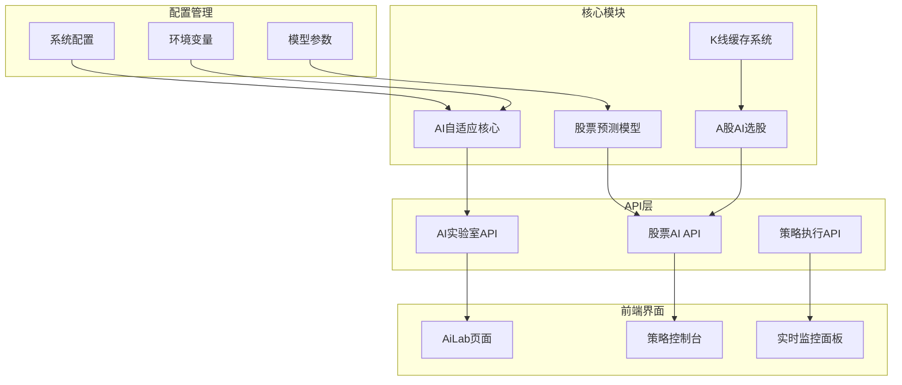
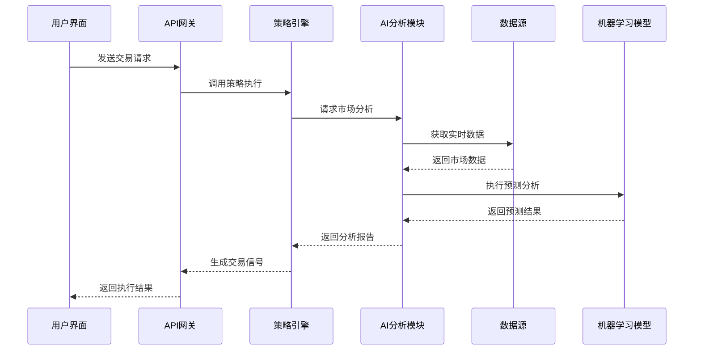
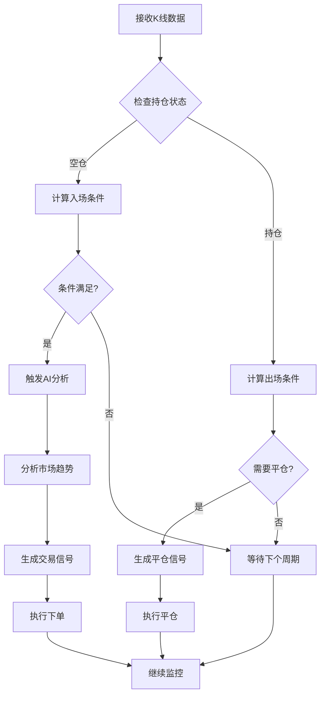
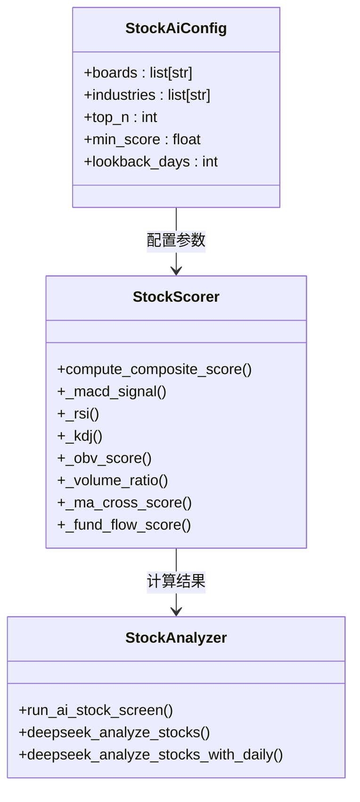
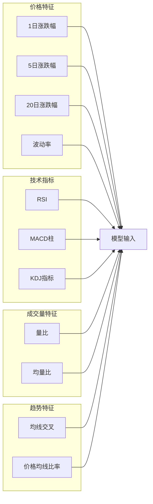
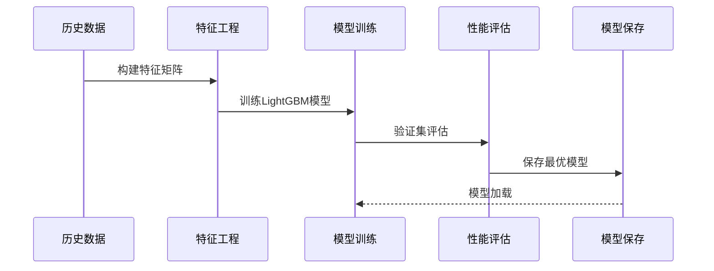
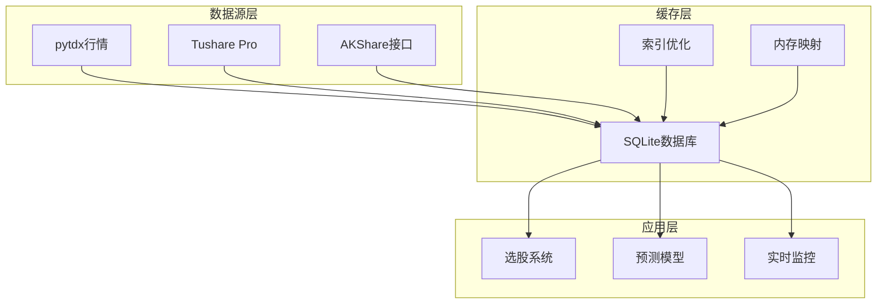
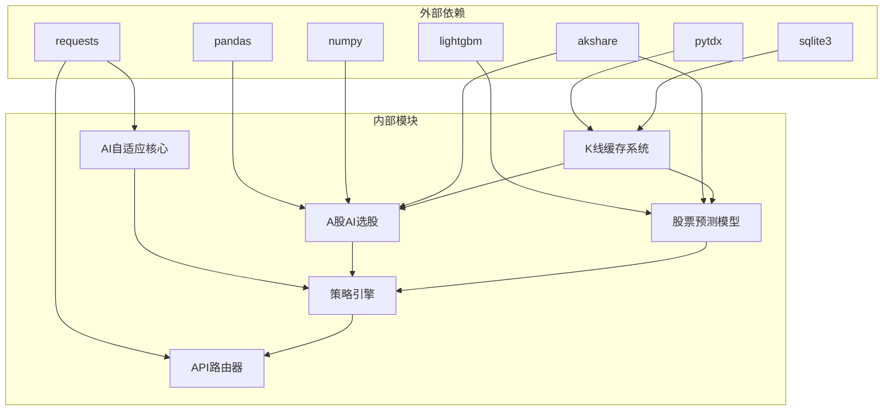
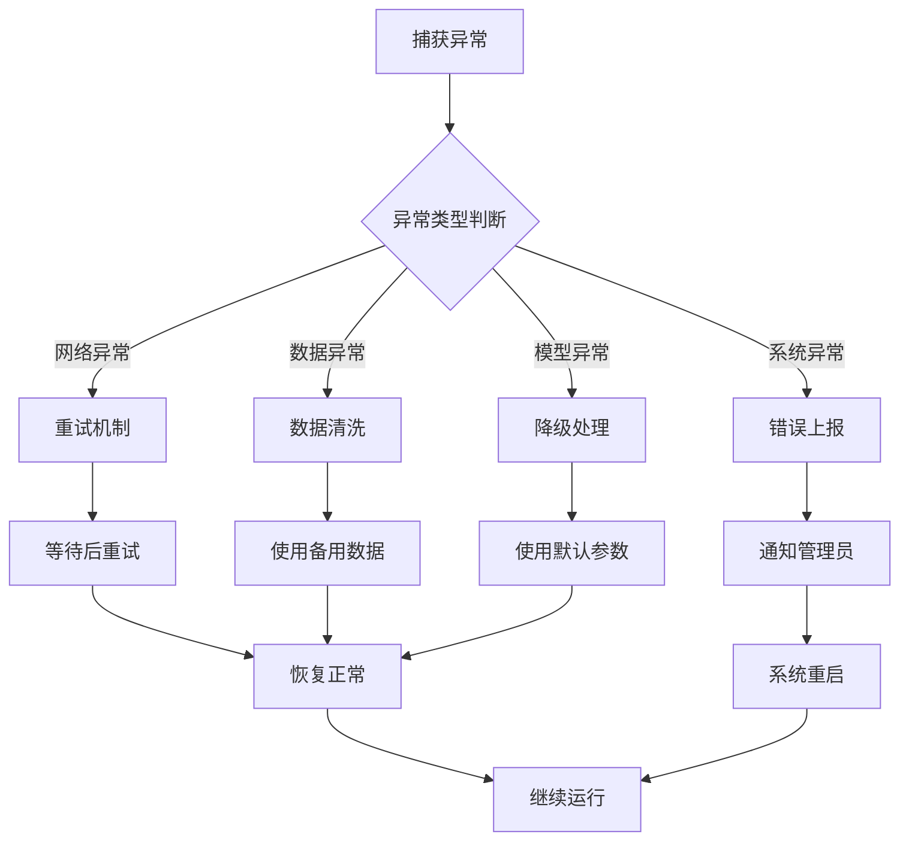

# AI自适应策略

<cite>
**本文档引用的文件**
- [ai_adaptive.py](file://backpack_quant_trading/core/ai_adaptive.py)
- [stock_ai.py](file://backpack_quant_trading/core/stock_ai.py)
- [stock_predict_model.py](file://backpack_quant_trading/core/stock_predict_model.py)
- [stock_kline_cache.py](file://backpack_quant_trading/core/stock_kline_cache.py)
- [ai_lab.py](file://backpack_quant_trading/api/routers/ai_lab.py)
- [stock_ai.py](file://backpack_quant_trading/api/routers/stock_ai.py)
- [ai_adaptive.py](file://backpack_quant_trading/strategy/ai_adaptive.py)
- [run_train_stock_model.py](file://backpack_quant_trading/run_train_stock_model.py)
- [settings.py](file://backpack_quant_trading/config/settings.py)
- [DATA_SOURCE_AND_CACHE.md](file://backpack_quant_trading/docs/DATA_SOURCE_AND_CACHE.md)
- [AiLab.jsx](file://backpack_quant_trading/frontend/src/views/AiLab.jsx)
</cite>

## 目录
1. [项目概述](#项目概述)
2. [项目结构](#项目结构)
3. [核心组件](#核心组件)
4. [架构概览](#架构概览)
5. [详细组件分析](#详细组件分析)
6. [依赖关系分析](#依赖关系分析)
7. [性能考虑](#性能考虑)
8. [故障排除指南](#故障排除指南)
9. [结论](#结论)

## 项目概述

AI自适应策略是一个基于机器学习的智能交易系统，结合了深度学习模型和传统技术分析方法，为加密货币和股票市场提供自动化交易决策支持。该系统通过多模态AI分析技术，能够根据市场条件动态调整交易参数，实现自适应的交易策略。

系统的核心特点包括：
- **多模态AI分析**：结合图像识别和文本分析技术
- **自适应参数调整**：根据市场条件动态优化交易参数
- **多层次技术分析**：融合传统技术指标和机器学习模型
- **实时数据处理**：支持实时K线数据和历史数据回测
- **成本优化机制**：通过本地预筛选减少AI调用频率

## 项目结构

**图表来源**
- [ai_adaptive.py:1-338](file://backpack_quant_trading/core/ai_adaptive.py#L1-L338)
- [stock_ai.py:1-800](file://backpack_quant_trading/core/stock_ai.py#L1-L800)
- [stock_predict_model.py:1-642](file://backpack_quant_trading/core/stock_predict_model.py#L1-L642)

**章节来源**
- [ai_adaptive.py:1-338](file://backpack_quant_trading/core/ai_adaptive.py#L1-L338)
- [stock_ai.py:1-800](file://backpack_quant_trading/core/stock_ai.py#L1-L800)
- [stock_predict_model.py:1-642](file://backpack_quant_trading/core/stock_predict_model.py#L1-L642)

## 核心组件

### AI自适应核心模块

AI自适应核心模块是整个系统的智能中枢，负责处理多模态数据输入并生成交易决策。该模块集成了深度学习推理和传统技术分析方法。

**主要功能特性**：
- **多模态数据处理**：支持K线图像识别和原始数据分析
- **知识库集成**：内置丰富的技术分析知识库
- **角色化分析**：模拟专业交易员的分析思维
- **实时推理**：快速处理市场数据并生成决策

### A股AI选股系统

该系统专门针对A股市场设计，提供智能化的股票筛选和分析功能。

**核心算法**：
- **多指标综合评分**：MACD、RSI、KDJ、成交量等指标综合打分
- **板块/行业筛选**：支持按板块和行业维度筛选股票
- **实时数据拉取**：从多个数据源获取实时市场数据
- **缓存优化**：本地缓存机制提升数据访问速度

### 股票预测模型

基于LightGBM的机器学习模型，用于预测股票未来走势。

**模型特点**：
- **特征工程**：构建包含技术指标和价格行为的特征集
- **二分类预测**：预测未来N日是否上涨
- **在线学习**：支持模型的持续更新和优化
- **性能评估**：内置模型性能评估和验证机制

### K线缓存系统

为A股市场提供高效的数据缓存解决方案。

**缓存策略**：
- **增量更新**：只更新最新的交易日数据
- **多数据源支持**：支持pytdx、Tushare等多种数据源
- **SQLite存储**：轻量级数据库存储，便于查询和管理
- **自动切换**：根据可用性和性能自动选择最佳数据源

**章节来源**
- [ai_adaptive.py:237-338](file://backpack_quant_trading/core/ai_adaptive.py#L237-L338)
- [stock_ai.py:71-800](file://backpack_quant_trading/core/stock_ai.py#L71-L800)
- [stock_predict_model.py:1-642](file://backpack_quant_trading/core/stock_predict_model.py#L1-L642)
- [stock_kline_cache.py:1-464](file://backpack_quant_trading/core/stock_kline_cache.py#L1-L464)

## 架构概览

**图表来源**
- [ai_lab.py:183-262](file://backpack_quant_trading/api/routers/ai_lab.py#L183-L262)
- [ai_adaptive.py:266-670](file://backpack_quant_trading/strategy/ai_adaptive.py#L266-L670)

系统采用分层架构设计，确保各组件的职责清晰分离：

1. **表现层**：前端界面和API接口
2. **业务逻辑层**：策略引擎和业务规则
3. **数据访问层**：数据源和缓存系统
4. **AI分析层**：机器学习模型和分析算法

## 详细组件分析

### AI自适应策略引擎

AI自适应策略引擎是系统的核心执行单元，负责实时监控市场变化并生成交易信号。

#### 核心算法流程

**图表来源**
- [ai_adaptive.py:166-264](file://backpack_quant_trading/strategy/ai_adaptive.py#L166-L264)

#### 本地预筛选机制

为了优化成本和性能，策略引擎实现了智能的本地预筛选机制：

**入场条件判断**：
- RSI进入超买/超卖区域（<45或>55）
- 价格触及布林带上下轨（距离<1%）
- MACD柱状图绝对值较大（>0.5）

**出场条件判断**：
- 浮盈>50%或浮亏>-25%（100倍杠杆）
- RSI进入极端区域（>70或<30）
- MACD柱状图出现反转

#### 深度分析与快速判断

系统支持两种分析模式：

**深度分析模式**（1000根K线）：
- 适用于首次分析或长时间未分析的情况
- 使用历史数据进行全面的技术分析
- 生成详细的交易参数和风险控制建议

**快速判断模式**（实时K线）：
- 基于WebSocket推送的实时数据
- 适用于日常监控和短期交易
- 快速响应市场变化，及时生成交易信号

**章节来源**
- [ai_adaptive.py:12-800](file://backpack_quant_trading/strategy/ai_adaptive.py#L12-L800)

### A股AI选股系统

A股AI选股系统提供了完整的股票筛选和分析功能，支持多维度的智能选股。

#### 多指标综合评分算法

**图表来源**
- [stock_ai.py:71-800](file://backpack_quant_trading/core/stock_ai.py#L71-L800)

#### 技术指标权重分配

系统为不同技术指标分配了相应的权重：

| 指标类型 | 权重 | 计算方法 | 评分范围 |
|---------|------|----------|----------|
| MACD | 15% | 红柱且DIF>DEA | 0-15分 |
| RSI | 15% | 30-70区间最优 | 5-15分 |
| KDJ | 15% | 金叉且J<80 | 5-15分 |
| 量比 | 12% | 1.0-2.5倍 | 4-12分 |
| OBV | 10% | 量价配合 | 0-10分 |
| 均线 | 10% | 金叉/多头排列 | 0-10分 |
| 主力净流入 | 18% | 净占比归一化 | 0-18分 |

#### 数据源集成策略

系统支持多种数据源，确保数据的可靠性和完整性：

**优先级顺序**：
1. **pytdx**：免费、稳定、全市场覆盖
2. **Tushare Pro**：付费、按日全市场拉取
3. **AKShare**：免费、爬虫式、易限流
4. **手动输入**：作为最终兜底方案

**章节来源**
- [stock_ai.py:1-800](file://backpack_quant_trading/core/stock_ai.py#L1-L800)
- [DATA_SOURCE_AND_CACHE.md:1-71](file://backpack_quant_trading/docs/DATA_SOURCE_AND_CACHE.md#L1-L71)

### 股票预测模型

基于LightGBM的机器学习模型，专门用于预测股票未来走势。

#### 特征工程设计

**图表来源**
- [stock_predict_model.py:52-146](file://backpack_quant_trading/core/stock_predict_model.py#L52-L146)

#### 模型训练流程

**图表来源**
- [stock_predict_model.py:201-255](file://backpack_quant_trading/core/stock_predict_model.py#L201-L255)

**章节来源**
- [stock_predict_model.py:1-642](file://backpack_quant_trading/core/stock_predict_model.py#L1-L642)
- [run_train_stock_model.py:1-55](file://backpack_quant_trading/run_train_stock_model.py#L1-L55)

### K线缓存系统

K线缓存系统为A股市场提供高效的数据存储和访问机制。

#### 缓存架构设计

**图表来源**
- [stock_kline_cache.py:22-43](file://backpack_quant_trading/core/stock_kline_cache.py#L22-L43)

#### 增量更新策略

系统采用智能的增量更新机制：

**更新触发条件**：
- 新的交易日到达
- 缓存数据量不足
- 手动刷新请求

**更新流程**：
1. 检查当前最大交易日期
2. 获取需要更新的交易日列表
3. 从数据源拉取对应日期的数据
4. 写入数据库并更新索引
5. 清理过期数据

**章节来源**
- [stock_kline_cache.py:82-363](file://backpack_quant_trading/core/stock_kline_cache.py#L82-L363)

## 依赖关系分析

**图表来源**
- [ai_adaptive.py:11-17](file://backpack_quant_trading/core/ai_adaptive.py#L11-L17)
- [stock_ai.py:16-27](file://backpack_quant_trading/core/stock_ai.py#L16-L27)
- [stock_predict_model.py:35-48](file://backpack_quant_trading/core/stock_predict_model.py#L35-L48)

### 核心依赖关系

系统的关键依赖关系包括：

1. **AI分析依赖**：AI自适应核心模块依赖于外部AI服务提供商
2. **数据依赖**：A股AI选股系统依赖于多个数据源
3. **模型依赖**：预测模型依赖于机器学习库
4. **存储依赖**：缓存系统依赖于SQLite数据库

### 模块间耦合度

系统采用松耦合设计，各模块间通过明确定义的接口进行交互：

- **低耦合**：核心算法与数据源解耦
- **高内聚**：每个模块专注于特定功能领域
- **可扩展性**：支持新数据源和新算法的添加

**章节来源**
- [settings.py:104-137](file://backpack_quant_trading/config/settings.py#L104-L137)

## 性能考虑

### 性能优化策略

系统采用了多层次的性能优化策略：

#### 1. 缓存优化
- **多级缓存**：内存缓存 + 磁盘缓存 + 数据库缓存
- **智能预加载**：提前加载可能用到的数据
- **缓存失效策略**：基于时间戳和数据版本的失效机制

#### 2. 并行处理
- **多线程并发**：数据拉取和处理并行化
- **异步I/O**：减少等待时间
- **批量处理**：合并小请求提高效率

#### 3. 算法优化
- **本地预筛选**：减少AI调用次数85%
- **特征选择**：只使用最重要的技术指标
- **模型压缩**：LightGBM模型的轻量化部署

### 性能监控指标

系统监控以下关键性能指标：

| 指标类型 | 目标值 | 监控方法 |
|---------|--------|----------|
| AI调用延迟 | <2秒 | API响应时间 |
| 数据更新延迟 | <5分钟 | 缓存更新时间 |
| 策略执行频率 | 1次/分钟 | 交易信号生成 |
| 内存使用率 | <80% | 系统资源监控 |
| CPU使用率 | <70% | 性能分析工具 |

### 资源管理

系统实现了智能的资源管理机制：

- **内存管理**：定期清理无用数据，防止内存泄漏
- **连接池管理**：数据库和API连接的复用
- **文件句柄管理**：及时关闭文件和网络连接

## 故障排除指南

### 常见问题及解决方案

#### 1. AI服务连接问题

**问题症状**：
- AI分析请求超时
- API响应错误
- 分析结果为空

**解决步骤**：
1. 检查API密钥配置
2. 验证网络连接状态
3. 查看API服务可用性
4. 重试请求或降级处理

#### 2. 数据源连接失败

**问题症状**：
- 股票数据拉取失败
- K线数据缺失
- 选股结果为空

**解决步骤**：
1. 检查数据源配置
2. 验证网络连接
3. 切换到备用数据源
4. 清理缓存后重试

#### 3. 模型加载失败

**问题症状**：
- 预测功能不可用
- 模型文件损坏
- 训练过程异常

**解决步骤**：
1. 检查模型文件完整性
2. 验证模型版本兼容性
3. 重新训练模型
4. 清理模型缓存

### 日志分析

系统提供了详细的日志记录机制：

#### 日志级别定义

| 日志级别 | 用途 | 示例 |
|---------|------|------|
| DEBUG | 详细调试信息 | 变量值、函数调用 |
| INFO | 一般运行信息 | 系统状态、操作结果 |
| WARNING | 警告信息 | 可能的问题、异常情况 |
| ERROR | 错误信息 | 异常、失败、错误详情 |

#### 关键日志监控

系统重点监控以下日志信息：

- **AI调用日志**：分析请求、响应、错误
- **数据源日志**：连接状态、数据质量
- **模型日志**：训练进度、预测结果
- **策略日志**：交易信号、执行结果

### 异常处理机制

系统实现了完善的异常处理机制：

**图表来源**
- [ai_adaptive.py:651-655](file://backpack_quant_trading/strategy/ai_adaptive.py#L651-L655)

**章节来源**
- [ai_lab.py:256-262](file://backpack_quant_trading/api/routers/ai_lab.py#L256-L262)
- [stock_ai.py:633-720](file://backpack_quant_trading/core/stock_ai.py#L633-L720)

## 结论

AI自适应策略系统是一个功能完整、性能优异的智能交易解决方案。通过将传统的技术分析方法与现代的机器学习技术相结合，系统能够在复杂的市场环境中提供准确的交易决策支持。

### 主要优势

1. **智能化程度高**：结合多模态AI分析和机器学习模型
2. **自适应性强**：能够根据市场条件动态调整交易参数
3. **性能优化出色**：通过本地预筛选和缓存机制显著提升效率
4. **可扩展性好**：模块化设计支持功能扩展和技术升级
5. **可靠性高**：完善的异常处理和监控机制

### 技术特色

- **多模态分析**：同时处理图像和文本数据
- **实时响应**：毫秒级的市场数据处理能力
- **成本优化**：智能的AI调用策略减少计算成本
- **风险控制**：多层次的风险管理和控制机制

### 应用前景

该系统不仅适用于加密货币交易，还可以扩展到股票、外汇等其他金融市场的自动化交易。随着AI技术的不断发展，系统的智能化水平还将持续提升，为用户提供更加精准和可靠的交易决策支持。

通过持续的优化和改进，AI自适应策略系统将成为量化交易领域的重要工具，帮助投资者在竞争激烈的市场环境中获得稳定的收益。