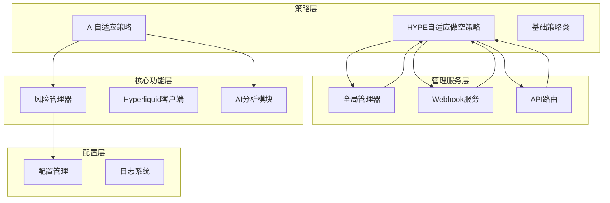
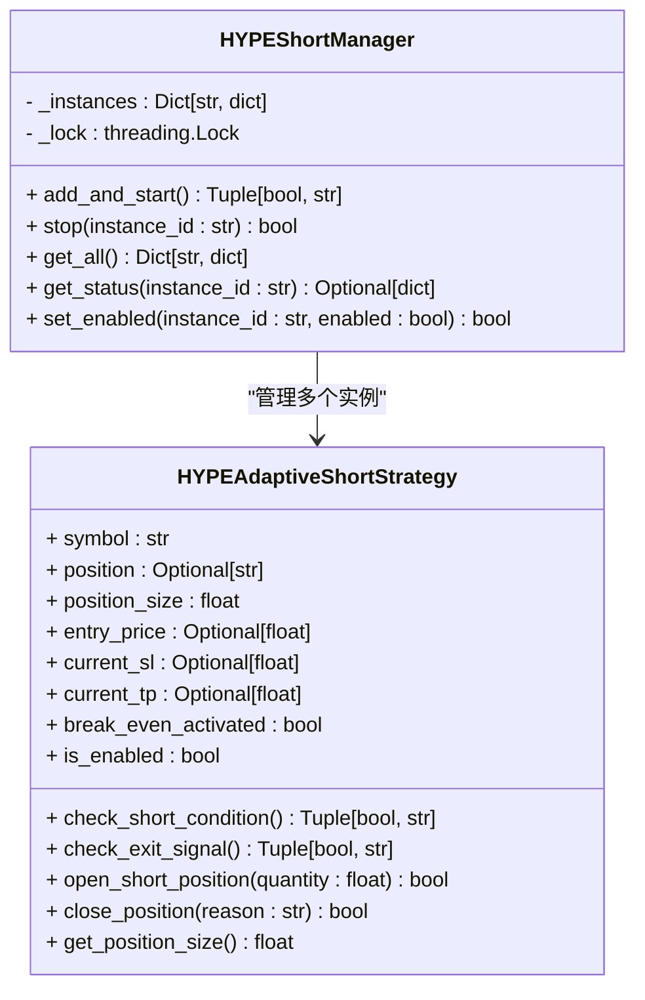
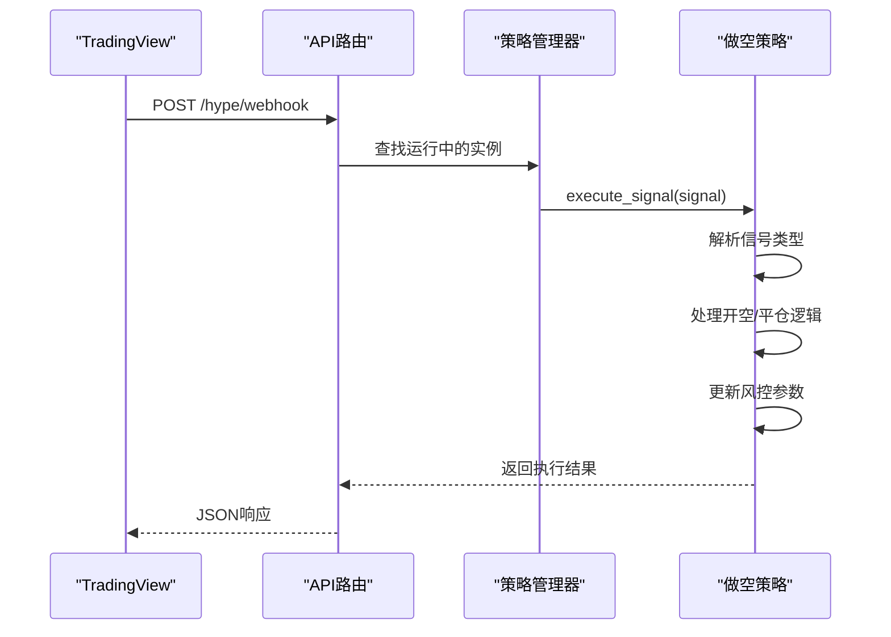
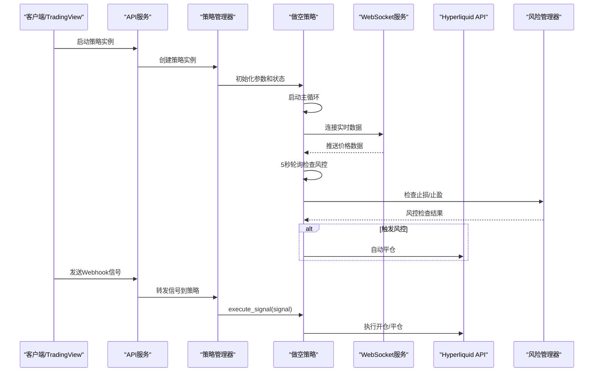
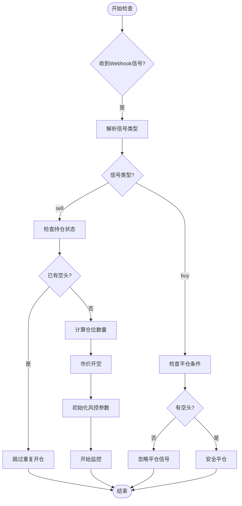
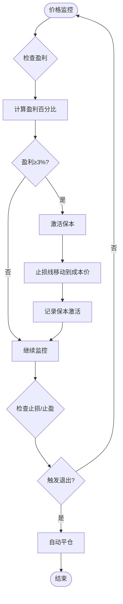
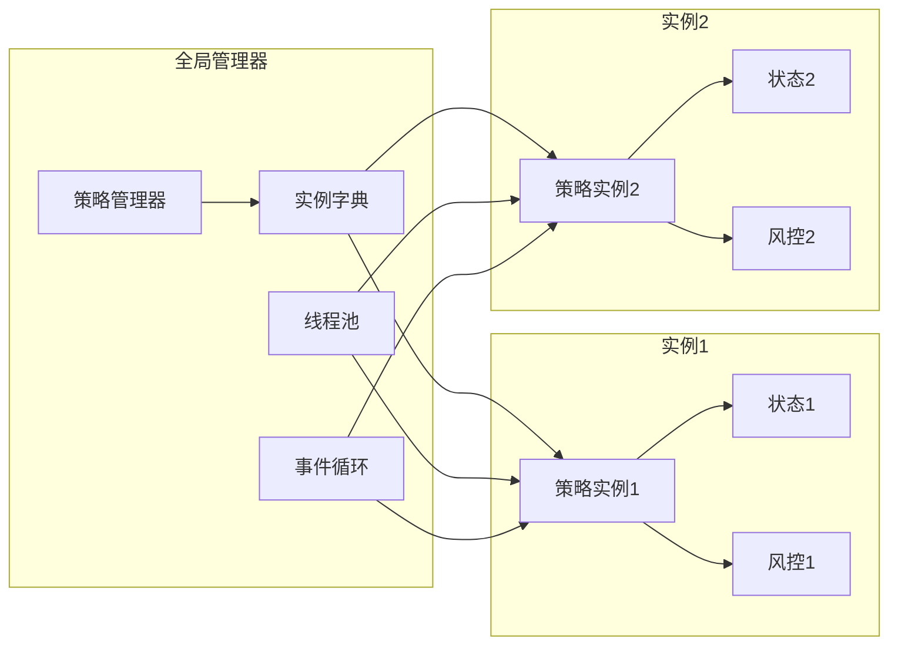
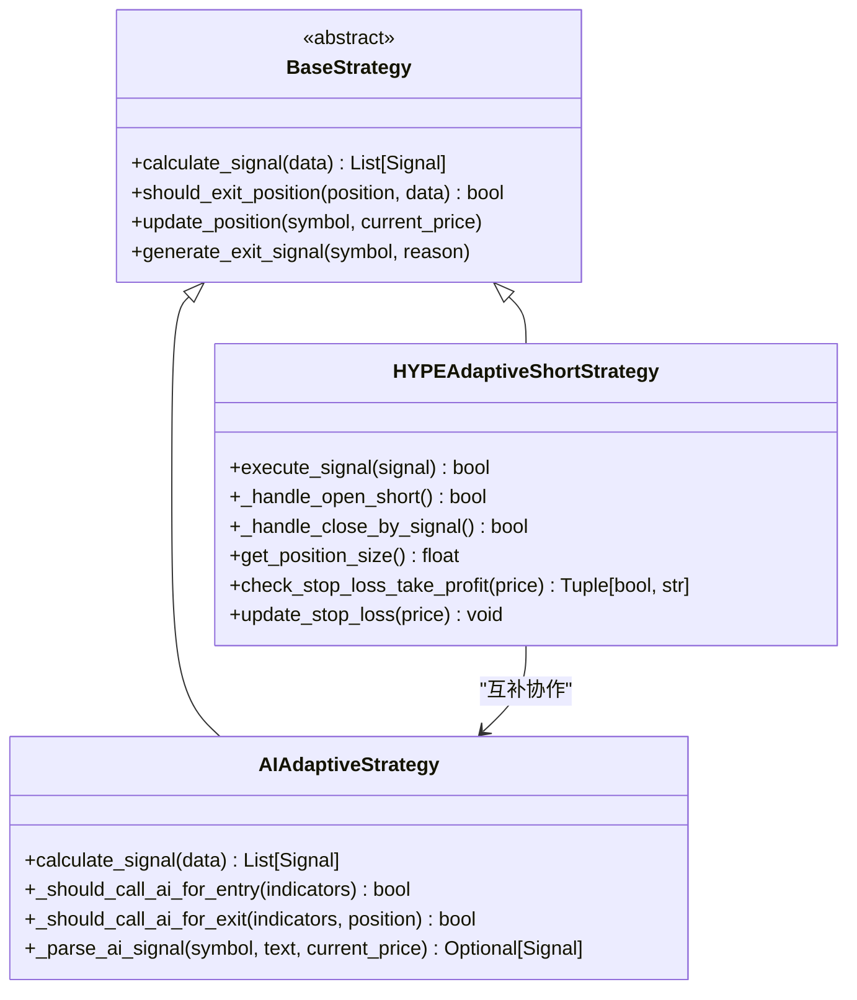
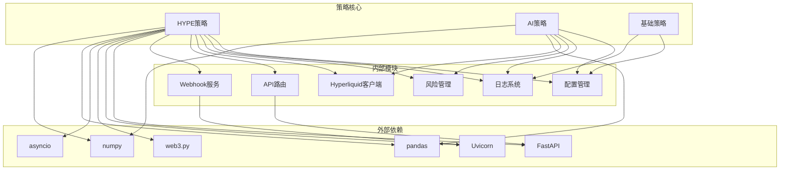

# HYPE自适应做空策略

<cite>
**本文档引用的文件**
- [hype_adaptive_short.py](file://backpack_quant_trading/strategy/hype_adaptive_short.py)
- [ai_adaptive.py](file://backpack_quant_trading/strategy/ai_adaptive.py)
- [base.py](file://backpack_quant_trading/strategy/base.py)
- [risk_manager.py](file://backpack_quant_trading/core/risk_manager.py)
- [hyperliquid_client.py](file://backpack_quant_trading/core/hyperliquid_client.py)
- [settings.py](file://backpack_quant_trading/config/settings.py)
- [trading.py](file://backpack_quant_trading/api/routers/trading.py)
- [webhook_service.py](file://backpack_quant_trading/webhook_service.py)
- [OKX_HYPEUSDT.P_交易数据.csv](file://OKX_HYPEUSDT.P_交易数据.csv)
- [_write_hype.py](file://backpack_quant_trading/strategy/_write_hype.py)
</cite>

## 更新摘要
**变更内容**
- 新增全局策略管理器HYPEShortManager，支持多实例管理
- 新增Webhook服务端点，支持TradingView信号接收
- 新增API路由集成，提供完整的策略生命周期管理
- 新增实时风控系统，包含保本机制
- 新增多时间框架分析和信号处理机制

## 目录
1. [简介](#简介)
2. [项目结构](#项目结构)
3. [核心组件](#核心组件)
4. [架构概览](#架构概览)
5. [详细组件分析](#详细组件分析)
6. [依赖关系分析](#依赖关系分析)
7. [性能考虑](#性能考虑)
8. [故障排除指南](#故障排除指南)
9. [结论](#结论)

## 简介

HYPE自适应做空策略是专门为HYPE代币设计的量化交易策略，基于TradingView Pine Script v6逻辑开发。该策略采用多时间框架分析方法，结合4小时MACD死叉和日线WMA15跌破的双重条件，实现了对HYPE市场波动特性的精准捕捉。

**更新** 该策略现已升级为完整的Webhook驱动系统，集成了全局管理器、实时风控和多实例管理功能，支持TradingView信号的实时接收和处理。

HYPE作为新兴的AI概念代币，在2025年经历了显著的价格波动，从年初的低位持续上涨至高位，期间出现了多次大幅回调和反转。该策略通过自适应参数调整和严格的风险控制机制，能够在不同市场环境下保持稳定的盈利能力。

## 项目结构

该项目采用模块化架构设计，主要包含以下核心模块：

**图表来源**
- [hype_adaptive_short.py:73-196](file://backpack_quant_trading/strategy/hype_adaptive_short.py#L73-L196)
- [trading.py:25-32](file://backpack_quant_trading/api/routers/trading.py#L25-L32)
- [webhook_service.py:26-32](file://backpack_quant_trading/webhook_service.py#L26-L32)

**章节来源**
- [hype_adaptive_short.py:1-750](file://backpack_quant_trading/strategy/hype_adaptive_short.py#L1-L750)
- [settings.py:1-137](file://backpack_quant_trading/config/settings.py#L1-L137)

## 核心组件

### HYPE自适应做空策略管理器

**更新** HYPEShortManager是策略的核心管理组件，负责策略实例的生命周期管理和状态监控，支持多实例并发运行：

**图表来源**
- [hype_adaptive_short.py:73-196](file://backpack_quant_trading/strategy/hype_adaptive_short.py#L73-L196)

### Webhook信号处理系统

**新增** 策略集成了完整的Webhook信号处理系统，支持TradingView实时信号接收：

**图表来源**
- [trading.py:425-494](file://backpack_quant_trading/api/routers/trading.py#L425-L494)
- [hype_adaptive_short.py:274-351](file://backpack_quant_trading/strategy/hype_adaptive_short.py#L274-L351)

### 实时风控管理系统

**更新** 策略新增了完善的实时风控系统，包含保本机制：

| 风险控制维度 | 控制机制 | 阈值设置 | 触发条件 |
|-------------|---------|---------|---------|
| 保本机制 | 盈利达到阈值后止损移动到成本价 | 3% | 盈利达到3%时自动激活 |
| 止损控制 | 固定比例止损 | 3% | 价格触及止损位 |
| 止盈控制 | 固定比例止盈 | 6% | 价格触及止盈位 |
| 并发控制 | 防重复平仓机制 | 自动检测 | 避免重复平仓操作 |

**章节来源**
- [hype_adaptive_short.py:508-561](file://backpack_quant_trading/strategy/hype_adaptive_short.py#L508-L561)

## 架构概览

**更新** HYPE自适应做空策略采用分层架构设计，集成了全局管理器、Webhook服务和实时风控系统：

**图表来源**
- [hype_adaptive_short.py:596-650](file://backpack_quant_trading/strategy/hype_adaptive_short.py#L596-L650)
- [trading.py:269-324](file://backpack_quant_trading/api/routers/trading.py#L269-L324)

## 详细组件分析

### 做空条件判断机制

**更新** 策略采用双重条件判断机制，支持TradingView信号驱动：

**图表来源**
- [hype_adaptive_short.py:314-351](file://backpack_quant_trading/strategy/hype_adaptive_short.py#L314-L351)

### 保本机制实现

**新增** 策略实现了智能保本机制，当盈利达到设定阈值时自动将止损线移动到成本价：

**图表来源**
- [hype_adaptive_short.py:508-526](file://backpack_quant_trading/strategy/hype_adaptive_short.py#L508-L526)

### 多实例管理架构

**新增** 策略支持多实例并发运行，每个实例都有独立的状态管理和风控参数：

**图表来源**
- [trading.py:254-305](file://backpack_quant_trading/api/routers/trading.py#L254-L305)

### 与AI自适应策略的关系

**更新** HYPE自适应做空策略与AI自适应策略存在互补关系，都基于基础策略类：

**图表来源**
- [base.py:41-112](file://backpack_quant_trading/strategy/base.py#L41-L112)
- [ai_adaptive.py:12-56](file://backpack_quant_trading/strategy/ai_adaptive.py#L12-L56)

**章节来源**
- [ai_adaptive.py:166-264](file://backpack_quant_trading/strategy/ai_adaptive.py#L166-L264)

## 依赖关系分析

**更新** 策略的依赖关系体现了完整的Webhook集成架构：

**图表来源**
- [hype_adaptive_short.py:11-25](file://backpack_quant_trading/strategy/hype_adaptive_short.py#L11-L25)
- [trading.py:1-20](file://backpack_quant_trading/api/routers/trading.py#L1-L20)
- [webhook_service.py:1-15](file://backpack_quant_trading/webhook_service.py#L1-L15)

**章节来源**
- [hyperliquid_client.py:1-15](file://backpack_quant_trading/core/hyperliquid_client.py#L1-L15)

## 性能考虑

### 多实例并发优化

**新增** 策略在多实例并发方面采用了多项优化措施：

1. **线程池管理**：使用独立线程运行每个策略实例，避免阻塞
2. **事件循环隔离**：每个实例拥有独立的异步事件循环
3. **内存状态共享**：通过全局字典共享实例状态，减少内存占用
4. **信号防抖机制**：防止重复信号导致的资源浪费

### 实时风控优化

**更新** 策略在实时风控方面进行了性能优化：

1. **5秒轮询间隔**：平衡响应速度和系统负载
2. **静默模式检查**：高频轮询时不输出日志，减少I/O开销
3. **并发安全**：使用防重复平仓机制避免资源竞争
4. **异步处理**：所有交易操作都是异步执行

### 参数调优建议

根据不同市场环境，建议调整以下参数：

| 市场环境 | 保本触发 | 止损比例 | 止盈比例 | 轮询间隔 |
|---------|---------|---------|---------|---------|
| 高波动市场 | 2-3% | 2-3% | 4-6% | 3-5秒 |
| 低波动市场 | 3-4% | 3-4% | 6-8% | 5-7秒 |
| 震荡市场 | 2-3% | 2-3% | 5-7% | 4-6秒 |
| 趋势市场 | 3-5% | 3-5% | 8-12% | 5-10秒 |

## 故障排除指南

### Webhook服务问题

**新增** 常见Webhook服务问题及解决方案：

| 问题类型 | 症状描述 | 可能原因 | 解决方案 |
|---------|---------|---------|---------|
| 信号接收失败 | TradingView无法发送信号 | Webhook端点未启动 | 检查8005端口服务状态 |
| 策略实例不存在 | 返回404错误 | 策略未启动或已停止 | 启动策略实例后再发送信号 |
| 私钥格式错误 | 策略初始化失败 | 私钥格式不正确 | 验证私钥格式和有效性 |
| 并发冲突 | 重复平仓或开仓 | 多个信号同时到达 | 系统内置防重复机制 |

### 实时风控问题

**更新** 常见实时风控问题及解决方案：

| 问题类型 | 症状描述 | 可能原因 | 解决方案 |
|---------|---------|---------|---------|
| 保本未激活 | 盈利达到3%仍未移动止损 | 保本逻辑异常 | 检查盈利计算和阈值设置 |
| 止损误触发 | 价格正常波动触发止损 | 止损阈值过小 | 调整止损比例到合理范围 |
| 平仓失败 | 自动平仓订单失败 | 市场流动性不足 | 检查市场深度和订单簿 |
| 状态不同步 | 策略状态与实际不符 | 网络延迟或异常 | 重启策略实例 |

### 日志分析要点

**更新** 策略提供了详细的日志记录机制，便于问题诊断：

1. **初始化日志**：记录策略启动、参数配置和Webhook服务状态
2. **信号处理日志**：记录TradingView信号接收和处理过程
3. **风控监控日志**：记录实时价格监控和风控检查结果
4. **错误日志**：记录异常情况、错误信息和系统状态

**章节来源**
- [hype_adaptive_short.py:25-50](file://backpack_quant_trading/strategy/hype_adaptive_short.py#L25-L50)

## 结论

**更新** HYPE自适应做空策略通过全新的Webhook驱动架构和实时风控系统，为HYPE代币交易提供了更加完善和可靠的量化解决方案。该策略的核心优势包括：

1. **完整的Webhook集成**：支持TradingView实时信号接收和处理
2. **多实例并发管理**：支持多个策略实例独立运行和管理
3. **智能保本机制**：盈利达到阈值时自动移动止损线到成本价
4. **实时风控系统**：5秒轮询监控，自动触发止损/止盈
5. **防重复机制**：避免并发信号导致的重复交易
6. **灵活的参数配置**：支持动态调整风险参数和仓位规模

通过与AI自适应策略的互补协作，以及完整的API集成和Webhook服务支持，该策略能够在不同市场环境下保持稳定的盈利能力，为HYPE代币交易提供了全面的技术支持和管理工具。