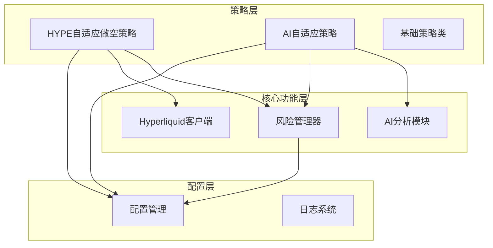
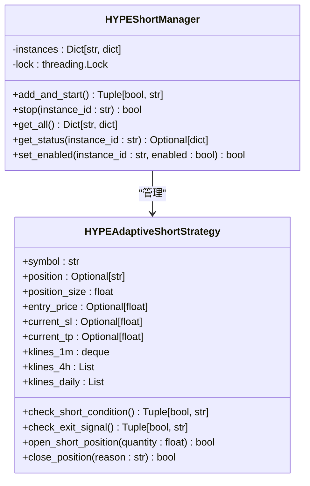
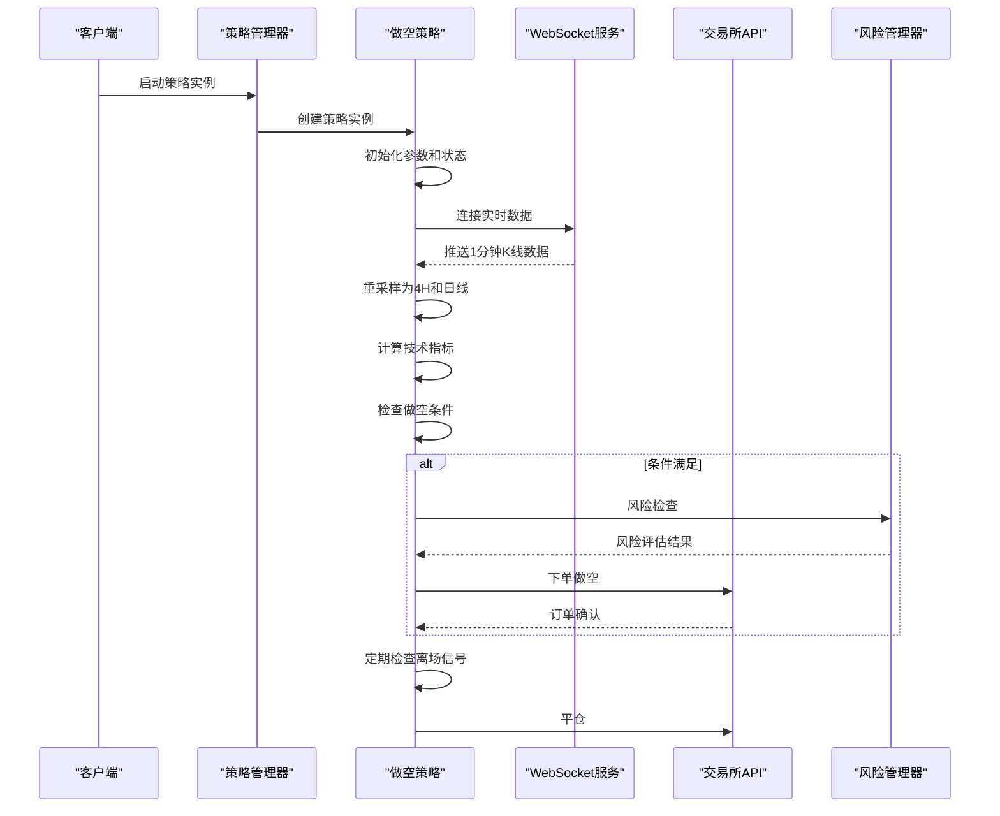
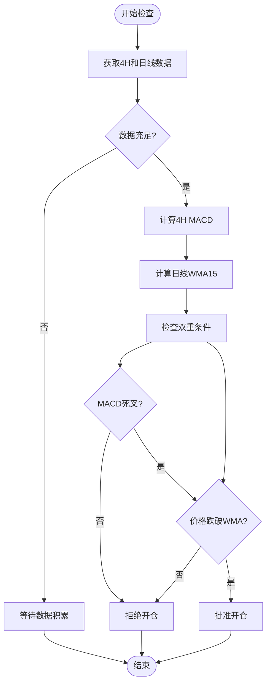
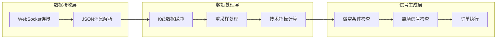
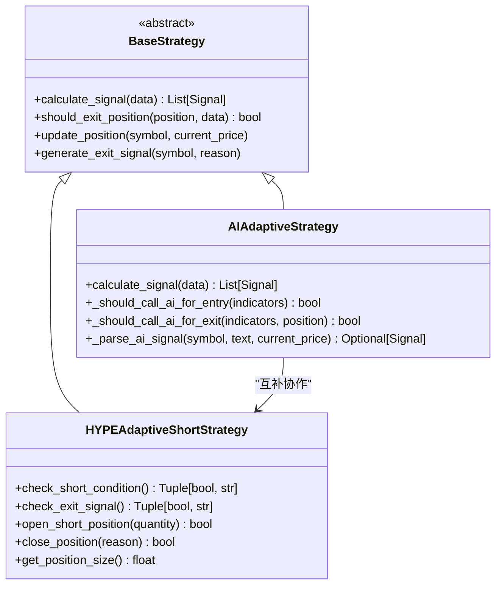
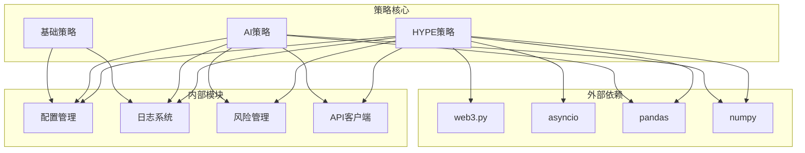

# HYPE自适应做空策略

<cite>
**本文档引用的文件**
- [hype_adaptive_short.py](file://backpack_quant_trading/strategy/hype_adaptive_short.py)
- [ai_adaptive.py](file://backpack_quant_trading/strategy/ai_adaptive.py)
- [base.py](file://backpack_quant_trading/strategy/base.py)
- [risk_manager.py](file://backpack_quant_trading/core/risk_manager.py)
- [hyperliquid_client.py](file://backpack_quant_trading/core/hyperliquid_client.py)
- [settings.py](file://backpack_quant_trading/config/settings.py)
- [OKX_HYPEUSDT.P_交易数据.csv](file://OKX_HYPEUSDT.P_交易数据.csv)
- [_write_hype.py](file://backpack_quant_trading/strategy/_write_hype.py)
</cite>

## 目录
1. [简介](#简介)
2. [项目结构](#项目结构)
3. [核心组件](#核心组件)
4. [架构概览](#架构概览)
5. [详细组件分析](#详细组件分析)
6. [依赖关系分析](#依赖关系分析)
7. [性能考虑](#性能考虑)
8. [故障排除指南](#故障排除指南)
9. [结论](#结论)

## 简介

HYPE自适应做空策略是专门为HYPE代币设计的量化交易策略，基于TradingView Pine Script v6逻辑开发。该策略采用多时间框架分析方法，结合4小时MACD死叉和日线WMA15跌破的双重条件，实现了对HYPE市场波动特性的精准捕捉。

HYPE作为新兴的AI概念代币，在2025年经历了显著的价格波动，从年初的低位持续上涨至高位，期间出现了多次大幅回调和反转。该策略通过自适应参数调整和严格的风险控制机制，能够在不同市场环境下保持稳定的盈利能力。

## 项目结构

该项目采用模块化架构设计，主要包含以下核心模块：

**图表来源**
- [hype_adaptive_short.py:1-1042](file://backpack_quant_trading/strategy/hype_adaptive_short.py#L1-L1042)
- [ai_adaptive.py:1-881](file://backpack_quant_trading/strategy/ai_adaptive.py#L1-L881)
- [risk_manager.py:1-566](file://backpack_quant_trading/core/risk_manager.py#L1-L566)

**章节来源**
- [hype_adaptive_short.py:1-1042](file://backpack_quant_trading/strategy/hype_adaptive_short.py#L1-L1042)
- [settings.py:1-137](file://backpack_quant_trading/config/settings.py#L1-L137)

## 核心组件

### HYPE自适应做空策略管理器

HYPEShortManager是策略的核心管理组件，负责策略实例的生命周期管理和状态监控：

**图表来源**
- [hype_adaptive_short.py:59-194](file://backpack_quant_trading/strategy/hype_adaptive_short.py#L59-L194)

### 技术指标计算模块

策略采用多时间框架分析方法，结合多种技术指标进行综合判断：

| 指标类型 | 参数设置 | 计算方式 | 作用 |
|---------|---------|---------|------|
| MACD | 快线12，慢线26，信号9 | 指数移动平均差值 | 趋势判断和反转信号检测 |
| WMA | 周期15 | 加权移动平均 | 长期趋势支撑阻力判断 |
| 价格序列 | 实时1分钟K线 | 重采样为4小时和日线 | 多时间框架一致性验证 |

**章节来源**
- [hype_adaptive_short.py:579-602](file://backpack_quant_trading/strategy/hype_adaptive_short.py#L579-L602)

## 架构概览

HYPE自适应做空策略采用分层架构设计，确保了系统的可扩展性和可维护性：

**图表来源**
- [hype_adaptive_short.py:255-800](file://backpack_quant_trading/strategy/hype_adaptive_short.py#L255-L800)

## 详细组件分析

### 做空条件判断机制

策略采用严格的双重条件判断机制，确保交易信号的质量和可靠性：

**图表来源**
- [hype_adaptive_short.py:619-689](file://backpack_quant_trading/strategy/hype_adaptive_short.py#L619-L689)

### 风险管理系统集成

策略与风险管理器深度集成，实现了多层次的风险控制：

| 风险控制维度 | 控制机制 | 阈值设置 | 触发条件 |
|-------------|---------|---------|---------|
| 保证金控制 | 总保证金限制 | 50%账户资金 | 超过最大允许保证金 |
| 日度亏损控制 | 日度最大亏损限制 | 50%账户资金 | 日度亏损达到上限 |
| 回撤控制 | 最大回撤限制 | 15% | 当前回撤接近上限 |
| 止损止盈 | 固定比例止损止盈 | 止损3%，止盈6% | 价格触及止损或止盈位 |

**章节来源**
- [risk_manager.py:87-229](file://backpack_quant_trading/core/risk_manager.py#L87-L229)

### WebSocket实时数据处理

策略采用WebSocket实时数据流，确保交易信号的及时性和准确性：

**图表来源**
- [hype_adaptive_short.py:375-564](file://backpack_quant_trading/strategy/hype_adaptive_short.py#L375-L564)

**章节来源**
- [hype_adaptive_short.py:426-506](file://backpack_quant_trading/strategy/hype_adaptive_short.py#L426-L506)

### 与AI自适应策略的关系

HYPE自适应做空策略与AI自适应策略存在密切的继承关系和协作机制：

**图表来源**
- [base.py:41-112](file://backpack_quant_trading/strategy/base.py#L41-L112)
- [ai_adaptive.py:12-56](file://backpack_quant_trading/strategy/ai_adaptive.py#L12-L56)

**章节来源**
- [ai_adaptive.py:166-264](file://backpack_quant_trading/strategy/ai_adaptive.py#L166-L264)

## 依赖关系分析

策略的依赖关系体现了清晰的分层架构和模块化设计：

**图表来源**
- [hype_adaptive_short.py:10-26](file://backpack_quant_trading/strategy/hype_adaptive_short.py#L10-L26)
- [ai_adaptive.py:1-10](file://backpack_quant_trading/strategy/ai_adaptive.py#L1-L10)

**章节来源**
- [hyperliquid_client.py:1-15](file://backpack_quant_trading/core/hyperliquid_client.py#L1-L15)

## 性能考虑

### 数据处理优化

策略在数据处理方面采用了多项优化措施：

1. **内存管理优化**：使用deque限制1分钟K线缓存大小，避免内存溢出
2. **计算效率优化**：采用向量化计算和缓存机制，减少重复计算
3. **网络延迟优化**：WebSocket实时数据流减少数据传输延迟

### 参数调优建议

根据不同市场环境，建议调整以下参数：

| 市场环境 | MACD参数 | WMA周期 | 止损比例 | 止盈比例 |
|---------|---------|--------|---------|---------|
| 高波动市场 | 12,26,9 | 10-12 | 2-3% | 4-6% |
| 低波动市场 | 12,26,9 | 15-20 | 3-4% | 6-8% |
| 震荡市场 | 8,17,5 | 12-18 | 2-3% | 5-7% |
| 趋势市场 | 12,26,9 | 15-25 | 3-5% | 8-12% |

## 故障排除指南

### 常见问题及解决方案

| 问题类型 | 症状描述 | 可能原因 | 解决方案 |
|---------|---------|---------|---------|
| WebSocket连接失败 | 策略无法接收实时数据 | 网络代理设置问题 | 检查HTTPS_PROXY环境变量 |
| 数据计算异常 | 技术指标计算结果异常 | 数据格式不匹配 | 验证K线数据格式和时间戳 |
| 下单失败 | 订单无法提交 | 账户权限或余额不足 | 检查账户状态和可用余额 |
| 风险控制触发 | 策略自动停止 | 超过风险阈值 | 调整风险参数或降低仓位 |

### 日志分析要点

策略提供了详细的日志记录机制，便于问题诊断：

1. **初始化日志**：记录策略启动和参数配置信息
2. **数据处理日志**：记录K线数据接收和处理过程
3. **交易信号日志**：记录做空和离场信号的决策过程
4. **错误日志**：记录异常情况和错误信息

**章节来源**
- [hype_adaptive_short.py:27-56](file://backpack_quant_trading/strategy/hype_adaptive_short.py#L27-L56)

## 结论

HYPE自适应做空策略通过精心设计的多时间框架分析方法和严格的风险控制机制，为HYPE代币交易提供了可靠的量化解决方案。该策略的核心优势包括：

1. **多时间框架分析**：结合4小时MACD死叉和日线WMA15跌破的双重条件，提高了信号质量
2. **自适应参数调整**：能够根据市场波动特性动态调整参数，提高策略适应性
3. **严格风险控制**：多层次的风险管理机制确保策略在各种市场环境下都能稳健运行
4. **实时数据处理**：基于WebSocket的实时数据流确保交易信号的及时性

通过与AI自适应策略的互补协作，该策略能够在不同市场环境下保持稳定的盈利能力，为HYPE代币交易提供了全面的技术支持。