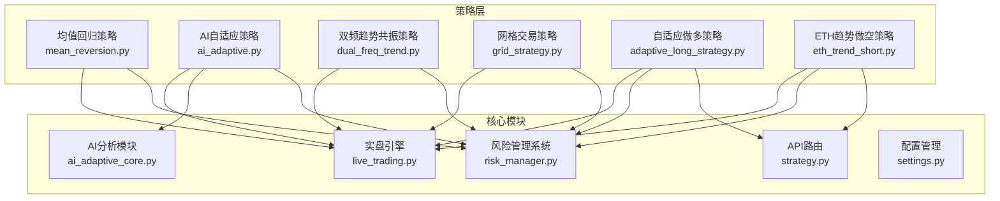
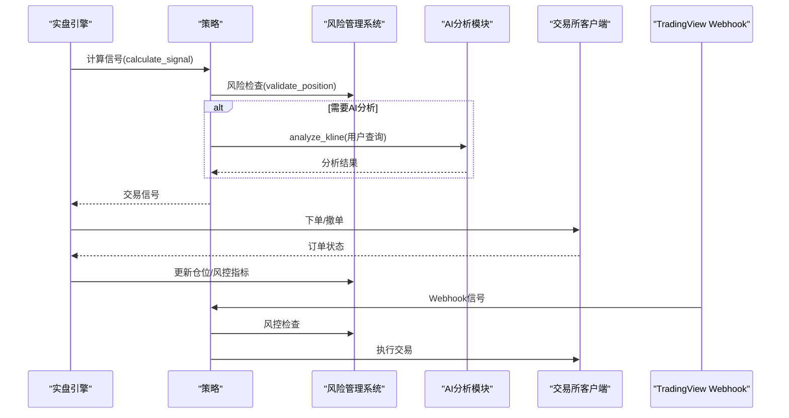
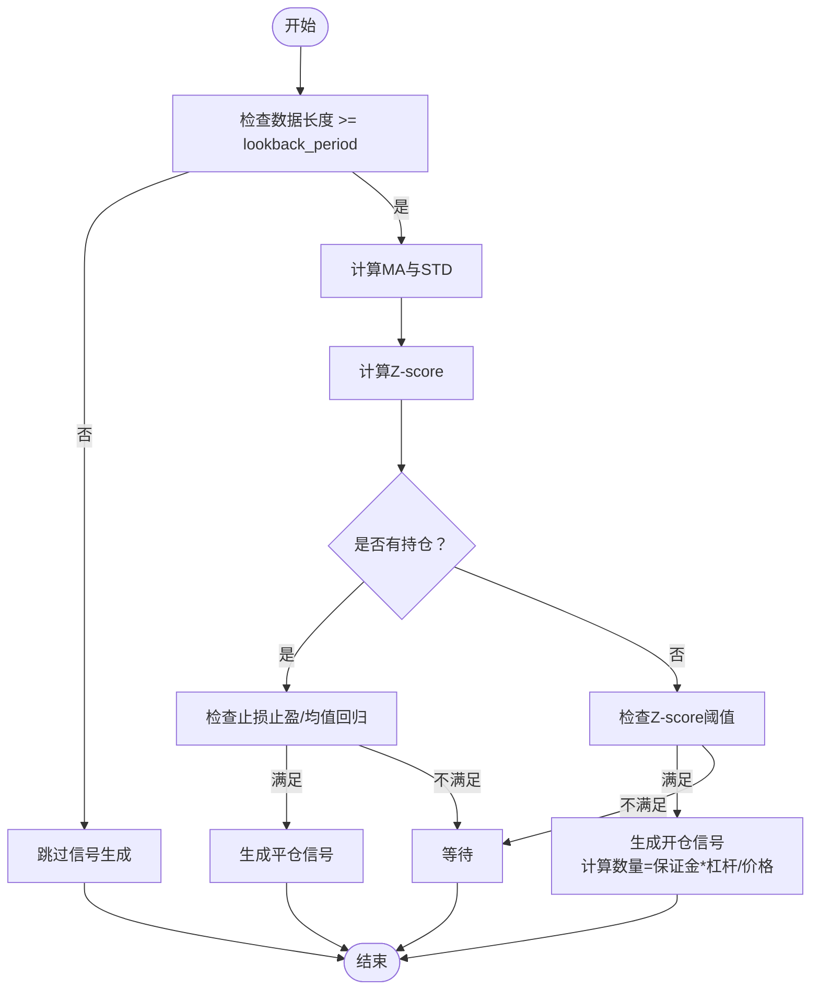
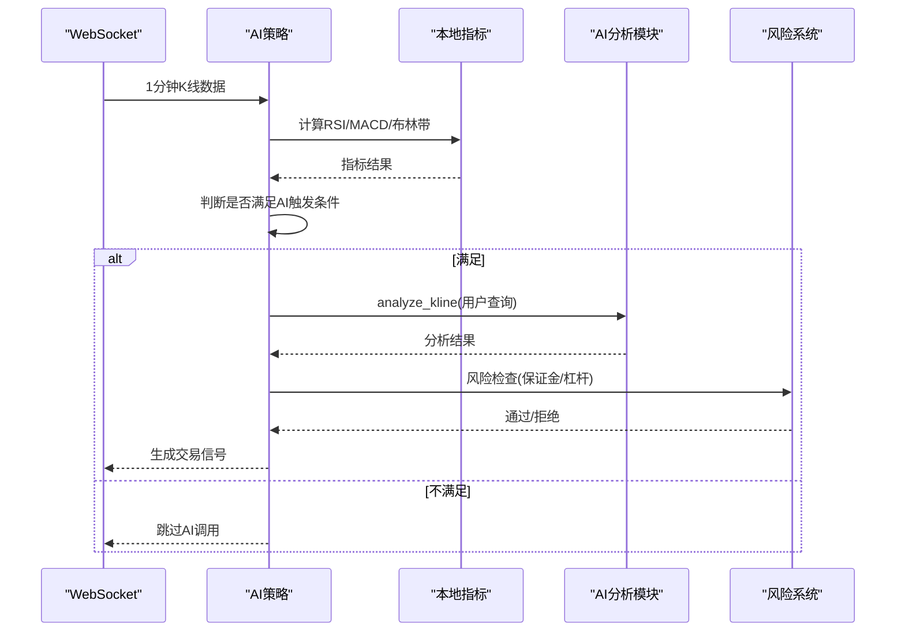
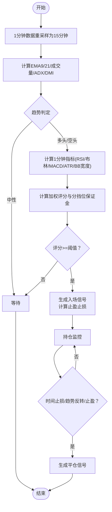
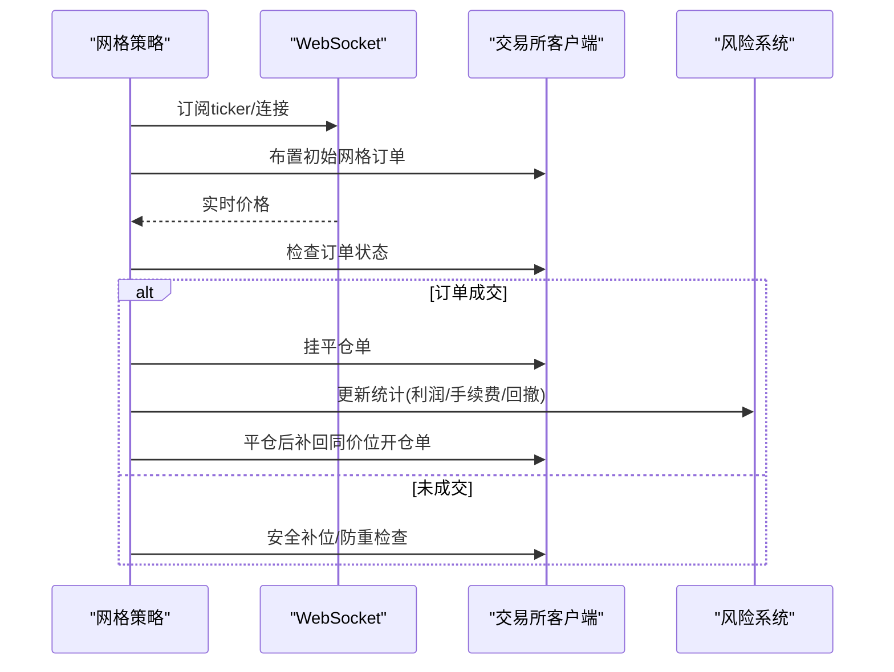
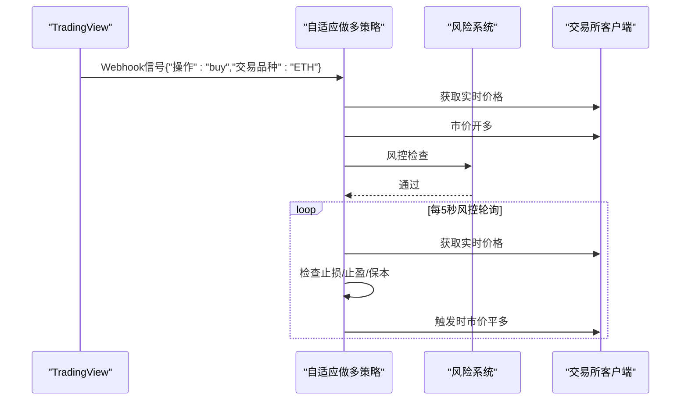
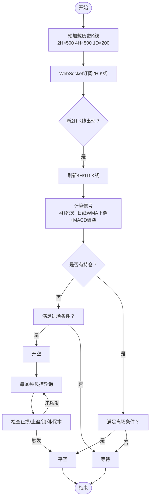
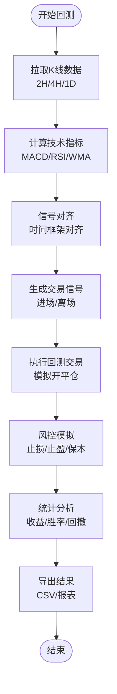
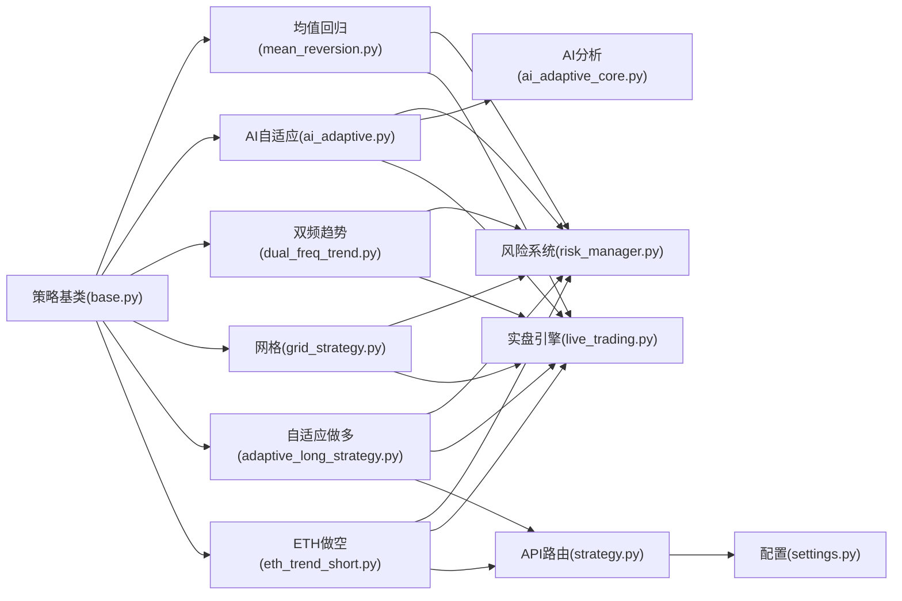

# 具体策略实现

<cite>
**本文档引用的文件**
- [mean_reversion.py](file://backpack_quant_trading/strategy/mean_reversion.py)
- [ai_adaptive.py](file://backpack_quant_trading/strategy/ai_adaptive.py)
- [dual_freq_trend.py](file://backpack_quant_trading/strategy/dual_freq_trend.py)
- [grid_strategy.py](file://backpack_quant_trading/strategy/grid_strategy.py)
- [adaptive_long_strategy.py](file://backpack_quant_trading/strategy/adaptive_long_strategy.py)
- [eth_trend_short.py](file://backpack_quant_trading/strategy/eth_trend_short.py)
- [trend_short_backtest.py](file://backpack_quant_trading/strategy/trend_short_backtest.py)
- [trend_short_tester.py](file://backpack_quant_trading/strategy/trend_short_tester.py)
- [hype_native_backtest.py](file://backpack_quant_trading/strategy/hype_native_backtest.py)
- [hype_native_tester.py](file://backpack_quant_trading/strategy/hype_native_tester.py)
- [hype_backtest.py](file://backpack_quant_trading/strategy/hype_backtest.py)
- [base.py](file://backpack_quant_trading/strategy/base.py)
- [ai_adaptive_core.py](file://backpack_quant_trading/core/ai_adaptive.py)
- [risk_manager.py](file://backpack_quant_trading/core/risk_manager.py)
- [live_trading.py](file://backpack_quant_trading/engine/live_trading.py)
- [strategy.py](file://backpack_quant_trading/api/routers/strategy.py)
- [settings.py](file://backpack_quant_trading/config/settings.py)
</cite>

## 更新摘要
**变更内容**
- 新增自适应做多策略（AdaptiveLongStrategy）和ETH趋势做空策略（ETHTrendShortStrategy）
- 添加完整的回测和测试框架，包括多个策略回测脚本和参数扫描器
- 扩展策略实现文档以涵盖新的TradingView Webhook驱动策略
- 增强回测框架的完整性和参数优化能力

## 目录
1. [引言](#引言)
2. [项目结构](#项目结构)
3. [核心组件](#核心组件)
4. [架构概览](#架构概览)
5. [详细组件分析](#详细组件分析)
6. [新增策略实现](#新增策略实现)
7. [回测和测试框架](#回测和测试框架)
8. [依赖分析](#依赖分析)
9. [性能考虑](#性能考虑)
10. [故障排除指南](#故障排除指南)
11. [结论](#结论)
12. [附录](#附录)

## 引言
本文件面向量化交易系统的具体策略实现，围绕均值回归策略、AI自适应策略、双频趋势共振策略、网格交易策略以及新增的自适应做多策略和ETH趋势做空策略，提供完整的技术文档。内容涵盖技术原理、参数配置、交易逻辑、风险管理、性能评估与实际应用案例，帮助开发者与使用者快速理解并部署这些策略。

## 项目结构
策略层位于 `backpack_quant_trading/strategy/`，包含七个核心策略实现与基类；风险控制位于 `core/`；实盘引擎位于 `engine/`；API路由位于 `api/routers/`；配置位于 `config/`。策略通过基类统一接口与风险管理系统协作，实盘引擎负责数据订阅、订单执行与风控监控。

**图表来源**
- [adaptive_long_strategy.py:1-310](file://backpack_quant_trading/strategy/adaptive_long_strategy.py#L1-310)
- [eth_trend_short.py:1-534](file://backpack_quant_trading/strategy/eth_trend_short.py#L1-534)
- [trend_short_backtest.py:1-437](file://backpack_quant_trading/strategy/trend_short_backtest.py#L1-437)
- [trend_short_tester.py:1-335](file://backpack_quant_trading/strategy/trend_short_tester.py#L1-335)
- [hype_native_backtest.py:1-518](file://backpack_quant_trading/strategy/hype_native_backtest.py#L1-518)
- [hype_native_tester.py:1-333](file://backpack_quant_trading/strategy/hype_native_tester.py#L1-333)
- [hype_backtest.py:1-522](file://backpack_quant_trading/strategy/hype_backtest.py#L1-522)

## 核心组件
- 策略基类：定义统一的信号生成、平仓判断、仓位更新与性能指标接口，确保各策略遵循一致的生命周期。
- 风险管理器：负责保证金校验、日度限额、最大回撤控制、VaR与压力测试等风险度量。
- AI分析模块：封装DeepSeek推理与Gemini视觉识别，提供K线数据驱动的策略分析能力。
- 实盘引擎：负责WebSocket订阅、数据缓存、订单执行、仓位监控与风控事件记录。
- API路由：提供策略数据的HTTP接口，支持回测数据导入、K线同步和策略概览展示。
- 配置管理：集中管理各个交易所的API配置和交易参数。

**章节来源**
- [base.py:41-212](file://backpack_quant_trading/strategy/base.py#L41-212)
- [risk_manager.py:48-566](file://backpack_quant_trading/core/risk_manager.py#L48-566)
- [ai_adaptive_core.py:237-338](file://backpack_quant_trading/core/ai_adaptive.py#L237-338)
- [live_trading.py:347-800](file://backpack_quant_trading/engine/live_trading.py#L347-800)
- [strategy.py:1-800](file://backpack_quant_trading/api/routers/strategy.py#L1-800)
- [settings.py:104-137](file://backpack_quant_trading/config/settings.py#L104-137)

## 架构概览
策略通过基类接口与风险管理系统交互，AI自适应策略调用AI分析模块进行技术面与消息面综合分析，双频趋势策略采用多时间框架共振，网格策略实现合约市场的高抛低吸自动化。新增的自适应做多策略和ETH趋势做空策略通过TradingView Webhook驱动，提供实时信号响应能力。

**图表来源**
- [adaptive_long_strategy.py:157-217](file://backpack_quant_trading/strategy/adaptive_long_strategy.py#L157-217)
- [eth_trend_short.py:327-358](file://backpack_quant_trading/strategy/eth_trend_short.py#L327-358)
- [ai_adaptive.py:266-670](file://backpack_quant_trading/strategy/ai_adaptive.py#L266-670)

## 详细组件分析

### 均值回归策略
- 技术原理：基于滚动均值与标准差计算Z-score，当价格偏离均值超过阈值时生成反向信号；平仓条件包括止损止盈触发与Z-score回归均值。
- 参数配置：
  - lookback_period：回看周期（默认5）
  - zscore_threshold：Z分数阈值（默认1.0）
  - position_size：保证金（绝对值，非比例）
  - stop_loss_percent/take_profit_percent：止损止盈比例
- 交易逻辑：
  - 计算MA与STD，生成Z-score
  - 若无持仓且Z-score超出阈值，按保证金与杠杆计算开仓数量
  - 持仓中检查止损止盈与Z-score回归均值条件
- 风险管理：通过风险管理系统校验保证金与账户余额，避免超仓。

**图表来源**
- [mean_reversion.py:31-117](file://backpack_quant_trading/strategy/mean_reversion.py#L31-117)
- [mean_reversion.py:119-149](file://backpack_quant_trading/strategy/mean_reversion.py#L119-149)
- [mean_reversion.py:151-246](file://backpack_quant_trading/strategy/mean_reversion.py#L151-246)

**章节来源**
- [mean_reversion.py:13-117](file://backpack_quant_trading/strategy/mean_reversion.py#L13-117)
- [mean_reversion.py:119-246](file://backpack_quant_trading/strategy/mean_reversion.py#L119-246)

### AI自适应策略
- 技术原理：基于DeepSeek V3进行纯数据驱动的K线分析，结合本地技术指标预筛选（RSI/MACD/布林带）降低AI调用频率；采用日内交易模式，严格开平仓配对。
- 参数配置：
  - margin/leverage：保证金与杠杆
  - stop_loss_ratio/take_profit_ratio：止损止盈比例
  - 本地指标阈值与触发条件（RSI极端、触及布林边界、MACD柱状图）
- 交易逻辑：
  - 每1分钟K线到达时，先计算本地指标，满足条件才调用AI
  - 深度分析与快速判断模式切换，支持1000根K线与实时K线
  - 从AI分析结果解析买卖信号，生成统一交易信号
- 动态参数调整：根据持仓状态与浮动盈亏动态调整AI提示词与分析模式。

**图表来源**
- [ai_adaptive.py:266-670](file://backpack_quant_trading/strategy/ai_adaptive.py#L266-670)
- [ai_adaptive_core.py:252-338](file://backpack_quant_trading/core/ai_adaptive.py#L252-338)
- [risk_manager.py:87-229](file://backpack_quant_trading/core/risk_manager.py#L87-229)

**章节来源**
- [ai_adaptive.py:12-670](file://backpack_quant_trading/strategy/ai_adaptive.py#L12-670)
- [ai_adaptive_core.py:237-338](file://backpack_quant_trading/core/ai_adaptive.py#L237-338)

### 双频趋势共振策略
- 技术原理：15分钟趋势判定（EMA9/21+成交量）与1分钟精细入场（回调/突破+RSI6+布林带+EMA5/13）相结合，形成多时间框架共振。
- 参数配置：
  - 15分钟：EMA9/21周期
  - 1分钟：EMA5/13、RSI6、布林带周期与标准差
  - 止盈止损：基于保证金收益%与杠杆换算
  - 时间止损、冷却期、最小进场间隔
- 交易逻辑：
  - 15分钟趋势过滤，确认多头/空头趋势
  - 1分钟指标确认入场时机，计算加权评分与分挡位保证金
  - 持仓中检查时间止损、趋势反转与追踪止盈

**图表来源**
- [dual_freq_trend.py:170-201](file://backpack_quant_trading/strategy/dual_freq_trend.py#L170-201)
- [dual_freq_trend.py:228-270](file://backpack_quant_trading/strategy/dual_freq_trend.py#L228-270)
- [dual_freq_trend.py:289-426](file://backpack_quant_trading/strategy/dual_freq_trend.py#L289-426)
- [dual_freq_trend.py:636-800](file://backpack_quant_trading/strategy/dual_freq_trend.py#L636-800)

**章节来源**
- [dual_freq_trend.py:18-168](file://backpack_quant_trading/strategy/dual_freq_trend.py#L18-168)
- [dual_freq_trend.py:170-800](file://backpack_quant_trading/strategy/dual_freq_trend.py#L170-800)

### 网格交易策略
- 技术原理：在设定价格区间内自动挂单，高抛低吸实现无方向收益；支持双向、做多、做空三种网格模式。
- 参数配置：
  - price_lower/price_upper：价格区间
  - grid_count：网格数量
  - investment_per_grid：单格投资（USDT）
  - leverage：杠杆倍数
  - grid_mode：long_short/long_only/short_only
- 交易逻辑：
  - 生成网格层级，按当前价附近布置初始订单
  - 监控订单成交，成交后挂对应方向的平仓单，平仓后再补回同价位开仓单
  - 支持429限频熔断、REST/WSS降级、边界保护与日度/总亏损限制

**图表来源**
- [grid_strategy.py:179-280](file://backpack_quant_trading/strategy/grid_strategy.py#L179-280)
- [grid_strategy.py:532-597](file://backpack_quant_trading/strategy/grid_strategy.py#L532-597)
- [grid_strategy.py:599-754](file://backpack_quant_trading/strategy/grid_strategy.py#L599-754)

**章节来源**
- [grid_strategy.py:38-156](file://backpack_quant_trading/strategy/grid_strategy.py#L38-156)
- [grid_strategy.py:179-754](file://backpack_quant_trading/strategy/grid_strategy.py#L179-754)

## 新增策略实现

### 自适应做多策略（AdaptiveLongStrategy）
- 技术原理：基于TradingView Webhook信号驱动的自适应做多策略，通过Webhook接收买卖信号，本地执行止损、止盈和保本风控。
- 参数配置：
  - margin_amount：保证金金额（默认20.0）
  - leverage：杠杆倍数（默认50）
  - stop_loss_pct：止损比例（默认3%）
  - take_profit_pct：止盈比例（默认6%）
  - break_even_pct：保本触发比例（默认3%）
- 交易逻辑：
  - Webhook信号处理：buy信号开多，sell信号平多
  - 本地风控：每5秒轮询实时价格，执行止损、止盈和保本
  - 动态币种识别：从Webhook信号中动态获取交易品种
- 风险管理：严格的止损止盈机制，保本功能将止损价移动到成本价

**图表来源**
- [adaptive_long_strategy.py:157-217](file://backpack_quant_trading/strategy/adaptive_long_strategy.py#L157-217)
- [adaptive_long_strategy.py:114-155](file://backpack_quant_trading/strategy/adaptive_long_strategy.py#L114-155)

**章节来源**
- [adaptive_long_strategy.py:44-310](file://backpack_quant_trading/strategy/adaptive_long_strategy.py#L44-310)

### ETH趋势做空策略（ETHTrendShortStrategy）
- 技术原理：基于4H死叉和日线WMA下穿信号的ETH趋势做空策略，采用2H时间框架进行进场和离场判断。
- 参数配置：
  - margin_amount：保证金金额（默认20.0）
  - leverage：杠杆倍数（默认50）
  - stop_loss_pct：止损比例（默认3%）
  - take_profit_pct：止盈比例（默认10%）
  - lockin_trig_pct：锁利触发比例（默认4%）
  - lockin_prot_pct：锁利保护比例（默认2%）
  - breakeven_pct：保本触发比例（默认5%）
  - price_filter_min：价格下限过滤（默认2000）
- 交易逻辑：
  - WebSocket订阅2H K线，检测新K线出现
  - 计算4H死叉、日线WMA下穿和2H MACD偏空信号
  - 每30秒轮询风控，执行止损、止盈、锁利和保本
- 指标计算：WMA15、MACD（12,26,9）、RSI等技术指标

**图表来源**
- [eth_trend_short.py:198-222](file://backpack_quant_trading/strategy/eth_trend_short.py#L198-222)
- [eth_trend_short.py:237-308](file://backpack_quant_trading/strategy/eth_trend_short.py#L237-308)
- [eth_trend_short.py:327-358](file://backpack_quant_trading/strategy/eth_trend_short.py#L327-358)

**章节来源**
- [eth_trend_short.py:137-534](file://backpack_quant_trading/strategy/eth_trend_short.py#L137-534)

## 回测和测试框架

### 策略回测框架
系统提供了完整的策略回测框架，支持多种时间框架和参数组合的自动化测试。

#### ETH 2H 趋势反转做空回测
- 技术原理：基于Pine Script"2h趋势策略 (隐藏优化版)"的回测框架，支持做空逻辑验证。
- 特征：
  - 支持100%权益复利模式
  - 双向手续费0.1%（可配置为0与TradingView对齐）
  - 完整的风控模拟：止损+3%、止盈-6%、保本触发-3%
  - MFE/MAE统计分析
- 输出：详细的交易记录CSV、统计报表、最大回撤计算

#### HYPE 4H进场/1H离场 做空策略回测
- 技术原理：针对HYPE币种的做空策略回测，支持锁利和保本机制。
- 特征：
  - SL 1%~10%、TP 3%~20%的网格扫描
  - 锁利触发4%、保护2%、保本5%的风控组合
  - MFE/MAE波动统计分析
  - 综合评分最优解推荐

#### HYPE 2H 做空策略回测
- 技术原理：ETH 2H做空策略的回测版本，支持优化历史对比。
- 特征：
  - 优化历史：OR无过滤(+7.75%) → OR+D(4H金叉)+2H金叉(+64.68%)
  - 价格下限过滤：ETH收盘价<2000时不追空
  - 完整的交易记录导出

**图表来源**
- [trend_short_backtest.py:179-437](file://backpack_quant_trading/strategy/trend_short_backtest.py#L179-437)
- [hype_native_backtest.py:163-518](file://backpack_quant_trading/strategy/hype_native_backtest.py#L163-518)
- [hype_backtest.py:168-522](file://backpack_quant_trading/strategy/hype_backtest.py#L168-522)

**章节来源**
- [trend_short_backtest.py:1-437](file://backpack_quant_trading/strategy/trend_short_backtest.py#L1-437)
- [hype_native_backtest.py:1-518](file://backpack_quant_trading/strategy/hype_native_backtest.py#L1-518)
- [hype_native_tester.py:1-333](file://backpack_quant_trading/strategy/hype_native_tester.py#L1-333)
- [hype_backtest.py:1-522](file://backpack_quant_trading/strategy/hype_backtest.py#L1-522)

### 策略测试器
系统提供了专门的策略测试器，用于A+B基准的胜率提升专项测试。

#### ETH 2H 趋势反转做空 — A+B 胜率提升专项测试
- 测试目标：验证新增过滤条件D/E/F对胜率的提升效果
- 基准策略（A+B）：
  - 进场：4H MACD死叉[1] + 2H收盘<日线WMA + RSI[1]<50
  - 离场：2H MACD金叉[1] + RSI[1]>=50 + 2H收盘>日线WMA
- 新增过滤条件：
  - D：2H MACD本身偏空（macd_s1 < signal_s1）
  - E：日线WMA斜率向下（daily_wma < 前一日daily_wma）
  - F：4H RSI < 50（双时间轴动量共振）

**章节来源**
- [trend_short_tester.py:1-335](file://backpack_quant_trading/strategy/trend_short_tester.py#L1-335)

## 依赖分析
- 策略基类统一接口：所有策略共享相同的信号生成与平仓判断接口，便于扩展与替换。
- 风险管理耦合：策略通过风险管理系统进行保证金与限额校验，避免过度杠杆与超仓。
- AI模块解耦：AI自适应策略独立于具体交易对，通过统一提示词与系统提示词进行分析。
- 实盘引擎集成：策略通过实盘引擎获取数据与执行订单，保证跨平台一致性。
- API路由集成：新增策略通过API路由提供Webhook接口和状态查询功能。
- 配置管理：统一的配置管理支持多个交易所的API密钥和参数设置。

**图表来源**
- [adaptive_long_strategy.py:26-62](file://backpack_quant_trading/strategy/adaptive_long_strategy.py#L26-62)
- [eth_trend_short.py:27-160](file://backpack_quant_trading/strategy/eth_trend_short.py#L27-160)
- [strategy.py:1-800](file://backpack_quant_trading/api/routers/strategy.py#L1-800)
- [settings.py:104-137](file://backpack_quant_trading/config/settings.py#L104-137)

**章节来源**
- [base.py:41-112](file://backpack_quant_trading/strategy/base.py#L41-112)
- [risk_manager.py:48-229](file://backpack_quant_trading/core/risk_manager.py#L48-229)
- [ai_adaptive_core.py:237-338](file://backpack_quant_trading/core/ai_adaptive.py#L237-338)
- [live_trading.py:347-370](file://backpack_quant_trading/engine/live_trading.py#L347-370)
- [strategy.py:1-800](file://backpack_quant_trading/api/routers/strategy.py#L1-800)
- [settings.py:104-137](file://backpack_quant_trading/config/settings.py#L104-137)

## 性能考虑
- 均值回归：滚动窗口计算成本较低，适合高频回测；注意数据长度与阈值设置。
- AI自适应：本地指标预筛选显著降低AI调用频率；深度分析与实时分析模式按需切换。
- 双频趋势：15分钟与1分钟指标计算量适中；加权评分与波动率过滤提升信号质量。
- 网格：订单并发与429限频处理需谨慎；REST/WSS降级保障稳定性。
- 自适应做多：Webhook信号处理异步化，减少阻塞；5秒风控轮询平衡响应速度与资源消耗。
- ETH做空：WebSocket实时K线订阅，30秒风控轮询；K线缓存预加载提升初始化性能。

## 故障排除指南
- WebSocket连接失败：检查代理设置与库版本，必要时升级websockets；实盘引擎具备重连与降级策略。
- AI分析异常：确认API Key配置与网络状态；查看日志中的错误堆栈。
- 风控拦截：检查账户余额、保证金与限额；关注日度亏损与最大回撤限制。
- 网格订单异常：关注429限频熔断与挂单复用；确保价格精度与最小下单金额。
- Webhook信号异常：检查TradingView Webhook配置与签名验证；确认信号格式正确。
- 交易所API错误：检查API密钥权限与配额限制；查看具体的错误码与描述。

**章节来源**
- [live_trading.py:153-235](file://backpack_quant_trading/engine/live_trading.py#L153-235)
- [ai_adaptive_core.py:309-338](file://backpack_quant_trading/core/ai_adaptive.py#L309-338)
- [risk_manager.py:173-229](file://backpack_quant_trading/core/risk_manager.py#L173-229)
- [grid_strategy.py:401-498](file://backpack_quant_trading/strategy/grid_strategy.py#L401-498)
- [adaptive_long_strategy.py:157-217](file://backpack_quant_trading/strategy/adaptive_long_strategy.py#L157-217)
- [eth_trend_short.py:246-308](file://backpack_quant_trading/strategy/eth_trend_short.py#L246-308)

## 结论
本文档系统梳理了七种具体策略的实现细节，包括技术原理、参数配置、交易逻辑与风险管理。新增的自适应做多策略和ETH趋势做空策略通过TradingView Webhook实现了实时信号驱动，大幅提升了策略响应速度和灵活性。完善的回测和测试框架为策略优化提供了强有力的支持。建议在部署前充分测试参数与风控阈值，并结合历史数据进行回测验证。

## 附录
- 适用场景与优缺点：
  - 均值回归：震荡市场，低波动；优点是简单稳健，缺点是趋势中可能频繁止损。
  - AI自适应：日内高频交易，需要快速决策；优点是成本优化与强趋势识别，缺点是对AI质量依赖较高。
  - 双频趋势：趋势明确的市场，追求高胜率；优点是多时间框架共振，缺点是震荡市可能错过。
  - 网格：横盘或小幅波动市场，追求无方向收益；优点是自动化高抛低吸，缺点是趋势突变风险。
  - 自适应做多：需要实时信号驱动的做多策略；优点是响应速度快，缺点是依赖外部信号源。
  - ETH做空：趋势明确的ETH做空策略；优点是技术面信号明确，缺点是市场风险敞口较大。
- 实际应用案例：
  - 均值回归：在币安/OKX等交易所的USDT计价永续合约中，针对ETH/ADA等币种进行短周期回测与实盘。
  - AI自适应：结合实时K线与新闻摘要，进行日内交易信号生成与止盈止损计算。
  - 双频趋势：在OKX/Hyperliquid等平台，利用15分钟与1分钟数据进行趋势与入场确认。
  - 网格：在Backpack/Ostium等平台，设置合理网格间距与单格投资，实现高抛低吸。
  - 自适应做多：通过TradingView Webhook接收实时信号，在Hyperliquid等平台执行做多交易。
  - ETH做空：基于4H死叉和日线WMA下穿信号，在2H时间框架上执行做空交易。