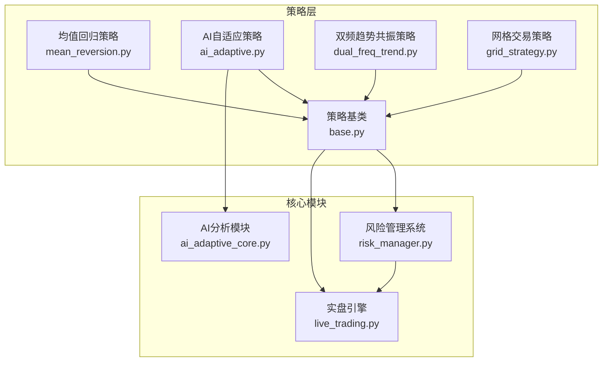
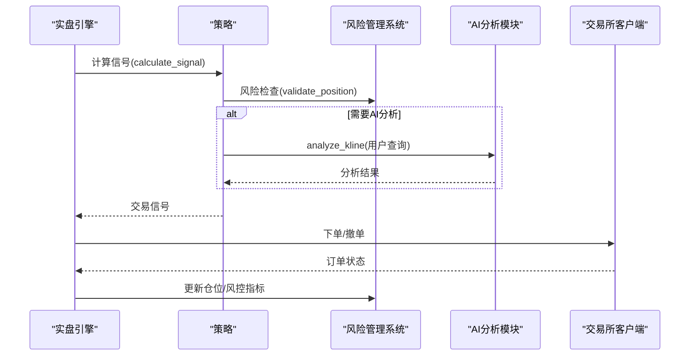
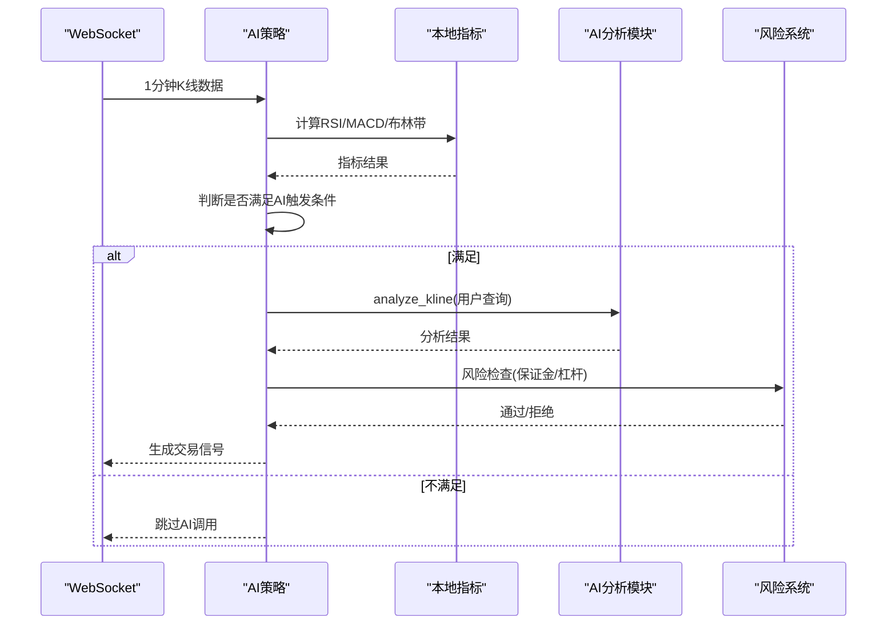
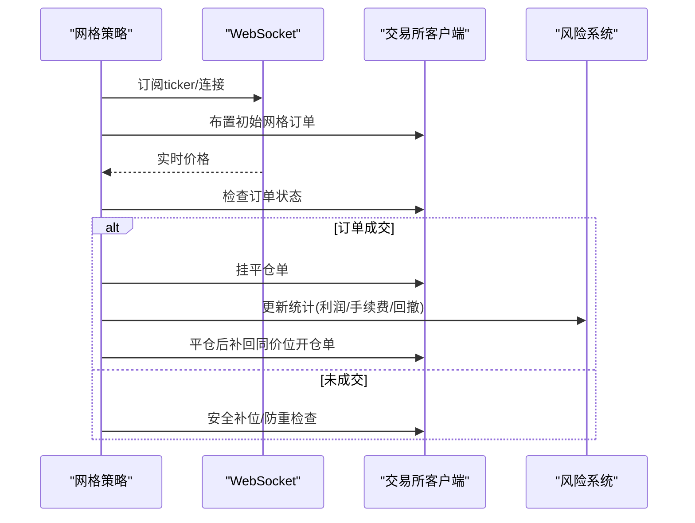
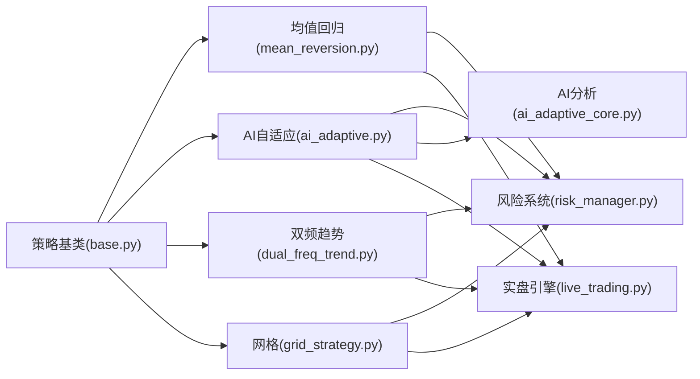

# 具体策略实现

<cite>
**本文档引用的文件**
- [mean_reversion.py](file://backpack_quant_trading/strategy/mean_reversion.py)
- [ai_adaptive.py](file://backpack_quant_trading/strategy/ai_adaptive.py)
- [dual_freq_trend.py](file://backpack_quant_trading/strategy/dual_freq_trend.py)
- [grid_strategy.py](file://backpack_quant_trading/strategy/grid_strategy.py)
- [base.py](file://backpack_quant_trading/strategy/base.py)
- [ai_adaptive_core.py](file://backpack_quant_trading/core/ai_adaptive.py)
- [risk_manager.py](file://backpack_quant_trading/core/risk_manager.py)
- [live_trading.py](file://backpack_quant_trading/engine/live_trading.py)
</cite>

## 目录
1. [引言](#引言)
2. [项目结构](#项目结构)
3. [核心组件](#核心组件)
4. [架构概览](#架构概览)
5. [详细组件分析](#详细组件分析)
6. [依赖分析](#依赖分析)
7. [性能考虑](#性能考虑)
8. [故障排除指南](#故障排除指南)
9. [结论](#结论)
10. [附录](#附录)

## 引言
本文件面向量化交易系统的具体策略实现，围绕均值回归策略、AI自适应策略、双频趋势共振策略与网格交易策略，提供完整的技术文档。内容涵盖技术原理、参数配置、交易逻辑、风险管理、性能评估与实际应用案例，帮助开发者与使用者快速理解并部署这些策略。

## 项目结构
策略层位于 `backpack_quant_trading/strategy/`，包含四个核心策略实现与基类；风险控制位于 `core/`；实盘引擎位于 `engine/`。策略通过基类统一接口与风险管理系统协作，实盘引擎负责数据订阅、订单执行与风控监控。

**图表来源**
- [mean_reversion.py:1-263](file://backpack_quant_trading/strategy/mean_reversion.py#L1-263)
- [ai_adaptive.py:1-800](file://backpack_quant_trading/strategy/ai_adaptive.py#L1-800)
- [dual_freq_trend.py:1-800](file://backpack_quant_trading/strategy/dual_freq_trend.py#L1-800)
- [grid_strategy.py:1-800](file://backpack_quant_trading/strategy/grid_strategy.py#L1-800)
- [base.py:1-212](file://backpack_quant_trading/strategy/base.py#L1-212)
- [ai_adaptive_core.py:1-338](file://backpack_quant_trading/core/ai_adaptive.py#L1-338)
- [risk_manager.py:1-566](file://backpack_quant_trading/core/risk_manager.py#L1-566)
- [live_trading.py:1-800](file://backpack_quant_trading/engine/live_trading.py#L1-800)

**章节来源**
- [base.py:1-212](file://backpack_quant_trading/strategy/base.py#L1-212)
- [live_trading.py:1-800](file://backpack_quant_trading/engine/live_trading.py#L1-800)

## 核心组件
- 策略基类：定义统一的信号生成、平仓判断、仓位更新与性能指标接口，确保各策略遵循一致的生命周期。
- 风险管理器：负责保证金校验、日度限额、最大回撤控制、VaR与压力测试等风险度量。
- AI分析模块：封装DeepSeek推理与Gemini视觉识别，提供K线数据驱动的策略分析能力。
- 实盘引擎：负责WebSocket订阅、数据缓存、订单执行、仓位监控与风控事件记录。

**章节来源**
- [base.py:41-212](file://backpack_quant_trading/strategy/base.py#L41-212)
- [risk_manager.py:48-566](file://backpack_quant_trading/core/risk_manager.py#L48-566)
- [ai_adaptive_core.py:237-338](file://backpack_quant_trading/core/ai_adaptive.py#L237-338)
- [live_trading.py:347-800](file://backpack_quant_trading/engine/live_trading.py#L347-800)

## 架构概览
策略通过基类接口与风险管理系统交互，AI自适应策略调用AI分析模块进行技术面与消息面综合分析，双频趋势策略采用多时间框架共振，网格策略实现合约市场的高抛低吸自动化。

**图表来源**
- [ai_adaptive.py:266-670](file://backpack_quant_trading/strategy/ai_adaptive.py#L266-670)
- [ai_adaptive_core.py:252-338](file://backpack_quant_trading/core/ai_adaptive.py#L252-338)
- [risk_manager.py:87-229](file://backpack_quant_trading/core/risk_manager.py#L87-229)
- [live_trading.py:536-568](file://backpack_quant_trading/engine/live_trading.py#L536-568)

## 详细组件分析

### 均值回归策略
- 技术原理：基于滚动均值与标准差计算Z-score，当价格偏离均值超过阈值时生成反向信号；平仓条件包括止损止盈触发与Z-score回归均值。
- 参数配置：
  - lookback_period：回看周期（默认5）
  - zscore_threshold：Z分数阈值（默认1.0）
  - position_size：保证金（绝对值，非比例）
  - stop_loss_percent/take_profit_percent：止损止盈比例
- 交易逻辑：
  - 计算MA与STD，生成Z-score
  - 若无持仓且Z-score超出阈值，按保证金与杠杆计算开仓数量
  - 持仓中检查止损止盈与Z-score回归均值条件
- 风险管理：通过风险管理系统校验保证金与账户余额，避免超仓。

**图表来源**
- [mean_reversion.py:31-117](file://backpack_quant_trading/strategy/mean_reversion.py#L31-117)
- [mean_reversion.py:119-149](file://backpack_quant_trading/strategy/mean_reversion.py#L119-149)
- [mean_reversion.py:151-246](file://backpack_quant_trading/strategy/mean_reversion.py#L151-246)

**章节来源**
- [mean_reversion.py:13-117](file://backpack_quant_trading/strategy/mean_reversion.py#L13-117)
- [mean_reversion.py:119-246](file://backpack_quant_trading/strategy/mean_reversion.py#L119-246)

### AI自适应策略
- 技术原理：基于DeepSeek V3进行纯数据驱动的K线分析，结合本地技术指标预筛选（RSI/MACD/布林带）降低AI调用频率；采用日内交易模式，严格开平仓配对。
- 参数配置：
  - margin/leverage：保证金与杠杆
  - stop_loss_ratio/take_profit_ratio：止损止盈比例
  - 本地指标阈值与触发条件（RSI极端、触及布林边界、MACD柱状图）
- 交易逻辑：
  - 每1分钟K线到达时，先计算本地指标，满足条件才调用AI
  - 深度分析与快速判断模式切换，支持1000根K线与实时K线
  - 从AI分析结果解析买卖信号，生成统一交易信号
- 动态参数调整：根据持仓状态与浮动盈亏动态调整AI提示词与分析模式。

**图表来源**
- [ai_adaptive.py:266-670](file://backpack_quant_trading/strategy/ai_adaptive.py#L266-670)
- [ai_adaptive_core.py:252-338](file://backpack_quant_trading/core/ai_adaptive.py#L252-338)
- [risk_manager.py:87-229](file://backpack_quant_trading/core/risk_manager.py#L87-229)

**章节来源**
- [ai_adaptive.py:12-670](file://backpack_quant_trading/strategy/ai_adaptive.py#L12-670)
- [ai_adaptive_core.py:237-338](file://backpack_quant_trading/core/ai_adaptive.py#L237-338)

### 双频趋势共振策略
- 技术原理：15分钟趋势判定（EMA9/21+成交量）与1分钟精细入场（回调/突破+RSI6+布林带+EMA5/13）相结合，形成多时间框架共振。
- 参数配置：
  - 15分钟：EMA9/21周期
  - 1分钟：EMA5/13、RSI6、布林带周期与标准差
  - 止盈止损：基于保证金收益%与杠杆换算
  - 时间止损、冷却期、最小进场间隔
- 交易逻辑：
  - 15分钟趋势过滤，确认多头/空头趋势
  - 1分钟指标确认入场时机，计算加权评分与分挡位保证金
  - 持仓中检查时间止损、趋势反转与追踪止盈

**图表来源**
- [dual_freq_trend.py:170-201](file://backpack_quant_trading/strategy/dual_freq_trend.py#L170-201)
- [dual_freq_trend.py:228-270](file://backpack_quant_trading/strategy/dual_freq_trend.py#L228-270)
- [dual_freq_trend.py:289-426](file://backpack_quant_trading/strategy/dual_freq_trend.py#L289-426)
- [dual_freq_trend.py:636-800](file://backpack_quant_trading/strategy/dual_freq_trend.py#L636-800)

**章节来源**
- [dual_freq_trend.py:18-168](file://backpack_quant_trading/strategy/dual_freq_trend.py#L18-168)
- [dual_freq_trend.py:170-800](file://backpack_quant_trading/strategy/dual_freq_trend.py#L170-800)

### 网格交易策略
- 技术原理：在设定价格区间内自动挂单，高抛低吸实现无方向收益；支持双向、做多、做空三种网格模式。
- 参数配置：
  - price_lower/price_upper：价格区间
  - grid_count：网格数量
  - investment_per_grid：单格投资（USDT）
  - leverage：杠杆倍数
  - grid_mode：long_short/long_only/short_only
- 交易逻辑：
  - 生成网格层级，按当前价附近布置初始订单
  - 监控订单成交，成交后挂对应方向的平仓单，平仓后再补回同价位开仓单
  - 支持429限频熔断、REST/WSS降级、边界保护与日度/总亏损限制

**图表来源**
- [grid_strategy.py:179-280](file://backpack_quant_trading/strategy/grid_strategy.py#L179-280)
- [grid_strategy.py:532-597](file://backpack_quant_trading/strategy/grid_strategy.py#L532-597)
- [grid_strategy.py:599-754](file://backpack_quant_trading/strategy/grid_strategy.py#L599-754)

**章节来源**
- [grid_strategy.py:38-156](file://backpack_quant_trading/strategy/grid_strategy.py#L38-156)
- [grid_strategy.py:179-754](file://backpack_quant_trading/strategy/grid_strategy.py#L179-754)

## 依赖分析
- 策略基类统一接口：所有策略共享相同的信号生成与平仓判断接口，便于扩展与替换。
- 风险管理耦合：策略通过风险管理系统进行保证金与限额校验，避免过度杠杆与超仓。
- AI模块解耦：AI自适应策略独立于具体交易对，通过统一提示词与系统提示词进行分析。
- 实盘引擎集成：策略通过实盘引擎获取数据与执行订单，保证跨平台一致性。

**图表来源**
- [base.py:41-112](file://backpack_quant_trading/strategy/base.py#L41-112)
- [mean_reversion.py:23-28](file://backpack_quant_trading/strategy/mean_reversion.py#L23-28)
- [ai_adaptive.py:12-20](file://backpack_quant_trading/strategy/ai_adaptive.py#L12-20)
- [dual_freq_trend.py:18-34](file://backpack_quant_trading/strategy/dual_freq_trend.py#L18-34)
- [grid_strategy.py:38-53](file://backpack_quant_trading/strategy/grid_strategy.py#L38-53)
- [risk_manager.py:48-53](file://backpack_quant_trading/core/risk_manager.py#L48-53)
- [ai_adaptive_core.py:237-246](file://backpack_quant_trading/core/ai_adaptive.py#L237-246)
- [live_trading.py:347-370](file://backpack_quant_trading/engine/live_trading.py#L347-370)

**章节来源**
- [base.py:41-112](file://backpack_quant_trading/strategy/base.py#L41-112)
- [risk_manager.py:48-229](file://backpack_quant_trading/core/risk_manager.py#L48-229)
- [ai_adaptive_core.py:237-338](file://backpack_quant_trading/core/ai_adaptive.py#L237-338)
- [live_trading.py:347-370](file://backpack_quant_trading/engine/live_trading.py#L347-370)

## 性能考虑
- 均值回归：滚动窗口计算成本较低，适合高频回测；注意数据长度与阈值设置。
- AI自适应：本地指标预筛选显著降低AI调用频率；深度分析与实时分析模式按需切换。
- 双频趋势：15分钟与1分钟指标计算量适中；加权评分与波动率过滤提升信号质量。
- 网格：订单并发与429限频处理需谨慎；REST/WSS降级保障稳定性。

## 故障排除指南
- WebSocket连接失败：检查代理设置与库版本，必要时升级websockets；实盘引擎具备重连与降级策略。
- AI分析异常：确认API Key配置与网络状态；查看日志中的错误堆栈。
- 风控拦截：检查账户余额、保证金与限额；关注日度亏损与最大回撤限制。
- 网格订单异常：关注429限频熔断与挂单复用；确保价格精度与最小下单金额。

**章节来源**
- [live_trading.py:153-235](file://backpack_quant_trading/engine/live_trading.py#L153-235)
- [ai_adaptive_core.py:309-338](file://backpack_quant_trading/core/ai_adaptive.py#L309-338)
- [risk_manager.py:173-229](file://backpack_quant_trading/core/risk_manager.py#L173-229)
- [grid_strategy.py:401-498](file://backpack_quant_trading/strategy/grid_strategy.py#L401-498)

## 结论
本文档系统梳理了四种具体策略的实现细节，包括技术原理、参数配置、交易逻辑与风险管理。通过统一的策略基类与风险控制系统，策略具备良好的可扩展性与稳定性；AI自适应策略进一步提升了分析效率与决策质量。建议在部署前充分测试参数与风控阈值，并结合历史数据进行回测验证。

## 附录
- 适用场景与优缺点：
  - 均值回归：震荡市场，低波动；优点是简单稳健，缺点是趋势中可能频繁止损。
  - AI自适应：日内高频交易，需要快速决策；优点是成本优化与强趋势识别，缺点是对AI质量依赖较高。
  - 双频趋势：趋势明确的市场，追求高胜率；优点是多时间框架共振，缺点是震荡市可能错过。
  - 网格：横盘或小幅波动市场，追求无方向收益；优点是自动化高抛低吸，缺点是趋势突变风险。
- 实际应用案例：
  - 均值回归：在币安/OKX等交易所的USDT计价永续合约中，针对ETH/ADA等币种进行短周期回测与实盘。
  - AI自适应：结合实时K线与新闻摘要，进行日内交易信号生成与止盈止损计算。
  - 双频趋势：在OKX/Hyperliquid等平台，利用15分钟与1分钟数据进行趋势与入场确认。
  - 网格：在Backpack/Ostium等平台，设置合理网格间距与单格投资，实现高抛低吸。