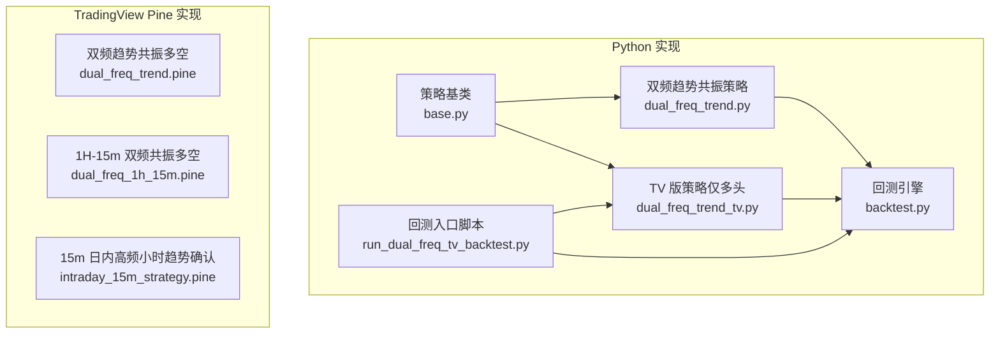
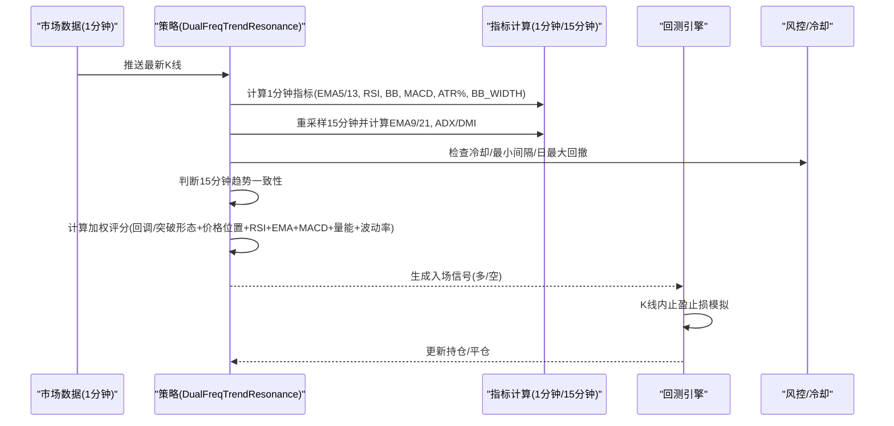
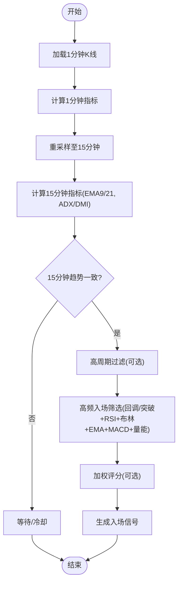
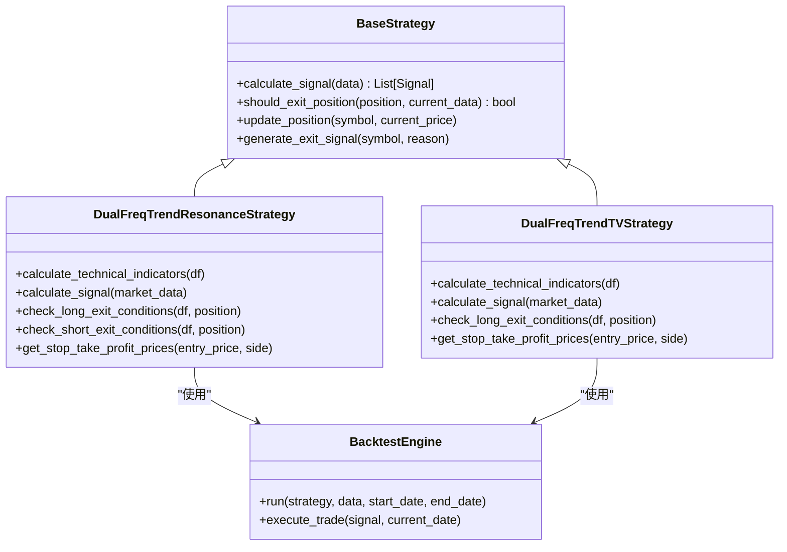

# 双频趋势共振策略

<cite>
**本文引用的文件**
- [dual_freq_trend.py](file://backpack_quant_trading/strategy/dual_freq_trend.py)
- [dual_freq_trend_tv.py](file://backpack_quant_trading/strategy/dual_freq_trend_tv.py)
- [dual_freq_trend.pine](file://tradingview_dual_freq/dual_freq_trend.pine)
- [dual_freq_1h_15m.pine](file://tradingview_dual_freq/dual_freq_1h_15m.pine)
- [intraday_15m_strategy.pine](file://tradingview_dual_freq/intraday_15m_strategy.pine)
- [run_dual_freq_tv_backtest.py](file://backpack_quant_trading/run_dual_freq_tv_backtest.py)
- [backtest.py](file://backpack_quant_trading/engine/backtest.py)
- [base.py](file://backpack_quant_trading/strategy/base.py)
</cite>

## 目录
1. [简介](#简介)
2. [项目结构](#项目结构)
3. [核心组件](#核心组件)
4. [架构总览](#架构总览)
5. [详细组件分析](#详细组件分析)
6. [依赖关系分析](#依赖关系分析)
7. [性能考量](#性能考量)
8. [故障排查指南](#故障排查指南)
9. [结论](#结论)
10. [附录](#附录)

## 简介
本文件为“双频趋势共振策略”的完整技术文档，面向量化交易工程师与策略研究者，系统阐述：
- 多时间框架分析方法：高频（1分钟）与低频（15分钟/1小时）K线数据的处理与融合逻辑
- 趋势识别算法：不同时间周期的趋势一致性判断与共振机制
- 信号生成逻辑：多周期趋势背离与一致性的识别规则
- 参数配置选项：时间周期、趋势阈值、风险管理与评分体系
- 适用市场环境与优缺点：震荡、趋势、强趋势、极端波动场景下的表现与限制
- TradingView 版本对比与迁移指南：TV Pine 与 Python 实现的差异与对齐要点

## 项目结构
本策略在仓库中包含三类实现与配套工具：
- Python 实现（回测与实盘适配）：策略主体、回测引擎、基础抽象
- TradingView Pine 实现：多版本策略脚本，便于可视化与参数调优
- 回测脚本：本地 CSV 回测入口，便于快速验证

图表来源
- [base.py:41-112](file://backpack_quant_trading/strategy/base.py#L41-L112)
- [dual_freq_trend.py:18-168](file://backpack_quant_trading/strategy/dual_freq_trend.py#L18-L168)
- [dual_freq_trend_tv.py:17-88](file://backpack_quant_trading/strategy/dual_freq_trend_tv.py#L17-L88)
- [backtest.py:48-187](file://backpack_quant_trading/engine/backtest.py#L48-L187)
- [run_dual_freq_tv_backtest.py:56-124](file://backpack_quant_trading/run_dual_freq_tv_backtest.py#L56-L124)
- [dual_freq_trend.pine:1-352](file://tradingview_dual_freq/dual_freq_trend.pine#L1-L352)
- [dual_freq_1h_15m.pine:1-213](file://tradingview_dual_freq/dual_freq_1h_15m.pine#L1-L213)
- [intraday_15m_strategy.pine:1-308](file://tradingview_dual_freq/intraday_15m_strategy.pine#L1-L308)

章节来源
- [base.py:1-212](file://backpack_quant_trading/strategy/base.py#L1-L212)
- [dual_freq_trend.py:1-931](file://backpack_quant_trading/strategy/dual_freq_trend.py#L1-L931)
- [dual_freq_trend_tv.py:1-360](file://backpack_quant_trading/strategy/dual_freq_trend_tv.py#L1-L360)
- [backtest.py:1-404](file://backpack_quant_trading/engine/backtest.py#L1-L404)
- [run_dual_freq_tv_backtest.py:1-125](file://backpack_quant_trading/run_dual_freq_tv_backtest.py#L1-L125)
- [dual_freq_trend.pine:1-352](file://tradingview_dual_freq/dual_freq_trend.pine#L1-L352)
- [dual_freq_1h_15m.pine:1-213](file://tradingview_dual_freq/dual_freq_1h_15m.pine#L1-L213)
- [intraday_15m_strategy.pine:1-308](file://tradingview_dual_freq/intraday_15m_strategy.pine#L1-L308)

## 核心组件
- 策略基类（BaseStrategy）：定义统一的信号、仓位、风控与性能接口，确保 Python 与 TV 实现的可对齐性
- 双频趋势共振策略（DualFreqTrendResonanceStrategy）：Python 实现，支持多空、评分分档、多种出场优化
- TV 版策略（DualFreqTrendTVStrategy）：Python 侧对齐 TradingView 的多头策略，便于回测与参数校准
- 回测引擎（BacktestEngine）：支持 K 线内止盈止损模拟、冷却期与风控约束
- 回测入口脚本：加载 CSV、构建策略与引擎，输出回测报告

章节来源
- [base.py:41-112](file://backpack_quant_trading/strategy/base.py#L41-L112)
- [dual_freq_trend.py:18-168](file://backpack_quant_trading/strategy/dual_freq_trend.py#L18-L168)
- [dual_freq_trend_tv.py:17-88](file://backpack_quant_trading/strategy/dual_freq_trend_tv.py#L17-L88)
- [backtest.py:48-187](file://backpack_quant_trading/engine/backtest.py#L48-L187)
- [run_dual_freq_tv_backtest.py:56-124](file://backpack_quant_trading/run_dual_freq_tv_backtest.py#L56-L124)

## 架构总览
策略采用“低频趋势确认 + 高频入场细化”的双频共振范式：
- 低频（15分钟/1小时）：趋势方向与强度过滤（EMA、ADX/DMI、高周期过滤）
- 高频（1分钟）：入场细化（回调/突破形态、RSI、布林、EMA、MACD、量能）

图表来源
- [dual_freq_trend.py:544-634](file://backpack_quant_trading/strategy/dual_freq_trend.py#L544-L634)
- [backtest.py:65-187](file://backpack_quant_trading/engine/backtest.py#L65-L187)

## 详细组件分析

### 多时间框架分析与融合
- 低频趋势（15分钟/1小时）：使用 EMA9/21 判断方向，结合 ADX/DMI 强度过滤与高周期（如 60 分钟）过滤，确保趋势稳定性
- 高频入场（1分钟）：在低频趋势一致前提下，利用回调/突破形态、RSI 斜率、布林位置、EMA 交叉、MACD 柱方向与量能进行精细筛选
- 趋势共振：低频趋势为“方向+强度”，高频形态为“时机+质量”，二者一致时才开仓

图表来源
- [dual_freq_trend.py:170-201](file://backpack_quant_trading/strategy/dual_freq_trend.py#L170-L201)
- [dual_freq_trend.py:428-449](file://backpack_quant_trading/strategy/dual_freq_trend.py#L428-L449)
- [dual_freq_trend.py:544-634](file://backpack_quant_trading/strategy/dual_freq_trend.py#L544-L634)

章节来源
- [dual_freq_trend.py:170-201](file://backpack_quant_trading/strategy/dual_freq_trend.py#L170-L201)
- [dual_freq_trend.py:428-449](file://backpack_quant_trading/strategy/dual_freq_trend.py#L428-L449)
- [dual_freq_trend.py:544-634](file://backpack_quant_trading/strategy/dual_freq_trend.py#L544-L634)

### 趋势识别算法
- 15分钟趋势：EMA9 与 EMA21 的相对关系与价格偏离度，支持严格与宽松两种模式
- ADX/DMI 强度过滤：排除弱趋势或震荡区间，降低误判概率
- 高周期过滤：在 15 分钟基础上叠加 60 分钟 EMA9/21，进一步稳定趋势方向

章节来源
- [dual_freq_trend.py:183-201](file://backpack_quant_trading/strategy/dual_freq_trend.py#L183-L201)
- [dual_freq_trend.py:203-226](file://backpack_quant_trading/strategy/dual_freq_trend.py#L203-L226)
- [dual_freq_trend.py:428-449](file://backpack_quant_trading/strategy/dual_freq_trend.py#L428-L449)

### 信号生成逻辑
- 回调入场（多/空）：价格靠近 EMA13 或布林中轨，RSI 反转向上/向下，量能缩量，区间位置不极端
- 突破入场（多/空）：价格突破布林上轨/下轨，金叉/死叉，RSI 强，量能放大
- 加权评分（可选）：趋势一致性、形态、价格位置、RSI、EMA、MACD、量能、波动率等维度加权，按阈值分档确定保证金

章节来源
- [dual_freq_trend.py:451-497](file://backpack_quant_trading/strategy/dual_freq_trend.py#L451-L497)
- [dual_freq_trend.py:498-543](file://backpack_quant_trading/strategy/dual_freq_trend.py#L498-L543)
- [dual_freq_trend.py:289-426](file://backpack_quant_trading/strategy/dual_freq_trend.py#L289-L426)

### 出场与风控
- 止盈止损：基于保证金收益百分比×杠杆换算为价格移动，K 线内模拟止盈止损
- 时间止损：按分钟数限制持仓时间
- 趋势反转平仓：15 分钟趋势反转且亏损时强制平仓
- 保本与分批止盈：盈利达到阈值后移动止损至成本价，或分批止盈
- 日内风控：单日最大回撤限制，基于账户余额近似权益

章节来源
- [dual_freq_trend.py:548-559](file://backpack_quant_trading/strategy/dual_freq_trend.py#L548-L559)
- [dual_freq_trend.py:561-634](file://backpack_quant_trading/strategy/dual_freq_trend.py#L561-L634)
- [dual_freq_trend.py:636-791](file://backpack_quant_trading/strategy/dual_freq_trend.py#L636-L791)

### 参数配置选项
- 时间周期与过滤
  - 低频周期：15 分钟（默认），可选 1 小时
  - 高周期过滤：60 分钟 EMA9/21（可选）
  - 回调/突破模式：开关控制
- 指标阈值
  - EMA 周期：9/21（低频）、5/13（高频）
  - RSI 周期与区间：6，多/空区间可调
  - 布林带周期与标准差：20/2.0
  - 波动率过滤：BB宽度、ATR% 上下限
- 风险管理
  - 杠杆、止盈/止损（保证金收益%）、时间止损（分钟）
  - 冷却期与最小入场间隔（K线数）
  - 日最大回撤（保证金收益%）
  - 评分分档保证金与最低评分阈值
- 出场优化
  - 保本移动止损、分批止盈、追踪回撤止盈

章节来源
- [dual_freq_trend.py:21-168](file://backpack_quant_trading/strategy/dual_freq_trend.py#L21-L168)
- [dual_freq_trend.pine:8-101](file://tradingview_dual_freq/dual_freq_trend.pine#L8-L101)
- [dual_freq_1h_15m.pine:9-57](file://tradingview_dual_freq/dual_freq_1h_15m.pine#L9-L57)

### 与 TradingView 的对齐与差异
- 对齐点
  - 时间周期与指标：EMA、RSI、布林、MACD、ATR%
  - 趋势判断：EMA9/21、ADXR（近似 ADX/DMI）
  - 风控：止盈/止损按保证金收益%×杠杆换算、时间止损、日最大回撤
  - 评分与分档：加权评分、分档保证金
- 差异点
  - Python 实现支持多空双向与更丰富的评分/分档逻辑
  - TV Pine 版本参数更丰富，过滤项更多（如高周期 RSI、极端波动过滤等）
  - 回测入口脚本与引擎在 Python 侧提供更完整的风控与回测流程

章节来源
- [dual_freq_trend.py:18-168](file://backpack_quant_trading/strategy/dual_freq_trend.py#L18-L168)
- [dual_freq_trend.pine:1-352](file://tradingview_dual_freq/dual_freq_trend.pine#L1-L352)
- [dual_freq_1h_15m.pine:1-213](file://tradingview_dual_freq/dual_freq_1h_15m.pine#L1-L213)

### 回测与迁移指南
- 回测入口脚本
  - 支持从 CSV 加载 1 分钟 K 线，指定起止时间，调用回测引擎
  - 输出交易明细与回测报告
- 迁移步骤
  - 在 TradingView 中调参并导出参数
  - 在 Python 策略中设置相同参数（杠杆、TP/SL、评分阈值等）
  - 使用回测入口脚本加载历史数据进行验证
  - 对照回测报告与 TV 回测结果，微调参数

章节来源
- [run_dual_freq_tv_backtest.py:56-124](file://backpack_quant_trading/run_dual_freq_tv_backtest.py#L56-L124)
- [backtest.py:65-187](file://backpack_quant_trading/engine/backtest.py#L65-L187)

## 依赖关系分析
策略与引擎之间的耦合与职责划分如下：
- 策略负责信号生成与风控决策
- 回测引擎负责数据驱动、K 线内止盈止损模拟、冷却期与风控约束
- 基类提供统一接口，确保 Python 与 TV 实现的一致性

图表来源
- [base.py:41-112](file://backpack_quant_trading/strategy/base.py#L41-L112)
- [dual_freq_trend.py:544-634](file://backpack_quant_trading/strategy/dual_freq_trend.py#L544-L634)
- [dual_freq_trend_tv.py:103-204](file://backpack_quant_trading/strategy/dual_freq_trend_tv.py#L103-L204)
- [backtest.py:48-187](file://backpack_quant_trading/engine/backtest.py#L48-L187)

章节来源
- [base.py:41-112](file://backpack_quant_trading/strategy/base.py#L41-L112)
- [dual_freq_trend.py:544-634](file://backpack_quant_trading/strategy/dual_freq_trend.py#L544-L634)
- [dual_freq_trend_tv.py:103-204](file://backpack_quant_trading/strategy/dual_freq_trend_tv.py#L103-L204)
- [backtest.py:48-187](file://backpack_quant_trading/engine/backtest.py#L48-L187)

## 性能考量
- 计算复杂度
  - 指标计算主要集中在 Pandas/Numpy 向量化运算，时间复杂度与数据长度线性相关
  - 重采样与多周期指标计算在高频数据下可能成为瓶颈，建议使用缓存与增量更新
- 回测效率
  - 回测引擎按时间推进，逐条 K 线评估，预热期跳过前 100 根以避免指标漂移
  - K 线内止盈止损模拟通过 high/low 判断，避免不必要的技术指标重复计算
- 参数敏感性
  - EMA 周期、RSI 区间、BB 宽度、ATR% 过滤对信号频率与胜率影响显著
  - 评分分档与最低阈值直接影响开仓频率与资金利用率

[本节为通用性能讨论，无需特定文件引用]

## 故障排查指南
- 常见问题
  - 指标列缺失：确保在计算技术指标后再进行趋势与入场判断
  - 数据长度不足：策略要求至少 120 根 1 分钟 K 线，否则跳过
  - 冷却期与最小间隔：避免频繁开仓，检查 last_exit_time 与 last_entry_time
  - 日最大回撤限制：当账户余额低于阈值时禁止开仓
- 回测报告核对
  - 对照回测入口脚本输出的交易明细，检查入场/出场原因与止盈止损触发
  - 关注 K 线内止盈止损模拟是否与预期一致

章节来源
- [dual_freq_trend.py:636-791](file://backpack_quant_trading/strategy/dual_freq_trend.py#L636-L791)
- [backtest.py:100-187](file://backpack_quant_trading/engine/backtest.py#L100-L187)
- [run_dual_freq_tv_backtest.py:108-120](file://backpack_quant_trading/run_dual_freq_tv_backtest.py#L108-L120)

## 结论
双频趋势共振策略通过“低频趋势确认 + 高频入场细化”的范式，在多空市场环境下具备较好的稳定性与适应性。其关键优势在于：
- 趋势一致性过滤有效降低逆势开仓概率
- 高频形态与多因子评分提升入场质量
- 完善的风险控制与回测流程保障策略稳健性

局限性包括：
- 对极端波动与跳空缺口的适应性有限
- 参数对市场环境敏感，需持续优化与监控
- 回测与实盘存在滑点与手续费差异，需在风控中考虑

[本节为总结性内容，无需特定文件引用]

## 附录

### 参数对照表（Python 与 TV）
- 时间周期
  - 低频趋势周期：15 分钟（默认），可选 60 分钟
  - 高周期过滤：60 分钟 EMA9/21（可选）
- 指标阈值
  - EMA：9/21（低频）、5/13（高频）
  - RSI：6，多/空区间可调
  - 布林：周期 20，标准差 2.0
  - 波动率：BB 宽度≥某阈值，ATR% 在上下限之间
- 风控
  - 杠杆、止盈/止损（保证金收益%×杠杆）、时间止损（分钟）
  - 冷却期与最小间隔（K线数）、日最大回撤（保证金收益%）
  - 评分分档保证金与最低评分阈值

章节来源
- [dual_freq_trend.py:21-168](file://backpack_quant_trading/strategy/dual_freq_trend.py#L21-L168)
- [dual_freq_trend.pine:8-101](file://tradingview_dual_freq/dual_freq_trend.pine#L8-L101)
- [dual_freq_1h_15m.pine:9-57](file://tradingview_dual_freq/dual_freq_1h_15m.pine#L9-L57)