# 均值回归策略

<cite>
**本文档引用的文件**
- [mean_reversion.py](file://backpack_quant_trading/strategy/mean_reversion.py)
- [base.py](file://backpack_quant_trading/strategy/base.py)
- [logger.py](file://backpack_quant_trading/utils/logger.py)
- [risk_manager.py](file://backpack_quant_trading/core/risk_manager.py)
- [settings.py](file://backpack_quant_trading/config/settings.py)
- [api_client.py](file://backpack_quant_trading/core/api_client.py)
- [live_trading.py](file://backpack_quant_trading/engine/live_trading.py)
- [backtest.py](file://backpack_quant_trading/engine/backtest.py)
- [main.py](file://backpack_quant_trading/api/main.py)
</cite>

## 目录
1. [引言](#引言)
2. [项目结构](#项目结构)
3. [核心组件](#核心组件)
4. [架构概览](#架构概览)
5. [详细组件分析](#详细组件分析)
6. [依赖关系分析](#依赖关系分析)
7. [性能考虑](#性能考虑)
8. [故障排除指南](#故障排除指南)
9. [结论](#结论)
10. [附录](#附录)

## 引言

均值回归策略是一种基于统计学原理的量化交易策略，其核心假设是价格偏离其长期均值后会回归到均值水平。该策略通过计算价格的移动平均线和标准差来识别超买和超卖条件，当价格偏离均值达到预设阈值时产生交易信号。

在本项目中，均值回归策略被设计为一个完整的量化交易解决方案，集成了实时数据获取、技术指标计算、信号生成、风险管理和执行监控等功能。策略的核心优势在于其简单直观的理论基础和相对稳定的性能表现。

## 项目结构

该项目采用模块化架构设计，主要分为以下几个层次：

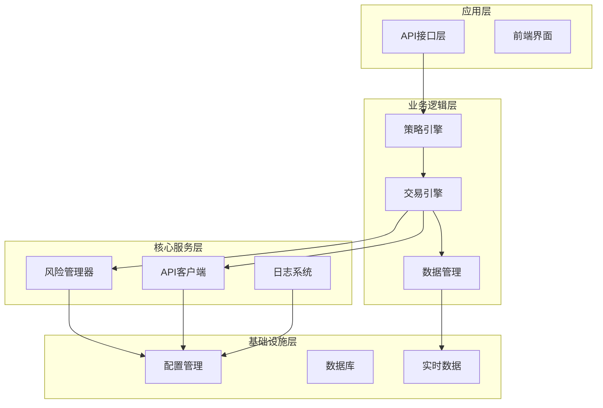

**图表来源**
- [main.py:14-53](file://backpack_quant_trading/api/main.py#L14-L53)
- [api_client.py:87-146](file://backpack_quant_trading/core/api_client.py#L87-L146)

**章节来源**
- [main.py:14-53](file://backpack_quant_trading/api/main.py#L14-L53)
- [settings.py:104-132](file://backpack_quant_trading/config/settings.py#L104-L132)

## 核心组件

### 均值回归策略主类

均值回归策略的核心实现位于 `MeanReversionStrategy` 类中，该类继承自 `BaseStrategy` 基类，提供了完整的策略生命周期管理。

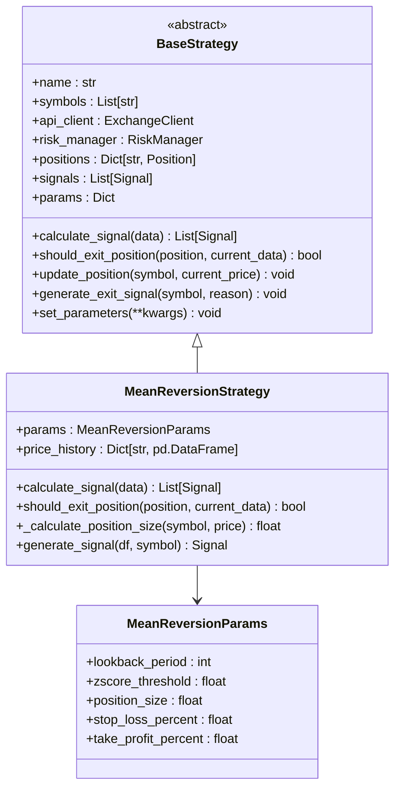

**图表来源**
- [base.py:41-91](file://backpack_quant_trading/strategy/base.py#L41-L91)
- [mean_reversion.py:23-30](file://backpack_quant_trading/strategy/mean_reversion.py#L23-L30)

### 技术指标计算

策略的核心技术指标计算包括移动平均线和标准差的计算，以及Z-Score的标准化过程。

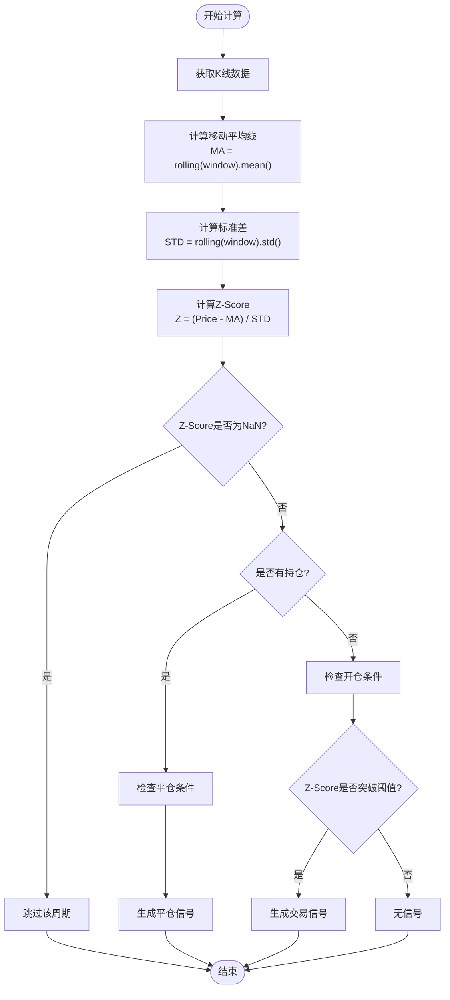

**图表来源**
- [mean_reversion.py:42-58](file://backpack_quant_trading/strategy/mean_reversion.py#L42-L58)

**章节来源**
- [mean_reversion.py:31-117](file://backpack_quant_trading/strategy/mean_reversion.py#L31-L117)

## 架构概览

### 策略执行流程

均值回归策略的完整执行流程包括数据获取、技术分析、信号生成和风险管理等环节：

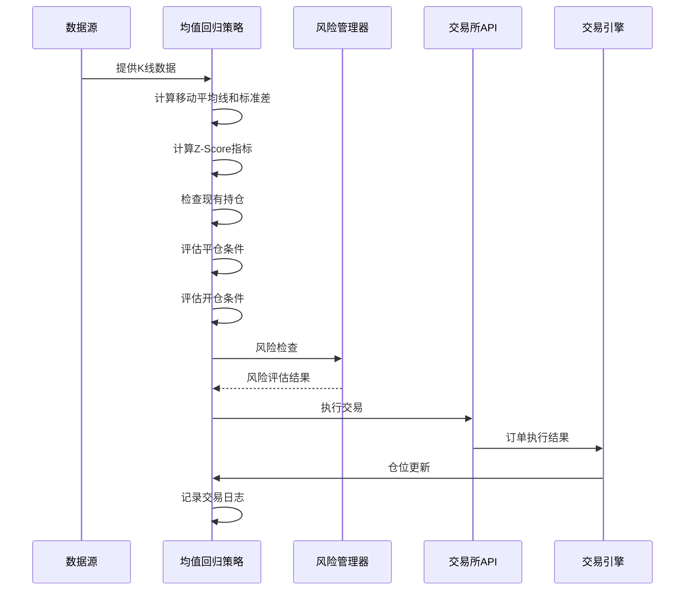

**图表来源**
- [mean_reversion.py:31-117](file://backpack_quant_trading/strategy/mean_reversion.py#L31-L117)
- [risk_manager.py:87-131](file://backpack_quant_trading/core/risk_manager.py#L87-L131)

### 实时监控架构

策略采用实时监控架构，通过WebSocket连接获取实时市场数据：

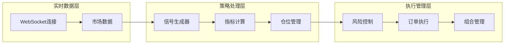

**图表来源**
- [live_trading.py:536-567](file://backpack_quant_trading/engine/live_trading.py#L536-L567)

**章节来源**
- [live_trading.py:347-567](file://backpack_quant_trading/engine/live_trading.py#L347-L567)

## 详细组件分析

### 参数配置系统

均值回归策略采用参数化设计，支持灵活的参数调整和优化：

#### 策略参数定义

| 参数名称 | 类型 | 默认值 | 描述 | 影响范围 |
|---------|------|--------|------|----------|
| lookback_period | int | 5 | 回看周期长度 | 技术指标计算精度 |
| zscore_threshold | float | 1.0 | Z-Score阈值 | 信号生成敏感度 |
| position_size | float | 0.03 | 仓位大小比例 | 风险暴露程度 |
| stop_loss_percent | float | 0.02 | 止损百分比 | 风险控制强度 |
| take_profit_percent | float | 0.03 | 止盈百分比 | 收益保护水平 |

#### 参数优化策略

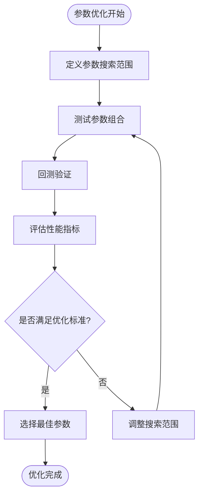

**图表来源**
- [mean_reversion.py:14-21](file://backpack_quant_trading/strategy/mean_reversion.py#L14-L21)

**章节来源**
- [mean_reversion.py:13-28](file://backpack_quant_trading/strategy/mean_reversion.py#L13-L28)

### 信号生成机制

策略的信号生成基于严格的数学公式和风险管理原则：

#### 买入信号生成逻辑

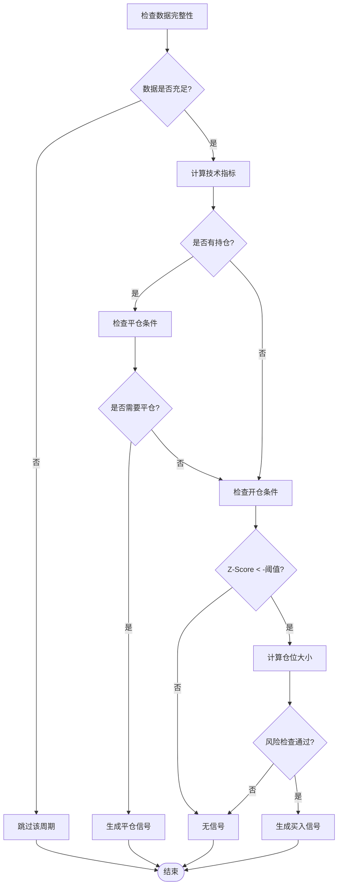

**图表来源**
- [mean_reversion.py:73-93](file://backpack_quant_trading/strategy/mean_reversion.py#L73-L93)

#### 卖出信号生成逻辑

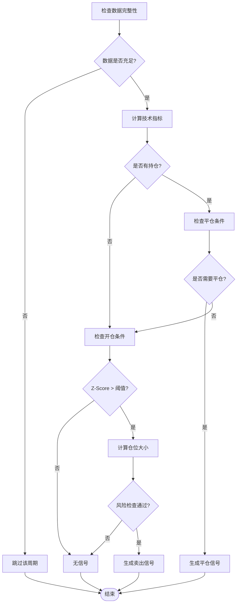

**图表来源**
- [mean_reversion.py:94-114](file://backpack_quant_trading/strategy/mean_reversion.py#L94-L114)

**章节来源**
- [mean_reversion.py:70-116](file://backpack_quant_trading/strategy/mean_reversion.py#L70-L116)

### 仓位计算方法

策略采用动态仓位管理系统，综合考虑账户余额、风险限额和最小交易单位：

#### 仓位计算流程

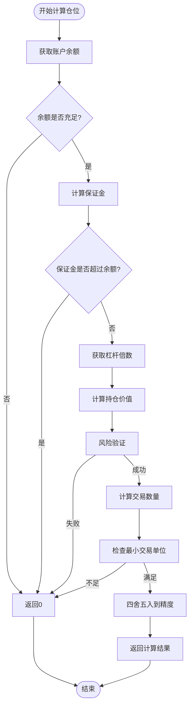

**图表来源**
- [mean_reversion.py:151-246](file://backpack_quant_trading/strategy/mean_reversion.py#L151-L246)

#### 动态余额获取机制

策略支持两种余额获取模式：

1. **实盘模式**：通过API客户端动态获取实时账户余额
2. **回测模式**：使用固定基准余额进行模拟交易

**章节来源**
- [mean_reversion.py:151-246](file://backpack_quant_trading/strategy/mean_reversion.py#L151-L246)

### 风险管理机制

策略集成多层次的风险控制机制，确保交易安全和资金保护：

#### 风险检查流程

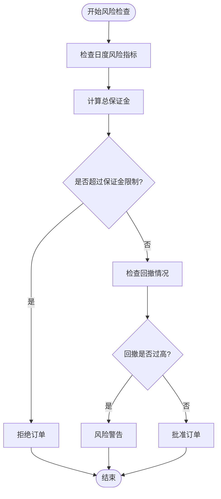

**图表来源**
- [risk_manager.py:87-131](file://backpack_quant_trading/core/risk_manager.py#L87-L131)

#### 止损止盈机制

策略采用双重止损止盈保护：

1. **技术指标止损**：基于Z-Score回归到均值时平仓
2. **固定比例止损**：基于预设百分比的止损和止盈

**章节来源**
- [mean_reversion.py:119-149](file://backpack_quant_trading/strategy/mean_reversion.py#L119-L149)
- [risk_manager.py:132-229](file://backpack_quant_trading/core/risk_manager.py#L132-L229)

## 依赖关系分析

### 核心依赖关系

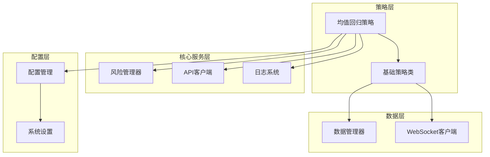

**图表来源**
- [mean_reversion.py:26-28](file://backpack_quant_trading/strategy/mean_reversion.py#L26-L28)
- [base.py:46-63](file://backpack_quant_trading/strategy/base.py#L46-L63)

### 外部依赖分析

策略对外部系统的依赖主要包括：

1. **交易所API**：获取实时市场数据和执行交易
2. **WebSocket服务**：实时数据推送和订阅管理
3. **数据库系统**：交易记录和回测数据存储
4. **配置管理**：运行时参数和环境配置

**章节来源**
- [api_client.py:87-146](file://backpack_quant_trading/core/api_client.py#L87-L146)
- [settings.py:104-132](file://backpack_quant_trading/config/settings.py#L104-L132)

## 性能考虑

### 计算效率优化

策略在设计时充分考虑了计算效率和资源利用：

1. **向量化计算**：使用pandas的向量化操作提高计算速度
2. **内存管理**：合理管理数据结构，避免内存泄漏
3. **缓存机制**：对常用数据进行缓存，减少重复计算

### 实时性能监控

系统提供实时性能监控功能：

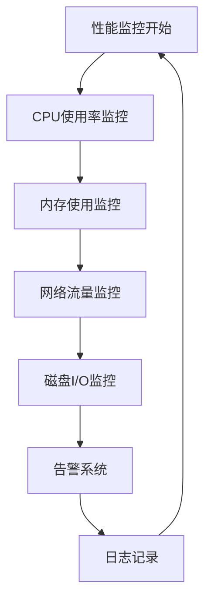

## 故障排除指南

### 常见问题诊断

#### 数据获取问题

**症状**：策略无法获取市场数据
**可能原因**：
1. WebSocket连接中断
2. API密钥配置错误
3. 网络连接不稳定

**解决方法**：
1. 检查网络连接状态
2. 验证API密钥配置
3. 重启WebSocket连接

#### 信号生成异常

**症状**：策略频繁生成无效信号
**可能原因**：
1. 参数设置不当
2. 数据质量差
3. 市场条件不适合

**解决方法**：
1. 调整Z-Score阈值
2. 检查数据完整性
3. 评估市场环境

#### 风险控制触发

**症状**：订单频繁被拒绝
**可能原因**：
1. 保证金不足
2. 风险限额超限
3. 市场波动过大

**解决方法**：
1. 增加账户余额
2. 调整风险参数
3. 降低仓位规模

**章节来源**
- [logger.py:137-180](file://backpack_quant_trading/utils/logger.py#L137-L180)

## 结论

均值回归策略作为一种经典的技术分析方法，在本项目中得到了完整的实现和优化。策略具有以下特点：

1. **理论基础扎实**：基于统计学原理，逻辑清晰
2. **实现完整**：包含数据获取、信号生成、风险管理等完整功能
3. **可配置性强**：支持灵活的参数调整和优化
4. **安全性高**：多重风险控制机制保障交易安全

策略适用于震荡市场环境，在价格波动适中的情况下能够获得稳定的收益。通过合理的参数配置和风险管理，可以在控制风险的前提下实现持续的正收益。

## 附录

### 参数优化建议

1. **回看周期**：建议在5-20个周期之间调整，根据市场波动性选择
2. **Z-Score阈值**：建议在0.5-2.0之间调整，平衡信号频率和准确性
3. **仓位大小**：建议不超过账户总资金的5%，根据风险承受能力调整
4. **止损止盈**：建议止损幅度小于止盈幅度，提高胜率

### 适用场景分析

**适合的市场环境**：
- 价格在一定区间内震荡
- 市场波动性适中
- 交易品种流动性良好

**不适合的市场环境**：
- 趋势明显的单边市场
- 高波动性的极端市场
- 流动性不足的交易品种

### 实际交易案例

由于涉及具体交易数据，本项目提供了回测功能来验证策略效果。用户可以通过回测引擎运行历史数据，评估策略在不同市场环境下的表现。