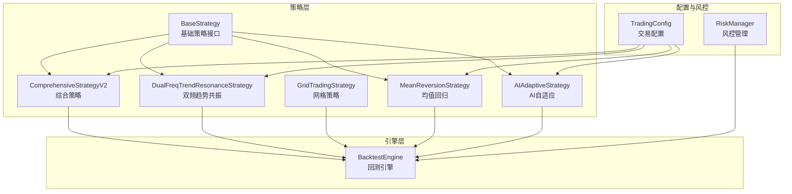
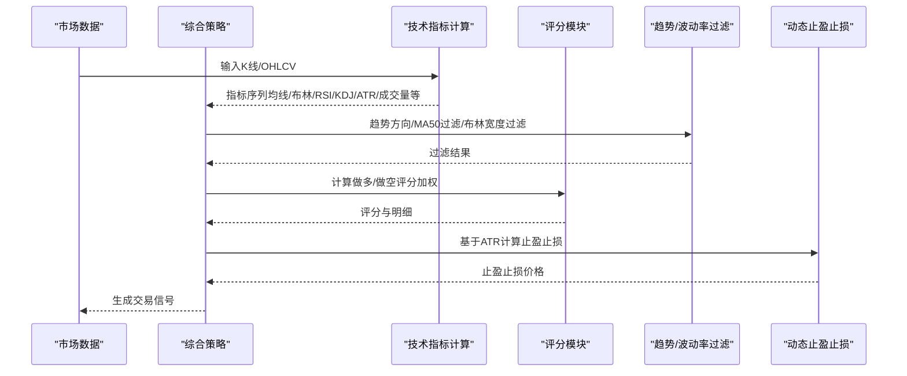
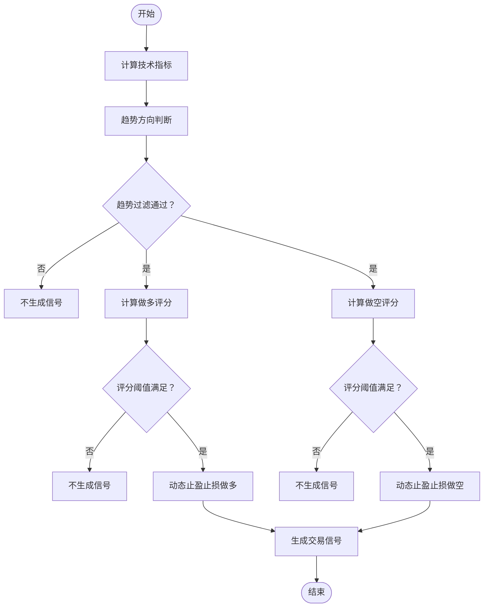
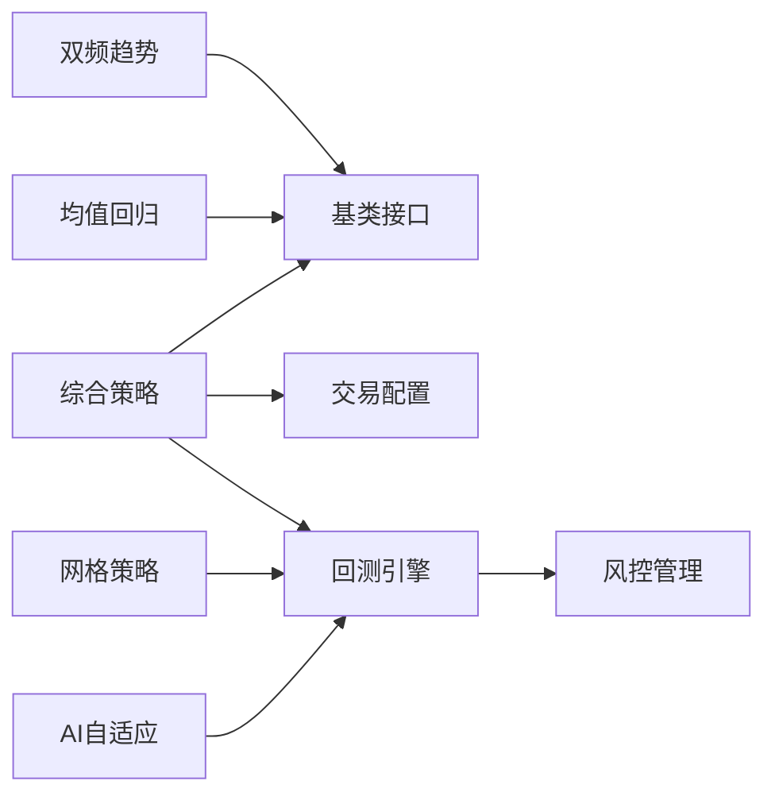

# 综合策略

<cite>
**本文引用的文件**
- [comprehensive.py](file://backpack_quant_trading/strategy/comprehensive.py)
- [base.py](file://backpack_quant_trading/strategy/base.py)
- [dual_freq_trend.py](file://backpack_quant_trading/strategy/dual_freq_trend.py)
- [grid_strategy.py](file://backpack_quant_trading/strategy/grid_strategy.py)
- [mean_reversion.py](file://backpack_quant_trading/strategy/mean_reversion.py)
- [ai_adaptive.py](file://backpack_quant_trading/strategy/ai_adaptive.py)
- [settings.py](file://backpack_quant_trading/config/settings.py)
- [backtest.py](file://backpack_quant_trading/engine/backtest.py)
- [risk_manager.py](file://backpack_quant_trading/core/risk_manager.py)
</cite>

## 目录
1. [引言](#引言)
2. [项目结构](#项目结构)
3. [核心组件](#核心组件)
4. [架构总览](#架构总览)
5. [详细组件分析](#详细组件分析)
6. [依赖分析](#依赖分析)
7. [性能考虑](#性能考虑)
8. [故障排查指南](#故障排查指南)
9. [结论](#结论)
10. [附录](#附录)

## 引言
本文件面向“综合策略”的技术文档，系统阐述多因子融合策略的设计理念、实现架构与工程落地细节。策略以多技术指标与交易信号的综合评估为核心，构建评分体系与权重分配机制，形成稳健的决策树逻辑，并配套动态止盈止损、趋势与波动率过滤、强趋势过滤等风控手段。策略支持与网格、均值回归、双频趋势共振、AI自适应等其他策略组合协同，实现跨周期共振与风险分散。

## 项目结构
- 策略层位于 strategy 目录，包含基础策略基类与多种具体策略实现。
- 引擎层位于 engine 目录，提供回测引擎与实盘交易引擎的基础设施。
- 配置层位于 config 目录，集中管理交易与风控参数。
- 风控层位于 core 目录，提供风险度量与压力测试能力。
- 前端与API路由负责策略展示与数据接口。

图表来源
- [base.py:41-212](file://backpack_quant_trading/strategy/base.py#L41-L212)
- [comprehensive.py:17-91](file://backpack_quant_trading/strategy/comprehensive.py#L17-L91)
- [dual_freq_trend.py:18-168](file://backpack_quant_trading/strategy/dual_freq_trend.py#L18-L168)
- [grid_strategy.py:38-156](file://backpack_quant_trading/strategy/grid_strategy.py#L38-L156)
- [mean_reversion.py:23-117](file://backpack_quant_trading/strategy/mean_reversion.py#L23-L117)
- [ai_adaptive.py:12-55](file://backpack_quant_trading/strategy/ai_adaptive.py#L12-L55)
- [backtest.py:48-187](file://backpack_quant_trading/engine/backtest.py#L48-L187)
- [settings.py:55-64](file://backpack_quant_trading/config/settings.py#L55-L64)
- [risk_manager.py:48-58](file://backpack_quant_trading/core/risk_manager.py#L48-L58)

章节来源
- [base.py:41-212](file://backpack_quant_trading/strategy/base.py#L41-L212)
- [comprehensive.py:17-91](file://backpack_quant_trading/strategy/comprehensive.py#L17-L91)
- [dual_freq_trend.py:18-168](file://backpack_quant_trading/strategy/dual_freq_trend.py#L18-L168)
- [grid_strategy.py:38-156](file://backpack_quant_trading/strategy/grid_strategy.py#L38-L156)
- [mean_reversion.py:23-117](file://backpack_quant_trading/strategy/mean_reversion.py#L23-L117)
- [ai_adaptive.py:12-55](file://backpack_quant_trading/strategy/ai_adaptive.py#L12-L55)
- [backtest.py:48-187](file://backpack_quant_trading/engine/backtest.py#L48-L187)
- [settings.py:55-64](file://backpack_quant_trading/config/settings.py#L55-L64)
- [risk_manager.py:48-58](file://backpack_quant_trading/core/risk_manager.py#L48-L58)

## 核心组件
- 综合策略（ComprehensiveStrategyV2）：多因子融合评分系统，包含趋势方向判断、价格位置、RSI、K线形态、成交量、KDJ、OBV、均线交叉、MACD、共振检测等指标，采用加权评分与阈值过滤，动态止盈止损与波动率过滤。
- 基类（BaseStrategy）：定义统一的信号生成、平仓判断、仓位更新与性能指标接口，保证策略一致性。
- 双频趋势共振（DualFreqTrendResonanceStrategy）：高频共振策略，15分钟趋势+1分钟入场，加权评分分挡位保证金，具备严格的趋势过滤与时间止损。
- 网格策略（GridTradingStrategy）：合约网格，自动在价格区间内高抛低吸，支持双向/单向网格，具备冷却与风控保护。
- 均值回归（MeanReversionStrategy）：基于Z-score的均值回归策略，提供简单稳健的反向交易信号。
- AI自适应（AIAdaptiveStrategy）：基于本地指标预筛选与AI分析的日内交易策略，具备成本优化与深度/快速分析模式。
- 回测引擎（BacktestEngine）：支持多空双向持仓、止盈止损模拟、滑点与手续费建模、指标预热期与冷却期。
- 风控管理（RiskManager）：提供VaR、压力测试与风险评分，支持日度与回撤限制。

章节来源
- [comprehensive.py:17-91](file://backpack_quant_trading/strategy/comprehensive.py#L17-L91)
- [base.py:41-212](file://backpack_quant_trading/strategy/base.py#L41-L212)
- [dual_freq_trend.py:18-168](file://backpack_quant_trading/strategy/dual_freq_trend.py#L18-L168)
- [grid_strategy.py:38-156](file://backpack_quant_trading/strategy/grid_strategy.py#L38-L156)
- [mean_reversion.py:23-117](file://backpack_quant_trading/strategy/mean_reversion.py#L23-L117)
- [ai_adaptive.py:12-55](file://backpack_quant_trading/strategy/ai_adaptive.py#L12-L55)
- [backtest.py:48-187](file://backpack_quant_trading/engine/backtest.py#L48-L187)
- [risk_manager.py:48-58](file://backpack_quant_trading/core/risk_manager.py#L48-L58)

## 架构总览
综合策略在策略基类之上，通过技术指标计算与评分模块，形成“趋势过滤—多因子评分—阈值决策—动态止盈止损”的闭环。策略参数通过配置中心注入，风控模块贯穿回测与实盘。

图表来源
- [comprehensive.py:92-168](file://backpack_quant_trading/strategy/comprehensive.py#L92-L168)
- [comprehensive.py:170-222](file://backpack_quant_trading/strategy/comprehensive.py#L170-L222)
- [comprehensive.py:224-405](file://backpack_quant_trading/strategy/comprehensive.py#L224-L405)
- [comprehensive.py:782-801](file://backpack_quant_trading/strategy/comprehensive.py#L782-L801)

## 详细组件分析

### 综合策略（ComprehensiveStrategyV2）
- 设计理念
  - 多因子融合：涵盖趋势、价格位置、动量、成交量、超买超卖、形态、能量潮、均线与MACD等，形成全面的信号画像。
  - 加权评分：为不同因子赋予不同权重，提升信号质量与稳定性。
  - 动态风控：基于ATR的动态止盈止损，趋势与波动率过滤，强趋势过滤（MA50）。
  - 共振检测：多指标同向确认加分，提升信号可靠性。
- 关键流程
  - 技术指标计算：包含多周期均线、布林带宽度、RSI多周期、MACD、成交量比率、KDJ、ATR、OBV、动量、支撑阻力等。
  - 趋势方向判断：均线排列、价格相对布林中轨、动量方向综合打分。
  - 做多/做空评分：逐项计算价格支撑/阻力、RSI超买/超卖、K线反转形态、成交量确认/背离、KDJ、OBV、均线交叉、MACD、共振等，汇总加权评分并进行阈值过滤。
  - 动态止盈止损：优先使用ATR计算，若数据不足则使用默认百分比。
- 决策树逻辑
  - 趋势过滤：可选择仅顺势交易，震荡市不做多/空；强趋势过滤要求价格在MA50上方/下方。
  - 评分阈值：至少满足一定指标数量与加权评分阈值才开仓。
  - 共振加分：多指标同向确认提升评分。
- 动态调整机制
  - ATR倍数随波动率调整，高波动扩大止盈止损，低波动收敛，提升鲁棒性。
  - 波动率过滤（布林宽度）避免在横盘中频繁开仓。
  - 强趋势过滤（MA50）确保入场方向与主趋势一致。
- 与其他策略组合
  - 与双频趋势共振：两者均采用趋势过滤与加权评分，可在不同周期共振叠加。
  - 与网格策略：网格适合震荡区间，综合策略适合趋势行情，二者可按市场状态切换。
  - 与均值回归：反向思路互补，可按信号冲突与风控限制进行组合。
  - 与AI自适应：AI侧重快速判断与深度分析，综合策略强调多因子稳健评分，可作为AI信号的风控与参数补充。

图表来源
- [comprehensive.py:92-168](file://backpack_quant_trading/strategy/comprehensive.py#L92-L168)
- [comprehensive.py:170-222](file://backpack_quant_trading/strategy/comprehensive.py#L170-L222)
- [comprehensive.py:224-405](file://backpack_quant_trading/strategy/comprehensive.py#L224-L405)
- [comprehensive.py:782-801](file://backpack_quant_trading/strategy/comprehensive.py#L782-L801)

章节来源
- [comprehensive.py:17-91](file://backpack_quant_trading/strategy/comprehensive.py#L17-L91)
- [comprehensive.py:92-168](file://backpack_quant_trading/strategy/comprehensive.py#L92-L168)
- [comprehensive.py:170-222](file://backpack_quant_trading/strategy/comprehensive.py#L170-L222)
- [comprehensive.py:224-405](file://backpack_quant_trading/strategy/comprehensive.py#L224-L405)
- [comprehensive.py:782-801](file://backpack_quant_trading/strategy/comprehensive.py#L782-L801)

### 基类（BaseStrategy）
- 角色定位：定义策略接口与通用能力，包括信号生成、平仓判断、仓位更新、性能指标与参数管理。
- 作用：保证各策略实现的一致性与可扩展性，便于接入回测与实盘。

章节来源
- [base.py:41-212](file://backpack_quant_trading/strategy/base.py#L41-L212)

### 双频趋势共振（DualFreqTrendResonanceStrategy）
- 特点：15分钟趋势+1分钟入场，加权评分分挡位保证金，具备严格的趋势过滤与时间止损。
- 适用场景：高频趋势行情，追求高胜率与风险回报比。
- 与综合策略的关系：两者均强调趋势过滤与评分，可按周期与信号强度进行协同。

章节来源
- [dual_freq_trend.py:18-168](file://backpack_quant_trading/strategy/dual_freq_trend.py#L18-L168)
- [dual_freq_trend.py:289-426](file://backpack_quant_trading/strategy/dual_freq_trend.py#L289-L426)
- [dual_freq_trend.py:428-634](file://backpack_quant_trading/strategy/dual_freq_trend.py#L428-L634)

### 网格策略（GridTradingStrategy）
- 特点：合约网格，自动在价格区间内高抛低吸，支持双向/单向网格，具备冷却与风控保护。
- 适用场景：震荡区间，追求稳定高频交易。
- 与综合策略的关系：综合策略偏向趋势，网格策略偏向区间，二者可按市场状态切换。

章节来源
- [grid_strategy.py:38-156](file://backpack_quant_trading/strategy/grid_strategy.py#L38-L156)
- [grid_strategy.py:599-754](file://backpack_quant_trading/strategy/grid_strategy.py#L599-L754)

### 均值回归（MeanReversionStrategy）
- 特点：基于Z-score的均值回归策略，提供简单稳健的反向交易信号。
- 适用场景：震荡行情，反向交易。
- 与综合策略的关系：信号方向相反，可按信号冲突与风控限制进行组合。

章节来源
- [mean_reversion.py:23-117](file://backpack_quant_trading/strategy/mean_reversion.py#L23-L117)

### AI自适应（AIAdaptiveStrategy）
- 特点：本地指标预筛选+AI分析，成本优化显著，支持深度/快速分析模式。
- 适用场景：日内交易，追求高胜率与快速响应。
- 与综合策略的关系：AI侧重快速判断，综合策略强调稳健评分，可互补。

章节来源
- [ai_adaptive.py:12-55](file://backpack_quant_trading/strategy/ai_adaptive.py#L12-L55)
- [ai_adaptive.py:266-670](file://backpack_quant_trading/strategy/ai_adaptive.py#L266-L670)

### 回测引擎（BacktestEngine）
- 特点：支持多空双向持仓、止盈止损模拟、滑点与手续费建模、指标预热期与冷却期。
- 作用：为策略提供统一的性能评估框架，便于参数优化与策略对比。

章节来源
- [backtest.py:48-187](file://backpack_quant_trading/engine/backtest.py#L48-L187)
- [backtest.py:333-383](file://backpack_quant_trading/engine/backtest.py#L333-L383)

### 风控管理（RiskManager）
- 特点：提供VaR、压力测试与风险评分，支持日度与回撤限制。
- 作用：贯穿回测与实盘，保障策略在风险边界内运行。

章节来源
- [risk_manager.py:48-58](file://backpack_quant_trading/core/risk_manager.py#L48-L58)
- [risk_manager.py:507-542](file://backpack_quant_trading/core/risk_manager.py#L507-L542)

## 依赖分析
- 组件耦合
  - 综合策略依赖技术指标计算与评分模块，耦合度中等，职责清晰。
  - 基类提供统一接口，降低策略间差异带来的耦合。
  - 回测引擎与策略解耦，通过接口交互，便于扩展。
- 外部依赖
  - 配置中心（TradingConfig）集中注入参数，降低硬编码耦合。
  - 风控模块独立于策略与引擎，提供通用风险度量能力。

图表来源
- [comprehensive.py:17-91](file://backpack_quant_trading/strategy/comprehensive.py#L17-L91)
- [base.py:41-212](file://backpack_quant_trading/strategy/base.py#L41-L212)
- [dual_freq_trend.py:18-168](file://backpack_quant_trading/strategy/dual_freq_trend.py#L18-L168)
- [grid_strategy.py:38-156](file://backpack_quant_trading/strategy/grid_strategy.py#L38-L156)
- [mean_reversion.py:23-117](file://backpack_quant_trading/strategy/mean_reversion.py#L23-L117)
- [ai_adaptive.py:12-55](file://backpack_quant_trading/strategy/ai_adaptive.py#L12-L55)
- [backtest.py:48-187](file://backpack_quant_trading/engine/backtest.py#L48-L187)
- [risk_manager.py:48-58](file://backpack_quant_trading/core/risk_manager.py#L48-L58)
- [settings.py:55-64](file://backpack_quant_trading/config/settings.py#L55-L64)

## 性能考虑
- 指标计算复杂度
  - 综合策略涉及多周期均线、布林带、RSI、MACD、KDJ、ATR、OBV等，计算量较大。建议在数据预处理阶段缓存关键指标，避免重复计算。
- 评分与阈值
  - 评分阈值与权重直接影响信号频率与质量。建议通过回测进行敏感性分析，确定最优阈值。
- 动态止盈止损
  - ATR计算依赖历史数据长度，数据不足时使用默认比例，确保策略在早期阶段也能运行。
- 回测效率
  - 回测引擎支持指标预热期与冷却期，减少无效交易，提升回测效率与结果稳定性。

## 故障排查指南
- 信号稀少
  - 检查趋势过滤与强趋势过滤参数，适当放宽阈值或关闭强趋势过滤以验证策略有效性。
- 误报与回撤过大
  - 检查波动率过滤（布林宽度）与动态止盈止损参数，适当提高ATR倍数或收紧止盈止损。
- 指标缺失
  - 确认数据长度满足指标计算要求（如RSI至少需要2倍周期的数据），必要时延长回测起始时间。
- 参数未生效
  - 确认参数通过配置中心注入，且策略支持参数覆盖逻辑。

章节来源
- [comprehensive.py:92-168](file://backpack_quant_trading/strategy/comprehensive.py#L92-L168)
- [comprehensive.py:170-222](file://backpack_quant_trading/strategy/comprehensive.py#L170-L222)
- [comprehensive.py:782-801](file://backpack_quant_trading/strategy/comprehensive.py#L782-L801)
- [backtest.py:82-86](file://backpack_quant_trading/engine/backtest.py#L82-L86)

## 结论
综合策略通过多因子融合与加权评分，构建稳健的趋势交易框架；结合动态止盈止损、趋势与波动率过滤、强趋势过滤，有效提升胜率与风险控制能力。策略可与网格、均值回归、双频趋势共振、AI自适应等策略协同，实现跨周期共振与风险分散。建议在实盘前通过回测引擎进行充分验证，并依据市场状态动态调整参数与风控策略。

## 附录

### 策略参数配置指南
- 基础参数
  - 初始资本与杠杆：用于资金与保证金估算。
  - 保证金分配：阶梯式保证金分配，依据评分等级分配不同保证金。
- 指标权重
  - 趋势、价格位置、RSI、K线形态、成交量、KDJ、OBV、均线交叉、MACD等，权重可根据回测结果微调。
- 阈值与过滤
  - 最低评分阈值、趋势过滤开关、强趋势过滤（MA50）、布林宽度过滤等。
- 止盈止损
  - ATR倍数与默认百分比，建议根据波动率与回撤目标调整。
- 仓位管理
  - 单品种最大仓位比例、总保证金比例上限，避免过度集中。

章节来源
- [comprehensive.py:28-91](file://backpack_quant_trading/strategy/comprehensive.py#L28-L91)
- [comprehensive.py:46-57](file://backpack_quant_trading/strategy/comprehensive.py#L46-L57)
- [comprehensive.py:65-81](file://backpack_quant_trading/strategy/comprehensive.py#L65-L81)
- [comprehensive.py:782-801](file://backpack_quant_trading/strategy/comprehensive.py#L782-L801)

### 策略性能测试方法
- 回测指标
  - 总收益率、年化收益率、夏普比率、最大回撤、胜率、盈利因子、总交易次数、盈利/亏损交易数。
- 回测流程
  - 设置初始资金、滑点与手续费、指标预热期与冷却期，运行回测引擎，生成报告。
- 对比与优化
  - 与基准策略（如买入持有）对比，评估超额收益与风险调整收益；通过参数扫描与网格搜索优化权重与阈值。

章节来源
- [backtest.py:333-383](file://backpack_quant_trading/engine/backtest.py#L333-L383)
- [backtest.py:385-404](file://backpack_quant_trading/engine/backtest.py#L385-L404)