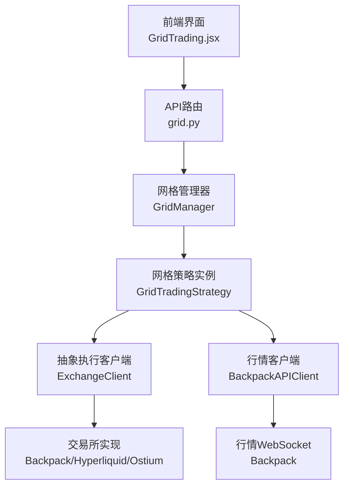
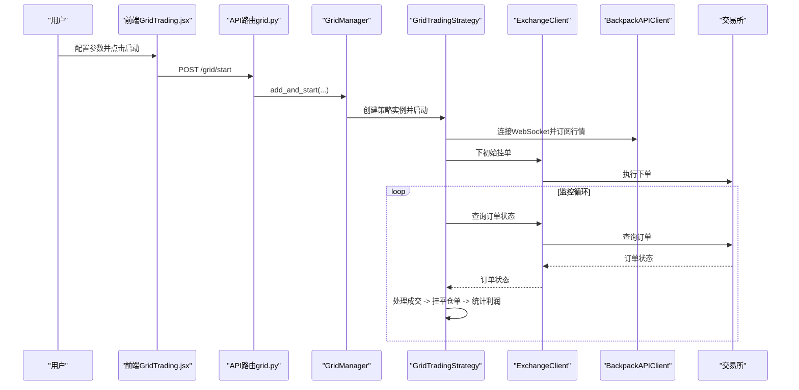
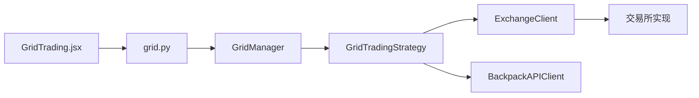

# 网格交易策略

<cite>
**本文引用的文件**
- [grid_strategy.py](file://backpack_quant_trading/strategy/grid_strategy.py)
- [grid.py](file://backpack_quant_trading/api/routers/grid.py)
- [GridTrading.jsx](file://backpack_quant_trading/frontend/src/views/GridTrading.jsx)
- [api_client.py](file://backpack_quant_trading/core/api_client.py)
- [risk_manager.py](file://backpack_quant_trading/core/risk_manager.py)
- [live_trading.py](file://backpack_quant_trading/engine/live_trading.py)
</cite>

## 目录
1. [简介](#简介)
2. [项目结构](#项目结构)
3. [核心组件](#核心组件)
4. [架构概览](#架构概览)
5. [详细组件分析](#详细组件分析)
6. [依赖分析](#依赖分析)
7. [性能考量](#性能考量)
8. [故障排查指南](#故障排查指南)
9. [结论](#结论)
10. [附录](#附录)

## 简介
本文件面向网格交易策略的技术文档，系统性阐述策略原理、数学模型、挂单管理、利润锁定与成本摊薄、风险管理、参数优化与实盘应用。策略基于价格区间内的高抛低吸，通过自动化挂单与平仓逻辑实现稳定收益，同时内置多平台适配与风控保护。

## 项目结构
网格交易策略位于 backpack_quant_trading 系统中，前端提供可视化配置与状态展示，后端通过 FastAPI 提供 API，策略核心在 Python 层实现，底层通过抽象客户端适配多家交易所。

图表来源
- [grid.py:101-137](file://backpack_quant_trading/api/routers/grid.py#L101-L137)
- [grid_strategy.py:1380-1440](file://backpack_quant_trading/strategy/grid_strategy.py#L1380-L1440)
- [GridTrading.jsx:24-134](file://backpack_quant_trading/frontend/src/views/GridTrading.jsx#L24-L134)
- [api_client.py:22-85](file://backpack_quant_trading/core/api_client.py#L22-L85)

章节来源
- [grid.py:101-137](file://backpack_quant_trading/api/routers/grid.py#L101-L137)
- [grid_strategy.py:1380-1440](file://backpack_quant_trading/strategy/grid_strategy.py#L1380-L1440)
- [GridTrading.jsx:24-134](file://backpack_quant_trading/frontend/src/views/GridTrading.jsx#L24-L134)
- [api_client.py:22-85](file://backpack_quant_trading/core/api_client.py#L22-L85)

## 核心组件
- 网格管理器（GridManager）：负责多实例生命周期管理、并发启动与停止。
- 网格策略（GridTradingStrategy）：核心逻辑，包括网格生成、挂单管理、平仓与利润统计。
- 抽象执行客户端（ExchangeClient）：统一下单、撤单、查询接口，屏蔽交易所差异。
- 行情客户端（BackpackAPIClient）：提供 WebSocket 实时行情与 REST API。
- 风险管理器（RiskManager）：提供通用风控能力（本策略中网格策略内置边界保护）。

章节来源
- [grid_strategy.py:1366-1508](file://backpack_quant_trading/strategy/grid_strategy.py#L1366-L1508)
- [grid_strategy.py:38-177](file://backpack_quant_trading/strategy/grid_strategy.py#L38-L177)
- [api_client.py:22-85](file://backpack_quant_trading/core/api_client.py#L22-L85)
- [risk_manager.py:48-229](file://backpack_quant_trading/core/risk_manager.py#L48-L229)

## 架构概览
策略采用“前端配置 -> API路由 -> 管理器 -> 策略实例 -> 交易所”的链路。策略实例通过 WebSocket 获取实时价格，驱动挂单与平仓流程；通过 REST API 查询订单状态与账户信息；通过抽象客户端适配不同交易所。

图表来源
- [GridTrading.jsx:88-111](file://backpack_quant_trading/frontend/src/views/GridTrading.jsx#L88-L111)
- [grid.py:101-137](file://backpack_quant_trading/api/routers/grid.py#L101-L137)
- [grid_strategy.py:1380-1440](file://backpack_quant_trading/strategy/grid_strategy.py#L1380-L1440)
- [grid_strategy.py:179-280](file://backpack_quant_trading/strategy/grid_strategy.py#L179-L280)
- [grid_strategy.py:532-597](file://backpack_quant_trading/strategy/grid_strategy.py#L532-L597)

## 详细组件分析

### 网格数学模型与参数
- 价格区间与网格间距
  - 价格范围：$ \text{range} = \text{price\_upper} - \text{price\_lower} $
  - 网格间距：$ \text{spacing} = \frac{\text{range}}{\text{grid\_count}} $
- 单格投资与杠杆
  - 单格投资：$ \text{investment\_per\_grid} $（USDT）
  - 杠杆：$ \text{leverage} $
  - 单格数量：$ \text{quantity} = \frac{\text{investment\_per\_grid} \times \text{leverage}}{\text{price}} $
- 收益估算
  - 单格绝对利润：$ \text{profit\_abs} = \text{investment\_per\_grid} \times \text{leverage} \times \frac{\text{spacing}}{\text{price\_lower}} \times 0.01 $
  - 单格收益率：$ \text{rate} = \text{spacing}/\text{price\_lower} \times \text{leverage} - \text{手续费率} \times \text{leverage} $

章节来源
- [grid_strategy.py:103-108](file://backpack_quant_trading/strategy/grid_strategy.py#L103-L108)
- [grid_strategy.py:170-175](file://backpack_quant_trading/strategy/grid_strategy.py#L170-L175)
- [GridTrading.jsx:49-71](file://backpack_quant_trading/frontend/src/views/GridTrading.jsx#L49-L71)

### 支撑位与阻力位设定逻辑
- 网格层级生成：在价格区间内均匀分布 N+1 个档位，形成支撑/阻力位序列。
- 方向判定：
  - 双向网格：当前价下方挂多单，上方挂空单。
  - 做多网格：区间内全部挂多单。
  - 做空网格：区间内全部挂空单。
- 价格精度与数量精度：根据交易所返回的精度对价格与数量进行四舍五入，避免下单失败。

章节来源
- [grid_strategy.py:157-177](file://backpack_quant_trading/strategy/grid_strategy.py#L157-L177)
- [grid_strategy.py:374-398](file://backpack_quant_trading/strategy/grid_strategy.py#L374-L398)
- [grid_strategy.py:188-210](file://backpack_quant_trading/strategy/grid_strategy.py#L188-L210)

### 挂单管理机制
- 初始挂单：根据网格层级与当前价，按方向挂出初始挂单。
- 挂单复用：在下单前查询未成交挂单，若同价位存在则复用，避免重复下单。
- 限价策略：为避免“可成交限价单”导致的即时成交，挂单价格必须与当前价方向相反。
- 429 限频保护：当触发 API 限频时，进入冷却期并延时下单。
- 挂单间隔：下单前加入微小延时，降低触发限频概率。

章节来源
- [grid_strategy.py:374-398](file://backpack_quant_trading/strategy/grid_strategy.py#L374-L398)
- [grid_strategy.py:400-498](file://backpack_quant_trading/strategy/grid_strategy.py#L400-L498)
- [grid_strategy.py:425-449](file://backpack_quant_trading/strategy/grid_strategy.py#L425-L449)
- [grid_strategy.py:545-549](file://backpack_quant_trading/strategy/grid_strategy.py#L545-L549)

### 平仓与利润锁定
- 平仓单策略：开仓成交后，在相邻档位挂限价平仓单（reduce-only），确保成交即补回同价位开仓挂单。
- 平仓后补单：平仓完成后，立即为该档位重新挂开仓单，维持网格完整性。
- 利润统计：记录已实现利润、累计交易次数、手续费、未实现盈亏等指标。

章节来源
- [grid_strategy.py:648-731](file://backpack_quant_trading/strategy/grid_strategy.py#L648-L731)
- [grid_strategy.py:755-800](file://backpack_quant_trading/strategy/grid_strategy.py#L755-L800)
- [grid_strategy.py:706-710](file://backpack_quant_trading/strategy/grid_strategy.py#L706-L710)

### 成本摊薄与资金分配
- 单格投资与杠杆：通过单格投资与杠杆组合控制每档风险敞口。
- 资金分配：总投资 = 单格投资 × 网格数量；实际持仓价值 = 总投资 × 杠杆。
- 精度适配：根据交易所精度对数量与价格进行取整，保证下单合规。

章节来源
- [grid_strategy.py:103-108](file://backpack_quant_trading/strategy/grid_strategy.py#L103-L108)
- [grid_strategy.py:170-175](file://backpack_quant_trading/strategy/grid_strategy.py#L170-L175)
- [grid_strategy.py:188-210](file://backpack_quant_trading/strategy/grid_strategy.py#L188-L210)

### 风险管理措施
- 边界保护参数
  - 总亏损阈值：超过一定比例触发停止。
  - 日内最大亏损：限制每日最大回撤。
  - 强平价估算：基于杠杆与均价估算强平价，辅助参数校验。
- 429 限频熔断：触发限频后进入冷却期，避免连续失败。
- 交易所风控：下单前检查最小下单金额等限制，避免被拒。

章节来源
- [grid_strategy.py:132-139](file://backpack_quant_trading/strategy/grid_strategy.py#L132-L139)
- [grid_strategy.py:403-410](file://backpack_quant_trading/strategy/grid_strategy.py#L403-L410)
- [grid_strategy.py:452-458](file://backpack_quant_trading/strategy/grid_strategy.py#L452-L458)
- [GridTrading.jsx:283-287](file://backpack_quant_trading/frontend/src/views/GridTrading.jsx#L283-L287)

### 参数优化指南
- 网格密度
  - 网格数量与间距成反比，密度越高交易越频繁，但需平衡手续费与滑点。
- 资金利用率
  - 单格投资与杠杆共同决定每档风险，建议结合波动率与滑点进行调优。
- 风险控制
  - 设置合理的总亏损阈值与日内最大亏损，避免极端行情下的大幅回撤。
- 强平价与杠杆
  - 强平价与杠杆呈反比，需在收益与风险间权衡。

章节来源
- [GridTrading.jsx:49-71](file://backpack_quant_trading/frontend/src/views/GridTrading.jsx#L49-L71)
- [GridTrading.jsx:240-290](file://backpack_quant_trading/frontend/src/views/GridTrading.jsx#L240-L290)

### 实际交易案例与表现评估
- 案例场景：在震荡区间内运行双向网格，观察单格利润、总交易次数与最大回撤。
- 表现评估：通过前端参数预览与运行状态卡片，查看当前价格、成交次数与实例状态；结合策略内部统计指标（累计利润、手续费、未实现盈亏）进行综合评估。

章节来源
- [GridTrading.jsx:293-331](file://backpack_quant_trading/frontend/src/views/GridTrading.jsx#L293-L331)
- [grid_strategy.py:123-129](file://backpack_quant_trading/strategy/grid_strategy.py#L123-L129)

## 依赖分析
- 前端依赖后端 API，后端依赖网格管理器与策略实例。
- 策略实例依赖抽象执行客户端与行情客户端，实现跨平台适配。
- 风险管理器提供通用风控能力，策略层内置边界保护。

图表来源
- [GridTrading.jsx:24-134](file://backpack_quant_trading/frontend/src/views/GridTrading.jsx#L24-L134)
- [grid.py:101-137](file://backpack_quant_trading/api/routers/grid.py#L101-L137)
- [grid_strategy.py:1380-1440](file://backpack_quant_trading/strategy/grid_strategy.py#L1380-L1440)
- [api_client.py:22-85](file://backpack_quant_trading/core/api_client.py#L22-L85)

章节来源
- [grid.py:101-137](file://backpack_quant_trading/api/routers/grid.py#L101-L137)
- [grid_strategy.py:1380-1440](file://backpack_quant_trading/strategy/grid_strategy.py#L1380-L1440)
- [api_client.py:22-85](file://backpack_quant_trading/core/api_client.py#L22-L85)

## 性能考量
- WebSocket 优先：优先使用 WebSocket 实时行情，降低轮询开销。
- 订单状态查询：在 Backpack 平台使用挂单快照减少 API 调用。
- 冷却与节流：下单与撤单引入延时与冷却期，避免触发限频。
- 多实例并发：通过线程池与事件循环分离策略实例，提升吞吐。

章节来源
- [grid_strategy.py:532-597](file://backpack_quant_trading/strategy/grid_strategy.py#L532-L597)
- [grid_strategy.py:603-647](file://backpack_quant_trading/strategy/grid_strategy.py#L603-L647)
- [grid_strategy.py:425-449](file://backpack_quant_trading/strategy/grid_strategy.py#L425-L449)

## 故障排查指南
- WebSocket 断连：自动重连并恢复订阅；若失败则降级为 REST 轮询。
- 429 限频：进入冷却期并延长下单间隔；检查 API 配额与请求频率。
- 订单状态异常：在 Backpack 平台通过历史库兜底查找订单状态。
- 平仓失败：检查 reduce-only 平仓单是否重复挂出，必要时重试补挂。

章节来源
- [grid_strategy.py:545-597](file://backpack_quant_trading/strategy/grid_strategy.py#L545-L597)
- [grid_strategy.py:648-731](file://backpack_quant_trading/strategy/grid_strategy.py#L648-L731)
- [grid_strategy.py:674-701](file://backpack_quant_trading/strategy/grid_strategy.py#L674-L701)

## 结论
该网格交易策略通过数学化的网格模型与严格的挂单管理，实现了在震荡区间内的稳健收益。策略内置边界保护与限频熔断，配合多平台适配与前端可视化配置，具备良好的可运维性与可扩展性。建议在实盘前充分进行参数优化与回测验证，并结合市场波动率合理设置杠杆与网格密度。

## 附录
- 术语
  - 网格间距：相邻两档之间的价格差。
  - 单格投资：每档投入的资金量。
  - 强平价：在当前杠杆下可能导致强制平仓的价格水平。
- 参考实现位置
  - 网格参数计算与挂单逻辑：[grid_strategy.py:103-177](file://backpack_quant_trading/strategy/grid_strategy.py#L103-L177)
  - 平仓与利润统计：[grid_strategy.py:648-731](file://backpack_quant_trading/strategy/grid_strategy.py#L648-L731)
  - API 启动与管理：[grid.py:101-137](file://backpack_quant_trading/api/routers/grid.py#L101-L137)
  - 前端参数与状态展示：[GridTrading.jsx:24-331](file://backpack_quant_trading/frontend/src/views/GridTrading.jsx#L24-L331)