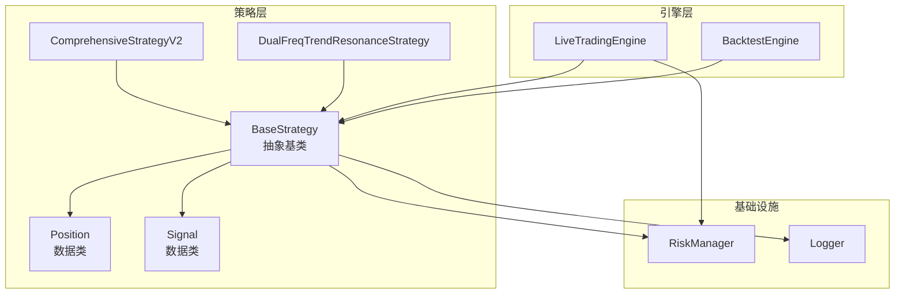
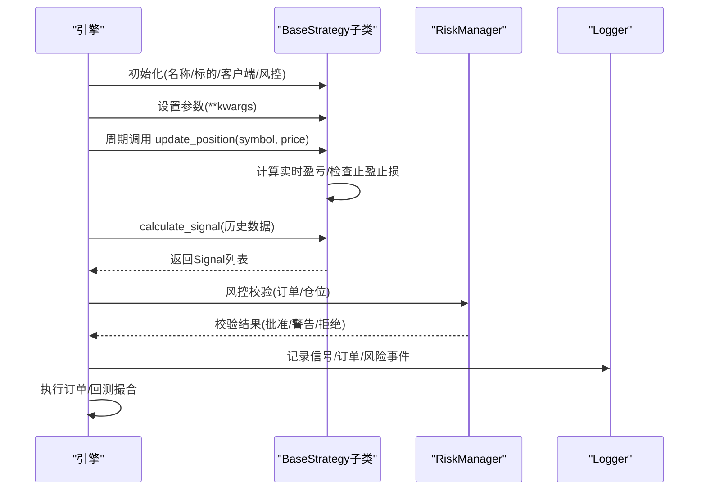
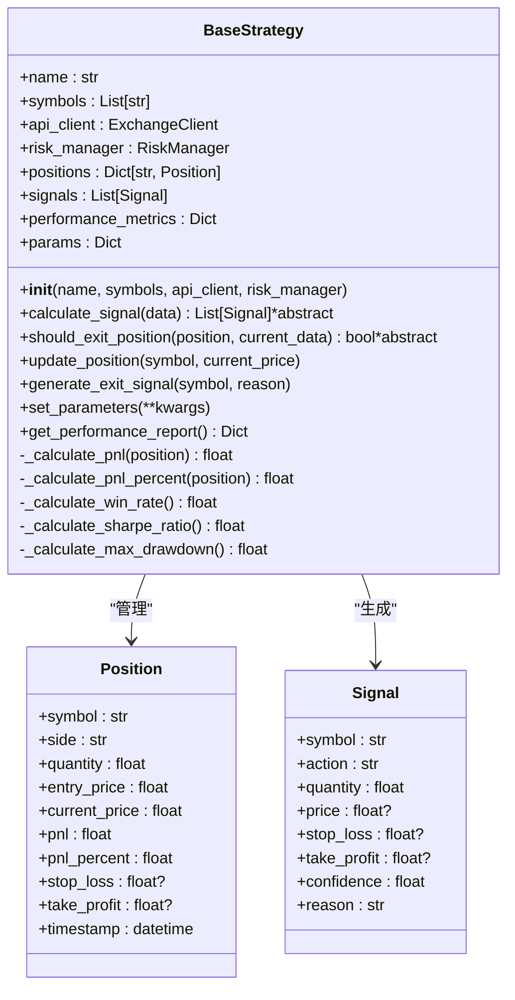
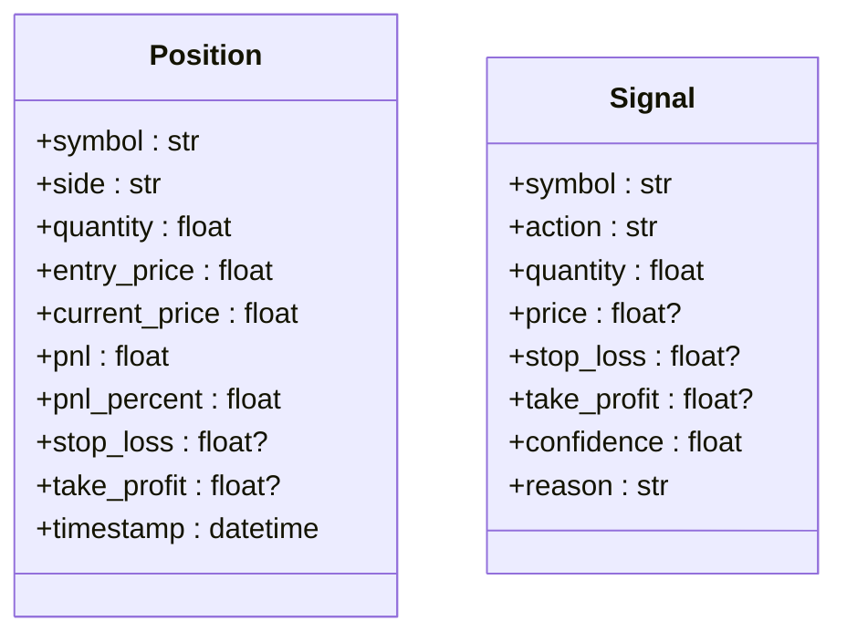
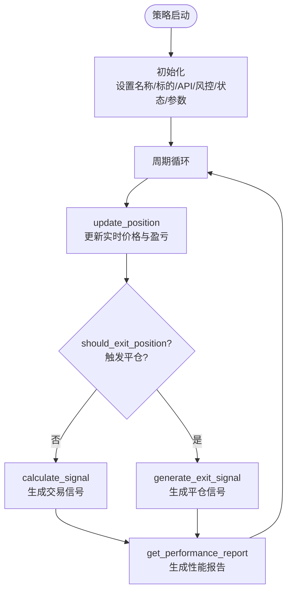
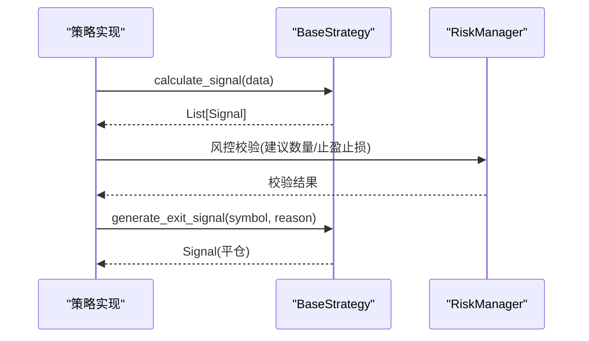
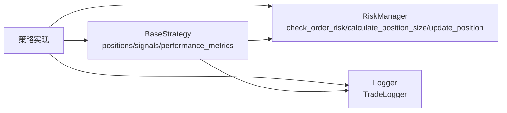
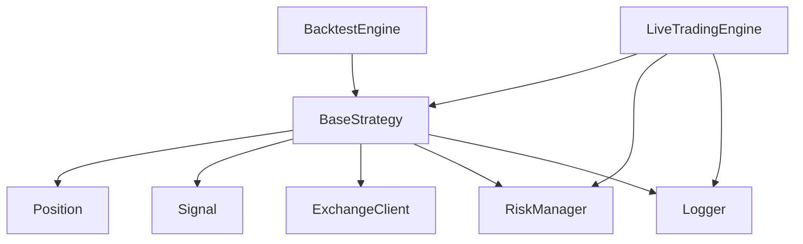

# 基础策略类

<cite>
**本文引用的文件**
- [strategy/base.py](file://strategy/base.py)
- [engine/live_trading.py](file://engine/live_trading.py)
- [engine/backtest.py](file://engine/backtest.py)
- [strategy/comprehensive.py](file://strategy/comprehensive.py)
- [strategy/dual_freq_trend.py](file://strategy/dual_freq_trend.py)
- [core/risk_manager.py](file://core/risk_manager.py)
- [utils/logger.py](file://utils/logger.py)
</cite>

## 目录
1. [简介](#简介)
2. [项目结构](#项目结构)
3. [核心组件](#核心组件)
4. [架构总览](#架构总览)
5. [详细组件分析](#详细组件分析)
6. [依赖分析](#依赖分析)
7. [性能考虑](#性能考虑)
8. [故障排查指南](#故障排查指南)
9. [结论](#结论)
10. [附录](#附录)

## 简介
本文件围绕 BaseStrategy 抽象基类展开，系统性阐述其设计理念、模板方法模式的应用、数据类 Position 与 Signal 的设计目的与字段语义、策略生命周期管理（初始化、参数设置、信号计算、仓位管理、性能评估）、抽象方法 calculate_signal 与 should_exit_position 的接口规范与实现要求，并补充策略状态管理、风险控制集成与日志记录机制。文末提供实现示例与最佳实践建议，帮助读者快速构建稳定、可扩展的交易策略。

## 项目结构
- 策略层位于 strategy/，其中 base.py 定义了抽象基类与数据类，具体策略（如 comprehensive.py、dual_freq_trend.py）继承该基类并实现核心逻辑。
- 引擎层位于 engine/，live_trading.py 为实盘引擎，backtest.py 为回测引擎，二者均以 BaseStrategy 为统一接口驱动策略运行。
- 风控与日志分别位于 core/risk_manager.py 与 utils/logger.py，作为策略运行时的基础设施。

**图表来源**
- [strategy/base.py:16-13](file://strategy/base.py#L16-L13)
- [strategy/base.py:41-112](file://strategy/base.py#L41-L112)
- [engine/live_trading.py:347-390](file://engine/live_trading.py#L347-L390)
- [engine/backtest.py:48-65](file://engine/backtest.py#L48-L65)
- [core/risk_manager.py:48-53](file://core/risk_manager.py#L48-L53)
- [utils/logger.py:128-134](file://utils/logger.py#L128-L134)

**章节来源**
- [strategy/base.py:16-13](file://strategy/base.py#L16-L13)
- [engine/live_trading.py:347-390](file://engine/live_trading.py#L347-L390)
- [engine/backtest.py:48-65](file://engine/backtest.py#L48-L65)
- [core/risk_manager.py:48-53](file://core/risk_manager.py#L48-L53)
- [utils/logger.py:128-134](file://utils/logger.py#L128-L134)

## 核心组件
- 抽象基类 BaseStrategy：定义策略模板方法与通用状态管理，强制子类实现 calculate_signal 与 should_exit_position。
- 数据类 Position：封装单个交易对的实时持仓信息，支持盈亏与止盈止损字段。
- 数据类 Signal：封装交易信号，包含目标方向、数量、价格、止盈止损与置信度等。
- 引擎 LiveTradingEngine 与 BacktestEngine：统一调度策略，驱动信号生成、订单执行与回测流程。
- RiskManager：提供风控校验、保证金与回撤监控、风险事件记录与报告生成。
- Logger：提供统一的日志记录能力，支持交易日志、错误日志与风险事件日志。

**章节来源**
- [strategy/base.py:16-13](file://strategy/base.py#L16-L13)
- [engine/live_trading.py:347-390](file://engine/live_trading.py#L347-L390)
- [engine/backtest.py:48-65](file://engine/backtest.py#L48-L65)
- [core/risk_manager.py:48-53](file://core/risk_manager.py#L48-L53)
- [utils/logger.py:128-134](file://utils/logger.py#L128-L134)

## 架构总览
BaseStrategy 采用模板方法模式，将策略生命周期的关键步骤固化为统一流程：初始化参数与状态、周期性更新仓位、计算信号、风控校验、生成订单与跟踪执行。具体策略只需实现两个抽象方法，即可无缝接入引擎与风控体系。

**图表来源**
- [strategy/base.py:46-70](file://strategy/base.py#L46-L70)
- [strategy/base.py:114-131](file://strategy/base.py#L114-L131)
- [strategy/base.py:71-91](file://strategy/base.py#L71-L91)
- [engine/live_trading.py:588-607](file://engine/live_trading.py#L588-L607)
- [engine/backtest.py:65-87](file://engine/backtest.py#L65-L87)
- [core/risk_manager.py:132-229](file://core/risk_manager.py#L132-L229)
- [utils/logger.py:137-179](file://utils/logger.py#L137-L179)

## 详细组件分析

### 抽象基类 BaseStrategy 设计与模板方法
- 设计理念
  - 通过抽象方法约束策略的核心行为，保证策略实现的一致性与可测试性。
  - 通过内置状态管理（positions、signals、performance_metrics、params）降低策略实现复杂度。
- 模板方法流程
  - 初始化：设置名称、监控标的、API客户端、风控器、状态容器与参数字典。
  - 生命周期钩子：update_position、generate_exit_signal、set_parameters、get_performance_report。
  - 抽象方法：calculate_signal（生成入场/持仓管理信号）、should_exit_position（平仓判断）。
- 关键实现要点
  - 盈亏计算：支持多头/空头，自动更新实时盈亏与盈亏百分比。
  - 平仓触发：在 update_position 中调用 should_exit_position，满足条件时自动生成平仓信号。
  - 性能评估：预留胜率、夏普比率、最大回撤等指标的计算入口，便于子类扩展。

**图表来源**
- [strategy/base.py:41-112](file://strategy/base.py#L41-L112)
- [strategy/base.py:16-29](file://strategy/base.py#L16-L29)
- [strategy/base.py:30-41](file://strategy/base.py#L30-L41)

**章节来源**
- [strategy/base.py:46-70](file://strategy/base.py#L46-L70)
- [strategy/base.py:114-131](file://strategy/base.py#L114-L131)
- [strategy/base.py:153-169](file://strategy/base.py#L153-L169)
- [strategy/base.py:175-207](file://strategy/base.py#L175-L207)

### 数据类 Position 与 Signal
- Position 字段含义
  - symbol：交易对符号
  - side：多头/空头
  - quantity：持仓数量
  - entry_price：入场价格
  - current_price：当前价格
  - pnl/pnl_percent：实时盈亏与盈亏百分比
  - stop_loss/take_profit：止盈止损价格
  - timestamp：创建时间
- Signal 字段含义
  - symbol/action/quantity：目标交易对、方向与数量
  - price：目标价格（为空时使用市价）
  - stop_loss/take_profit：止盈止损
  - confidence：信号置信度
  - reason：信号产生原因

**图表来源**
- [strategy/base.py:16-29](file://strategy/base.py#L16-L29)
- [strategy/base.py:30-41](file://strategy/base.py#L30-L41)

**章节来源**
- [strategy/base.py:16-41](file://strategy/base.py#L16-L41)

### 策略生命周期管理
- 初始化与参数设置
  - 初始化：绑定名称、监控标的、API客户端、风控器，准备状态容器与参数字典。
  - 参数设置：通过 set_parameters 动态注入策略参数，便于运行时调整。
- 信号计算与执行
  - calculate_signal：接收历史数据字典，返回 Signal 列表，引擎据此生成订单。
  - generate_exit_signal：在满足平仓条件时生成平仓信号。
- 仓位管理与更新
  - update_position：周期性调用，更新实时价格、盈亏与止盈止损触发。
  - should_exit_position：由子类实现，决定何时平仓（价格触及止损/止盈、技术信号反转、时间限制等）。
- 性能评估
  - get_performance_report：汇总总持仓、开仓数、总盈亏、胜率、夏普比率、最大回撤等指标，便于展示与审计。

**图表来源**
- [strategy/base.py:46-70](file://strategy/base.py#L46-L70)
- [strategy/base.py:114-131](file://strategy/base.py#L114-L131)
- [strategy/base.py:153-169](file://strategy/base.py#L153-L169)
- [strategy/base.py:175-207](file://strategy/base.py#L175-L207)

**章节来源**
- [strategy/base.py:46-70](file://strategy/base.py#L46-L70)
- [strategy/base.py:114-131](file://strategy/base.py#L114-L131)
- [strategy/base.py:153-169](file://strategy/base.py#L153-L169)
- [strategy/base.py:175-207](file://strategy/base.py#L175-L207)

### 抽象方法接口规范与实现要求
- calculate_signal(data: Dict[str, pd.DataFrame]) -> List[Signal]
  - 输入：按交易对组织的历史数据 DataFrame 字典
  - 输出：Signal 列表（可包含多方向、多标的）
  - 实现要求：
    - 基于 OHLCV 等数据计算技术指标与信号
    - 严格遵守风控器返回的建议数量与止盈止损
    - 保持幂等性与可重复性，便于回测与实盘一致性
- should_exit_position(position: Position, current_data: pd.Series) -> bool
  - 输入：当前持仓与最新数据（价格、指标等）
  - 输出：是否应平仓
  - 实现要求：
    - 明确止盈/止损触发条件（价格触及、技术指标反转、时间限制）
    - 避免过度交易与频繁反转
    - 与 update_position 的检查逻辑保持一致

**图表来源**
- [strategy/base.py:71-91](file://strategy/base.py#L71-L91)
- [strategy/base.py:93-112](file://strategy/base.py#L93-L112)
- [core/risk_manager.py:132-229](file://core/risk_manager.py#L132-L229)

**章节来源**
- [strategy/base.py:71-91](file://strategy/base.py#L71-L91)
- [strategy/base.py:93-112](file://strategy/base.py#L93-L112)
- [core/risk_manager.py:132-229](file://core/risk_manager.py#L132-L229)

### 策略状态管理、风险控制集成与日志记录
- 状态管理
  - positions：按交易对维护 Position，支持多头/空头双向
  - signals：累积生成的 Signal 列表，便于引擎执行与回测
  - performance_metrics：性能指标字典，get_performance_report 汇总
- 风险控制集成
  - calculate_position_size：基于账户资金与最大仓位比例计算建议数量
  - check_order_risk：校验订单是否超过日度/回撤/保证金上限，返回建议数量与止盈止损
  - update_position/close_position：更新风控内部仓位与回撤指标
- 日志记录
  - TradeLogger：统一记录订单、成交、信号与风险事件
  - get_logger：全局日志器，便于策略与引擎统一输出

**图表来源**
- [core/risk_manager.py:78-86](file://core/risk_manager.py#L78-L86)
- [core/risk_manager.py:132-229](file://core/risk_manager.py#L132-L229)
- [core/risk_manager.py:231-268](file://core/risk_manager.py#L231-L268)
- [utils/logger.py:137-179](file://utils/logger.py#L137-L179)
- [strategy/base.py:59-69](file://strategy/base.py#L59-L69)

**章节来源**
- [core/risk_manager.py:78-86](file://core/risk_manager.py#L78-L86)
- [core/risk_manager.py:132-229](file://core/risk_manager.py#L132-L229)
- [core/risk_manager.py:231-268](file://core/risk_manager.py#L231-L268)
- [utils/logger.py:137-179](file://utils/logger.py#L137-L179)
- [strategy/base.py:59-69](file://strategy/base.py#L59-L69)

### 具体实现示例与最佳实践
- 示例策略：ComprehensiveStrategyV2
  - 多指标评分系统，包含趋势、价格位置、RSI、K线形态、成交量、KDJ、OBV、均线交叉、MACD 等
  - 动态止盈止损（ATR 或固定比例），阶梯式保证金分配，趋势过滤与波动率过滤
  - 通过 set_parameters 注入参数，实现灵活配置
- 示例策略：DualFreqTrendResonanceStrategy
  - 双频共振（15分钟趋势 + 1分钟入场），严格的回调/突破形态与量能确认
  - 以保证金收益百分比定义止盈止损，结合时间止损与趋势反转出场
  - 使用 get_stop_take_profit_prices 将百分比转换为价格阈值
- 最佳实践
  - 将技术指标计算与信号生成解耦，先计算指标，再生成信号
  - 在 should_exit_position 中明确多种退出条件，避免单一依赖
  - 使用 RiskManager 的建议数量与止盈止损，确保风控一致性
  - 通过 get_performance_report 定期评估策略表现，持续优化参数

**章节来源**
- [strategy/comprehensive.py:17-91](file://strategy/comprehensive.py#L17-L91)
- [strategy/comprehensive.py:92-168](file://strategy/comprehensive.py#L92-L168)
- [strategy/dual_freq_trend.py:18-168](file://strategy/dual_freq_trend.py#L18-L168)
- [strategy/dual_freq_trend.py:548-559](file://strategy/dual_freq_trend.py#L548-L559)

## 依赖分析
- BaseStrategy 依赖
  - 数据类：Position、Signal
  - 外部模块：ExchangeClient（API客户端）、RiskManager（风控）、Logger（日志）
- 引擎依赖
  - LiveTradingEngine：注册策略、WebSocket订阅、订单/仓位/余额管理、回调通知
  - BacktestEngine：按时间序列驱动策略，模拟止盈止损与交易执行
- 风控与日志
  - RiskManager：提供风控校验、保证金与回撤监控、风险事件记录
  - Logger：提供交易日志、错误日志与风险事件日志

**图表来源**
- [strategy/base.py:9-13](file://strategy/base.py#L9-L13)
- [engine/live_trading.py:353-370](file://engine/live_trading.py#L353-L370)
- [engine/backtest.py:48-65](file://engine/backtest.py#L48-L65)
- [core/risk_manager.py:48-53](file://core/risk_manager.py#L48-L53)
- [utils/logger.py:128-134](file://utils/logger.py#L128-L134)

**章节来源**
- [strategy/base.py:9-13](file://strategy/base.py#L9-L13)
- [engine/live_trading.py:353-370](file://engine/live_trading.py#L353-L370)
- [engine/backtest.py:48-65](file://engine/backtest.py#L48-L65)
- [core/risk_manager.py:48-53](file://core/risk_manager.py#L48-L53)
- [utils/logger.py:128-134](file://utils/logger.py#L128-L134)

## 性能考虑
- 计算效率
  - 尽量在策略内部缓存中间变量，避免重复计算相同指标
  - 使用向量化操作（pandas/numpy）提升批量处理速度
- 数据访问
  - 仅在必要时访问外部API，优先使用引擎提供的历史数据
- 风控与日志
  - 风控检查与日志记录应避免阻塞主循环，必要时异步化
- 回测与实盘一致性
  - 回测中模拟止盈止损与滑点，确保策略在两种环境下的行为一致

## 故障排查指南
- 常见问题
  - 信号未执行：检查 calculate_signal 是否返回有效 Signal，确认风控器批准
  - 仓位未更新：确认 update_position 是否被周期性调用，should_exit_position 是否正确返回
  - 日志缺失：确认 TradeLogger 与 get_logger 是否正确初始化
- 排查步骤
  - 在策略中打印关键指标与信号来源，定位异常数据
  - 使用 get_performance_report 检查盈亏与胜率变化
  - 通过 RiskManager 的风险事件记录与报告生成，定位风控触发原因

**章节来源**
- [utils/logger.py:137-179](file://utils/logger.py#L137-L179)
- [core/risk_manager.py:302-330](file://core/risk_manager.py#L302-L330)
- [strategy/base.py:175-207](file://strategy/base.py#L175-L207)

## 结论
BaseStrategy 通过模板方法模式将策略生命周期标准化，结合风控与日志基础设施，为策略开发提供了清晰的框架。子类仅需聚焦于信号生成与平仓判断，即可与引擎、风控与日志体系无缝协作。遵循本文的最佳实践，可显著提升策略的稳定性、可维护性与可回测性。

## 附录
- 接口速查
  - BaseStrategy.calculate_signal：输入历史数据，输出 Signal 列表
  - BaseStrategy.should_exit_position：输入当前持仓与最新数据，输出是否平仓
  - RiskManager.check_order_risk：输入订单要素，输出风控校验与建议
  - TradeLogger.log_signal/log_order/log_trade/log_risk_event：统一记录交易与风险事件