# 策略框架

<cite>
**本文档引用的文件**
- [strategy/base.py](file://strategy/base.py)
- [strategy/mean_reversion.py](file://strategy/mean_reversion.py)
- [strategy/ai_adaptive.py](file://strategy/ai_adaptive.py)
- [strategy/dual_freq_trend.py](file://strategy/dual_freq_trend.py)
- [strategy/grid_strategy.py](file://strategy/grid_strategy.py)
- [strategy/comprehensive.py](file://strategy/comprehensive.py)
- [core/risk_manager.py](file://core/risk_manager.py)
- [engine/live_trading.py](file://engine/live_trading.py)
- [engine/backtest.py](file://engine/backtest.py)
</cite>

## 目录
1. [引言](#引言)
2. [项目结构](#项目结构)
3. [核心组件](#核心组件)
4. [架构概览](#架构概览)
5. [详细组件分析](#详细组件分析)
6. [依赖分析](#依赖分析)
7. [性能考虑](#性能考虑)
8. [故障排除指南](#故障排除指南)
9. [结论](#结论)
10. [附录](#附录)

## 引言

本策略框架是一个完整的量化交易系统，提供了统一的策略抽象基类和多种具体策略实现。该框架支持实盘交易、回测、风险管理等功能，为开发者提供了一个可扩展、可维护的策略开发平台。

框架的核心设计理念包括：
- **统一抽象**：通过BaseStrategy抽象基类定义策略的标准接口
- **模块化设计**：策略、风险管理、数据管理等功能模块独立
- **可扩展性**：支持新策略的快速开发和集成
- **安全性**：内置风险管理机制和错误处理
- **性能优化**：针对高频交易场景的优化设计

## 项目结构

策略框架采用清晰的分层架构，主要包含以下模块：

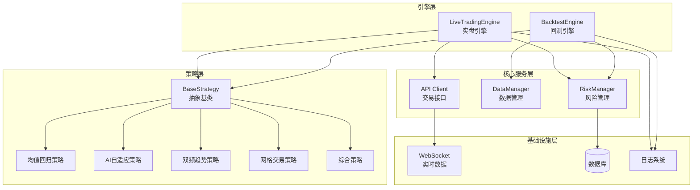

**图表来源**
- [strategy/base.py:41-212](file://strategy/base.py#L41-L212)
- [engine/live_trading.py:347-587](file://engine/live_trading.py#L347-L587)
- [engine/backtest.py:48-187](file://engine/backtest.py#L48-L187)

**章节来源**
- [strategy/base.py:1-212](file://strategy/base.py#L1-L212)
- [engine/live_trading.py:1-800](file://engine/live_trading.py#L1-L800)
- [engine/backtest.py:1-404](file://engine/backtest.py#L1-L404)

## 核心组件

### BaseStrategy抽象基类

BaseStrategy是整个策略框架的核心抽象类，定义了策略的标准接口和通用功能：

#### 核心接口定义

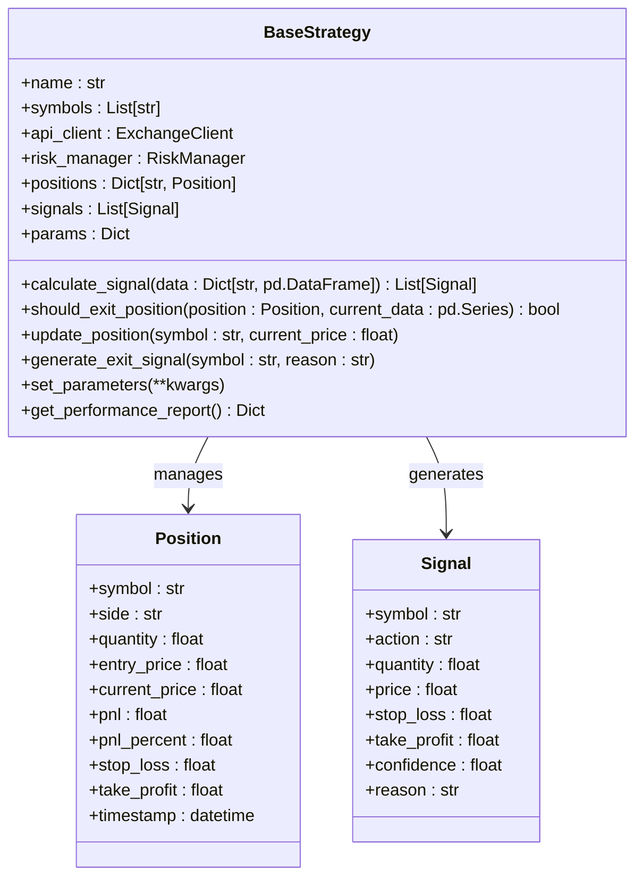

**图表来源**
- [strategy/base.py:16-212](file://strategy/base.py#L16-L212)

#### 关键特性

1. **抽象方法定义**：
   - `calculate_signal()`: 计算交易信号的核心方法
   - `should_exit_position()`: 判断是否需要平仓

2. **状态管理**：
   - 仓位管理：跟踪每个交易对的持仓状态
   - 信号队列：维护待执行的交易信号
   - 性能指标：记录策略表现数据

3. **风险管理集成**：
   - 与RiskManager协作进行风险控制
   - 支持动态止损止盈设置

**章节来源**
- [strategy/base.py:41-212](file://strategy/base.py#L41-L212)

### 风险管理组件

RiskManager提供了全面的风险控制机制：

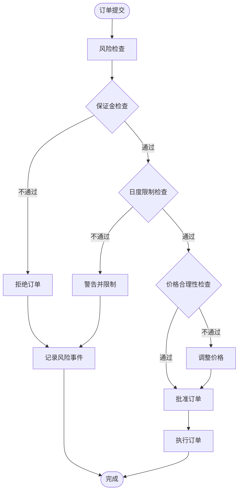

**图表来源**
- [core/risk_manager.py:87-229](file://core/risk_manager.py#L87-L229)

**章节来源**
- [core/risk_manager.py:48-566](file://core/risk_manager.py#L48-L566)

## 架构概览

策略框架采用分层架构设计，确保各组件职责清晰、耦合度低：

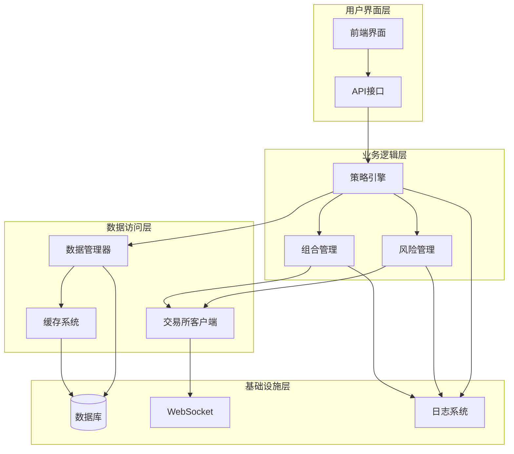

**图表来源**
- [engine/live_trading.py:347-587](file://engine/live_trading.py#L347-L587)
- [engine/backtest.py:48-187](file://engine/backtest.py#L48-L187)

## 详细组件分析

### 均值回归策略

均值回归策略基于统计学原理，利用价格偏离均值的回归特性进行交易。

#### 策略实现特点

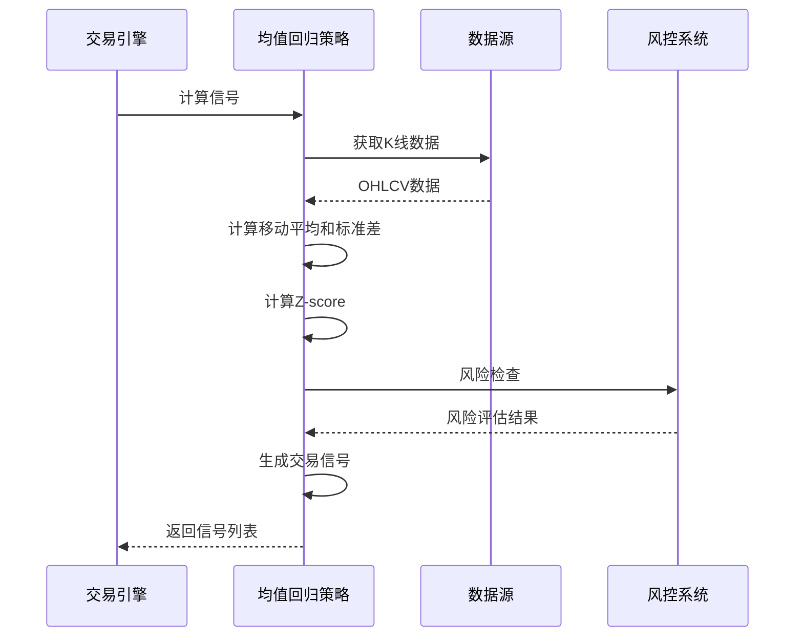

**图表来源**
- [strategy/mean_reversion.py:31-117](file://strategy/mean_reversion.py#L31-L117)

#### 关键算法

1. **Z-score计算**：
   ```
   Z = (P - MA) / STD
   ```
   其中P为当前价格，MA为移动平均，STD为标准差

2. **信号生成逻辑**：
   - Z < -阈值：做多信号
   - Z > 阈值：做空信号
   - 价格回归均值：平仓信号

3. **仓位管理**：
   - 基于账户余额动态计算
   - 支持固定保证金和比例保证金
   - 实时风险检查

**章节来源**
- [strategy/mean_reversion.py:23-117](file://strategy/mean_reversion.py#L23-L117)

### AI自适应策略

AI自适应策略结合了传统技术分析和AI智能决策，提供更高级别的交易决策能力。

#### 智能分析流程

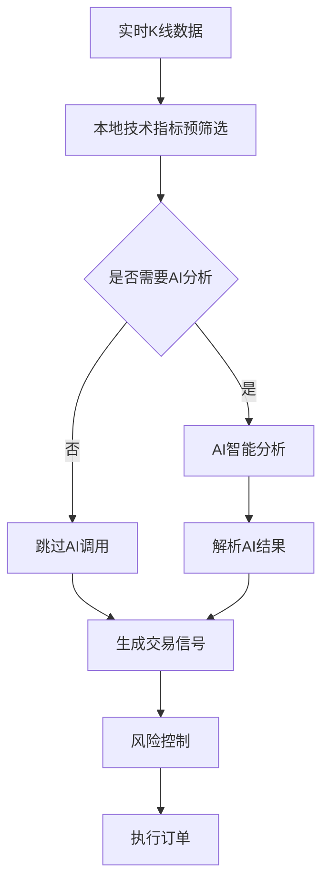

**图表来源**
- [strategy/ai_adaptive.py:266-670](file://strategy/ai_adaptive.py#L266-L670)

#### 核心特性

1. **成本优化机制**：
   - 本地技术指标预筛选，减少AI调用频率
   - 支持85%以上的AI调用节省
   - 智能分析模式切换

2. **多时间框架分析**：
   - 1分钟K线用于高频交易
   - 1000根K线用于深度分析
   - 实时与历史数据结合

3. **智能信号解析**：
   - 支持新旧两种信号格式
   - 自动识别做多/做空信号
   - 动态止损止盈计算

**章节来源**
- [strategy/ai_adaptive.py:12-670](file://strategy/ai_adaptive.py#L12-L670)

### 双频趋势共振策略

双频趋势共振策略结合了不同时间框架的趋势分析，通过多频共振提高信号质量。

#### 多时间框架分析

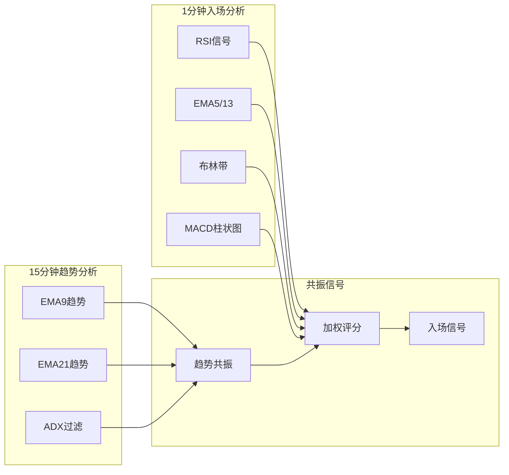

**图表来源**
- [strategy/dual_freq_trend.py:18-800](file://strategy/dual_freq_trend.py#L18-L800)

#### 策略参数配置

| 参数类别 | 参数名称 | 默认值 | 说明 |
|---------|---------|--------|------|
| 趋势分析 | EMA9/EMA21周期 | 9/21 | 趋势判断基础 |
| 入场信号 | RSI周期/阈值 | 6/[32,55] | 多空入场阈值 |
| 仓位管理 | 杠杆倍数 | 100 | 交易杠杆设置 |
| 风险控制 | 止损/止盈比例 | 50%/150% | 保证金收益% |

**章节来源**
- [strategy/dual_freq_trend.py:18-800](file://strategy/dual_freq_trend.py#L18-L800)

### 网格交易策略

网格交易策略通过在价格区间内设置买卖挂单，实现自动化的高抛低吸交易。

#### 网格管理机制

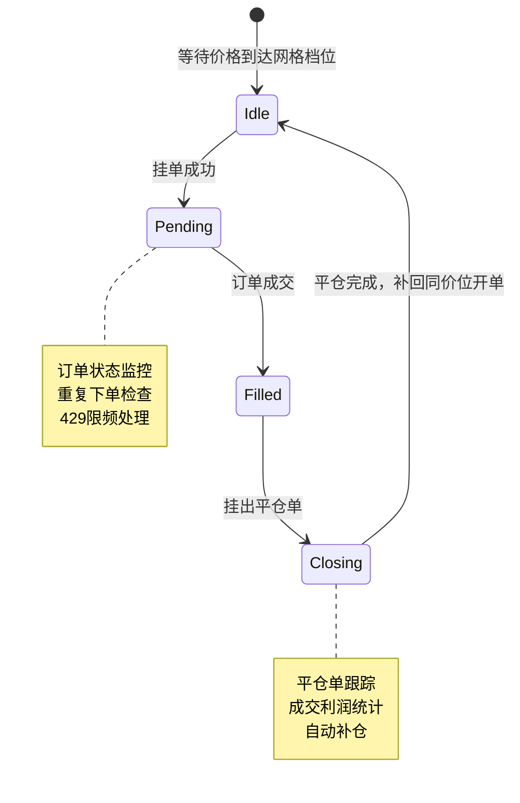

**图表来源**
- [strategy/grid_strategy.py:599-754](file://strategy/grid_strategy.py#L599-L754)

#### 核心功能特性

1. **智能网格管理**：
   - 支持双向/单向网格模式
   - 自动补仓机制
   - 挂单状态监控

2. **风险控制**：
   - 日内最大亏损限制
   - 持仓价值上限控制
   - 429限频保护

3. **实时监控**：
   - WebSocket实时数据
   - 订单状态跟踪
   - 盈亏统计

**章节来源**
- [strategy/grid_strategy.py:38-754](file://strategy/grid_strategy.py#L38-L754)

### 综合策略

综合策略整合了多种技术指标和信号，通过加权评分系统提高信号质量。

#### 多指标评分系统

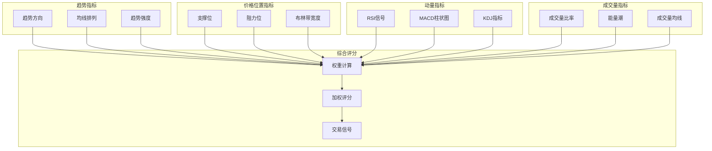

**图表来源**
- [strategy/comprehensive.py:17-800](file://strategy/comprehensive.py#L17-L800)

#### 评分权重配置

| 指标类别 | 指标名称 | 权重 | 说明 |
|---------|---------|------|------|
| 趋势分析 | 趋势方向 | 1.5 | 最高权重 |
| 价格位置 | 布林带位置 | 1.3 | 重要位置信号 |
| 动量指标 | RSI信号 | 1.0 | 动量确认 |
| 形态识别 | K线形态 | 0.8 | 技术形态 |
| 成交量 | 量能配合 | 0.7 | 成交量确认 |
| 其他 | KDJ/OBV | 0.6-0.5 | 辅助信号 |

**章节来源**
- [strategy/comprehensive.py:17-800](file://strategy/comprehensive.py#L17-L800)

## 依赖分析

策略框架的依赖关系清晰，各模块职责明确：

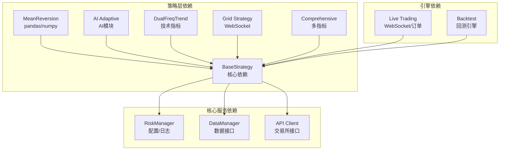

**图表来源**
- [strategy/base.py:9-13](file://strategy/base.py#L9-L13)
- [engine/live_trading.py:353-370](file://engine/live_trading.py#L353-L370)

### 关键依赖关系

1. **策略基类依赖**：
   - pandas/numpy：数据处理和计算
   - typing：类型注解
   - dataclasses：数据结构定义

2. **风险管理依赖**：
   - 配置系统：交易参数配置
   - 日志系统：风险事件记录

3. **引擎层依赖**：
   - WebSocket：实时数据订阅
   - 异步IO：并发处理
   - 数据库：持久化存储

**章节来源**
- [strategy/base.py:1-13](file://strategy/base.py#L1-L13)
- [engine/live_trading.py:1-50](file://engine/live_trading.py#L1-L50)

## 性能考虑

策略框架在设计时充分考虑了性能优化：

### 实时性能优化

1. **数据缓存机制**：
   - WebSocket实时数据缓存
   - 余额信息10分钟缓存
   - K线数据预加载

2. **并发处理**：
   - 异步IO架构
   - 多任务并行执行
   - 事件驱动模式

3. **内存管理**：
   - 对象池设计
   - 及时清理无用数据
   - 内存使用监控

### 策略性能优化

1. **计算优化**：
   - 向量化计算
   - 缓存中间结果
   - 避免重复计算

2. **网络优化**：
   - 连接池管理
   - 重连机制
   - 代理支持

3. **存储优化**：
   - 数据压缩
   - 批量写入
   - 索引优化

## 故障排除指南

### 常见问题及解决方案

#### 策略执行问题

| 问题类型 | 症状描述 | 解决方案 |
|---------|---------|---------|
| 策略无信号 | 策略运行但无交易信号 | 检查参数配置，验证数据质量 |
| 仓位异常 | 持仓数量与预期不符 | 检查风控检查结果，确认订单状态 |
| 性能下降 | 策略响应变慢 | 优化参数，检查系统资源使用 |

#### 风险管理问题

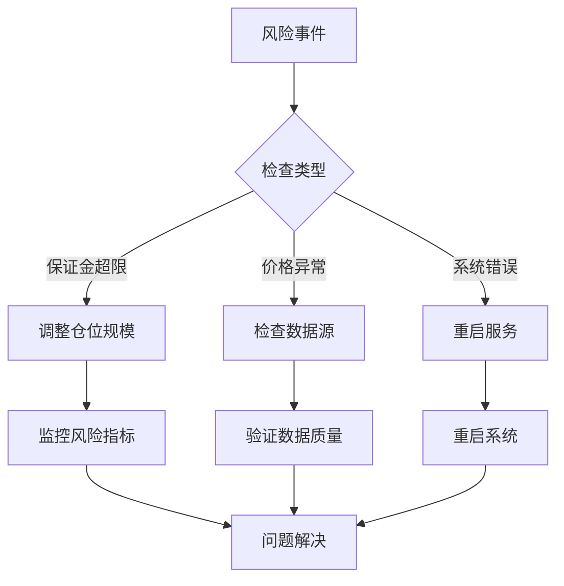

#### 网络连接问题

1. **WebSocket连接失败**：
   - 检查网络代理设置
   - 验证防火墙配置
   - 尝试手动重连

2. **API调用超时**：
   - 检查API密钥有效性
   - 验证请求频率限制
   - 实施指数退避重试

**章节来源**
- [engine/live_trading.py:153-235](file://engine/live_trading.py#L153-L235)
- [core/risk_manager.py:87-229](file://core/risk_manager.py#L87-L229)

## 结论

策略框架提供了一个完整、灵活且高性能的量化交易解决方案。通过统一的抽象基类和模块化设计，开发者可以快速开发和部署各种类型的交易策略。

### 主要优势

1. **高度可扩展性**：基于抽象基类的设计使得新策略的开发变得简单
2. **强大的风险管理**：内置全面的风险控制机制
3. **性能优化**：针对高频交易场景的专门优化
4. **实时监控**：完善的实时数据监控和告警机制
5. **回测支持**：完整的回测引擎支持策略验证

### 适用场景

- 高频交易策略开发
- 多市场套利策略
- 机器学习策略集成
- 传统技术分析策略
- 组合策略管理

## 附录

### 策略开发最佳实践

#### 新策略开发指南

1. **继承BaseStrategy**：
   ```python
   class MyStrategy(BaseStrategy):
       def calculate_signal(self, data: Dict[str, pd.DataFrame]) -> List[Signal]:
           # 实现信号计算逻辑
           pass
       
       def should_exit_position(self, position: Position, current_data: pd.Series) -> bool:
           # 实现平仓判断逻辑
           pass
   ```

2. **参数配置**：
   - 使用`set_parameters()`方法动态配置
   - 支持JSON配置文件
   - 实时参数热更新

3. **风险管理集成**：
   - 调用`risk_manager.validate_position()`进行风险检查
   - 设置合理的止损止盈
   - 监控仓位规模

#### 性能优化建议

1. **算法优化**：
   - 使用向量化操作
   - 缓存计算结果
   - 避免不必要的数据复制

2. **内存管理**：
   - 及时释放无用对象
   - 使用生成器处理大数据
   - 监控内存使用情况

3. **并发优化**：
   - 合理使用异步编程
   - 避免阻塞操作
   - 优化事件循环

#### 测试策略

1. **单元测试**：
   - 测试单个策略函数
   - 验证边界条件
   - 检查异常处理

2. **集成测试**：
   - 测试策略与引擎集成
   - 验证数据流完整性
   - 检查错误恢复机制

3. **性能测试**：
   - 压力测试策略性能
   - 监控资源使用情况
   - 优化瓶颈环节