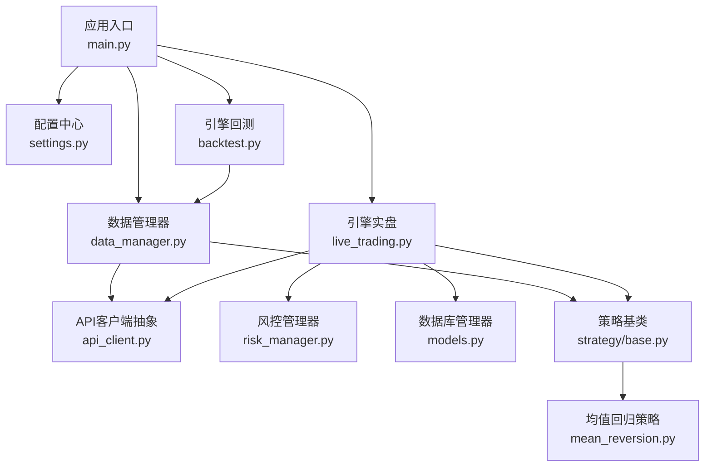
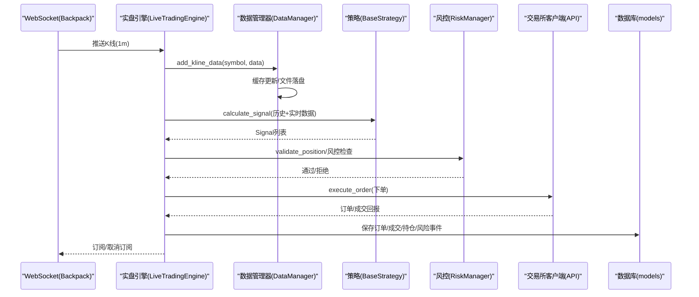
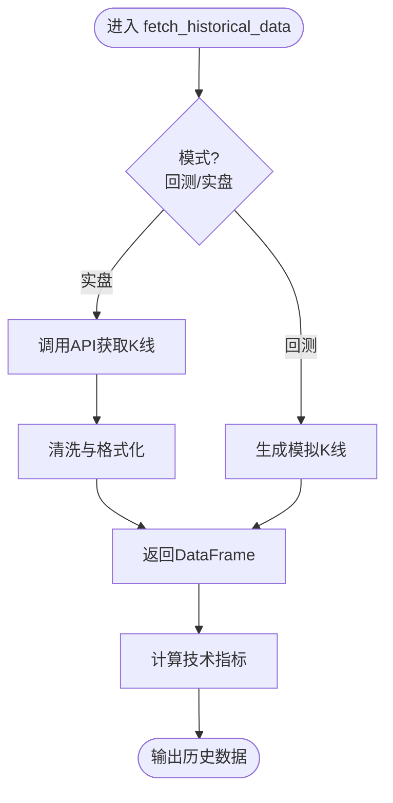
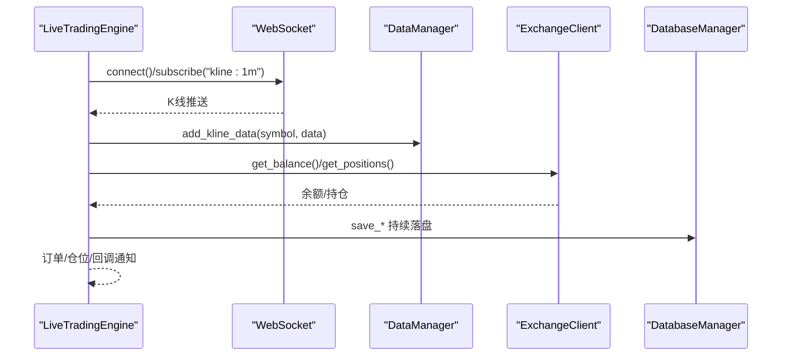
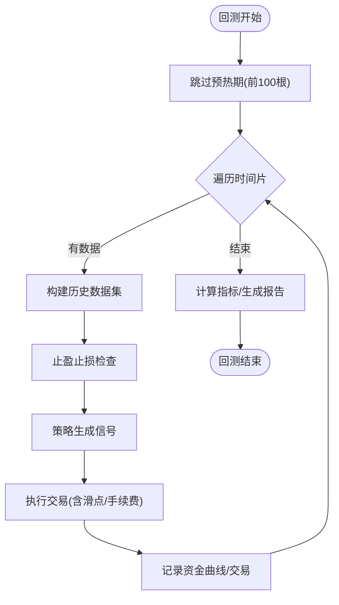
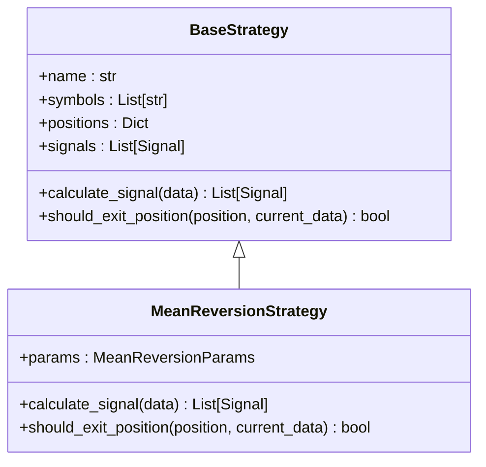
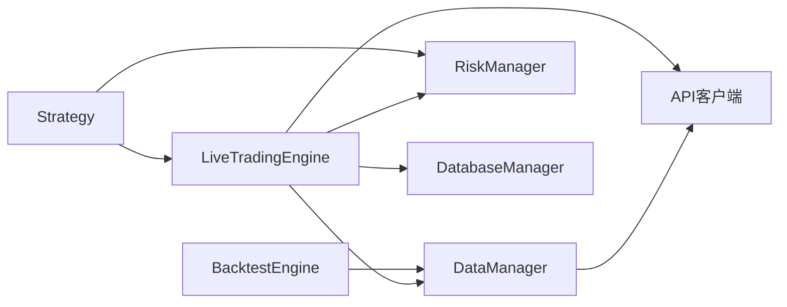

# 数据流设计

<cite>
**本文档引用的文件**
- [main.py](file://backpack_quant_trading/main.py)
- [settings.py](file://backpack_quant_trading/config/settings.py)
- [data_manager.py](file://backpack_quant_trading/core/data_manager.py)
- [live_trading.py](file://backpack_quant_trading/engine/live_trading.py)
- [backtest.py](file://backpack_quant_trading/engine/backtest.py)
- [base.py](file://backpack_quant_trading/strategy/base.py)
- [mean_reversion.py](file://backpack_quant_trading/strategy/mean_reversion.py)
- [risk_manager.py](file://backpack_quant_trading/core/risk_manager.py)
- [models.py](file://backpack_quant_trading/database/models.py)
- [api_client.py](file://backpack_quant_trading/core/api_client.py)
- [DATA_SOURCE_AND_CACHE.md](file://backpack_quant_trading/docs/DATA_SOURCE_AND_CACHE.md)
- [symbols_cache.json](file://backpack_quant_trading/data/symbols_cache.json)
</cite>

## 目录
1. [简介](#简介)
2. [项目结构](#项目结构)
3. [核心组件](#核心组件)
4. [架构总览](#架构总览)
5. [详细组件分析](#详细组件分析)
6. [依赖关系分析](#依赖关系分析)
7. [性能考虑](#性能考虑)
8. [故障排查指南](#故障排查指南)
9. [结论](#结论)
10. [附录](#附录)

## 简介
本文件面向量化交易系统的数据流设计，围绕实时数据获取、历史数据处理、技术指标计算与策略信号生成展开，系统性阐述数据缓存机制、数据同步策略与一致性保障，并提供关键数据路径的时序图与架构图。同时给出性能瓶颈分析与优化建议，以及错误处理与数据恢复机制。

## 项目结构
系统采用分层架构：
- 应用入口与调度：main.py
- 配置中心：config/settings.py
- 数据层：core/data_manager.py（历史/实时数据、缓存、指标计算）
- 引擎层：engine/live_trading.py（实盘）、engine/backtest.py（回测）
- 策略层：strategy/*（策略基类与具体策略）
- 风控层：core/risk_manager.py
- 数据库层：database/models.py（持久化订单、成交、持仓、风险事件等）
- 交易接口：core/api_client.py（抽象交易所客户端）

图表来源
- [main.py:1-344](file://backpack_quant_trading/main.py#L1-L344)
- [settings.py:1-137](file://backpack_quant_trading/config/settings.py#L1-L137)
- [data_manager.py:1-518](file://backpack_quant_trading/core/data_manager.py#L1-L518)
- [live_trading.py:1-800](file://backpack_quant_trading/engine/live_trading.py#L1-L800)
- [backtest.py:1-404](file://backpack_quant_trading/engine/backtest.py#L1-L404)
- [base.py:1-212](file://backpack_quant_trading/strategy/base.py#L1-L212)
- [mean_reversion.py:1-263](file://backpack_quant_trading/strategy/mean_reversion.py#L1-L263)
- [risk_manager.py:1-566](file://backpack_quant_trading/core/risk_manager.py#L1-L566)
- [models.py:1-721](file://backpack_quant_trading/database/models.py#L1-L721)
- [api_client.py:1-800](file://backpack_quant_trading/core/api_client.py#L1-L800)

章节来源
- [main.py:1-344](file://backpack_quant_trading/main.py#L1-L344)
- [settings.py:1-137](file://backpack_quant_trading/config/settings.py#L1-L137)

## 核心组件
- 数据管理器（DataManager）：负责历史K线获取、实时K线缓存、数据清洗、技术指标计算与多资产相关性矩阵计算。
- 实盘引擎（LiveTradingEngine）：负责WebSocket订阅、实时K线接收与缓存、订单/仓位/余额管理、风控检查、回调通知与数据库落盘。
- 回测引擎（BacktestEngine）：负责历史数据回放、信号执行、止盈止损模拟、指标计算与报告生成。
- 策略基类（BaseStrategy）：定义信号、仓位、风控交互接口；各策略实现具体信号生成与平仓逻辑。
- 风控管理器（RiskManager）：负责保证金与敞口控制、日度限额、最大回撤、VaR与压力测试等。
- 数据库管理器（DatabaseManager）：负责订单、成交、持仓、风险事件、组合净值等持久化。
- API客户端（BackpackAPIClient/ExchangeClient）：抽象下单与查询接口，支持多交易所切换。

章节来源
- [data_manager.py:18-518](file://backpack_quant_trading/core/data_manager.py#L18-L518)
- [live_trading.py:347-800](file://backpack_quant_trading/engine/live_trading.py#L347-L800)
- [backtest.py:48-404](file://backpack_quant_trading/engine/backtest.py#L48-L404)
- [base.py:41-212](file://backpack_quant_trading/strategy/base.py#L41-L212)
- [risk_manager.py:48-566](file://backpack_quant_trading/core/risk_manager.py#L48-L566)
- [models.py:267-721](file://backpack_quant_trading/database/models.py#L267-L721)
- [api_client.py:22-800](file://backpack_quant_trading/core/api_client.py#L22-L800)

## 架构总览
系统数据流分为两条主线：
- 实时数据流：Backpack WebSocket推送K线 → 实盘引擎缓存 → 策略计算信号 → 风控校验 → 下单执行 → 数据库落盘。
- 历史数据流：回测引擎按时间片回放历史K线 → DataManager计算指标 → 策略生成信号 → 执行交易 → 生成报告。

图表来源
- [live_trading.py:536-568](file://backpack_quant_trading/engine/live_trading.py#L536-L568)
- [data_manager.py:169-290](file://backpack_quant_trading/core/data_manager.py#L169-L290)
- [base.py:71-112](file://backpack_quant_trading/strategy/base.py#L71-L112)
- [risk_manager.py:87-230](file://backpack_quant_trading/core/risk_manager.py#L87-L230)
- [api_client.py:418-477](file://backpack_quant_trading/core/api_client.py#L418-L477)
- [models.py:316-454](file://backpack_quant_trading/database/models.py#L316-L454)

## 详细组件分析

### 数据管理器（DataManager）
职责与特性：
- 历史数据获取：回测模式生成模拟K线；实盘模式通过API客户端拉取K线。
- 实时数据缓存：内存缓存+文件落盘，支持1分钟K线增量更新。
- 数据清洗与指标：去重、数值规范化、缺失值填充；计算MA、布林带、RSI、MACD、ATR、波动率、Z-score等。
- 多资产处理：批量获取与相关性矩阵计算。

图表来源
- [data_manager.py:114-168](file://backpack_quant_trading/core/data_manager.py#L114-L168)
- [data_manager.py:405-447](file://backpack_quant_trading/core/data_manager.py#L405-L447)

章节来源
- [data_manager.py:18-518](file://backpack_quant_trading/core/data_manager.py#L18-L518)

### 实盘引擎（LiveTradingEngine）
职责与特性：
- WebSocket订阅与重连：指数退避重连、心跳检测、消息处理。
- 实时数据处理：接收1分钟K线，写入DataManager缓存，支持文件落盘。
- 订单/仓位/余额管理：并发锁保护、回调通知、余额缓存（10分钟TTL）。
- 交易执行：抽象交易所客户端，支持多平台切换。
- 数据落盘：订单、成交、持仓、风险事件、组合快照。

图表来源
- [live_trading.py:126-345](file://backpack_quant_trading/engine/live_trading.py#L126-L345)
- [live_trading.py:443-568](file://backpack_quant_trading/engine/live_trading.py#L443-L568)
- [data_manager.py:169-290](file://backpack_quant_trading/core/data_manager.py#L169-L290)
- [models.py:293-496](file://backpack_quant_trading/database/models.py#L293-L496)

章节来源
- [live_trading.py:347-800](file://backpack_quant_trading/engine/live_trading.py#L347-L800)

### 回测引擎（BacktestEngine）
职责与特性：
- 按时间片回放历史数据，预热期跳过指标计算不稳定的前100根K线。
- 信号执行与止盈止损模拟：支持K线内止损止盈判断与技术指标检查。
- 交易执行：支持多空双向持仓、滑点与手续费模拟。
- 指标计算：总收益、年化收益、夏普比率、最大回撤、胜率、盈利因子等。

图表来源
- [backtest.py:65-187](file://backpack_quant_trading/engine/backtest.py#L65-L187)
- [backtest.py:333-383](file://backpack_quant_trading/engine/backtest.py#L333-L383)

章节来源
- [backtest.py:48-404](file://backpack_quant_trading/engine/backtest.py#L48-L404)

### 策略基类与均值回归策略
- 策略基类定义信号、仓位、风控交互接口；策略实现具体信号生成与平仓逻辑。
- 均值回归策略：基于Z-score与布林带阈值生成买卖信号，结合止损止盈与仓位计算。

图表来源
- [base.py:41-212](file://backpack_quant_trading/strategy/base.py#L41-L212)
- [mean_reversion.py:23-263](file://backpack_quant_trading/strategy/mean_reversion.py#L23-L263)

章节来源
- [base.py:41-212](file://backpack_quant_trading/strategy/base.py#L41-L212)
- [mean_reversion.py:23-263](file://backpack_quant_trading/strategy/mean_reversion.py#L23-L263)

### 风控管理器（RiskManager）
- 保证金与敞口控制：基于账户资金与最大仓位比例限制总保证金。
- 日度限额与最大回撤：每日亏损与回撤阈值控制。
- VaR与压力测试：历史法、参数法、蒙特卡洛计算风险度量与情景压力测试。
- 风险事件记录：数据库落盘与严重性分级。

章节来源
- [risk_manager.py:48-566](file://backpack_quant_trading/core/risk_manager.py#L48-L566)

### 数据库管理器（DatabaseManager）
- 订单、成交、持仓、风险事件、组合净值等表结构与持久化方法。
- 重复数据防护：成交表按trade_id去重插入。
- 字段截断与类型转换：避免长度与精度溢出。

章节来源
- [models.py:267-721](file://backpack_quant_trading/database/models.py#L267-L721)

### API客户端与配置
- API客户端抽象：统一下单与查询接口，支持Backpack/Deepcoin/Hyperliquid等。
- 配置中心：统一管理API地址、密钥、数据库连接、交易参数等。

章节来源
- [api_client.py:22-800](file://backpack_quant_trading/core/api_client.py#L22-L800)
- [settings.py:104-137](file://backpack_quant_trading/config/settings.py#L104-L137)

## 依赖关系分析
- 组件耦合：
  - DataManager与API客户端解耦，支持多交易所切换。
  - 实盘引擎依赖DataManager与ExchangeClient，同时与数据库管理器交互。
  - 策略通过基类接口与引擎交互，避免直接依赖具体实现。
- 外部依赖：
  - WebSocket（Backpack）用于实时K线推送。
  - MySQL（通过SQLAlchemy）持久化交易数据与风控事件。
- 潜在环依赖：
  - LiveTradingEngine在初始化时引入ExchangeClient以避免循环导入。

图表来源
- [live_trading.py:353-370](file://backpack_quant_trading/engine/live_trading.py#L353-L370)
- [backtest.py:9-11](file://backpack_quant_trading/engine/backtest.py#L9-L11)
- [data_manager.py:10-13](file://backpack_quant_trading/core/data_manager.py#L10-L13)

章节来源
- [live_trading.py:347-370](file://backpack_quant_trading/engine/live_trading.py#L347-L370)
- [backtest.py:48-66](file://backpack_quant_trading/engine/backtest.py#L48-L66)
- [data_manager.py:18-42](file://backpack_quant_trading/core/data_manager.py#L18-L42)

## 性能考虑
- 缓存与去重：
  - DataManager内存缓存+TTL，文件落盘用于进程间共享；实时K线按时间戳去重与更新。
  - 实盘引擎余额缓存（10分钟TTL）减少API调用频率。
- 指标计算复杂度：
  - 滚动窗口（MA/BB/RSI/ATR）时间复杂度与数据长度线性相关；建议限制回看窗口或分批计算。
- I/O与网络：
  - WebSocket连接采用指数退避与心跳检测；MySQL连接池配置可提升并发写入效率。
- 回测性能：
  - 预热期跳过指标不稳定期；滑点与手续费在回测中模拟，避免实盘偏差。
- 优化建议：
  - 使用更高效的数据结构（如按需切片）与并行化指标计算。
  - 对高频K线采用批处理写入数据库，减少事务开销。
  - 对热点数据（如余额、K线）增加本地缓存层级（Redis/内存缓存）。

[本节为通用性能讨论，不直接分析具体文件]

## 故障排查指南
- WebSocket连接失败：
  - 检查代理设置与websockets库版本；确认ping/pong心跳与重连逻辑。
- 实时数据异常：
  - 核对时间戳格式转换（秒/毫秒）、时区转换（UTC→本地）与无效K线过滤。
- 订单执行异常：
  - 核对签名参数、时间戳与窗口；检查API返回状态与错误日志。
- 数据库写入异常：
  - 检查字段长度与精度截断、重复trade_id防护与事务回滚。
- 风控拦截：
  - 检查保证金计算、账户资金估算与日度限额、最大回撤阈值。

章节来源
- [live_trading.py:153-235](file://backpack_quant_trading/engine/live_trading.py#L153-L235)
- [data_manager.py:187-210](file://backpack_quant_trading/core/data_manager.py#L187-L210)
- [api_client.py:254-268](file://backpack_quant_trading/core/api_client.py#L254-L268)
- [models.py:358-363](file://backpack_quant_trading/database/models.py#L358-L363)
- [risk_manager.py:173-204](file://backpack_quant_trading/core/risk_manager.py#L173-L204)

## 结论
系统通过清晰的分层与抽象，实现了从实时数据到策略信号再到风控与持久化的完整数据流闭环。缓存与文件落盘保障了数据一致性与跨进程共享；WebSocket与数据库落盘确保了高吞吐与可追溯性。建议进一步引入高性能缓存与批处理优化，以应对更高频与更大规模的数据流场景。

[本节为总结性内容，不直接分析具体文件]

## 附录
- 数据源与缓存策略参考：见文档资料与symbols缓存文件，支持全市场K线拉取与增量更新。
- 交易对格式映射：实盘引擎支持Backpack与Deepcoin格式映射，确保数据订阅与下单一致性。

章节来源
- [DATA_SOURCE_AND_CACHE.md:1-71](file://backpack_quant_trading/docs/DATA_SOURCE_AND_CACHE.md#L1-L71)
- [symbols_cache.json:1-543](file://backpack_quant_trading/data/symbols_cache.json#L1-L543)
- [live_trading.py:608-698](file://backpack_quant_trading/engine/live_trading.py#L608-L698)