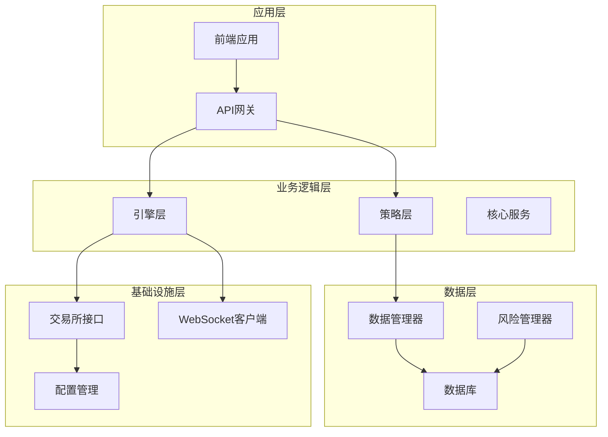
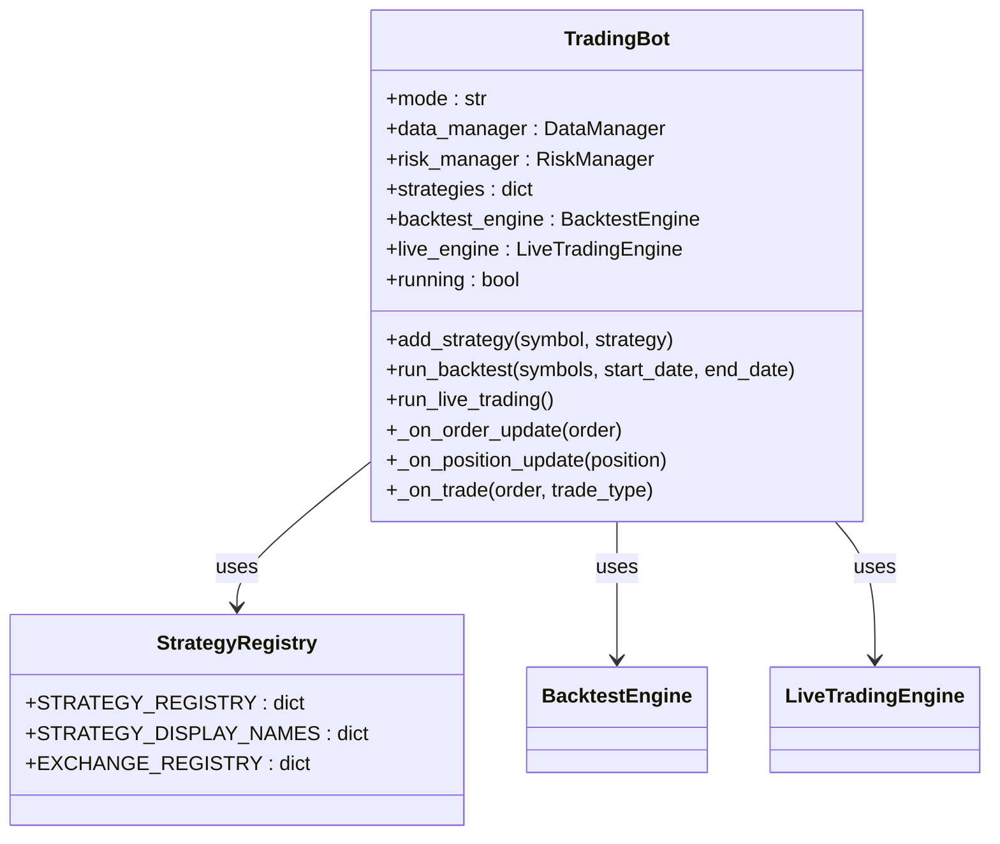
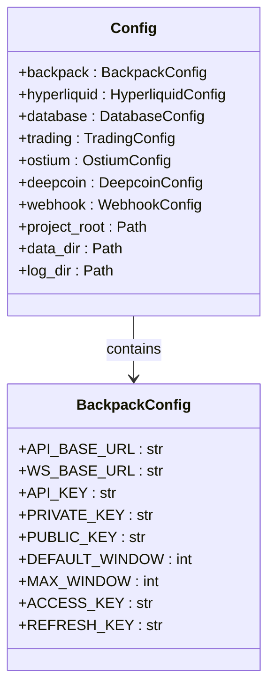
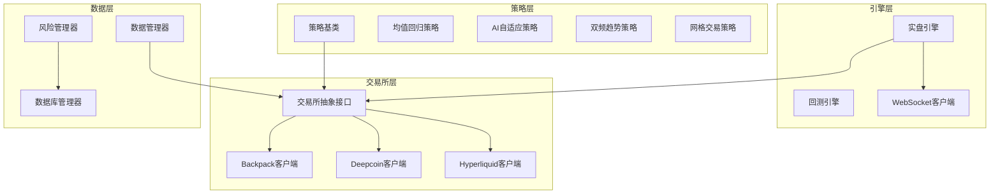
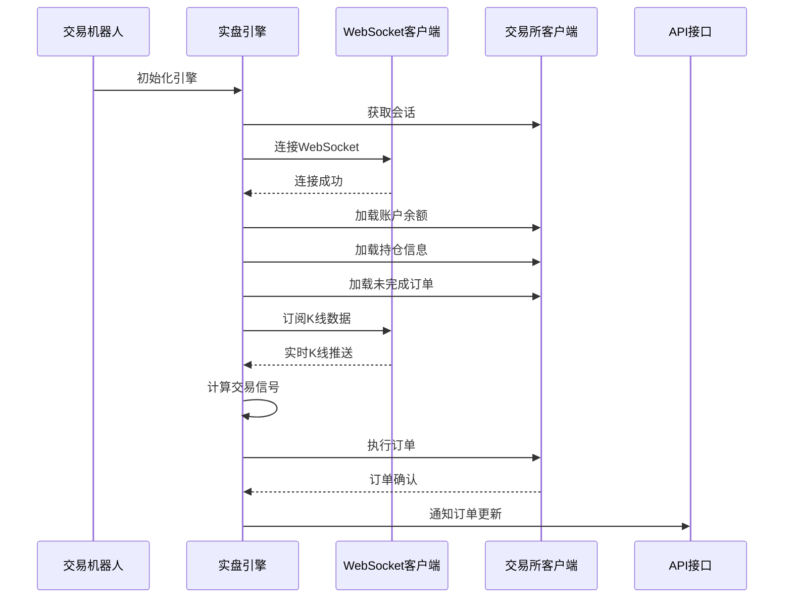
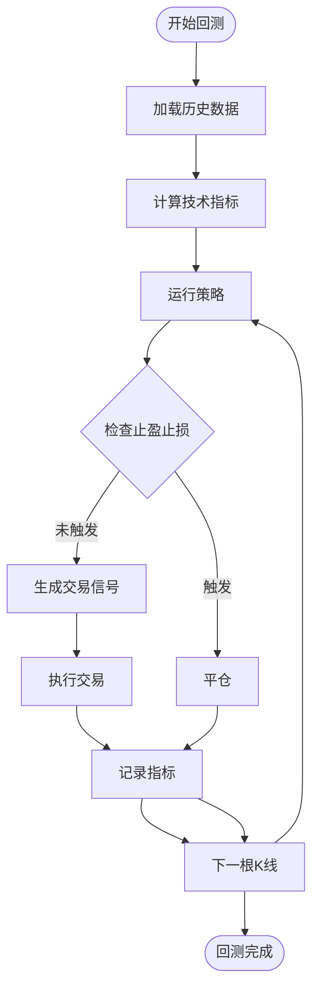
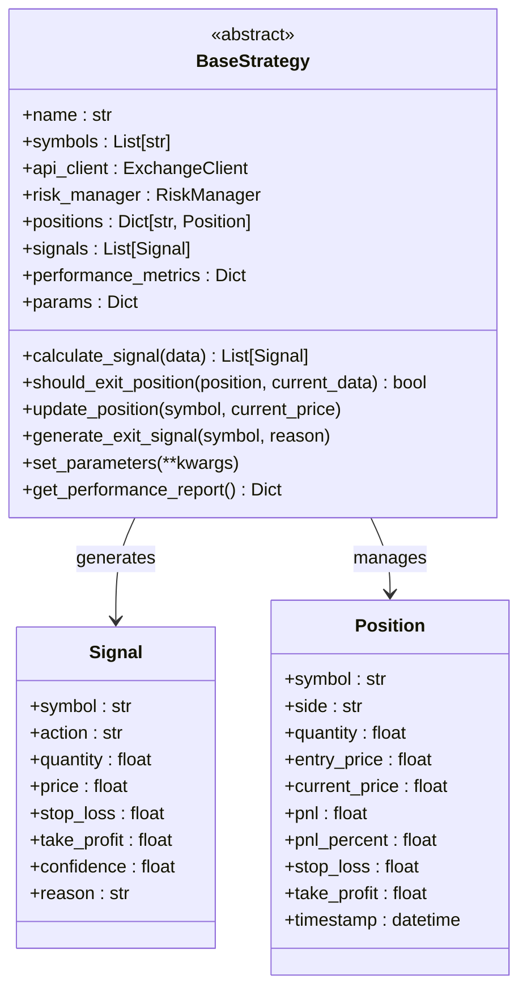
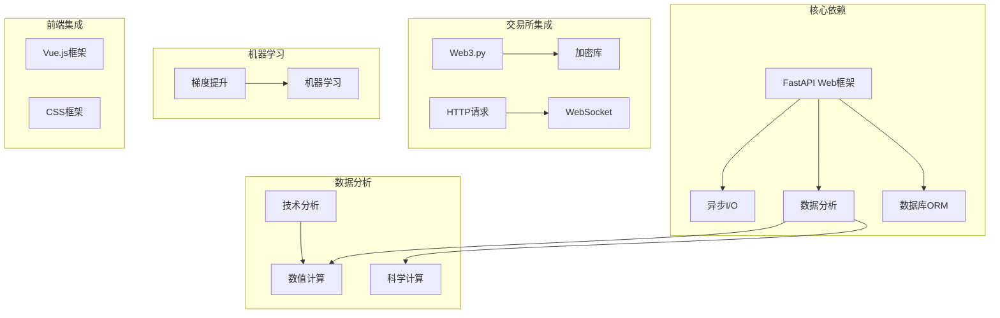

# 整体架构概览

<cite>
**本文档引用的文件**
- [main.py](file://backpack_quant_trading/main.py)
- [settings.py](file://backpack_quant_trading/config/settings.py)
- [live_trading.py](file://backpack_quant_trading/engine/live_trading.py)
- [backtest.py](file://backpack_quant_trading/engine/backtest.py)
- [base.py](file://backpack_quant_trading/strategy/base.py)
- [api_client.py](file://backpack_quant_trading/core/api_client.py)
- [grid_strategy.py](file://backpack_quant_trading/strategy/grid_strategy.py)
- [dual_freq_trend.py](file://backpack_quant_trading/strategy/dual_freq_trend.py)
- [requirements.txt](file://backpack_quant_trading/requirements.txt)
- [main.py](file://backpack_quant_trading/api/main.py)
- [trading.py](file://backpack_quant_trading/api/routers/trading.py)
- [deps.py](file://backpack_quant_trading/api/deps.py)
- [models.py](file://backpack_quant_trading/database/models.py)
</cite>

## 目录
1. [简介](#简介)
2. [项目结构](#项目结构)
3. [核心组件](#核心组件)
4. [架构概览](#架构概览)
5. [详细组件分析](#详细组件分析)
6. [依赖关系分析](#依赖关系分析)
7. [性能考量](#性能考量)
8. [故障排除指南](#故障排除指南)
9. [结论](#结论)

## 简介

本量化交易系统是一个模块化、可扩展的多交易所支持交易框架，旨在提供从策略开发到实盘交易的完整解决方案。系统采用策略解耦、交易引擎抽象和多交易所支持的设计理念，通过清晰的组件边界和标准化接口实现高度的可维护性和可扩展性。

## 项目结构

系统采用分层架构设计，主要分为以下层次：

**图表来源**
- [main.py:58-158](file://backpack_quant_trading/main.py#L58-L158)
- [settings.py:104-137](file://backpack_quant_trading/config/settings.py#L104-L137)

**章节来源**
- [main.py:1-344](file://backpack_quant_trading/main.py#L1-L344)
- [settings.py:1-137](file://backpack_quant_trading/config/settings.py#L1-L137)

## 核心组件

### 交易机器人核心

系统的核心是`TradingBot`类，它负责协调整个交易流程：

**图表来源**
- [main.py:58-158](file://backpack_quant_trading/main.py#L58-L158)
- [main.py:31-55](file://backpack_quant_trading/main.py#L31-L55)

### 配置管理系统

系统采用集中式配置管理，支持多交易所配置：

**图表来源**
- [settings.py:104-137](file://backpack_quant_trading/config/settings.py#L104-L137)
- [settings.py:12-42](file://backpack_quant_trading/config/settings.py#L12-L42)

**章节来源**
- [main.py:58-158](file://backpack_quant_trading/main.py#L58-L158)
- [settings.py:104-137](file://backpack_quant_trading/config/settings.py#L104-L137)

## 架构概览

系统采用"策略-引擎-交易所"三层架构，通过抽象接口实现解耦：

**图表来源**
- [base.py:41-212](file://backpack_quant_trading/strategy/base.py#L41-L212)
- [live_trading.py:347-535](file://backpack_quant_trading/engine/live_trading.py#L347-L535)
- [api_client.py:22-86](file://backpack_quant_trading/core/api_client.py#L22-L86)

## 详细组件分析

### 实盘交易引擎

实盘交易引擎是系统的核心执行单元，负责处理实时数据流和订单执行：

**图表来源**
- [live_trading.py:536-568](file://backpack_quant_trading/engine/live_trading.py#L536-L568)
- [live_trading.py:443-535](file://backpack_quant_trading/engine/live_trading.py#L443-L535)

### 回测引擎

回测引擎提供完整的策略回测功能，支持多标的并行回测：

**图表来源**
- [backtest.py:65-187](file://backpack_quant_trading/engine/backtest.py#L65-L187)

### 策略抽象层

策略基类定义了统一的接口规范，确保所有策略的一致性：

**图表来源**
- [base.py:41-212](file://backpack_quant_trading/strategy/base.py#L41-L212)

**章节来源**
- [live_trading.py:347-535](file://backpack_quant_trading/engine/live_trading.py#L347-L535)
- [backtest.py:48-187](file://backpack_quant_trading/engine/backtest.py#L48-L187)
- [base.py:41-212](file://backpack_quant_trading/strategy/base.py#L41-L212)

## 依赖关系分析

系统采用松耦合设计，通过接口抽象实现组件间的解耦：

**图表来源**
- [requirements.txt:1-61](file://backpack_quant_trading/requirements.txt#L1-L61)

**章节来源**
- [requirements.txt:1-61](file://backpack_quant_trading/requirements.txt#L1-L61)

## 性能考量

系统在设计时充分考虑了性能优化：

### 异步架构优势
- 使用asyncio实现高并发I/O操作
- WebSocket实时数据推送减少轮询开销
- 异步数据库操作提高吞吐量

### 缓存机制
- 交易所API响应缓存减少重复请求
- K线数据缓存提高回测效率
- 余额信息缓存降低API调用频率

### 内存管理
- 数据帧分批处理避免内存溢出
- 事件循环优化减少GC压力
- 对象池化减少对象创建开销

## 故障排除指南

### 常见问题诊断

**WebSocket连接问题**
- 检查网络代理配置
- 验证防火墙设置
- 确认交易所API可用性

**订单执行失败**
- 检查账户余额和保证金
- 验证交易对精度设置
- 确认风控参数配置

**性能问题**
- 监控CPU和内存使用率
- 检查数据库连接池配置
- 优化策略计算复杂度

**章节来源**
- [live_trading.py:153-235](file://backpack_quant_trading/engine/live_trading.py#L153-L235)
- [api_client.py:158-268](file://backpack_quant_trading/core/api_client.py#L158-L268)

## 结论

本量化交易系统通过模块化设计实现了策略解耦、交易引擎抽象和多交易所支持的完整架构。系统采用分层架构和接口抽象，确保了高度的可维护性和可扩展性。通过异步架构和缓存机制，系统在保证实时性的同时提升了性能表现。

未来演进方向包括：
- 增加更多交易所支持
- 扩展机器学习策略
- 优化实时数据处理能力
- 增强风险管理和合规功能