# 系统架构设计

<cite>
**本文档引用的文件**
- [main.py](file://backpack_quant_trading/main.py)
- [api/main.py](file://backpack_quant_trading/api/main.py)
- [config/settings.py](file://backpack_quant_trading/config/settings.py)
- [engine/live_trading.py](file://backpack_quant_trading/engine/live_trading.py)
- [engine/backtest.py](file://backpack_quant_trading/engine/backtest.py)
- [core/data_manager.py](file://backpack_quant_trading/core/data_manager.py)
- [core/risk_manager.py](file://backpack_quant_trading/core/risk_manager.py)
- [strategy/base.py](file://backpack_quant_trading/strategy/base.py)
- [strategy/mean_reversion.py](file://backpack_quant_trading/strategy/mean_reversion.py)
- [strategy/ai_adaptive.py](file://backpack_quant_trading/strategy/ai_adaptive.py)
- [strategy/grid_strategy.py](file://backpack_quant_trading/strategy/grid_strategy.py)
- [requirements.txt](file://backpack_quant_trading/requirements.txt)
- [docs/DATA_SOURCE_AND_CACHE.md](file://backpack_quant_trading/docs/DATA_SOURCE_AND_CACHE.md)
- [FRONTEND_README.md](file://backpack_quant_trading/FRONTEND_README.md)
- [api接入文档.md](file://backpack_quant_trading/api接入文档.md)
</cite>

## 目录
1. [简介](#简介)
2. [项目结构](#项目结构)
3. [核心组件](#核心组件)
4. [架构概览](#架构概览)
5. [详细组件分析](#详细组件分析)
6. [依赖关系分析](#依赖关系分析)
7. [性能考虑](#性能考虑)
8. [故障排除指南](#故障排除指南)
9. [结论](#结论)
10. [附录](#附录)

## 简介

Backpack 量化交易系统是一个基于 Python 的高性能量化交易框架，支持多种交易策略和实时数据处理。该系统采用模块化设计，集成了回测引擎、实盘交易引擎、风险管理、数据管理等多个核心组件，为用户提供完整的量化交易解决方案。

系统支持多种交易所集成（Backpack、Deepcoin、Hyperliquid、Ostium），提供多种交易策略（均值回归、AI自适应、网格交易等），并通过现代化的前端界面提供直观的操作体验。

## 项目结构

系统采用清晰的分层架构设计，主要分为以下几个层次：

```mermaid
graph TB
subgraph "应用层"
Frontend[前端界面<br/>Vue3 + Element Plus]
API[API网关<br/>FastAPI]
end
subgraph "业务逻辑层"
Engine[交易引擎<br/>回测/实盘]
Strategy[策略引擎<br/>多策略支持]
Risk[风险管理<br/>风控控制]
end
subgraph "数据层"
DataManager[数据管理<br/>K线/深度数据]
Database[(数据库)<br/>MySQL]
end
subgraph "集成层"
Exchanges[交易所集成<br/>API客户端]
Webhooks[Webhook服务<br/>TradingView]
end
Frontend --> API
API --> Engine
Engine --> Strategy
Engine --> Risk
Strategy --> DataManager
Risk --> DataManager
DataManager --> Database
Engine --> Exchanges
Engine --> Webhooks
```

**图表来源**
- [main.py:58-158](file://backpack_quant_trading/main.py#L58-L158)
- [api/main.py:14-53](file://backpack_quant_trading/api/main.py#L14-L53)

**章节来源**
- [main.py:1-344](file://backpack_quant_trading/main.py#L1-L344)
- [FRONTEND_README.md:1-78](file://backpack_quant_trading/FRONTEND_README.md#L1-L78)

## 核心组件

### 交易机器人核心

TradingBot 作为系统的核心控制器，负责协调各个组件的工作：

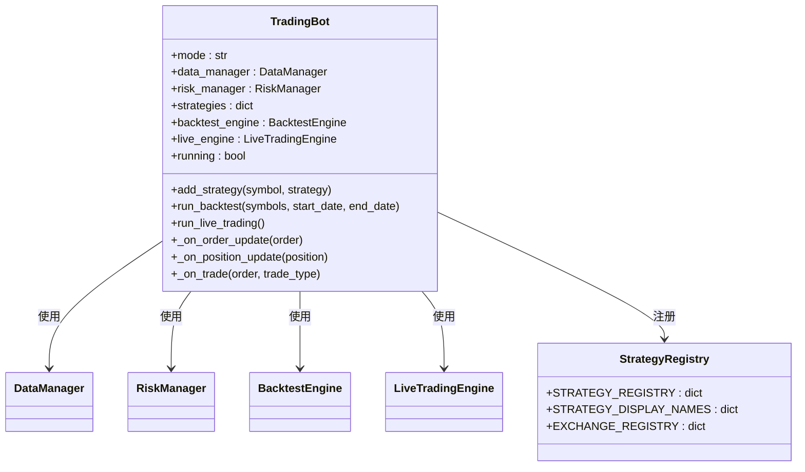

**图表来源**
- [main.py:58-158](file://backpack_quant_trading/main.py#L58-L158)
- [main.py:31-55](file://backpack_quant_trading/main.py#L31-L55)

### 数据管理器

DataManager 负责市场数据的获取、处理和缓存：

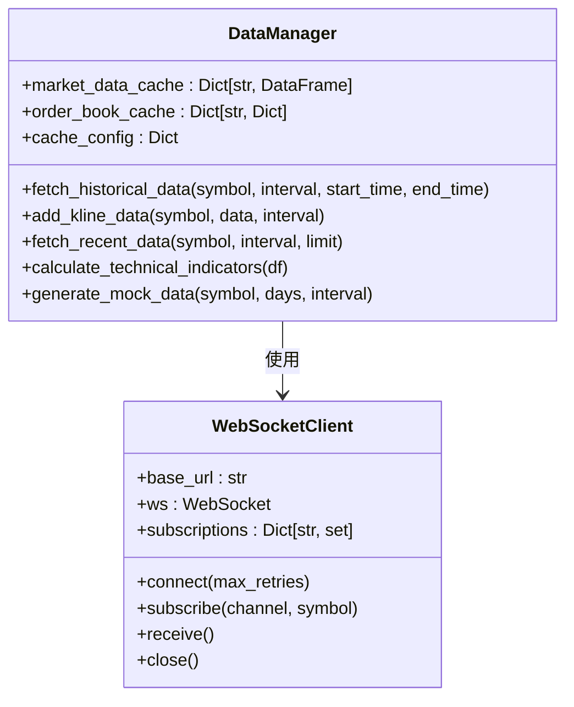

**图表来源**
- [core/data_manager.py:18-518](file://backpack_quant_trading/core/data_manager.py#L18-L518)
- [engine/live_trading.py:126-345](file://backpack_quant_trading/engine/live_trading.py#L126-L345)

### 风险管理器

RiskManager 提供全面的风险控制机制：

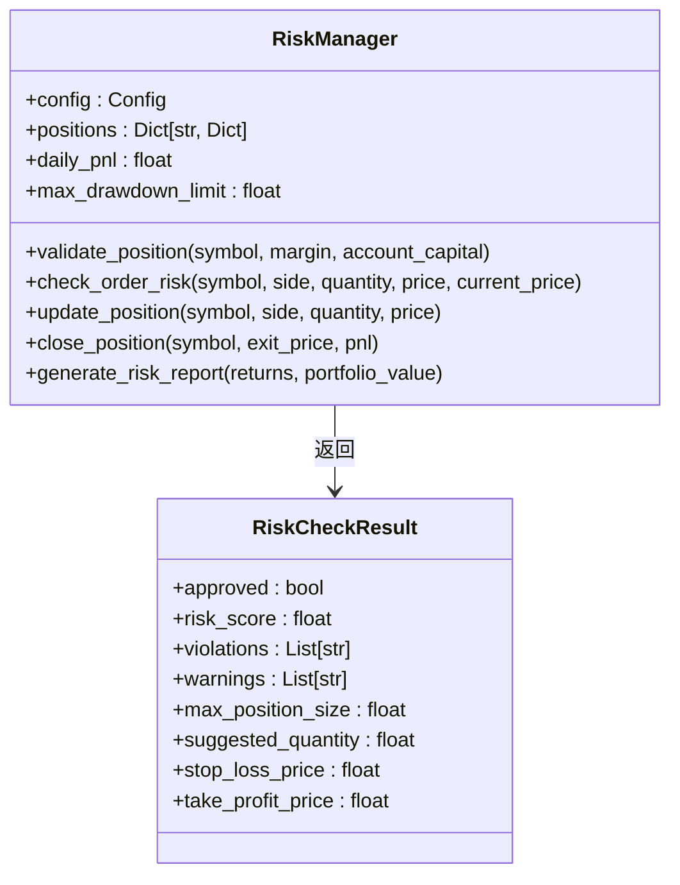

**图表来源**
- [core/risk_manager.py:48-566](file://backpack_quant_trading/core/risk_manager.py#L48-L566)

**章节来源**
- [main.py:58-158](file://backpack_quant_trading/main.py#L58-L158)
- [core/data_manager.py:18-518](file://backpack_quant_trading/core/data_manager.py#L18-L518)
- [core/risk_manager.py:48-566](file://backpack_quant_trading/core/risk_manager.py#L48-L566)

## 架构概览

系统采用事件驱动的异步架构，支持实时数据流和批量数据处理：

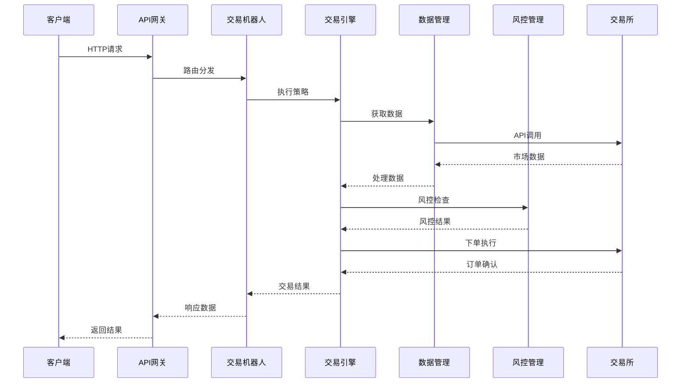

**图表来源**
- [api/main.py:36-48](file://backpack_quant_trading/api/main.py#L36-L48)
- [main.py:116-149](file://backpack_quant_trading/main.py#L116-L149)

### 设计模式应用

系统广泛采用了多种设计模式：

#### 策略模式
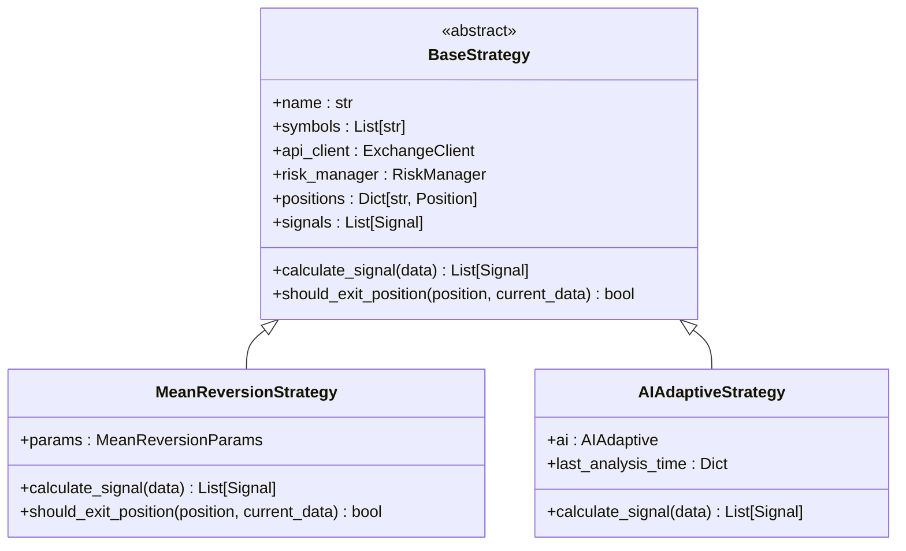

**图表来源**
- [strategy/base.py:41-212](file://backpack_quant_trading/strategy/base.py#L41-L212)
- [strategy/mean_reversion.py:23-263](file://backpack_quant_trading/strategy/mean_reversion.py#L23-L263)
- [strategy/ai_adaptive.py:12-881](file://backpack_quant_trading/strategy/ai_adaptive.py#L12-L881)

#### 工厂模式
系统使用工厂模式动态创建策略和交易所客户端：

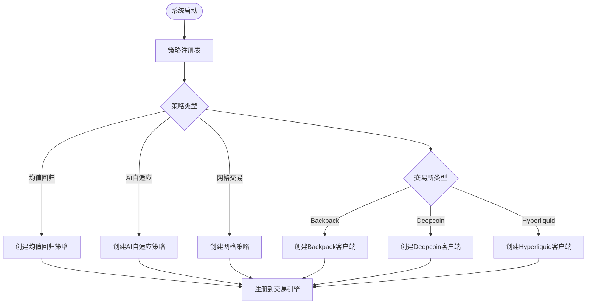

**图表来源**
- [main.py:31-55](file://backpack_quant_trading/main.py#L31-L55)

#### 观察者模式
系统实现观察者模式用于事件通知：

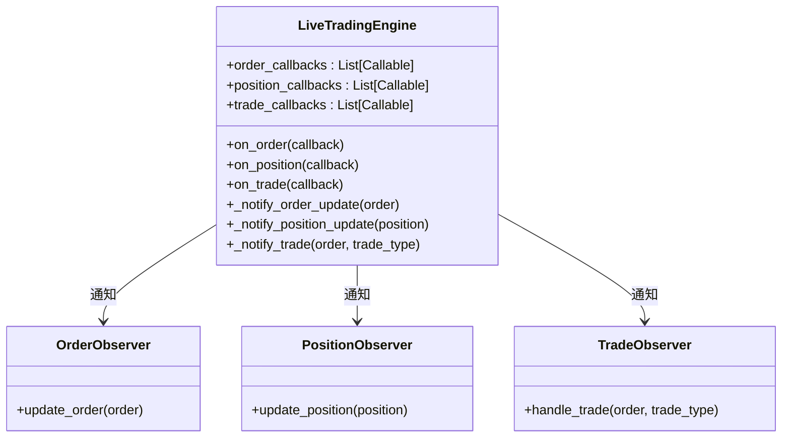

**图表来源**
- [engine/live_trading.py:699-743](file://backpack_quant_trading/engine/live_trading.py#L699-L743)

**章节来源**
- [strategy/base.py:41-212](file://backpack_quant_trading/strategy/base.py#L41-L212)
- [main.py:31-55](file://backpack_quant_trading/main.py#L31-L55)
- [engine/live_trading.py:699-743](file://backpack_quant_trading/engine/live_trading.py#L699-L743)

## 详细组件分析

### 回测引擎

回测引擎提供完整的策略回测功能：

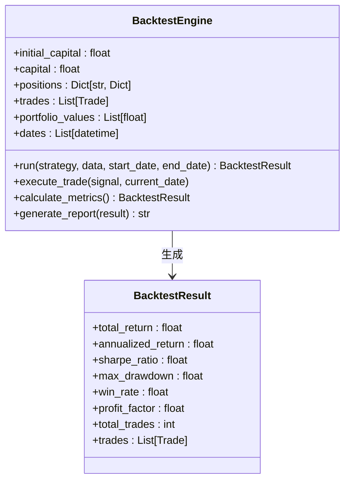

**图表来源**
- [engine/backtest.py:48-404](file://backpack_quant_trading/engine/backtest.py#L48-L404)

### 实盘交易引擎

实盘交易引擎支持多交易所集成和实时数据处理：

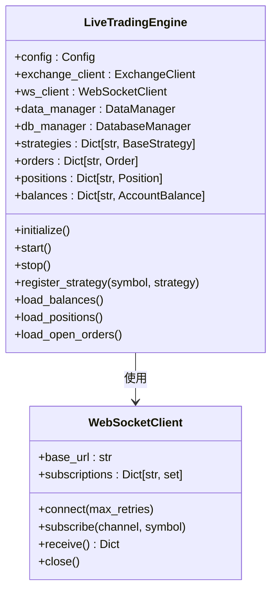

**图表来源**
- [engine/live_trading.py:347-800](file://backpack_quant_trading/engine/live_trading.py#L347-L800)

### 网格交易策略

网格交易策略提供自动化交易功能：

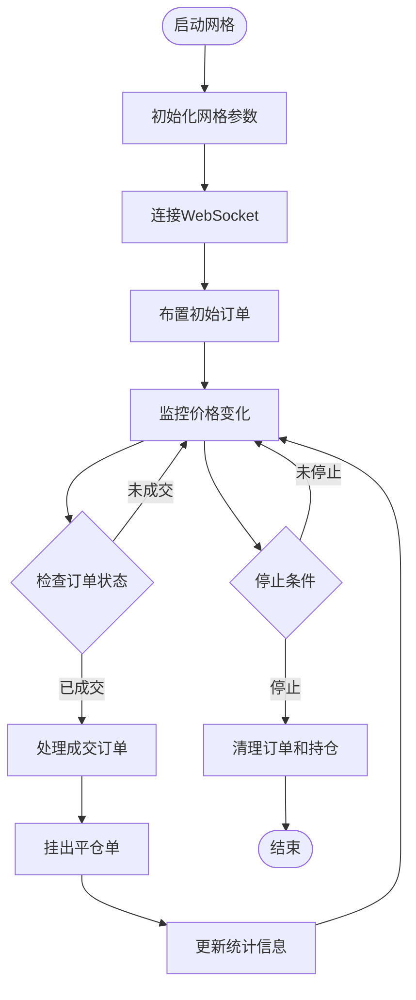

**图表来源**
- [strategy/grid_strategy.py:179-597](file://backpack_quant_trading/strategy/grid_strategy.py#L179-L597)

**章节来源**
- [engine/backtest.py:48-404](file://backpack_quant_trading/engine/backtest.py#L48-L404)
- [engine/live_trading.py:347-800](file://backpack_quant_trading/engine/live_trading.py#L347-L800)
- [strategy/grid_strategy.py:179-597](file://backpack_quant_trading/strategy/grid_strategy.py#L179-L597)

## 依赖关系分析

系统采用模块化设计，各组件之间的依赖关系清晰：

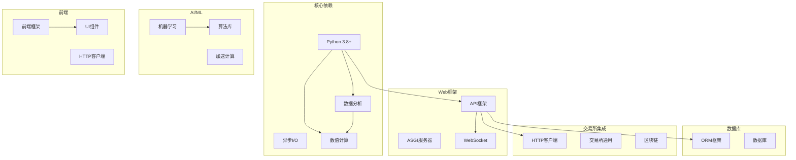

**图表来源**
- [requirements.txt:1-61](file://backpack_quant_trading/requirements.txt#L1-L61)

### 第三方依赖管理

系统使用 requirements.txt 统一管理依赖：

| 依赖类别 | 主要包 | 版本要求 | 用途 |
|---------|--------|----------|------|
| 核心框架 | aiohttp, websockets, requests | >=3.9.0, >=12.0, >=2.31.0 | 异步网络通信 |
| 数据处理 | pandas, numpy, scipy | >=2.0.0, >=1.24.0, >=1.11.0 | 数据分析和科学计算 |
| Web框架 | fastapi, uvicorn, gunicorn | >=0.104.0, >=0.24.0, >=21.2.0 | API服务和服务器 |
| 数据库 | SQLAlchemy, pymysql | >=2.0.0, >=1.1.0 | 数据持久化 |
| 加密安全 | cryptography, PyJWT, passlib | >=41.0.0, >=2.8.0, >=1.7.4 | 安全认证 |
| 可视化 | matplotlib, plotly, dash | >=3.7.0, >=5.18.0, >=2.11.0 | 数据可视化 |
| 机器学习 | lightgbm, scikit-learn | >=4.0.0, >=1.3.0 | AI策略支持 |

**章节来源**
- [requirements.txt:1-61](file://backpack_quant_trading/requirements.txt#L1-L61)

## 性能考虑

### 缓存策略

系统实现了多层次的缓存机制：

1. **数据缓存**：内存中的市场数据缓存，支持TTL过期
2. **订单簿缓存**：深度数据缓存，减少API调用频率
3. **余额缓存**：账户余额缓存，避免频繁查询
4. **策略缓存**：AI分析结果缓存，提高响应速度

### 异步处理

系统采用异步编程模型：

- **WebSocket实时数据**：非阻塞的实时数据订阅
- **批量API调用**：并发处理多个交易所的API请求
- **事件驱动架构**：基于回调的事件处理机制

### 性能优化

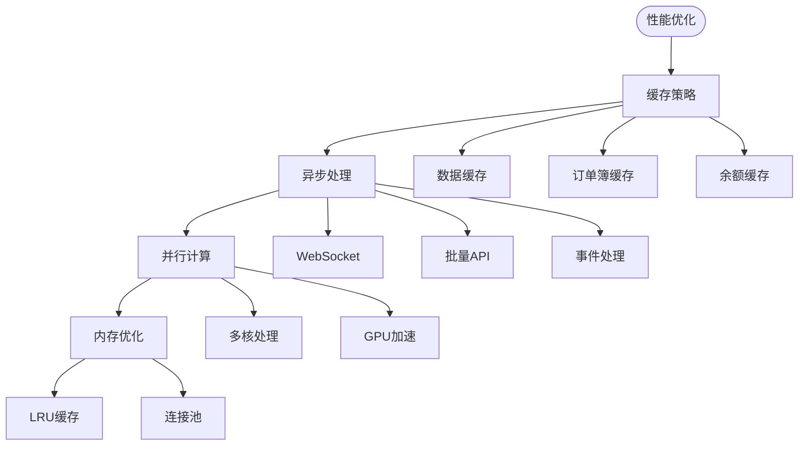

## 故障排除指南

### 常见问题诊断

#### 连接问题
- **WebSocket连接失败**：检查网络代理设置和防火墙配置
- **API认证失败**：验证API密钥和签名参数
- **交易所连接超时**：检查交易所API状态和服务质量

#### 性能问题
- **数据延迟**：检查网络带宽和服务器性能
- **内存泄漏**：监控缓存使用情况和对象生命周期
- **CPU使用率高**：优化算法复杂度和数据处理流程

#### 风控问题
- **仓位超限**：检查风险配置和账户资金
- **止损触发频繁**：调整止损参数和市场波动性
- **回撤过大**：优化策略参数和风险管理

**章节来源**
- [engine/live_trading.py:153-235](file://backpack_quant_trading/engine/live_trading.py#L153-L235)
- [core/risk_manager.py:87-130](file://backpack_quant_trading/core/risk_manager.py#L87-L130)

## 结论

Backpack 量化交易系统采用现代化的架构设计，提供了完整而灵活的量化交易解决方案。系统的主要优势包括：

1. **模块化设计**：清晰的组件分离和职责划分
2. **多策略支持**：灵活的策略注册和扩展机制
3. **实时处理**：高效的异步数据处理和事件驱动架构
4. **风险控制**：全面的风险管理和合规控制
5. **可扩展性**：支持多种交易所和数据源集成

系统通过采用多种设计模式（策略模式、工厂模式、观察者模式）实现了高度的灵活性和可维护性。同时，完善的缓存机制和异步处理确保了系统的高性能和稳定性。

## 附录

### 部署要求

#### 硬件要求
- **CPU**：Intel i5 或同等AMD处理器
- **内存**：8GB RAM（推荐16GB）
- **存储**：50GB 可用空间
- **网络**：稳定的互联网连接

#### 软件要求
- **操作系统**：Windows 10+/Linux/macOS
- **Python**：3.8+
- **数据库**：MySQL 5.7+

#### 环境变量配置

| 变量名 | 描述 | 默认值 |
|--------|------|--------|
| DB_HOST | 数据库主机 | localhost |
| DB_PORT | 数据库端口 | 3306 |
| DB_USER | 数据库用户名 | root |
| DB_PASSWORD | 数据库密码 | zyf200018 |
| BACKPACK_API_KEY | Backpack API密钥 | 空 |
| BACKPACK_PRIVATE_KEY | Backpack私钥 | 空 |

### 监控和日志

系统提供全面的监控和日志功能：

- **系统日志**：详细的系统运行日志
- **交易日志**：完整的交易活动记录
- **性能监控**：实时性能指标监控
- **告警系统**：异常情况自动告警

### 安全考虑

系统实施了多层次的安全措施：

- **API认证**：基于JWT的认证机制
- **数据加密**：敏感数据的加密存储
- **访问控制**：细粒度的权限管理
- **审计日志**：完整的操作审计记录