# 依赖注入模式

<cite>
**本文档引用的文件**
- [main.py](file://backpack_quant_trading/main.py)
- [api_client.py](file://backpack_quant_trading/core/api_client.py)
- [risk_manager.py](file://backpack_quant_trading/core/risk_manager.py)
- [data_manager.py](file://backpack_quant_trading/core/data_manager.py)
- [base.py](file://backpack_quant_trading/strategy/base.py)
- [mean_reversion.py](file://backpack_quant_trading/strategy/mean_reversion.py)
- [live_trading.py](file://backpack_quant_trading/engine/live_trading.py)
- [settings.py](file://backpack_quant_trading/config/settings.py)
- [deps.py](file://backpack_quant_trading/api/deps.py)
</cite>

## 目录
1. [简介](#简介)
2. [项目结构](#项目结构)
3. [核心组件](#核心组件)
4. [架构概览](#架构概览)
5. [详细组件分析](#详细组件分析)
6. [依赖分析](#依赖分析)
7. [性能考虑](#性能考虑)
8. [故障排除指南](#故障排除指南)
9. [结论](#结论)

## 简介

本文件深入分析量化交易系统中的依赖注入模式实现。该系统通过精心设计的依赖注入机制，实现了策略、数据管理器、风险控制等核心组件的松耦合组合，为实盘交易提供了高度灵活和可扩展的架构。

系统采用多种依赖注入模式：
- **构造函数注入**：用于核心组件的必需依赖
- **属性注入**：用于可选的运行时依赖
- **接口注入**：通过抽象接口实现跨平台兼容

## 项目结构

量化交易系统采用模块化架构，主要分为以下几个核心层次：

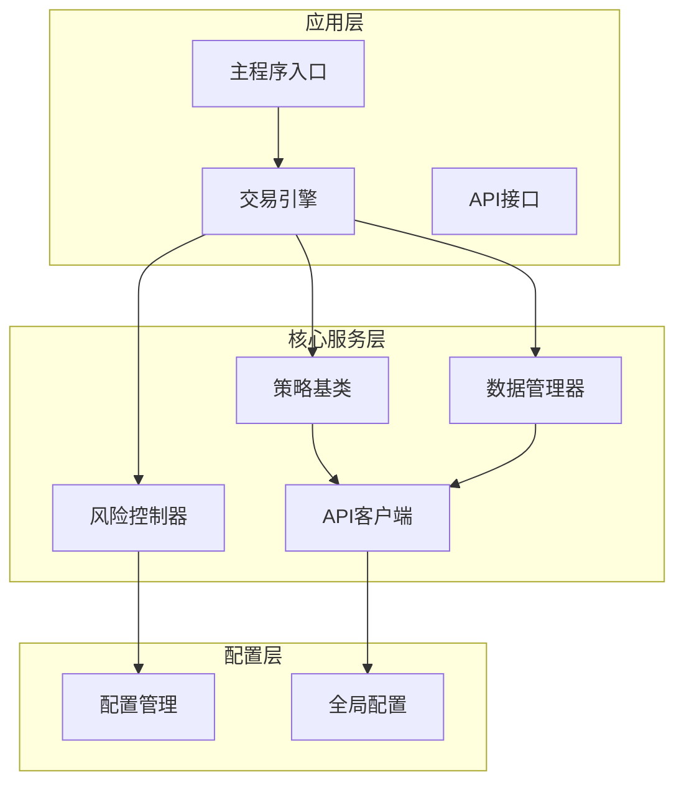

**图表来源**
- [main.py:58-158](file://backpack_quant_trading/main.py#L58-L158)
- [api_client.py:22-86](file://backpack_quant_trading/core/api_client.py#L22-L86)
- [risk_manager.py:48-53](file://backpack_quant_trading/core/risk_manager.py#L48-L53)

**章节来源**
- [main.py:1-344](file://backpack_quant_trading/main.py#L1-L344)
- [settings.py:104-137](file://backpack_quant_trading/config/settings.py#L104-L137)

## 核心组件

### 交易机器人 (TradingBot)

TradingBot是系统的核心协调器，负责管理所有交易相关的组件：

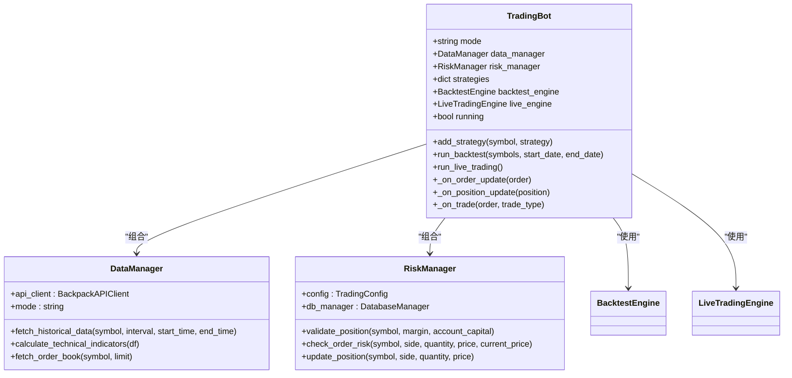

**图表来源**
- [main.py:58-158](file://backpack_quant_trading/main.py#L58-L158)
- [data_manager.py:18-35](file://backpack_quant_trading/core/data_manager.py#L18-L35)
- [risk_manager.py:48-53](file://backpack_quant_trading/core/risk_manager.py#L48-L53)

### 策略基类 (BaseStrategy)

策略基类定义了所有交易策略的通用接口和行为：

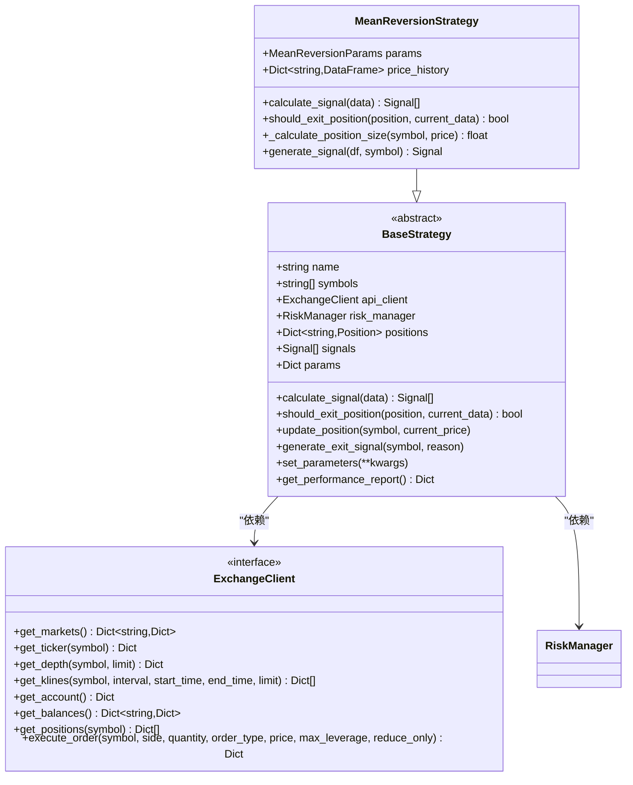

**图表来源**
- [base.py:41-212](file://backpack_quant_trading/strategy/base.py#L41-L212)
- [mean_reversion.py:23-263](file://backpack_quant_trading/strategy/mean_reversion.py#L23-L263)
- [api_client.py:22-86](file://backpack_quant_trading/core/api_client.py#L22-L86)

**章节来源**
- [base.py:41-212](file://backpack_quant_trading/strategy/base.py#L41-L212)
- [mean_reversion.py:23-263](file://backpack_quant_trading/strategy/mean_reversion.py#L23-L263)

## 架构概览

系统采用分层架构设计，通过依赖注入实现组件间的松耦合：

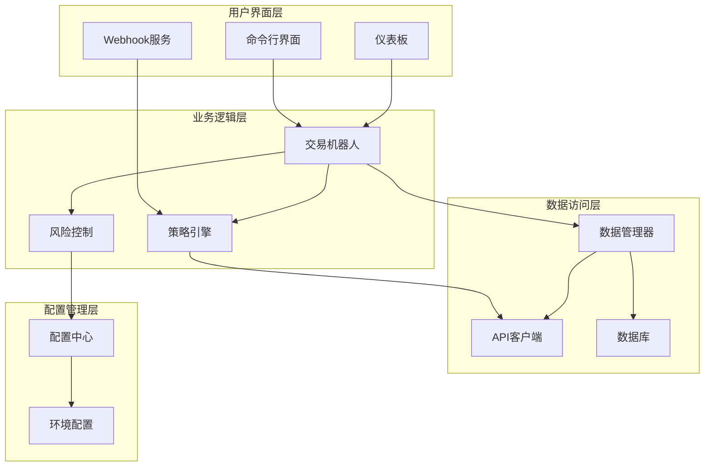

**图表来源**
- [main.py:197-286](file://backpack_quant_trading/main.py#L197-L286)
- [live_trading.py:347-402](file://backpack_quant_trading/engine/live_trading.py#L347-L402)

## 详细组件分析

### 依赖注入模式实现

#### 构造函数注入

系统广泛使用构造函数注入来确保组件的必需依赖在创建时就得到满足：

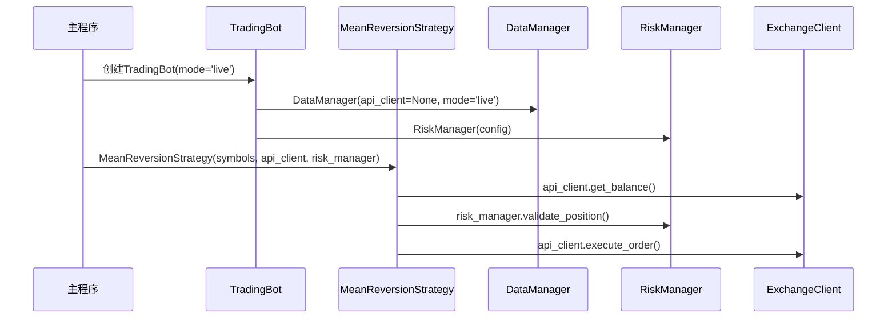

**图表来源**
- [main.py:197-286](file://backpack_quant_trading/main.py#L197-L286)
- [mean_reversion.py:26-29](file://backpack_quant_trading/strategy/mean_reversion.py#L26-L29)

#### 属性注入

在运行时，系统通过属性注入的方式动态设置依赖：

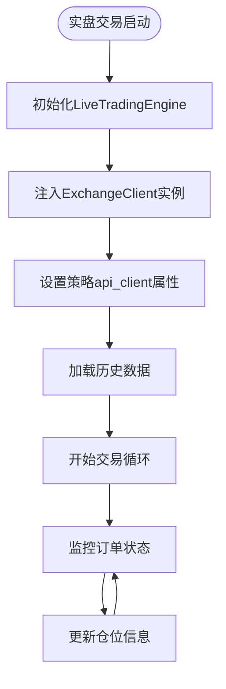

**图表来源**
- [main.py:132-136](file://backpack_quant_trading/main.py#L132-L136)
- [live_trading.py:353-361](file://backpack_quant_trading/engine/live_trading.py#L353-L361)

#### 接口注入

通过抽象接口实现跨平台兼容性：

**章节来源**
- [main.py:58-158](file://backpack_quant_trading/main.py#L58-L158)
- [api_client.py:22-86](file://backpack_quant_trading/core/api_client.py#L22-L86)

### 策略类依赖注入分析

#### MeanReversionStrategy的依赖注入

MeanReversionStrategy展示了完整的依赖注入模式：

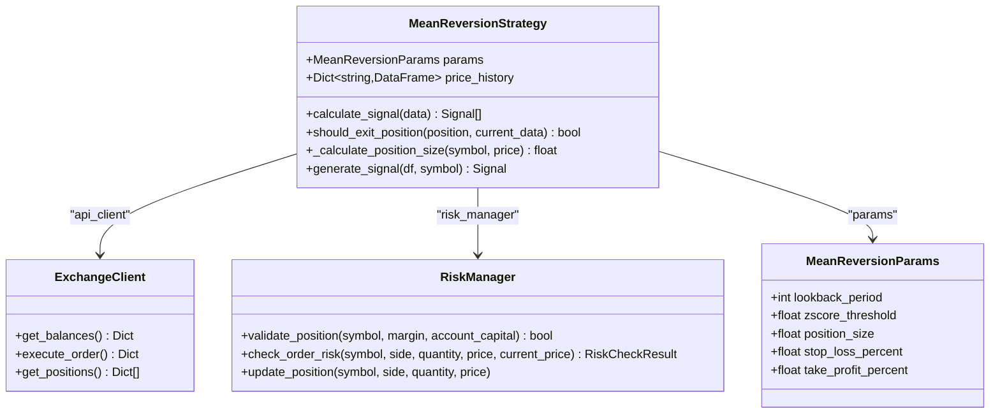

**图表来源**
- [mean_reversion.py:13-30](file://backpack_quant_trading/strategy/mean_reversion.py#L13-L30)
- [mean_reversion.py:151-247](file://backpack_quant_trading/strategy/mean_reversion.py#L151-L247)

#### 策略执行流程中的依赖使用

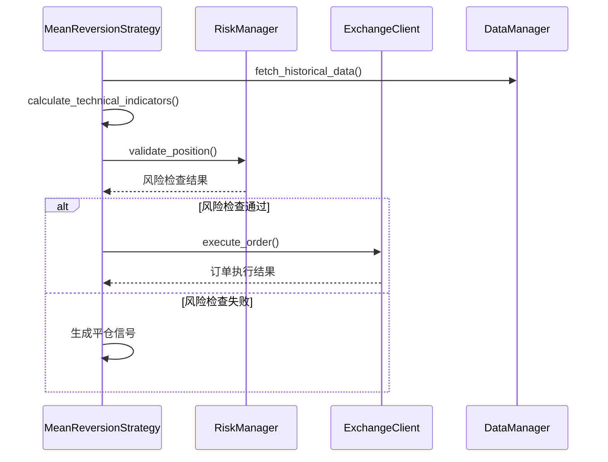

**图表来源**
- [mean_reversion.py:75-117](file://backpack_quant_trading/strategy/mean_reversion.py#L75-L117)
- [mean_reversion.py:227-231](file://backpack_quant_trading/strategy/mean_reversion.py#L227-L231)

**章节来源**
- [mean_reversion.py:13-263](file://backpack_quant_trading/strategy/mean_reversion.py#L13-L263)

### 依赖注入容器使用示例

虽然系统没有显式的依赖注入容器，但可以通过以下方式实现类似功能：

#### 策略注册表模式

```python
# 策略注册表（类似DI容器的注册机制）
STRATEGY_REGISTRY: dict[str, Any] = {
    "mean_reversion": MeanReversionStrategy,
    "ai_adaptive": AIAdaptiveStrategy,
    "dual_freq_trend": DualFreqTrendResonanceStrategy,
}

# 交易所注册表
EXCHANGE_REGISTRY: dict[str, Any] = {
    "backpack": BackpackAPIClient,
    "deepcoin": DeepcoinAPIClient,
    "hyperliquid": HyperliquidAPIClient,
}
```

#### 动态依赖解析

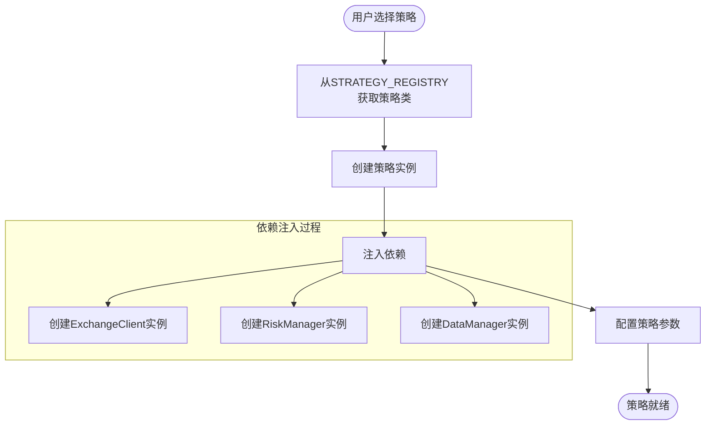

**图表来源**
- [main.py:31-55](file://backpack_quant_trading/main.py#L31-L55)
- [main.py:225-252](file://backpack_quant_trading/main.py#L225-L252)

**章节来源**
- [main.py:31-55](file://backpack_quant_trading/main.py#L31-L55)
- [main.py:225-252](file://backpack_quant_trading/main.py#L225-L252)

## 依赖分析

### 组件耦合度分析

系统通过依赖注入实现了良好的模块化：

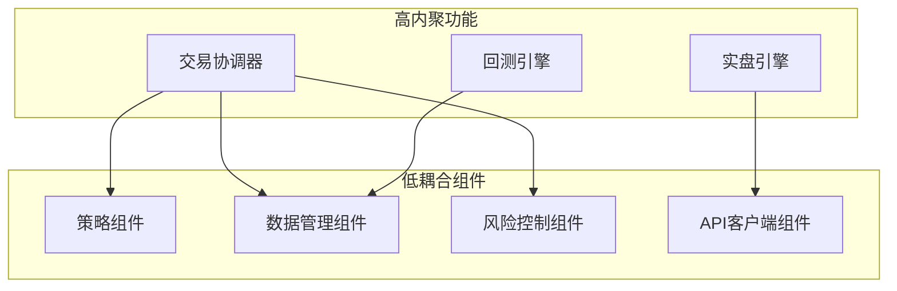

**图表来源**
- [main.py:58-158](file://backpack_quant_trading/main.py#L58-L158)
- [live_trading.py:347-402](file://backpack_quant_trading/engine/live_trading.py#L347-L402)

### 依赖关系复杂度

系统采用分层依赖管理，避免了循环依赖：

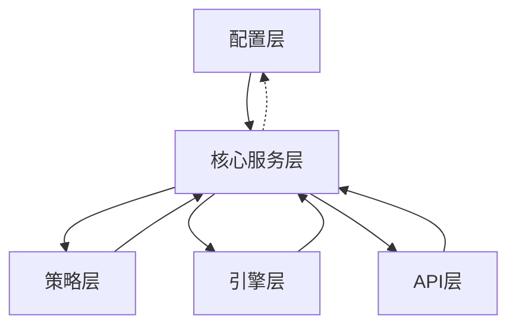

**图表来源**
- [settings.py:104-137](file://backpack_quant_trading/config/settings.py#L104-L137)
- [api_client.py:87-141](file://backpack_quant_trading/core/api_client.py#L87-L141)

**章节来源**
- [settings.py:104-137](file://backpack_quant_trading/config/settings.py#L104-L137)
- [api_client.py:87-141](file://backpack_quant_trading/core/api_client.py#L87-L141)

## 性能考虑

### 依赖注入的性能影响

依赖注入在提供灵活性的同时，也会带来一定的性能开销：

1. **对象创建成本**：每次创建组件实例时需要解析依赖关系
2. **内存占用**：依赖图的维护增加了内存使用
3. **调用开销**：通过接口调用相比直接方法调用有轻微开销

### 优化策略

1. **懒加载**：只在需要时创建昂贵的依赖对象
2. **对象池**：对频繁创建的对象使用对象池模式
3. **缓存策略**：对计算密集型操作使用缓存

## 故障排除指南

### 常见依赖注入问题

#### 依赖缺失错误

当策略缺少必需的依赖时，系统会抛出相应的异常：

```python
# 检查api_client是否正确注入
if strategy.api_client is None:
    raise ValueError("策略缺少api_client依赖")

# 检查risk_manager是否正确注入
if strategy.risk_manager is None:
    raise ValueError("策略缺少risk_manager依赖")
```

#### 依赖循环问题

系统通过接口抽象避免了依赖循环：

```mermaid
flowchart LR
Strategy --> |接口依赖| ExchangeClient
ExchangeClient --> |实现| ConcreteExchange
ConcreteExchange --> |数据访问| Database
Database --> |配置| Config
Config --> |策略| Strategy
# 通过接口抽象避免直接循环依赖
```

**图表来源**
- [api_client.py:22-86](file://backpack_quant_trading/core/api_client.py#L22-L86)

**章节来源**
- [api_client.py:22-86](file://backpack_quant_trading/core/api_client.py#L22-L86)

## 结论

量化交易系统的依赖注入模式实现了以下关键优势：

1. **松耦合设计**：通过接口抽象和构造函数注入，实现了组件间的低耦合
2. **可测试性**：依赖注入使得单元测试变得简单，可以轻松替换依赖为模拟对象
3. **配置灵活性**：通过配置中心和注册表，系统支持动态配置和运行时切换
4. **组件复用**：接口注入模式使得策略可以在不同的交易所实现间无缝切换
5. **扩展性**：新的策略和组件可以轻松集成到现有架构中

最佳实践包括：
- 优先使用构造函数注入获取必需依赖
- 使用属性注入处理可选依赖
- 通过接口抽象实现跨平台兼容
- 建立清晰的依赖层次结构
- 实施适当的错误处理和依赖验证机制

这种依赖注入模式为量化交易系统提供了坚实的技术基础，支持从简单的均值回归策略到复杂的多市场网格交易等多种交易场景。