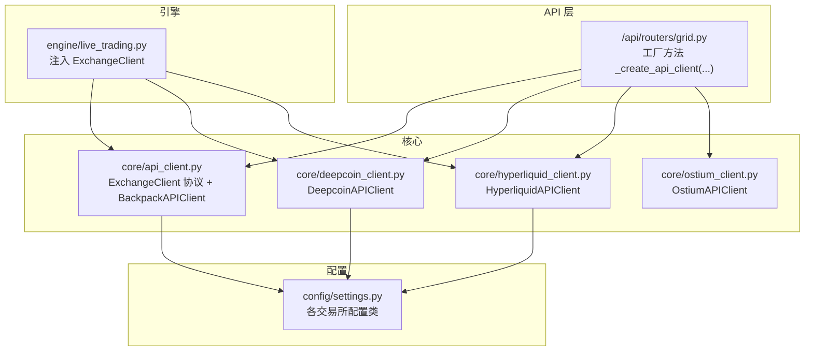
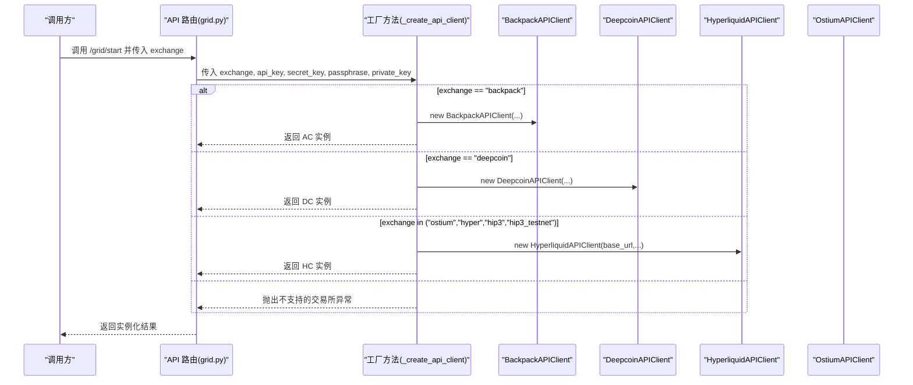
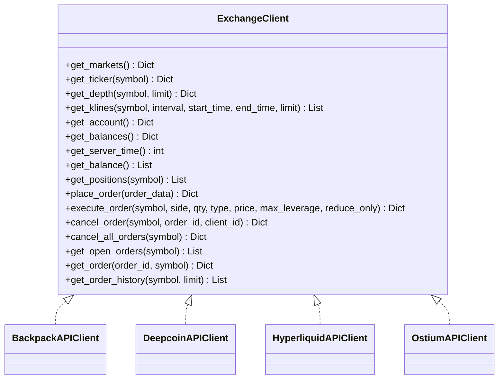
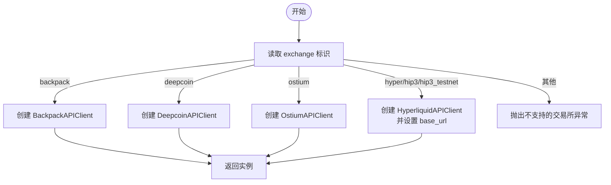
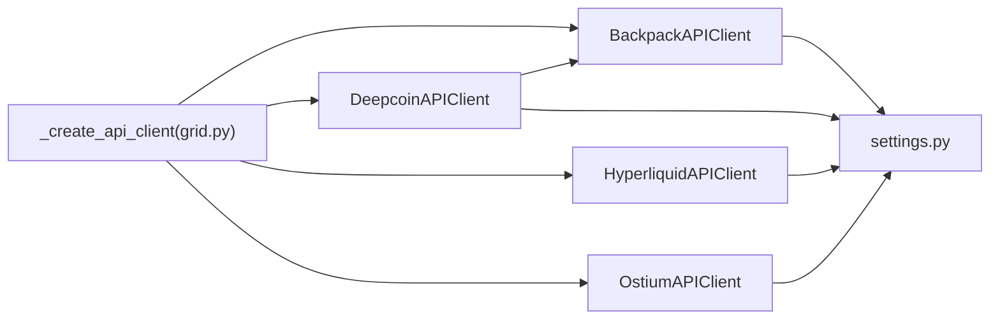

# 工厂模式

<cite>
**本文引用的文件**
- [api_client.py](file://backpack_quant_trading/core/api_client.py)
- [deepcoin_client.py](file://backpack_quant_trading/core/deepcoin_client.py)
- [hyperliquid_client.py](file://backpack_quant_trading/core/hyperliquid_client.py)
- [ostium_client.py](file://backpack_quant_trading/core/ostium_client.py)
- [grid.py](file://backpack_quant_trading/api/routers/grid.py)
- [live_trading.py](file://backpack_quant_trading/engine/live_trading.py)
- [settings.py](file://backpack_quant_trading/config/settings.py)
</cite>

## 目录
1. [简介](#简介)
2. [项目结构](#项目结构)
3. [核心组件](#核心组件)
4. [架构总览](#架构总览)
5. [详细组件分析](#详细组件分析)
6. [依赖关系分析](#依赖关系分析)
7. [性能考量](#性能考量)
8. [故障排查指南](#故障排查指南)
9. [结论](#结论)
10. [附录](#附录)

## 简介
本文围绕量化交易系统中的“工厂模式”展开，重点阐述交易所客户端工厂的实现机制与使用方法，包括：
- 通过字符串标识动态创建不同交易所客户端的能力
- 交易所客户端的抽象接口与具体实现差异
- 工厂方法的调用流程与典型使用场景
- 新交易所接入的步骤与最佳实践
- 工厂模式在系统扩展性、代码解耦与运行时灵活性方面的价值

## 项目结构
本项目采用“按功能域+按职责”的混合组织方式，核心的工厂与客户端位于 core 目录，API 层在 api/routers，引擎层在 engine，配置在 config。工厂模式主要体现在 API 层的路由中，通过字符串标识选择不同的交易所客户端实现。

图表来源
- [grid.py:42-67](file://backpack_quant_trading/api/routers/grid.py#L42-L67)
- [api_client.py:22-85](file://backpack_quant_trading/core/api_client.py#L22-L85)
- [deepcoin_client.py:18-41](file://backpack_quant_trading/core/deepcoin_client.py#L18-L41)
- [hyperliquid_client.py:18-53](file://backpack_quant_trading/core/hyperliquid_client.py#L18-L53)
- [ostium_client.py:19-51](file://backpack_quant_trading/core/ostium_client.py#L19-L51)
- [settings.py:104-132](file://backpack_quant_trading/config/settings.py#L104-L132)
- [live_trading.py:353-369](file://backpack_quant_trading/engine/live_trading.py#L353-L369)

章节来源
- [grid.py:42-67](file://backpack_quant_trading/api/routers/grid.py#L42-L67)
- [api_client.py:22-85](file://backpack_quant_trading/core/api_client.py#L22-L85)
- [deepcoin_client.py:18-41](file://backpack_quant_trading/core/deepcoin_client.py#L18-L41)
- [hyperliquid_client.py:18-53](file://backpack_quant_trading/core/hyperliquid_client.py#L18-L53)
- [ostium_client.py:19-51](file://backpack_quant_trading/core/ostium_client.py#L19-L51)
- [settings.py:104-132](file://backpack_quant_trading/config/settings.py#L104-L132)
- [live_trading.py:353-369](file://backpack_quant_trading/engine/live_trading.py#L353-L369)

## 核心组件
- 交易所抽象接口：ExchangeClient 协议定义了统一的市场、账户、订单等方法，确保不同交易所客户端可互换。
- 具体客户端：
  - BackpackAPIClient：Backpack 交易所的 REST/WebSocket 客户端实现
  - DeepcoinAPIClient：Deepcoin 交易所的 REST 客户端实现，内部持有 Backpack 数据客户端
  - HyperliquidAPIClient：Hyperliquid/Ostium 交易所的 REST 客户端实现
  - OstiumAPIClient：Ostium 交易所的 SDK 客户端实现
- 工厂方法：在 API 路由中根据 exchange 字符串标识动态创建对应客户端实例
- 配置中心：settings.py 提供各交易所的配置类，工厂方法读取配置并传递给客户端

章节来源
- [api_client.py:22-85](file://backpack_quant_trading/core/api_client.py#L22-L85)
- [deepcoin_client.py:18-41](file://backpack_quant_trading/core/deepcoin_client.py#L18-L41)
- [hyperliquid_client.py:18-53](file://backpack_quant_trading/core/hyperliquid_client.py#L18-L53)
- [ostium_client.py:19-51](file://backpack_quant_trading/core/ostium_client.py#L19-L51)
- [grid.py:42-67](file://backpack_quant_trading/api/routers/grid.py#L42-L67)
- [settings.py:104-132](file://backpack_quant_trading/config/settings.py#L104-L132)

## 架构总览
工厂模式在本系统中的作用：
- 在运行时根据 exchange 标识选择具体交易所客户端
- 通过 ExchangeClient 协议屏蔽底层差异，使上层策略与引擎无需感知具体交易所
- 通过注入式设计，允许在引擎层动态替换下单客户端，提升灵活性

图表来源
- [grid.py:42-67](file://backpack_quant_trading/api/routers/grid.py#L42-L67)

章节来源
- [grid.py:42-67](file://backpack_quant_trading/api/routers/grid.py#L42-L67)

## 详细组件分析

### 交易所抽象接口与工厂方法
- ExchangeClient 协议定义了统一的市场、账户、订单等方法，确保不同交易所客户端可互换
- 工厂方法 _create_api_client(exchange, ...) 根据 exchange 字符串标识创建对应客户端
- 工厂方法还负责根据 exchange 选择是否需要数据客户端（Backpack 公共接口）

图表来源
- [api_client.py:22-85](file://backpack_quant_trading/core/api_client.py#L22-L85)
- [deepcoin_client.py:18-41](file://backpack_quant_trading/core/deepcoin_client.py#L18-L41)
- [hyperliquid_client.py:18-53](file://backpack_quant_trading/core/hyperliquid_client.py#L18-L53)
- [ostium_client.py:19-51](file://backpack_quant_trading/core/ostium_client.py#L19-L51)

章节来源
- [api_client.py:22-85](file://backpack_quant_trading/core/api_client.py#L22-L85)
- [grid.py:42-67](file://backpack_quant_trading/api/routers/grid.py#L42-L67)

### 工厂方法调用流程（从字符串到实例化）
- 输入：exchange 字符串标识（如 "backpack"、"deepcoin"、"ostium"、"hyper"、"hip3"、"hip3_testnet"）
- 输出：对应交易所的 ExchangeClient 实例
- 流程要点：
  - 根据 exchange 分支判断，导入对应客户端模块并实例化
  - 对于 Hyperliquid/Ostium，根据标识选择主网或测试网 base_url
  - 对于 Deepcoin，内部持有 Backpack 数据客户端以获取行情
  - 对于 Backpack，工厂方法还可选择是否创建公共模式的数据客户端

图表来源
- [grid.py:42-67](file://backpack_quant_trading/api/routers/grid.py#L42-L67)

章节来源
- [grid.py:42-67](file://backpack_quant_trading/api/routers/grid.py#L42-L67)

### 具体客户端实现差异与共同接口
- 共同接口：所有客户端均实现 ExchangeClient 协议，提供统一的方法签名
- 差异点：
  - 认证方式：Backpack 使用 ED25519 签名或 Cookie；Deepcoin 使用 HMAC SHA256；Hyperliquid/Ostium 使用私钥签名与链上交互
  - 数据来源：Deepcoin 内部持有 Backpack 数据客户端；Hyperliquid/Ostium 通过 REST 接口或 SDK 获取数据
  - 订单模型：Backpack 使用订单列表；Deepcoin 使用订单字段映射；Hyperliquid/Ostium 使用链上事件与索引
  - 基础 URL：Hyperliquid/Ostium 支持主网/测试网切换

章节来源
- [api_client.py:22-85](file://backpack_quant_trading/core/api_client.py#L22-L85)
- [deepcoin_client.py:18-41](file://backpack_quant_trading/core/deepcoin_client.py#L18-L41)
- [hyperliquid_client.py:18-53](file://backpack_quant_trading/core/hyperliquid_client.py#L18-L53)
- [ostium_client.py:19-51](file://backpack_quant_trading/core/ostium_client.py#L19-L51)

### 引擎层注入与运行时灵活性
- 引擎层通过构造函数注入 ExchangeClient，允许在运行时替换为任意实现
- 通过抽象接口，引擎层无需关心具体交易所细节，实现强解耦
- 实盘引擎在初始化时打印“下单平台”信息，体现注入的客户端类型

章节来源
- [live_trading.py:353-369](file://backpack_quant_trading/engine/live_trading.py#L353-L369)
- [live_trading.py:443-454](file://backpack_quant_trading/engine/live_trading.py#L443-L454)

## 依赖关系分析
- 工厂方法依赖：
  - exchange 字符串标识
  - 配置中心 settings.py 提供的各交易所配置
  - 各交易所客户端模块
- 客户端依赖：
  - BackpackAPIClient 依赖配置与 ED25519 签名
  - DeepcoinAPIClient 依赖 aiohttp、HMAC、Backpack 数据客户端
  - HyperliquidAPIClient 依赖 aiohttp、eth_account、web3、msgpack
  - OstiumAPIClient 依赖 ostium_python_sdk、eth_account、dotenv

图表来源
- [grid.py:42-67](file://backpack_quant_trading/api/routers/grid.py#L42-L67)
- [settings.py:104-132](file://backpack_quant_trading/config/settings.py#L104-L132)
- [deepcoin_client.py:18-41](file://backpack_quant_trading/core/deepcoin_client.py#L18-L41)

章节来源
- [grid.py:42-67](file://backpack_quant_trading/api/routers/grid.py#L42-L67)
- [settings.py:104-132](file://backpack_quant_trading/config/settings.py#L104-L132)
- [deepcoin_client.py:18-41](file://backpack_quant_trading/core/deepcoin_client.py#L18-L41)

## 性能考量
- 工厂方法本身为轻量分支判断，性能开销极低
- 客户端内部的 HTTP/WS 会话管理与缓存策略（如 Backpack 的市场缓存、引擎层的余额缓存）对整体性能影响更大
- 异步客户端（aiohttp）在高并发场景下优于同步请求库，建议优先使用异步实现

## 故障排查指南
- 不支持的交易所标识：当 exchange 不在工厂方法支持范围内时会抛出异常，需检查调用参数
- 认证失败：
  - Backpack：检查 ED25519 公私钥与 Cookie 配置
  - Deepcoin：检查 API Key、Secret Key、Passphrase
  - Hyperliquid/Ostium：检查私钥格式与链上账户状态
- 网络与代理：Backpack WebSocket 客户端支持代理，可通过环境变量配置
- 日志与调试：各客户端均提供日志输出，便于定位问题

章节来源
- [grid.py:42-67](file://backpack_quant_trading/api/routers/grid.py#L42-L67)
- [api_client.py:158-211](file://backpack_quant_trading/core/api_client.py#L158-L211)
- [deepcoin_client.py:42-66](file://backpack_quant_trading/core/deepcoin_client.py#L42-L66)
- [hyperliquid_client.py:483-533](file://backpack_quant_trading/core/hyperliquid_client.py#L483-L533)
- [ostium_client.py:52-78](file://backpack_quant_trading/core/ostium_client.py#L52-L78)

## 结论
本系统通过工厂模式实现了“运行时动态选择交易所客户端”的能力，配合 ExchangeClient 抽象接口，达成了以下目标：
- 扩展性：新增交易所只需实现 ExchangeClient 协议并完善工厂分支
- 解耦：上层策略与引擎无需感知具体交易所差异
- 灵活性：可在运行时注入不同客户端，支持多交易所协同

## 附录

### 新交易所接入步骤与最佳实践
- 实现 ExchangeClient 协议
  - 确保实现所有协议方法，包括市场、账户、订单等
  - 对于需要认证的接口，提供相应的认证参数与签名逻辑
- 在工厂方法中注册
  - 在 _create_api_client 中添加新的 exchange 分支
  - 根据交易所特性设置 base_url、私钥、API Key 等参数
- 配置管理
  - 在 settings.py 中新增配置类，提供默认值与环境变量读取
- 数据源与兼容
  - 如需行情数据，考虑复用现有数据源（如 Backpack）
- 测试与验证
  - 编写单元测试覆盖关键方法
  - 在沙盒或测试网验证下单、查询等功能

章节来源
- [api_client.py:22-85](file://backpack_quant_trading/core/api_client.py#L22-L85)
- [grid.py:42-67](file://backpack_quant_trading/api/routers/grid.py#L42-L67)
- [settings.py:104-132](file://backpack_quant_trading/config/settings.py#L104-L132)