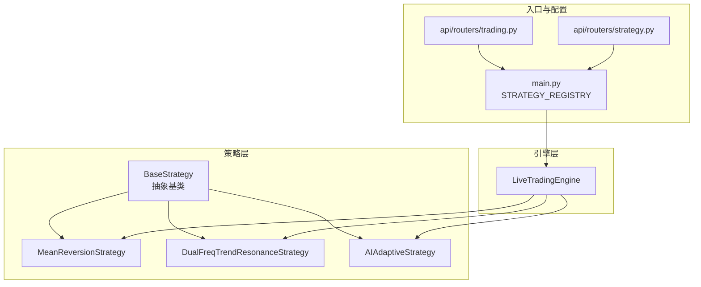
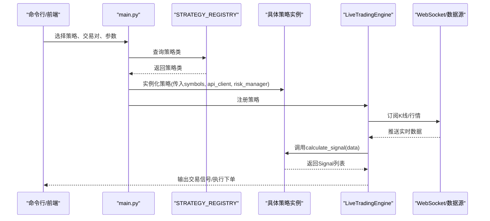
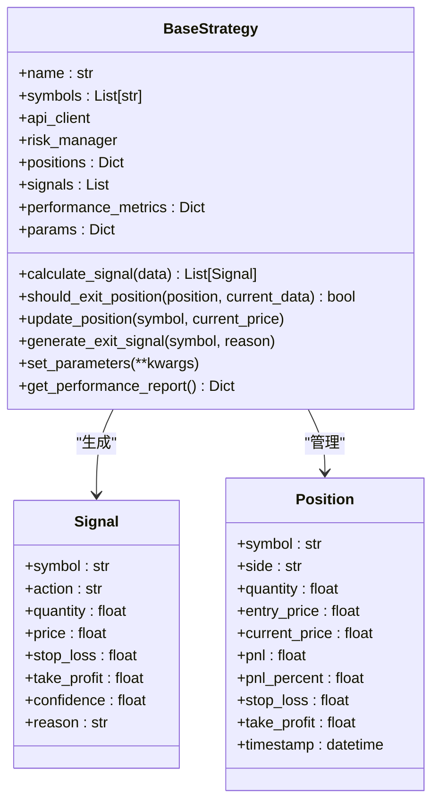
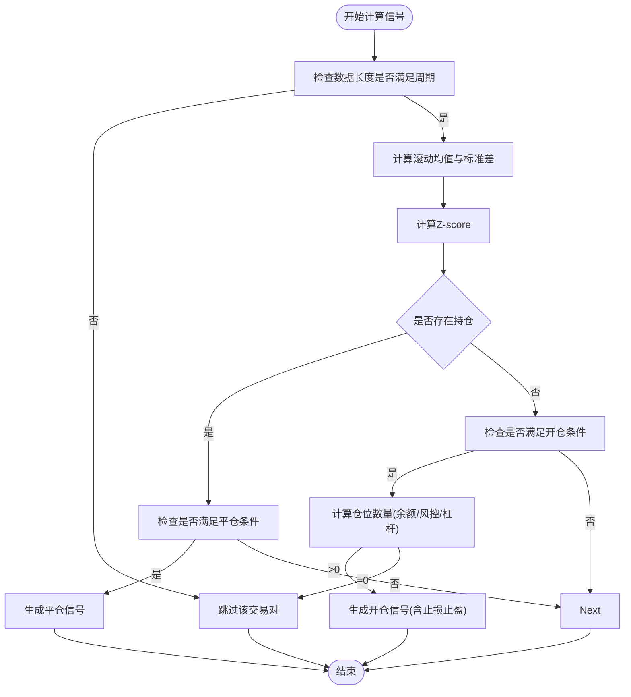
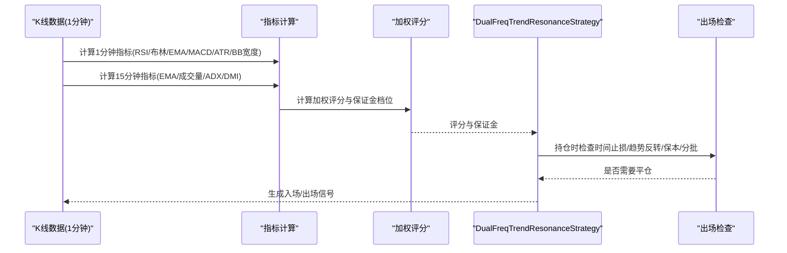
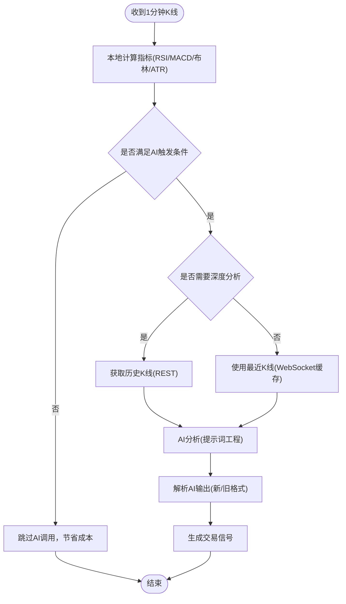
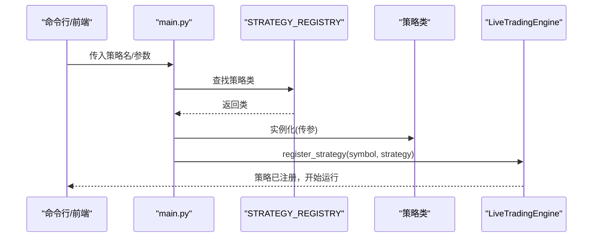
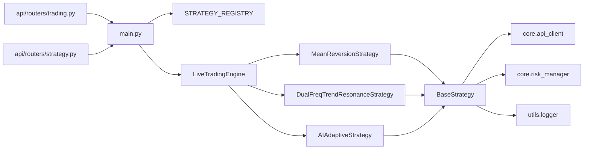

# 策略模式

<cite>
**本文引用的文件**
- [main.py](file://main.py)
- [base.py](file://strategy/base.py)
- [mean_reversion.py](file://strategy/mean_reversion.py)
- [dual_freq_trend.py](file://strategy/dual_freq_trend.py)
- [ai_adaptive.py](file://strategy/ai_adaptive.py)
- [live_trading.py](file://engine/live_trading.py)
- [strategy.py](file://api/routers/strategy.py)
- [trading.py](file://api/routers/trading.py)
</cite>

## 目录
1. [引言](#引言)
2. [项目结构](#项目结构)
3. [核心组件](#核心组件)
4. [架构总览](#架构总览)
5. [详细组件分析](#详细组件分析)
6. [依赖关系分析](#依赖关系分析)
7. [性能考量](#性能考量)
8. [故障排查指南](#故障排查指南)
9. [结论](#结论)
10. [附录](#附录)

## 引言
本文件围绕量化交易系统中的策略模式展开，系统性阐述策略基类设计、具体策略实现、策略注册表机制、参数配置、技术指标计算、交易信号生成与风控、策略切换与参数调整、性能优化与最佳实践，并总结策略模式在代码复用、可扩展与可维护方面的优势。读者无需具备深厚的编程背景，也能通过本指南理解策略模式在系统中的落地方式与应用价值。

## 项目结构
策略相关代码主要位于以下模块：
- 策略基类与通用数据结构：strategy/base.py
- 具体策略实现：strategy/mean_reversion.py、strategy/dual_freq_trend.py、strategy/ai_adaptive.py
- 策略注册表与入口：main.py
- 实盘引擎与策略注册：engine/live_trading.py
- API路由与前端交互：api/routers/strategy.py、api/routers/trading.py

图表来源
- [main.py:31-47](file://main.py#L31-L47)
- [base.py:41-212](file://strategy/base.py#L41-L212)
- [mean_reversion.py:23-263](file://strategy/mean_reversion.py#L23-L263)
- [dual_freq_trend.py:18-931](file://strategy/dual_freq_trend.py#L18-L931)
- [ai_adaptive.py:12-881](file://strategy/ai_adaptive.py#L12-L881)
- [live_trading.py:588-614](file://engine/live_trading.py#L588-L614)
- [strategy.py:1-1299](file://api/routers/strategy.py#L1-L1299)
- [trading.py:183-404](file://api/routers/trading.py#L183-L404)

章节来源
- [main.py:31-47](file://main.py#L31-L47)
- [base.py:41-212](file://strategy/base.py#L41-L212)
- [live_trading.py:588-614](file://engine/live_trading.py#L588-L614)
- [strategy.py:1-1299](file://api/routers/strategy.py#L1-L1299)
- [trading.py:183-404](file://api/routers/trading.py#L183-L404)

## 核心组件
- 策略基类 BaseStrategy：定义抽象接口（计算信号、判断平仓）、通用状态管理（持仓、信号、性能指标）、参数管理与风控集成。
- 具体策略：
  - 均值回归策略 MeanReversionStrategy：基于滚动均值与标准差计算Z-score，结合止损止盈与仓位管理生成信号。
  - 双频趋势共振策略 DualFreqTrendResonanceStrategy：1分钟入场与15分钟趋势共振，多指标加权评分与严格风控。
  - AI自适应策略 AIAdaptiveStrategy：基于本地指标预筛选与AI分析，实现日内高频交易与成本优化。
- 策略注册表 STRATEGY_REGISTRY：集中管理策略类映射，支持通过字符串键快速实例化策略。
- 实盘引擎 LiveTradingEngine：负责策略注册、数据流与风控对接，支持多策略并发。

章节来源
- [base.py:41-212](file://strategy/base.py#L41-L212)
- [mean_reversion.py:23-263](file://strategy/mean_reversion.py#L23-L263)
- [dual_freq_trend.py:18-931](file://strategy/dual_freq_trend.py#L18-L931)
- [ai_adaptive.py:12-881](file://strategy/ai_adaptive.py#L12-L881)
- [main.py:31-47](file://main.py#L31-L47)
- [live_trading.py:588-614](file://engine/live_trading.py#L588-L614)

## 架构总览
策略模式通过“抽象基类 + 多种具体策略实现 + 注册表 + 引擎调度”的方式，实现策略的可插拔与可扩展。策略基类统一了信号生成与风控接口，具体策略专注于各自的交易逻辑与指标体系；注册表与命令行/前端参数驱动策略实例化；引擎负责数据接入、风控与下单执行。

图表来源
- [main.py:225-286](file://main.py#L225-L286)
- [live_trading.py:588-614](file://engine/live_trading.py#L588-L614)
- [strategy/base.py:71-112](file://strategy/base.py#L71-L112)

章节来源
- [main.py:225-286](file://main.py#L225-L286)
- [live_trading.py:588-614](file://engine/live_trading.py#L588-L614)
- [strategy/base.py:71-112](file://strategy/base.py#L71-L112)

## 详细组件分析

### BaseStrategy 抽象基类设计
- 设计要点
  - 抽象方法：calculate_signal、should_exit_position，强制子类实现核心交易逻辑。
  - 状态管理：positions、signals、performance_metrics，统一记录持仓、信号与绩效。
  - 参数管理：params字典，支持运行时动态设置策略参数。
  - 风险集成：与RiskManager协作，支持风控校验与止盈止损联动。
  - 盈亏计算：提供实时更新与盈亏百分比计算，便于风控与报表。
- 关键流程
  - update_position：定期更新持仓实时价格与盈亏，触发平仓判断。
  - generate_exit_signal：生成平仓信号，便于引擎统一处理。
  - get_performance_report：聚合策略表现指标，便于监控与回测。

图表来源
- [base.py:16-41](file://strategy/base.py#L16-L41)
- [base.py:41-212](file://strategy/base.py#L41-L212)

章节来源
- [base.py:16-41](file://strategy/base.py#L16-L41)
- [base.py:41-212](file://strategy/base.py#L41-L212)

### 均值回归策略 MeanReversionStrategy
- 设计思路
  - 基于滚动均值与标准差计算Z-score，当价格偏离均值达到阈值时生成反向信号。
  - 结合止损止盈与仓位管理，支持动态计算可用保证金与杠杆下的开仓数量。
  - 提供should_exit_position与内部辅助方法，细化平仓条件（止损、止盈、均值回归）。
- 关键实现
  - calculate_signal：遍历交易对，计算指标，生成买入/卖出信号或平仓信号。
  - _calculate_position_size：从账户余额与风控校验出发，计算可下单数量，考虑最小交易单位。
  - should_exit_position/_should_exit_with_reason：综合止损止盈与指标回归条件。

图表来源
- [mean_reversion.py:31-117](file://strategy/mean_reversion.py#L31-L117)
- [mean_reversion.py:119-149](file://strategy/mean_reversion.py#L119-L149)
- [mean_reversion.py:151-246](file://strategy/mean_reversion.py#L151-L246)

章节来源
- [mean_reversion.py:23-263](file://strategy/mean_reversion.py#L23-L263)

### 双频趋势共振策略 DualFreqTrendResonanceStrategy
- 设计思路
  - 1分钟图用于精细入场（回调/突破 + RSI6 + 布林带 + EMA5/13），15分钟图用于趋势过滤（EMA9/21 + 成交量）。
  - 多指标加权评分（趋势、价格位置、RSI、均线状态、MACD、成交量、波动率、形态）决定开仓强度与保证金档位。
  - 严格的风控：时间止损、趋势反转出场、保本移动止损、分批止盈、单日最大回撤限制。
- 关键实现
  - calculate_signal：计算1分钟与15分钟指标，生成入场/出场信号。
  - _calc_1m_indicators/_calc_15m_indicators：分别计算1分钟与15分钟指标。
  - _calc_weighted_entry_score：按命中条件加权评分，选择保证金档位。
  - check_long_exit_conditions/check_short_exit_conditions：严格出场条件与追踪止盈。

图表来源
- [dual_freq_trend.py:228-270](file://strategy/dual_freq_trend.py#L228-L270)
- [dual_freq_trend.py:289-426](file://strategy/dual_freq_trend.py#L289-L426)
- [dual_freq_trend.py:636-791](file://strategy/dual_freq_trend.py#L636-L791)

章节来源
- [dual_freq_trend.py:18-931](file://strategy/dual_freq_trend.py#L18-L931)

### AI自适应策略 AIAdaptiveStrategy
- 设计思路
  - 采用“本地指标预筛选 + AI分析”的成本优化策略：先用本地RSI/MACD/布林带/ATR等指标快速判断是否需要调用AI，显著降低AI调用次数。
  - 支持日内高频交易：每1分钟K线收线即触发分析，区分空仓开仓与持仓平仓场景。
  - 通过提示词工程与AI分析结果解析，生成标准化交易信号（做多/做空/平多/平空）。
- 关键实现
  - _calculate_technical_indicators：本地快速计算常用指标。
  - _should_call_ai_for_entry/_should_call_ai_for_exit：预筛选触发条件。
  - calculate_signal：整合本地指标与AI分析，解析AI文本生成Signal。
  - _parse_ai_signal：解析AI输出，兼容新旧格式。

图表来源
- [ai_adaptive.py:80-164](file://strategy/ai_adaptive.py#L80-L164)
- [ai_adaptive.py:166-264](file://strategy/ai_adaptive.py#L166-L264)
- [ai_adaptive.py:266-670](file://strategy/ai_adaptive.py#L266-L670)
- [ai_adaptive.py:672-774](file://strategy/ai_adaptive.py#L672-L774)

章节来源
- [ai_adaptive.py:12-881](file://strategy/ai_adaptive.py#L12-L881)

### 策略注册表 STRATEGY_REGISTRY 与策略实例化
- 机制说明
  - STRATEGY_REGISTRY：以字符串键映射到策略类，便于命令行/前端选择策略。
  - main.py：根据策略名从注册表获取类，构造策略实例并注入symbols、api_client、risk_manager等参数。
  - 实盘引擎：通过register_strategy将策略绑定到交易对，支持多策略并发。
- 策略切换与参数调整
  - 通过命令行参数覆盖默认参数（如position-size、leverage、stop-loss、take-profit）。
  - 对于特定策略（如AI与双频趋势），支持将前端参数直接映射到策略内部参数。

图表来源
- [main.py:225-286](file://main.py#L225-L286)
- [main.py:31-47](file://main.py#L31-L47)
- [live_trading.py:588-614](file://engine/live_trading.py#L588-L614)

章节来源
- [main.py:31-47](file://main.py#L31-L47)
- [main.py:225-286](file://main.py#L225-L286)
- [live_trading.py:588-614](file://engine/live_trading.py#L588-L614)

### 技术指标计算与信号生成
- 指标计算
  - 均值回归：滚动均值、滚动标准差、Z-score。
  - 双频趋势：1分钟图指标（RSI、布林带、EMA、MACD、ATR、BB宽度）与15分钟图指标（EMA、成交量、ADX/DMI）。
  - AI策略：本地快速指标（RSI、MACD、布林带、ATR、OBV、KDJ等）。
- 信号生成
  - 基于指标阈值与组合条件生成买入/卖出/平仓信号，附带止损止盈与置信度。
  - 通过RiskManager与账户余额/杠杆/风控参数进行一致性校验。

章节来源
- [mean_reversion.py:42-58](file://strategy/mean_reversion.py#L42-L58)
- [dual_freq_trend.py:228-270](file://strategy/dual_freq_trend.py#L228-L270)
- [ai_adaptive.py:80-164](file://strategy/ai_adaptive.py#L80-L164)

### 策略切换、参数调整与最佳实践
- 策略切换
  - 通过命令行或前端选择策略名，main.py自动从STRATEGY_REGISTRY实例化策略。
  - 对于不同策略，支持差异化参数注入（如AI策略的保证金、杠杆、止盈止损比例）。
- 参数调整
  - 运行时通过set_parameters动态更新策略参数。
  - 命令行参数优先级高于策略默认参数，便于快速验证。
- 最佳实践
  - 保持策略参数封装在策略内部，通过统一接口暴露必要参数。
  - 使用本地指标预筛选降低外部依赖与成本（AI策略）。
  - 严格风控：止损止盈、时间止损、单日最大回撤、仓位上限。
  - 信号与风控解耦：策略负责信号，引擎负责执行与风控。

章节来源
- [main.py:225-286](file://main.py#L225-L286)
- [base.py:170-173](file://strategy/base.py#L170-L173)
- [ai_adaptive.py:166-264](file://strategy/ai_adaptive.py#L166-L264)

## 依赖关系分析
- 策略基类依赖：core.api_client、core.risk_manager、utils.logger。
- 具体策略依赖：各自策略文件内的指标计算与风控校验。
- 注册表与引擎：main.py与engine/live_trading.py共同完成策略注册与运行。
- API路由：api/routers/trading.py与strategy.py提供策略配置与回测数据接口。

图表来源
- [base.py:9-11](file://strategy/base.py#L9-L11)
- [main.py:31-47](file://main.py#L31-L47)
- [live_trading.py:588-614](file://engine/live_trading.py#L588-L614)
- [strategy.py:1-1299](file://api/routers/strategy.py#L1-L1299)
- [trading.py:183-404](file://api/routers/trading.py#L183-L404)

章节来源
- [base.py:9-11](file://strategy/base.py#L9-L11)
- [main.py:31-47](file://main.py#L31-L47)
- [live_trading.py:588-614](file://engine/live_trading.py#L588-L614)
- [strategy.py:1-1299](file://api/routers/strategy.py#L1-L1299)
- [trading.py:183-404](file://api/routers/trading.py#L183-L404)

## 性能考量
- 指标计算复杂度
  - 均值回归：滚动窗口计算，时间复杂度与数据长度线性相关，适合短周期回测与实盘。
  - 双频趋势：1分钟与15分钟指标叠加，注意重采样与多指标计算的成本。
  - AI策略：本地指标预筛选显著降低AI调用频率，建议在指标计算与网络调用之间取得平衡。
- 并发与资源
  - 实盘引擎支持多策略并发，注意共享资源（账户余额、风控）的线程安全与锁竞争。
  - WebSocket连接与重连机制需考虑代理与网络环境，避免阻塞主线程。
- 参数与风控
  - 通过参数化与风控校验，避免过度交易与爆仓风险，提升策略稳定性。

## 故障排查指南
- 策略未注册/实例化失败
  - 检查STRATEGY_REGISTRY中策略名是否正确，命令行/前端传参是否匹配。
  - 确认策略类构造参数与main.py注入参数一致。
- 信号未生成或数量为0
  - 检查数据长度是否满足策略周期要求（如均值回归的lookback_period）。
  - 核对账户余额与风控校验是否通过（AI策略与均值回归策略均有余额/风控检查）。
- 实盘执行异常
  - 检查WebSocket连接状态与重连逻辑，确认代理设置与网络环境。
  - 核对引擎与策略的止损止盈参数是否与预期一致（双频趋势策略的止盈止损由策略内部计算）。

章节来源
- [main.py:225-286](file://main.py#L225-L286)
- [mean_reversion.py:151-246](file://strategy/mean_reversion.py#L151-L246)
- [ai_adaptive.py:166-264](file://strategy/ai_adaptive.py#L166-L264)
- [live_trading.py:126-200](file://engine/live_trading.py#L126-L200)

## 结论
策略模式在本量化交易系统中实现了高度的模块化与可扩展性：抽象基类统一接口，具体策略专注各自领域，注册表与引擎解耦策略与执行，形成清晰的职责分工。通过参数化、风控集成与成本优化（AI策略的本地预筛选），系统在保证灵活性的同时提升了稳定性与可维护性。策略模式为后续新增策略提供了极低的集成成本与一致的开发体验。

## 附录
- 策略注册表键值与显示名称映射
  - 键值：mean_reversion、ai_adaptive、high_frequency、dual_freq_trend、hype_adaptive_short
  - 显示名称：均值回归测试、Ai自适应策略、日内高频交易、双频趋势共振(1m入场/15m趋势)、HYPE自适应做空策略
- API路由与前端交互
  - trading.py：提供策略实例注册与参数传递。
  - strategy.py：提供回测数据导入与概览接口，便于策略评估与可视化。

章节来源
- [main.py:31-47](file://main.py#L31-L47)
- [trading.py:183-404](file://api/routers/trading.py#L183-L404)
- [strategy.py:1-1299](file://api/routers/strategy.py#L1-L1299)