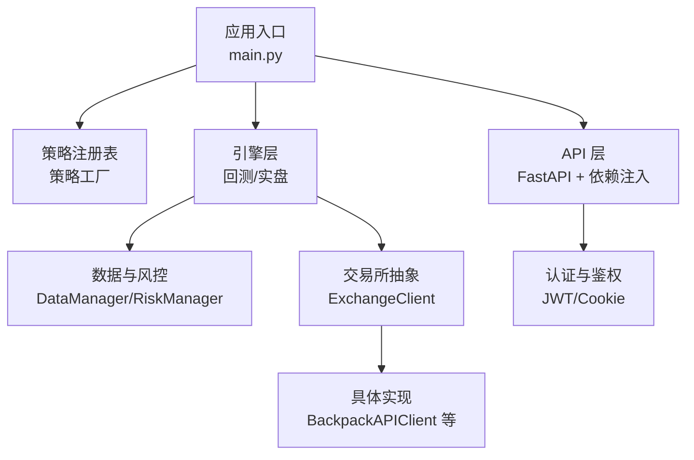
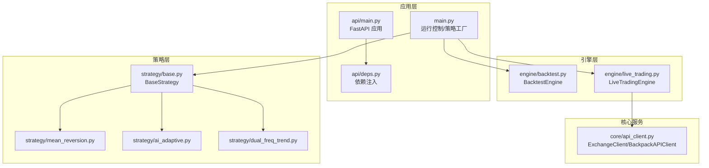
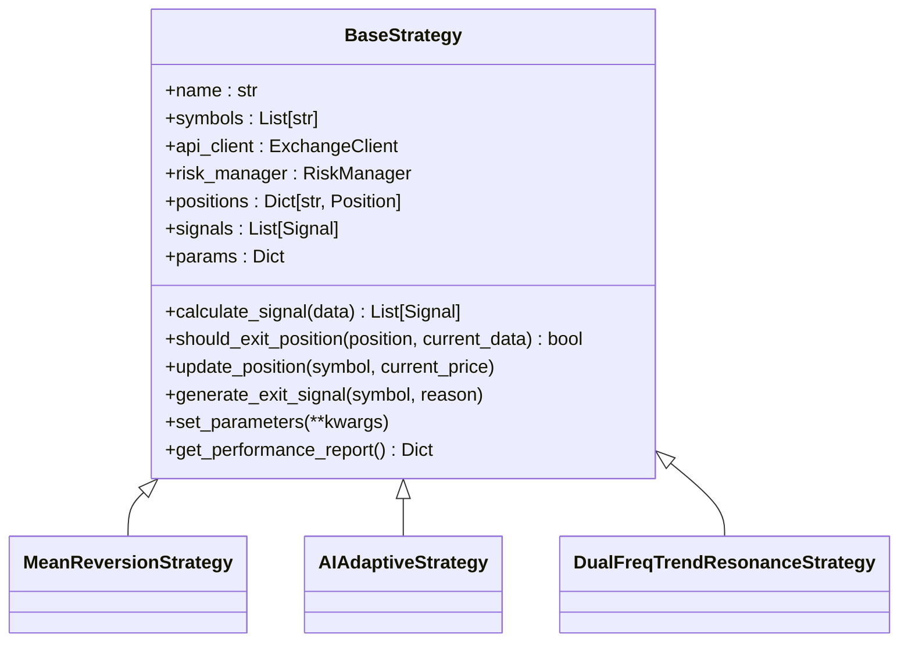
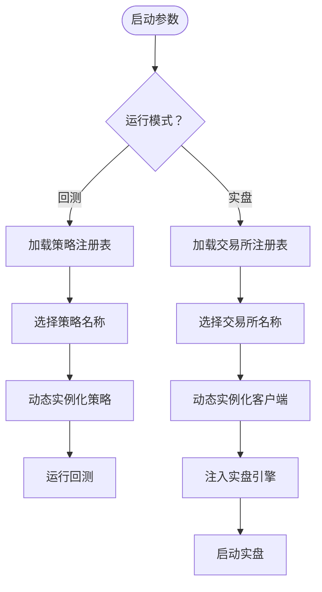
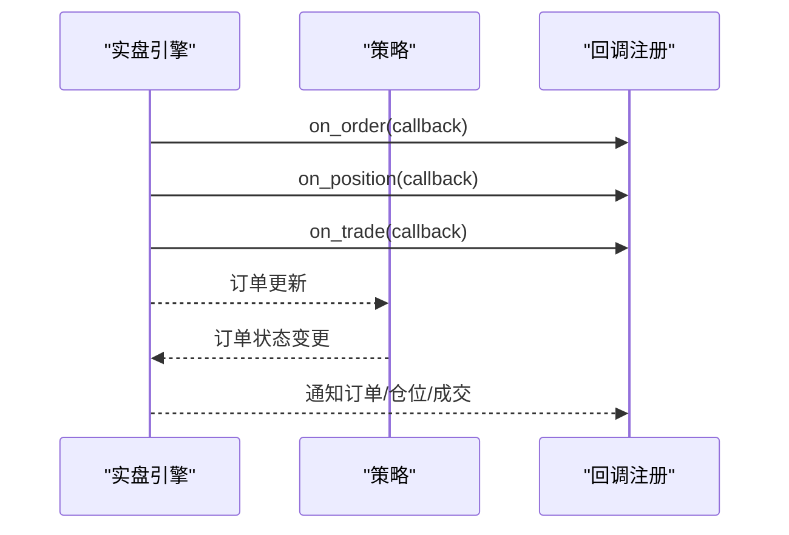
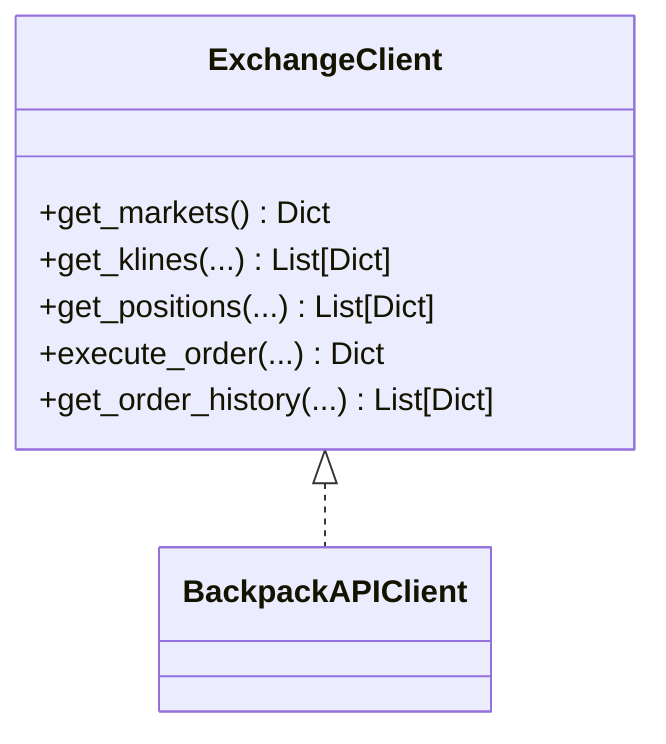
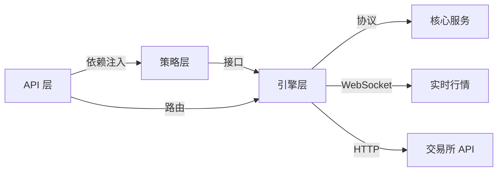

# 组件设计模式

<cite>
**本文档引用的文件**
- [main.py](file://backpack_quant_trading/main.py)
- [api/main.py](file://backpack_quant_trading/api/main.py)
- [api/deps.py](file://backpack_quant_trading/api/deps.py)
- [strategy/base.py](file://backpack_quant_trading/strategy/base.py)
- [strategy/mean_reversion.py](file://backpack_quant_trading/strategy/mean_reversion.py)
- [strategy/ai_adaptive.py](file://backpack_quant_trading/strategy/ai_adaptive.py)
- [strategy/dual_freq_trend.py](file://backpack_quant_trading/strategy/dual_freq_trend.py)
- [engine/live_trading.py](file://backpack_quant_trading/engine/live_trading.py)
- [engine/backtest.py](file://backpack_quant_trading/engine/backtest.py)
- [core/api_client.py](file://backpack_quant_trading/core/api_client.py)
</cite>

## 目录
1. [引言](#引言)
2. [项目结构](#项目结构)
3. [核心组件](#核心组件)
4. [架构总览](#架构总览)
5. [详细组件分析](#详细组件分析)
6. [依赖关系分析](#依赖关系分析)
7. [性能考虑](#性能考虑)
8. [故障排除指南](#故障排除指南)
9. [结论](#结论)
10. [附录](#附录)

## 引言
本文件面向量化交易系统的组件设计模式，聚焦以下四种模式在系统中的落地与协作：
- 策略模式：通过统一的策略接口与具体策略实现，实现策略的可插拔与可扩展。
- 工厂模式：通过注册表与工厂方法，动态创建策略与交易所客户端实例。
- 观察者模式：通过回调注册与事件通知，实现引擎与策略之间的松耦合通信。
- 依赖注入模式：通过参数注入与协议抽象，实现组件间的解耦与可替换性。

文档将结合代码路径与图示，解释每种模式的具体实现、应用场景、协作关系与最佳实践。

## 项目结构
系统采用分层与功能域划分相结合的组织方式：
- 应用入口与运行控制：main.py
- API 层：api/main.py、api/deps.py
- 策略层：strategy/base.py 及各具体策略
- 引擎层：engine/backtest.py、engine/live_trading.py
- 核心服务：core/api_client.py
- 配置与工具：config/settings.py、utils/logger.py

图表来源
- [main.py:31-55](file://backpack_quant_trading/main.py#L31-L55)
- [engine/live_trading.py:347-370](file://backpack_quant_trading/engine/live_trading.py#L347-L370)
- [core/api_client.py:22-85](file://backpack_quant_trading/core/api_client.py#L22-L85)
- [api/main.py:36-48](file://backpack_quant_trading/api/main.py#L36-L48)
- [api/deps.py:44-73](file://backpack_quant_trading/api/deps.py#L44-L73)

章节来源
- [main.py:1-344](file://backpack_quant_trading/main.py#L1-L344)
- [api/main.py:1-98](file://backpack_quant_trading/api/main.py#L1-L98)
- [api/deps.py:1-73](file://backpack_quant_trading/api/deps.py#L1-L73)

## 核心组件
- 策略基类与具体策略
  - 策略基类定义统一接口，派生类实现具体交易逻辑与风控。
  - 具体策略包括：均值回归、AI 自适应、双频趋势共振等。
- 引擎组件
  - 回测引擎：基于历史数据驱动策略回测，计算指标并生成报告。
  - 实盘引擎：订阅实时行情，管理订单、仓位与账户，支持回调通知。
- 交易所抽象与客户端
  - 通过协议抽象实现可替换的交易所客户端，当前实现为 BackpackAPIClient。
- API 层与依赖注入
  - FastAPI 提供路由与中间件，依赖注入模块负责认证与鉴权。

章节来源
- [strategy/base.py:41-212](file://backpack_quant_trading/strategy/base.py#L41-L212)
- [strategy/mean_reversion.py:23-263](file://backpack_quant_trading/strategy/mean_reversion.py#L23-L263)
- [strategy/ai_adaptive.py:12-800](file://backpack_quant_trading/strategy/ai_adaptive.py#L12-L800)
- [strategy/dual_freq_trend.py:18-931](file://backpack_quant_trading/strategy/dual_freq_trend.py#L18-L931)
- [engine/backtest.py:48-404](file://backpack_quant_trading/engine/backtest.py#L48-L404)
- [engine/live_trading.py:347-800](file://backpack_quant_trading/engine/live_trading.py#L347-L800)
- [core/api_client.py:22-85](file://backpack_quant_trading/core/api_client.py#L22-L85)
- [api/main.py:14-98](file://backpack_quant_trading/api/main.py#L14-L98)
- [api/deps.py:44-73](file://backpack_quant_trading/api/deps.py#L44-L73)

## 架构总览
系统采用“策略 + 引擎 + 抽象客户端”的分层架构，策略通过统一接口与引擎交互，引擎通过抽象客户端与交易所交互，API 层通过依赖注入提供认证与鉴权。

图表来源
- [main.py:31-55](file://backpack_quant_trading/main.py#L31-L55)
- [strategy/base.py:41-91](file://backpack_quant_trading/strategy/base.py#L41-L91)
- [engine/backtest.py:65-187](file://backpack_quant_trading/engine/backtest.py#L65-L187)
- [engine/live_trading.py:347-370](file://backpack_quant_trading/engine/live_trading.py#L347-L370)
- [core/api_client.py:22-85](file://backpack_quant_trading/core/api_client.py#L22-L85)
- [api/main.py:36-48](file://backpack_quant_trading/api/main.py#L36-L48)
- [api/deps.py:44-73](file://backpack_quant_trading/api/deps.py#L44-L73)

## 详细组件分析

### 策略模式：统一接口与可插拔实现
- 设计要点
  - 策略基类定义统一接口：计算信号、平仓判断、参数设置、性能报告等。
  - 具体策略实现各自交易逻辑，共享统一的生命周期与风控机制。
- 代码路径
  - 策略基类与通用信号/仓位模型：[strategy/base.py:41-212](file://backpack_quant_trading/strategy/base.py#L41-L212)
  - 均值回归策略：[strategy/mean_reversion.py:23-263](file://backpack_quant_trading/strategy/mean_reversion.py#L23-L263)
  - AI 自适应策略：[strategy/ai_adaptive.py:12-800](file://backpack_quant_trading/strategy/ai_adaptive.py#L12-L800)
  - 双频趋势共振策略：[strategy/dual_freq_trend.py:18-931](file://backpack_quant_trading/strategy/dual_freq_trend.py#L18-L931)

图表来源
- [strategy/base.py:41-212](file://backpack_quant_trading/strategy/base.py#L41-L212)
- [strategy/mean_reversion.py:23-263](file://backpack_quant_trading/strategy/mean_reversion.py#L23-L263)
- [strategy/ai_adaptive.py:12-800](file://backpack_quant_trading/strategy/ai_adaptive.py#L12-L800)
- [strategy/dual_freq_trend.py:18-931](file://backpack_quant_trading/strategy/dual_freq_trend.py#L18-L931)

- 应用场景
  - 回测：回测引擎按时间序列调用策略接口，驱动策略生成信号并执行交易。
  - 实盘：实盘引擎通过回调与策略交互，策略通过抽象客户端执行下单。
- 优势
  - 代码复用：统一接口减少重复逻辑。
  - 可扩展：新增策略只需继承基类并实现接口。
  - 可维护：策略职责清晰，便于测试与演进。

章节来源
- [strategy/base.py:41-212](file://backpack_quant_trading/strategy/base.py#L41-L212)
- [engine/backtest.py:65-187](file://backpack_quant_trading/engine/backtest.py#L65-L187)
- [engine/live_trading.py:588-607](file://backpack_quant_trading/engine/live_trading.py#L588-L607)

### 工厂模式：注册表与动态实例化
- 设计要点
  - 策略注册表与交易所注册表集中管理可创建的类型。
  - 应用入口根据参数动态选择并实例化策略与客户端。
- 代码路径
  - 策略注册表与工厂调用：[main.py:31-55](file://backpack_quant_trading/main.py#L31-L55)
  - 实盘运行时工厂注入：[main.py:197-286](file://backpack_quant_trading/main.py#L197-L286)

图表来源
- [main.py:31-55](file://backpack_quant_trading/main.py#L31-L55)
- [main.py:197-286](file://backpack_quant_trading/main.py#L197-L286)

- 应用场景
  - 回测：按策略注册表创建策略实例，批量回测。
  - 实盘：按交易所注册表创建客户端，注入引擎，支持多平台切换。
- 优势
  - 配置驱动：通过注册表即可扩展新策略/平台。
  - 运行时灵活：命令行参数即时生效，无需修改代码。

章节来源
- [main.py:31-55](file://backpack_quant_trading/main.py#L31-L55)
- [main.py:197-286](file://backpack_quant_trading/main.py#L197-L286)

### 观察者模式：回调与事件通知
- 设计要点
  - 引擎提供回调注册接口，策略通过回调接收订单、仓位、成交等事件。
  - 实盘引擎通过回调通知外部系统，实现松耦合。
- 代码路径
  - 回调注册与通知：[engine/live_trading.py:699-743](file://backpack_quant_trading/engine/live_trading.py#L699-L743)
  - 订单/仓位/成交回调：[engine/live_trading.py:150-158](file://backpack_quant_trading/engine/live_trading.py#L150-L158)

图表来源
- [engine/live_trading.py:699-743](file://backpack_quant_trading/engine/live_trading.py#L699-L743)
- [engine/live_trading.py:150-158](file://backpack_quant_trading/engine/live_trading.py#L150-L158)

- 应用场景
  - 实盘交易：引擎将订单与仓位变化通过回调通知策略与外部系统。
  - 策略联动：策略可根据回调更新内部状态与风控。
- 优势
  - 松耦合：引擎与策略通过回调解耦。
  - 可观测：外部系统可订阅事件，实现可观测性与自动化。

章节来源
- [engine/live_trading.py:699-743](file://backpack_quant_trading/engine/live_trading.py#L699-L743)
- [engine/live_trading.py:150-158](file://backpack_quant_trading/engine/live_trading.py#L150-L158)

### 依赖注入模式：协议抽象与参数注入
- 设计要点
  - 通过协议抽象交易所客户端，实现可替换性与测试友好性。
  - API 层通过依赖注入模块提供认证与鉴权，简化路由处理。
- 代码路径
  - 交易所协议与客户端：[core/api_client.py:22-85](file://backpack_quant_trading/core/api_client.py#L22-L85)、[core/api_client.py:87-546](file://backpack_quant_trading/core/api_client.py#L87-L546)
  - API 依赖注入与认证：[api/deps.py:44-73](file://backpack_quant_trading/api/deps.py#L44-L73)
  - API 应用与路由：[api/main.py:36-98](file://backpack_quant_trading/api/main.py#L36-L98)

图表来源
- [core/api_client.py:22-85](file://backpack_quant_trading/core/api_client.py#L22-L85)
- [core/api_client.py:87-546](file://backpack_quant_trading/core/api_client.py#L87-L546)

- 应用场景
  - 引擎注入：实盘引擎通过构造参数注入具体客户端实现。
  - API 鉴权：路由通过依赖注入获取当前用户，实现权限控制。
- 优势
  - 可替换：通过协议抽象实现平台切换与测试替身。
  - 可测试：依赖注入使组件易于单元测试与集成测试。

章节来源
- [core/api_client.py:22-85](file://backpack_quant_trading/core/api_client.py#L22-L85)
- [core/api_client.py:87-546](file://backpack_quant_trading/core/api_client.py#L87-L546)
- [api/deps.py:44-73](file://backpack_quant_trading/api/deps.py#L44-L73)
- [api/main.py:36-98](file://backpack_quant_trading/api/main.py#L36-L98)

## 依赖关系分析
- 组件耦合与内聚
  - 策略层与引擎层通过接口耦合，内聚于交易逻辑。
  - 引擎层与核心服务通过协议耦合，内聚于数据与风控。
  - API 层与业务层通过依赖注入解耦，内聚于认证与路由。
- 外部依赖与集成点
  - 交易所 API：通过抽象客户端适配不同平台。
  - WebSocket：实盘引擎通过 WebSocket 订阅实时行情。
  - FastAPI：提供 REST 接口与静态资源托管。

图表来源
- [engine/live_trading.py:347-370](file://backpack_quant_trading/engine/live_trading.py#L347-L370)
- [core/api_client.py:22-85](file://backpack_quant_trading/core/api_client.py#L22-L85)
- [api/main.py:36-98](file://backpack_quant_trading/api/main.py#L36-L98)

章节来源
- [engine/live_trading.py:347-370](file://backpack_quant_trading/engine/live_trading.py#L347-L370)
- [core/api_client.py:22-85](file://backpack_quant_trading/core/api_client.py#L22-L85)
- [api/main.py:36-98](file://backpack_quant_trading/api/main.py#L36-L98)

## 性能考虑
- 回测性能
  - 指标预热期：跳过前若干根 K 线，避免指标漂移对回测初期的影响。
  - 滑点与手续费：在回测中模拟滑点与手续费，提升结果真实性。
- 实盘性能
  - WebSocket 连接与重连：实现指数退避与代理自适应，提升稳定性。
  - 余额缓存：减少 API 调用频率，降低延迟与风控压力。
- 策略性能
  - AI 策略本地指标预筛选：显著降低 AI 调用次数，提高性价比。
  - 多频指标融合：通过 1 分钟与 15 分钟指标协同，提升信号质量。

## 故障排除指南
- 认证与鉴权
  - JWT 解析失败：检查密钥与算法配置，确认令牌未过期。
  - Cookie 登录：确认 Cookie 名称与作用域正确。
- 交易所 API
  - 签名错误：检查时间戳、参数编码与签名流程。
  - 请求频率限制：适当降低请求频率或使用缓存。
- WebSocket
  - 连接失败：检查代理设置与网络环境，查看重连日志。
  - 消息处理异常：确认消息格式与回调函数签名一致。
- 策略执行
  - 信号生成失败：检查参数配置与风控拦截逻辑。
  - 仓位计算异常：核对保证金、杠杆与最小交易单位。

章节来源
- [api/deps.py:36-42](file://backpack_quant_trading/api/deps.py#L36-L42)
- [core/api_client.py:254-268](file://backpack_quant_trading/core/api_client.py#L254-L268)
- [engine/live_trading.py:153-235](file://backpack_quant_trading/engine/live_trading.py#L153-L235)
- [strategy/ai_adaptive.py:161-164](file://backpack_quant_trading/strategy/ai_adaptive.py#L161-L164)

## 结论
本系统通过策略模式实现策略的可插拔与可扩展，通过工厂模式实现运行时的动态实例化，通过观察者模式实现引擎与策略的松耦合通信，通过依赖注入模式实现协议抽象与组件解耦。四者协同提升了系统的代码复用性、可扩展性与可维护性，为量化交易系统的长期演进提供了坚实基础。

## 附录
- 最佳实践建议
  - 策略开发：遵循基类接口，分离技术指标与交易逻辑，增强可测试性。
  - 引擎扩展：通过协议抽象新增平台，保持接口稳定。
  - 回测验证：在回测中加入滑点与手续费，确保策略稳健性。
  - 实盘监控：完善回调与日志，建立告警与熔断机制。
  - API 安全：严格管理密钥与令牌，启用 HTTPS 与 CORS 白名单。