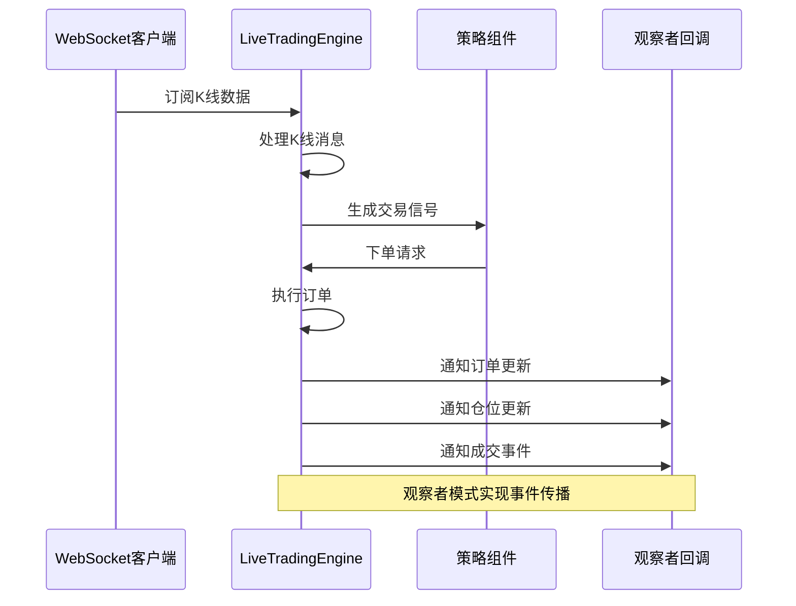
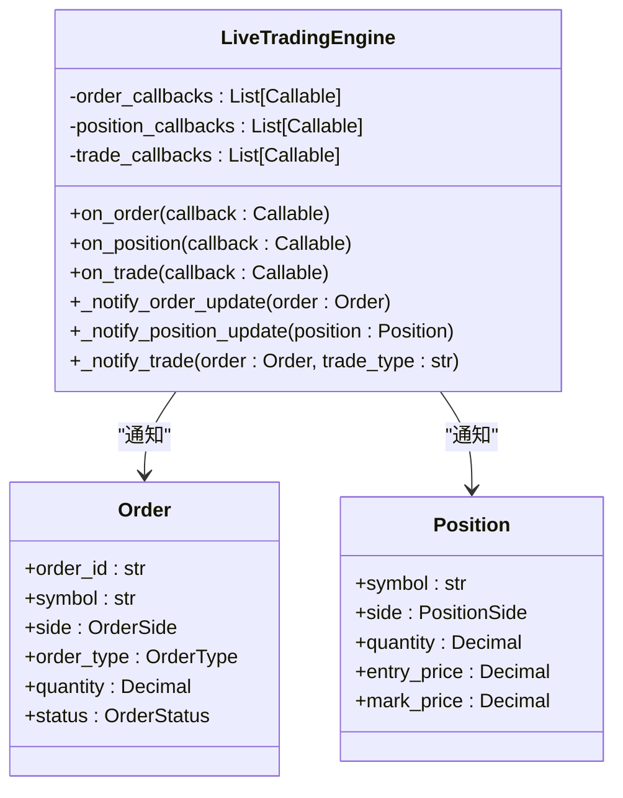
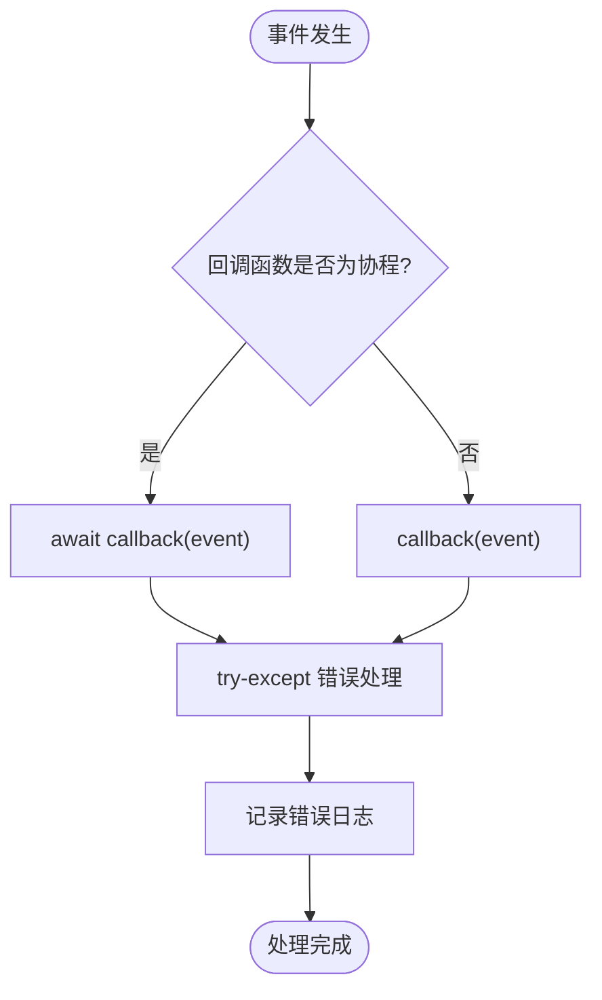
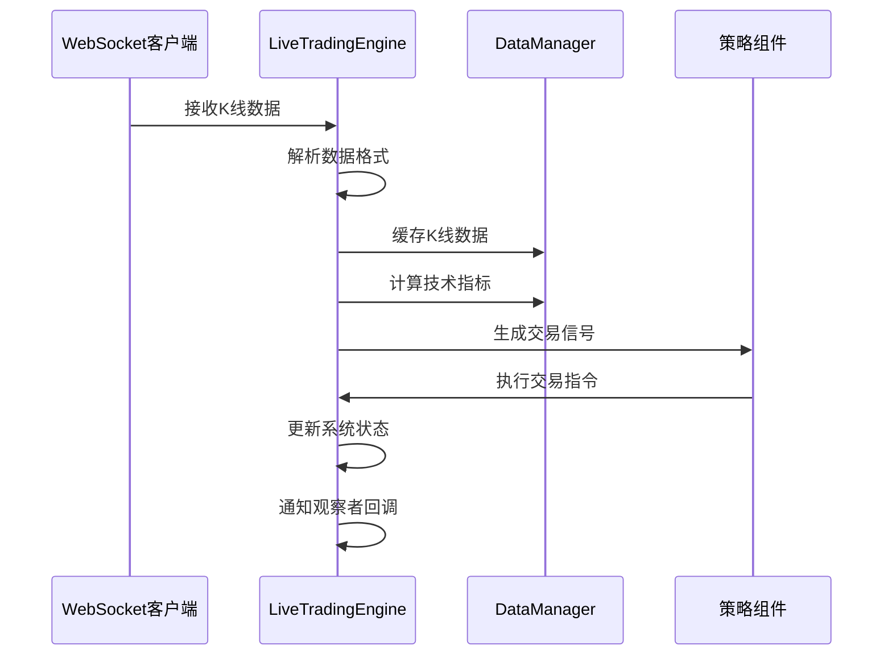
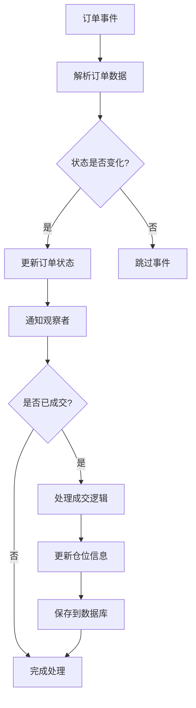
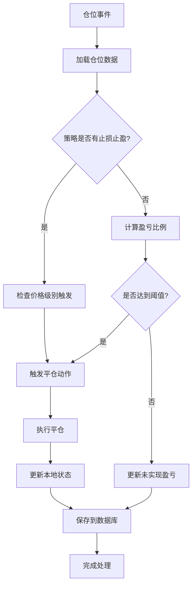
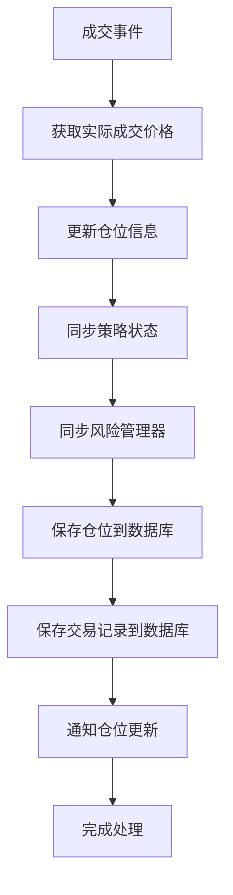
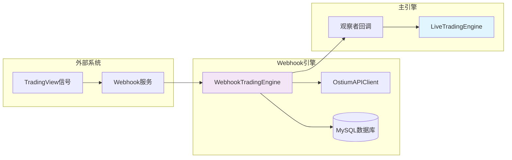
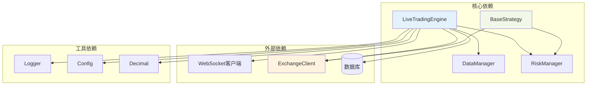
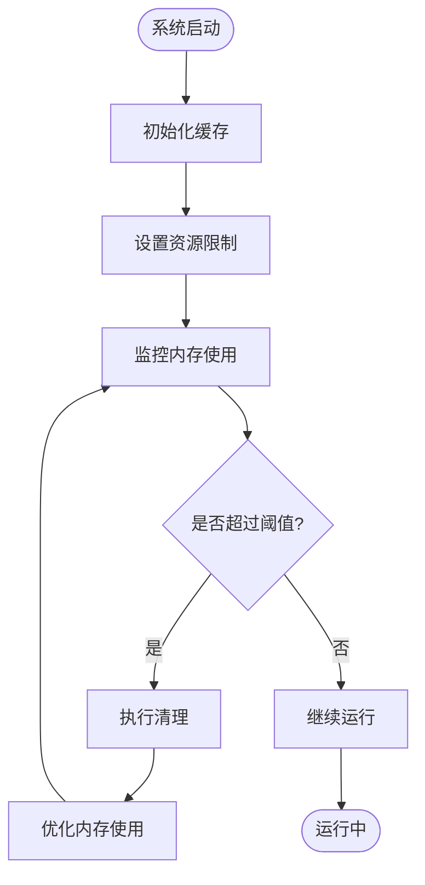

# 观察者模式

<cite>
**本文引用的文件**
- [live_trading.py](file://backpack_quant_trading/engine/live_trading.py)
- [base.py](file://backpack_quant_trading/strategy/base.py)
- [grid_strategy.py](file://backpack_quant_trading/strategy/grid_strategy.py)
- [webhook_trading.py](file://backpack_quant_trading/engine/webhook_trading.py)
- [models.py](file://backpack_quant_trading/database/models.py)
- [trading.py](file://backpack_quant_trading/api/routers/trading.py)
- [app.py](file://backpack_quant_trading/dashboard/app.py)
</cite>

## 目录
1. [引言](#引言)
2. [项目结构](#项目结构)
3. [核心组件](#核心组件)
4. [架构概览](#架构概览)
5. [详细组件分析](#详细组件分析)
6. [依赖分析](#依赖分析)
7. [性能考虑](#性能考虑)
8. [故障排除指南](#故障排除指南)
9. [结论](#结论)

## 引言

本文档深入分析量化交易系统中的观察者模式实现，重点阐述事件驱动架构在实时数据流处理、事件通知和状态同步中的作用。通过对LiveTradingEngine中on_order、on_position、on_trade等回调函数的注册和触发机制进行详细剖析，展示观察者模式如何实现系统解耦、事件传播和状态管理。

该系统采用事件驱动架构，通过WebSocket实时订阅市场数据，结合观察者模式实现订单更新、仓位变化、成交通知等事件的发布和订阅机制。系统支持异步事件处理、错误处理和性能优化策略，为量化交易提供了高效、可靠的基础设施。

## 项目结构

量化交易系统采用模块化设计，主要包含以下核心模块：

```mermaid
graph TB
subgraph "引擎层"
LT[LiveTradingEngine<br/>主引擎]
WT[WebhookTradingEngine<br/>Webhook引擎]
BT[BacktestEngine<br/>回测引擎]
end
subgraph "策略层"
BS[BaseStrategy<br/>策略基类]
GS[GridStrategy<br/>网格策略]
AS[AI策略<br/>自适应策略]
end
subgraph "数据层"
DM[DataManager<br/>数据管理器]
RM[RiskManager<br/>风险管理器]
DB[(数据库)<br/>持久化存储]
end
subgraph "接口层"
API[API路由器<br/>REST接口]
WS[WebSocket客户端<br/>实时数据]
UI[仪表盘<br/>前端界面]
end
LT --> WS
LT --> DM
LT --> RM
LT --> DB
GS --> LT
AS --> LT
WT --> DB
API --> LT
API --> WT
UI --> API
```

**图表来源**
- [live_trading.py:347-402](file://backpack_quant_trading/engine/live_trading.py#L347-L402)
- [webhook_trading.py:40-84](file://backpack_quant_trading/engine/webhook_trading.py#L40-L84)
- [base.py:41-70](file://backpack_quant_trading/strategy/base.py#L41-L70)

**章节来源**
- [live_trading.py:1-2223](file://backpack_quant_trading/engine/live_trading.py#L1-L2223)
- [base.py:1-212](file://backpack_quant_trading/strategy/base.py#L1-L212)

## 核心组件

### LiveTradingEngine - 主引擎

LiveTradingEngine是整个量化交易系统的核心，负责协调各个组件的工作。其主要职责包括：

- **事件管理**: 实现观察者模式，管理订单、仓位、成交事件的发布和订阅
- **实时数据处理**: 通过WebSocket客户端订阅市场数据
- **订单执行**: 管理订单生命周期，包括下单、取消、状态监控
- **状态同步**: 维护系统状态，包括持仓、余额、账户信息
- **风险管理**: 集成风险控制机制，确保交易安全

### 策略基类系统

策略基类定义了交易策略的标准接口，支持多种策略类型的实现：

- **BaseStrategy**: 抽象基类，定义策略的基本接口
- **Position**: 仓位信息数据结构
- **Signal**: 交易信号数据结构
- **具体策略**: 包括网格策略、自适应策略等

### 数据管理与风险管理

- **DataManager**: 负责K线数据的缓存、计算和技术指标的生成
- **RiskManager**: 实施风险管理策略，包括止损、止盈、仓位控制
- **数据库管理**: 提供持久化存储，支持订单、仓位、交易记录的保存

**章节来源**
- [live_trading.py:347-402](file://backpack_quant_trading/engine/live_trading.py#L347-L402)
- [base.py:16-41](file://backpack_quant_trading/strategy/base.py#L16-L41)

## 架构概览

量化交易系统采用事件驱动架构，通过观察者模式实现松耦合的组件通信：



**图表来源**
- [live_trading.py:1283-1341](file://backpack_quant_trading/engine/live_trading.py#L1283-L1341)
- [live_trading.py:699-742](file://backpack_quant_trading/engine/live_trading.py#L699-L742)

系统架构的关键特点：

1. **事件驱动**: 基于WebSocket的实时数据推送
2. **观察者模式**: 通过回调函数实现事件通知
3. **异步处理**: 支持协程和异步I/O操作
4. **解耦设计**: 组件间通过接口通信，降低耦合度

## 详细组件分析

### 观察者模式实现

#### 回调函数注册机制

LiveTradingEngine实现了完整的观察者模式，支持三种主要事件类型的回调注册：



**图表来源**
- [live_trading.py:699-742](file://backpack_quant_trading/engine/live_trading.py#L699-L742)
- [live_trading.py:49-123](file://backpack_quant_trading/engine/live_trading.py#L49-L123)

#### 异步事件处理

系统采用异步编程模型，确保高并发场景下的性能：



**图表来源**
- [live_trading.py:711-742](file://backpack_quant_trading/engine/live_trading.py#L711-L742)

#### 错误处理策略

系统实现了多层次的错误处理机制：

1. **回调函数异常隔离**: 每个回调函数的异常都不会影响其他回调的执行
2. **连接状态监控**: 自动检测和恢复WebSocket连接
3. **订单状态容错**: 处理API延迟和404错误的情况
4. **数据一致性保证**: 通过锁机制确保数据访问的原子性

**章节来源**
- [live_trading.py:699-742](file://backpack_quant_trading/engine/live_trading.py#L699-L742)
- [live_trading.py:1310-1336](file://backpack_quant_trading/engine/live_trading.py#L1310-L1336)

### 实时数据流处理

#### WebSocket数据处理

系统通过WebSocket客户端实现实时数据订阅和处理：



**图表来源**
- [live_trading.py:1600-1655](file://backpack_quant_trading/engine/live_trading.py#L1600-L1655)
- [live_trading.py:1674-1806](file://backpack_quant_trading/engine/live_trading.py#L1674-L1806)

#### 数据缓存与预加载

系统实现了智能的数据缓存机制：

1. **基础币种缓存键**: 使用基础币种作为缓存键，确保数据一致性
2. **历史数据预加载**: 启动时预加载1000根1分钟K线数据
3. **缓存失效策略**: 实现TTL机制，避免缓存过期
4. **跨平台数据适配**: 支持Backpack和Deepcoin等不同平台的数据格式

**章节来源**
- [live_trading.py:1111-1281](file://backpack_quant_trading/engine/live_trading.py#L1111-L1281)
- [live_trading.py:1692-1703](file://backpack_quant_trading/engine/live_trading.py#L1692-L1703)

### 事件处理器实现示例

#### 订单事件处理器

订单事件处理器负责处理订单状态变化：



**图表来源**
- [live_trading.py:1283-1341](file://backpack_quant_trading/engine/live_trading.py#L1283-L1341)
- [live_trading.py:1343-1577](file://backpack_quant_trading/engine/live_trading.py#L1343-L1577)

#### 仓位事件处理器

仓位事件处理器监控和管理仓位变化：



**图表来源**
- [live_trading.py:1836-2041](file://backpack_quant_trading/engine/live_trading.py#L1836-L2041)

#### 成交通知处理器

成交通知处理器负责处理成交事件：



**图表来源**
- [live_trading.py:1343-1577](file://backpack_quant_trading/engine/live_trading.py#L1343-L1577)

**章节来源**
- [live_trading.py:1283-1577](file://backpack_quant_trading/engine/live_trading.py#L1283-L1577)

### Webhook交易引擎集成

Webhook交易引擎作为外部信号源，与主引擎通过观察者模式集成：



**图表来源**
- [webhook_trading.py:40-84](file://backpack_quant_trading/engine/webhook_trading.py#L40-L84)
- [live_trading.py:699-742](file://backpack_quant_trading/engine/live_trading.py#L699-L742)

**章节来源**
- [webhook_trading.py:40-84](file://backpack_quant_trading/engine/webhook_trading.py#L40-L84)
- [trading.py:370-404](file://backpack_quant_trading/api/routers/trading.py#L370-L404)

## 依赖分析

系统采用模块化设计，各组件间的依赖关系清晰：



**图表来源**
- [live_trading.py:14-18](file://backpack_quant_trading/engine/live_trading.py#L14-L18)
- [base.py:9-11](file://backpack_quant_trading/strategy/base.py#L9-L11)

**章节来源**
- [live_trading.py:14-18](file://backpack_quant_trading/engine/live_trading.py#L14-L18)
- [base.py:9-11](file://backpack_quant_trading/strategy/base.py#L9-L11)

## 性能考虑

### 异步事件处理优化

系统通过异步编程模型实现高性能事件处理：

1. **协程池管理**: 使用asyncio.gather并行处理多个任务
2. **连接池优化**: WebSocket连接复用，减少连接开销
3. **缓存策略**: 智能缓存机制，减少API调用频率
4. **批量处理**: 支持批量订单状态检查和处理

### 内存管理与资源控制



**图表来源**
- [live_trading.py:408-441](file://backpack_quant_trading/engine/live_trading.py#L408-L441)
- [live_trading.py:1814-1834](file://backpack_quant_trading/engine/live_trading.py#L1814-L1834)

### API调用优化策略

1. **余额缓存**: 10分钟TTL缓存，减少API调用频率
2. **批量查询**: 支持批量获取订单和仓位状态
3. **智能重试**: 指数退避重试机制，避免API限流
4. **连接复用**: WebSocket连接复用，减少握手开销

**章节来源**
- [live_trading.py:408-441](file://backpack_quant_trading/engine/live_trading.py#L408-L441)
- [live_trading.py:1814-1834](file://backpack_quant_trading/engine/live_trading.py#L1814-L1834)

## 故障排除指南

### 常见问题及解决方案

#### WebSocket连接问题

**问题症状**: WebSocket连接频繁断开，数据推送中断

**诊断步骤**:
1. 检查网络连接状态
2. 验证代理设置配置
3. 查看连接重试日志
4. 监控连接状态变化

**解决方案**:
- 实现指数退避重连机制
- 添加连接状态监控
- 支持代理服务器配置
- 实现自动恢复机制

#### 订单状态同步问题

**问题症状**: 订单状态更新延迟或不一致

**诊断步骤**:
1. 检查API响应状态
2. 验证订单ID映射
3. 查看状态转换日志
4. 监控404错误情况

**解决方案**:
- 实现状态轮询机制
- 添加404错误处理
- 实现订单状态缓存
- 优化状态更新频率

#### 回调函数异常处理

**问题症状**: 观察者回调函数异常导致系统不稳定

**诊断步骤**:
1. 检查回调函数注册情况
2. 验证回调函数签名
3. 查看异常堆栈信息
4. 监控回调执行时间

**解决方案**:
- 实现异常隔离机制
- 添加回调函数健康检查
- 实现降级处理策略
- 优化回调函数性能

**章节来源**
- [live_trading.py:1642-1655](file://backpack_quant_trading/engine/live_trading.py#L1642-L1655)
- [live_trading.py:1310-1336](file://backpack_quant_trading/engine/live_trading.py#L1310-L1336)

### 监控与调试

系统提供了全面的监控和调试功能：

1. **日志记录**: 详细的事件日志和错误日志
2. **性能监控**: 关键指标的实时监控
3. **状态检查**: 系统状态的可视化展示
4. **调试接口**: 支持在线调试和问题排查

**章节来源**
- [live_trading.py:1642-1655](file://backpack_quant_trading/engine/live_trading.py#L1642-L1655)
- [app.py:2293-2321](file://backpack_quant_trading/dashboard/app.py#L2293-L2321)

## 结论

量化交易系统通过观察者模式实现了高效的事件驱动架构，为实时数据流处理、事件通知和状态同步提供了可靠的技术基础。系统的主要优势包括：

1. **系统解耦**: 通过回调机制实现组件间的松耦合
2. **事件传播**: 支持多事件类型的异步通知
3. **状态管理**: 实现多维度的状态同步和一致性保证
4. **性能优化**: 采用异步编程和智能缓存策略
5. **错误处理**: 实现多层次的异常处理和容错机制

该架构为量化交易提供了灵活、可扩展的基础设施，支持多种交易策略的实现和部署。通过观察者模式的应用，系统能够高效处理复杂的实时数据流，为交易决策提供及时、准确的信息支持。

未来可以进一步优化的方向包括：增强事件过滤机制、实现事件优先级处理、扩展分布式事件处理能力等，以适应更大规模和更高复杂度的量化交易需求。