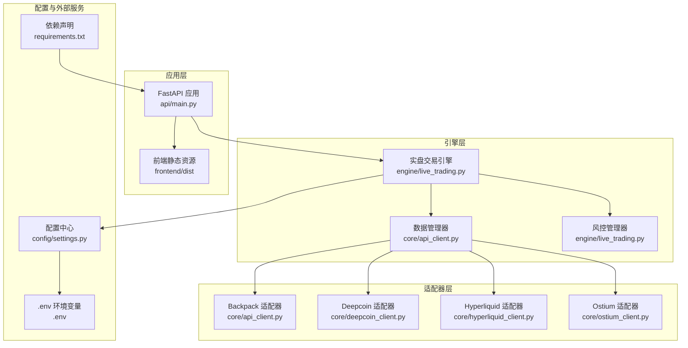
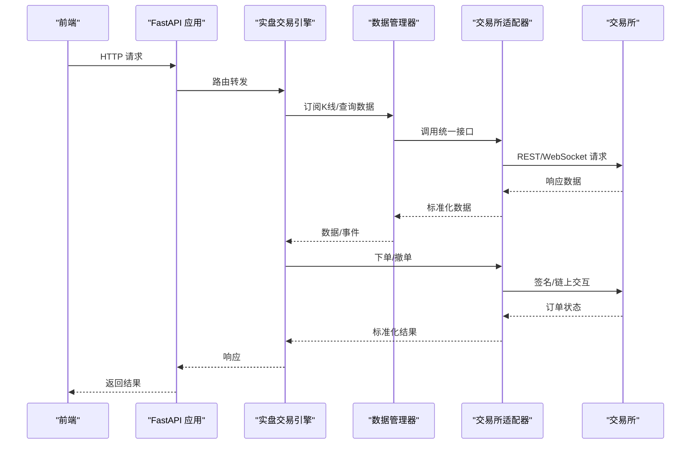
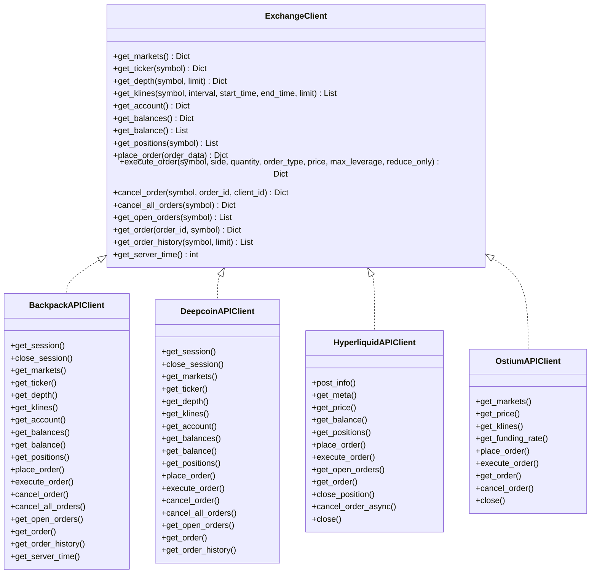
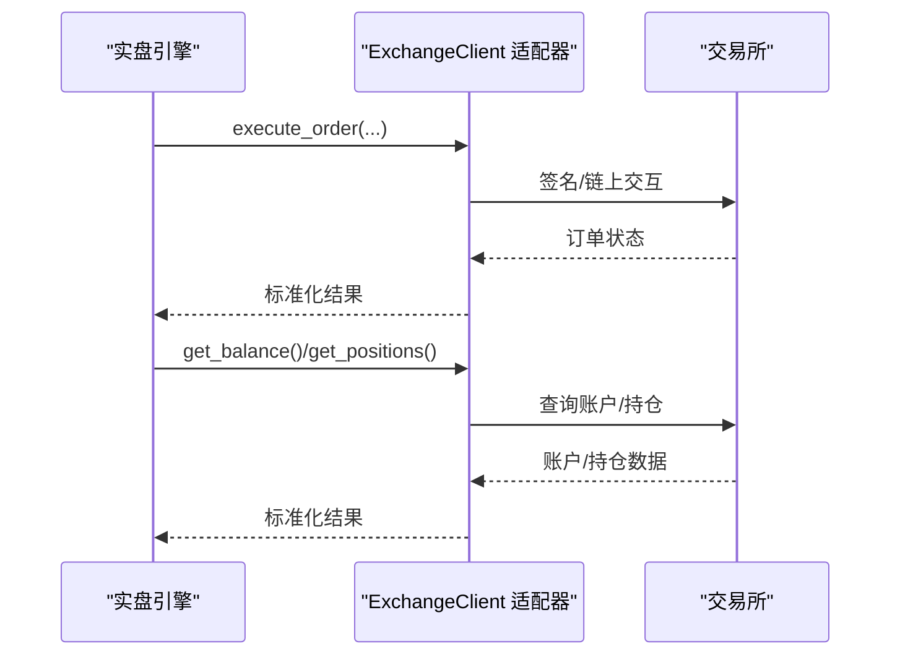
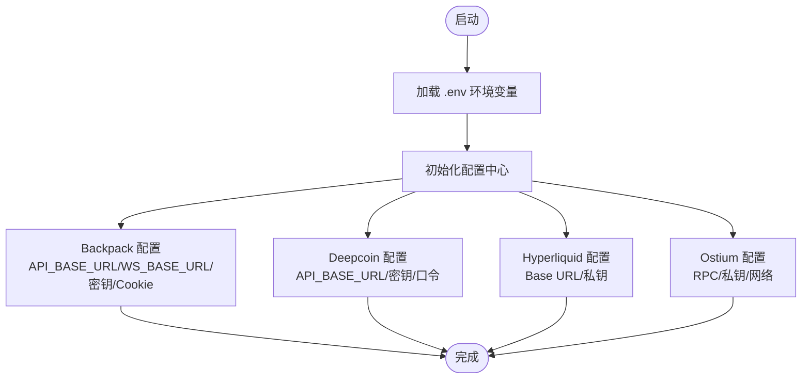
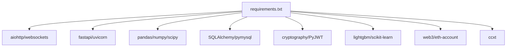

# 集成模式

<cite>
**本文引用的文件**
- [api_client.py](file://backpack_quant_trading/core/api_client.py)
- [settings.py](file://backpack_quant_trading/config/settings.py)
- [deepcoin_client.py](file://backpack_quant_trading/core/deepcoin_client.py)
- [hyperliquid_client.py](file://backpack_quant_trading/core/hyperliquid_client.py)
- [ostium_client.py](file://backpack_quant_trading/core/ostium_client.py)
- [live_trading.py](file://backpack_quant_trading/engine/live_trading.py)
- [main.py](file://backpack_quant_trading/api/main.py)
- [.env](file://backpack_quant_trading/.env)
- [requirements.txt](file://backpack_quant_trading/requirements.txt)
</cite>

## 目录
1. [简介](#简介)
2. [项目结构](#项目结构)
3. [核心组件](#核心组件)
4. [架构总览](#架构总览)
5. [详细组件分析](#详细组件分析)
6. [依赖分析](#依赖分析)
7. [性能考虑](#性能考虑)
8. [故障排除指南](#故障排除指南)
9. [结论](#结论)

## 简介
本文件面向量化交易系统的集成模式，聚焦于如何通过统一的API客户端抽象、适配器模式与配置管理，实现多交易所（Backpack、Deepcoin、Hyperliquid、Ostium）与外部服务的无缝集成。文档涵盖：
- API客户端抽象设计与统一接口定义
- 适配器模式在多交易所接入中的应用
- 多交易所无缝切换与配置管理
- 集成架构图与接口规范
- 错误处理、重试机制与降级策略
- 安全考虑与性能优化

## 项目结构
系统采用分层与模块化组织，核心交易引擎通过抽象接口与适配器模式对接多家交易所，同时通过配置中心集中管理各平台参数。

**图表来源**
- [main.py:1-98](file://backpack_quant_trading/api/main.py#L1-L98)
- [live_trading.py:347-402](file://backpack_quant_trading/engine/live_trading.py#L347-L402)
- [api_client.py:22-86](file://backpack_quant_trading/core/api_client.py#L22-L86)
- [deepcoin_client.py:18-41](file://backpack_quant_trading/core/deepcoin_client.py#L18-L41)
- [hyperliquid_client.py:18-53](file://backpack_quant_trading/core/hyperliquid_client.py#L18-L53)
- [ostium_client.py:19-51](file://backpack_quant_trading/core/ostium_client.py#L19-L51)
- [settings.py:104-137](file://backpack_quant_trading/config/settings.py#L104-L137)
- [.env:1-18](file://backpack_quant_trading/.env#L1-L18)
- [requirements.txt:1-61](file://backpack_quant_trading/requirements.txt#L1-L61)

**章节来源**
- [main.py:1-98](file://backpack_quant_trading/api/main.py#L1-L98)
- [live_trading.py:347-402](file://backpack_quant_trading/engine/live_trading.py#L347-L402)
- [settings.py:104-137](file://backpack_quant_trading/config/settings.py#L104-L137)

## 核心组件
- ExchangeClient 协议：定义统一的交易所接口，包括市场、账户、订单等方法，确保多交易所适配的一致性。
- 适配器实现：
  - BackpackAPIClient：Backpack 交易所 REST/WebSocket 客户端，支持 ED25519 签名与 Cookie 认证。
  - DeepcoinAPIClient：Deepcoin 交易所适配器，负责 REST API 与格式映射。
  - HyperliquidAPIClient：Hyperliquid 交易所适配器，基于 EIP-712 签名与链上交互。
  - OstiumAPIClient：Ostium 交易所适配器，基于 SDK 与链上查询。
- 配置中心：集中管理各平台的 API 地址、密钥与参数，支持 .env 环境变量覆盖。
- 实盘引擎：通过抽象接口与适配器解耦，实现多交易所无缝切换与统一数据流。

**章节来源**
- [api_client.py:22-86](file://backpack_quant_trading/core/api_client.py#L22-L86)
- [api_client.py:87-547](file://backpack_quant_trading/core/api_client.py#L87-L547)
- [deepcoin_client.py:18-488](file://backpack_quant_trading/core/deepcoin_client.py#L18-L488)
- [hyperliquid_client.py:18-546](file://backpack_quant_trading/core/hyperliquid_client.py#L18-L546)
- [ostium_client.py:19-800](file://backpack_quant_trading/core/ostium_client.py#L19-L800)
- [settings.py:13-137](file://backpack_quant_trading/config/settings.py#L13-L137)
- [.env:1-18](file://backpack_quant_trading/.env#L1-L18)

## 架构总览
系统采用“抽象接口 + 适配器 + 配置中心”的集成架构，实现实时行情统一、下单适配多交易所、配置集中管理与运行时切换。

**图表来源**
- [live_trading.py:347-402](file://backpack_quant_trading/engine/live_trading.py#L347-L402)
- [api_client.py:22-86](file://backpack_quant_trading/core/api_client.py#L22-L86)
- [deepcoin_client.py:110-172](file://backpack_quant_trading/core/deepcoin_client.py#L110-L172)
- [hyperliquid_client.py:158-340](file://backpack_quant_trading/core/hyperliquid_client.py#L158-L340)
- [ostium_client.py:399-735](file://backpack_quant_trading/core/ostium_client.py#L399-L735)

## 详细组件分析

### 1) API 客户端抽象设计与统一接口
- ExchangeClient 协议定义了统一的市场、账户、订单等方法，确保不同交易所的实现遵循相同契约。
- BackpackAPIClient 提供 REST/WebSocket 客户端，支持 ED25519 签名与 Cookie 认证，具备请求缓存与错误处理。
- 适配器均实现 ExchangeClient，屏蔽底层差异，使上层策略与引擎无需感知具体交易所细节。

**图表来源**
- [api_client.py:22-86](file://backpack_quant_trading/core/api_client.py#L22-L86)
- [api_client.py:87-547](file://backpack_quant_trading/core/api_client.py#L87-L547)
- [deepcoin_client.py:18-488](file://backpack_quant_trading/core/deepcoin_client.py#L18-L488)
- [hyperliquid_client.py:18-546](file://backpack_quant_trading/core/hyperliquid_client.py#L18-L546)
- [ostium_client.py:19-800](file://backpack_quant_trading/core/ostium_client.py#L19-L800)

**章节来源**
- [api_client.py:22-86](file://backpack_quant_trading/core/api_client.py#L22-L86)
- [api_client.py:87-547](file://backpack_quant_trading/core/api_client.py#L87-L547)

### 2) 适配器模式应用与多交易所无缝切换
- 实盘引擎通过注入 ExchangeClient 实例实现多交易所无缝切换，默认使用 Backpack，也可注入 Deepcoin/Hyperliquid/Ostium 实现器。
- 引擎内部对数据流采用 Backpack WebSocket，对下单与账户查询通过适配器抽象实现，确保策略与引擎稳定运行。

**图表来源**
- [live_trading.py:353-365](file://backpack_quant_trading/engine/live_trading.py#L353-L365)
- [api_client.py:549-547](file://backpack_quant_trading/core/api_client.py#L549-L547)
- [deepcoin_client.py:340-394](file://backpack_quant_trading/core/deepcoin_client.py#L340-L394)
- [hyperliquid_client.py:320-340](file://backpack_quant_trading/core/hyperliquid_client.py#L320-L340)
- [ostium_client.py:703-735](file://backpack_quant_trading/core/ostium_client.py#L703-L735)

**章节来源**
- [live_trading.py:353-365](file://backpack_quant_trading/engine/live_trading.py#L353-L365)

### 3) 配置管理与环境变量
- 配置中心集中管理各平台的 API 地址、密钥与参数，支持 .env 环境变量覆盖，便于开发与生产环境切换。
- 示例：Backpack Cookie 认证与 Deepcoin API 密钥均通过 .env 注入。

**图表来源**
- [settings.py:13-137](file://backpack_quant_trading/config/settings.py#L13-L137)
- [.env:1-18](file://backpack_quant_trading/.env#L1-L18)

**章节来源**
- [settings.py:13-137](file://backpack_quant_trading/config/settings.py#L13-L137)
- [.env:1-18](file://backpack_quant_trading/.env#L1-L18)

### 4) 接口规范与数据流
- 统一接口：所有适配器实现 ExchangeClient，确保 get_markets、get_ticker、get_klines、get_account、get_balances、get_positions、place_order、execute_order、cancel_order、get_open_orders、get_order、get_order_history、get_server_time 等方法签名一致。
- 数据流：引擎通过 Backpack WebSocket 获取实时 K 线与行情，下单通过适配器抽象调用具体交易所接口，账户与持仓查询通过适配器实现。

**章节来源**
- [api_client.py:22-86](file://backpack_quant_trading/core/api_client.py#L22-L86)
- [live_trading.py:536-567](file://backpack_quant_trading/engine/live_trading.py#L536-L567)

## 依赖分析
系统依赖通过 requirements.txt 管理，关键依赖包括：
- 异步网络：aiohttp、websockets
- Web 框架：fastapi、uvicorn
- 数据处理：pandas、numpy、scipy
- 数据库：SQLAlchemy、pymysql
- 加密与安全：cryptography、PyJWT
- 机器学习：lightgbm、scikit-learn
- 区块链与 Web3：web3、eth-account
- 交易所集成：ccxt

**图表来源**
- [requirements.txt:1-61](file://backpack_quant_trading/requirements.txt#L1-L61)

**章节来源**
- [requirements.txt:1-61](file://backpack_quant_trading/requirements.txt#L1-L61)

## 性能考虑
- 会话与并发：适配器使用异步会话（aiohttp、websockets）与线程池包装同步请求，提升吞吐与稳定性。
- 缓存策略：BackpackAPIClient 对市场数据与余额进行缓存，减少重复请求；实盘引擎对余额查询增加缓存与TTL，降低API调用频率。
- 代理与网络：WebSocket 客户端支持代理，增强网络穿透能力；指数退避重连策略降低抖动。
- 数据标准化：适配器内部对返回数据进行标准化，统一字段与格式，减少上层处理成本。

**章节来源**
- [api_client.py:294-310](file://backpack_quant_trading/core/api_client.py#L294-L310)
- [api_client.py:350-390](file://backpack_quant_trading/core/api_client.py#L350-L390)
- [live_trading.py:408-442](file://backpack_quant_trading/engine/live_trading.py#L408-L442)
- [live_trading.py:153-235](file://backpack_quant_trading/engine/live_trading.py#L153-L235)

## 故障排除指南
- 认证与签名问题
  - Backpack：检查 ED25519 密钥与 Cookie 是否正确配置；关注 400 错误提示（签名、参数、频率限制）。
  - Deepcoin：核对 API Key、Secret Key、Passphrase；注意签名参数排序与 JSON 紧凑格式。
  - Hyperliquid：确认私钥格式与链上地址大小写；检查 EIP-712 签名流程与 nonce。
  - Ostium：确认 SDK 初始化与 RPC URL；若 SDK 未初始化，使用模拟数据回退。
- 网络与连接
  - WebSocket 连接失败：检查代理设置与超时；启用指数退避重连；确认订阅参数格式。
  - 速率限制：适配器内置限流处理（如 Deepcoin 429），建议增加重试与退避策略。
- 数据与格式
  - 余额与持仓格式差异：适配器内部进行格式归一化；若返回为空，检查账户权限与交易对有效性。
  - 符号映射：引擎对交易对进行格式转换与映射，确保 WebSocket 订阅与下单使用一致格式。

**章节来源**
- [api_client.py:254-268](file://backpack_quant_trading/core/api_client.py#L254-L268)
- [deepcoin_client.py:150-171](file://backpack_quant_trading/core/deepcoin_client.py#L150-L171)
- [hyperliquid_client.py:483-533](file://backpack_quant_trading/core/hyperliquid_client.py#L483-L533)
- [ostium_client.py:52-78](file://backpack_quant_trading/core/ostium_client.py#L52-L78)
- [live_trading.py:153-235](file://backpack_quant_trading/engine/live_trading.py#L153-L235)

## 结论
通过统一的 ExchangeClient 协议与适配器模式，系统实现了多交易所与外部服务的高内聚、低耦合集成。结合集中配置管理与稳健的错误处理、重试与降级策略，系统在安全性、性能与可维护性方面均具备良好表现。未来可在以下方面持续优化：
- 增强统一错误码与日志分级，提升可观测性
- 引入熔断与限流中间件，进一步提升系统韧性
- 扩展更多交易所适配器，完善生态兼容性