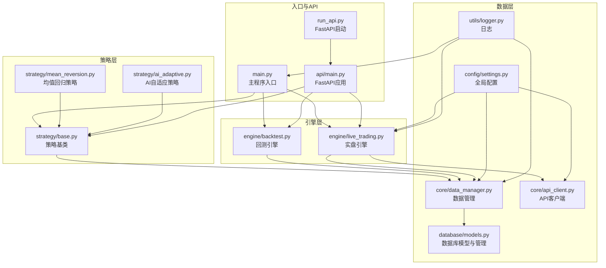
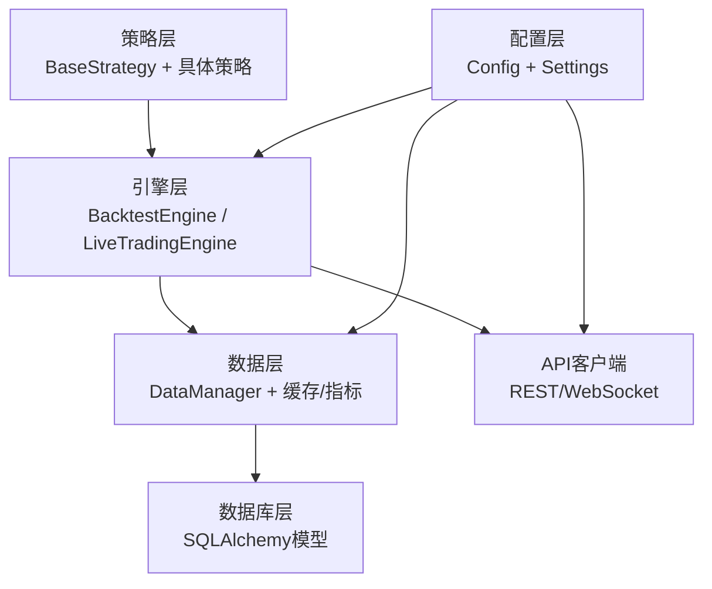
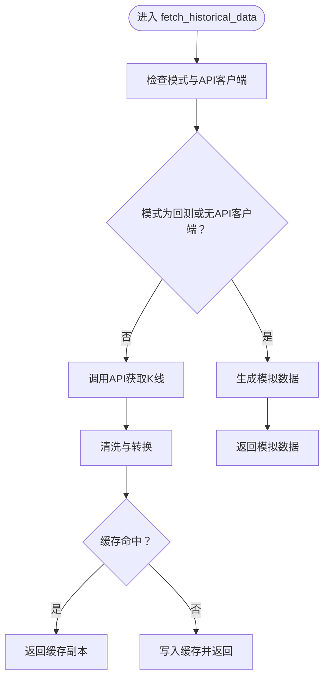
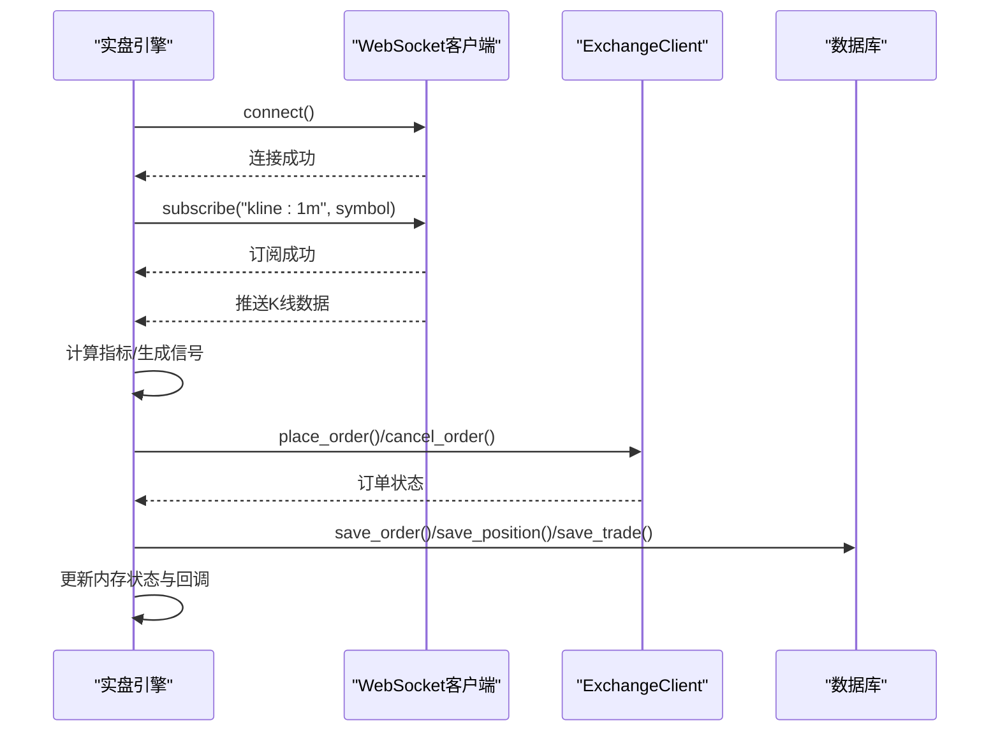
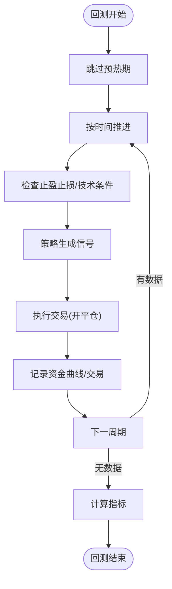
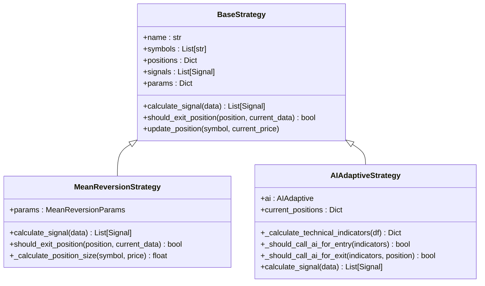
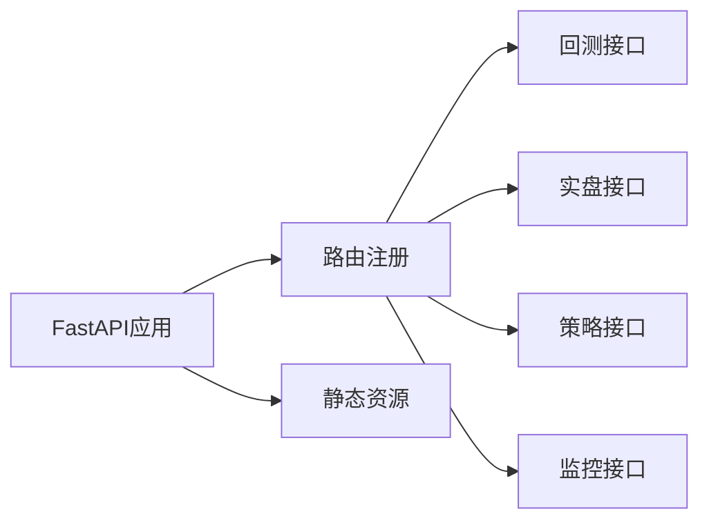
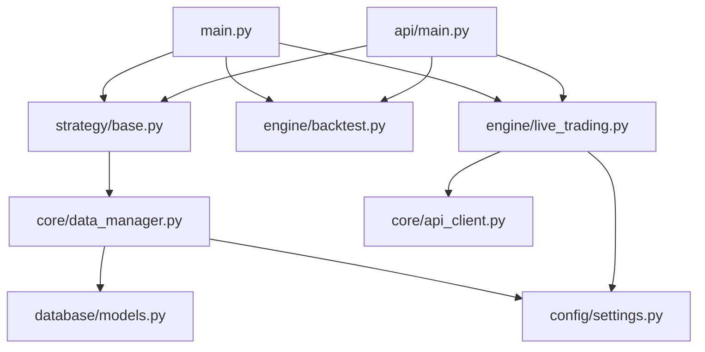

# 性能优化

<cite>
**本文档引用的文件**
- [main.py](file://backpack_quant_trading/main.py)
- [run_api.py](file://backpack_quant_trading/run_api.py)
- [settings.py](file://backpack_quant_trading/config/settings.py)
- [main.py](file://backpack_quant_trading/api/main.py)
- [models.py](file://backpack_quant_trading/database/models.py)
- [data_manager.py](file://backpack_quant_trading/core/data_manager.py)
- [live_trading.py](file://backpack_quant_trading/engine/live_trading.py)
- [backtest.py](file://backpack_quant_trading/engine/backtest.py)
- [base.py](file://backpack_quant_trading/strategy/base.py)
- [logger.py](file://backpack_quant_trading/utils/logger.py)
- [api_client.py](file://backpack_quant_trading/core/api_client.py)
- [mean_reversion.py](file://backpack_quant_trading/strategy/mean_reversion.py)
- [ai_adaptive.py](file://backpack_quant_trading/strategy/ai_adaptive.py)
</cite>

## 目录
1. [简介](#简介)
2. [项目结构](#项目结构)
3. [核心组件](#核心组件)
4. [架构总览](#架构总览)
5. [详细组件分析](#详细组件分析)
6. [依赖关系分析](#依赖关系分析)
7. [性能考虑](#性能考虑)
8. [故障排查指南](#故障排查指南)
9. [结论](#结论)
10. [附录](#附录)

## 简介
本指南面向量化交易系统的性能优化，聚焦于代码层面的优化技巧、数据库查询优化、网络请求优化、内存与CPU性能提升、并发处理优化、缓存策略、数据预加载与异步处理，以及性能测试与基准测试的最佳实践。文档结合系统现有实现，提供可落地的优化方案与可视化图示。

## 项目结构
系统采用分层架构：入口与调度层（主程序与API）、策略层（策略基类与具体策略）、引擎层（回测与实盘）、数据层（数据管理与数据库）、配置与工具（配置、日志、API客户端）。前端通过FastAPI提供REST接口与静态资源托管。

**图表来源**
- [main.py:1-344](file://backpack_quant_trading/main.py#L1-L344)
- [run_api.py:1-32](file://backpack_quant_trading/run_api.py#L1-L32)
- [api/main.py:1-98](file://backpack_quant_trading/api/main.py#L1-L98)
- [strategy/base.py:1-212](file://backpack_quant_trading/strategy/base.py#L1-L212)
- [strategy/mean_reversion.py:1-263](file://backpack_quant_trading/strategy/mean_reversion.py#L1-L263)
- [strategy/ai_adaptive.py:1-881](file://backpack_quant_trading/strategy/ai_adaptive.py#L1-L881)
- [engine/backtest.py:1-404](file://backpack_quant_trading/engine/backtest.py#L1-L404)
- [engine/live_trading.py:1-800](file://backpack_quant_trading/engine/live_trading.py#L1-L800)
- [core/data_manager.py:1-518](file://backpack_quant_trading/core/data_manager.py#L1-L518)
- [database/models.py:1-721](file://backpack_quant_trading/database/models.py#L1-L721)
- [config/settings.py:1-137](file://backpack_quant_trading/config/settings.py#L1-L137)
- [utils/logger.py:1-180](file://backpack_quant_trading/utils/logger.py#L1-L180)
- [core/api_client.py:1-800](file://backpack_quant_trading/core/api_client.py#L1-L800)

**章节来源**
- [main.py:1-344](file://backpack_quant_trading/main.py#L1-L344)
- [api/main.py:1-98](file://backpack_quant_trading/api/main.py#L1-L98)

## 核心组件
- 主程序与调度：负责策略注册、模式切换（回测/实盘）、参数注入与生命周期管理。
- 策略基类与具体策略：定义统一的信号生成与风控接口，策略实现各自逻辑。
- 引擎层：回测引擎提供历史数据驱动的策略评估；实盘引擎负责WebSocket订阅、订单与仓位管理、风控与数据库落盘。
- 数据层：数据管理器负责K线缓存、指标计算与文件持久化；数据库模型负责交易、订单、持仓、风险事件等数据持久化。
- 配置与工具：集中配置（数据库连接池、交易参数、API地址等）；日志系统提供多处理器与轮转策略；API客户端封装REST与WebSocket访问。

**章节来源**
- [strategy/base.py:1-212](file://backpack_quant_trading/strategy/base.py#L1-L212)
- [engine/backtest.py:1-404](file://backpack_quant_trading/engine/backtest.py#L1-L404)
- [engine/live_trading.py:1-800](file://backpack_quant_trading/engine/live_trading.py#L1-L800)
- [core/data_manager.py:1-518](file://backpack_quant_trading/core/data_manager.py#L1-L518)
- [database/models.py:1-721](file://backpack_quant_trading/database/models.py#L1-L721)
- [config/settings.py:1-137](file://backpack_quant_trading/config/settings.py#L1-L137)
- [utils/logger.py:1-180](file://backpack_quant_trading/utils/logger.py#L1-L180)
- [core/api_client.py:1-800](file://backpack_quant_trading/core/api_client.py#L1-L800)

## 架构总览
系统采用“策略-引擎-数据-配置”的分层设计，策略通过异步接口与引擎交互，引擎通过API客户端访问交易所，数据管理器提供缓存与指标计算，数据库模型负责持久化。

**图表来源**
- [strategy/base.py:1-212](file://backpack_quant_trading/strategy/base.py#L1-L212)
- [engine/backtest.py:1-404](file://backpack_quant_trading/engine/backtest.py#L1-L404)
- [engine/live_trading.py:1-800](file://backpack_quant_trading/engine/live_trading.py#L1-L800)
- [core/data_manager.py:1-518](file://backpack_quant_trading/core/data_manager.py#L1-L518)
- [database/models.py:1-721](file://backpack_quant_trading/database/models.py#L1-L721)
- [core/api_client.py:1-800](file://backpack_quant_trading/core/api_client.py#L1-L800)
- [config/settings.py:1-137](file://backpack_quant_trading/config/settings.py#L1-L137)

## 详细组件分析

### 数据管理与缓存优化
- 缓存策略：类级共享的K线缓存、订单簿缓存与TTL控制，避免重复拉取；实时K线缓存按symbol+interval维护，支持追加与滚动裁剪。
- 指标计算：在DataFrame上批量计算移动平均、布林带、RSI、MACD、ATR等，利用向量化操作减少循环。
- 文件持久化：实盘模式下将缓存写入CSV，实现进程间共享与重启恢复。

**图表来源**
- [core/data_manager.py:114-168](file://backpack_quant_trading/core/data_manager.py#L114-L168)

**章节来源**
- [core/data_manager.py:1-518](file://backpack_quant_trading/core/data_manager.py#L1-L518)

### 实盘引擎与并发优化
- WebSocket连接：支持代理、指数退避重连、心跳检测与消息处理；订阅K线频道，异步处理消息。
- 订单与仓位管理：使用锁保护共享状态，提供余额缓存（TTL）减少API调用。
- 任务并发：订单状态轮询、价格监控、仓位监控、资产快照、心跳等任务并行运行。

**图表来源**
- [engine/live_trading.py:126-567](file://backpack_quant_trading/engine/live_trading.py#L126-L567)
- [core/api_client.py:1-800](file://backpack_quant_trading/core/api_client.py#L1-L800)
- [database/models.py:267-721](file://backpack_quant_trading/database/models.py#L267-L721)

**章节来源**
- [engine/live_trading.py:1-800](file://backpack_quant_trading/engine/live_trading.py#L1-L800)
- [core/api_client.py:1-800](file://backpack_quant_trading/core/api_client.py#L1-L800)
- [database/models.py:1-721](file://backpack_quant_trading/database/models.py#L1-L721)

### 回测引擎与性能指标
- 时间推进：按时间序列推进，预热期跳过以保证指标稳定。
- 交易执行：支持多空双向持仓、滑点与手续费模拟、冷却期防重复开仓。
- 指标计算：总收益、年化收益、夏普比率、最大回撤、胜率、盈利因子等。

**图表来源**
- [engine/backtest.py:65-187](file://backpack_quant_trading/engine/backtest.py#L65-L187)

**章节来源**
- [engine/backtest.py:1-404](file://backpack_quant_trading/engine/backtest.py#L1-L404)

### 策略实现与性能要点
- 均值回归策略：基于Z-score与移动平均，参数化仓位与风控，支持动态余额查询与最小交易单位约束。
- AI自适应策略：本地指标预筛选（RSI/MACD/布林带/ATR）降低AI调用频率，区分快速判断与深度分析模式，严格开平仓配对。

**图表来源**
- [strategy/base.py:1-212](file://backpack_quant_trading/strategy/base.py#L1-L212)
- [strategy/mean_reversion.py:1-263](file://backpack_quant_trading/strategy/mean_reversion.py#L1-L263)
- [strategy/ai_adaptive.py:1-881](file://backpack_quant_trading/strategy/ai_adaptive.py#L1-L881)

**章节来源**
- [strategy/base.py:1-212](file://backpack_quant_trading/strategy/base.py#L1-L212)
- [strategy/mean_reversion.py:1-263](file://backpack_quant_trading/strategy/mean_reversion.py#L1-L263)
- [strategy/ai_adaptive.py:1-881](file://backpack_quant_trading/strategy/ai_adaptive.py#L1-L881)

### API与数据库层
- FastAPI应用：CORS配置、路由注册、静态资源挂载、健康检查。
- 数据库管理：连接池配置（池大小、溢出）、事务封装、幂等写入（去重、截断）、索引优化。

**图表来源**
- [api/main.py:1-98](file://backpack_quant_trading/api/main.py#L1-L98)

**章节来源**
- [api/main.py:1-98](file://backpack_quant_trading/api/main.py#L1-L98)
- [database/models.py:267-721](file://backpack_quant_trading/database/models.py#L267-L721)
- [config/settings.py:44-53](file://backpack_quant_trading/config/settings.py#L44-L53)

## 依赖关系分析
- 组件耦合：策略依赖数据管理器与风控器；引擎依赖API客户端与数据库；数据管理器依赖配置与数据库；API客户端依赖配置。
- 外部依赖：requests、websockets、SQLAlchemy、pandas/numpy、FastAPI、uvicorn。

**图表来源**
- [main.py:1-344](file://backpack_quant_trading/main.py#L1-L344)
- [strategy/base.py:1-212](file://backpack_quant_trading/strategy/base.py#L1-L212)
- [engine/backtest.py:1-404](file://backpack_quant_trading/engine/backtest.py#L1-L404)
- [engine/live_trading.py:1-800](file://backpack_quant_trading/engine/live_trading.py#L1-L800)
- [core/data_manager.py:1-518](file://backpack_quant_trading/core/data_manager.py#L1-L518)
- [core/api_client.py:1-800](file://backpack_quant_trading/core/api_client.py#L1-L800)
- [database/models.py:1-721](file://backpack_quant_trading/database/models.py#L1-L721)
- [config/settings.py:1-137](file://backpack_quant_trading/config/settings.py#L1-L137)
- [api/main.py:1-98](file://backpack_quant_trading/api/main.py#L1-L98)

**章节来源**
- [main.py:1-344](file://backpack_quant_trading/main.py#L1-L344)
- [api/main.py:1-98](file://backpack_quant_trading/api/main.py#L1-L98)

## 性能考虑

### 代码层面优化
- 向量化与批处理：在数据管理器中对指标计算使用pandas/numpy向量化，避免逐行循环。
- 缓存与TTL：合理设置缓存容量与过期时间，避免内存膨胀；对热点数据（K线、订单簿、余额）使用TTL缓存。
- 异常与降级：API调用失败时使用过期缓存回退，避免系统崩溃；WebSocket断连自动重连与指数退避。
- 并发与锁：对共享状态（订单、仓位、余额）使用锁保护；任务并发执行时避免竞争条件。

**章节来源**
- [core/data_manager.py:1-518](file://backpack_quant_trading/core/data_manager.py#L1-L518)
- [engine/live_trading.py:1-800](file://backpack_quant_trading/engine/live_trading.py#L1-L800)
- [strategy/ai_adaptive.py:1-881](file://backpack_quant_trading/strategy/ai_adaptive.py#L1-L881)

### 数据库查询优化
- 连接池：合理设置池大小与溢出，避免连接争用；开启pre_ping保持连接活性。
- 索引：对常用查询字段建立复合索引（如symbol+timestamp+source），减少全表扫描。
- 幂等写入：对重复数据进行去重（如trade_id），避免重复插入导致的性能下降。
- 事务与批量：批量写入时使用merge/merge策略，减少事务开销。

**章节来源**
- [config/settings.py:44-53](file://backpack_quant_trading/config/settings.py#L44-L53)
- [database/models.py:45-62](file://backpack_quant_trading/database/models.py#L45-L62)
- [database/models.py:354-382](file://backpack_quant_trading/database/models.py#L354-L382)

### 网络请求优化
- 代理与超时：WebSocket连接支持代理，设置合理的超时与重连间隔；REST请求使用线程池包装，避免阻塞事件循环。
- 签名与认证：API签名参数严格排序与编码，减少签名错误导致的重试。
- 请求合并：对高频查询（如市场列表）使用缓存，避免重复请求。

**章节来源**
- [core/api_client.py:1-800](file://backpack_quant_trading/core/api_client.py#L1-L800)
- [engine/live_trading.py:153-235](file://backpack_quant_trading/engine/live_trading.py#L153-L235)

### 内存使用优化
- 缓存裁剪：对K线缓存设置最大容量，按最久未使用淘汰；实时K线滚动裁剪，避免无限增长。
- 文件共享：实盘模式下将缓存写入CSV，实现多进程共享，减少重复拉取。
- 日志轮转：使用安全的文件处理器与轮转策略，避免磁盘占用与权限问题。

**章节来源**
- [core/data_manager.py:270-301](file://backpack_quant_trading/core/data_manager.py#L270-L301)
- [utils/logger.py:1-180](file://backpack_quant_trading/utils/logger.py#L1-L180)

### CPU性能提升
- 指标计算：在策略层使用本地指标预筛选（RSI/MACD/布林带/ATR），降低AI调用频率，减少CPU消耗。
- 任务拆分：将订单状态轮询、价格监控、仓位监控、心跳等任务拆分为独立协程，提高CPU利用率。
- 参数化：通过配置文件统一管理交易参数（杠杆、止盈止损比例），避免硬编码带来的调试成本。

**章节来源**
- [strategy/ai_adaptive.py:80-164](file://backpack_quant_trading/strategy/ai_adaptive.py#L80-L164)
- [engine/live_trading.py:558-567](file://backpack_quant_trading/engine/live_trading.py#L558-L567)
- [config/settings.py:55-64](file://backpack_quant_trading/config/settings.py#L55-L64)

### 并发处理优化
- 事件循环：使用asyncio.gather并行运行多个任务；WebSocket消息处理与心跳检测分离。
- 锁与原子性：对共享状态（订单、仓位、余额）使用锁，避免竞态条件。
- 超时与重试：对网络请求设置超时与指数退避重试，提升稳定性。

**章节来源**
- [engine/live_trading.py:558-567](file://backpack_quant_trading/engine/live_trading.py#L558-L567)
- [core/api_client.py:648-746](file://backpack_quant_trading/core/api_client.py#L648-L746)

### 缓存策略、数据预加载与异步处理
- 缓存策略：K线缓存、订单簿缓存、余额缓存（TTL），避免重复API调用。
- 数据预加载：实盘初始化阶段预加载历史K线，确保策略启动时具备充足数据。
- 异步处理：WebSocket消息异步处理，API请求通过线程池包装，回测与实盘均采用异步接口。

**章节来源**
- [engine/live_trading.py:523-527](file://backpack_quant_trading/engine/live_trading.py#L523-L527)
- [core/data_manager.py:128-168](file://backpack_quant_trading/core/data_manager.py#L128-L168)
- [core/api_client.py:147-156](file://backpack_quant_trading/core/api_client.py#L147-L156)

### 性能测试工具与基准测试
- 回测指标：总收益、年化收益、夏普比率、最大回撤、胜率、盈利因子，用于评估策略性能。
- 日志与监控：通过日志系统记录关键事件与错误，辅助定位性能瓶颈。
- 基准测试建议：在相同硬件与数据集上对比不同策略参数与缓存配置的性能差异，记录CPU/内存/网络使用情况。

**章节来源**
- [engine/backtest.py:333-383](file://backpack_quant_trading/engine/backtest.py#L333-L383)
- [utils/logger.py:1-180](file://backpack_quant_trading/utils/logger.py#L1-L180)

## 故障排查指南
- WebSocket断连：检查代理设置与连接超时，启用指数退避重连；关注心跳超时与pong响应。
- API调用失败：检查签名参数、时间戳与请求频率限制；必要时使用过期缓存回退。
- 数据库写入异常：检查重复键与字段长度截断，确保幂等写入；开启事务回滚与异常捕获。
- 日志轮转问题：在Windows环境下使用安全文件处理器，避免权限冲突。

**章节来源**
- [engine/live_trading.py:153-235](file://backpack_quant_trading/engine/live_trading.py#L153-L235)
- [core/api_client.py:254-268](file://backpack_quant_trading/core/api_client.py#L254-L268)
- [database/models.py:354-382](file://backpack_quant_trading/database/models.py#L354-L382)
- [utils/logger.py:10-55](file://backpack_quant_trading/utils/logger.py#L10-L55)

## 结论
通过合理的缓存策略、数据库索引与连接池配置、异步并发与锁保护、本地指标预筛选与任务拆分，系统可在保证稳定性的同时显著提升性能。建议持续通过回测指标与日志监控进行性能评估与优化迭代。

## 附录
- FastAPI启动：开发模式下通过run_api.py启动，支持热重载与信号处理。
- CORS与静态资源：API应用配置跨域与静态文件挂载，便于前后端联调。

**章节来源**
- [run_api.py:1-32](file://backpack_quant_trading/run_api.py#L1-L32)
- [api/main.py:20-98](file://backpack_quant_trading/api/main.py#L20-L98)