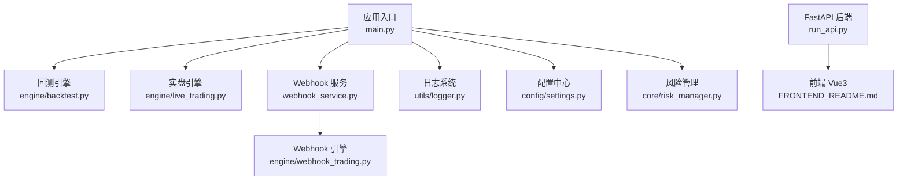
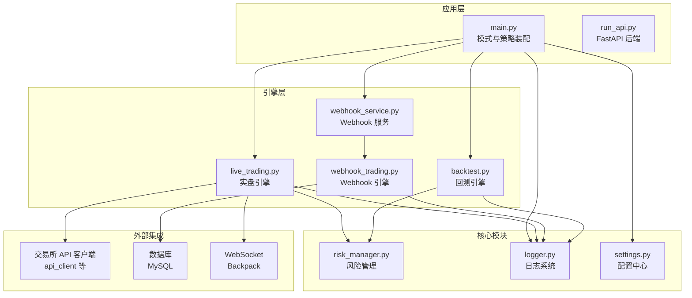
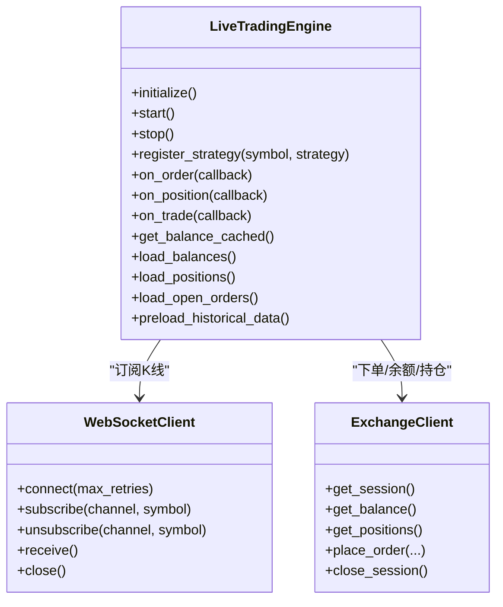
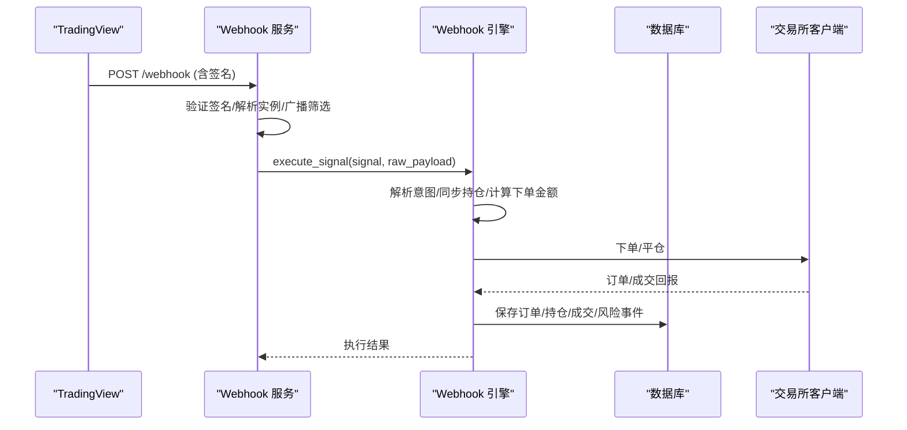
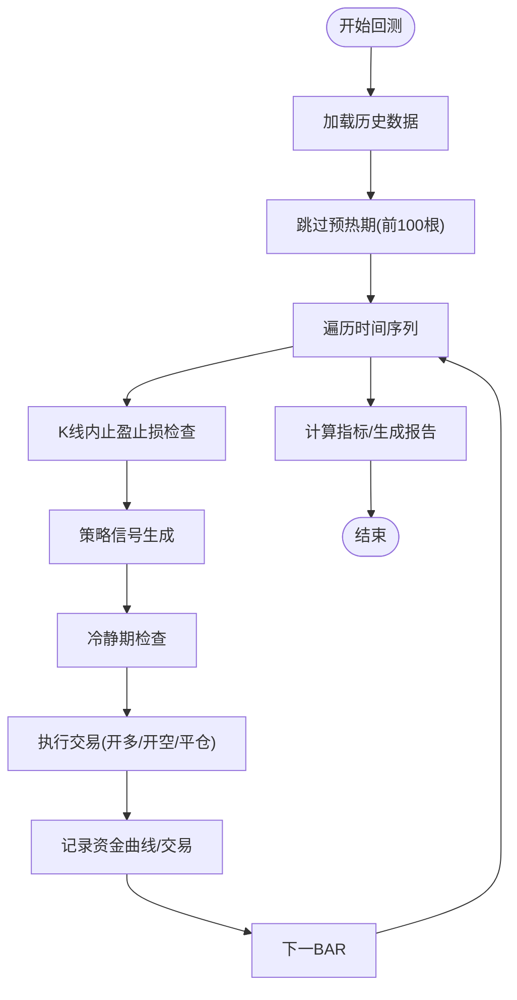
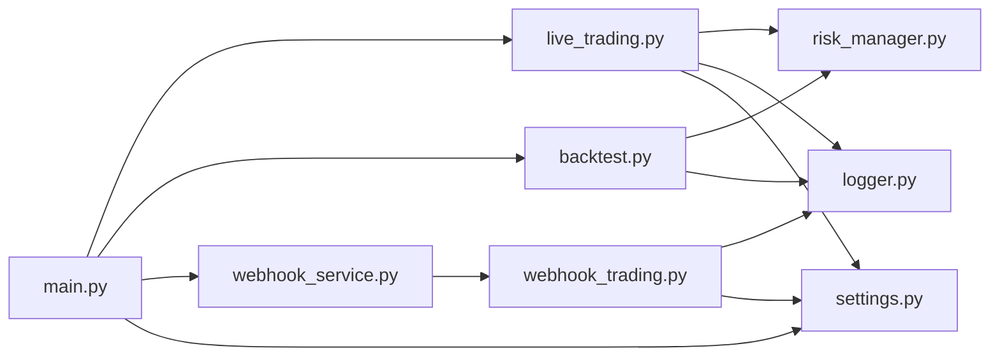

# 故障排除与维护

<cite>
**本文引用的文件**
- [main.py](file://backpack_quant_trading/main.py)
- [run_api.py](file://backpack_quant_trading/run_api.py)
- [webhook_service.py](file://backpack_quant_trading/webhook_service.py)
- [logger.py](file://backpack_quant_trading/utils/logger.py)
- [settings.py](file://backpack_quant_trading/config/settings.py)
- [live_trading.py](file://backpack_quant_trading/engine/live_trading.py)
- [backtest.py](file://backpack_quant_trading/engine/backtest.py)
- [webhook_trading.py](file://backpack_quant_trading/engine/webhook_trading.py)
- [risk_manager.py](file://backpack_quant_trading/core/risk_manager.py)
- [DATA_SOURCE_AND_CACHE.md](file://backpack_quant_trading/docs/DATA_SOURCE_AND_CACHE.md)
- [FRONTEND_README.md](file://backpack_quant_trading/FRONTEND_README.md)
- [api接入文档.md](file://backpack_quant_trading/api接入文档.md)
</cite>

## 目录
1. [简介](#简介)
2. [项目结构](#项目结构)
3. [核心组件](#核心组件)
4. [架构总览](#架构总览)
5. [详细组件分析](#详细组件分析)
6. [依赖关系分析](#依赖关系分析)
7. [性能考量](#性能考量)
8. [故障排除指南](#故障排除指南)
9. [结论](#结论)
10. [附录](#附录)

## 简介
本指南面向系统运维与维护人员，聚焦于量化交易系统的故障排除与日常维护。内容涵盖常见故障类型识别、诊断流程、问题解决方法，系统崩溃恢复、数据修复与配置错误处理，定期维护任务与健康检查，日志分析与错误追踪，以及紧急响应、数据备份与灾难恢复的实施步骤。文档结合代码结构与实际实现，提供可操作的步骤与可视化图示，帮助快速定位与解决问题。

## 项目结构
系统采用模块化分层设计：
- 应用入口与运行模式：主程序负责回测与实盘模式切换、策略注册与引擎装配。
- 引擎层：回测引擎、实盘引擎、Webhook 引擎，分别处理历史回测、实时交易与外部信号驱动交易。
- 核心模块：风险管理、数据管理、API 客户端适配、日志工具。
- 配置与日志：集中配置与日志轮转，支持多通道输出与文件轮转。
- 前端与后端：FastAPI 提供 API，Vue3 前端通过代理访问后端。

**图示来源**
- [main.py:289-344](file://backpack_quant_trading/main.py#L289-L344)
- [backtest.py:48-187](file://backpack_quant_trading/engine/backtest.py#L48-L187)
- [live_trading.py:347-567](file://backpack_quant_trading/engine/live_trading.py#L347-L567)
- [webhook_service.py:26-598](file://backpack_quant_trading/webhook_service.py#L26-L598)
- [webhook_trading.py:40-92](file://backpack_quant_trading/engine/webhook_trading.py#L40-L92)
- [logger.py:57-125](file://backpack_quant_trading/utils/logger.py#L57-L125)
- [settings.py:104-132](file://backpack_quant_trading/config/settings.py#L104-L132)
- [risk_manager.py:48-130](file://backpack_quant_trading/core/risk_manager.py#L48-L130)
- [run_api.py:9-32](file://backpack_quant_trading/run_api.py#L9-L32)
- [FRONTEND_README.md:1-78](file://backpack_quant_trading/FRONTEND_README.md#L1-L78)

**章节来源**
- [main.py:289-344](file://backpack_quant_trading/main.py#L289-L344)
- [FRONTEND_README.md:1-78](file://backpack_quant_trading/FRONTEND_README.md#L1-L78)

## 核心组件
- 应用入口与模式切换：负责解析命令行参数、选择运行模式（回测/实盘）、装配策略与引擎、处理信号中断。
- 回测引擎：加载历史数据、计算指标、执行交易、统计指标并生成报告。
- 实盘引擎：封装 WebSocket 订阅、订单与持仓管理、风险控制、余额缓存与缓存失效策略。
- Webhook 服务：多实例管理、签名验证、广播路由、动态配置更新、熔断与休市监控。
- Webhook 引擎：信号解析、意图识别、开平仓执行、数据库持久化、实时止损与休市监控。
- 风险管理：仓位校验、日度限额、回撤控制、VaR 与压力测试、风险事件记录。
- 日志系统：控制台与文件多通道、按大小轮转、Windows 安全写入、交易专用日志器。
- 配置中心：统一读取环境变量、构建数据库连接、暴露交易与 Webhook 配置。

**章节来源**
- [main.py:58-149](file://backpack_quant_trading/main.py#L58-L149)
- [backtest.py:48-187](file://backpack_quant_trading/engine/backtest.py#L48-L187)
- [live_trading.py:347-567](file://backpack_quant_trading/engine/live_trading.py#L347-L567)
- [webhook_service.py:26-598](file://backpack_quant_trading/webhook_service.py#L26-L598)
- [webhook_trading.py:40-92](file://backpack_quant_trading/engine/webhook_trading.py#L40-L92)
- [risk_manager.py:48-130](file://backpack_quant_trading/core/risk_manager.py#L48-L130)
- [logger.py:57-125](file://backpack_quant_trading/utils/logger.py#L57-L125)
- [settings.py:104-132](file://backpack_quant_trading/config/settings.py#L104-L132)

## 架构总览
系统通过统一入口协调引擎与组件，形成“策略—引擎—数据/风控—日志/配置”的闭环。实盘与 Webhook 两条主线并行，既支持独立运行也支持联动。

**图示来源**
- [main.py:58-149](file://backpack_quant_trading/main.py#L58-L149)
- [backtest.py:48-187](file://backpack_quant_trading/engine/backtest.py#L48-L187)
- [live_trading.py:347-567](file://backpack_quant_trading/engine/live_trading.py#L347-L567)
- [webhook_service.py:26-598](file://backpack_quant_trading/webhook_service.py#L26-L598)
- [webhook_trading.py:40-92](file://backpack_quant_trading/engine/webhook_trading.py#L40-L92)
- [risk_manager.py:48-130](file://backpack_quant_trading/core/risk_manager.py#L48-L130)
- [logger.py:57-125](file://backpack_quant_trading/utils/logger.py#L57-L125)
- [settings.py:104-132](file://backpack_quant_trading/config/settings.py#L104-L132)

## 详细组件分析

### 实盘引擎（LiveTradingEngine）
- 职责：统一行情数据（Backpack WebSocket）、订单执行（抽象 ExchangeClient）、余额缓存、持仓与订单管理、回调通知。
- 关键特性：WebSocket 连接与重连、订阅频道、余额缓存 TTL、交易对格式转换与映射、并发锁保护。
- 故障点：WebSocket 连接失败、代理不兼容、余额 API 失败、缓存过期导致异常。

**图示来源**
- [live_trading.py:347-567](file://backpack_quant_trading/engine/live_trading.py#L347-L567)
- [live_trading.py:126-345](file://backpack_quant_trading/engine/live_trading.py#L126-L345)

**章节来源**
- [live_trading.py:347-567](file://backpack_quant_trading/engine/live_trading.py#L347-L567)
- [live_trading.py:126-345](file://backpack_quant_trading/engine/live_trading.py#L126-L345)

### Webhook 服务与引擎
- Webhook 服务：多实例注册/注销、签名验证、广播路由、动态配置更新、健康检查、熔断重置。
- Webhook 引擎：信号解析、意图识别（开仓/平仓）、开仓下单与数据库持久化、平仓与 PnL 计算、实时止损与休市监控。

**图示来源**
- [webhook_service.py:319-443](file://backpack_quant_trading/webhook_service.py#L319-L443)
- [webhook_trading.py:208-294](file://backpack_quant_trading/engine/webhook_trading.py#L208-L294)
- [webhook_trading.py:405-540](file://backpack_quant_trading/engine/webhook_trading.py#L405-L540)

**章节来源**
- [webhook_service.py:26-598](file://backpack_quant_trading/webhook_service.py#L26-L598)
- [webhook_trading.py:40-92](file://backpack_quant_trading/engine/webhook_trading.py#L40-L92)
- [webhook_trading.py:208-294](file://backpack_quant_trading/engine/webhook_trading.py#L208-L294)
- [webhook_trading.py:405-540](file://backpack_quant_trading/engine/webhook_trading.py#L405-L540)

### 回测引擎
- 职责：加载历史数据、计算指标、执行交易、滑点与手续费模拟、统计指标与报告生成。
- 关键流程：预热期跳过、止盈止损内检查、冷静期、资金曲线记录。

**图示来源**
- [backtest.py:65-187](file://backpack_quant_trading/engine/backtest.py#L65-L187)

**章节来源**
- [backtest.py:48-187](file://backpack_quant_trading/engine/backtest.py#L48-L187)

### 风险管理
- 职责：仓位校验、日度限额、回撤控制、VaR 与压力测试、风险事件记录与数据库落盘。
- 关键点：总保证金累计、账户资金估算、止损止盈价格计算、风险事件分级与告警。

**章节来源**
- [risk_manager.py:48-130](file://backpack_quant_trading/core/risk_manager.py#L48-L130)
- [risk_manager.py:132-229](file://backpack_quant_trading/core/risk_manager.py#L132-L229)
- [risk_manager.py:503-542](file://backpack_quant_trading/core/risk_manager.py#L503-L542)

### 日志系统
- 特性：控制台行缓冲输出、文件按大小轮转、Windows 安全写入、交易专用日志器、多通道格式化。
- 用途：交易日志、错误日志、应用日志、实时查看与排查。

**章节来源**
- [logger.py:57-125](file://backpack_quant_trading/utils/logger.py#L57-L125)
- [logger.py:137-180](file://backpack_quant_trading/utils/logger.py#L137-L180)

### 配置中心
- 功能：读取环境变量、构建数据库连接、统一暴露交易与 Webhook 配置、项目根目录与日志/数据目录统一管理。

**章节来源**
- [settings.py:104-132](file://backpack_quant_trading/config/settings.py#L104-L132)

## 依赖关系分析
- 组件耦合：实盘引擎依赖抽象 ExchangeClient 与 WebSocket；Webhook 服务依赖 Webhook 引擎；回测引擎依赖策略与数据管理；风险管理贯穿引擎与交易流程。
- 外部依赖：交易所 API、数据库、WebSocket、FastAPI、前端 Vue3。
- 循环依赖规避：引擎通过抽象客户端解耦具体交易所实现。

**图示来源**
- [main.py:58-149](file://backpack_quant_trading/main.py#L58-L149)
- [live_trading.py:347-567](file://backpack_quant_trading/engine/live_trading.py#L347-L567)
- [backtest.py:48-187](file://backpack_quant_trading/engine/backtest.py#L48-L187)
- [webhook_service.py:26-598](file://backpack_quant_trading/webhook_service.py#L26-L598)
- [webhook_trading.py:40-92](file://backpack_quant_trading/engine/webhook_trading.py#L40-L92)
- [risk_manager.py:48-130](file://backpack_quant_trading/core/risk_manager.py#L48-L130)
- [logger.py:57-125](file://backpack_quant_trading/utils/logger.py#L57-L125)
- [settings.py:104-132](file://backpack_quant_trading/config/settings.py#L104-L132)

**章节来源**
- [main.py:58-149](file://backpack_quant_trading/main.py#L58-L149)
- [live_trading.py:347-567](file://backpack_quant_trading/engine/live_trading.py#L347-L567)
- [backtest.py:48-187](file://backpack_quant_trading/engine/backtest.py#L48-L187)
- [webhook_service.py:26-598](file://backpack_quant_trading/webhook_service.py#L26-L598)
- [webhook_trading.py:40-92](file://backpack_quant_trading/engine/webhook_trading.py#L40-L92)
- [risk_manager.py:48-130](file://backpack_quant_trading/core/risk_manager.py#L48-L130)
- [logger.py:57-125](file://backpack_quant_trading/utils/logger.py#L57-L125)
- [settings.py:104-132](file://backpack_quant_trading/config/settings.py#L104-L132)

## 性能考量
- WebSocket 连接与重连：指数退避与代理兼容检查，避免频繁重试导致资源浪费。
- 余额缓存：10 分钟 TTL，减少 API 调用频率，提升实时性与稳定性。
- 日志轮转：按大小轮转，避免磁盘占用过大；Windows 安全写入减少权限冲突。
- 回测预热期：跳过前 100 根 K 线，确保指标稳定后再交易，提高回测准确性。
- 风险指标：VaR 与压力测试提供定量风险评估，辅助决策。

[本节为通用指导，无需特定文件引用]

## 故障排除指南

### 一、常见故障类型与识别
- WebSocket 连接失败/断开
  - 现象：连接超时、连接关闭、订阅失败。
  - 依据：连接与订阅逻辑、异常捕获与重试。
- 代理不兼容
  - 现象：代理设置未生效、库版本不支持 proxy 参数。
  - 依据：代理检测与降级提示。
- 余额 API 失败
  - 现象：余额为空、异常堆栈、使用过期缓存。
  - 依据：余额缓存与异常处理。
- Webhook 签名验证失败
  - 现象：401 错误、日志警告。
  - 依据：签名验证逻辑。
- 信号丢失与自愈
  - 现象：重复开仓信号、已有仓位、强平自愈。
  - 依据：信号意图解析与自愈逻辑。
- 熔断与休市
  - 现象：熔断锁定、休市自动平仓。
  - 依据：熔断监控与休市监控。

**章节来源**
- [live_trading.py:153-235](file://backpack_quant_trading/engine/live_trading.py#L153-L235)
- [live_trading.py:163-176](file://backpack_quant_trading/engine/live_trading.py#L163-L176)
- [live_trading.py:421-441](file://backpack_quant_trading/engine/live_trading.py#L421-L441)
- [webhook_service.py:34-45](file://backpack_quant_trading/webhook_service.py#L34-L45)
- [webhook_trading.py:243-261](file://backpack_quant_trading/engine/webhook_trading.py#L243-L261)
- [webhook_trading.py:627-683](file://backpack_quant_trading/engine/webhook_trading.py#L627-L683)

### 二、诊断流程与步骤
- 快速自检
  - 检查日志：查看 trades.log、errors.log、app_YYYYMMDD.log。
  - 检查网络：确认 WebSocket 与 API 可达性。
  - 检查配置：核对环境变量与配置文件。
- 实盘诊断
  - 重连与订阅：确认连接状态、订阅频道、代理设置。
  - 余额与持仓：检查余额缓存与缓存 TTL、数据库一致性。
- Webhook 诊断
  - 签名验证：核对密钥与签名算法。
  - 实例状态：检查实例注册、广播路由、熔断状态。
  - 数据库：确认订单/持仓/成交/风险事件落盘。

**章节来源**
- [logger.py:57-125](file://backpack_quant_trading/utils/logger.py#L57-L125)
- [live_trading.py:153-235](file://backpack_quant_trading/engine/live_trading.py#L153-L235)
- [webhook_service.py:34-45](file://backpack_quant_trading/webhook_service.py#L34-L45)
- [webhook_trading.py:405-540](file://backpack_quant_trading/engine/webhook_trading.py#L405-L540)

### 三、问题解决方法
- WebSocket 连接失败
  - 步骤：检查代理设置与库版本；启用指数退避重连；记录最后一次错误信息。
  - 参考：连接与订阅逻辑、异常处理。
- 代理不兼容
  - 步骤：升级 websockets；或移除代理设置；记录警告信息。
  - 参考：代理检测与降级提示。
- 余额 API 失败
  - 步骤：使用过期缓存；检查缓存 TTL；记录异常并继续运行。
  - 参考：余额缓存与异常处理。
- Webhook 签名验证失败
  - 步骤：核对密钥；重新生成签名；检查请求头。
  - 参考：签名验证逻辑。
- 信号丢失与自愈
  - 步骤：强平自愈；跳过下一个相反信号；发送钉钉通知。
  - 参考：信号意图解析与自愈逻辑。
- 熔断与休市
  - 步骤：熔断锁定时禁止交易；休市自动平仓；手动重置后恢复。
  - 参考：熔断监控与休市监控。

**章节来源**
- [live_trading.py:153-235](file://backpack_quant_trading/engine/live_trading.py#L153-L235)
- [live_trading.py:163-176](file://backpack_quant_trading/engine/live_trading.py#L163-L176)
- [live_trading.py:421-441](file://backpack_quant_trading/engine/live_trading.py#L421-L441)
- [webhook_service.py:34-45](file://backpack_quant_trading/webhook_service.py#L34-L45)
- [webhook_trading.py:243-261](file://backpack_quant_trading/engine/webhook_trading.py#L243-L261)
- [webhook_trading.py:627-683](file://backpack_quant_trading/engine/webhook_trading.py#L627-L683)

### 四、系统崩溃恢复
- 实盘崩溃
  - 步骤：停止引擎、取消未完成订单、关闭 WebSocket、关闭会话；重启后重新初始化。
  - 参考：停止流程与异常处理。
- Webhook 服务崩溃
  - 步骤：清理实例与锁、关闭引擎、重启服务；恢复后重新注册实例。
  - 参考：服务生命周期与关闭逻辑。

**章节来源**
- [live_trading.py:569-586](file://backpack_quant_trading/engine/live_trading.py#L569-L586)
- [webhook_service.py:53-68](file://backpack_quant_trading/webhook_service.py#L53-L68)

### 五、数据修复与配置错误处理
- 数据修复
  - 交易日志修复：检查 trades.log 与数据库一致性；必要时重放关键事件。
  - 风险事件修复：检查风险事件记录与数据库落盘。
- 配置错误处理
  - 环境变量：核对配置中心读取逻辑；避免空值覆盖。
  - Webhook 配置：动态更新保证金、止盈止损、杠杆与交易对。
  - 交易所配置：核对 API Key/Secret、WS 地址、Cookie 认证。

**章节来源**
- [logger.py:137-180](file://backpack_quant_trading/utils/logger.py#L137-L180)
- [risk_manager.py:302-330](file://backpack_quant_trading/core/risk_manager.py#L302-L330)
- [settings.py:104-132](file://backpack_quant_trading/config/settings.py#L104-L132)
- [webhook_service.py:512-588](file://backpack_quant_trading/webhook_service.py#L512-L588)

### 六、定期维护任务与健康检查
- 日常维护
  - 日志轮转与清理：检查轮转文件数量与大小；清理过期日志。
  - 数据库健康：检查连接池、事务与索引；定期归档风险事件。
  - 配置校验：核对环境变量与配置文件变更。
- 周期性检查
  - WebSocket 连接健康：检查订阅状态与消息接收。
  - Webhook 实例健康：检查实例数量、状态与熔断情况。
  - 风险指标：检查日度限额、回撤与 VaR 结果。

**章节来源**
- [logger.py:57-125](file://backpack_quant_trading/utils/logger.py#L57-L125)
- [webhook_service.py:79-81](file://backpack_quant_trading/webhook_service.py#L79-L81)
- [risk_manager.py:503-542](file://backpack_quant_trading/core/risk_manager.py#L503-L542)

### 七、日志分析技巧与错误追踪
- 日志分析
  - 使用日志轮转文件定位异常；关注错误级别与时间戳。
  - 交易日志：订单、成交、信号、风险事件。
- 错误追踪
  - 结合异常堆栈与上下文信息；定位具体模块与函数。
  - 使用日志工具的格式化输出与安全写入特性。

**章节来源**
- [logger.py:57-125](file://backpack_quant_trading/utils/logger.py#L57-L125)
- [logger.py:137-180](file://backpack_quant_trading/utils/logger.py#L137-L180)

### 八、紧急响应流程
- Webhook 熔断
  - 步骤：检查熔断原因；发送钉钉通知；手动重置后恢复。
- 实盘异常
  - 步骤：停止引擎、取消订单、关闭连接；检查日志与配置。
- 数据库异常
  - 步骤：检查连接池与事务；回滚异常事务；修复索引与约束。

**章节来源**
- [webhook_trading.py:627-683](file://backpack_quant_trading/engine/webhook_trading.py#L627-L683)
- [live_trading.py:569-586](file://backpack_quant_trading/engine/live_trading.py#L569-L586)
- [risk_manager.py:302-330](file://backpack_quant_trading/core/risk_manager.py#L302-L330)

### 九、数据备份与灾难恢复
- 备份策略
  - 日志备份：按日轮转文件；定期归档。
  - 数据库备份：定时全量与增量备份；验证恢复流程。
- 灾难恢复
  - 快速恢复：重启服务与引擎；恢复实例注册；验证数据一致性。
  - 风险事件恢复：检查风险事件记录与数据库落盘。

**章节来源**
- [logger.py:57-125](file://backpack_quant_trading/utils/logger.py#L57-L125)
- [risk_manager.py:302-330](file://backpack_quant_trading/core/risk_manager.py#L302-L330)

## 结论
本指南基于系统代码实现，提供了从架构到组件、从故障识别到恢复处置的完整维护手册。通过规范的日志、严格的风控与健壮的引擎设计，系统具备良好的可维护性与可恢复性。建议在生产环境中持续执行健康检查与定期演练，确保在突发情况下能够快速响应与恢复。

[本节为总结性内容，无需特定文件引用]

## 附录

### A. 常用操作清单
- 启动后端与前端
  - 后端：参考后端启动方式与 API 文档。
  - 前端：参考前端启动方式与代理配置。
- 回测与实盘
  - 回测：准备历史数据与策略参数；运行回测引擎。
  - 实盘：配置交易所 API 与 WebSocket；启动实盘引擎。
- Webhook
  - 注册实例：提供实例 ID 与私钥；支持多实例与广播。
  - 动态配置：更新保证金、止盈止损、杠杆与交易对。

**章节来源**
- [FRONTEND_README.md:26-78](file://backpack_quant_trading/FRONTEND_README.md#L26-L78)
- [api接入文档.md:1-800](file://backpack_quant_trading/api接入文档.md#L1-L800)
- [webhook_service.py:83-241](file://backpack_quant_trading/webhook_service.py#L83-L241)
- [webhook_service.py:512-588](file://backpack_quant_trading/webhook_service.py#L512-L588)

### B. 数据源与缓存
- 数据源选型与缓存增量方案：优先 pytdx，可切换 Tushare Pro；SQLite 缓存与增量写入。
- 实现状态：可插拔数据层与缓存，默认优先 pytdx。

**章节来源**
- [DATA_SOURCE_AND_CACHE.md:1-71](file://backpack_quant_trading/docs/DATA_SOURCE_AND_CACHE.md#L1-L71)