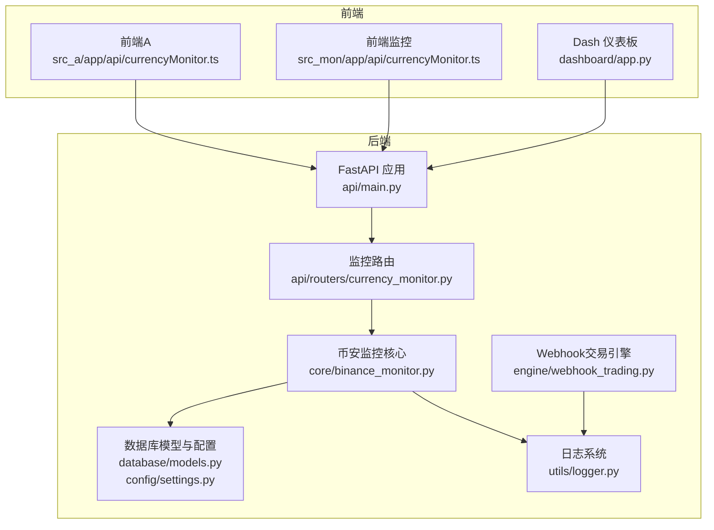
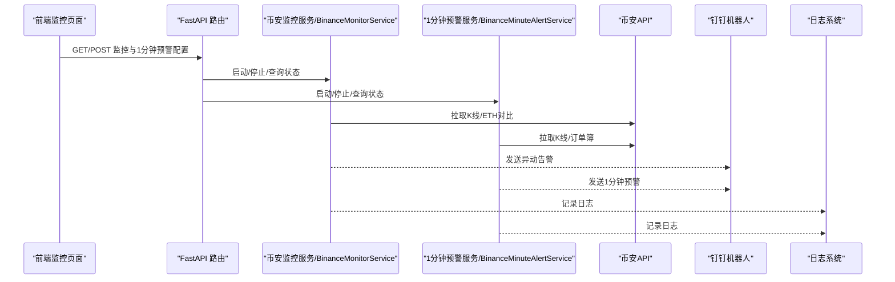
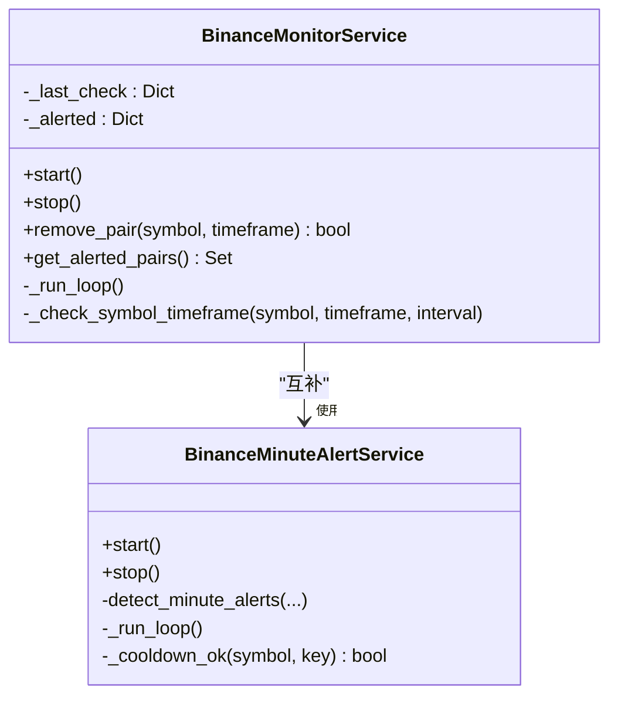
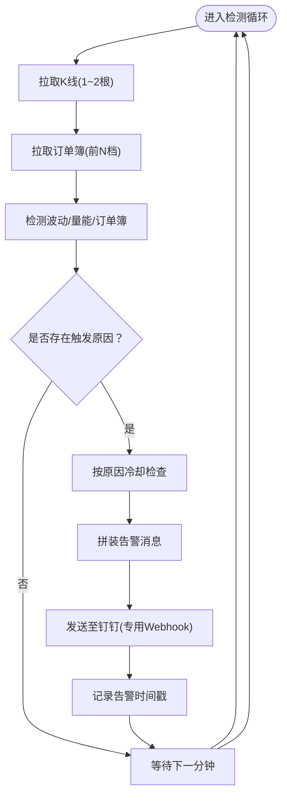
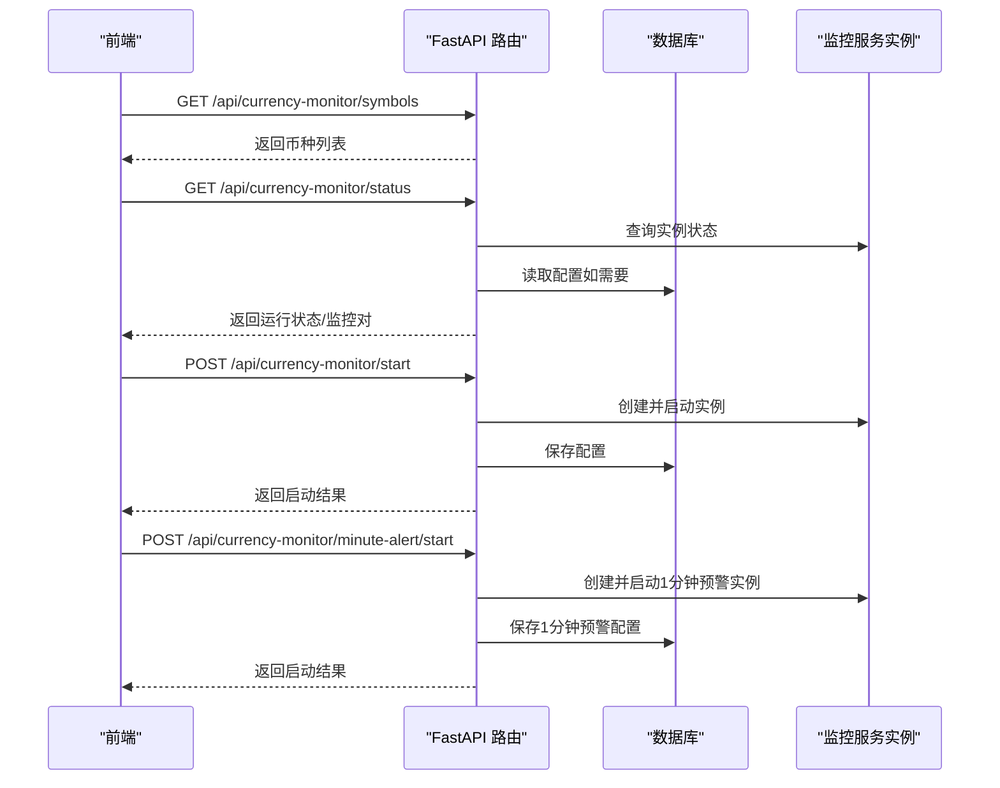
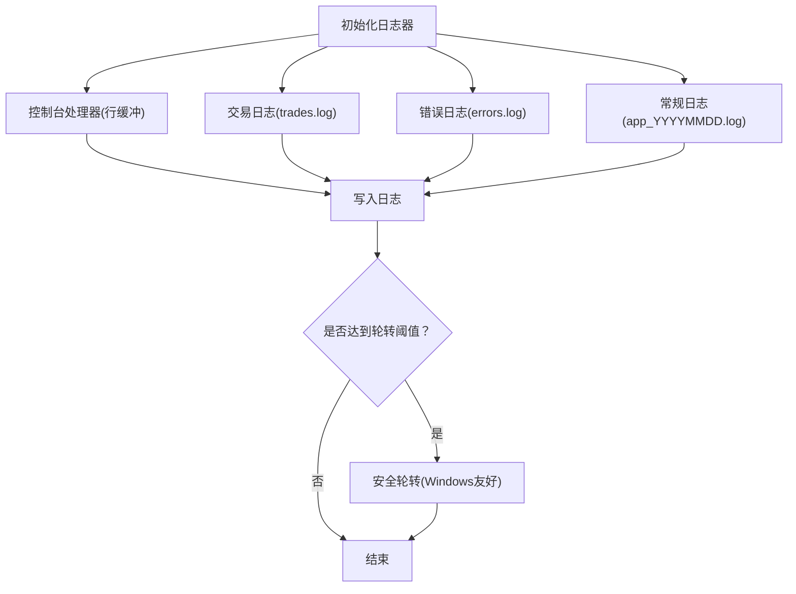
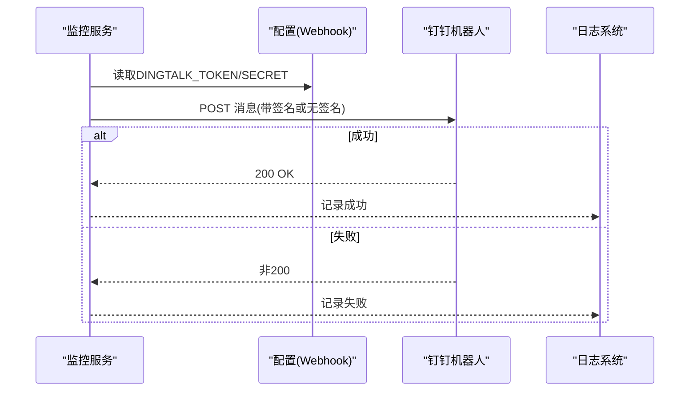
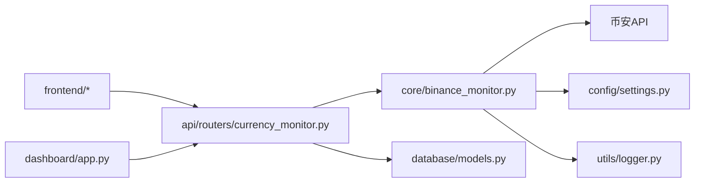

# 监控告警

<cite>
**本文引用的文件**
- [backpack_quant_trading/api/main.py](file://backpack_quant_trading/api/main.py)
- [backpack_quant_trading/api/routers/currency_monitor.py](file://backpack_quant_trading/api/routers/currency_monitor.py)
- [backpack_quant_trading/core/binance_monitor.py](file://backpack_quant_trading/core/binance_monitor.py)
- [backpack_quant_trading/database/models.py](file://backpack_quant_trading/database/models.py)
- [backpack_quant_trading/utils/logger.py](file://backpack_quant_trading/utils/logger.py)
- [backpack_quant_trading/config/settings.py](file://backpack_quant_trading/config/settings.py)
- [backpack_quant_trading/engine/webhook_trading.py](file://backpack_quant_trading/engine/webhook_trading.py)
- [backpack_quant_trading/dashboard/app.py](file://backpack_quant_trading/dashboard/app.py)
- [backpack_quant_trading/frontend/src_a/app/api/currencyMonitor.ts](file://backpack_quant_trading/frontend/src_a/app/api/currencyMonitor.ts)
- [backpack_quant_trading/frontend/src_mon/app/api/currencyMonitor.ts](file://backpack_quant_trading/frontend/src_mon/app/api/currencyMonitor.ts)
</cite>

## 目录
1. [简介](#简介)
2. [项目结构](#项目结构)
3. [核心组件](#核心组件)
4. [架构总览](#架构总览)
5. [详细组件分析](#详细组件分析)
6. [依赖分析](#依赖分析)
7. [性能考虑](#性能考虑)
8. [故障排查指南](#故障排查指南)
9. [结论](#结论)
10. [附录](#附录)

## 简介
本指南面向系统监控与告警，围绕量化交易系统的实时监控、性能指标、异常告警、日志管理与可视化展开。文档基于仓库现有代码，梳理监控指标定义、日志采集与分析、实时监控配置、性能指标监控、异常告警设置、监控仪表板搭建、关键阈值与告警规则、日志管理策略、错误追踪与性能分析工具、监控数据可视化、告警通知机制以及监控报告生成等主题，帮助读者快速落地一套可运维、可观测、可告警的监控体系。

## 项目结构
该系统采用前后端分离架构，后端以 FastAPI 提供 REST API，前端使用多种框架版本（React/Vue/Dash 等）实现交互界面。监控相关能力主要集中在币安监控模块、钉钉告警、日志系统与数据库持久化层。

**图表来源**
- [backpack_quant_trading/api/main.py](file://backpack_quant_trading/api/main.py)
- [backpack_quant_trading/api/routers/currency_monitor.py](file://backpack_quant_trading/api/routers/currency_monitor.py)
- [backpack_quant_trading/core/binance_monitor.py](file://backpack_quant_trading/core/binance_monitor.py)
- [backpack_quant_trading/database/models.py](file://backpack_quant_trading/database/models.py)
- [backpack_quant_trading/config/settings.py](file://backpack_quant_trading/config/settings.py)
- [backpack_quant_trading/utils/logger.py](file://backpack_quant_trading/utils/logger.py)
- [backpack_quant_trading/engine/webhook_trading.py](file://backpack_quant_trading/engine/webhook_trading.py)
- [backpack_quant_trading/dashboard/app.py](file://backpack_quant_trading/dashboard/app.py)
- [backpack_quant_trading/frontend/src_a/app/api/currencyMonitor.ts](file://backpack_quant_trading/frontend/src_a/app/api/currencyMonitor.ts)
- [backpack_quant_trading/frontend/src_mon/app/api/currencyMonitor.ts](file://backpack_quant_trading/frontend/src_mon/app/api/currencyMonitor.ts)

**章节来源**
- [backpack_quant_trading/api/main.py](file://backpack_quant_trading/api/main.py)
- [backpack_quant_trading/api/routers/currency_monitor.py](file://backpack_quant_trading/api/routers/currency_monitor.py)
- [backpack_quant_trading/core/binance_monitor.py](file://backpack_quant_trading/core/binance_monitor.py)
- [backpack_quant_trading/database/models.py](file://backpack_quant_trading/database/models.py)
- [backpack_quant_trading/config/settings.py](file://backpack_quant_trading/config/settings.py)
- [backpack_quant_trading/utils/logger.py](file://backpack_quant_trading/utils/logger.py)
- [backpack_quant_trading/engine/webhook_trading.py](file://backpack_quant_trading/engine/webhook_trading.py)
- [backpack_quant_trading/dashboard/app.py](file://backpack_quant_trading/dashboard/app.py)
- [backpack_quant_trading/frontend/src_a/app/api/currencyMonitor.ts](file://backpack_quant_trading/frontend/src_a/app/api/currencyMonitor.ts)
- [backpack_quant_trading/frontend/src_mon/app/api/currencyMonitor.ts](file://backpack_quant_trading/frontend/src_mon/app/api/currencyMonitor.ts)

## 核心组件
- 币安监控服务：周期轮询 K 线与订单簿，执行策略判断，触发钉钉告警。
- 1分钟预警服务：针对波动、量能、订单簿大单等条件进行高频检测，支持冷却与专用 Webhook。
- 日志系统：统一日志格式、按大小轮转、区分交易/错误/常规日志，支持实时查看。
- 数据库模型：持久化监控配置、用户实例、交易与风控事件等。
- 前端监控 API：提供币种列表、监控状态、启动/停止、1分钟预警配置与状态。
- Dash 仪表板：提供策略与交易相关可视化展示入口。
- Webhook 交易引擎：集成钉钉通知，支持签名与加密。

**章节来源**
- [backpack_quant_trading/core/binance_monitor.py](file://backpack_quant_trading/core/binance_monitor.py)
- [backpack_quant_trading/api/routers/currency_monitor.py](file://backpack_quant_trading/api/routers/currency_monitor.py)
- [backpack_quant_trading/utils/logger.py](file://backpack_quant_trading/utils/logger.py)
- [backpack_quant_trading/database/models.py](file://backpack_quant_trading/database/models.py)
- [backpack_quant_trading/frontend/src_a/app/api/currencyMonitor.ts](file://backpack_quant_trading/frontend/src_a/app/api/currencyMonitor.ts)
- [backpack_quant_trading/frontend/src_mon/app/api/currencyMonitor.ts](file://backpack_quant_trading/frontend/src_mon/app/api/currencyMonitor.ts)
- [backpack_quant_trading/dashboard/app.py](file://backpack_quant_trading/dashboard/app.py)
- [backpack_quant_trading/engine/webhook_trading.py](file://backpack_quant_trading/engine/webhook_trading.py)

## 架构总览
系统监控与告警的整体流程如下：

**图表来源**
- [backpack_quant_trading/api/routers/currency_monitor.py](file://backpack_quant_trading/api/routers/currency_monitor.py)
- [backpack_quant_trading/core/binance_monitor.py](file://backpack_quant_trading/core/binance_monitor.py)
- [backpack_quant_trading/utils/logger.py](file://backpack_quant_trading/utils/logger.py)

## 详细组件分析

### 币安监控服务（BinanceMonitorService）
- 功能：按符号与时间级别轮询 K 线，对比 ETH 行情，触发“强于 ETH 且连续阳线”异动告警。
- 关键点：
  - 线程安全：后台线程轮询，支持 start/stop。
  - 冷却机制：同一对在 10 分钟内重复触发不会重复推送。
  - 配置持久化：通过数据库保存/恢复监控配置。
  - 钉钉告警：使用全局 Token 与签名机制发送消息。

**图表来源**
- [backpack_quant_trading/core/binance_monitor.py](file://backpack_quant_trading/core/binance_monitor.py)

**章节来源**
- [backpack_quant_trading/core/binance_monitor.py](file://backpack_quant_trading/core/binance_monitor.py)

### 1分钟预警服务（BinanceMinuteAlertService）
- 功能：每分钟检测波动、量能、订单簿大单，按原因冷却避免刷屏，使用专用 Webhook 推送。
- 关键点：
  - 多条件检测：波动率、成交量倍数、订单簿近盘口大额挂单。
  - 冷却策略：按原因维度冷却，订单簿大单例外即时推送。
  - 配置持久化：保存/恢复阈值与参数。

**图表来源**
- [backpack_quant_trading/core/binance_monitor.py](file://backpack_quant_trading/core/binance_monitor.py)

**章节来源**
- [backpack_quant_trading/core/binance_monitor.py](file://backpack_quant_trading/core/binance_monitor.py)

### 监控 API 路由（FastAPI）
- 功能：提供币种列表、监控状态、启动/停止、1分钟预警启动/停止、状态查询。
- 关键点：
  - 全局共享监控：不按用户隔离，避免重复监控。
  - 用户停止标记：防止停止后从数据库恢复导致继续监控。
  - 配置持久化：监控与1分钟预警配置保存到数据库。

**图表来源**
- [backpack_quant_trading/api/routers/currency_monitor.py](file://backpack_quant_trading/api/routers/currency_monitor.py)
- [backpack_quant_trading/database/models.py](file://backpack_quant_trading/database/models.py)

**章节来源**
- [backpack_quant_trading/api/routers/currency_monitor.py](file://backpack_quant_trading/api/routers/currency_monitor.py)
- [backpack_quant_trading/database/models.py](file://backpack_quant_trading/database/models.py)

### 日志系统与日志管理
- 功能：统一日志格式、控制台与文件输出、按大小轮转、区分交易/错误/常规日志、Windows 安全轮转。
- 关键点：
  - 安全轮转：避免 Windows 权限问题，减少锁竞争。
  - 实时性：控制台行缓冲，便于实时查看。
  - 专用日志：交易、错误、常规分别落盘，便于检索与分析。

**图表来源**
- [backpack_quant_trading/utils/logger.py](file://backpack_quant_trading/utils/logger.py)

**章节来源**
- [backpack_quant_trading/utils/logger.py](file://backpack_quant_trading/utils/logger.py)

### 钉钉告警与通知
- 功能：统一钉钉机器人告警，支持签名与加密，1分钟预警使用专用 Webhook。
- 关键点：
  - 全局告警：使用配置中的 Token 与签名。
  - 1分钟预警：独立 Webhook，避免影响其他告警。
  - 异常处理：网络异常、签名错误、响应失败均有日志记录。

**图表来源**
- [backpack_quant_trading/core/binance_monitor.py](file://backpack_quant_trading/core/binance_monitor.py)
- [backpack_quant_trading/config/settings.py](file://backpack_quant_trading/config/settings.py)
- [backpack_quant_trading/engine/webhook_trading.py](file://backpack_quant_trading/engine/webhook_trading.py)

**章节来源**
- [backpack_quant_trading/core/binance_monitor.py](file://backpack_quant_trading/core/binance_monitor.py)
- [backpack_quant_trading/config/settings.py](file://backpack_quant_trading/config/settings.py)
- [backpack_quant_trading/engine/webhook_trading.py](file://backpack_quant_trading/engine/webhook_trading.py)

### 前端监控与状态展示
- 功能：提供币种列表、监控状态、启动/停止、1分钟预警配置与状态展示。
- 关键点：
  - Mock API：演示用，实际部署时替换为真实后端。
  - 状态驱动：运行中/停止、监控对、1分钟预警阈值等。

**章节来源**
- [backpack_quant_trading/frontend/src_a/app/api/currencyMonitor.ts](file://backpack_quant_trading/frontend/src_a/app/api/currencyMonitor.ts)
- [backpack_quant_trading/frontend/src_mon/app/api/currencyMonitor.ts](file://backpack_quant_trading/frontend/src_mon/app/api/currencyMonitor.ts)

### Dash 仪表板
- 功能：Dash 应用提供策略与交易相关可视化入口，集成数据库连接与组件样式。
- 关键点：
  - 仪表板布局与样式定制。
  - 数据库连接与表创建（用户实例表）。
  - 与后端 API 的集成。

**章节来源**
- [backpack_quant_trading/dashboard/app.py](file://backpack_quant_trading/dashboard/app.py)

## 依赖分析
- 组件耦合：
  - API 路由依赖监控服务与数据库模型。
  - 监控服务依赖币安 API、配置与日志。
  - 前端依赖后端 API，状态与配置通过 API 同步。
- 外部依赖：
  - 币安 REST/WebSocket API。
  - 钉钉机器人 Webhook。
  - MySQL 数据库（用户实例表）。
  - Dash/Plotly 可视化。

**图表来源**
- [backpack_quant_trading/api/routers/currency_monitor.py](file://backpack_quant_trading/api/routers/currency_monitor.py)
- [backpack_quant_trading/core/binance_monitor.py](file://backpack_quant_trading/core/binance_monitor.py)
- [backpack_quant_trading/database/models.py](file://backpack_quant_trading/database/models.py)
- [backpack_quant_trading/config/settings.py](file://backpack_quant_trading/config/settings.py)
- [backpack_quant_trading/utils/logger.py](file://backpack_quant_trading/utils/logger.py)
- [backpack_quant_trading/dashboard/app.py](file://backpack_quant_trading/dashboard/app.py)

**章节来源**
- [backpack_quant_trading/api/routers/currency_monitor.py](file://backpack_quant_trading/api/routers/currency_monitor.py)
- [backpack_quant_trading/core/binance_monitor.py](file://backpack_quant_trading/core/binance_monitor.py)
- [backpack_quant_trading/database/models.py](file://backpack_quant_trading/database/models.py)
- [backpack_quant_trading/config/settings.py](file://backpack_quant_trading/config/settings.py)
- [backpack_quant_trading/utils/logger.py](file://backpack_quant_trading/utils/logger.py)
- [backpack_quant_trading/dashboard/app.py](file://backpack_quant_trading/dashboard/app.py)

## 性能考虑
- 轮询频率：币安监控服务每 30 分钟轮询一次，降低 API 调用压力。
- 限流与退避：拉取 K 线时设置超时与分批间隔，避免触发限流。
- 冷却策略：1分钟预警按原因冷却，避免刷屏与重复告警。
- 日志轮转：按大小轮转，避免单文件过大；Windows 下使用安全轮转减少权限问题。
- 事件循环：Dash 在 Python 3.9+ 环境下使用安全事件循环策略，避免多线程下事件循环缺失。

[本节为通用指导，无需特定文件引用]

## 故障排查指南
- 钉钉告警失败：
  - 检查配置中的 Token/Secret 是否正确。
  - 查看日志中“发送失败/异常”记录，定位网络或签名问题。
  - 1分钟预警使用专用 Webhook，确认配置项是否存在。
- 监控未启动/恢复：
  - 检查用户是否手动停止（用户停止标记）。
  - 查看数据库中监控配置是否保存成功。
  - 确认监控服务实例状态与线程是否正常。
- 日志无法实时查看：
  - 检查控制台处理器是否启用与行缓冲。
  - Windows 下确认安全轮转是否生效，避免文件占用。
- Dash 页面空白：
  - 检查 React 版本与 Dash 兼容性。
  - 确认本地资源加载与 CDN 设置。

**章节来源**
- [backpack_quant_trading/core/binance_monitor.py](file://backpack_quant_trading/core/binance_monitor.py)
- [backpack_quant_trading/utils/logger.py](file://backpack_quant_trading/utils/logger.py)
- [backpack_quant_trading/dashboard/app.py](file://backpack_quant_trading/dashboard/app.py)

## 结论
本系统提供了完整的监控与告警能力：通过币安监控服务与1分钟预警服务实现对市场异动的及时感知，结合钉钉告警与统一日志系统，形成可观测、可告警、可追溯的运维闭环。配合数据库持久化与 Dash 仪表板，能够支撑策略运行状态的可视化与异常事件的快速定位。建议在生产环境中完善阈值调优、告警收敛策略与日志归档策略，以进一步提升稳定性与可维护性。

[本节为总结，无需特定文件引用]

## 附录

### 监控指标定义与阈值建议
- 异动指标（币安监控服务）：
  - 连续阳线：参考策略参数（回看周期、与 ETH 比例）。
  - 异动冷却：10 分钟内同一对不重复推送。
- 1分钟预警指标（BinanceMinuteAlertService）：
  - 波动率阈值：例如 ≥ 5%（可调）。
  - 成交量倍数阈值：例如 ≥ 20x（可调）。
  - 订单簿大单阈值：例如 ≥ 20 万 USDT（可调），近盘口距离比例默认 0.3%。
  - 冷却时间：默认 300 秒，避免刷屏。
- 日志级别：
  - 交易日志：INFO 级别，记录订单/成交/信号/风险事件。
  - 错误日志：ERROR 级别，记录异常与失败。
  - 常规日志：INFO 级别，记录运行状态与调试信息。

**章节来源**
- [backpack_quant_trading/core/binance_monitor.py](file://backpack_quant_trading/core/binance_monitor.py)
- [backpack_quant_trading/utils/logger.py](file://backpack_quant_trading/utils/logger.py)

### 实时监控配置与告警规则
- 启动监控：
  - 通过 API 启动币安监控，合并已有配对，支持多币种与多时间级别。
  - 启动后配置持久化，刷新后可自动恢复。
- 启动1分钟预警：
  - 配置波动率、量能、订单簿阈值与冷却时间。
  - 启动后使用专用 Webhook 推送。
- 停止监控：
  - 停止后清除实例与配置，避免恢复。
- 前端配置：
  - 前端提供阈值输入与状态展示，Mock API 便于演示。

**章节来源**
- [backpack_quant_trading/api/routers/currency_monitor.py](file://backpack_quant_trading/api/routers/currency_monitor.py)
- [backpack_quant_trading/frontend/src_a/app/api/currencyMonitor.ts](file://backpack_quant_trading/frontend/src_a/app/api/currencyMonitor.ts)
- [backpack_quant_trading/frontend/src_mon/app/api/currencyMonitor.ts](file://backpack_quant_trading/frontend/src_mon/app/api/currencyMonitor.ts)

### 日志管理策略与错误追踪
- 日志分类：交易、错误、常规，分别落盘与轮转。
- 日志格式：统一时间戳、级别、模块、行号与消息体。
- 错误追踪：异常捕获与日志记录，便于定位问题。
- Windows 兼容：安全轮转避免权限冲突。

**章节来源**
- [backpack_quant_trading/utils/logger.py](file://backpack_quant_trading/utils/logger.py)

### 监控数据可视化与报告生成
- Dash 仪表板：提供策略与交易相关可视化入口，样式与布局可定制。
- 报告生成：结合数据库中的策略性能与风险事件表，导出报表。

**章节来源**
- [backpack_quant_trading/dashboard/app.py](file://backpack_quant_trading/dashboard/app.py)
- [backpack_quant_trading/database/models.py](file://backpack_quant_trading/database/models.py)