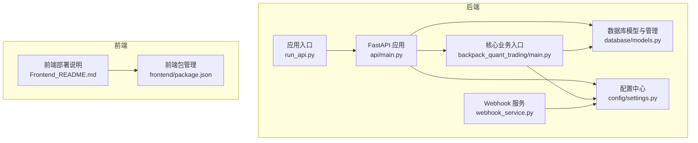
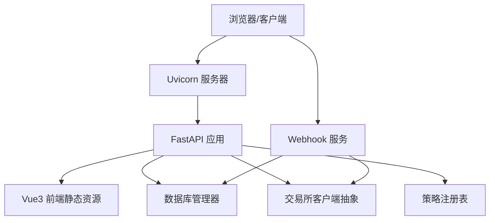
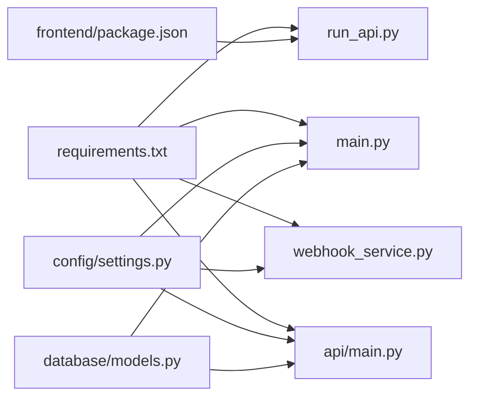

# 系统部署

<cite>
**本文引用的文件**
- [backpack_quant_trading/main.py](file://backpack_quant_trading/main.py)
- [backpack_quant_trading/run_api.py](file://backpack_quant_trading/run_api.py)
- [backpack_quant_trading/api/main.py](file://backpack_quant_trading/api/main.py)
- [backpack_quant_trading/config/settings.py](file://backpack_quant_trading/config/settings.py)
- [backpack_quant_trading/requirements.txt](file://backpack_quant_trading/requirements.txt)
- [backpack_quant_trading/database/models.py](file://backpack_quant_trading/database/models.py)
- [init_db.py](file://init_db.py)
- [backpack_quant_trading/webhook_service.py](file://backpack_quant_trading/webhook_service.py)
- [backpack_quant_trading/Frontend_README.md](file://backpack_quant_trading/Frontend_README.md)
- [backpack_quant_trading/frontend/package.json](file://backpack_quant_trading/frontend/package.json)
- [backpack_quant_trading/docs/DATA_SOURCE_AND_CACHE.md](file://backpack_quant_trading/docs/DATA_SOURCE_AND_CACHE.md)
</cite>

## 目录
1. [简介](#简介)
2. [项目结构](#项目结构)
3. [核心组件](#核心组件)
4. [架构总览](#架构总览)
5. [详细组件分析](#详细组件分析)
6. [依赖分析](#依赖分析)
7. [性能考虑](#性能考虑)
8. [故障排查指南](#故障排查指南)
9. [结论](#结论)
10. [附录](#附录)

## 简介
本指南面向系统管理员与开发者，提供从零开始的部署流程，涵盖本地开发环境、生产环境与容器化部署三种模式。内容包括环境准备、依赖安装、配置文件设置、数据库初始化、API 服务启动、Webhook 服务启动、部署验证与常见问题排查。同时补充不同操作系统下的注意事项与差异。

## 项目结构
项目采用前后端分离架构：后端为 FastAPI 应用，提供 REST API 与静态资源托管；前端为 Vue3 应用，通过 Vite 构建并在生产模式下由后端统一托管。核心业务入口位于后端主程序与主控制器，配置集中于配置模块，数据库模型与管理器位于数据库目录。

**图示来源**
- [backpack_quant_trading/api/main.py:1-98](file://backpack_quant_trading/api/main.py#L1-L98)
- [backpack_quant_trading/run_api.py:1-32](file://backpack_quant_trading/run_api.py#L1-L32)
- [backpack_quant_trading/config/settings.py:1-137](file://backpack_quant_trading/config/settings.py#L1-L137)
- [backpack_quant_trading/database/models.py:1-721](file://backpack_quant_trading/database/models.py#L1-L721)
- [backpack_quant_trading/main.py:1-344](file://backpack_quant_trading/main.py#L1-L344)
- [backpack_quant_trading/webhook_service.py:1-598](file://backpack_quant_trading/webhook_service.py#L1-L598)
- [backpack_quant_trading/frontend/package.json:1-27](file://backpack_quant_trading/frontend/package.json#L1-L27)
- [backpack_quant_trading/Frontend_README.md:1-78](file://backpack_quant_trading/Frontend_README.md#L1-L78)

**章节来源**
- [backpack_quant_trading/api/main.py:1-98](file://backpack_quant_trading/api/main.py#L1-L98)
- [backpack_quant_trading/run_api.py:1-32](file://backpack_quant_trading/run_api.py#L1-L32)
- [backpack_quant_trading/config/settings.py:1-137](file://backpack_quant_trading/config/settings.py#L1-L137)
- [backpack_quant_trading/database/models.py:1-721](file://backpack_quant_trading/database/models.py#L1-L721)
- [backpack_quant_trading/main.py:1-344](file://backpack_quant_trading/main.py#L1-L344)
- [backpack_quant_trading/webhook_service.py:1-598](file://backpack_quant_trading/webhook_service.py#L1-L598)
- [backpack_quant_trading/frontend/package.json:1-27](file://backpack_quant_trading/frontend/package.json#L1-L27)
- [backpack_quant_trading/Frontend_README.md:1-78](file://backpack_quant_trading/Frontend_README.md#L1-L78)

## 核心组件
- 配置中心：集中管理数据库、交易、Webhook、交易所等配置，支持 .env 环境变量注入与默认值。
- 数据库模型与管理器：定义订单、持仓、成交、账户、风险事件、策略配置等表结构，提供会话、增删改查与批量写入方法。
- API 应用：FastAPI 提供认证、实盘交易、网格交易、币种监视、数据大屏、AI 实验室、A 股 AI 选股、量化策略、OKX Agent/Console 等路由，并挂载前端静态资源。
- 核心入口：主程序负责回测与实盘模式切换、策略注册与执行、交易所客户端注入与生命周期管理。
- Webhook 服务：接收 TradingView 信号，按实例或策略广播执行，支持签名验证、熔断重置、动态配置更新与多引擎实例管理。

**章节来源**
- [backpack_quant_trading/config/settings.py:1-137](file://backpack_quant_trading/config/settings.py#L1-L137)
- [backpack_quant_trading/database/models.py:1-721](file://backpack_quant_trading/database/models.py#L1-L721)
- [backpack_quant_trading/api/main.py:1-98](file://backpack_quant_trading/api/main.py#L1-L98)
- [backpack_quant_trading/main.py:1-344](file://backpack_quant_trading/main.py#L1-L344)
- [backpack_quant_trading/webhook_service.py:1-598](file://backpack_quant_trading/webhook_service.py#L1-L598)

## 架构总览
系统采用“后端 API + 前端 SPA + 多服务协同”的架构。后端通过 Uvicorn 运行，开发模式下支持热重载；生产模式下前端构建产物由后端统一托管。核心业务通过策略注册表与引擎解耦，支持多交易所抽象与多实例并发。

**图示来源**
- [backpack_quant_trading/api/main.py:1-98](file://backpack_quant_trading/api/main.py#L1-L98)
- [backpack_quant_trading/run_api.py:1-32](file://backpack_quant_trading/run_api.py#L1-L32)
- [backpack_quant_trading/config/settings.py:1-137](file://backpack_quant_trading/config/settings.py#L1-L137)
- [backpack_quant_trading/database/models.py:1-721](file://backpack_quant_trading/database/models.py#L1-L721)
- [backpack_quant_trading/main.py:1-344](file://backpack_quant_trading/main.py#L1-L344)
- [backpack_quant_trading/webhook_service.py:1-598](file://backpack_quant_trading/webhook_service.py#L1-L598)

## 详细组件分析

### 部署前准备与环境要求
- 操作系统
  - Linux/macOS：默认推荐，兼容性好，进程管理与容器化更便利。
  - Windows：支持，注意控制台编码与 UTF-8 输出，避免实盘进程因字符集崩溃。
- Python 版本：建议使用 Python 3.10+，满足依赖版本要求。
- 数据库：MySQL 5.7+ 或兼容版本，确保网络可达与权限正确。
- 前端构建工具：Node.js 18+，npm 8+。

**章节来源**
- [backpack_quant_trading/main.py:289-344](file://backpack_quant_trading/main.py#L289-L344)
- [backpack_quant_trading/Frontend_README.md:1-78](file://backpack_quant_trading/Frontend_README.md#L1-L78)

### 依赖安装
- 后端依赖：通过 requirements.txt 安装，包含 FastAPI、Uvicorn、SQLAlchemy、加密、可视化、技术分析、机器学习、Web3 等模块。
- 前端依赖：在 frontend 目录执行 npm install 安装 React、Vue3、路由、图表等依赖。
- 构建生产包：在 frontend 目录执行 npm run build，生成静态资源供后端托管。

**章节来源**
- [backpack_quant_trading/requirements.txt:1-61](file://backpack_quant_trading/requirements.txt#L1-L61)
- [backpack_quant_trading/frontend/package.json:1-27](file://backpack_quant_trading/frontend/package.json#L1-L27)
- [backpack_quant_trading/Frontend_README.md:55-64](file://backpack_quant_trading/Frontend_README.md#L55-L64)

### 配置文件设置
- 环境变量与 .env
  - 数据库：DB_HOST、DB_PORT、DB_USER、DB_PASSWORD、DB_NAME。
  - 交易所：BACKPACK_*、HYPERLIQUID_*、OSTIUM_*、DEEPCOIN_* 等。
  - Webhook：WEBHOOK_SECRET、WEBHOOK_HOST、WEBHOOK_PORT、DINGTALK_*。
  - Cookie 登录：BACKPACK_ACCESS_KEY、BACKPACK_REFRESH_KEY。
- 配置类
  - 数据库配置、交易配置、Webhook 配置、各交易所配置、项目根目录与日志/数据目录。
  - 生成数据库连接 URL，统一项目根目录与必要目录创建。

**章节来源**
- [backpack_quant_trading/config/settings.py:1-137](file://backpack_quant_trading/config/settings.py#L1-L137)

### 数据库初始化
- 初始化脚本：删除旧 users 表（含密码长度不足风险）并重建所有表，输出成功/失败提示。
- 数据模型：定义市场数据、订单、持仓、成交、账户余额、策略性能、风险事件、组合净值、用户、用户实例、策略配置等表，含索引与扩展字段。
- 管理器：提供会话获取、表创建/删除、批量写入与去重保护、用户与实例归属管理、策略配置持久化等。

**章节来源**
- [init_db.py:1-25](file://init_db.py#L1-L25)
- [backpack_quant_trading/database/models.py:1-721](file://backpack_quant_trading/database/models.py#L1-L721)

### API 服务启动流程
- 开发模式：run_api.py 设置环境变量并启动 Uvicorn，监听 8100 端口，支持热重载。
- 生产模式：前端构建后，后端统一托管静态资源，访问后端根路径返回 SPA 入口。
- 路由与中间件：CORS 允许前端开发与生产域名，挂载认证、实盘交易、网格、币种监视、仪表盘、AI 实验室、A 股 AI、策略、OKX Agent/Console 等路由。
- 健康检查：/api/health 返回服务状态。

**章节来源**
- [backpack_quant_trading/run_api.py:1-32](file://backpack_quant_trading/run_api.py#L1-L32)
- [backpack_quant_trading/api/main.py:1-98](file://backpack_quant_trading/api/main.py#L1-L98)
- [backpack_quant_trading/Frontend_README.md:55-64](file://backpack_quant_trading/Frontend_README.md#L55-L64)

### Webhook 服务启动流程
- 启动：读取配置，创建 FastAPI 应用，注册多实例引擎管理器，启动后台任务。
- 接口：
  - /register_instance：注册/更新引擎实例（支持 Ostium/Hyperliquid）。
  - /unregister_instance/{instance_id}：注销实例并清理资源与环境变量。
  - /instances：查询已注册实例列表。
  - /balance/{instance_id}：查询实例余额。
  - /webhook 与 /webhook/{instance_id}：接收 TradingView 信号，支持单实例与广播模式，带签名验证。
  - /reset/{instance_id}：解除熔断锁定。
  - /test/{instance_id}：手动测试信号。
  - /update_config/{instance_id}：动态更新保证金、止盈止损、杠杆、交易对等配置。
- 关闭：清理所有引擎实例，释放资源。

**章节来源**
- [backpack_quant_trading/webhook_service.py:1-598](file://backpack_quant_trading/webhook_service.py#L1-L598)

### 核心入口与策略执行
- 模式切换：回测模式加载历史数据并运行策略回测；实盘模式注入交易所客户端并启动引擎。
- 策略注册：策略注册表集中管理策略类，支持均值回归、AI 自适应、双频趋势共振等。
- 交易所抽象：支持 Backpack、Deepcoin、Ostium、Hyperliquid 等，可通过命令行选择。
- 实时日志：订单、仓位、成交回调日志输出，便于监控。

**章节来源**
- [backpack_quant_trading/main.py:1-344](file://backpack_quant_trading/main.py#L1-L344)

### 前后端分离与生产部署
- 开发模式：后端监听 8000/8100，前端 Vite 监听 5173，Vite 将 /api 代理到后端。
- 生产模式：前端构建后，后端统一托管静态资源，SPA 路由由后端返回 index.html。
- 部署建议：Nginx 反向代理后端端口，或使用 Docker Compose 管理多服务。

**章节来源**
- [backpack_quant_trading/Frontend_README.md:39-64](file://backpack_quant_trading/Frontend_README.md#L39-L64)

### 数据源与缓存（A 股）
- 数据源选型：优先 pytdx（免费），可切换 Tushare Pro（需 Token），AKShare 作为兜底。
- 缓存与增量：SQLite 缓存 code + trade_date + kline，首次全量写入，之后每日增量更新。
- 实现参考：见文档说明与相关模块。

**章节来源**
- [backpack_quant_trading/docs/DATA_SOURCE_AND_CACHE.md:1-71](file://backpack_quant_trading/docs/DATA_SOURCE_AND_CACHE.md#L1-L71)

## 依赖分析
- 后端依赖：FastAPI/Uvicorn、SQLAlchemy/PyMySQL、加密与鉴权、可视化、技术分析、机器学习、Web3、日志等。
- 前端依赖：React/Vue3、路由、图表、构建工具链。
- 服务间依赖：API 服务依赖配置中心与数据库管理器；Webhook 服务依赖交易所客户端与数据库；核心入口依赖策略与引擎。

**图示来源**
- [backpack_quant_trading/requirements.txt:1-61](file://backpack_quant_trading/requirements.txt#L1-L61)
- [backpack_quant_trading/frontend/package.json:1-27](file://backpack_quant_trading/frontend/package.json#L1-L27)
- [backpack_quant_trading/api/main.py:1-98](file://backpack_quant_trading/api/main.py#L1-L98)
- [backpack_quant_trading/run_api.py:1-32](file://backpack_quant_trading/run_api.py#L1-L32)
- [backpack_quant_trading/config/settings.py:1-137](file://backpack_quant_trading/config/settings.py#L1-L137)
- [backpack_quant_trading/database/models.py:1-721](file://backpack_quant_trading/database/models.py#L1-L721)
- [backpack_quant_trading/main.py:1-344](file://backpack_quant_trading/main.py#L1-L344)
- [backpack_quant_trading/webhook_service.py:1-598](file://backpack_quant_trading/webhook_service.py#L1-L598)

**章节来源**
- [backpack_quant_trading/requirements.txt:1-61](file://backpack_quant_trading/requirements.txt#L1-L61)
- [backpack_quant_trading/frontend/package.json:1-27](file://backpack_quant_trading/frontend/package.json#L1-L27)

## 性能考虑
- 数据库连接池：配置池大小与溢出，减少连接争用。
- 批量写入：数据库管理器提供批量写入与去重保护，降低写入开销。
- 异步处理：Webhook 服务使用异步任务执行信号，避免阻塞请求。
- 前端静态资源：生产构建后由后端统一托管，减少静态资源请求延迟。

[本节为通用指导，无需列出具体文件来源]

## 故障排查指南
- 启动失败（端口占用）
  - 检查 8000/8100/8005 端口占用情况，更换端口或释放占用进程。
- 数据库连接失败
  - 核对 .env 中 DB_* 配置，确认数据库服务可达与账号权限。
- 前端无法访问
  - 开发模式：确认 Vite 代理配置与后端 /api 路由；生产模式：确认前端已构建且后端挂载静态资源。
- Webhook 签名验证失败
  - 确认 WEBHOOK_SECRET 已正确设置，请求头 X-Signature 与服务端计算一致。
- Windows 控制台乱码
  - 确保 stdout/stderr 使用 UTF-8，避免实盘进程因字符集崩溃。
- 前端构建失败
  - 确认 Node.js 与 npm 版本满足要求，执行 npm install 后再构建。

**章节来源**
- [backpack_quant_trading/webhook_service.py:34-45](file://backpack_quant_trading/webhook_service.py#L34-L45)
- [backpack_quant_trading/Frontend_README.md:39-64](file://backpack_quant_trading/Frontend_README.md#L39-L64)
- [backpack_quant_trading/main.py:289-344](file://backpack_quant_trading/main.py#L289-L344)

## 结论
本指南提供了从环境准备到生产部署的完整路径，涵盖配置、数据库、API 与 Webhook 服务的启动与验证。建议在生产环境中使用容器化与反向代理，并定期备份数据库与日志。遇到问题时，优先检查端口、数据库连接、签名与前端构建状态。

[本节为总结性内容，无需列出具体文件来源]

## 附录

### 本地开发环境部署
- 安装后端依赖：pip install -r backpack_quant_trading/requirements.txt
- 安装前端依赖：cd backpack_quant_trading/frontend && npm install
- 启动后端开发服务：cd backpack_quant_trading && python run_api.py
- 启动前端开发服务：cd backpack_quant_trading/frontend && npm run dev
- 访问：http://localhost:5173

**章节来源**
- [backpack_quant_trading/Frontend_README.md:39-51](file://backpack_quant_trading/Frontend_README.md#L39-L51)

### 生产环境部署
- 构建前端：cd backpack_quant_trading/frontend && npm run build
- 启动后端：cd backpack_quant_trading && python run_api.py
- 访问：http://localhost:8000（后端挂载前端静态资源）

**章节来源**
- [backpack_quant_trading/Frontend_README.md:55-64](file://backpack_quant_trading/Frontend_README.md#L55-L64)

### Docker 容器化部署（流程概述）
- 前端构建：在容器内执行 npm run build，产出静态资源。
- 后端镜像：基于 Python 基础镜像，复制 requirements.txt 并安装依赖，复制后端代码。
- Webhook 服务：独立容器运行 webhook_service.py，暴露 8005 端口。
- 反向代理：Nginx 挂载后端端口与静态资源，或使用 Traefik/Envoy。
- 数据库：独立 MySQL 容器或云数据库，配置 DB_* 环境变量。
- 健康检查：/api/health 与 /health（Webhook）用于容器编排健康检查。

[本节为概念性流程说明，无需列出具体文件来源]

### 部署前检查清单
- 环境变量：DB_HOST/PORT/USER/PASSWORD/NAME、交易所密钥、Webhook 密钥、DingTalk 配置。
- 端口开放：8000/8100（后端）、8005（Webhook）、数据库端口。
- 文件权限：日志与数据目录可写。
- 前端构建：frontend/dist 存在且包含 index.html。
- 依赖安装：requirements.txt 与 package.json 依赖均已安装。

**章节来源**
- [backpack_quant_trading/config/settings.py:1-137](file://backpack_quant_trading/config/settings.py#L1-L137)
- [backpack_quant_trading/Frontend_README.md:55-64](file://backpack_quant_trading/Frontend_README.md#L55-L64)

### 不同操作系统注意事项
- Windows
  - 控制台编码：确保 UTF-8 输出，避免实盘进程崩溃。
  - 路径分隔符：使用正斜杠或 pathlib，避免跨平台差异。
- Linux/macOS
  - 进程管理：使用 systemd 或 Docker 管理后端与 Webhook 服务。
  - 权限：确保日志与数据目录权限正确。

**章节来源**
- [backpack_quant_trading/main.py:289-344](file://backpack_quant_trading/main.py#L289-L344)