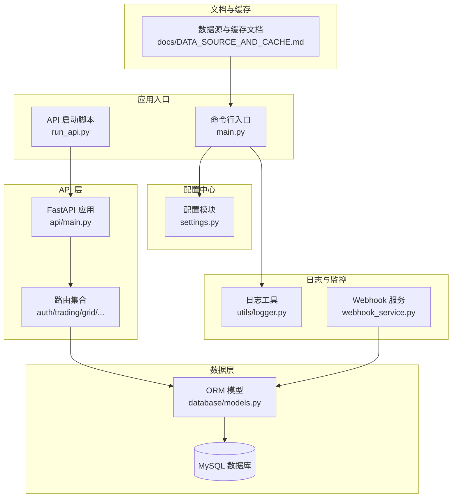
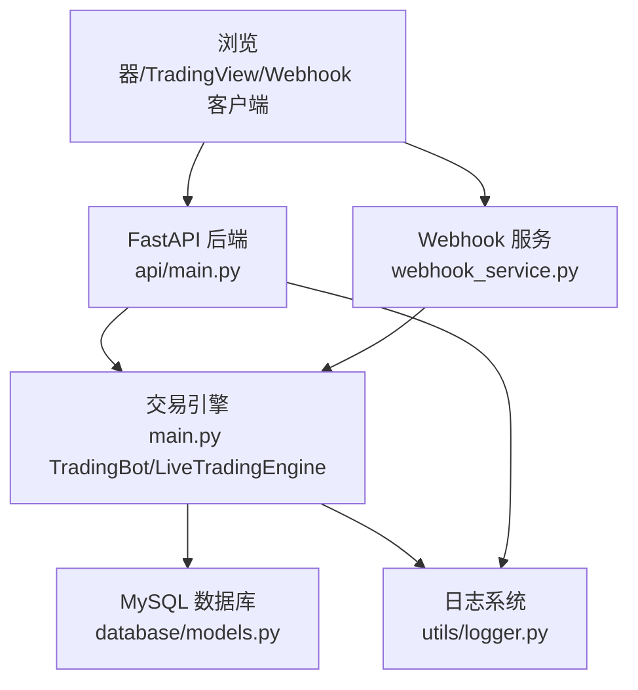
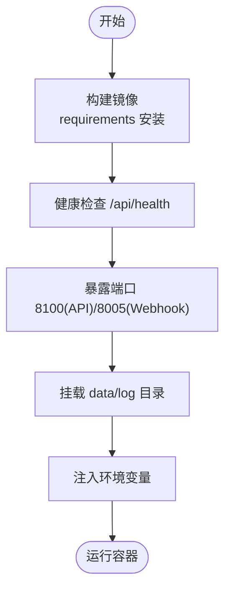
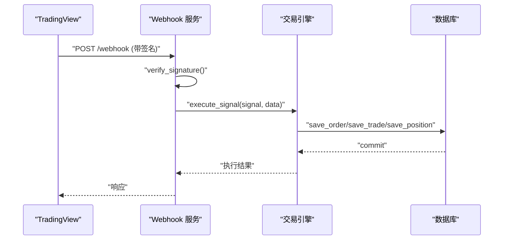
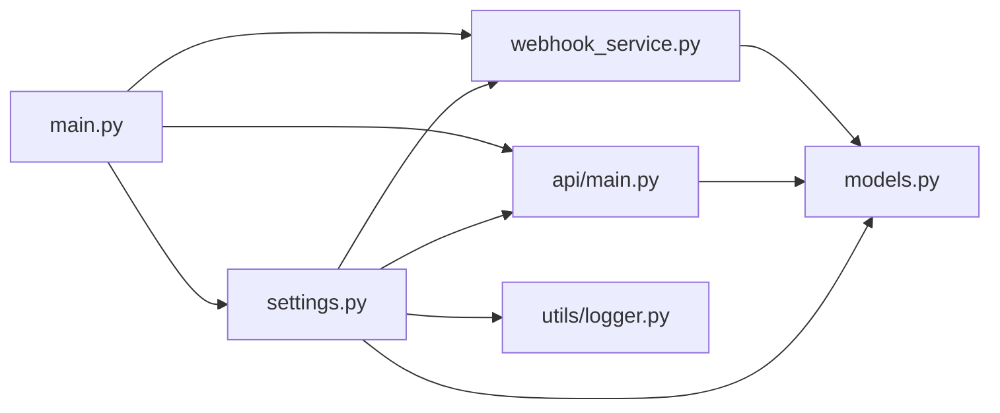

# 部署和运维

<cite>
**本文引用的文件**
- [main.py](file://backpack_quant_trading/main.py)
- [run_api.py](file://backpack_quant_trading/run_api.py)
- [requirements.txt](file://backpack_quant_trading/requirements.txt)
- [settings.py](file://backpack_quant_trading/config/settings.py)
- [main.py](file://backpack_quant_trading/api/main.py)
- [logger.py](file://backpack_quant_trading/utils/logger.py)
- [models.py](file://backpack_quant_trading/database/models.py)
- [webhook_service.py](file://backpack_quant_trading/webhook_service.py)
- [DATA_SOURCE_AND_CACHE.md](file://backpack_quant_trading/docs/DATA_SOURCE_AND_CACHE.md)
</cite>

## 目录
1. [简介](#简介)
2. [项目结构](#项目结构)
3. [核心组件](#核心组件)
4. [架构总览](#架构总览)
5. [详细组件分析](#详细组件分析)
6. [依赖分析](#依赖分析)
7. [性能考虑](#性能考虑)
8. [故障排除指南](#故障排除指南)
9. [结论](#结论)
10. [附录](#附录)

## 简介
本指南面向系统部署与运维团队，围绕量化交易系统在生产环境的部署、容器化、监控告警、性能优化、安全加固、日志管理、故障排除、备份恢复、版本升级与容量规划、以及运维自动化与 CI/CD 实践，提供可操作的步骤与最佳实践。系统采用 Python/FastAPI 后端、MySQL 数据库存储、多策略引擎与 Webhook 交易入口，支持实盘交易、回测、网格交易、币种监视与数据缓存。

## 项目结构
系统主要由以下层次构成：
- 应用入口与运行模式：命令行入口负责回测与实盘模式切换，API 启动脚本负责开发模式后端服务。
- 配置中心：集中管理数据库、交易、Webhook、交易所等配置。
- API 层：基于 FastAPI 提供认证、实盘交易、网格、监控、AI 实验室、策略、OKX Agent/Console 等接口。
- 数据层：SQLAlchemy ORM 定义交易相关实体与数据库管理器。
- 日志与监控：统一日志格式与轮转，支持交易明细与风险事件记录。
- Webhook 服务：接收 TradingView 信号，按实例/广播模式路由至对应交易引擎。
- 文档与缓存：A 股数据源与缓存增量方案文档，指导数据准备与性能优化。

**图表来源**
- [main.py:1-344](file://backpack_quant_trading/main.py#L1-L344)
- [run_api.py:1-32](file://backpack_quant_trading/run_api.py#L1-L32)
- [settings.py:1-137](file://backpack_quant_trading/config/settings.py#L1-L137)
- [main.py:1-98](file://backpack_quant_trading/api/main.py#L1-L98)
- [models.py:1-721](file://backpack_quant_trading/database/models.py#L1-L721)
- [logger.py:1-180](file://backpack_quant_trading/utils/logger.py#L1-L180)
- [webhook_service.py:1-571](file://backpack_quant_trading/webhook_service.py#L1-L571)
- [DATA_SOURCE_AND_CACHE.md:1-71](file://backpack_quant_trading/docs/DATA_SOURCE_AND_CACHE.md#L1-L71)

**章节来源**
- [main.py:1-344](file://backpack_quant_trading/main.py#L1-L344)
- [run_api.py:1-32](file://backpack_quant_trading/run_api.py#L1-L32)
- [settings.py:1-137](file://backpack_quant_trading/config/settings.py#L1-L137)
- [main.py:1-98](file://backpack_quant_trading/api/main.py#L1-L98)
- [models.py:1-721](file://backpack_quant_trading/database/models.py#L1-L721)
- [logger.py:1-180](file://backpack_quant_trading/utils/logger.py#L1-L180)
- [webhook_service.py:1-571](file://backpack_quant_trading/webhook_service.py#L1-L571)
- [DATA_SOURCE_AND_CACHE.md:1-71](file://backpack_quant_trading/docs/DATA_SOURCE_AND_CACHE.md#L1-L71)

## 核心组件
- 配置中心：集中管理数据库、交易、Webhook、交易所等配置，支持环境变量注入与默认值。
- 数据库与模型：定义订单、成交、持仓、账户、风险事件、策略性能、用户与实例等表，提供会话管理与批量写入。
- 日志系统：统一格式、按大小轮转、支持交易明细与风险事件记录，适配 Windows 平台安全写入。
- Webhook 服务：支持单实例与广播模式，按策略名/交易对筛选，具备签名验证与熔断重置。
- API 应用：统一健康检查、CORS、静态资源挂载，路由聚合认证、实盘、网格、监控、AI 实验室、策略、OKX Agent/Console。
- 命令行入口：支持回测与实盘模式，策略与交易所注册表，参数驱动的运行方式。

**章节来源**
- [settings.py:104-137](file://backpack_quant_trading/config/settings.py#L104-L137)
- [models.py:267-721](file://backpack_quant_trading/database/models.py#L267-L721)
- [logger.py:57-180](file://backpack_quant_trading/utils/logger.py#L57-L180)
- [webhook_service.py:26-571](file://backpack_quant_trading/webhook_service.py#L26-L571)
- [main.py:14-344](file://backpack_quant_trading/main.py#L14-L344)
- [main.py:37-344](file://backpack_quant_trading/main.py#L37-L344)

## 架构总览
系统采用“配置中心 + API 层 + 数据层 + 日志与监控 + Webhook 服务”的分层架构。生产部署建议将 API 与 Webhook 服务分离为独立进程或容器，数据库单独部署并开启备份与高可用。前端通过静态资源挂载提供 SPA 页面。

**图表来源**
- [main.py:14-344](file://backpack_quant_trading/main.py#L14-L344)
- [main.py:37-344](file://backpack_quant_trading/main.py#L37-L344)
- [main.py:116-149](file://backpack_quant_trading/main.py#L116-L149)
- [webhook_service.py:26-571](file://backpack_quant_trading/webhook_service.py#L26-L571)
- [models.py:267-721](file://backpack_quant_trading/database/models.py#L267-L721)
- [logger.py:57-180](file://backpack_quant_trading/utils/logger.py#L57-L180)

## 详细组件分析

### 部署流程与环境准备
- 基础环境
  - Python 版本满足 requirements.txt 要求，建议使用虚拟环境隔离依赖。
  - MySQL 服务器准备，确保数据库连接参数正确，池化参数合理。
- 依赖安装
  - 使用 pip 安装 requirements.txt 中的依赖，注意部分包对编译工具链的要求。
- 环境变量
  - 在部署环境中设置数据库、交易所、Webhook 等相关环境变量，避免硬编码。
- 目录结构
  - 确保 data 与 log 目录存在且具备写权限，日志轮转与交易日志需要持久化存储。

**章节来源**
- [requirements.txt:1-61](file://backpack_quant_trading/requirements.txt#L1-L61)
- [settings.py:44-137](file://backpack_quant_trading/config/settings.py#L44-L137)
- [logger.py:65-125](file://backpack_quant_trading/utils/logger.py#L65-L125)

### Docker 容器化方案
- 基础镜像与依赖
  - 建议使用官方 Python 运行时镜像，安装系统依赖后再安装 Python 包，减少镜像体积。
  - 将 requirements.txt 复制到镜像内并安装，避免每次变更都重新安装。
- 多阶段构建
  - 构建阶段安装依赖，运行阶段仅复制必要文件，降低攻击面。
- 健康检查
  - 在 Dockerfile 中添加健康检查，指向 API 的 /api/health 或 Webhook 的 /health。
- 端口暴露
  - API 默认端口 8100，Webhook 默认端口 8005，按需映射到宿主机。
- 挂载卷
  - 挂载 data 与 log 目录到宿主机，保证数据持久化与日志可采集。
- 环境变量
  - 通过 docker run -e 或 docker-compose 的 environment 字段注入配置。

**图表来源**
- [run_api.py:22-28](file://backpack_quant_trading/run_api.py#L22-L28)
- [webhook_service.py:564-567](file://backpack_quant_trading/webhook_service.py#L564-L567)
- [settings.py:120-137](file://backpack_quant_trading/config/settings.py#L120-L137)

### 监控与告警配置
- 应用健康检查
  - API：/api/health，返回服务状态。
  - Webhook：/health，返回实例数量与健康状态。
- 日志采集
  - 使用统一格式与轮转，结合日志收集器（如 Filebeat/Fluent Bit）采集至集中存储。
  - 关注 trades.log 与 errors.log，设置错误阈值告警。
- 指标监控
  - 通过数据库连接池指标、进程 CPU/内存、磁盘 IO 监控交易引擎与 API。
  - Webhook 服务可统计实例数量、广播命中率与失败次数。
- 告警策略
  - 服务不可用、错误日志突发、数据库连接池耗尽、Webhook 签名失败、熔断未恢复等。

**章节来源**
- [main.py:51-53](file://backpack_quant_trading/api/main.py#L51-L53)
- [webhook_service.py:62-64](file://backpack_quant_trading/webhook_service.py#L62-L64)
- [logger.py:78-125](file://backpack_quant_trading/utils/logger.py#L78-L125)

### 生产环境部署最佳实践
- 独立进程/容器
  - API 与 Webhook 服务分离，便于独立扩缩容与故障隔离。
- 数据库高可用
  - 使用主从复制或集群，定期备份并验证恢复流程。
- 配置管理
  - 使用环境变量与配置文件分离敏感信息，避免明文存储。
- 权限最小化
  - 仅授予数据库与交易所 API 所需权限，定期轮换密钥。
- 网络与防火墙
  - 仅开放必要端口，API 与 Webhook 服务置于内网或受控区域。

**章节来源**
- [settings.py:104-137](file://backpack_quant_trading/config/settings.py#L104-L137)
- [models.py:267-288](file://backpack_quant_trading/database/models.py#L267-L288)

### 性能优化策略
- 数据库连接池
  - 合理设置池大小与溢出，启用 pre_ping，避免连接失效导致的阻塞。
- 日志写入
  - 使用安全轮转处理器，避免 Windows 下权限冲突；按大小轮转减少单文件过大。
- 数据缓存与增量
  - 参考 A 股数据缓存文档，采用增量拉取与本地缓存，减少实时请求压力。
- 异步处理
  - Webhook 信号处理使用异步任务，避免阻塞请求处理。

**章节来源**
- [models.py:270-277](file://backpack_quant_trading/database/models.py#L270-L277)
- [logger.py:10-55](file://backpack_quant_trading/utils/logger.py#L10-L55)
- [DATA_SOURCE_AND_CACHE.md:48-71](file://backpack_quant_trading/docs/DATA_SOURCE_AND_CACHE.md#L48-L71)
- [webhook_service.py:329-397](file://backpack_quant_trading/webhook_service.py#L329-L397)

### 安全加固措施
- 密钥与机密
  - 交易所 API Key、私钥、数据库密码通过环境变量注入，不在代码中硬编码。
- Webhook 签名
  - 启用 HMAC SHA256 签名验证，拒绝无效签名请求。
- CORS 与访问控制
  - 明确允许的来源，避免通配符带来的风险。
- 输入校验
  - 对外部输入（如 Webhook 参数）进行严格校验与长度截断，防止数据库异常。

**章节来源**
- [settings.py:19-31](file://backpack_quant_trading/config/settings.py#L19-L31)
- [webhook_service.py:34-45](file://backpack_quant_trading/webhook_service.py#L34-L45)
- [main.py:21-34](file://backpack_quant_trading/api/main.py#L21-L34)
- [models.py:320-341](file://backpack_quant_trading/database/models.py#L320-L341)

### 系统监控、日志管理与故障排除
- 监控要点
  - API 与 Webhook 健康状态、实例数量、错误日志、数据库连接池状态。
- 日志管理
  - 交易明细、错误日志、通用日志分别落盘，按大小轮转，保留合理备份。
- 故障排除
  - Webhook 熔断：通过重置接口解除熔断并通知。
  - 签名失败：检查密钥配置与请求头。
  - 数据库异常：检查连接池配置与数据库可用性。

**图表来源**
- [webhook_service.py:292-451](file://backpack_quant_trading/webhook_service.py#L292-L451)
- [models.py:316-454](file://backpack_quant_trading/database/models.py#L316-L454)

**章节来源**
- [webhook_service.py:453-472](file://backpack_quant_trading/webhook_service.py#L453-L472)
- [webhook_service.py:319-343](file://backpack_quant_trading/webhook_service.py#L319-L343)
- [models.py:316-454](file://backpack_quant_trading/database/models.py#L316-L454)

### 备份恢复、版本升级与容量规划
- 备份恢复
  - 数据库定期全量与增量备份，验证恢复流程；日志与交易数据目录纳入备份。
- 版本升级
  - 使用容器镜像版本标签，灰度发布，回滚策略；升级前备份数据库与配置。
- 容量规划
  - 根据并发请求数与数据量评估数据库连接池、磁盘空间与日志轮转策略。

**章节来源**
- [models.py:285-292](file://backpack_quant_trading/database/models.py#L285-L292)
- [logger.py:96-124](file://backpack_quant_trading/utils/logger.py#L96-L124)

### 运维自动化与 CI/CD
- 自动化构建
  - 在 CI 中执行依赖安装、单元测试与镜像构建，推送至镜像仓库。
- 自动化部署
  - 使用编排工具（如 Kubernetes/Docker Compose）进行滚动更新与健康检查。
- 自动化监控
  - 集成日志与指标采集，配置告警规则，自动通知运维。

[本节为概念性内容，不直接分析具体文件]

## 依赖分析
系统依赖关系主要体现在配置、API、数据库与日志模块之间：

**图表来源**
- [settings.py:104-137](file://backpack_quant_trading/config/settings.py#L104-L137)
- [models.py:267-721](file://backpack_quant_trading/database/models.py#L267-L721)
- [main.py:14-344](file://backpack_quant_trading/main.py#L14-L344)
- [main.py:37-344](file://backpack_quant_trading/main.py#L37-L344)
- [logger.py:57-180](file://backpack_quant_trading/utils/logger.py#L57-L180)
- [webhook_service.py:26-571](file://backpack_quant_trading/webhook_service.py#L26-L571)

**章节来源**
- [settings.py:104-137](file://backpack_quant_trading/config/settings.py#L104-L137)
- [models.py:267-721](file://backpack_quant_trading/database/models.py#L267-L721)
- [main.py:14-344](file://backpack_quant_trading/main.py#L14-L344)
- [logger.py:57-180](file://backpack_quant_trading/utils/logger.py#L57-L180)
- [webhook_service.py:26-571](file://backpack_quant_trading/webhook_service.py#L26-L571)

## 性能考虑
- 数据库连接池参数（池大小、溢出、pre_ping）直接影响吞吐与稳定性。
- 日志轮转策略影响磁盘 IO 与日志写入延迟，建议按大小轮转并在 Windows 下使用安全处理器。
- Webhook 信号处理采用异步任务，避免阻塞请求，提升并发处理能力。
- 数据缓存与增量拉取减少对外部数据源的依赖，提高响应速度。

**章节来源**
- [models.py:270-277](file://backpack_quant_trading/database/models.py#L270-L277)
- [logger.py:10-55](file://backpack_quant_trading/utils/logger.py#L10-L55)
- [webhook_service.py:329-397](file://backpack_quant_trading/webhook_service.py#L329-L397)
- [DATA_SOURCE_AND_CACHE.md:48-71](file://backpack_quant_trading/docs/DATA_SOURCE_AND_CACHE.md#L48-L71)

## 故障排除指南
- Webhook 熔断无法恢复
  - 使用重置接口解除熔断并发送通知。
- 签名验证失败
  - 检查密钥配置与请求头 X-Signature。
- 数据库异常
  - 检查连接池配置、超时与连接失效，确认数据库可用性。
- 日志异常
  - 检查日志目录权限与轮转策略，确保文件未被占用。

**章节来源**
- [webhook_service.py:453-472](file://backpack_quant_trading/webhook_service.py#L453-L472)
- [webhook_service.py:319-343](file://backpack_quant_trading/webhook_service.py#L319-L343)
- [models.py:316-454](file://backpack_quant_trading/database/models.py#L316-L454)
- [logger.py:96-124](file://backpack_quant_trading/utils/logger.py#L96-L124)

## 结论
通过合理的部署架构、容器化方案、监控告警与安全加固，系统可在生产环境中稳定运行。配合性能优化与自动化运维，可进一步提升可靠性与交付效率。建议在上线前完成完整的备份与恢复演练，并建立完善的变更与回滚机制。

## 附录
- 健康检查端点
  - API：/api/health
  - Webhook：/health
- 日志文件
  - trades.log、errors.log、app_YYYYMMDD.log
- 数据库表
  - orders、trades、positions、account_balance、risk_events、strategy_performance、users、user_instances、strategy_config、market_data、portfolio_history

**章节来源**
- [main.py:51-53](file://backpack_quant_trading/api/main.py#L51-L53)
- [webhook_service.py:62-64](file://backpack_quant_trading/webhook_service.py#L62-L64)
- [logger.py:96-124](file://backpack_quant_trading/utils/logger.py#L96-L124)
- [models.py:45-226](file://backpack_quant_trading/database/models.py#L45-L226)