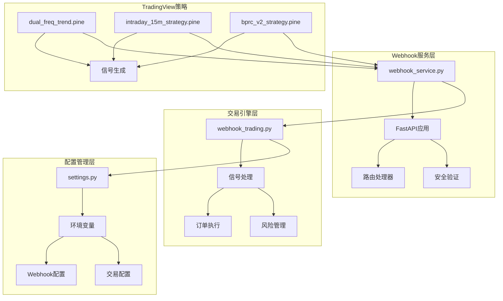
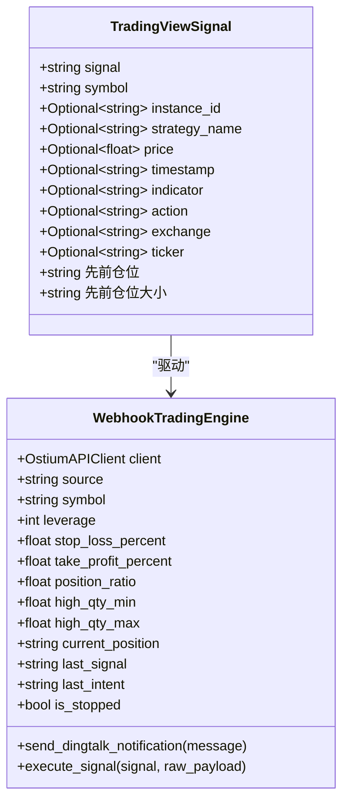
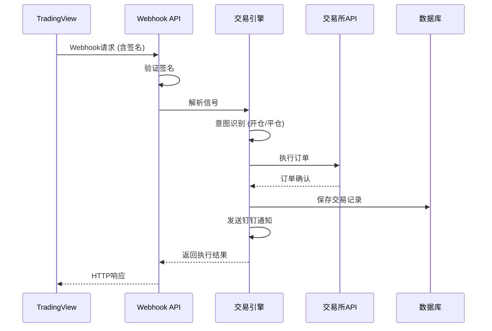
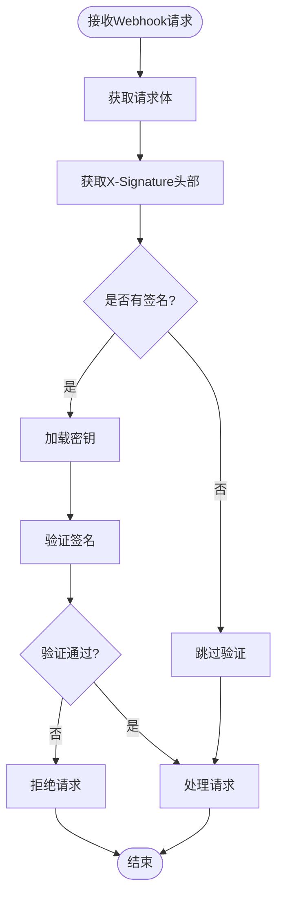
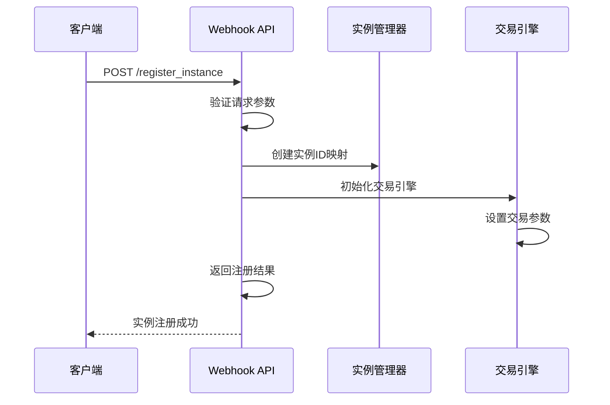
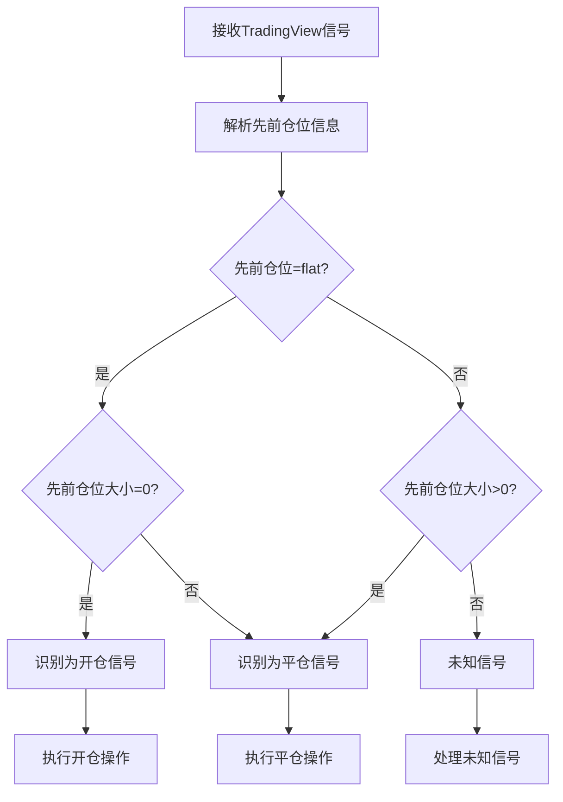
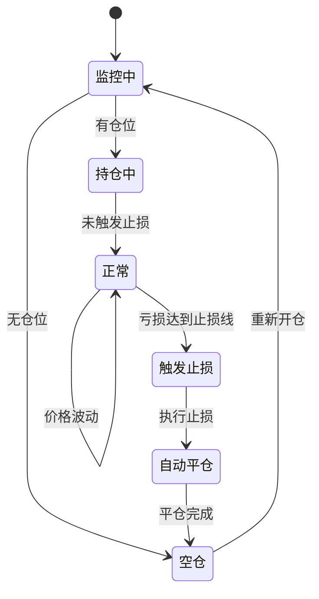
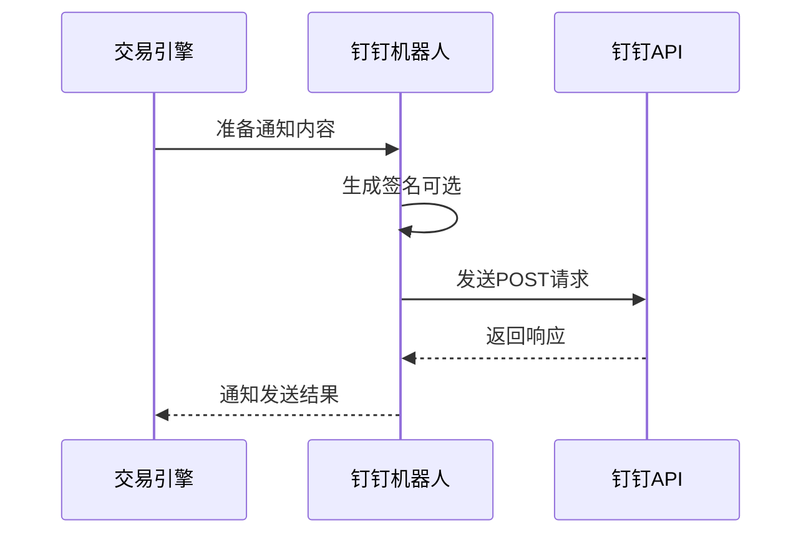
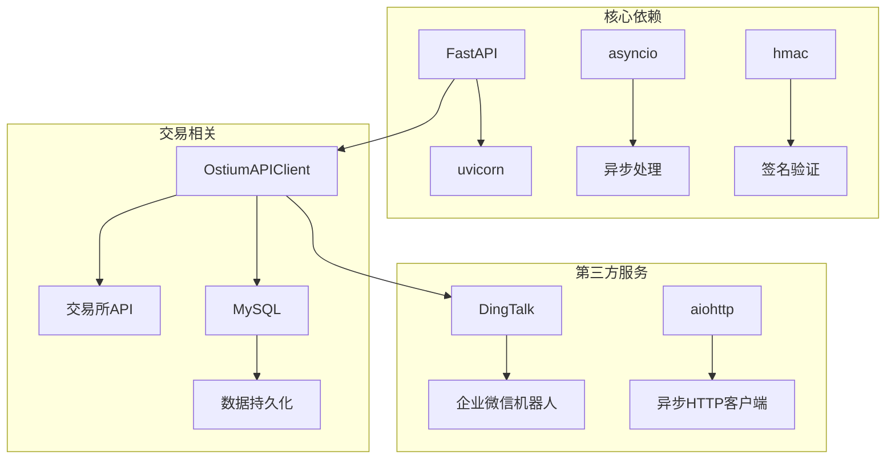
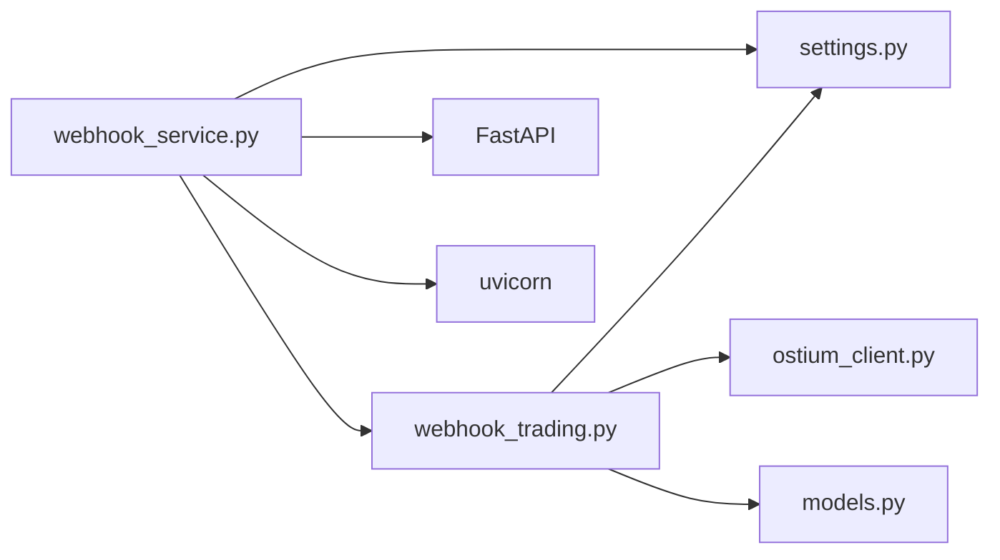

# Webhook配置

<cite>
**本文档引用的文件**
- [webhook_service.py](file://backpack_quant_trading/webhook_service.py)
- [webhook_trading.py](file://backpack_quant_trading/engine/webhook_trading.py)
- [settings.py](file://backpack_quant_trading/config/settings.py)
- [dual_freq_trend.pine](file://tradingview_dual_freq/dual_freq_trend.pine)
- [intraday_15m_strategy.pine](file://tradingview_dual_freq/intraday_15m_strategy.pine)
- [bprc_v2_strategy.pine](file://tradingview_dual_freq/bprc_v2_strategy.pine)
- [.env](file://backpack_quant_trading/.env)
</cite>

## 目录
1. [简介](#简介)
2. [项目结构](#项目结构)
3. [核心组件](#核心组件)
4. [架构概览](#架构概览)
5. [详细组件分析](#详细组件分析)
6. [依赖关系分析](#依赖关系分析)
7. [性能考虑](#性能考虑)
8. [故障排除指南](#故障排除指南)
9. [结论](#结论)

## 简介

本文档详细说明了基于FastAPI的TradingView Webhook服务配置方法。该系统支持多实例管理和安全验证，能够接收TradingView信号并自动执行交易操作。系统包含完整的配置参数设置、安全验证机制、钉钉通知集成以及信号规则参数配置。

## 项目结构

Webhook服务采用模块化架构，主要包含以下核心组件：



**图表来源**
- [webhook_service.py:1-598](file://backpack_quant_trading/webhook_service.py#L1-L598)
- [webhook_trading.py:1-684](file://backpack_quant_trading/engine/webhook_trading.py#L1-L684)
- [settings.py:1-137](file://backpack_quant_trading/config/settings.py#L1-L137)

**章节来源**
- [webhook_service.py:1-50](file://backpack_quant_trading/webhook_service.py#L1-L50)
- [settings.py:78-89](file://backpack_quant_trading/config/settings.py#L78-L89)

## 核心组件

### Webhook服务配置

Webhook服务的核心配置参数位于`settings.py`文件中，包含以下关键配置项：

#### 基础配置参数

| 配置项 | 默认值 | 说明 |
|--------|--------|------|
| WEBHOOK_SECRET | "your-secret-key-here" | Webhook签名密钥，用于验证请求真实性 |
| WEBHOOK_HOST | "0.0.0.0" | 服务监听主机地址 |
| WEBHOOK_PORT | 8005 | 服务监听端口号 |
| WEBHOOK_HIGH_QTY_MIN | 10.0 | 高风险交易保证金最小值 |
| WEBHOOK_HIGH_QTY_MAX | 11.0 | 高风险交易保证金最大值 |
| WEBHOOK_LOW_QTY_RATIO | 1.0 | 低风险交易保证金比例 |

#### 钉钉通知配置

| 配置项 | 默认值 | 说明 |
|--------|--------|------|
| DINGTALK_TOKEN | 机器人Token | 钉钉机器人访问令牌 |
| DINGTALK_SECRET | SEC40ec4439b5bee6976073e681e0c3ec035af44b33fbbc160640e66b5a483c3a2c | 钉钉机器人签名密钥 |

**章节来源**
- [settings.py:78-89](file://backpack_quant_trading/config/settings.py#L78-L89)
- [settings.py:82-84](file://backpack_quant_trading/config/settings.py#L82-L84)

### TradingView信号模型

系统定义了完整的TradingView信号数据模型，支持多种信号类型和自定义字段：



**图表来源**
- [webhook_trading.py:22-38](file://backpack_quant_trading/engine/webhook_trading.py#L22-L38)
- [webhook_trading.py:40-68](file://backpack_quant_trading/engine/webhook_trading.py#L40-L68)

**章节来源**
- [webhook_trading.py:22-38](file://backpack_quant_trading/engine/webhook_trading.py#L22-L38)
- [webhook_trading.py:40-68](file://backpack_quant_trading/engine/webhook_trading.py#L40-L68)

## 架构概览

Webhook服务采用多实例架构，支持同时管理多个交易账户和策略：



**图表来源**
- [webhook_service.py:319-444](file://backpack_quant_trading/webhook_service.py#L319-L444)
- [webhook_trading.py:208-294](file://backpack_quant_trading/engine/webhook_trading.py#L208-L294)

## 详细组件分析

### 安全验证机制

系统实现了双重安全验证机制：

#### HMAC签名验证



**图表来源**
- [webhook_service.py:34-45](file://backpack_quant_trading/webhook_service.py#L34-L45)

#### 签名验证流程

1. **密钥加载**：从环境变量`WEBHOOK_SECRET`加载密钥
2. **HMAC计算**：使用SHA256算法计算请求体的HMAC
3. **比较验证**：使用常量时间比较函数验证签名
4. **安全降级**：如果密钥未配置，默认跳过验证

**章节来源**
- [webhook_service.py:34-45](file://backpack_quant_trading/webhook_service.py#L34-L45)

### 多实例管理

系统支持同时管理多个交易实例：

#### 实例注册流程



**图表来源**
- [webhook_service.py:83-244](file://backpack_quant_trading/webhook_service.py#L83-L244)

#### 实例配置参数

| 参数名称 | 必填 | 类型 | 说明 |
|----------|------|------|------|
| instance_id | 是 | string | 实例唯一标识符 |
| private_key | 是 | string | 交易所私钥 |
| symbol | 否 | string | 交易对，默认NDX-USD |
| leverage | 否 | int | 杠杆倍数，默认5 |
| margin_amount | 否 | string | 保证金金额或范围 |
| stop_loss_ratio | 否 | float | 止损比例（小数形式） |
| take_profit_ratio | 否 | float | 止盈比例（小数形式） |
| forbidden_hours | 否 | string | 休市时间段（逗号分隔） |

**章节来源**
- [webhook_service.py:83-244](file://backpack_quant_trading/webhook_service.py#L83-L244)

### 信号处理与执行

#### 信号意图识别

系统通过分析TradingView信号中的"先前仓位"和"先前仓位大小"字段来识别交易意图：



**图表来源**
- [webhook_trading.py:232-241](file://backpack_quant_trading/engine/webhook_trading.py#L232-L241)

#### 仓位管理策略

系统实现了智能的仓位管理机制：

1. **开仓逻辑**：根据信号类型和当前持仓状态决定是否开仓
2. **平仓逻辑**：通过数据库查询活跃仓位并执行平仓
3. **互换单逻辑**：当收到反向信号时，先平仓再开仓
4. **休市保护**：在休市时间段自动平仓

**章节来源**
- [webhook_trading.py:270-294](file://backpack_quant_trading/engine/webhook_trading.py#L270-L294)
- [webhook_trading.py:405-426](file://backpack_quant_trading/engine/webhook_trading.py#L405-L426)

### 风险管理

#### 实时止损监控

系统提供实时风险监控功能：



**图表来源**
- [webhook_trading.py:627-672](file://backpack_quant_trading/engine/webhook_trading.py#L627-L672)

#### 休市监控

系统还提供休市监控功能，自动在休市时间段平仓：

| 休市时间段 | 默认配置 |
|------------|----------|
| 北京时间 | 3:00-7:00, 13:00-14:00, 19:00-20:00 |
| 可配置性 | 支持通过环境变量自定义休市时间 |

**章节来源**
- [webhook_trading.py:673-684](file://backpack_quant_trading/engine/webhook_trading.py#L673-L684)

### 钉钉通知集成

系统集成了钉钉机器人通知功能：

#### 通知发送流程



**图表来源**
- [webhook_trading.py:182-207](file://backpack_quant_trading/engine/webhook_trading.py#L182-L207)

#### 通知内容格式

通知内容包含以下信息：
- 时间戳（北京时间）
- 交易对信息
- 交易类型（开仓/平仓/止损）
- 仓位状态
- 盈亏情况

**章节来源**
- [webhook_trading.py:182-207](file://backpack_quant_trading/engine/webhook_trading.py#L182-L207)

## 依赖关系分析

### 外部依赖

系统依赖以下外部组件：



**图表来源**
- [webhook_service.py:1-12](file://backpack_quant_trading/webhook_service.py#L1-L12)
- [webhook_trading.py:1-18](file://backpack_quant_trading/engine/webhook_trading.py#L1-L18)

### 内部模块依赖

系统内部模块之间的依赖关系：



**图表来源**
- [webhook_service.py:11-12](file://backpack_quant_trading/webhook_service.py#L11-L12)
- [webhook_trading.py:16-18](file://backpack_quant_trading/engine/webhook_trading.py#L16-L18)

**章节来源**
- [webhook_service.py:11-12](file://backpack_quant_trading/webhook_service.py#L11-L12)
- [webhook_trading.py:16-18](file://backpack_quant_trading/engine/webhook_trading.py#L16-L18)

## 性能考虑

### 并发处理

系统采用异步并发处理机制：

1. **异步信号处理**：使用`asyncio.create_task()`异步执行交易逻辑
2. **锁机制**：每个实例使用独立的异步锁确保线程安全
3. **资源管理**：合理管理数据库连接和API客户端资源

### 性能优化建议

1. **批量处理**：对于大量实例，考虑实现批量处理机制
2. **缓存策略**：缓存常用的配置和状态信息
3. **连接池**：使用连接池管理数据库和API连接
4. **监控指标**：添加性能监控指标以便优化

## 故障排除指南

### 常见问题及解决方案

#### Webhook签名验证失败

**症状**：收到401错误，提示"Invalid signature"

**可能原因**：
1. 签名密钥配置错误
2. TradingView签名配置不正确
3. 请求体被修改

**解决步骤**：
1. 检查`WEBHOOK_SECRET`环境变量配置
2. 验证TradingView Webhook签名设置
3. 确认请求体完整性

#### 实例注册失败

**症状**：注册接口返回错误

**可能原因**：
1. 缺少必需参数
2. 私钥格式不正确
3. 服务器未启动

**解决步骤**：
1. 确认所有必需参数都已提供
2. 验证私钥格式符合要求
3. 检查服务端口是否正确

#### 交易执行失败

**症状**：订单提交失败

**可能原因**：
1. 保证金不足
2. 价格异常
3. 交易所API限制

**解决步骤**：
1. 检查账户余额
2. 验证交易对价格
3. 查看交易所API状态

#### 钉钉通知失败

**症状**：通知发送失败

**可能原因**：
1. 机器人配置错误
2. 网络连接问题
3. 签名验证失败

**解决步骤**：
1. 验证钉钉机器人的Token和Secret
2. 检查网络连接
3. 确认签名算法正确

### 调试方法

#### 日志分析

系统提供了详细的日志记录：

1. **Webhook服务日志**：位于`log/webhook_server.log`
2. **控制台输出**：实时显示服务状态
3. **错误日志**：记录异常和错误信息

#### 健康检查

系统提供健康检查接口：

```bash
curl http://localhost:8005/health
```

返回`{"status": "healthy", "instances": 0}`表示服务正常运行。

#### 实例状态查询

```bash
curl http://localhost:8005/instances
```

查看当前注册的实例列表和状态。

**章节来源**
- [webhook_service.py:79-81](file://backpack_quant_trading/webhook_service.py#L79-L81)
- [webhook_service.py:275-290](file://backpack_quant_trading/webhook_service.py#L275-L290)

## 结论

本文档详细介绍了基于FastAPI的TradingView Webhook服务配置方法。系统具有以下特点：

1. **安全性**：实现了HMAC签名验证和多层安全防护
2. **灵活性**：支持多实例管理和动态配置更新
3. **可靠性**：提供完整的错误处理和故障恢复机制
4. **可观测性**：内置日志记录和健康检查功能

通过合理配置和使用，该系统可以稳定地处理TradingView信号并执行自动化交易。建议在生产环境中启用签名验证，并定期监控系统状态以确保服务的稳定性。