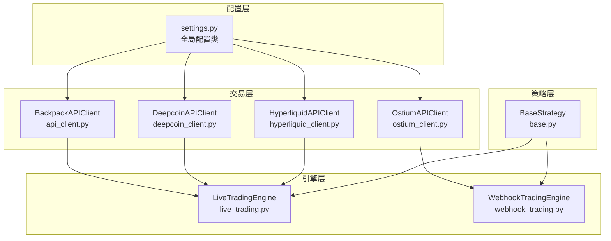
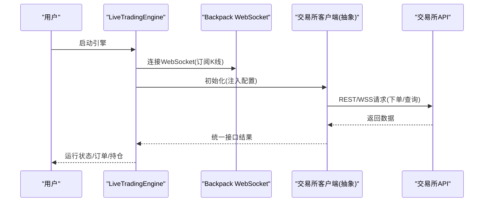
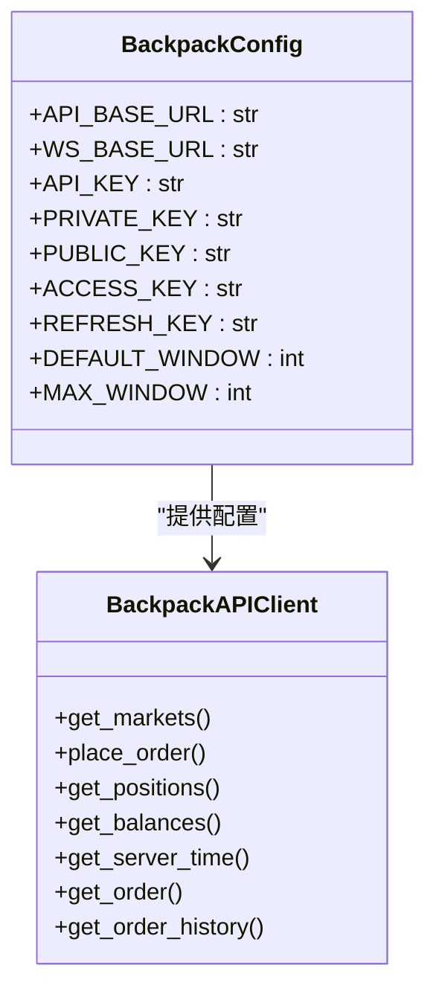
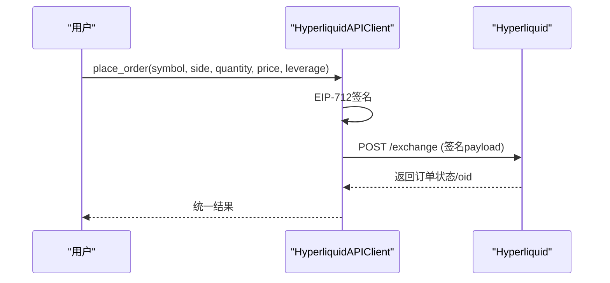
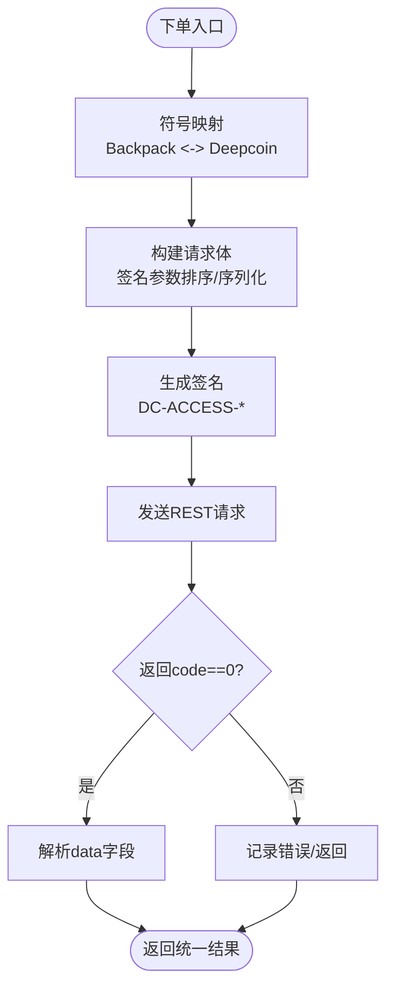
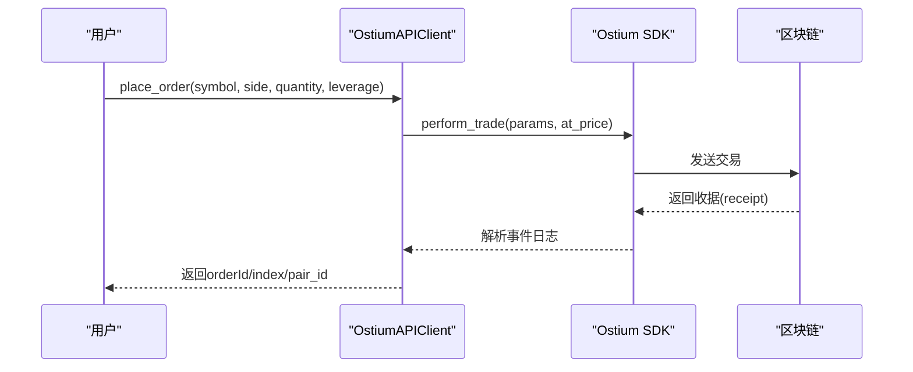
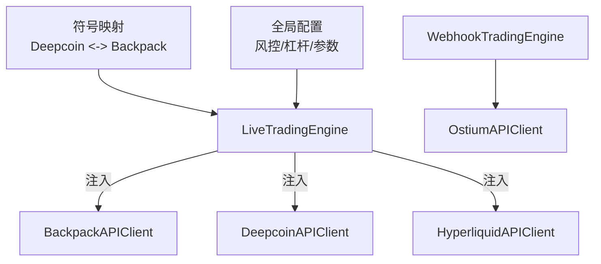
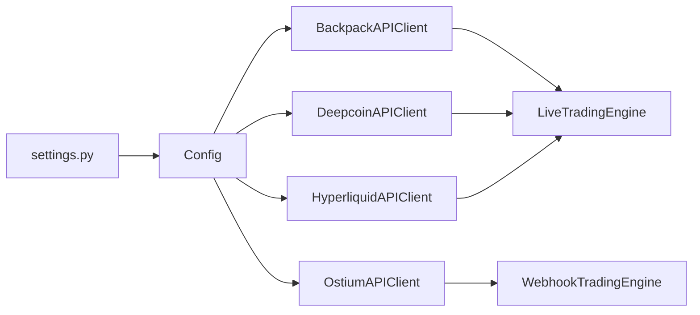

# 交易所配置

<cite>
**本文引用的文件**
- [settings.py](file://backpack_quant_trading/config/settings.py)
- [api_client.py](file://backpack_quant_trading/core/api_client.py)
- [deepcoin_client.py](file://backpack_quant_trading/core/deepcoin_client.py)
- [hyperliquid_client.py](file://backpack_quant_trading/core/hyperliquid_client.py)
- [ostium_client.py](file://backpack_quant_trading/core/ostium_client.py)
- [live_trading.py](file://backpack_quant_trading/engine/live_trading.py)
- [webhook_trading.py](file://backpack_quant_trading/engine/webhook_trading.py)
- [base.py](file://backpack_quant_trading/strategy/base.py)
</cite>

## 目录
1. [简介](#简介)
2. [项目结构](#项目结构)
3. [核心组件](#核心组件)
4. [架构概览](#架构概览)
5. [详细组件分析](#详细组件分析)
6. [依赖分析](#依赖分析)
7. [性能考虑](#性能考虑)
8. [故障排查指南](#故障排查指南)
9. [结论](#结论)
10. [附录](#附录)

## 简介
本文件面向多交易所量化交易系统的配置与使用，聚焦以下交易所的配置参数与最佳实践：
- Backpack（Backpack Exchange）
- Hyperliquid（Hyperliquid）
- Deepcoin（Deepcoin）
- Ostium（Ostium）

内容涵盖：
- API密钥、WebSocket地址、RPC节点等关键配置项的作用与配置方式
- 各交易所的特殊配置要求与注意事项
- 配置验证方法与常见错误排查
- 多交易所同时使用的策略与注意事项

## 项目结构
围绕配置与交易的核心模块如下：
- 配置层：集中于配置类与环境变量加载
- 交易层：各交易所的API客户端封装
- 引擎层：实盘/Webhook交易引擎
- 策略层：策略基类与信号生成

图表来源
- [settings.py:104-132](file://backpack_quant_trading/config/settings.py#L104-L132)
- [api_client.py:87-156](file://backpack_quant_trading/core/api_client.py#L87-L156)
- [deepcoin_client.py:18-31](file://backpack_quant_trading/core/deepcoin_client.py#L18-L31)
- [hyperliquid_client.py:18-50](file://backpack_quant_trading/core/hyperliquid_client.py#L18-L50)
- [ostium_client.py:19-51](file://backpack_quant_trading/core/ostium_client.py#L19-L51)
- [live_trading.py:347-402](file://backpack_quant_trading/engine/live_trading.py#L347-L402)
- [webhook_trading.py:40-84](file://backpack_quant_trading/engine/webhook_trading.py#L40-L84)
- [base.py:41-70](file://backpack_quant_trading/strategy/base.py#L41-L70)

章节来源
- [settings.py:104-132](file://backpack_quant_trading/config/settings.py#L104-L132)
- [api_client.py:87-156](file://backpack_quant_trading/core/api_client.py#L87-L156)
- [deepcoin_client.py:18-31](file://backpack_quant_trading/core/deepcoin_client.py#L18-L31)
- [hyperliquid_client.py:18-50](file://backpack_quant_trading/core/hyperliquid_client.py#L18-L50)
- [ostium_client.py:19-51](file://backpack_quant_trading/core/ostium_client.py#L19-L51)
- [live_trading.py:347-402](file://backpack_quant_trading/engine/live_trading.py#L347-L402)
- [webhook_trading.py:40-84](file://backpack_quant_trading/engine/webhook_trading.py#L40-L84)
- [base.py:41-70](file://backpack_quant_trading/strategy/base.py#L41-L70)

## 核心组件
- 配置中心（Config）：统一管理各交易所配置、数据库、交易风控、Webhook等参数，并提供项目根目录、数据与日志目录。
- 交易所客户端：
  - BackpackAPIClient：Backpack REST/WSS客户端，支持ED25519签名与Cookie认证。
  - DeepcoinAPIClient：Deepcoin REST客户端，负责映射与签名，支持账户、持仓、下单等。
  - HyperliquidAPIClient：Hyperliquid REST/签名客户端，基于EIP-712签名与Meta信息。
  - OstiumAPIClient：Ostium链上SDK客户端，依赖RPC与私钥。
- 引擎：
  - LiveTradingEngine：实盘引擎，统一从Backpack WebSocket订阅K线，下单通过交易所抽象接口。
  - WebhookTradingEngine：Webhook引擎，对接TradingView信号并在Ostium执行交易。

章节来源
- [settings.py:104-132](file://backpack_quant_trading/config/settings.py#L104-L132)
- [api_client.py:87-156](file://backpack_quant_trading/core/api_client.py#L87-L156)
- [deepcoin_client.py:18-31](file://backpack_quant_trading/core/deepcoin_client.py#L18-L31)
- [hyperliquid_client.py:18-50](file://backpack_quant_trading/core/hyperliquid_client.py#L18-L50)
- [ostium_client.py:19-51](file://backpack_quant_trading/core/ostium_client.py#L19-L51)
- [live_trading.py:347-402](file://backpack_quant_trading/engine/live_trading.py#L347-L402)
- [webhook_trading.py:40-84](file://backpack_quant_trading/engine/webhook_trading.py#L40-L84)

## 架构概览
多交易所配置通过统一的配置类与抽象接口实现解耦，引擎层仅依赖抽象接口，从而支持在不同交易所之间切换。

图表来源
- [live_trading.py:347-402](file://backpack_quant_trading/engine/live_trading.py#L347-L402)
- [api_client.py:87-156](file://backpack_quant_trading/core/api_client.py#L87-L156)

章节来源
- [live_trading.py:347-402](file://backpack_quant_trading/engine/live_trading.py#L347-L402)
- [api_client.py:87-156](file://backpack_quant_trading/core/api_client.py#L87-L156)

## 详细组件分析

### Backpack 配置与使用
- 关键配置项
  - API_BASE_URL：Backpack REST API基础地址
  - WS_BASE_URL：Backpack WebSocket地址
  - API_KEY / PUBLIC_KEY / PRIVATE_KEY：ED25519公私钥（Base64）
  - ACCESS_KEY / REFRESH_KEY：Cookie认证（可选）
  - DEFAULT_WINDOW / MAX_WINDOW：请求时间窗
- 认证方式
  - ED25519签名：通过指令+参数+时间戳+窗口生成签名
  - Cookie认证：使用accessKey/refreshKey
- 特殊要求
  - 签名参数需按字母序排序，布尔值需转小写字符串
  - 时间戳过期或系统时间偏差会导致400错误
- 配置验证
  - 通过get_markets/get_account等接口验证
  - WebSocket连接需支持代理（HTTPS_PROXY/http_proxy/HTTP_PROXY）

图表来源
- [settings.py:13-31](file://backpack_quant_trading/config/settings.py#L13-L31)
- [api_client.py:87-156](file://backpack_quant_trading/core/api_client.py#L87-L156)

章节来源
- [settings.py:13-31](file://backpack_quant_trading/config/settings.py#L13-L31)
- [api_client.py:158-211](file://backpack_quant_trading/core/api_client.py#L158-L211)
- [api_client.py:213-268](file://backpack_quant_trading/core/api_client.py#L213-L268)

### Hyperliquid 配置与使用
- 关键配置项
  - API_BASE_URL：Hyperliquid REST API基础地址
  - WS_BASE_URL：WebSocket地址（如需）
  - PRIVATE_KEY：以太坊私钥（64位十六进制，不含0x）
- 认证与签名
  - EIP-712签名：基于typed data与keccak哈希生成connectionId并签名
  - 地址需小写，大小写敏感
- 特殊要求
  - 账户需在交易所侧初始化（存在性检查）
  - 市价单默认加滑点（买入+1%，卖出-1%）
  - 开仓时设置杠杆，平仓使用reduce_only
- 配置验证
  - get_meta/check_user_exists/get_balance等接口验证

图表来源
- [hyperliquid_client.py:18-50](file://backpack_quant_trading/core/hyperliquid_client.py#L18-L50)
- [hyperliquid_client.py:483-533](file://backpack_quant_trading/core/hyperliquid_client.py#L483-L533)

章节来源
- [hyperliquid_client.py:18-50](file://backpack_quant_trading/core/hyperliquid_client.py#L18-L50)
- [hyperliquid_client.py:158-340](file://backpack_quant_trading/core/hyperliquid_client.py#L158-L340)
- [hyperliquid_client.py:483-533](file://backpack_quant_trading/core/hyperliquid_client.py#L483-L533)

### Deepcoin 配置与使用
- 关键配置项
  - API_BASE_URL：Deepcoin REST API基础地址
  - API_KEY / SECRET_KEY / PASSPHRASE：签名三件套
  - DEFAULT_MARGIN_MODE：保证金模式（isolated/cross）
  - DEFAULT_MERGE_POSITION：合并/拆分（merge/split）
  - LEVERAGE：默认杠杆
- 特殊要求
  - 签名：DC-ACCESS-* 头部，时间戳需精确到毫秒
  - 符号映射：Backpack格式与Deepcoin格式互转
  - 限价单需传px，市价单自动计算
  - 取消所有订单需先获取挂单列表再批量取消
- 配置验证
  - get_markets/get_account/get_balance/get_positions等

图表来源
- [deepcoin_client.py:68-108](file://backpack_quant_trading/core/deepcoin_client.py#L68-L108)
- [deepcoin_client.py:42-66](file://backpack_quant_trading/core/deepcoin_client.py#L42-L66)
- [deepcoin_client.py:110-171](file://backpack_quant_trading/core/deepcoin_client.py#L110-L171)

章节来源
- [deepcoin_client.py:18-31](file://backpack_quant_trading/core/deepcoin_client.py#L18-L31)
- [deepcoin_client.py:42-66](file://backpack_quant_trading/core/deepcoin_client.py#L42-L66)
- [deepcoin_client.py:68-108](file://backpack_quant_trading/core/deepcoin_client.py#L68-L108)
- [deepcoin_client.py:110-171](file://backpack_quant_trading/core/deepcoin_client.py#L110-L171)

### Ostium 配置与使用
- 关键配置项
  - RPC_URL：RPC节点地址（Infura等）
  - PRIVATE_KEY：以太坊私钥
  - NETWORK：mainnet/testnet
  - SYMBOL：默认交易对（如NDX-USD）
  - LEVERAGE：默认杠杆
- 特殊要求
  - 通过Ostium SDK与链交互，需提供私钥才可下单
  - 限价单事件日志解析trade_index，失败时可回查Subgraph
  - 最小抵押USDC限制，过小会revert
- 配置验证
  - get_markets/get_price/get_positions等

图表来源
- [ostium_client.py:19-51](file://backpack_quant_trading/core/ostium_client.py#L19-L51)
- [ostium_client.py:437-624](file://backpack_quant_trading/core/ostium_client.py#L437-L624)

章节来源
- [ostium_client.py:19-51](file://backpack_quant_trading/core/ostium_client.py#L19-L51)
- [ostium_client.py:437-624](file://backpack_quant_trading/core/ostium_client.py#L437-L624)

### 多交易所同时使用策略
- 引擎注入
  - LiveTradingEngine默认使用Backpack作为数据源（WebSocket），下单通过ExchangeClient抽象注入（Backpack/Deepcoin/Hyperliquid）
- 符号映射
  - Deepcoin格式与Backpack格式互转，确保K线订阅与下单格式一致
- 风控与参数
  - 全局风控参数（最大仓位、止损止盈、杠杆等）可在配置中统一设置
- Webhook与Ostium
  - WebhookTradingEngine独立于实盘引擎，专门处理TradingView信号并在Ostium执行

图表来源
- [live_trading.py:353-365](file://backpack_quant_trading/engine/live_trading.py#L353-L365)
- [live_trading.py:608-698](file://backpack_quant_trading/engine/live_trading.py#L608-L698)
- [webhook_trading.py:40-84](file://backpack_quant_trading/engine/webhook_trading.py#L40-L84)

章节来源
- [live_trading.py:353-365](file://backpack_quant_trading/engine/live_trading.py#L353-L365)
- [live_trading.py:608-698](file://backpack_quant_trading/engine/live_trading.py#L608-L698)
- [webhook_trading.py:40-84](file://backpack_quant_trading/engine/webhook_trading.py#L40-L84)

## 依赖分析
- 配置依赖
  - settings.py提供全局Config实例，各客户端读取配置
- 客户端依赖
  - Backpack/Deepcoin/Hyperliquid/Ostium客户端各自依赖配置与网络库
- 引擎依赖
  - LiveTradingEngine依赖Backpack WebSocket与交易所抽象接口
  - WebhookTradingEngine依赖Ostium SDK与数据库

图表来源
- [settings.py:104-132](file://backpack_quant_trading/config/settings.py#L104-L132)
- [api_client.py:87-156](file://backpack_quant_trading/core/api_client.py#L87-L156)
- [deepcoin_client.py:18-31](file://backpack_quant_trading/core/deepcoin_client.py#L18-L31)
- [hyperliquid_client.py:18-50](file://backpack_quant_trading/core/hyperliquid_client.py#L18-L50)
- [ostium_client.py:19-51](file://backpack_quant_trading/core/ostium_client.py#L19-L51)
- [live_trading.py:347-402](file://backpack_quant_trading/engine/live_trading.py#L347-L402)
- [webhook_trading.py:40-84](file://backpack_quant_trading/engine/webhook_trading.py#L40-L84)

章节来源
- [settings.py:104-132](file://backpack_quant_trading/config/settings.py#L104-L132)
- [api_client.py:87-156](file://backpack_quant_trading/core/api_client.py#L87-L156)
- [deepcoin_client.py:18-31](file://backpack_quant_trading/core/deepcoin_client.py#L18-L31)
- [hyperliquid_client.py:18-50](file://backpack_quant_trading/core/hyperliquid_client.py#L18-L50)
- [ostium_client.py:19-51](file://backpack_quant_trading/core/ostium_client.py#L19-L51)
- [live_trading.py:347-402](file://backpack_quant_trading/engine/live_trading.py#L347-L402)
- [webhook_trading.py:40-84](file://backpack_quant_trading/engine/webhook_trading.py#L40-L84)

## 性能考虑
- 缓存与去重
  - BackpackAPIClient对markets做1小时缓存，减少API调用
  - LiveTradingEngine对余额做TTL缓存（默认10分钟）
- 并发与异步
  - 各客户端使用异步HTTP与WebSocket，降低阻塞
- 代理与网络
  - WebSocket与REST均支持HTTPS_PROXY/http_proxy/HTTP_PROXY环境变量

章节来源
- [api_client.py:295-310](file://backpack_quant_trading/core/api_client.py#L295-L310)
- [live_trading.py:408-441](file://backpack_quant_trading/engine/live_trading.py#L408-L441)
- [live_trading.py:153-235](file://backpack_quant_trading/engine/live_trading.py#L153-L235)

## 故障排查指南
- Backpack
  - 400错误：检查签名参数（布尔转小写、参数排序、时间戳/窗口）、系统时间同步
  - WebSocket连接失败：检查代理设置与网络可达性
- Deepcoin
  - 429限流：降低请求频率或使用指数退避
  - 非JSON响应：检查请求体/参数序列化（紧凑JSON）
  - 取消所有订单：先获取挂单列表再批量取消
- Hyperliquid
  - 私钥长度/格式错误：确保64位十六进制且无0x前缀
  - 账户不存在：在交易所侧完成首次存款/交易激活
  - 市价单滑点：默认加减1%，可根据波动调整
- Ostium
  - 最小抵押限制：单笔至少1 USDC（合约限制）
  - trade_index解析失败：回查Subgraph或使用SDK容错机制
  - 休市时间：配置禁止交易时段，避免非交易时间下单

章节来源
- [api_client.py:254-268](file://backpack_quant_trading/core/api_client.py#L254-L268)
- [deepcoin_client.py:150-171](file://backpack_quant_trading/core/deepcoin_client.py#L150-L171)
- [hyperliquid_client.py:316-318](file://backpack_quant_trading/core/hyperliquid_client.py#L316-L318)
- [ostium_client.py:430-434](file://backpack_quant_trading/core/ostium_client.py#L430-L434)
- [webhook_trading.py:131-140](file://backpack_quant_trading/engine/webhook_trading.py#L131-L140)

## 结论
- 通过统一配置类与抽象接口，系统实现了多交易所的灵活切换与统一管理
- 各交易所的关键配置项清晰明确，结合签名/认证流程与特殊要求，可稳定运行
- 建议在生产环境中：
  - 使用环境变量管理敏感信息（API密钥、私钥、RPC）
  - 启用代理与网络监控，保障连接稳定性
  - 配置合理的风控参数与限流策略

## 附录
- 配置文件位置与命名
  - 配置类：config/settings.py
  - 实盘引擎：engine/live_trading.py
  - Webhook引擎：engine/webhook_trading.py
  - 策略基类：strategy/base.py
- 常用验证接口
  - Backpack：get_markets/get_account/get_positions/get_balances
  - Deepcoin：get_markets/get_account/get_balance/get_positions
  - Hyperliquid：check_user_exists/get_positions/get_balance
  - Ostium：get_markets/get_price/get_positions

章节来源
- [settings.py:104-132](file://backpack_quant_trading/config/settings.py#L104-L132)
- [live_trading.py:347-402](file://backpack_quant_trading/engine/live_trading.py#L347-L402)
- [webhook_trading.py:40-84](file://backpack_quant_trading/engine/webhook_trading.py#L40-L84)
- [base.py:41-70](file://backpack_quant_trading/strategy/base.py#L41-L70)