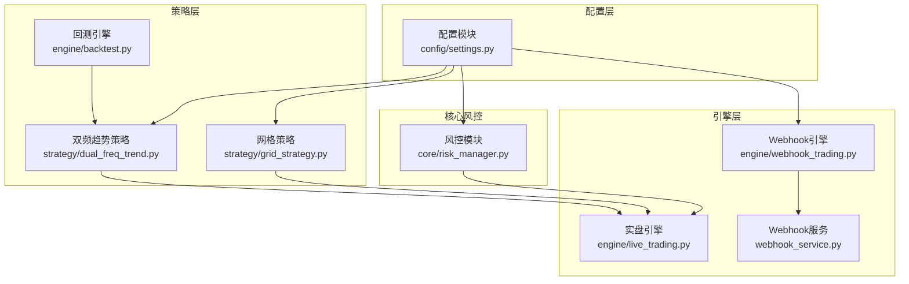
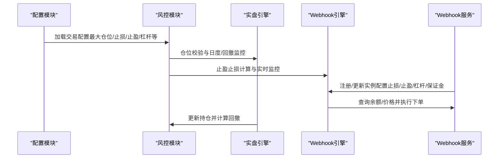
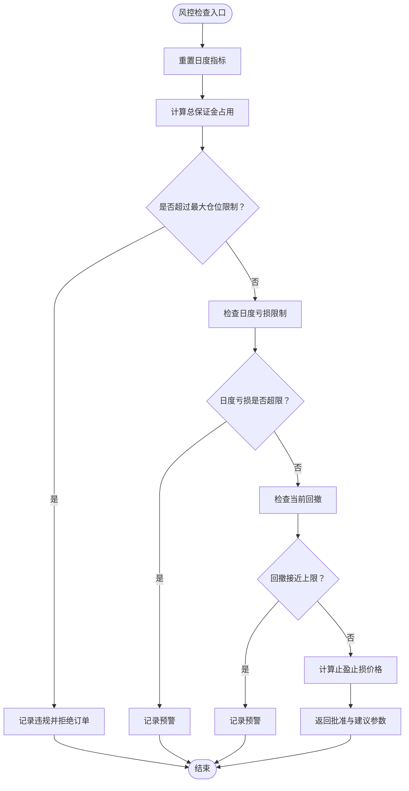
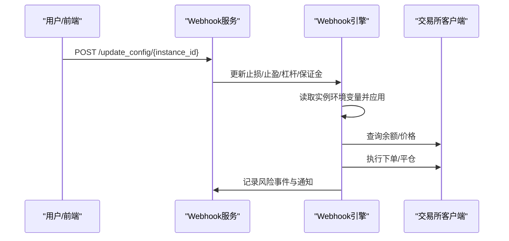
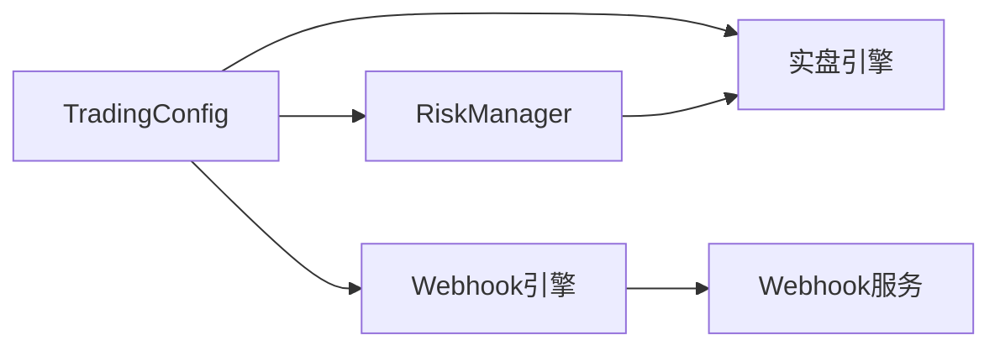

# 交易配置

<cite>
**本文引用的文件**
- [settings.py](file://backpack_quant_trading/config/settings.py)
- [risk_manager.py](file://backpack_quant_trading/core/risk_manager.py)
- [live_trading.py](file://backpack_quant_trading/engine/live_trading.py)
- [webhook_trading.py](file://backpack_quant_trading/engine/webhook_trading.py)
- [webhook_service.py](file://backpack_quant_trading/webhook_service.py)
- [grid_strategy.py](file://backpack_quant_trading/strategy/grid_strategy.py)
- [dual_freq_trend.py](file://backpack_quant_trading/strategy/dual_freq_trend.py)
- [backtest.py](file://backpack_quant_trading/engine/backtest.py)
</cite>

## 目录
1. [简介](#简介)
2. [项目结构](#项目结构)
3. [核心组件](#核心组件)
4. [架构总览](#架构总览)
5. [详细组件分析](#详细组件分析)
6. [依赖关系分析](#依赖关系分析)
7. [性能考量](#性能考量)
8. [故障排查指南](#故障排查指南)
9. [结论](#结论)
10. [附录](#附录)

## 简介
本文件面向量化交易系统的“交易配置”主题，围绕仓位管理、风险控制与交易参数配置展开，结合代码实现说明最大仓位比例、止损止盈、最大亏损限制等关键参数的作用与调优策略，并补充杠杆倍数、无风险利率等交易相关参数的配置方法。同时给出不同市场条件下的参数优化建议、风险管理策略及动态调整方法。

## 项目结构
本项目采用模块化分层组织，交易配置主要集中在配置模块与核心风控模块中，实盘引擎与Webhook引擎负责参数落地与执行，策略模块体现参数对信号与止盈止损的影响。

图表来源
- [settings.py:55-65](file://backpack_quant_trading/config/settings.py#L55-L65)
- [risk_manager.py:48-58](file://backpack_quant_trading/core/risk_manager.py#L48-L58)
- [live_trading.py:347-370](file://backpack_quant_trading/engine/live_trading.py#L347-L370)
- [webhook_trading.py:40-58](file://backpack_quant_trading/engine/webhook_trading.py#L40-L58)
- [webhook_service.py:83-155](file://backpack_quant_trading/webhook_service.py#L83-L155)
- [grid_strategy.py:132-140](file://backpack_quant_trading/strategy/grid_strategy.py#L132-L140)
- [dual_freq_trend.py:59-71](file://backpack_quant_trading/strategy/dual_freq_trend.py#L59-L71)
- [backtest.py:48-65](file://backpack_quant_trading/engine/backtest.py#L48-L65)

章节来源
- [settings.py:55-65](file://backpack_quant_trading/config/settings.py#L55-L65)
- [risk_manager.py:48-58](file://backpack_quant_trading/core/risk_manager.py#L48-L58)
- [live_trading.py:347-370](file://backpack_quant_trading/engine/live_trading.py#L347-L370)
- [webhook_trading.py:40-58](file://backpack_quant_trading/engine/webhook_trading.py#L40-L58)
- [webhook_service.py:83-155](file://backpack_quant_trading/webhook_service.py#L83-L155)
- [grid_strategy.py:132-140](file://backpack_quant_trading/strategy/grid_strategy.py#L132-L140)
- [dual_freq_trend.py:59-71](file://backpack_quant_trading/strategy/dual_freq_trend.py#L59-L71)
- [backtest.py:48-65](file://backpack_quant_trading/engine/backtest.py#L48-L65)

## 核心组件
- 交易配置（TradingConfig）
  - 最大单笔仓位比例：控制单笔订单占用的账户资金上限，避免过度集中。
  - 单日最大亏损：限制每日累计亏损额度，防止连续亏损扩大。
  - 最大回撤：限制组合相对峰值的最大回撤比例，保护净值。
  - 止损比例：单笔订单允许的最大亏损比例，配合止盈形成风险边界。
  - 止盈比例：单笔订单允许的最大盈利比例，用于锁定利润。
  - 无风险利率：用于策略收益指标（如夏普比率）计算。
  - 杠杆倍数：决定保证金占用与潜在收益/风险放大倍数。
- 风控模块（RiskManager）
  - 仓位校验：基于总保证金与账户资金上限进行校验，避免超额占用。
  - 日度与回撤监控：跟踪当日累计盈亏与相对回撤，触发预警或限制。
  - 止盈止损计算：根据方向与基准价计算止盈止损价格。
  - 风险事件记录：记录违规与预警事件，便于审计与报告。
- 引擎与服务
  - 实盘引擎：统一接入风控模块，执行下单、监控与平仓。
  - Webhook引擎：接收外部信号，按配置参数执行开平仓与实时止损。
  - Webhook服务：多实例注册与动态配置更新，支持按实例维度调整参数。

章节来源
- [settings.py:55-65](file://backpack_quant_trading/config/settings.py#L55-L65)
- [risk_manager.py:48-58](file://backpack_quant_trading/core/risk_manager.py#L48-L58)
- [risk_manager.py:132-229](file://backpack_quant_trading/core/risk_manager.py#L132-L229)
- [webhook_trading.py:40-58](file://backpack_quant_trading/engine/webhook_trading.py#L40-L58)
- [webhook_service.py:512-588](file://backpack_quant_trading/webhook_service.py#L512-L588)

## 架构总览
交易配置贯穿配置层、风控层与执行层，形成“参数下发—风控校验—执行落地”的闭环。

图表来源
- [settings.py:55-65](file://backpack_quant_trading/config/settings.py#L55-L65)
- [risk_manager.py:48-58](file://backpack_quant_trading/core/risk_manager.py#L48-L58)
- [risk_manager.py:132-229](file://backpack_quant_trading/core/risk_manager.py#L132-L229)
- [webhook_trading.py:40-58](file://backpack_quant_trading/engine/webhook_trading.py#L40-L58)
- [webhook_service.py:83-155](file://backpack_quant_trading/webhook_service.py#L83-L155)

## 详细组件分析

### 交易配置参数详解与调优策略
- 最大单笔仓位比例（MAX_POSITION_SIZE）
  - 作用：限制单笔订单占用的账户资金占比，避免单一交易对或方向过度集中。
  - 调优策略：
    - 低波动市场：可适度提高至0.3–0.5，提升资金利用率。
    - 高波动市场：建议降低至0.1–0.2，控制单笔冲击风险。
    - 多币种组合：按各币种波动性差异化设置，或采用动态比例。
- 单日最大亏损（MAX_DAILY_LOSS）
  - 作用：限制每日累计亏损额度，防止连续亏损扩大。
  - 调优策略：
    - 回测期内观察最大单日亏损分布，设定为历史最大值的1.5–2倍作为安全边界。
    - 结合账户容量与波动率，避免过度保守导致机会成本过高。
- 最大回撤（MAX_DRAWDOWN）
  - 作用：限制组合相对峰值的最大回撤比例，保护净值。
  - 调优策略：
    - 高波动策略：建议设置为3%–8%，兼顾收益与回撤容忍度。
    - 稳健策略：可放宽至8%–12%，追求更稳定的长期回报。
- 止损比例（STOP_LOSS_PERCENT）
  - 作用：单笔订单允许的最大亏损比例，配合止盈形成风险边界。
  - 调优策略：
    - 基于ATR或波动率设置，避免固定百分比在不同价格区间不合理。
    - 结合滑点与手续费，确保止损有效执行。
- 止盈比例（TAKE_PROFIT_PERCENT）
  - 作用：单笔订单允许的最大盈利比例，用于锁定利润。
  - 调优策略：
    - 与止损比例形成合理比值（如1:2或1:3），平衡风险与收益。
    - 在趋势明显时可适当提高止盈，震荡市中降低止盈以减少假突破。
- 无风险利率（RISK_FREE_RATE）
  - 作用：用于计算夏普比率等风险调整收益指标。
  - 调优策略：
    - 采用目标市场的短期国债或银行定期存款利率，保持与策略期限匹配。
- 杠杆倍数（LEVERAGE）
  - 作用：决定保证金占用与潜在收益/风险放大倍数。
  - 调优策略：
    - 与最大单笔仓位比例联动，避免“杠杆×仓位”双重放大导致超限。
    - 高波动市场下调杠杆，低波动市场适度提高以提升效率。

章节来源
- [settings.py:55-65](file://backpack_quant_trading/config/settings.py#L55-L65)
- [risk_manager.py:78-86](file://backpack_quant_trading/core/risk_manager.py#L78-L86)
- [risk_manager.py:132-229](file://backpack_quant_trading/core/risk_manager.py#L132-L229)

### 风控模块与仓位管理
- 仓位校验流程
  - 计算总保证金占用与账户资金上限，确保不超过最大单笔仓位比例。
  - 支持多交易对累计保证金的统一校验，避免跨币种超配。
- 日度与回撤监控
  - 每日重置累计盈亏与交易量，防止连续亏损扩大。
  - 相对回撤超过阈值80%时发出预警，进一步接近阈值则触发限制。
- 止盈止损计算
  - 根据方向与基准价计算止盈止损价格，支持买入/卖出场景。
  - 结合策略信号与实时价格，动态调整建议数量与价格。

图表来源
- [risk_manager.py:69-76](file://backpack_quant_trading/core/risk_manager.py#L69-L76)
- [risk_manager.py:132-229](file://backpack_quant_trading/core/risk_manager.py#L132-L229)

章节来源
- [risk_manager.py:69-76](file://backpack_quant_trading/core/risk_manager.py#L69-L76)
- [risk_manager.py:132-229](file://backpack_quant_trading/core/risk_manager.py#L132-L229)

### Webhook引擎与动态参数调整
- 参数来源与优先级
  - 实例级环境变量优先于全局配置，支持按实例维度动态调整。
  - Webhook服务提供统一接口，支持按实例更新止损、止盈、杠杆与保证金。
- 动态调整流程
  - 注册实例时写入环境变量，引擎启动时读取。
  - 通过服务端接口更新配置，无需重启实例即可生效。
- 实时监控与熔断
  - 实时监控单笔亏损，超过止损比例自动平仓并熔断。
  - 休市时段自动平仓，避免非交易时间的风险暴露。

图表来源
- [webhook_service.py:512-588](file://backpack_quant_trading/webhook_service.py#L512-L588)
- [webhook_trading.py:40-58](file://backpack_quant_trading/engine/webhook_trading.py#L40-L58)
- [webhook_trading.py:627-672](file://backpack_quant_trading/engine/webhook_trading.py#L627-L672)

章节来源
- [webhook_service.py:83-155](file://backpack_quant_trading/webhook_service.py#L83-L155)
- [webhook_service.py:512-588](file://backpack_quant_trading/webhook_service.py#L512-L588)
- [webhook_trading.py:40-58](file://backpack_quant_trading/engine/webhook_trading.py#L40-L58)
- [webhook_trading.py:627-672](file://backpack_quant_trading/engine/webhook_trading.py#L627-L672)

### 策略层参数对交易的影响
- 网格策略边界保护
  - 总亏损超过50%触发停止，日内最大亏损按单格投资额与网格数设定。
  - 通过日度统计与峰值利润计算最大回撤，避免深度套牢。
- 双频趋势策略
  - 止盈/止损采用“保证金收益%”定义，再按杠杆换算为价格波动，与价格比例参数可相互转换。
  - 时间止损、冷却与最小进场间隔等参数保障策略稳定性。

章节来源
- [grid_strategy.py:132-140](file://backpack_quant_trading/strategy/grid_strategy.py#L132-L140)
- [dual_freq_trend.py:59-71](file://backpack_quant_trading/strategy/dual_freq_trend.py#L59-L71)

### 回测与参数验证
- 回测引擎支持止盈止损模拟，避免K线内超出设定的亏损。
- 通过滑点与手续费模拟，验证参数在历史数据上的稳健性。

章节来源
- [backtest.py:100-168](file://backpack_quant_trading/engine/backtest.py#L100-L168)
- [backtest.py:189-331](file://backpack_quant_trading/engine/backtest.py#L189-L331)

## 依赖关系分析
- 配置依赖
  - TradingConfig为风控模块与引擎提供统一参数来源。
- 风控依赖
  - 风控模块依赖配置与数据库管理器，记录风险事件并生成报告。
- 执行依赖
  - 实盘引擎与Webhook引擎依赖风控模块进行订单校验与监控。
  - Webhook服务负责多实例注册与动态配置更新。

图表来源
- [settings.py:55-65](file://backpack_quant_trading/config/settings.py#L55-L65)
- [risk_manager.py:48-58](file://backpack_quant_trading/core/risk_manager.py#L48-L58)
- [webhook_trading.py:40-58](file://backpack_quant_trading/engine/webhook_trading.py#L40-L58)
- [webhook_service.py:83-155](file://backpack_quant_trading/webhook_service.py#L83-L155)

章节来源
- [settings.py:55-65](file://backpack_quant_trading/config/settings.py#L55-L65)
- [risk_manager.py:48-58](file://backpack_quant_trading/core/risk_manager.py#L48-L58)
- [webhook_trading.py:40-58](file://backpack_quant_trading/engine/webhook_trading.py#L40-L58)
- [webhook_service.py:83-155](file://backpack_quant_trading/webhook_service.py#L83-L155)

## 性能考量
- 参数缓存与更新
  - Webhook引擎按实例维度读取环境变量，减少重复解析成本。
  - 风控模块对日度指标进行定时重置，避免高频计算。
- 执行效率
  - 实盘引擎与Webhook引擎均采用异步模式，降低阻塞风险。
  - 网格策略通过挂单复用与限频熔断，减少API 429触发频率。

## 故障排查指南
- Webhook服务端口占用
  - 若端口被占用，服务启动失败；可通过端口检测与进程查找定位。
- 签名验证失败
  - Webhook请求需携带签名头，未通过验证将拒绝处理。
- 实例未注册
  - 广播模式下若无匹配实例，将返回未找到实例的提示。
- 风控拒绝订单
  - 检查最大仓位比例、日度亏损与回撤阈值，必要时降低杠杆或收紧止损。

章节来源
- [webhook_service.py:329-444](file://backpack_quant_trading/webhook_service.py#L329-L444)
- [webhook_service.py:246-274](file://backpack_quant_trading/webhook_service.py#L246-L274)
- [risk_manager.py:173-178](file://backpack_quant_trading/core/risk_manager.py#L173-L178)

## 结论
交易配置的核心在于“参数明确、风控前置、动态调整”。通过合理设置最大仓位比例、止损止盈与最大回撤等关键参数，并结合杠杆与无风险利率进行风险调整收益评估，可在不同市场条件下实现稳健的交易执行。Webhook引擎与服务提供了强大的动态参数调整能力，配合风控模块的实时监控，能够有效降低极端行情下的风险暴露。

## 附录
- 不同市场条件下的参数优化建议
  - 高波动市场：降低最大单笔仓位比例与止盈比例，提高止损比例；下调杠杆。
  - 低波动市场：适度提高最大单笔仓位比例与止盈比例，维持或小幅上调杠杆。
  - 震荡市场：收紧止损比例，提高止盈比例，增加冷却与最小进场间隔。
  - 趋势市场：提高止盈比例，适当放宽止损比例，关注时间止损与冷却。
- 风险管理策略
  - 分层风控：总仓位上限、单日亏损上限、相对回撤上限。
  - 动态止损：移动止损（如盈利≥3%时将止损移至成本价）。
  - 休市与熔断：休市时段自动平仓，单笔止损触发熔断并人工重置。