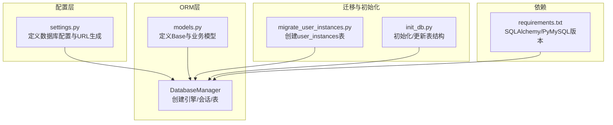
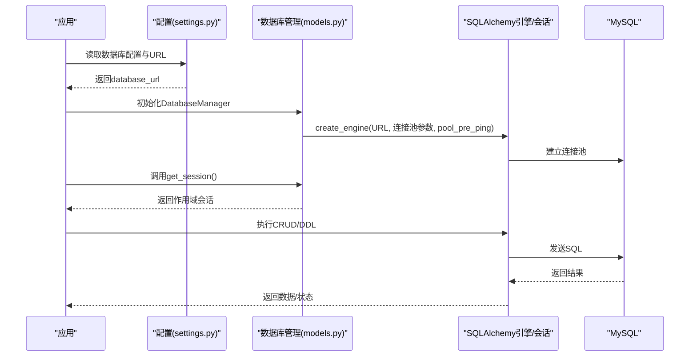
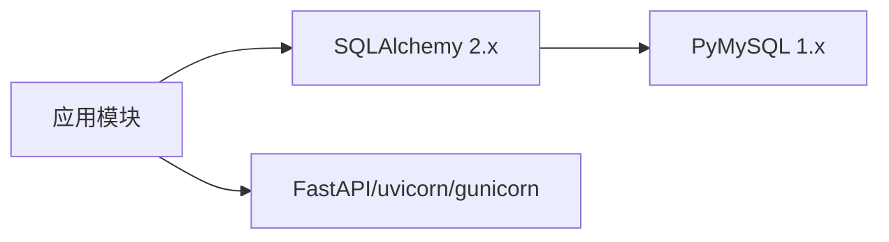

# 数据库配置

<cite>
**本文引用的文件**
- [settings.py](file://backpack_quant_trading/config/settings.py)
- [models.py](file://backpack_quant_trading/database/models.py)
- [migrate_user_instances.py](file://backpack_quant_trading/database/migrate_user_instances.py)
- [init_db.py](file://init_db.py)
- [requirements.txt](file://backpack_quant_trading/requirements.txt)
</cite>

## 目录
1. [简介](#简介)
2. [项目结构](#项目结构)
3. [核心组件](#核心组件)
4. [架构总览](#架构总览)
5. [详细组件分析](#详细组件分析)
6. [依赖分析](#依赖分析)
7. [性能考虑](#性能考虑)
8. [故障排查指南](#故障排查指南)
9. [结论](#结论)
10. [附录](#附录)

## 简介
本文件面向数据库配置与运维，聚焦于 MySQL 在本项目中的连接配置、连接池设置、性能优化参数、迁移与初始化最佳实践，以及安全与备份恢复策略。内容基于仓库中实际实现进行梳理，帮助开发者与运维人员快速理解并正确部署数据库。

## 项目结构
与数据库配置直接相关的文件分布如下：
- 配置层：config/settings.py 定义了数据库主机、端口、用户名、密码、库名及连接池参数，并生成数据库连接 URL。
- ORM 层：database/models.py 定义了 SQLAlchemy 的 Base 与各业务表模型，并通过 DatabaseManager 统一管理数据库引擎与会话。
- 迁移与初始化：database/migrate_user_instances.py 与 init_db.py 提供表级迁移与初始化脚本示例。
- 依赖声明：requirements.txt 明确了 SQLAlchemy 与 PyMySQL 的版本要求。

图表来源
- [settings.py:124-130](file://backpack_quant_trading/config/settings.py#L124-L130)
- [models.py:267-287](file://backpack_quant_trading/database/models.py#L267-L287)
- [migrate_user_instances.py:8-14](file://backpack_quant_trading/database/migrate_user_instances.py#L8-L14)
- [init_db.py:9-21](file://init_db.py#L9-L21)
- [requirements.txt:22-23](file://backpack_quant_trading/requirements.txt#L22-L23)

章节来源
- [settings.py:124-130](file://backpack_quant_trading/config/settings.py#L124-L130)
- [models.py:267-287](file://backpack_quant_trading/database/models.py#L267-L287)
- [migrate_user_instances.py:8-14](file://backpack_quant_trading/database/migrate_user_instances.py#L8-L14)
- [init_db.py:9-21](file://init_db.py#L9-L21)
- [requirements.txt:22-23](file://backpack_quant_trading/requirements.txt#L22-L23)

## 核心组件
- 数据库配置类与连接 URL 生成
  - 主机、端口、用户名、密码、库名均来自环境变量，未在代码中硬编码敏感信息。
  - 连接 URL 使用 mysql+pymysql 方案拼接，便于 SQLAlchemy 通过 PyMySQL 驱动连接 MySQL。
- 连接池参数
  - 连接池大小与溢出上限在配置类中定义，DatabaseManager 在创建引擎时应用。
  - 启用 pool_pre_ping 以在获取连接前进行健康检查，提升连接稳定性。
- ORM 与表模型
  - 使用 declarative_base 定义 Base，所有业务表继承自 Base。
  - DatabaseManager 负责创建引擎、会话工厂与作用域会话，统一提供 get_session 以供业务使用。
- 迁移与初始化
  - migrate_user_instances.py 用于创建 user_instances 表（幂等）。
  - init_db.py 提供初始化/更新表结构的示例流程（含删除特定表以适配字段长度变更的场景）。

章节来源
- [settings.py:44-53](file://backpack_quant_trading/config/settings.py#L44-L53)
- [settings.py:124-130](file://backpack_quant_trading/config/settings.py#L124-L130)
- [models.py:267-287](file://backpack_quant_trading/database/models.py#L267-L287)
- [migrate_user_instances.py:8-14](file://backpack_quant_trading/database/migrate_user_instances.py#L8-L14)
- [init_db.py:9-21](file://init_db.py#L9-L21)

## 架构总览
下图展示了从配置到数据库连接、ORM 操作与表管理的整体流程。

图表来源
- [settings.py:124-130](file://backpack_quant_trading/config/settings.py#L124-L130)
- [models.py:267-287](file://backpack_quant_trading/database/models.py#L267-L287)

## 详细组件分析

### 数据库配置项与设置方法
- 配置项来源
  - 主机 HOST：默认本地，可通过环境变量 DB_HOST 覆盖。
  - 端口 PORT：默认 3306，可通过 DB_PORT 覆盖。
  - 用户 USER：默认 root，可通过 DB_USER 覆盖。
  - 密码 PASSWORD：优先从环境变量 DB_PASSWORD 读取；若未设置则使用默认值。
  - 库名 NAME：默认 backpack，可通过 DB_NAME 覆盖。
- 连接 URL 生成
  - 采用 mysql+pymysql 方案，拼接 USER/PASSWORD/HOST/PORT/NAME。
- 环境变量加载
  - 项目通过 python-dotenv 加载 .env 文件，确保上述环境变量生效。
- 安全建议
  - 建议在生产环境使用只读账号执行查询，写入操作使用专用账号。
  - 密码与密钥应通过环境变量注入，避免硬编码。

章节来源
- [settings.py:44-53](file://backpack_quant_trading/config/settings.py#L44-L53)
- [settings.py:124-130](file://backpack_quant_trading/config/settings.py#L124-L130)

### 连接池设置与超时参数
- 连接池大小
  - pool_size：默认 20，表示连接池中常驻连接数。
  - max_overflow：默认 30，表示在池满时允许额外创建的连接数。
- 健康检查
  - pool_pre_ping：启用后，每次从池中取出连接前会进行一次“探活”查询，有助于自动恢复断开的连接。
- 超时与 echo
  - 当前实现未显式设置连接超时与空闲回收参数；echo 关闭，避免 SQL 输出影响日志。
- 生产建议
  - 根据并发请求数与数据库承载能力调整 pool_size 与 max_overflow。
  - 如需更细粒度控制，可在 create_engine 传参中增加 connect_args、pool_recycle、pool_timeout 等参数。

章节来源
- [settings.py:51-52](file://backpack_quant_trading/config/settings.py#L51-L52)
- [models.py:270-277](file://backpack_quant_trading/database/models.py#L270-L277)

### 重连机制
- 自动重连
  - 通过 pool_pre_ping 实现连接探活，降低因网络波动导致的连接失效。
- 业务侧重试
  - 项目其他模块存在针对外部服务的指数退避重试逻辑（非数据库），可作为参考在数据库异常时采用类似策略。
- 建议
  - 对于关键写入操作，可在业务层封装重试与事务回滚逻辑，结合连接池探活提升可用性。

章节来源
- [models.py:275](file://backpack_quant_trading/database/models.py#L275)

### 数据库迁移与初始化最佳实践
- 迁移策略
  - 使用 Alembic 或直接基于 SQLAlchemy 的 create_all/drop_all 进行迁移。
  - 对于新增表，优先使用 create_all 并开启 checkfirst，避免重复创建。
- 示例脚本
  - migrate_user_instances.py：创建 user_instances 表（幂等），适合增量演进。
  - init_db.py：初始化/更新表结构，示例中包含删除特定表以适配字段长度变更的场景，迁移时需谨慎评估数据丢失风险。
- 最佳实践
  - 先备份再迁移；对生产库迁移务必在维护窗口执行。
  - 对于字段长度变化，优先使用 ALTER TABLE 修改列属性，避免删除重建。
  - 记录每次迁移的版本号与变更清单，便于回滚与审计。

章节来源
- [migrate_user_instances.py:8-14](file://backpack_quant_trading/database/migrate_user_instances.py#L8-L14)
- [init_db.py:9-21](file://init_db.py#L9-L21)

### 数据库安全配置
- 凭据管理
  - 使用环境变量注入数据库凭据，避免将敏感信息写入代码或配置文件。
- 权限最小化
  - 为不同功能模块分配最小必要权限（如只读账号用于查询，写入账号用于写入）。
- 网络隔离
  - 将数据库置于内网或受控网络，限制外网访问。
- 加密传输
  - 建议在 MySQL 侧启用 TLS，或通过 VPN/隧道访问数据库。
- 审计与日志
  - 开启慢查询日志与错误日志，定期分析异常 SQL。

章节来源
- [settings.py:7-9](file://backpack_quant_trading/config/settings.py#L7-L9)
- [settings.py:46-50](file://backpack_quant_trading/config/settings.py#L46-L50)

### 备份与恢复策略
- 备份策略
  - 全量备份：每周一次，增量备份：每日一次。
  - 使用逻辑备份（如 mysqldump）与物理备份（如 LVM 快照）结合。
- 恢复策略
  - 定期验证备份文件完整性与可恢复性。
  - 制定 RPO/RTO 指标，并进行演练。
- 运维建议
  - 将备份文件加密并异地存放。
  - 对备份任务设置告警，确保失败及时通知。

[本节为通用运维建议，无需源码引用]

## 依赖分析
- SQLAlchemy 与 PyMySQL
  - 项目使用 SQLAlchemy 2.x 与 PyMySQL 1.x，确保驱动与 ORM 版本兼容。
- 运行时依赖
  - FastAPI/uvicorn/gunicorn 等用于 API 服务，与数据库连接无直接耦合，但会并发访问数据库。
- 依赖版本
  - requirements.txt 中明确声明 SQLAlchemy 与 PyMySQL 的最低版本，建议遵循以避免兼容问题。

图表来源
- [requirements.txt:22-23](file://backpack_quant_trading/requirements.txt#L22-L23)

章节来源
- [requirements.txt:22-23](file://backpack_quant_trading/requirements.txt#L22-L23)

## 性能考虑
- 连接池参数调优
  - pool_size：建议与应用并发线程/协程数匹配，避免过大导致数据库压力过大。
  - max_overflow：建议适度设置，避免突发流量导致连接暴涨。
  - pool_pre_ping：建议开启，降低连接失效带来的重试成本。
- SQL 与索引
  - 业务模型中已为高频查询字段建立复合索引，建议结合 EXPLAIN 分析热点 SQL。
- 写入优化
  - 使用批量写入（如批量 merge/add）减少往返次数。
  - 对高并发写入场景，考虑分表分库或异步队列削峰。
- 监控与告警
  - 监控连接池利用率、等待时间、慢查询数量，及时发现瓶颈。

[本节为通用性能建议，无需源码引用]

## 故障排查指南
- 连接失败
  - 检查 HOST/PORT/USER/PASSWORD/NAME 是否正确，确认网络可达。
  - 若出现连接中断，pool_pre_ping 会自动探活；仍失败时检查数据库负载与防火墙。
- 权限不足
  - 确认账号具备对应库/表的 SELECT/INSERT/UPDATE/DELETE 权限。
- 表结构不一致
  - 使用 migrate_user_instances.py 或 init_db.py 进行幂等创建/初始化。
  - 若涉及字段长度变更，优先 ALTER TABLE，避免删除重建导致数据丢失。
- 性能问题
  - 结合 EXPLAIN 分析慢查询，优化索引与 SQL。
  - 调整连接池参数，观察连接池利用率与等待时间。

章节来源
- [migrate_user_instances.py:8-14](file://backpack_quant_trading/database/migrate_user_instances.py#L8-L14)
- [init_db.py:9-21](file://init_db.py#L9-L21)

## 结论
本项目通过配置层集中管理数据库连接参数，ORM 层统一提供连接池与会话管理，并辅以迁移与初始化脚本支持表结构演进。建议在生产环境中进一步完善连接池参数、监控与告警体系，并严格执行备份与恢复策略，确保数据库稳定与数据安全。

## 附录
- 关键实现路径
  - 数据库配置与 URL 生成：[settings.py:124-130](file://backpack_quant_trading/config/settings.py#L124-L130)
  - 连接池与引擎创建：[models.py:270-277](file://backpack_quant_trading/database/models.py#L270-L277)
  - 表初始化与迁移示例：[migrate_user_instances.py:8-14](file://backpack_quant_trading/database/migrate_user_instances.py#L8-L14)，[init_db.py:9-21](file://init_db.py#L9-L21)
  - 依赖版本：[requirements.txt:22-23](file://backpack_quant_trading/requirements.txt#L22-L23)