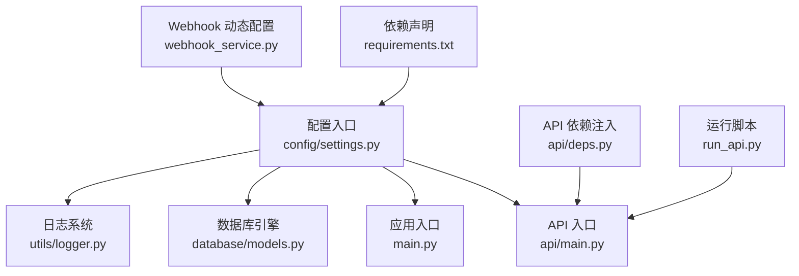
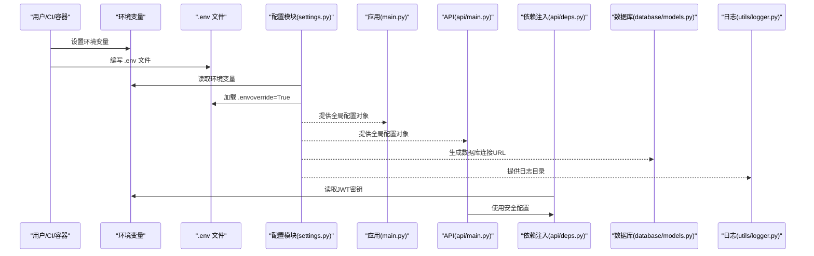
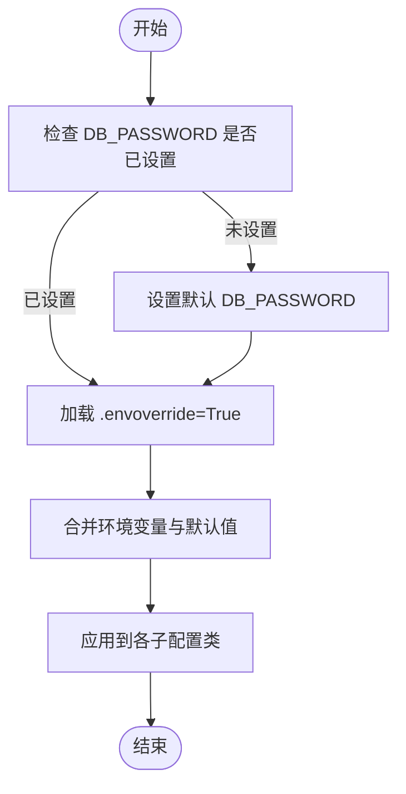
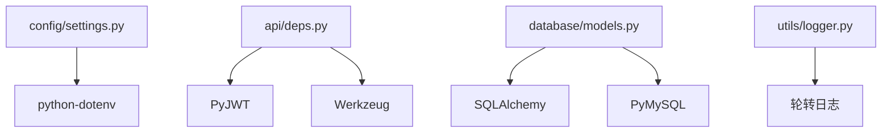

# 环境配置

<cite>
**本文引用的文件**
- [settings.py](file://backpack_quant_trading/config/settings.py)
- [requirements.txt](file://backpack_quant_trading/requirements.txt)
- [main.py](file://backpack_quant_trading/main.py)
- [run_api.py](file://backpack_quant_trading/run_api.py)
- [api/main.py](file://backpack_quant_trading/api/main.py)
- [api/deps.py](file://backpack_quant_trading/api/deps.py)
- [database/models.py](file://backpack_quant_trading/database/models.py)
- [utils/logger.py](file://backpack_quant_trading/utils/logger.py)
- [webhook_service.py](file://backpack_quant_trading/webhook_service.py)
</cite>

## 目录
1. [简介](#简介)
2. [项目结构](#项目结构)
3. [核心组件](#核心组件)
4. [架构总览](#架构总览)
5. [详细组件分析](#详细组件分析)
6. [依赖分析](#依赖分析)
7. [性能考虑](#性能考虑)
8. [故障排查指南](#故障排查指南)
9. [结论](#结论)
10. [附录](#附录)

## 简介
本文件系统性阐述本项目的环境配置体系，涵盖以下方面：
- 环境变量的设置方法与优先级
- 配置文件加载机制与覆盖规则
- 开发、测试、生产三类环境的配置差异与切换策略
- 敏感信息保护与密钥轮换的最佳实践
- 配置验证与调试方法

目标是帮助开发者在不同环境中正确、安全地部署与运行系统。

## 项目结构
围绕环境配置的关键文件与职责如下：
- 配置入口与加载：config/settings.py
- 运行入口与模式：main.py、run_api.py
- API 服务与依赖注入：api/main.py、api/deps.py
- 数据库与日志：database/models.py、utils/logger.py
- Webhook 交易与动态环境变量：webhook_service.py
- 依赖声明：requirements.txt

**图示来源**
- [settings.py:1-137](file://backpack_quant_trading/config/settings.py#L1-L137)
- [main.py:1-344](file://backpack_quant_trading/main.py#L1-L344)
- [api/main.py:1-98](file://backpack_quant_trading/api/main.py#L1-L98)
- [api/deps.py:1-73](file://backpack_quant_trading/api/deps.py#L1-L73)
- [database/models.py:1-721](file://backpack_quant_trading/database/models.py#L1-L721)
- [utils/logger.py:1-180](file://backpack_quant_trading/utils/logger.py#L1-L180)
- [run_api.py:1-32](file://backpack_quant_trading/run_api.py#L1-L32)
- [requirements.txt:1-61](file://backpack_quant_trading/requirements.txt#L1-L61)

**章节来源**
- [settings.py:1-137](file://backpack_quant_trading/config/settings.py#L1-L137)
- [main.py:1-344](file://backpack_quant_trading/main.py#L1-L344)
- [api/main.py:1-98](file://backpack_quant_trading/api/main.py#L1-L98)
- [api/deps.py:1-73](file://backpack_quant_trading/api/deps.py#L1-L73)
- [database/models.py:1-721](file://backpack_quant_trading/database/models.py#L1-L721)
- [utils/logger.py:1-180](file://backpack_quant_trading/utils/logger.py#L1-L180)
- [run_api.py:1-32](file://backpack_quant_trading/run_api.py#L1-L32)
- [requirements.txt:1-61](file://backpack_quant_trading/requirements.txt#L1-L61)

## 核心组件
- 配置加载与合并
  - 在配置模块中，通过环境变量加载与默认值合并的方式统一管理各子系统配置。
  - 特别地，数据库密码在未设置时会被赋予默认值，随后再加载 .env 文件，避免被空值覆盖。
- 全局配置对象
  - 提供统一的 Config 实例，集中管理各子配置类与项目根目录、数据与日志目录。
- 应用入口与模式
  - main.py 支持回测与实盘两种模式，运行时根据参数选择策略与交易所实现。
  - run_api.py 用于开发模式启动 FastAPI 服务，并设置部分运行时开关。
- API 与依赖注入
  - api/main.py 注册路由并挂载静态资源。
  - api/deps.py 从环境变量读取 JWT 密钥等安全配置。
- 数据库与日志
  - database/models.py 通过全局配置生成数据库连接字符串与连接池参数。
  - utils/logger.py 提供多文件轮转的日志系统，确保生产可用性。
- Webhook 动态配置
  - webhook_service.py 在运行时临时设置特定环境变量以驱动引擎行为。

**章节来源**
- [settings.py:104-137](file://backpack_quant_trading/config/settings.py#L104-L137)
- [main.py:289-344](file://backpack_quant_trading/main.py#L289-L344)
- [run_api.py:9-32](file://backpack_quant_trading/run_api.py#L9-L32)
- [api/deps.py:11-14](file://backpack_quant_trading/api/deps.py#L11-L14)
- [database/models.py:267-287](file://backpack_quant_trading/database/models.py#L267-L287)
- [utils/logger.py:57-125](file://backpack_quant_trading/utils/logger.py#L57-L125)
- [webhook_service.py:178-210](file://backpack_quant_trading/webhook_service.py#L178-L210)

## 架构总览
环境配置在系统中的交互流程如下：

**图示来源**
- [settings.py:6-9](file://backpack_quant_trading/config/settings.py#L6-L9)
- [settings.py:104-137](file://backpack_quant_trading/config/settings.py#L104-L137)
- [main.py:11](file://backpack_quant_trading/main.py#L11)
- [api/main.py:1-98](file://backpack_quant_trading/api/main.py#L1-L98)
- [api/deps.py:11-14](file://backpack_quant_trading/api/deps.py#L11-L14)
- [database/models.py:267-287](file://backpack_quant_trading/database/models.py#L267-L287)
- [utils/logger.py:57-125](file://backpack_quant_trading/utils/logger.py#L57-L125)

## 详细组件分析

### 配置加载与优先级
- 加载顺序
  - 仅当数据库密码未设置时，才注入默认值，避免后续 .env 覆盖为空值。
  - 随后加载 .env 文件，override=True 表示 .env 中的值将覆盖已存在的同名环境变量。
- 优先级与覆盖规则
  - 运行时环境变量 > .env 文件 > 程序内默认值。
  - 对于数据库密码，若运行时已设置，则不会被默认值覆盖；随后 .env 可覆盖。
- 关键点
  - 交易所私钥与公钥存在回退逻辑，优先使用更明确的名称，其次回退到备用键名。
  - Webhook 配置包含信号规则阈值等参数，均来自环境变量。

**图示来源**
- [settings.py:6-9](file://backpack_quant_trading/config/settings.py#L6-L9)
- [settings.py:104-137](file://backpack_quant_trading/config/settings.py#L104-L137)

**章节来源**
- [settings.py:6-9](file://backpack_quant_trading/config/settings.py#L6-L9)
- [settings.py:104-137](file://backpack_quant_trading/config/settings.py#L104-L137)

### 配置文件加载机制
- .env 文件
  - 通过 dotenv 库加载，override=True 使 .env 中的值覆盖已存在的环境变量。
  - 项目中未显式提供 .env 示例文件，建议在不同环境维护独立的 .env 文件。
- 运行脚本
  - run_api.py 在开发模式启动 API 服务前设置运行时开关，确保功能可用。
- 应用入口
  - main.py 通过相对导入引入配置模块，保证在不同工作目录下均可正确加载。

**章节来源**
- [settings.py:9](file://backpack_quant_trading/config/settings.py#L9)
- [run_api.py:9-32](file://backpack_quant_trading/run_api.py#L9-L32)
- [main.py:11](file://backpack_quant_trading/main.py#L11)

### 环境切换策略
- 开发环境
  - 使用 run_api.py 启动开发服务器，reload=True，便于热更新。
  - 可通过环境变量调整日志级别与功能开关。
- 测试环境
  - 建议使用独立的 .env 文件，隔离数据库与 API 密钥。
  - 可通过命令行参数覆盖部分全局配置（如杠杆、止盈止损）。
- 生产环境
  - 严格禁止将 .env 或敏感密钥提交至版本库。
  - 使用容器或平台变量注入密钥，确保只读与最小权限。
  - 通过只读文件系统挂载配置，避免运行时修改。

**章节来源**
- [run_api.py:22-28](file://backpack_quant_trading/run_api.py#L22-L28)
- [main.py:197-286](file://backpack_quant_trading/main.py#L197-L286)

### 环境变量清单与用途
- 数据库
  - DB_HOST、DB_PORT、DB_USER、DB_PASSWORD、DB_NAME
- 交易所与链上
  - BACKPACK_*、HYPERLIQUID_*、OSTIUM_*、DEEPCOIN_* 等
- Webhook 与通知
  - WEBHOOK_*、DINGTALK_*、WEBHOOK_HIGH_QTY_*、WEBHOOK_LOW_QTY_RATIO
- 安全与认证
  - JWT_SECRET、WEBHOOK_SECRET
- 运行时开关
  - ENABLE_OKX_TRADE

上述变量在配置模块中通过 os.getenv 读取，不存在时采用默认值。

**章节来源**
- [settings.py:12-137](file://backpack_quant_trading/config/settings.py#L12-L137)
- [api/deps.py:11-14](file://backpack_quant_trading/api/deps.py#L11-L14)

### 配置验证与调试
- 验证步骤
  - 启动应用后，打印当前使用的策略、交易所与交易对，确认配置生效。
  - 检查日志目录是否存在并可写，确认日志轮转正常。
  - 在 API 层面，通过健康检查端点确认服务状态。
- 调试建议
  - 使用较低日志级别观察详细流程。
  - 通过命令行参数覆盖关键风控参数，快速验证策略行为。
  - 对于 Webhook 引擎，可在运行时临时设置环境变量以验证策略参数。

**章节来源**
- [main.py:322-336](file://backpack_quant_trading/main.py#L322-L336)
- [utils/logger.py:57-125](file://backpack_quant_trading/utils/logger.py#L57-L125)
- [api/main.py:51-53](file://backpack_quant_trading/api/main.py#L51-L53)
- [webhook_service.py:196-210](file://backpack_quant_trading/webhook_service.py#L196-L210)

## 依赖分析
- 配置模块依赖 dotenv 以加载 .env 文件。
- API 依赖注入模块依赖 PyJWT 与 Werkzeug 进行安全认证。
- 数据库层依赖 SQLAlchemy 与 PyMySQL，连接字符串由配置模块提供。
- 日志模块依赖标准库与第三方轮转工具，确保生产稳定性。

**图示来源**
- [requirements.txt:32](file://backpack_quant_trading/requirements.txt#L32)
- [api/deps.py:6-7](file://backpack_quant_trading/api/deps.py#L6-L7)
- [database/models.py:1-11](file://backpack_quant_trading/database/models.py#L1-L11)
- [utils/logger.py:5](file://backpack_quant_trading/utils/logger.py#L5)

**章节来源**
- [requirements.txt:1-61](file://backpack_quant_trading/requirements.txt#L1-L61)
- [api/deps.py:6-7](file://backpack_quant_trading/api/deps.py#L6-L7)
- [database/models.py:1-11](file://backpack_quant_trading/database/models.py#L1-L11)
- [utils/logger.py:5](file://backpack_quant_trading/utils/logger.py#L5)

## 性能考虑
- 数据库连接池
  - 通过配置模块提供的连接池参数，减少连接建立开销，提升并发性能。
- 日志轮转
  - 使用按大小轮转与时间轮转相结合的策略，避免单文件过大影响 IO。
- API 跨域与静态资源
  - 在开发模式下挂载前端静态资源，减少额外反向代理开销。

**章节来源**
- [database/models.py:267-287](file://backpack_quant_trading/database/models.py#L267-L287)
- [utils/logger.py:97-123](file://backpack_quant_trading/utils/logger.py#L97-L123)
- [api/main.py:56-97](file://backpack_quant_trading/api/main.py#L56-L97)

## 故障排查指南
- 环境变量未生效
  - 确认 .env 文件路径与内容正确，override=True 会覆盖已有环境变量。
  - 检查运行时是否设置了相同键名的环境变量，其优先级更高。
- 数据库连接失败
  - 核对 DB_HOST、DB_PORT、DB_USER、DB_PASSWORD、DB_NAME 是否完整。
  - 检查连接池参数与防火墙设置。
- JWT 认证失败
  - 确认 JWT_SECRET 是否设置，且与前端/客户端一致。
- 日志无法写入
  - 检查日志目录权限与磁盘空间，确认轮转逻辑未被阻塞。
- Webhook 引擎参数无效
  - 确认运行时临时设置的环境变量是否在引擎初始化前被读取。

**章节来源**
- [settings.py:6-9](file://backpack_quant_trading/config/settings.py#L6-L9)
- [database/models.py:267-287](file://backpack_quant_trading/database/models.py#L267-L287)
- [api/deps.py:11-14](file://backpack_quant_trading/api/deps.py#L11-L14)
- [utils/logger.py:57-125](file://backpack_quant_trading/utils/logger.py#L57-L125)
- [webhook_service.py:196-210](file://backpack_quant_trading/webhook_service.py#L196-L210)

## 结论
本项目的环境配置体系以配置模块为核心，结合 .env 文件与运行时环境变量，实现了灵活的加载与覆盖机制。通过严格的优先级与默认值策略，以及对敏感信息的分层管理，能够在开发、测试与生产环境中稳定运行。建议在生产中进一步强化密钥管理与审计，确保配置变更的可追溯性与安全性。

## 附录
- 环境变量安全最佳实践
  - 使用平台变量或密钥管理服务注入敏感信息，不在代码或 .env 中硬编码。
  - 定期轮换密钥与令牌，缩短有效期，限制作用域。
  - 对 .env 与日志文件实施最小权限访问控制。
  - 在 CI/CD 中使用受控的密钥注入流程，避免明文泄露。
- 配置验证清单
  - 确认所有必需环境变量均已设置。
  - 在本地与测试环境验证数据库连接与 API 认证。
  - 通过健康检查与日志输出确认服务状态。