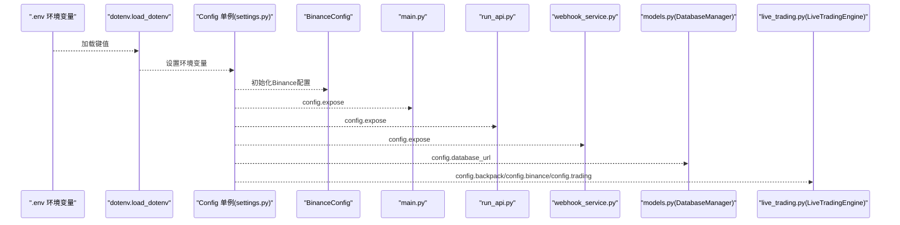
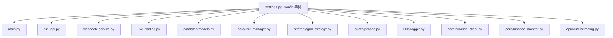

# 配置管理

<cite>
**本文引用的文件**
- [settings.py](file://backpack_quant_trading/config/settings.py)
- [main.py](file://backpack_quant_trading/main.py)
- [run_api.py](file://backpack_quant_trading/run_api.py)
- [webhook_service.py](file://backpack_quant_trading/webhook_service.py)
- [models.py](file://backpack_quant_trading/database/models.py)
- [live_trading.py](file://backpack_quant_trading/engine/live_trading.py)
- [risk_manager.py](file://backpack_quant_trading/core/risk_manager.py)
- [base.py](file://backpack_quant_trading/strategy/base.py)
- [grid_strategy.py](file://backpack_quant_trading/strategy/grid_strategy.py)
- [logger.py](file://backpack_quant_trading/utils/logger.py)
- [requirements.txt](file://backpack_quant_trading/requirements.txt)
- [binance_client.py](file://backpack_quant_trading/core/binance_client.py)
- [binance_monitor.py](file://backpack_quant_trading/core/binance_monitor.py)
- [trading.py](file://backpack_quant_trading/api/routers/trading.py)
</cite>

## 更新摘要
**变更内容**
- 新增Binance交易所配置管理，包括API凭证和交易参数环境变量
- 扩展配置中心以支持Binance USD-M合约交易
- 增强API路由以支持Binance平台的动态配置注入
- 新增Binance客户端和监控模块的配置集成

## 目录
1. [简介](#简介)
2. [项目结构](#项目结构)
3. [核心组件](#核心组件)
4. [架构总览](#架构总览)
5. [详细组件分析](#详细组件分析)
6. [依赖分析](#依赖分析)
7. [性能考虑](#性能考虑)
8. [故障排查指南](#故障排查指南)
9. [结论](#结论)
10. [附录](#附录)

## 简介
本文件系统性阐述本项目的配置管理体系，涵盖环境配置、交易所配置、策略参数配置与数据库配置的结构、参数含义与修改方法，并对比生产与开发环境差异、安全与性能优化要点，提供配置验证方法与常见错误排查流程，以及配置迁移与版本管理最佳实践。

**更新** 本版本新增了对Binance交易所的完整配置支持，包括API凭证管理和交易参数配置。

## 项目结构
项目采用"配置中心 + 多模块共享"的结构：配置集中在 config/settings.py，通过模块级单例 config 暴露给各子系统（引擎、策略、数据库、Webhook 等）。日志、数据库、实盘引擎、风控等模块均通过 config 读取统一配置。

```mermaid
graph TB
subgraph "配置层"
CFG["Config 单例<br/>settings.py"]
ENV[".env 环境变量<br/>python-dotenv"]
BINANCE_CFG["BinanceConfig<br/>API凭证与参数"]
END
subgraph "应用层"
MAIN["主程序 main.py"]
API["API 启动 run_api.py"]
WEBHOOK["Webhook 服务 webhook_service.py"]
END
subgraph "引擎与策略"
LIVE["实盘引擎 live_trading.py"]
GRID["网格策略 grid_strategy.py"]
STRAT_BASE["策略基类 base.py"]
RISK["风控 risk_manager.py"]
END
subgraph "基础设施"
DB["数据库 models.py"]
LOG["日志 logger.py"]
BINANCE_CLIENT["Binance 客户端<br/>binance_client.py"]
BINANCE_MONITOR["Binance 监控<br/>binance_monitor.py"]
END
ENV --> CFG
CFG --> BINANCE_CFG
CFG --> MAIN
CFG --> API
CFG --> WEBHOOK
CFG --> LIVE
CFG --> GRID
CFG --> STRAT_BASE
CFG --> RISK
CFG --> DB
CFG --> LOG
CFG --> BINANCE_CLIENT
CFG --> BINANCE_MONITOR
```

**图表来源**
- [settings.py:91-100](file://backpack_quant_trading/config/settings.py#L91-L100)
- [binance_client.py:72-82](file://backpack_quant_trading/core/binance_client.py#L72-L82)
- [binance_monitor.py:1-22](file://backpack_quant_trading/core/binance_monitor.py#L1-L22)

**章节来源**
- [settings.py:91-100](file://backpack_quant_trading/config/settings.py#L91-L100)
- [binance_client.py:72-82](file://backpack_quant_trading/core/binance_client.py#L72-L82)
- [binance_monitor.py:1-22](file://backpack_quant_trading/core/binance_monitor.py#L1-L22)

## 核心组件
- 配置中心 Config 单例：统一管理交易所、数据库、交易、Webhook、深度币配置等，同时提供项目根目录、数据与日志目录。
- **新增** Binance配置：支持USD-M合约交易的API凭证、杠杆倍数、保证金模式等参数。
- 交易所配置：Backpack、Hyperliquid、Ostium、Deepcoin、**新增**Binance 等，包含 REST/WS 地址、认证参数、代理等。
- 数据库配置：主机、端口、用户、密码、库名、连接池大小与溢出。
- 交易配置：最大仓位比例、日最大亏损、最大回撤、止损止盈开关与阈值、无风险利率、杠杆等。
- Webhook 配置：服务监听地址与端口、签名密钥、钉钉机器人配置、信号规则阈值等。
- 日志与数据目录：自动创建 data 与 log 目录，提供多种日志处理器与轮转策略。

**章节来源**
- [settings.py:91-100](file://backpack_quant_trading/config/settings.py#L91-L100)
- [settings.py:124-132](file://backpack_quant_trading/config/settings.py#L124-L132)
- [settings.py:132](file://backpack_quant_trading/config/settings.py#L132)

## 架构总览
配置在启动阶段通过 python-dotenv 从 .env 加载环境变量，随后由 Config 单例聚合为强类型的配置对象，供各模块按需读取。实盘引擎、Webhook 服务、数据库管理器、策略与风控模块均以只读方式消费配置。



**图表来源**
- [settings.py:6-9](file://backpack_quant_trading/config/settings.py#L6-L9)
- [settings.py:115-125](file://backpack_quant_trading/config/settings.py#L115-L125)
- [settings.py:91-100](file://backpack_quant_trading/config/settings.py#L91-L100)

**章节来源**
- [settings.py:6-9](file://backpack_quant_trading/config/settings.py#L6-L9)
- [settings.py:115-125](file://backpack_quant_trading/config/settings.py#L115-L125)
- [settings.py:91-100](file://backpack_quant_trading/config/settings.py#L91-L100)

## 详细组件分析

### 环境配置与 .env 管理
- 加载机制：启动时仅在 DB_PASSWORD 未设置时写入默认值，随后加载 .env，支持 override=True 覆盖已有环境变量。
- 建议：将敏感信息（API Key、Secret、数据库密码）放入 .env，避免硬编码与版本泄露。
- 生产与开发差异：
  - 开发：可使用默认值与本地数据库，便于快速启动。
  - 生产：务必通过环境变量注入真实密钥与生产数据库地址、端口、账号、密码。

**章节来源**
- [settings.py:6-9](file://backpack_quant_trading/config/settings.py#L6-L9)

### 交易所配置
- Backpack：REST/WS 地址、API Key/私钥、Access/Refresh Key、请求窗口。
- Hyperliquid：REST/WS 地址、私钥、代理地址。
- Ostium：RPC、私钥、网络、交易对、杠杆。
- Deepcoin：REST 地址、API Key、Secret、Passphrase、保证金模式、合并/拆分、杠杆。
- **新增** Binance：USD-M 合约接口地址、API Key/Secret、请求窗口、杠杆倍数、保证金模式。

修改方法：
- 通过环境变量覆盖默认值，如 BACKPACK_API_KEY、HYPERLIQUID_PRIVATE_KEY、OSTIUM_RPC_URL、**新增** BINANCE_API_KEY、BINANCE_SECRET_KEY、BINANCE_LEVERAGE 等。
- 实盘引擎 LiveTradingEngine 通过 config.backpack、config.binance 与 config.trading 注入参数。

**章节来源**
- [settings.py:13-31](file://backpack_quant_trading/config/settings.py#L13-L31)
- [settings.py:34-41](file://backpack_quant_trading/config/settings.py#L34-L41)
- [settings.py:68-74](file://backpack_quant_trading/config/settings.py#L68-L74)
- [settings.py:92-101](file://backpack_quant_trading/config/settings.py#L92-L101)
- [settings.py:91-100](file://backpack_quant_trading/config/settings.py#L91-L100)
- [live_trading.py:353-363](file://backpack_quant_trading/engine/live_trading.py#L353-L363)

### Binance配置详解
**新增** Binance配置提供了完整的USD-M合约交易支持：

- **API配置**：API_BASE_URL指向币安Futures API，API_KEY和SECRET_KEY分别存储公钥和私钥
- **认证参数**：RECV_WINDOW设置请求有效窗口为5000ms
- **交易参数**：LEVERAGE默认10倍杠杆，MARGIN_TYPE支持ISOLATED（逐仓）或CROSSED（全仓）
- **环境变量支持**：通过BINANCE_API_KEY、BINANCE_SECRET_KEY、BINANCE_LEVERAGE、BINANCE_MARGIN_TYPE配置

Binance客户端实现：
- 支持HMAC-SHA256签名认证
- 提供REST API和WebSocket接口
- 支持代理访问（解决国内网络限制）
- 实现ExchangeClient协议，兼容其他交易所接口

**章节来源**
- [settings.py:91-100](file://backpack_quant_trading/config/settings.py#L91-L100)
- [binance_client.py:72-109](file://backpack_quant_trading/core/binance_client.py#L72-L109)
- [binance_client.py:118-142](file://backpack_quant_trading/core/binance_client.py#L118-L142)

### 策略参数配置
- 策略基类 BaseStrategy：提供 params 字典用于存放策略参数（如 lookback_period、zscore_threshold、position_size、take_profit_percent、stop_loss_percent 等），可通过 set_parameters 动态更新。
- 实盘入口 main.py：支持命令行覆盖策略参数（position-size、leverage、stop-loss、take-profit），并写入全局 config.trading 以影响风控与下单行为。
- 网格策略 GridTradingStrategy：内置网格参数（价格区间、网格数量、单格投资、杠杆、模式等），并具备边界保护与风控参数（日最大亏损、总亏损上限、最大回撤等）。

修改方法：
- 命令行参数：--position-size、--leverage、--stop-loss、--take-profit。
- 策略内部：通过 set_parameters 或策略构造参数动态调整。

**章节来源**
- [base.py:67-70](file://backpack_quant_trading/strategy/base.py#L67-L70)
- [base.py:170-173](file://backpack_quant_trading/strategy/base.py#L170-L173)
- [main.py:207-220](file://backpack_quant_trading/main.py#L207-L220)
- [main.py:252-277](file://backpack_quant_trading/main.py#L252-L277)
- [grid_strategy.py:41-53](file://backpack_quant_trading/strategy/grid_strategy.py#L41-L53)
- [grid_strategy.py:132-139](file://backpack_quant_trading/strategy/grid_strategy.py#L132-L139)

### 数据库配置
- 连接参数：HOST、PORT、USER、PASSWORD、NAME。
- 连接池：POOL_SIZE、MAX_OVERFLOW。
- URL 生成：database_url 属性拼接 mysql+pymysql:// 用户:密码@主机:端口/库名。
- 使用：DatabaseManager 在 __init__ 中读取 config.database_url、POOL_SIZE、MAX_OVERFLOW，开启 pool_pre_ping 与 echo=False。

修改方法：
- 通过环境变量 DB_HOST、DB_PORT、DB_USER、DB_PASSWORD、DB_NAME 覆盖默认值。
- 生产环境建议使用独立数据库实例，合理设置连接池参数以平衡并发与资源消耗。

**章节来源**
- [settings.py:44-52](file://backpack_quant_trading/config/settings.py#L44-L52)
- [settings.py:124-130](file://backpack_quant_trading/config/settings.py#L124-L130)
- [models.py:267-287](file://backpack_quant_trading/database/models.py#L267-L287)

### Webhook 配置与服务
- 配置项：SECRET、HOST、PORT、DINGTALK_TOKEN、DINGTALK_SECRET、信号规则阈值（HIGH_QTY_MIN/HIGH_QTY_MAX/LOW_QTY_RATIO）。
- 服务：FastAPI 应用，支持注册/注销实例、查询余额、接收 TradingView Webhook、广播模式、签名验证、动态更新配置等。
- 安全：签名验证（HMAC-SHA256），未配置密钥时默认跳过校验（不推荐）。

修改方法：
- 通过环境变量 WEBHOOK_SECRET、WEBHOOK_HOST、WEBHOOK_PORT 等覆盖默认值。
- 运行 run_api.py 启动开发模式服务。

**章节来源**
- [settings.py:78-89](file://backpack_quant_trading/config/settings.py#L78-L89)
- [webhook_service.py:14-24](file://backpack_quant_trading/webhook_service.py#L14-L24)
- [webhook_service.py:34-46](file://backpack_quant_trading/webhook_service.py#L34-L46)
- [run_api.py:22-28](file://backpack_quant_trading/run_api.py#L22-L28)

### 日志与数据/日志目录
- 目录：项目根/data 与 /log，启动时自动创建。
- 日志：控制台与多文件处理器（交易、错误、通用），Windows 下使用 SafeRotatingFileHandler 避免权限问题。
- 实盘引擎：余额缓存 TTL 600 秒，减少 API 调用频率。

**章节来源**
- [settings.py:115-122](file://backpack_quant_trading/config/settings.py#L115-L122)
- [logger.py:57-125](file://backpack_quant_trading/utils/logger.py#L57-L125)
- [live_trading.py:408-442](file://backpack_quant_trading/engine/live_trading.py#L408-L442)

### 风控与交易参数
- 风控：最大仓位比例、日最大亏损、最大回撤、止损开关、止损/止盈阈值、杠杆、无风险利率。
- 风控模块：RiskManager 根据 config.trading 计算仓位、检查风险、记录风险事件、生成风险报告。
- 实盘引擎：根据 config.trading.LEVERAGE 与策略参数执行下单与止盈止损。

**章节来源**
- [settings.py:55-64](file://backpack_quant_trading/config/settings.py#L55-L64)
- [risk_manager.py:48-53](file://backpack_quant_trading/core/risk_manager.py#L48-L53)
- [risk_manager.py:132-229](file://backpack_quant_trading/core/risk_manager.py#L132-L229)
- [live_trading.py:353-363](file://backpack_quant_trading/engine/live_trading.py#L353-L363)

## 依赖分析
配置模块与其他模块的耦合关系如下：



**图表来源**
- [settings.py:115-125](file://backpack_quant_trading/config/settings.py#L115-L125)
- [binance_client.py:20](file://backpack_quant_trading/core/binance_client.py#L20)
- [binance_monitor.py:20](file://backpack_quant_trading/core/binance_monitor.py#L20)
- [trading.py:737-739](file://backpack_quant_trading/api/routers/trading.py#L737-L739)

**章节来源**
- [settings.py:115-125](file://backpack_quant_trading/config/settings.py#L115-L125)
- [binance_client.py:20](file://backpack_quant_trading/core/binance_client.py#L20)
- [binance_monitor.py:20](file://backpack_quant_trading/core/binance_monitor.py#L20)
- [trading.py:737-739](file://backpack_quant_trading/api/routers/trading.py#L737-L739)

## 性能考虑
- 连接池与超时：数据库连接池大小与溢出、WebSocket 连接超时与指数退避重试、余额缓存 TTL。
- 限流与熔断：Webhook 429 频率限制熔断、网格策略下单间隔与冷却。
- 日志轮转：Windows 安全文件处理器避免权限冲突，按大小轮转。
- **新增** Binance性能优化：代理支持、请求限流、批量数据获取、连接复用。

**章节来源**
- [models.py:270-277](file://backpack_quant_trading/database/models.py#L270-L277)
- [live_trading.py:153-235](file://backpack_quant_trading/engine/live_trading.py#L153-L235)
- [live_trading.py:408-442](file://backpack_quant_trading/engine/live_trading.py#L408-L442)
- [logger.py:10-55](file://backpack_quant_trading/utils/logger.py#L10-L55)
- [webhook_service.py:472-498](file://backpack_quant_trading/webhook_service.py#L472-L498)
- [grid_strategy.py:425-427](file://backpack_quant_trading/strategy/grid_strategy.py#L425-L427)
- [binance_client.py:87-97](file://backpack_quant_trading/core/binance_client.py#L87-L97)

## 故障排查指南
- 配置未生效
  - 检查 .env 是否存在且键名正确；确认 dotenv 加载顺序与 override 行为。
- 数据库连接失败
  - 核对 HOST/PORT/USER/PASSWORD/NAME；检查连接池参数；确认 MySQL 服务可达。
- Webhook 签名失败
  - 确认 X-Signature 头与 SECRET 一致；生产环境务必配置 SECRET。
- 实盘 WebSocket 连接异常
  - 检查 WS_BASE_URL、代理设置与 websockets 版本；关注指数退避与重连逻辑。
- 策略参数未生效
  - 确认命令行参数传入顺序与覆盖逻辑；检查策略 params 是否被 set_parameters 更新。
- **新增** Binance配置问题
  - 确认BINANCE_API_KEY和BINANCE_SECRET_KEY环境变量设置正确
  - 检查网络代理设置是否影响币安API访问
  - 验证LEVERAGE和MARGIN_TYPE参数是否符合币安要求

**章节来源**
- [settings.py:6-9](file://backpack_quant_trading/config/settings.py#L6-L9)
- [settings.py:44-52](file://backpack_quant_trading/config/settings.py#L44-L52)
- [settings.py:78-89](file://backpack_quant_trading/config/settings.py#L78-L89)
- [live_trading.py:153-235](file://backpack_quant_trading/engine/live_trading.py#L153-L235)
- [main.py:207-220](file://backpack_quant_trading/main.py#L207-L220)
- [base.py:170-173](file://backpack_quant_trading/strategy/base.py#L170-L173)
- [binance_client.py:87-97](file://backpack_quant_trading/core/binance_client.py#L87-L97)

## 结论
本项目的配置体系以 Config 单例为核心，结合 .env 环境变量与模块化配置类，实现了对交易所、数据库、交易、Webhook、日志与策略参数的统一管理。**新增的Binance配置扩展进一步完善了多交易所支持，通过完整的API凭证管理和交易参数配置，为USD-M合约交易提供了专业级的配置解决方案。**通过严格的参数覆盖与只读消费模式，保证了在不同环境（开发/生产）下的灵活性与安全性。配合风控、日志与连接池等性能优化手段，可在保证稳定性的同时提升运行效率。

## 附录

### 配置验证方法
- 启动后打印配置摘要：主程序与 Webhook 服务均会输出当前配置摘要，便于核对。
- 数据库连接验证：DatabaseManager.create_tables 可用于快速验证连接与权限。
- **新增** Binance配置验证：通过BinanceAPIClient.ping()测试API连通性
- **新增** Binance数据获取验证：使用fetch_binance_klines()获取K线数据验证API工作正常

**章节来源**
- [main.py:322-331](file://backpack_quant_trading/main.py#L322-L331)
- [webhook_service.py:563-567](file://backpack_quant_trading/webhook_service.py#L563-L567)
- [models.py:285-287](file://backpack_quant_trading/database/models.py#L285-L287)
- [binance_client.py:600-607](file://backpack_quant_trading/core/binance_client.py#L600-L607)
- [binance_monitor.py:168-196](file://backpack_quant_trading/core/binance_monitor.py#L168-L196)

### 生产与开发环境差异清单
- 数据库：开发使用本地默认值，生产使用独立实例与强密码。
- 交易所密钥：开发可使用示例值，生产必须使用真实密钥。
- Webhook：开发可跳过签名验证，生产必须启用并配置 SECRET。
- 日志：生产建议开启文件轮转与错误级别日志。
- **新增** Binance：开发可使用测试API，生产必须使用正式API密钥和正确的网络配置。

**章节来源**
- [settings.py:44-52](file://backpack_quant_trading/config/settings.py#L44-L52)
- [settings.py:78-89](file://backpack_quant_trading/config/settings.py#L78-L89)
- [logger.py:57-125](file://backpack_quant_trading/utils/logger.py#L57-L125)
- [settings.py:91-100](file://backpack_quant_trading/config/settings.py#L91-L100)

### 安全配置最佳实践
- 敏感信息：仅通过 .env 与环境变量注入，不在代码中硬编码。
- Webhook：始终配置 SECRET 并启用签名验证。
- 数据库：使用专用账号与最小权限原则，定期轮换密码。
- **新增** Binance安全：API密钥严格保密，使用独立的API密钥进行交易，启用IP白名单，定期轮换密钥。

**章节来源**
- [settings.py:6-9](file://backpack_quant_trading/config/settings.py#L6-L9)
- [webhook_service.py:34-46](file://backpack_quant_trading/webhook_service.py#L34-L46)
- [models.py:270-277](file://backpack_quant_trading/database/models.py#L270-L277)
- [binance_client.py:118-142](file://backpack_quant_trading/core/binance_client.py#L118-L142)

### 性能优化配置建议
- 连接池：根据并发与数据库承载能力调整 POOL_SIZE 与 MAX_OVERFLOW。
- WebSocket：合理设置 ping_interval/ping_timeout/open_timeout，启用指数退避。
- 日志：按大小轮转，避免过多磁盘 IO；生产环境减少 DEBUG 级别日志量。
- **新增** Binance性能：合理设置RECV_WINDOW，使用代理减少延迟，优化批量数据获取策略。

**章节来源**
- [models.py:270-277](file://backpack_quant_trading/database/models.py#L270-L277)
- [live_trading.py:184-197](file://backpack_quant_trading/engine/live_trading.py#L184-L197)
- [logger.py:10-55](file://backpack_quant_trading/utils/logger.py#L10-L55)
- [binance_client.py:87-97](file://backpack_quant_trading/core/binance_client.py#L87-L97)

### 配置迁移与版本管理最佳实践
- 版本控制：将默认配置纳入仓库，敏感配置放入 .env（不在版本库中）。
- 迁移策略：新增配置项时保持向后兼容，提供默认值；对破坏性变更通过环境变量强制覆盖。
- **新增** Binance配置迁移：确保现有策略能够无缝切换到Binance平台，提供平台间配置映射。

**章节来源**
- [requirements.txt:31-32](file://backpack_quant_trading/requirements.txt#L31-L32)
- [settings.py:6-9](file://backpack_quant_trading/config/settings.py#L6-L9)
- [settings.py:91-100](file://backpack_quant_trading/config/settings.py#L91-L100)

### Binance配置环境变量参考
**新增** 完整的Binance配置环境变量列表：

- BINANCE_API_KEY：币安API公钥
- BINANCE_SECRET_KEY：币安API私钥  
- BINANCE_API_SECRET：币安API私钥（备用）
- BINANCE_LEVERAGE：默认杠杆倍数（默认10）
- BINANCE_MARGIN_TYPE：保证金模式（ISOLATED/CROSSED，默认ISOLATED）

**章节来源**
- [settings.py:94-99](file://backpack_quant_trading/config/settings.py#L94-L99)
- [trading.py:737-739](file://backpack_quant_trading/api/routers/trading.py#L737-L739)