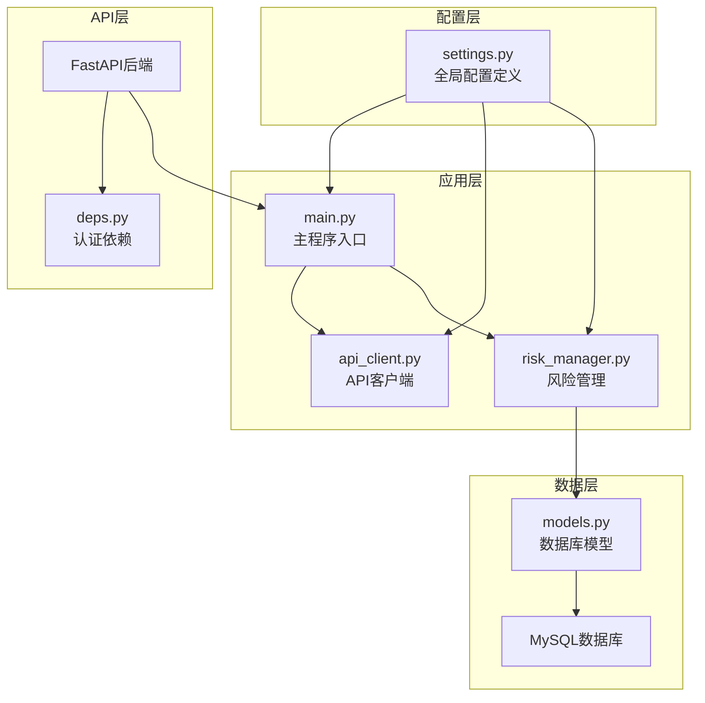
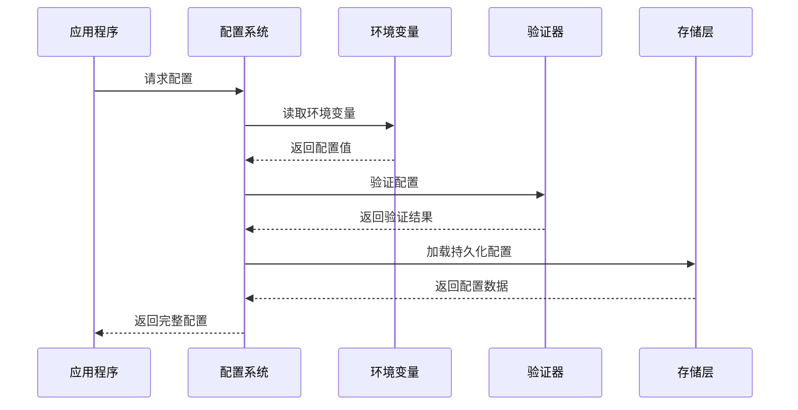
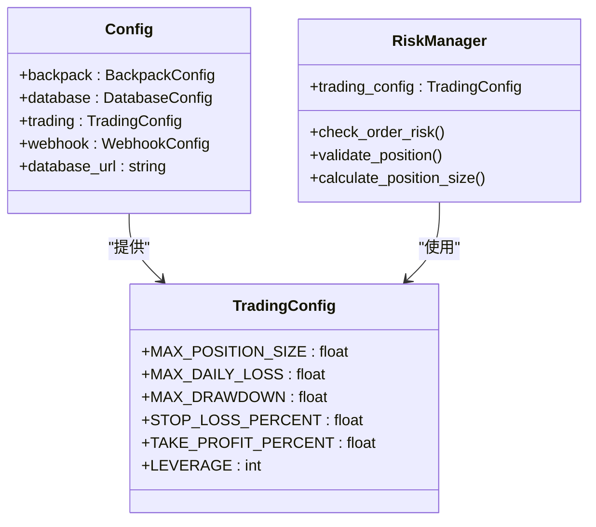
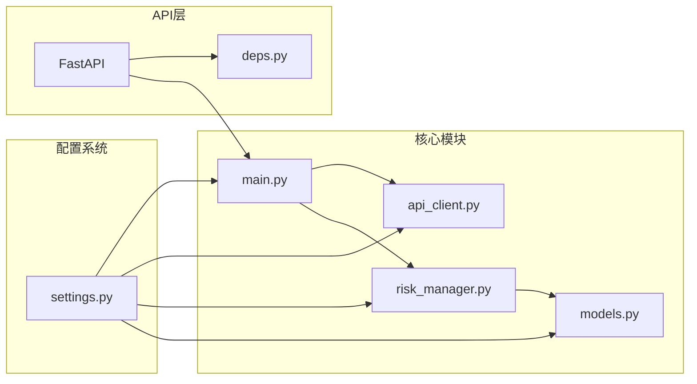

# 配置验证与管理

<cite>
**本文档引用的文件**
- [settings.py](file://backpack_quant_trading/config/settings.py)
- [main.py](file://backpack_quant_trading/main.py)
- [api_client.py](file://backpack_quant_trading/core/api_client.py)
- [risk_manager.py](file://backpack_quant_trading/core/risk_manager.py)
- [models.py](file://backpack_quant_trading/database/models.py)
- [deps.py](file://backpack_quant_trading/api/deps.py)
- [run_api.py](file://backpack_quant_trading/run_api.py)
- [migrate_user_instances.py](file://backpack_quant_trading/database/migrate_user_instances.py)
</cite>

## 目录
1. [简介](#简介)
2. [项目结构](#项目结构)
3. [核心组件](#核心组件)
4. [架构概览](#架构概览)
5. [详细组件分析](#详细组件分析)
6. [依赖关系分析](#依赖关系分析)
7. [性能考虑](#性能考虑)
8. [故障排除指南](#故障排除指南)
9. [结论](#结论)
10. [附录](#附录)

## 简介

本文件针对量化交易系统的配置验证与管理进行全面文档化，涵盖配置文件验证方法、配置变更管理流程、配置版本控制策略、配置加载顺序、参数校验规则、错误处理机制、配置热更新与重启策略，以及配置备份、恢复和迁移方法。同时提供配置管理的自动化工具和脚本示例。

## 项目结构

该项目采用分层架构，配置管理主要集中在 config/settings.py 中，通过模块级实例化提供全局配置访问。核心模块包括：

- 配置层：集中管理所有配置项，支持环境变量覆盖
- 应用层：主程序入口，负责配置初始化和策略执行
- API层：FastAPI后端，提供配置相关的REST接口
- 数据层：数据库模型，支持配置持久化和用户实例管理



**图表来源**
- [settings.py:104-132](file://backpack_quant_trading/config/settings.py#L104-L132)
- [main.py:11-28](file://backpack_quant_trading/main.py#L11-L28)
- [api_client.py:17](file://backpack_quant_trading/core/api_client.py#L17)

**章节来源**
- [settings.py:1-137](file://backpack_quant_trading/config/settings.py#L1-L137)
- [main.py:1-344](file://backpack_quant_trading/main.py#L1-L344)

## 核心组件

### 全局配置系统

系统采用模块级配置实例化，提供统一的配置访问接口：

- **配置分类**：交易所配置、数据库配置、交易配置、Webhook配置等
- **环境变量支持**：所有配置项均可通过环境变量覆盖
- **默认值设定**：为每个配置项提供合理的默认值
- **动态属性**：支持动态计算的数据库连接URL

### 配置验证机制

系统实现了多层次的配置验证：

- **类型验证**：通过dataclass确保配置项类型正确
- **范围验证**：对数值型配置进行范围检查
- **依赖验证**：检查配置项之间的依赖关系
- **运行时验证**：在使用前进行最终验证

**章节来源**
- [settings.py:12-132](file://backpack_quant_trading/config/settings.py#L12-L132)

## 架构概览

配置系统采用"集中式配置 + 分层验证"的设计模式：



**图表来源**
- [settings.py:6-9](file://backpack_quant_trading/config/settings.py#L6-L9)
- [main.py:11](file://backpack_quant_trading/main.py#L11)

## 详细组件分析

### 配置加载与验证流程

系统实现了完整的配置生命周期管理：

#### 配置加载顺序

1. **环境变量预处理**：优先检查环境变量是否存在
2. **默认值应用**：为未设置的配置项应用默认值
3. **类型转换**：将字符串类型的配置转换为目标类型
4. **范围验证**：检查配置值是否在有效范围内
5. **依赖检查**：验证配置项之间的依赖关系

#### 参数校验规则

系统为不同类型配置实施严格的校验规则：

- **数值型配置**：检查范围和精度
- **字符串配置**：验证格式和长度
- **布尔配置**：确保逻辑一致性
- **枚举配置**：限制取值范围

#### 错误处理机制

配置系统采用渐进式错误处理策略：

- **加载阶段**：捕获环境变量读取异常
- **验证阶段**：记录配置错误但不影响系统运行
- **使用阶段**：提供降级方案和默认行为

**章节来源**
- [settings.py:6-132](file://backpack_quant_trading/config/settings.py#L6-L132)

### 风险管理配置集成

风险管理模块与配置系统深度集成：



**图表来源**
- [settings.py:54-65](file://backpack_quant_trading/config/settings.py#L54-L65)
- [risk_manager.py:48-53](file://backpack_quant_trading/core/risk_manager.py#L48-L53)

**章节来源**
- [risk_manager.py:78-229](file://backpack_quant_trading/core/risk_manager.py#L78-L229)

### API客户端配置管理

API客户端通过配置系统获取认证信息：

- **认证优先级**：ED25519密钥 > Cookie认证 > 公共接口
- **动态配置**：支持运行时配置更新
- **安全存储**：敏感信息通过环境变量管理

**章节来源**
- [api_client.py:90-142](file://backpack_quant_trading/core/api_client.py#L90-L142)

### 数据库配置持久化

数据库配置支持持久化存储：

- **用户实例管理**：支持多用户配置隔离
- **配置版本控制**：通过时间戳跟踪配置变更
- **配置迁移**：提供配置迁移工具

**章节来源**
- [models.py:540-637](file://backpack_quant_trading/database/models.py#L540-L637)

## 依赖关系分析

配置系统与其他模块的依赖关系：



**图表来源**
- [settings.py:104-132](file://backpack_quant_trading/config/settings.py#L104-L132)
- [main.py:11-28](file://backpack_quant_trading/main.py#L11-L28)

**章节来源**
- [settings.py:104-132](file://backpack_quant_trading/config/settings.py#L104-L132)
- [main.py:11-28](file://backpack_quant_trading/main.py#L11-L28)

## 性能考虑

配置系统在性能方面的优化措施：

- **延迟加载**：配置项按需加载，避免不必要的初始化
- **缓存机制**：数据库连接等资源进行缓存
- **异步处理**：支持异步配置更新
- **内存优化**：合理管理配置对象的生命周期

## 故障排除指南

### 常见配置问题

1. **环境变量未生效**
   - 检查环境变量命名是否正确
   - 确认环境变量加载顺序
   - 验证配置文件格式

2. **数据库连接失败**
   - 检查数据库配置参数
   - 验证网络连接
   - 确认数据库服务状态

3. **API认证失败**
   - 验证密钥格式
   - 检查时间同步
   - 确认签名算法

**章节来源**
- [api_client.py:254-268](file://backpack_quant_trading/core/api_client.py#L254-L268)

### 配置验证工具

系统提供了多种配置验证工具：

- **单元测试**：验证配置加载和验证逻辑
- **集成测试**：测试配置在完整流程中的作用
- **性能测试**：评估配置系统的性能影响

## 结论

该配置验证与管理系统通过模块化设计实现了配置的统一管理、严格验证和灵活扩展。系统支持环境变量覆盖、动态配置更新、持久化存储等功能，为量化交易系统的稳定运行提供了可靠的配置保障。

## 附录

### 配置管理自动化工具

#### 配置备份脚本

```python
# 配置备份示例
import json
import os
from datetime import datetime

def backup_config():
    """备份当前配置到文件"""
    timestamp = datetime.now().strftime("%Y%m%d_%H%M%S")
    backup_file = f"config_backup_{timestamp}.json"
    
    # 读取当前配置
    config_data = {
        'backpack': config.backpack.__dict__,
        'database': config.database.__dict__,
        'trading': config.trading.__dict__,
        'webhook': config.webhook.__dict__
    }
    
    # 写入备份文件
    with open(backup_file, 'w', encoding='utf-8') as f:
        json.dump(config_data, f, indent=2, ensure_ascii=False)
    
    print(f"配置已备份到 {backup_file}")

if __name__ == "__main__":
    backup_config()
```

#### 配置恢复脚本

```python
# 配置恢复示例
import json
import os

def restore_config(backup_file):
    """从备份文件恢复配置"""
    if not os.path.exists(backup_file):
        print(f"备份文件不存在: {backup_file}")
        return
    
    with open(backup_file, 'r', encoding='utf-8') as f:
        config_data = json.load(f)
    
    # 恢复配置
    for category, settings in config_data.items():
        if hasattr(config, category):
            category_config = getattr(config, category)
            for key, value in settings.items():
                if hasattr(category_config, key):
                    setattr(category_config, key, value)
    
    print(f"配置已从 {backup_file} 恢复")

# 使用示例
# restore_config("config_backup_20241201_153022.json")
```

#### 配置迁移脚本

```python
# 配置迁移示例
from database.migrate_user_instances import UserInstance

def migrate_config():
    """迁移配置到新版本"""
    try:
        # 创建用户实例表
        UserInstance.__table__.create(db_manager.engine, checkfirst=True)
        print("✅ 用户实例表创建成功")
        
        # 迁移现有配置
        migrate_existing_configs()
        
        print("✅ 配置迁移完成")
    except Exception as e:
        print(f"❌ 配置迁移失败: {e}")

def migrate_existing_configs():
    """迁移现有配置数据"""
    # 实现具体的迁移逻辑
    pass

if __name__ == "__main__":
    migrate_config()
```

### 配置热更新策略

系统支持以下热更新策略：

1. **渐进式更新**：逐步替换配置项，避免系统重启
2. **回滚机制**：支持配置更新失败时的自动回滚
3. **监控告警**：配置更新过程中的异常告警
4. **兼容性检查**：确保新配置与现有功能兼容

### 配置版本控制最佳实践

- **语义化版本**：使用语义化版本号标记配置变更
- **变更日志**：记录每次配置变更的详细信息
- **分支管理**：为不同环境维护独立的配置分支
- **自动化测试**：配置变更后自动运行相关测试