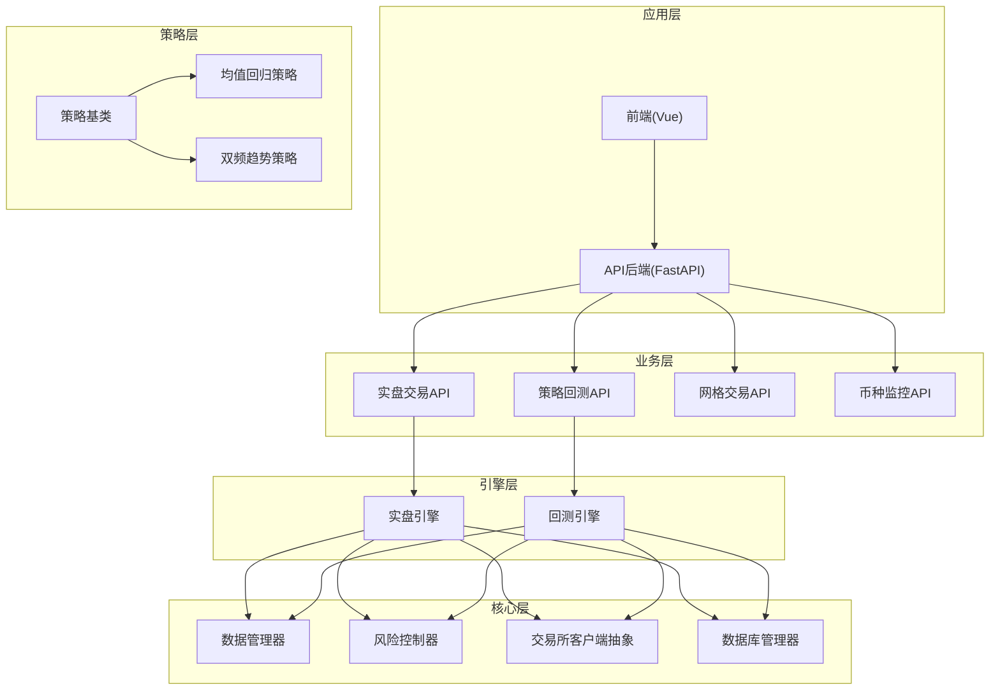
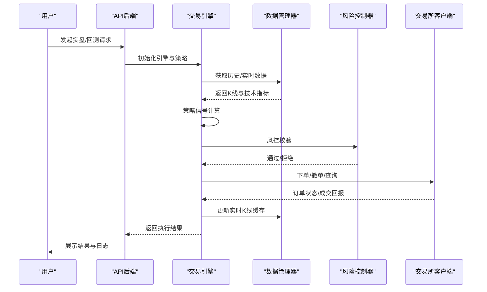
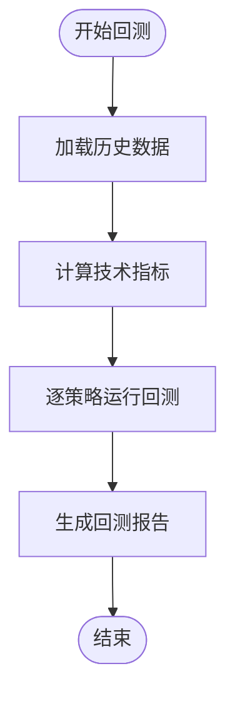
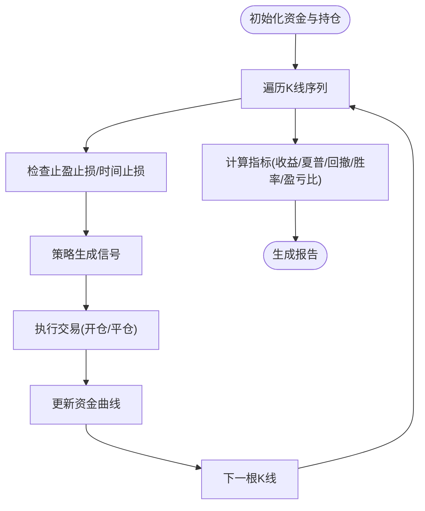
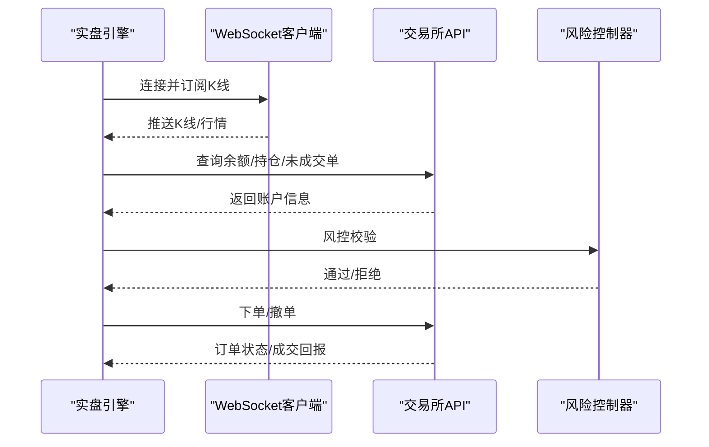

# 项目概述

<cite>
**本文档引用的文件**
- [main.py](file://backpack_quant_trading/main.py)
- [settings.py](file://backpack_quant_trading/config/settings.py)
- [requirements.txt](file://backpack_quant_trading/requirements.txt)
- [backtest.py](file://backpack_quant_trading/engine/backtest.py)
- [live_trading.py](file://backpack_quant_trading/engine/live_trading.py)
- [base.py](file://backpack_quant_trading/strategy/base.py)
- [mean_reversion.py](file://backpack_quant_trading/strategy/mean_reversion.py)
- [dual_freq_trend.py](file://backpack_quant_trading/strategy/dual_freq_trend.py)
- [risk_manager.py](file://backpack_quant_trading/core/risk_manager.py)
- [models.py](file://backpack_quant_trading/database/models.py)
- [trading.py](file://backpack_quant_trading/api/routers/trading.py)
- [strategy.py](file://backpack_quant_trading/api/routers/strategy.py)
- [main.py](file://backpack_quant_trading/api/main.py)
</cite>

## 目录
1. [简介](#简介)
2. [项目结构](#项目结构)
3. [核心组件](#核心组件)
4. [架构总览](#架构总览)
5. [详细组件分析](#详细组件分析)
6. [依赖关系分析](#依赖关系分析)
7. [性能考虑](#性能考虑)
8. [故障排除指南](#故障排除指南)
9. [结论](#结论)

## 简介

Backpack量化交易系统是一个面向多策略、多交易所的自动化量化交易基础设施，支持实盘交易、策略回测、AI实验、网格交易与币种监控等模块化功能。系统采用模块化架构，通过策略基类抽象、数据管理器、风险控制器与引擎层解耦，实现策略开发与部署的高内聚、低耦合。

系统核心目标：
- 提供统一的策略开发框架，支持均值回归、双频趋势共振等经典策略与AI自适应策略
- 支持多交易所接入（Backpack、Deepcoin、Hyperliquid、Ostium），通过抽象客户端实现可插拔扩展
- 提供完整的回测与实盘流水线，涵盖数据获取、信号生成、风控校验、订单执行与风险监控
- 通过Web API与前端界面提供可视化的策略配置、回测报告与实盘监控能力

## 项目结构

项目采用分层与模块化组织方式，核心目录与职责如下：
- backpack_quant_trading/api：FastAPI后端，提供认证、实盘交易、策略回测、网格交易、币种监控等API
- backpack_quant_trading/config：全局配置管理，包含各交易所API配置、交易风控参数与数据库连接
- backpack_quant_trading/core：核心基础设施，包括数据管理、风险控制、API客户端抽象、Websocket客户端等
- backpack_quant_trading/engine：交易引擎层，包含回测引擎与实盘引擎，负责信号执行、订单管理与实时数据流
- backpack_quant_trading/strategy：策略实现层，包含策略基类与多种策略的具体实现
- backpack_quant_trading/database：数据库模型与管理器，持久化订单、成交、持仓、风险事件与策略性能
- backpack_quant_trading/frontend：Vue前端应用，提供策略配置、回测可视化、实盘监控与AI实验界面
- data与log：数据缓存与日志目录

**图表来源**
- [main.py:58-158](file://backpack_quant_trading/main.py#L58-L158)
- [backtest.py:48-187](file://backpack_quant_trading/engine/backtest.py#L48-L187)
- [live_trading.py:347-567](file://backpack_quant_trading/engine/live_trading.py#L347-L567)
- [base.py:41-91](file://backpack_quant_trading/strategy/base.py#L41-L91)

**章节来源**
- [main.py:1-344](file://backpack_quant_trading/main.py#L1-L344)
- [settings.py:104-132](file://backpack_quant_trading/config/settings.py#L104-L132)
- [requirements.txt:1-61](file://backpack_quant_trading/requirements.txt#L1-L61)

## 核心组件

- 交易机器人（TradingBot）
  - 统一入口，负责策略注册、回测调度与实盘引擎初始化
  - 支持多策略、多交易对并行运行
  - 提供回测与实盘模式切换

- 回测引擎（BacktestEngine）
  - 支持多交易对并行回测，内置滑点与手续费模拟
  - 提供标准化回测指标（总收益、年化收益、夏普比率、最大回撤、胜率、盈亏比等）
  - 支持止盈止损与冷却期机制

- 实盘引擎（LiveTradingEngine）
  - WebSocket订阅K线与实时行情，支持多交易所抽象客户端
  - 订单生命周期管理、仓位管理与实时风控
  - 支持Webhook与子进程两种实盘实例管理模式

- 策略基类（BaseStrategy）
  - 定义策略接口：信号生成、平仓判断、参数配置与性能指标
  - 提供通用的仓位更新、盈亏计算与信号生成工具

- 风控管理器（RiskManager）
  - 保证金上限、日度亏损、最大回撤等多维风控
  - VaR与压力测试能力，支持风险事件记录与报告生成

- 数据管理器（DataManager）
  - 历史K线获取与缓存、实时K线增量更新、技术指标计算
  - 支持回测模式下的模拟数据生成

- 数据库管理器（DatabaseManager）
  - 订单、成交、持仓、风险事件、策略性能等表的ORM映射与持久化

**章节来源**
- [main.py:58-158](file://backpack_quant_trading/main.py#L58-L158)
- [backtest.py:48-187](file://backpack_quant_trading/engine/backtest.py#L48-L187)
- [live_trading.py:347-567](file://backpack_quant_trading/engine/live_trading.py#L347-L567)
- [base.py:41-91](file://backpack_quant_trading/strategy/base.py#L41-L91)
- [risk_manager.py:48-230](file://backpack_quant_trading/core/risk_manager.py#L48-L230)
- [models.py:267-496](file://backpack_quant_trading/database/models.py#L267-L496)

## 架构总览

系统采用“策略-引擎-核心-基础设施”分层架构，通过抽象接口实现策略与执行解耦，通过配置中心统一管理各交易所API与风控参数。

**图表来源**
- [live_trading.py:536-567](file://backpack_quant_trading/engine/live_trading.py#L536-L567)
- [backtest.py:65-187](file://backpack_quant_trading/engine/backtest.py#L65-L187)
- [trading.py:310-431](file://backpack_quant_trading/api/routers/trading.py#L310-L431)

## 详细组件分析

### 交易机器人（TradingBot）

- 功能特性
  - 策略注册表：集中管理策略类，便于扩展与切换
  - 交易所注册表：支持Backpack、Deepcoin、Hyperliquid等多交易所抽象
  - 回测流程：批量加载历史数据、计算技术指标、逐条回测并生成报告
  - 实盘流程：初始化实盘引擎、注册策略、订阅WebSocket、回调事件处理

- 关键流程图（回测）

**图表来源**
- [main.py:72-114](file://backpack_quant_trading/main.py#L72-L114)
- [backtest.py:65-187](file://backpack_quant_trading/engine/backtest.py#L65-L187)

**章节来源**
- [main.py:58-158](file://backpack_quant_trading/main.py#L58-L158)

### 回测引擎（BacktestEngine）

- 核心能力
  - 多交易对并行回测，支持预热期、冷却期与滑点/手续费模拟
  - 止盈止损与时间止损的K线内检测，避免超限亏损
  - 标准化指标计算与报告生成

- 指标计算流程

**图表来源**
- [backtest.py:65-187](file://backpack_quant_trading/engine/backtest.py#L65-L187)
- [backtest.py:333-383](file://backpack_quant_trading/engine/backtest.py#L333-L383)

**章节来源**
- [backtest.py:48-187](file://backpack_quant_trading/engine/backtest.py#L48-L187)

### 实盘引擎（LiveTradingEngine）

- 核心能力
  - WebSocket订阅K线与实时行情，支持多交易所抽象客户端
  - 订单生命周期管理、仓位管理与实时风控
  - 支持Webhook与子进程两种实盘实例管理模式

- 实盘流程图

**图表来源**
- [live_trading.py:536-567](file://backpack_quant_trading/engine/live_trading.py#L536-L567)
- [live_trading.py:347-567](file://backpack_quant_trading/engine/live_trading.py#L347-L567)

**章节来源**
- [live_trading.py:347-567](file://backpack_quant_trading/engine/live_trading.py#L347-L567)

### 策略基类与策略实现

- 策略基类（BaseStrategy）
  - 定义信号生成、平仓判断、参数配置与性能指标接口
  - 提供通用的仓位更新、盈亏计算与信号生成工具

- 均值回归策略（MeanReversionStrategy）
  - 基于Z-score与布林带的均值回归信号
  - 支持动态仓位计算与止盈止损设置

- 双频趋势策略（DualFreqTrendResonanceStrategy）
  - 15分钟趋势+1分钟入场的双频共振策略
  - 支持加权评分与分档保证金、时间止损与追踪止盈

**章节来源**
- [base.py:41-91](file://backpack_quant_trading/strategy/base.py#L41-L91)
- [mean_reversion.py:23-117](file://backpack_quant_trading/strategy/mean_reversion.py#L23-L117)
- [dual_freq_trend.py:18-168](file://backpack_quant_trading/strategy/dual_freq_trend.py#L18-L168)

### 风控管理器（RiskManager）

- 风控维度
  - 保证金上限：基于账户资金与最大仓位比例
  - 日度亏损与最大回撤：防止极端行情下的过度损失
  - 止损止盈：基于价格比例或保证金收益%

- 风险评估与报告
  - VaR参数化与历史模拟计算
  - 压力测试场景与恢复时间估计
  - 风险事件记录与推荐策略

**章节来源**
- [risk_manager.py:48-230](file://backpack_quant_trading/core/risk_manager.py#L48-L230)
- [risk_manager.py:331-402](file://backpack_quant_trading/core/risk_manager.py#L331-L402)
- [risk_manager.py:418-466](file://backpack_quant_trading/core/risk_manager.py#L418-L466)

### 数据管理器（DataManager）

- 数据获取与缓存
  - 历史K线获取与缓存、实时K线增量更新
  - 技术指标计算（MA、RSI、MACD、布林带、ATR等）

- 回测模式支持
  - 自动生成模拟K线数据，保证回测一致性与可重复性

**章节来源**
- [backtest.py:405-446](file://backpack_quant_trading/engine/backtest.py#L405-L446)
- [backtest.py:114-167](file://backpack_quant_trading/engine/backtest.py#L114-L167)

### 数据库管理器（DatabaseManager）

- ORM模型
  - 订单、成交、持仓、账户余额、风险事件、策略性能、用户与实例等表

- 持久化流程
  - 订单/成交/持仓的保存与去重
  - 风险事件与组合快照的记录

**章节来源**
- [models.py:267-496](file://backpack_quant_trading/database/models.py#L267-L496)

### API后端与前端集成

- API后端（FastAPI）
  - 实盘交易、策略回测、网格交易、币种监控等路由
  - 用户实例管理、日志获取与Webhook集成

- 前端（Vue）
  - 策略配置、回测可视化、实盘监控与AI实验界面
  - 与后端API的交互与数据展示

**章节来源**
- [main.py:14-98](file://backpack_quant_trading/api/main.py#L14-L98)
- [trading.py:310-431](file://backpack_quant_trading/api/routers/trading.py#L310-L431)
- [strategy.py:328-488](file://backpack_quant_trading/api/routers/strategy.py#L328-L488)

## 依赖关系分析

系统外部依赖主要集中在核心库与交易所集成方面，通过requirements.txt统一管理。

```mermaid
graph TB
Requirements["requirements.txt"]
Async["aiohttp/websockets/requests"]
Web["FastAPI/Uvicorn/Gunicorn"]
Data["pandas/numpy/scipy/dateutil/pytz"]
DB["SQLAlchemy/pymysql"]
Security["cryptography/werkzeug/JWT/passlib"]
Plot["matplotlib/plotly/mplfinance/dash"]
Indicators["ta/numba"]
Exchange["ccxt"]
AShare["akshare"]
ML["lightgbm/sklearn/joblib"]
Web3["web3/eth-account"]
Log["loguru"]
Requirements --> Async
Requirements --> Web
Requirements --> Data
Requirements --> DB
Requirements --> Security
Requirements --> Plot
Requirements --> Indicators
Requirements --> Exchange
Requirements --> AShare
Requirements --> ML
Requirements --> Web3
Requirements --> Log
```

**图表来源**
- [requirements.txt:1-61](file://backpack_quant_trading/requirements.txt#L1-L61)

**章节来源**
- [requirements.txt:1-61](file://backpack_quant_trading/requirements.txt#L1-L61)

## 性能考虑

- 数据缓存与并发
  - 实时K线缓存与TTL控制，减少重复请求
  - 异步WebSocket连接与任务并发，提升实时数据处理效率

- 回测优化
  - 预热期与冷却期减少信号噪声
  - 滑点与手续费模拟贴近真实交易成本

- 风控与资源管理
  - 保证金上限与日度风控，避免过度暴露
  - 数据库连接池与会话管理，降低I/O开销

[本节为通用指导，无需特定文件引用]

## 故障排除指南

- WebSocket连接问题
  - 检查代理设置与websockets库版本兼容性
  - 观察重连机制与指数退避策略日志

- 实盘下单失败
  - 核对风控校验结果与账户余额
  - 检查交易所API密钥与权限配置

- 回测结果异常
  - 确认数据预热期与技术指标计算
  - 检查滑点与手续费参数设置

**章节来源**
- [live_trading.py:153-235](file://backpack_quant_trading/engine/live_trading.py#L153-L235)
- [risk_manager.py:132-229](file://backpack_quant_trading/core/risk_manager.py#L132-L229)
- [backtest.py:82-86](file://backpack_quant_trading/engine/backtest.py#L82-L86)

## 结论

Backpack量化交易系统通过模块化架构与抽象接口，实现了策略开发与执行的解耦，支持多策略、多交易所的自动化交易。系统在回测与实盘之间建立了统一的数据与风控标准，结合数据库持久化与API后端，提供了完整的量化交易闭环。对于初学者，系统提供了清晰的策略基类与示例策略；对于高级用户，系统通过可插拔的交易所客户端与灵活的风控配置，支持进一步扩展与定制。